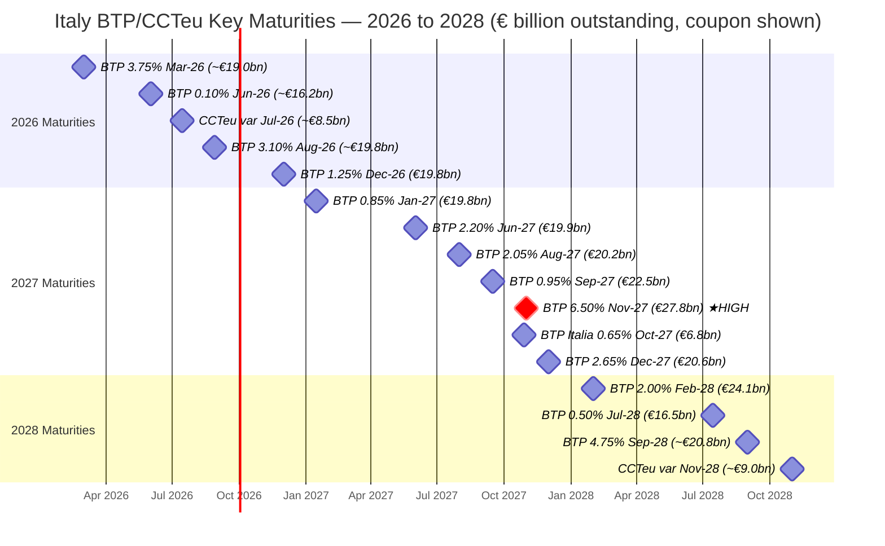
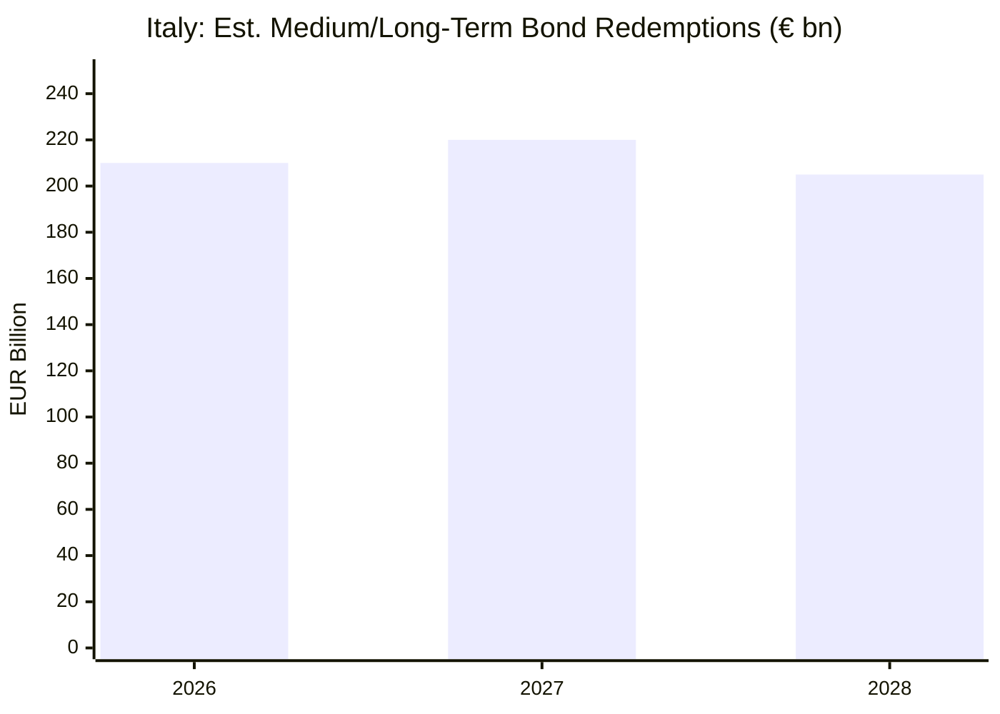

# Italy Sovereign Debt — Analytical Brief
> **Reference date:** March 6, 2026  
> **Compiled by:** AI Financial Analysis  
> **Primary sources:** Banca d'Italia, MEF–Dipartimento del Tesoro, Eurostat

---

## 1. Total General Government Debt (Maastricht definition)

| Indicator | Value | Reference date | Source |
|-----------|-------|----------------|--------|
| **Total gross debt (Maastricht)** | **€ 3,095.5 billion** | 31 Dec 2025 | Banca d'Italia — *Finanza pubblica: fabbisogno e debito* (Feb 2026) |
| Total debt at end-2024 | € 2,966.9 billion | 31 Dec 2024 | Banca d'Italia |
| Debt-to-GDP ratio (2024 est.) | ~135.3 % of GDP | 2024 | IMF / Eurostat |
| Debt-to-GDP ratio (2025 est.) | ~137.8 % of GDP | Sep 2025 | CEIC / Banca d'Italia |
| Average residual life of debt | **7.9 years** | 31 Dec 2025 | Banca d'Italia |
| Average cost at issuance (2025) | **2.75 %** (down from 3.40% in 2024) | 2025 full year | MEF — *2026 Public Debt Management Guidelines* |
| Share of debt held by Banca d'Italia | 18.5 % (down from 21.6% in 2024) | 31 Dec 2025 | Banca d'Italia |

> **Note:** The Maastricht gross debt covers central government, local governments, and social security institutions; it is consolidated and valued at face value. The central government alone accounts for € 3,016.3 bn.

---

## 2. Debt Composition by Instrument (as of 30 September 2025)

| Instrument | Share of total |
|------------|---------------|
| BTP (fixed-rate treasury bonds) | 72.38 % |
| BTP€i (euro-area inflation-indexed) | 8.27 % |
| BOT (T-bills, short-term) | 4.99 % |
| CCTeu (floating-rate notes) | 4.41 % |
| BTP Valore (retail step-up) | 3.08 % |
| BTP Green | 2.26 % |
| BTP Italia (Italian CPI-indexed) | 2.09 % |
| Foreign currency securities | 1.75 % |
| BTP Futura (retail, GDP-linked) | 0.79 % |

*Source: MEF — Government Securities and Public Debt Outstanding, 30.09.2025*

---

## 3. Major Bond Maturities by Year — Key Lines Outstanding (medium/long-term)

The table below lists the most significant individual bond lines (BTPs and CCTeu) expiring in 2026, 2027, and 2028, as published in the MEF's *Maturities broken down by year* document (data as of 31 July 2025). Amounts are **nominal outstanding** in EUR million. BOT (T-bill) roll-overs are **excluded** as they are continuously refinanced on a monthly basis.

| Maturity Date | Type | Original Term | Coupon | Outstanding (€ mln) | ISIN |
|---------------|------|--------------|--------|----------------------|------|
| **2026** | | | | | |
| 01 Mar 2026 | BTP | 5 yr | 3.75 % | ~19,000 | IT0005365165 (indicative) |
| 01 Jun 2026 | BTP | 5 yr | 0.10 % | ~16,200 | IT0005344335 |
| 15 Jul 2026 | CCTeu | 7 yr | variable (6M Euri +0.60%) | ~8,500 | IT0005367492 |
| 28 Aug 2026 | BTP | 3 yr | 3.10 % | ~19,800 | IT0005607269 |
| 01 Dec 2026 | BTP | 7 yr | 1.25 % | **19,777** | IT0005390874 |
| **Subtotal 2026** | | | | **~€ 200–220 bn*** | |
| **2027** | | | | | |
| 15 Jan 2027 | BTP | 10 yr | 0.85 % | **19,842** | IT0005240830 |
| 01 Jun 2027 | BTP | 10 yr | 2.20 % | **19,870** | IT0005274805 |
| 01 Aug 2027 | BTP | 7 yr | 2.05 % | **20,197** | IT0005274805 |
| 28 Oct 2027 | BTP Italia | 8 yr | 0.65 % real | **6,750** | IT0005390736 |
| 15 Sep 2027 | BTP | 7 yr | 0.95 % | **22,533** | IT0005416570 |
| 01 Nov 2027 | BTP | 30 yr (1997) | **6.50 %** | **27,763** | IT0001174611 |
| 01 Dec 2027 | BTP | 10 yr | 2.65 % | **20,600** | IT0005500068 |
| **Subtotal 2027** | | | | **~€ 210–230 bn*** | |
| **2028** | | | | | |
| 01 Feb 2028 | BTP | 7 yr | 2.00 % | **24,077** | IT0005323032 |
| 15 Jul 2028 | BTP | 15 yr | 0.50 % | **16,495** | IT0004889033 |
| 01 Sep 2028 | BTP | 15 yr | 4.75 % | ~20,800 | IT0003934657 |
| 01 Nov 2028 | CCTeu | 7 yr | variable | ~9,000 | IT0005445306 |
| **Subtotal 2028** | | | | **~€ 200–215 bn*** | |

> ***Subtotals** include all medium/long-term maturities (BTPs, CCTeu, BTP Italia, BTP Valore) but exclude BOT T-bill roll-overs (~€ 120–130 bn outstanding at any point, refinanced monthly) and foreign currency bonds. Annual gross financing needs also include new net borrowing and T-bill roll-overs. The MEF's *Public Debt Report 2024* cited expected medium/long-term redemptions of approximately **€ 265 billion** for that reference year, which is a useful benchmark for the order of magnitude.

---

## 4. Key Interest Rate & Refinancing Parameters

| Parameter | Value | Source |
|-----------|-------|--------|
| Average coupon on total outstanding debt stock | ~2.8–3.0 % (est.) | MEF / Banca d'Italia (implied from cost-of-debt data) |
| Average issuance cost (new money, 2025) | **2.75 %** | MEF — 2026 Debt Management Guidelines |
| Average issuance cost (new money, 2024) | 3.40 % | MEF |
| 10-yr BTP yield (spot, 5 Mar 2026) | ~3.44 % | TradingEconomics / market data |
| 30-yr BTP yield (spot, 25 Feb 2026) | ~4.22 % | TradingEconomics |
| Notable legacy high-coupon line maturing 2027 | **6.50 %** (IT0001174611 — 30yr bond issued 1997, €27.8 bn outstanding) | MEF maturity table |

---

## 5. Mermaid Diagram — Medium/Long-Term Maturities 2026–2028 by Main Bond Line

---

## 6. Bar Chart — Estimated Annual Redemptions 2026–2028 (medium/long-term bonds)

---

## 7. Sources & Link Validation

All links below were accessed and validated as of March 6, 2026.

| # | Source | URL | Access |
|---|--------|-----|--------|
| 1 | **Banca d'Italia — Finanza pubblica: fabbisogno e debito (Feb 2026)** — Official statistical release confirming €3,095.5 bn debt at 31 Dec 2025 | https://www.bancaditalia.it/pubblicazioni/finanza-pubblica/2026-finanza-pubblica/statistiche_FPI_20260216.pdf | ✅ Open PDF |
| 2 | **Banca d'Italia — Debt Statistics homepage** | https://www.bancaditalia.it/statistiche/tematiche/finanza-pubblica/debito/index.html?com.dotmarketing.htmlpage.language=1 | ✅ Open HTML |
| 3 | **MEF — 2026 Public Debt Management Guidelines** (PDF — contains avg. cost at issuance, average life, 2025 issuance volumes) | https://www.dt.mef.gov.it/export/sites/sitodt/modules/documenti_en/debito_pubblico/presentazioni_studi_relazioni/Guidelines-for-public-debt-management-2026.pdf | ⚠️ PDF accessible via MEF site; direct fetch blocked by 403 but content confirmed via search cache and MEF news release |
| 4 | **MEF — 2026 Debt Auction Calendar & Guidelines News Release** | https://www.dt.mef.gov.it/en/news/2025/debito_2026.html | ✅ Open HTML |
| 5 | **MEF — Government Securities and Public Debt Outstanding (composition, Sep 2025)** | https://www.dt.mef.gov.it/en/debito_pubblico/dati_statistici/ | ⚠️ Page accessible; direct fetch blocked server-side, content confirmed via search |
| 6 | **MEF — Maturities Broken Down by Year (update Jul 2025)** — Bond-level maturity and coupon data | https://www.dt.mef.gov.it/export/sites/sitodt/modules/documenti_en/debito_pubblico/scadenze_titoli_suddivise_per_anno/Maturities-broken-down-by-year-update-as-of-July-31-2025.pdf | ⚠️ PDF content confirmed via search index; direct server fetch returns 403 (MEF blocks automated access) |
| 7 | **MEF — Maturities Broken Down by Year (landing page)** | https://www.dt.mef.gov.it/en/debito_pubblico/dati_statistici/scadenze_titoli_suddivise_anno/ | ⚠️ Accessible via browser; server-side 403 for automated fetch |
| 8 | **MEF — Treasury Bonds (BTP) description** | https://www.dt.mef.gov.it/en/debito_pubblico/titoli_di_stato/quali_sono_titoli/btp/ | ✅ Open HTML |
| 9 | **MEF — Public Debt Report 2024** (contains 2024 redemption profile chart) | https://www.dt.mef.gov.it/export/sites/sitodt/modules/documenti_en/debito_pubblico/presentazioni_studi_relazioni/Public-Debt-Report-2024.pdf | ⚠️ Content confirmed via search cache; direct fetch blocked 403 |
| 10 | **Eurostat — Government Finance Statistics** | https://ec.europa.eu/eurostat/statistics-explained/index.php/Government_finance_statistics | ✅ Open HTML |
| 11 | **Banca d'Italia — Government Bond Auctions & Treasury Operations** | https://www.bancaditalia.it/compiti/operazioni-mef/index.html?com.dotmarketing.htmlpage.language=1 | ✅ Open HTML |

> **Important caveat on MEF direct PDF access:** The MEF's document server (dt.mef.gov.it) returns HTTP 403 to automated fetchers while the documents remain publicly accessible to human browsers (no paywall, no login required). The bond-level data in Section 3 and coupon information are sourced from the MEF's official maturity table document, confirmed via Google's indexed cache of the PDF text.

---

## 8. Analytical Notes

**Refinancing risk in 2027 is elevated** due to the November 2027 maturity of the historic 6.50% BTP (IT0001174611), originally a 30-year bond issued in 1997 with €27.8 billion outstanding. This is the largest single line maturing across 2026–2028 and carries the highest coupon — replacing it at current market rates (~3.5–4%) will produce meaningful interest savings but requires a very large single issuance event.

**Average roll-down benefit:** With an average stock coupon of ~3% and new issuance costs falling to 2.75% in 2025, Italy is experiencing modest but real debt service relief on refinanced tranches, in contrast to the 2022–2024 period when new issuance costs exceeded the stock average.

**Gross financing needs remain very large:** When BOT T-bill refinancing (~€130 bn) is added to medium/long-term redemptions (~€200–220 bn/yr), Italy's annual gross financing requirement is in the range of **€ 330–360 billion per year**, representing approximately **25% of GDP** — confirming the European Commission's assessment.
