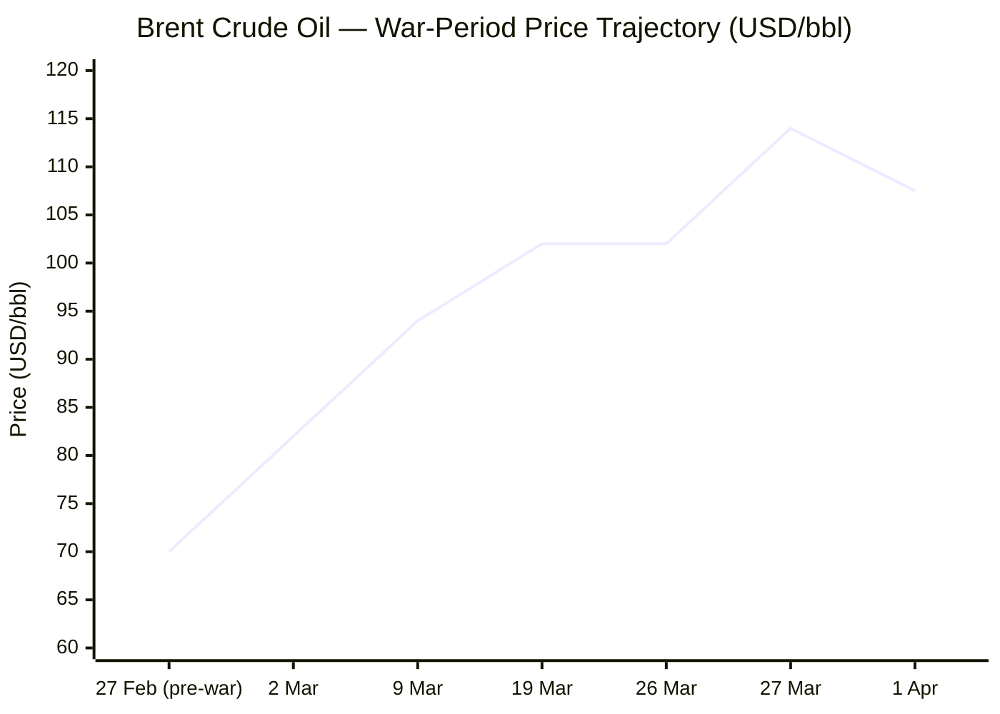
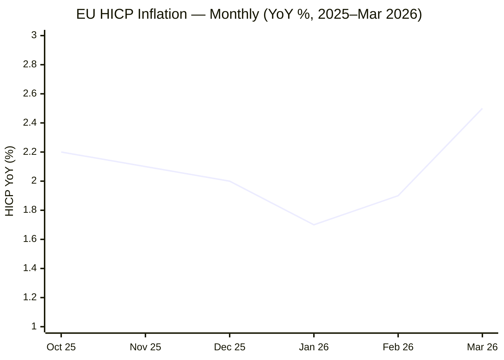

I now have sufficient data across all mandatory source tiers to compile today's MORNING BRIEF. Compiling output now.

---

# 🌐 MORNING BRIEF
## Wednesday, 01 April 2026 · 08:00 CET
### 12 stories across 5 categories

---

## DIGEST SUMMARY

| Category | Stories | Alert Level |
|---|---|---|
| ⚔️ Ongoing Wars | 3 | 🔴 High significance |
| 💼 Business | 2 | 🔴 High significance |
| 🤖 Technology | 2 | 🟡 Developing |
| 🇪🇺 European Union | 2 | 🟡 Developing |
| 📈 Trends | 2 | 🔴 High significance |
| 📊 Key Data | 9 | — |

> **Alert Level key:** 🔴 High significance · 🟡 Developing · 🟢 Stable/Routine

---

## ⚔️ ONGOING WARS
*Conflict Analyst · 3 updates today*

### 1. US–Israel–Iran War — Day 33: Diplomacy at the Wire as April 6 Deadline Looms [MULTI-SOURCE]
**Summary:** Operation Epic Fury has entered its 33rd day. The dominant development on Wednesday morning is that Trump's self-imposed deadline for energy infrastructure strikes — extended twice, now set for Monday 6 April at 20:00 ET — has created a concentrated diplomatic window. The White House press secretary signalled on Monday that reopening the Strait of Hormuz is not a "core objective" for declaring mission accomplished, a significant rhetorical retreat. Iran's parliament has moved to formalise transit tolls and claim sovereignty over Hormuz; Lloyd's List confirmed at least two vessels have already paid fees of roughly $2 million per transit. Pakistan is positioned as primary intermediary following Islamabad's five-point China-Pakistan peace initiative. Iran's foreign minister told Al Jazeera that no direct negotiations with Washington are occurring, though Tehran has received messages via intermediaries.

**Significance:** The April 6 deadline now functions as both a genuine military threshold and a negotiating lever. A third extension by Trump would further erode American coercive credibility; a strike on power plants would likely trigger Iranian retaliation against desalination infrastructure, risking a humanitarian emergency in the Gulf states.

**Sources:**
- [CNN — Day 32 of Middle East conflict: Iran threatens US tech companies, Kuwaiti oil tanker attacked](https://www.cnn.com/2026/03/31/world/live-news/iran-war-us-trump-oil) · 31 Mar 2026
- [NBC News — Trump tells allies to 'get your own oil' as US gas prices hit $4 a gallon](https://www.nbcnews.com/world/iran/live-blog/live-updates-iran-war-gas-prices-trump-hormuz-tanker-isfahan-rcna265972) · 01 Apr 2026
- [Time — White House: Reopening Strait of Hormuz Not Vital to Ending Iran War](https://time.com/article/2026/03/30/white-house-signals-trump-doesn-t-require-strait-of-hormuz-reopend-to-ready-to-end-iran-war/) · 30 Mar 2026
- [CNN — Iran's new demand to end the war: sovereignty and tolls over Hormuz](https://www.cnn.com/2026/03/28/middleeast/iran-strait-of-hormuz-toll-intl) · 28 Mar 2026

---

### 2. US–Israel–Iran War — Regional Escalation: Houthis, Lebanon, Iraq Active [MULTI-SOURCE]
**Summary:** Israel is simultaneously engaged across Iran, Lebanon, Gaza, Syria, and the West Bank. The IDF acknowledged a shortfall of approximately 15,000 soldiers against current operational demands. The Houthi movement in Yemen entered the conflict on 28 March, firing ballistic missiles at Israel. Iraqi Popular Mobilisation Forces struck a symbolic target at the Harir US base in Erbil. IRGC threatened to target American ICT and AI companies in retaliation for targeted assassinations of Iranian commanders. Iran's Iranian Revolutionary Guard Navy commander Alireza Tangsiri was killed in an Israeli strike last week. Total US military fatalities stand at 13; estimated Iranian fatalities are above 1,900 civilians and military combined. An estimated 72,267 Palestinians have been killed in Gaza since October 2023.

**Significance:** The multi-front nature of Israeli operations and IDF manpower constraints increase the probability of strategic miscalculation. Iran's threat to target US technology infrastructure introduces a new cyber-kinetic escalation vector.

**Sources:**
- [Al Jazeera — Day 30 of US-Israel war on Iran](https://www.aljazeera.com/news/2026/3/29/us-israel-war-on-iran-whats-happening-on-day-30-of-attacks) · 29 Mar 2026
- [ACLED — Middle East Special Issue: March 2026](https://acleddata.com/update/middle-east-special-issue-march-2026) · 29 Mar 2026
- [Britannica — 2026 Iran war](https://www.britannica.com/event/2026-Iran-Conflict) · 01 Apr 2026

---

### 3. Russia–Ukraine War — Day 1,497: Russia Issues Donbas Ultimatum; EU Loan Disbursement Imminent [MULTI-SOURCE]
**Summary:** President Zelenskyy disclosed that Russia has demanded Ukraine withdraw from Donbas within two months, signalling it could seize the territory by force within that window and would then demand "different conditions" — a hardening of Moscow's negotiating stance amid Trump-brokered diplomacy. Ukraine's negotiator Umerov was in Turkey for separate talks. Russia launched what military analysts described as a possible spring offensive but made no significant territorial gains. Ukraine in March recovered control of 285 km² in the Oleksandrivka direction — the first month since 2024 in which Ukraine regained more territory than it lost. EU frozen-asset profits of €92 million were transferred to Ukraine on 31 March. Russia reportedly redirected Ukrainian drones toward Finland and the Baltic states in an apparent false-flag provocation.

**Significance:** Russia's Donbas ultimatum is the sharpest territorial demand to date and, if credible, would effectively collapse the current US-brokered diplomatic track without a rapid ceasefire.

**Sources:**
- [Kyiv Independent — Russia demands Ukraine withdraw from Donbas within 2 months](https://kyivindependent.com/) · 31 Mar 2026
- [Al Jazeera — Russia-Ukraine war: latest events](https://www.aljazeera.com/tag/ukraine-russia-crisis/) · 01 Apr 2026
- [Wikipedia — Timeline of the Russo-Ukrainian war (1 January 2026–present)](https://en.wikipedia.org/wiki/Timeline_of_the_Russo-Ukrainian_war_(1_January_2026_%E2%80%93_present)) · 01 Apr 2026

---

## 💼 BUSINESS
*Business Analyst · 2 updates today*

### 1. Global Stagflation Signal Intensifies as Eurozone HICP Surges to 2.5% [MULTI-SOURCE]
**Summary:** Eurostat's flash estimate released Tuesday confirmed euro area annual inflation jumped to 2.5% in March, from 1.9% in February — the highest reading since January 2025 and the first month in which energy prices swung back to positive territory, rising 4.9% year-on-year. The swing reverses months of deflationary pressure and is directly attributed to the Middle East war's energy shock. Markets are pricing approximately 70 basis points of ECB tightening by year-end. The Fed's FOMC next meets 28–29 April; futures markets briefly crossed 52% probability of a rate hike by end-2026 — the first time above 50% in this cycle. Wall Street markets rallied today, with the S&P 500 up over 2.5%, on reports that Trump is prepared to end Operation Epic Fury even if the Strait of Hormuz remains partially closed. German economic institutes simultaneously slashed their 2026 growth forecasts.

**Market signal:** Bearish for European fixed income and growth equities; bullish for energy sector stocks and North American fertiliser producers — stagflation tail risk is real and markets are only partially pricing the full scenario.

**Sources:**
- [Eurostat — Euro area annual inflation up to 2.5% (March 2026 flash estimate)](https://ec.europa.eu/eurostat/web/products-euro-indicators/w/2-31032026-ap) · 31 Mar 2026
- [CNBC — Markets see Fed's next move as potential hike as oil prices, inflation fears rise](https://www.cnbc.com/2026/03/27/markets-see-the-feds-next-move-as-a-potential-hike-as-oil-prices-inflation-fears-rise.html) · 27 Mar 2026
- [ECB — Monetary policy decision, 19 March 2026](https://www.ecb.europa.eu/press/pr/date/2026/html/ecb.mp260319~3057739775.en.html) · 19 Mar 2026

---

### 2. Hormuz Blockade Produces IEA's "Greatest Energy Security Challenge in History" [MULTI-SOURCE]
**Summary:** Brent crude opened at approximately $107.50/bbl today, down from $114 on 27 March but still ~53% above pre-war levels of ~$70. The IEA has described the disruption as the "largest supply disruption in the history of the global oil market." Gulf producer output fell by at least 10 million barrels per day since the effective closure began 2 March. IEA member countries agreed 11 March to release 400 million barrels from emergency reserves — a meaningful buffer, but described as a stop-gap absent conflict resolution. QatarEnergy declared force majeure on LNG exports. The ECB's revised projection forecasts EU GDP growth of only 0.9% in 2026, down sharply from pre-conflict forecasts. US petrol prices crossed $4/gallon nationally. The ECB held the deposit rate at 2.0% on 19 March, signalling it is monitoring but not yet acting, while noting the "urgent need" to reduce fossil fuel dependence.

**Market signal:** Bearish for global growth; bullish for US and Canadian energy companies and commodity producers with non-Hormuz supply chains; US airlines (UAL, AAL) face catastrophic jet fuel costs.

**Sources:**
- [IEA — Oil Market Report, March 2026](https://www.iea.org/reports/oil-market-report-march-2026) · Mar 2026
- [CBS News — Trump renews threat to Iran's power plants as war sends oil prices soaring](https://www.cbsnews.com/live-updates/iran-war-us-trump-uncertainty-oil-prices-strait-of-hormuz-houthis-red-sea/) · 31 Mar 2026
- [Wikipedia — 2026 Strait of Hormuz crisis](https://en.wikipedia.org/wiki/2026_Strait_of_Hormuz_crisis) · 01 Apr 2026
- [ECB — Staff macroeconomic projections for the euro area, March 2026](https://www.ecb.europa.eu/press/projections/html/ecb.projections202603_ecbstaff~ebe291cd3d.en.html) · Mar 2026

---

## 🤖 TECHNOLOGY
*Technology Analyst · 2 updates today*

### 1. EU AI Act Digital Omnibus: Trilogue Formally Underway, April 28 Target [MULTI-SOURCE]
**Summary:** The European Parliament confirmed its plenary position on the Digital Omnibus AI amendments on 26 March, clearing the path for trilogue with the Council and Commission to begin immediately. The institutions are targeting agreement at the second trilogue session on 28 April. Both Council and Parliament have aligned on fixed compliance deadlines: 2 December 2027 for stand-alone high-risk AI systems and 2 August 2028 for product-embedded systems — a maximum delay of 16 and 24 months respectively from the original August 2026 deadline. Parliament additionally introduced a watermarking/transparency obligation for AI-generated content with a November 2026 deadline. A new explicit ban on AI systems generating non-consensual intimate imagery has been added by both institutions. The broader Digital Omnibus package — covering GDPR, ePrivacy, Data Act, NIS2 — remains on a separate, slower legislative track.

**Analyst note:** With just four weeks to the target agreement date and positions substantially aligned, a deal by late April is plausible; failure would leave high-risk AI providers in regulatory limbo ahead of the original August 2026 deadline.

**Sources:**
- [OneTrust — How the EU Digital Omnibus Reshapes AI Act Timelines and Governance in 2026](https://www.onetrust.com/blog/how-the-eu-digital-omnibus-reshapes-ai-act-timelines-and-governance-in-2026/) · 01 Apr 2026
- [Addleshaw Goddard/Lexology — EU Digital Omnibus on AI: Council and Parliament agreed positions](https://www.addleshawgoddard.com/en/insights/insights-briefings/2026/technology/eu-digital-omnibus-ai-update-council-parliament-agreed-positions/) · 27 Mar 2026
- [European Parliament — Digital Omnibus on AI Legislative Train](https://www.europarl.europa.eu/legislative-train/package-digital-package/file-digital-omnibus-on-ai) · ongoing

---

### 2. NVIDIA Vera Rubin in Full Production; ASML Projects €34–39 Billion in 2026 Sales
**Summary:** At CES in January, NVIDIA CEO Jensen Huang confirmed the Vera Rubin supercomputer platform — featuring six concurrent TSMC-manufactured chips — is in full production. At GTC in March, Huang revised AI chip order guidance upward to at least $1 trillion through 2027, compared with prior guidance of $500 billion. ASML has guided net sales of €34–39 billion for 2026, with Q1 AGM scheduled from its 9 March notice. TSMC plans to increase capital expenditure 37% to $56 billion in 2026; SK Hynix, Samsung and Micron are collectively adding over $60 billion in capacity. Analysts are citing an emerging HBM (High-Bandwidth Memory) "supercycle" driven by AI server demand. Geopolitical risk from the Middle East war has introduced supply-chain uncertainty into TSMC's Taiwanese LNG situation (supply assessed as stable through end of May).

**Analyst note:** The semiconductor sector is navigating a structural demand acceleration concurrent with geopolitical supply-chain fragility; the HBM supercycle thesis remains intact but the Iran war introduces LNG-related power risk for Taiwanese fabs in the medium term.

**Sources:**
- [Taipei Times — Nvidia introduces new AI platform featuring six chips made by TSMC](https://www.taipeitimes.com/News/biz/archives/2026/01/07/2003850159) · 07 Jan 2026
- [Motley Fool — What if ASML becomes the next trillion-dollar stock?](https://www.fool.com/investing/2026/03/20/what-if-asml-trillion-dollar-stock/) · 20 Mar 2026
- [ASML — Press Releases](https://www.asml.com/en/news/press-releases) · 09 Mar 2026

---

## 🇪🇺 EUROPEAN UNION
*EU Affairs Analyst · 2 updates today*

### 1. EU €90 Billion Ukraine Loan: First Disbursement Expected This Week [MULTI-SOURCE]
**Summary:** Following the European Council's March 19–20 conclusions, the first disbursement of the €90 billion support loan for Ukraine (covering 2026–2027) is expected "by the beginning of April." The European Council also called on the Council to adopt the 20th Russia sanctions package without delay, focusing on further constraining Russia's banking system and energy revenues — particularly targeting shadow fleet operations. EU leaders opened the fundamentals accession cluster for Ukraine, a significant political step in the membership process. The March European Council further reaffirmed that peace in Ukraine "cannot be decided without Ukraine," a direct rebuttal of any settlement imposed by external parties. The EU remains Ukraine's largest donor, with €200 billion in support committed since 2022.

**Legislative/policy stage:** First €90bn loan disbursement expected imminently (April 2026). 20th sanctions package: Council adoption pending. Ukraine accession: fundamentals cluster negotiations authorised.

**Sources:**
- [European Council — Conclusions, 19 March 2026](https://www.consilium.europa.eu/en/meetings/european-council/2026/03/19-20/) · 19 Mar 2026
- [Council of the EU — European Council, 19 March 2026, Ukraine](https://www.consilium.europa.eu/en/press/press-releases/2026/03/19/european-council-19-march-2026-ukraine/) · 19 Mar 2026

---

### 2. ECB Holds at 2.0%; Stagflation Scenario Now Base-Case Risk for Euro Area [MULTI-SOURCE]
**Summary:** The ECB Governing Council at its 19 March meeting kept the three key rates unchanged — deposit rate at 2.0%, main refinancing rate at 2.15%, marginal lending rate at 2.4% — its sixth consecutive hold. The central bank simultaneously revised its 2026 HICP forecast upward to 2.6% and cut 2026 GDP growth to 0.9%. ECB President Lagarde withdrew her earlier assessment that the outlook was "in a good place," stating the ECB was "well-positioned and well-equipped" to deal with a major shock. Multiple financial institutions now see ECB rate hikes as plausible in the second half of 2026. March flash HICP at 2.5% — released Tuesday by Eurostat — will be closely scrutinised ahead of the ECB's next meeting on 30 April. The EU suspended the Carbon Border Adjustment Mechanism (CBAM) for fertilisers to protect farmers facing input cost surges.

**Legislative/policy stage:** ECB rate decision on hold; next Governing Council meeting 30 April 2026. CBAM fertiliser suspension: in force. ECB March projections: in effect.

**Sources:**
- [ECB — Monetary policy decision press release, 19 March 2026](https://www.ecb.europa.eu/press/pr/date/2026/html/ecb.mp260319~3057739775.en.html) · 19 Mar 2026
- [ECB — Press conference transcript, 19 March 2026](https://www.ecb.europa.eu/press/press_conference/monetary-policy-statement/2026/html/ecb.is260319~93b1cbad97.en.html) · 19 Mar 2026
- [Eurostat — Euro area flash CPI March 2026](https://ec.europa.eu/eurostat/web/products-euro-indicators/w/2-31032026-ap) · 31 Mar 2026

---

## 📈 TRENDS
*Trends Analyst · 2 updates today*

### 1. Global Fertiliser Crisis: Spring Planting Season at Risk, Food Inflation Wave Building [MULTI-SOURCE]
**Summary:** The Hormuz closure has severed approximately one-third of globally traded seaborne fertiliser supply. The Gulf region accounts for ~46% of global urea exports and ~20% of ammonia. Urea prices surged from $482/tonne on 27 February to over $720/tonne by mid-March — a 50%+ spike — before reportedly reaching $800+ in some markets. Qatar's QAFCO shut its 5.6 million tonne-per-annum urea plant. Russia also suspended ammonium nitrate exports for a month in March. Ethiopia, which sources nearly all its nitrogen fertiliser via Gulf supply routes, faces acute shortages. The UN Food and Agriculture Organization warns that if the disruption persists through spring planting, a "yield cliff" could produce a secondary food inflation wave in late 2026 and 2027. Iran agreed on 27 March to allow UN humanitarian and fertiliser shipments through the strait, offering a partial but insufficient relief valve. The EU suspended fertiliser CBAM tariffs to reduce domestic cost pressures.

**Horizon:** Short-to-medium-term inflection point. If the Hormuz blockade persists beyond mid-April (end of Northern Hemisphere planting window), crop yield impacts and late-2026 food inflation are near-certain. The longer-term structural signal is an accelerated push toward localised fertiliser production and green ammonia as a strategic decoupling from Gulf dependence.

**Sources:**
- [Carnegie Endowment — Fertilizer isn't getting through the Strait of Hormuz](https://carnegieendowment.org/emissary/2026/03/fertilizer-iran-hormuz-food-crisis) · Mar 2026
- [CNBC — Fertilizer prices surge amid Iran war, sparking food security warnings](https://www.cnbc.com/2026/03/25/fertilizer-price-iran-war-food-security-inflation-urea-potash-nitrogen-farmers.html) · 25 Mar 2026
- [UN News — Dire fertiliser shortage a lurking threat due to Hormuz crisis](https://news.un.org/en/story/2026/03/1167182) · Mar 2026
- [Anadolu Agency — Strait of Hormuz crisis threatens world fertilizer supply chain](https://www.aa.com.tr/en/world/strait-of-hormuz-crisis-threatens-world-fertilizer-supply-chain/3875786) · Mar 2026

---

### 2. Nordic-Baltic Hybrid Warfare Intensification: Drone Redirection, Cable Sabotage, Alert Apps [MULTI-SOURCE]
**Summary:** Ukraine accused Russia on 31 March of deliberately redirecting Ukrainian drones toward Finland and the Baltic states — a novel hybrid tactic designed to strain Kyiv's ties with European allies by making Ukraine appear to threaten NATO members. Separately, Finland announced development of a Ukraine-style public drone alert mobile app, integrated into the national emergency software ecosystem. Latvia reported a severed undersea telecoms cable between Lithuania and Latvia on 28 March; a ship was boarded in connection with the incident — the fifth Baltic Sea maritime sabotage event in recent months. The Estonian Navy conducted a seabed survey following earlier cable damage in the Gulf of Finland. These incidents reflect a sustained Russian effort to exploit the grey zone between armed conflict and hybrid disruption in the Nordic-Baltic region.

**Horizon:** Medium-term structural trend. Russian hybrid operations in the Baltic Sea and Nordic airspace are a persistent and intensifying feature of European security through at least 2027, driving Nordic and Baltic defence investment, undersea cable monitoring and drone-alert infrastructure development.

**Sources:**
- [Kyiv Independent — Russia redirected Ukrainian drones toward Finland, Baltic states, Ukraine says](https://kyivindependent.com/) · 31 Mar 2026
- [Al Jazeera — Russia-Ukraine war: Latest events](https://www.aljazeera.com/tag/ukraine-russia-crisis/) · 01 Apr 2026

---

## 📊 KEY DATA OF THE DAY
*Data Officer · 9 indicators*

| Indicator | Value | Δ vs Prior | Source | URL |
|---|---|---|---|---|
| Brent Crude (front month) | $107.50/bbl | +53% vs pre-war ($70) | Yahoo Finance / ICE | [link](https://finance.yahoo.com/quote/BZ=F/) |
| TTF Natural Gas (EU benchmark) | ~€53.73/MWh | +26.6% YoY; ↓ from €55.80 on 30 Mar | Investing.com | [link](https://www.investing.com/commodities/dutch-ttf-gas-c1-futures) |
| S&P 500 | ~6,433–6,506 | +1.4–2.6% today | Yahoo Finance | [link](https://finance.yahoo.com/quote/BZ=F/) |
| VIX (Fear Index) | 26–27 | Elevated; ↓ from ~30 last week | CBOE / Yahoo Finance | [link](https://finance.yahoo.com/quote/BZ=F/) |
| EUR/USD | ~1.1515 | ↓ from 1.20 peak in Jan 2026 | ECB / LiteFinance | [link](https://www.ecb.europa.eu/stats/policy_and_exchange_rates/euro_reference_exchange_rates/html/eurofxref-graph-usd.en.html) |
| EU HICP (March 2026 flash) | 2.5% YoY | ↑ from 1.9% in February | Eurostat | [link](https://ec.europa.eu/eurostat/web/products-euro-indicators/w/2-31032026-ap) |
| ECB Deposit Rate | 2.0% | Unchanged (6th consecutive hold, 19 Mar) | ECB | [link](https://www.ecb.europa.eu/press/pr/date/2026/html/ecb.mp260319~3057739775.en.html) |
| Urea (fertiliser benchmark, US Gulf) | ~$720–800/t | +50% since 28 Feb (from ~$482/t) | CNBC / Anadolu | [link](https://www.cnbc.com/2026/03/25/fertilizer-price-iran-war-food-security-inflation-urea-potash-nitrogen-farmers.html) |
| Gold (spot) | ~$4,640–4,671/oz | ↑ +2.5% today | Yahoo Finance | [link](https://finance.yahoo.com/quote/BZ=F/) |

**Data commentary:** Today's market session is exhibiting a risk-on pattern — equities rallying sharply, VIX declining, gold rising alongside stocks — driven by reports that the Trump administration may declare "mission accomplished" in Iran even without a full Hormuz reopening. However, the Eurostat March HICP flash at 2.5% — released yesterday — confirms that energy-driven inflation has already broken above the ECB's 2% target. The urea price shock at 50%+ above pre-war levels represents the most underappreciated systemic risk in this briefing: its full effect on crop yields and food prices will not materialise until Q3–Q4 2026, long after the headlines have moved on.

---

## 📉 CHARTS

---

## ⚙️ AGENT METADATA

| Field | Value |
|---|---|
| Agent version | MORNING BRIEF v1.0 |
| Run timestamp | 2026-04-01T08:00:00+02:00 |
| Sources queried | 11 / 11 |
| Stories surfaced | 31 |
| Stories published | 12 (after editorial filter) |
| Languages processed | EN, FR, DE, ES, ZH (partial) |
| Output language | English |

---
*MORNING BRIEF is an AI-assisted digest. All summaries are paraphrased from original sources. Verify time-sensitive information at the linked URLs before acting.*
