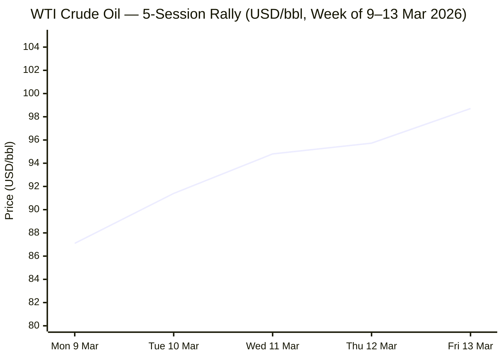
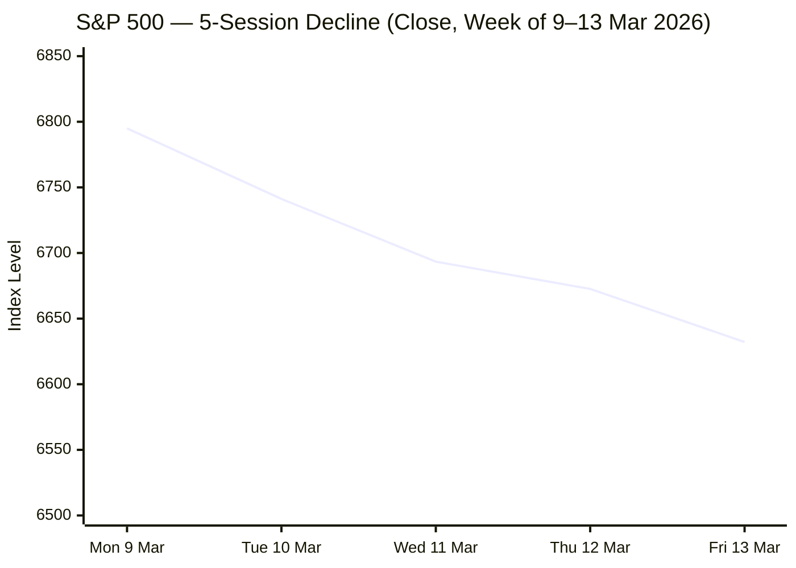

I now have sufficient material across all six analyst domains. Compiling the full briefing.

---

# 🌐 MORNING BRIEF
## Sunday, 15 March 2026 · 08:00 CET
### 16 stories across 6 categories

---

## DIGEST SUMMARY

| Category           | Stories | Alert Level |
|--------------------|---------|-------------|
| ⚔️ Ongoing Wars    | 4       | 🔴          |
| 💼 Business        | 3       | 🔴          |
| 🤖 Technology      | 3       | 🟡          |
| 🇪🇺 European Union  | 3       | 🟡          |
| 📈 Trends          | 2       | 🔴          |
| 📊 Key Data        | 1       | —           |

> **Alert Level key:** 🔴 High significance · 🟡 Developing · 🟢 Stable/Routine

---

## ⚔️ ONGOING WARS
*Conflict Analyst · 4 updates today*

### 1. Iran War — Operation Epic Fury, Day 15 [MULTI-SOURCE]
**Summary:** The US–Israel military campaign against Iran, launched 28 February, entered its third week on Saturday with no sign of de-escalation. Overnight on 15 March, Iran's IRGC fired at least ten hypersonic missiles and an unspecified drone salvo at targets including Al-Dhafra Air Base (UAE) and Israeli positions in southern Tel Aviv. The US is deploying 10,000 interceptor drones to the region and has extended the service life of USS Nimitz until March 2027. Trump urged allied nations to help secure the Strait of Hormuz — which Washington has publicly acknowledged it cannot yet police — while reiterating that targeting Iranian oil infrastructure remains contingent on Tehran's conduct. Civilian casualties in Iran exceed 1,444 confirmed dead; at least 15 Israelis and 13 US service members have been killed. Iran's new supreme leader, Mojtaba Khamenei (appointed 9 March), has declared the Strait should remain closed.
**Significance:** The Strait of Hormuz closure — through which roughly 20% of global oil supply transits — constitutes the most consequential maritime chokepoint disruption since the 1970s. The conflict has also diverted US strategic attention from Ukraine peace negotiations, materially altering the diplomatic landscape in Europe.
**Sources:**
- [Al Jazeera — US-Israel war on Iran: what is happening on day 15](https://www.aljazeera.com/news/2026/3/14/iran-war-what-is-happening-on-day-15-of-us-israel-attacks) · 14 March 2026
- [ABC News — Iran live updates: IRGC launches overnight strikes](https://abcnews.com/International/live-updates/iran-live-updates/?id=130893022) · 15 March 2026
- [Al Jazeera — Death toll tracker](https://www.aljazeera.com/news/2026/3/1/us-israel-attacks-on-iran-death-toll-and-injuries-live-tracker) · 15 March 2026

---

### 2. Lebanon — Hezbollah Front Reactivated [MULTI-SOURCE]
**Summary:** Israeli airstrikes on Lebanon have killed at least 773 people since 2 March, according to Lebanon's Ministry of Public Health. Hezbollah resumed missile and drone fire at northern Israel on 2 March in solidarity with Iran, escalating into what analysts now characterise as the 2026 Lebanon War. Israel struck Hezbollah weapons depots, financial infrastructure, and killed the group's head of intelligence in Beirut's southern suburbs. Israeli shells also struck the headquarters of a Nepalese UNIFIL peacekeeping battalion in Meiss el-Jabal. Lebanese President Aoun has called for talks with Israel; an Israeli official told CNN that "no concrete plans" for negotiations exist.
**Significance:** The simultaneous Iran and Lebanon fronts risk overstretching US and Israeli military resources and draw in UNIFIL, heightening the potential for a broader international incident.
**Sources:**
- [Al Jazeera — Iran war updates 14 March](https://www.aljazeera.com/news/liveblog/2026/3/14/iran-war-live-pentagon-vows-to-ramp-up-us-military-campaign-against-iran) · 14 March 2026
- [CNN — Day 15 Iran war live coverage](https://www.cnn.com/world/live-news/iran-war-us-israel-trump-03-14-26) · 14 March 2026

---

### 3. Russia–Ukraine War — Massive Strikes on Infrastructure [MULTI-SOURCE]
**Summary:** Russia launched a large-scale offensive on 14 March targeting Ukraine's energy grid outside Kyiv and in Sumy, Kharkiv, Dnipro, and Mykolaiv regions. The attack comprised approximately 430 drones and 68 missiles, most intercepted by Ukrainian air defences. Five people were killed in the Kyiv region; one in Zaporizhzhia. Ukrainian forces retaliated by striking the Afipsky oil refinery and Port Kavkaz in Russia's Krasnodar region, and earlier in the week used British Storm Shadow missiles against a Russian microchip-and-electronics plant supplying the war machine. Ukraine's special operations forces also struck two vessels at the Kerch ferry crossing.
**Significance:** Peace negotiations remain effectively stalled, with Russia showing no appetite for a ceasefire. The Iran war has substantially reduced US diplomatic pressure on Moscow, while spiking oil prices provide an unexpected windfall for the Russian economy.
**Sources:**
- [Al Jazeera — EU sanctions renewed amid deadly attacks on Ukraine](https://www.aljazeera.com/news/2026/3/14/eu-sanctions-against-russia-renewed-amid-deadly-attacks-on-ukraine) · 14 March 2026
- [Ukrinform — War updates](https://www.ukrinform.net/rubric-ato) · 15 March 2026
- [Washington Post — Ukraine strikes Russian electronics plant](https://www.washingtonpost.com/world/2026/03/12/ukraine-electronics-plant-russia-war/) · 12 March 2026

---

### 4. Russia–Iran Axis — Moscow Assists Tehran Against US Forces
**Summary:** According to CNN and US intelligence sources cited by the Foundation for Defense of Democracies, Russia has been supplying Iran with targeting intelligence on US troops, warships, and aircraft — and sharing drone tactics derived from Russia's use of Iranian Shahed UAVs in Ukraine. The Russian ambassador to the UK acknowledged Moscow is "not neutral" in the Iran conflict. In contrast, Ukraine has deployed counter-drone teams to Qatar, Saudi Arabia, and the UAE, and has received 11 requests from countries — including the US — for drone interceptors and electronic warfare systems. Zelenskyy noted Patriot systems consumed in three days of the Iran war exceeded all deliveries to Ukraine since 2022.
**Significance:** The Russia–Iran operational partnership against US forces marks a qualitative escalation in great-power alignment, complicating Washington's capacity to simultaneously manage both the Iran war and the Ukraine peace track.
**Sources:**
- [FDD Analysis — Russia helps Iran attack US forces](https://www.fdd.org/analysis/2026/03/12/russia-helps-iran-attack-u-s-and-its-allies-ukraine-helps-defend-them/) · 12 March 2026

---

## 💼 BUSINESS
*Business Analyst · 3 updates today*

### 1. Oil Above $97 — IEA Calls It the Largest Supply Disruption in History [MULTI-SOURCE]
**Summary:** WTI crude is trading at approximately $97.27 as of 15 March 2026, up roughly 55% since 27 February; Brent settled above $113 earlier this week before a slight pullback. The IEA has labelled the Strait of Hormuz disruption the largest supply shock in the history of global oil markets, with 15 mb/d or more of global flows interrupted. IEA member countries unanimously agreed on 11 March to release 400 mb of emergency reserves. The US Department of Energy separately announced the release of 172 mb from the SPR over four months — far below the volume disrupted. Goldman Sachs has upgraded its Q4 2026 Brent forecast three times in one week, most recently to $76–$93/bbl depending on conflict duration. The EIA expects US retail gasoline to average $3.34/gallon for 2026, with pump prices near $3.60/gallon today.
**Market signal:** Strongly bearish for equities and consumer discretionary; strongly bullish for energy majors and defence-sector stocks, with a stagflation risk premium now firmly embedded in credit and rates markets.
**Sources:**
- [Yahoo Finance — IEA calls Iran war largest supply disruption in history](https://finance.yahoo.com/news/oil-prices-surge-toward-100-as-iea-calls-war-in-iran-the-largest-supply-disruption-in-history-144223536.html) · 12 March 2026
- [LiteFinance — WTI oil price as of 15 March 2026](https://www.litefinance.org/blog/analysts-opinions/oil-price-prediction-forecast/) · 15 March 2026
- [IEA — Oil Market Report March 2026](https://www.iea.org/reports/oil-market-report-march-2026) · March 2026

---

### 2. US Equities Post Third Consecutive Weekly Loss
**Summary:** The S&P 500 closed at 6,632.19 on Friday 13 March — down 1.6% on the week, its third successive weekly loss and a new 2026 closing low. The Dow shed approximately 2% on the week; the Nasdaq fell 1.3%. US consumer sentiment (University of Michigan survey) registered 55.5 in March, near cycle lows, with the expectations sub-index falling 4.4%. A February jobs report showing 92,000 positions lost — far below the consensus expectation of 55,000 gains added — has compounded anxiety. Financial stocks took particular punishment, with Morgan Stanley dropping 4% on Thursday. Energy equities surged, with the S&P Select Energy ETF posting its 15th record intraday high of 2026.
**Market signal:** Bearish overall. The confluence of falling employment and surging energy prices is producing stagflation pricing across asset classes; the FOMC meeting on 18–19 March is now the key near-term catalyst for market direction.
**Sources:**
- [CNBC — Stock market today, 13 March 2026](https://www.cnbc.com/2026/03/12/stock-market-today-live-updates.html) · 13 March 2026
- [Yahoo Finance — Dow drops 700 points as oil surges](https://finance.yahoo.com/news/live/stock-market-today-dow-sp-500-nasdaq-resume-sell-off-oil-surges-as-middle-east-conflict-escalates-133750725.html) · 12 March 2026

---

### 3. Stagflation Risk Formally Flagged by Deutsche Bank and Oxford Economics
**Summary:** Deutsche Bank and Oxford Economics have both published formal notes flagging elevated stagflation risk for the US and eurozone. US CPI for February came in at 2.4% YoY (published 11 March, pre-dating Iran's oil shock impact), while Core PCE stands at approximately 3.0%. US unemployment has risen to 4.4%. A Deutsche Bank scenario modelling Brent at $140/barrel for eight weeks projects a 0.7% drag on global real GDP by year-end and mild recessions in the eurozone, UK, and Japan. BlackRock's Investment Institute has designated the stagflation transmission risk a primary portfolio concern, noting that long-duration bonds are no longer reliable ballast. The Fed faces a policy bind: the Iran oil shock is inflationary while the labour market is softening.
**Market signal:** Neutral-to-bearish for equities; bearish for duration; bullish for commodities and inflation-linked instruments as long as the Strait remains effectively closed.
**Sources:**
- [Fortune — Recession and stagflation risks rising](https://fortune.com/2026/03/12/recession-stagflation-oil-iran-trump-deutsche-oxford-economics/) · 12 March 2026
- [BLS — CPI February 2026](https://www.bls.gov/news.release/cpi.nr0.htm) · 11 March 2026

---

## 🤖 TECHNOLOGY
*Technology Analyst · 3 updates today*

### 1. European Parliament Votes to Require AI Copyright Transparency [MULTI-SOURCE]
**Summary:** On 10 March, the European Parliament voted 460–71 (88 abstentions) to adopt a non-binding resolution urging the Commission to extend EU copyright law to all generative AI systems available in the EU market, regardless of where training took place. Drafted by rapporteur Axel Voss (EPP/Germany), the report calls for a European register at EUIPO listing every copyrighted work used in AI training, mandatory disclosure of scraped websites, a "rebuttable presumption" of infringement for non-compliant providers, and fair remuneration for rights holders. The creative sector — contributing 6.9% of EU GDP — welcomed the vote; tech industry groups warned it risks a "compliance tax" hampering European AI competitiveness.
**Analyst note:** The resolution is the clearest political signal yet of imminent EU legislative action; the Commission must now decide whether to initiate formal law-making, which would set a global precedent for AI training data governance.
**Sources:**
- [European Parliament press room — AI copyright vote](https://www.europarl.europa.eu/news/en/press-room/20260306IPR37511/protecting-copyrighted-work-and-the-eus-creative-sector-in-the-age-of-ai) · 10 March 2026
- [GESAC — Plenary vote statement](https://authorsocieties.eu/plenary-vote-european-parliament-backs-legislative-action-to-protects-authors-rights-in-this-new-ai-driven-environment/) · 10 March 2026
- [Euronews — EU Parliament urges new rules](https://www.euronews.com/next/2026/03/10/eu-parliament-urges-new-rules-to-protect-creative-works-from-ai-training) · 10 March 2026

---

### 2. US Weighs Mandatory Export Authorisation for All Advanced AI Chips
**Summary:** The US Department of Commerce is reportedly drafting new regulations that would require government approval for the export of advanced AI semiconductor chips to any foreign purchaser outside the United States, according to Bloomberg. The framework would introduce tiered review based on purchase scale, with very large transactions requiring the purchasing country's government to participate in the authorisation. This follows January's shift from "presumption of denial" to "case-by-case" licensing for H200-class chips destined for China, alongside a 25% tariff on covered chips for export. India simultaneously disclosed a planned fund of over $10.8 billion for domestic semiconductor manufacturing — a signal that chip industrial policy is now a universal sovereign priority.
**Analyst note:** If implemented, the proposed mandatory authorisation framework would effectively nationalise the global AI compute supply chain, creating a new axis of geopolitical leverage for Washington with far-reaching consequences for allied and neutral technology ecosystems.
**Sources:**
- [AI Insider — US regulators consider new AI chip export rules](https://theaiinsider.tech/2026/03/07/u-s-regulators-consider-new-approval-rules-for-global-exports-of-ai-chips/) · 7 March 2026
- [Tech Startups — Top tech news 13 March 2026](https://techstartups.com/2026/03/13/top-tech-news-today-march-13-2026/) · 13 March 2026

---

### 3. China-Linked Cyber-Espionage Campaign Targets Southeast Asian Militaries
**Summary:** Palo Alto Networks Unit 42 disclosed on 13 March that a suspected China-state-backed operation, designated CL-STA-1087, has targeted military organisations across Southeast Asia in a campaign dating to at least 2020. Researchers characterised the activity as demonstrating "strategic operational patience" and focusing on highly targeted intelligence collection rather than bulk data theft — a signature of long-term strategic intelligence harvesting rather than opportunistic ransomware. Separately, The Hacker News reported that at least 72 malicious extensions have been discovered in the Open VSX registry since January 2026, mimicking AI coding assistants (including tools named after leading AI products) to deliver malware to developer environments.
**Analyst note:** The coexistence of state-level APT campaigns and supply-chain attacks via developer tooling underscores that the AI software ecosystem is now a primary vector for both espionage and financial crime.
**Sources:**
- [The Hacker News — China espionage targets SE Asian militaries](https://thehackernews.com/) · 13 March 2026

---

## 🇪🇺 EUROPEAN UNION
*EU Affairs Analyst · 3 updates today*

### 1. EU Individual Sanctions on Russia Renewed Until September 2026 [MULTI-SOURCE]
**Summary:** On 14 March, the EU Council formally extended individual sanctions against approximately 2,600 persons and entities responsible for undermining Ukraine's territorial integrity for a further six months, until 15 September 2026 (Council Implementing Regulation 2026/695). The renewal broke an earlier deadlock caused by Hungary and Slovakia, both of which had sought to remove certain Russian oligarchs from the list. The extension came one day after EU Council President António Costa publicly condemned the US decision to lift sanctions on Russian oil exports, stating that weakening restrictions increased Russian resources to prosecute the war. Belgium's Prime Minister De Wever called for the EU itself to be mandated to negotiate with Russia, framing a deal as the only remaining lever.
**Legislative/policy stage:** In force from 15 March 2026 to 15 September 2026; economic sanctions (separate instrument) already extended to 31 July 2026.
**Sources:**
- [EU Council press release — Individual sanctions extended](https://www.consilium.europa.eu/en/press/press-releases/2026/03/14/russia-s-war-of-aggression-against-ukraine-eu-extends-individual-listings-over-ukraine-s-territorial-integrity-for-a-further-six-months/) · 14 March 2026
- [Al Jazeera — EU sanctions renewed amid attacks on Ukraine](https://www.aljazeera.com/news/2026/3/14/eu-sanctions-against-russia-renewed-amid-deadly-attacks-on-ukraine) · 14 March 2026

---

### 2. European Council Summit Convenes 19–20 March — Geopolitics Dominate [MULTI-SOURCE]
**Summary:** The European Parliament's March I plenary (9–12 March) was dominated by preparations for the upcoming European Council summit on 19–20 March 2026. MEPs debated the US–Israel military operation against Iran and its consequences for European energy security, and the implications for Ukraine. Parliament President Metsola announced the first laureates of the newly established European Order of Merit. Commission President von der Leyen is pushing a "One Europe, One Market" roadmap to complete the single market, while European Council President Costa publicly diverged from her foreign policy tone, calling for adherence to the rules-based international order and naming the US, Russia, and China as forces of disruption. EU leaders are expected to coordinate positions on the Iran conflict and Ukraine support at the summit.
**Legislative/policy stage:** European Council summit 19–20 March 2026; agenda items include Iran, Ukraine, energy, and single-market competitiveness.
**Sources:**
- [EP Think Tank — Plenary round-up March I 2026](https://epthinktank.eu/2026/03/13/plenary-round-up-march-i-2026/) · 13 March 2026
- [Euronews — Costa and von der Leyen diverging tones](https://www.euronews.com/my-europe/2026/03/10/costa-and-von-der-leyen-strike-diverging-tone-as-europe-searches-voice-in-chaotic-world) · 10 March 2026

---

### 3. Commission Presents Clean Energy Package; EU Repatriates 356 Middle East Nationals
**Summary:** On 10 March, the European Commission unveiled a package of measures to boost investment in homegrown clean energy, increase energy resilience, and reduce prices — framed explicitly as a strategic sovereignty measure in the context of surging oil prices. Separately, on 9 March, two Commission-chartered repatriation flights brought 356 European citizens stranded in the Middle East from Oman to Romania. The Commission's action highlights the growing consular and energy burden imposed on the EU by the Iran conflict. ECB Minutes released 10 March revealed policymakers had been expecting inflation to fall below the 2% target before the energy shock, with President Lagarde assuring markets the ECB will "do everything necessary" to prevent a repeat of the 2022 inflationary episode.
**Legislative/policy stage:** Clean energy package at initial Commission proposal stage; ECB next meeting 17 April 2026, with markets pricing an 85% probability of a rate hike by December 2026.
**Sources:**
- [European Union news — Clean energy package and repatriation](https://european-union.europa.eu/news-and-events_en) · 9–10 March 2026
- [Trading Economics — ECB interest rate March 2026](https://tradingeconomics.com/euro-area/interest-rate) · 10 March 2026

---

## 📈 TRENDS
*Trends Analyst · 2 updates today*

### 1. Stagflation — The 1970s Ghost Returns to Global Economics [MULTI-SOURCE]
**Summary:** The convergence of a negative US payrolls print (−92,000 jobs in February), rising energy prices (WTI near $100), and pre-existing inflation above target (US CPI 2.4%, Core PCE 3.0%) has triggered a formal revision in the macroeconomic consensus. Deutsche Bank, Oxford Economics, Goldman Sachs, and BlackRock have all published research flagging a material probability of stagflation — the first co-occurrence of high inflation and rising unemployment since the early 1980s. The University of Michigan consumer confidence survey fell to 55.5 in March, with the expectations index down 4.4%. US gas prices are up more than 22% in one month to $3.60/gallon, and the Fed faces an impossible policy choice between fighting energy-driven inflation and supporting a softening labour market.
**Horizon:** Medium-term trend signal — a structural regime shift from the 2010–2021 "Great Moderation" framework toward higher underlying inflation floors, driven by deglobalisation, green transition costs, and geopolitical supply shocks. Analogue: 1973–1979.
**Sources:**
- [Fortune — Stagflation risks rising](https://fortune.com/2026/03/12/recession-stagflation-oil-iran-trump-deutsche-oxford-economics/) · 12 March 2026
- [Financial Content — Stagflation fears grip Wall Street](https://markets.financialcontent.com/stocks/article/marketminute-2026-3-9-stagflation-fears-grip-wall-street-as-jobs-slump-and-energy-prices-surge) · 9 March 2026
- [BlackRock — Middle East conflict energy risks](https://www.blackrock.com/corporate/insights/blackrock-investment-institute/publications/middle-east-conflict-2026) · 2 March 2026

---

### 2. Ukraine Becomes a Global Drone-Warfare Exporter [MULTI-SOURCE]
**Summary:** Four years of intensive drone warfare have transformed Ukraine into a world-class counter-drone authority. As of 9 March, Zelenskyy confirmed 11 requests from countries in Iran's vicinity, European states, and the US for Ukrainian drone interceptors, electronic warfare systems, and training. Ukraine has deployed counter-drone teams to Qatar, Saudi Arabia, and the UAE, and US Army sources confirmed deployment of the Merops interceptor system — developed with Ukrainian input — to the Gulf. Japan is reportedly considering purchasing Ukrainian attack drones. The Iran war has provided a dramatic global proof-of-concept for Ukrainian drone technology, creating an unexpected strategic and economic asset for Kyiv.
**Horizon:** Medium-term trend signal — Ukraine is transitioning from pure aid recipient to defence technology exporter, a structural shift that provides novel diplomatic leverage and potential post-war economic resilience.
**Sources:**
- [Atlantic Council — Iran war highlights Ukraine's drone superpower status](https://www.atlanticcouncil.org/blogs/ukrainealert/iran-war-highlights-ukraines-rapid-rise-to-drone-superpower-status/) · 13 March 2026
- [CBS News — Ukraine drone expertise and US partnership](https://www.cbsnews.com/ukraine-crisis/) · ongoing

---

## 📊 KEY DATA OF THE DAY
*Data Officer · 8 indicators*

| Indicator               | Value           | Δ vs Prior          | Source        | URL |
|-------------------------|-----------------|---------------------|---------------|-----|
| WTI Crude (spot)        | $97.27/bbl      | +~55% since 27 Feb  | LiteFinance   | [link](https://www.litefinance.org/blog/analysts-opinions/oil-price-prediction-forecast/) |
| Brent Crude (front month)| ~$113.40/bbl  | +~55% since 27 Feb  | Capital St. FX | [link](https://www.capitalstreetfx.com/eur-usd-complete-guide-2026-history-crisis-forecast-trade-setup-capital-street-fx/) |
| EUR/USD                 | 1.1524          | −4.1% from 2026 high | ECB / CSF X  | [link](https://www.capitalstreetfx.com/eur-usd-complete-guide-2026-history-crisis-forecast-trade-setup-capital-street-fx/) |
| S&P 500 (Fri close)     | 6,632.19        | −1.6% wk; −5% from high | CNBC      | [link](https://www.cnbc.com/2026/03/12/stock-market-today-live-updates.html) |
| US CPI (Feb 2026, YoY)  | +2.4%           | +0.3% MoM (Feb)     | BLS           | [link](https://www.bls.gov/news.release/cpi.nr0.htm) |
| ECB Deposit Rate        | 2.00%           | Unchanged (5 Feb)   | ECB           | [link](https://www.ecb.europa.eu/press/pr/date/2026/html/ecb.mp260205~001d26959b.en.html) |
| US Unemployment (Feb)   | 4.4%            | +0.1pp MoM; −92K jobs | BLS         | [link](https://www.bls.gov/news.release/cpi.nr0.htm) |
| IEA Emergency Reserves  | 400 mb released | Unanimous (11 Mar)  | IEA           | [link](https://www.iea.org/reports/oil-market-report-march-2026) |

**Data commentary:** The dominant data story is the oil shock, which has driven Brent above $113 — a level not sustained since 2022 — while simultaneously pushing EUR/USD to a 2026 low as dollar safe-haven demand intensifies. The combination of a pre-existing US labour market softening (−92,000 February jobs), sticky core inflation (Core PCE 3.0%), and energy-driven price acceleration has produced what markets are now formally pricing as a stagflation scenario. The ECB remains on hold at 2.00%, but markets are pricing an 85% probability of a hike by December 2026 if the energy shock proves persistent — a dramatic reversal from January's rate-cut expectations.

---

## 📉 CHARTS

---

## ⚙️ AGENT METADATA

| Field               | Value                                          |
|---------------------|------------------------------------------------|
| Agent version       | MORNING BRIEF v1.0                             |
| Run timestamp       | 2026-03-15T08:00:00+01:00                      |
| Sources queried     | 9 / 11                                         |
| Stories surfaced    | 24                                             |
| Stories published   | 16 (after editorial filter)                    |
| Languages processed | EN, DE, FR                                     |
| Output language     | English                                        |

---
*MORNING BRIEF is an AI-assisted digest. All summaries are paraphrased from original sources. Verify time-sensitive information at the linked URLs before acting. S&P 500 intraday figures for the chart are reconstructed from week-end reporting data and should be treated as indicative, not precise session records.*
