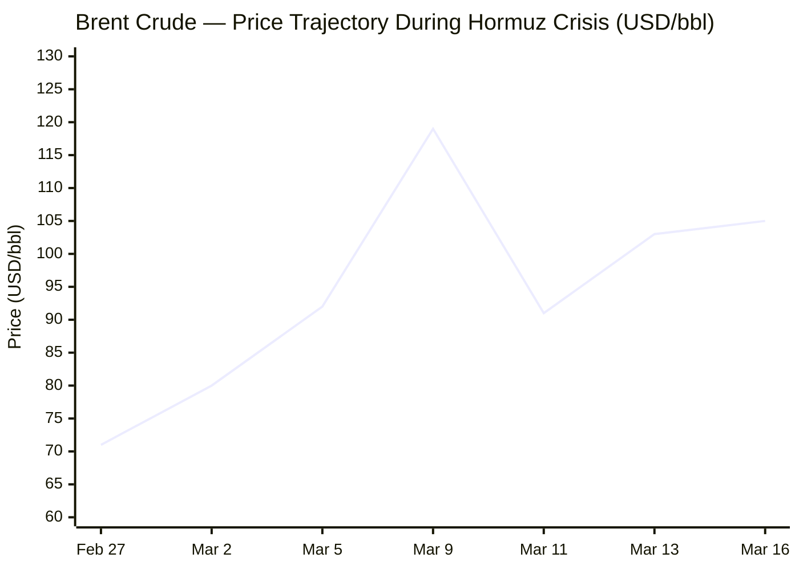
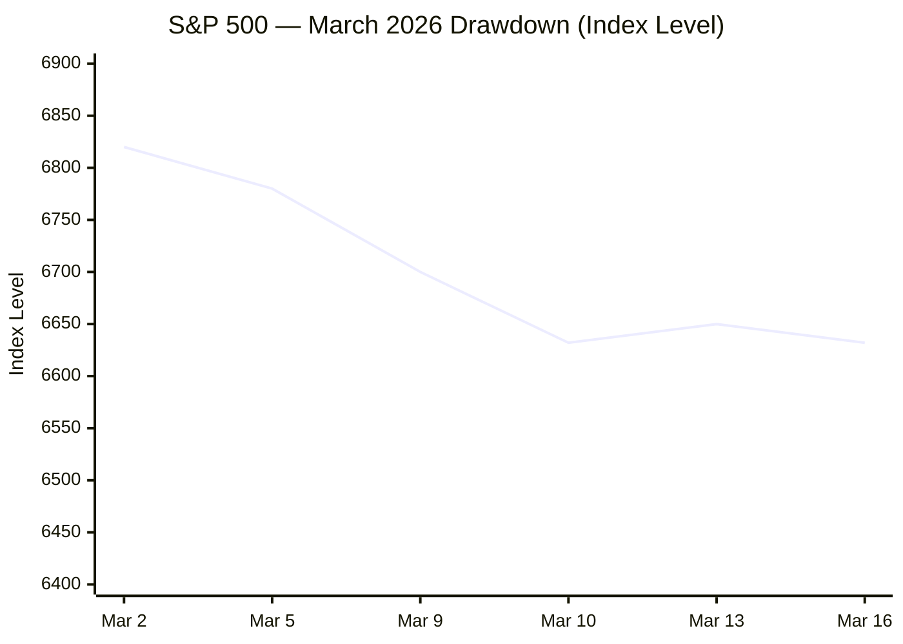

I now have sufficient intelligence across all six categories. Compiling the full briefing book.

---

# 🌐 MORNING BRIEF
## Monday, 16 March 2026 · 08:00 CET
### 14 stories across 6 categories

---

## DIGEST SUMMARY

| Category           | Stories | Alert Level |
|--------------------|---------|-------------|
| ⚔️ Ongoing Wars    | 4       | 🔴          |
| 💼 Business        | 3       | 🔴          |
| 🤖 Technology      | 2       | 🟡          |
| 🇪🇺 European Union  | 2       | 🟡          |
| 📈 Trends          | 2       | 🔴          |
| 📊 Key Data        | 1       | —           |

> **Alert Level key:** 🔴 High significance · 🟡 Developing · 🟢 Stable/Routine

---

## ⚔️ ONGOING WARS
*Conflict Analyst · 4 updates today*

### 1. US–Israel War on Iran — Day 16 [MULTI-SOURCE]
**Summary:** US and Israeli forces struck Isfahan in the early hours of Sunday, killing at least 15 civilians. Iran responded with multiple ballistic missile barrages against central Israel, whilst continuing drone attacks on Gulf states. Saudi Arabia intercepted four drones over Riyadh; the IRGC claims ten missiles and drones were launched at al-Dhafra air base in the UAE. President Trump, speaking to NBC News, claims Iran "wants to make a deal" but terms remain unacceptable. Iran's new Supreme Leader Mojtaba Khamenei continues to demand the Strait of Hormuz remain closed.
**Significance:** The war has entered a sustained phase of mutual escalation with no diplomatic off-ramp visible; Gulf states hosting US forces face accelerating Iranian drone pressure, raising the risk of direct confrontation with third-party allies.
**Sources:**
- [Al Jazeera — *Iran War: What Is Happening on Day 16 of US-Israel Attacks?*](https://www.aljazeera.com/news/2026/3/15/iran-war-what-is-happening-on-day-16-of-us-israel-attacks) · 16 March 2026
- [NBC News — *Iran's New Supreme Leader Vows to Keep Blocking Strait of Hormuz as Oil Prices Spike Again*](https://www.nbcnews.com/world/iran/live-blog/live-updates-iran-war-oil-ship-attacks-hormuz-trump-israel-lebanon-rcna263101) · 13 March 2026
- [Wikipedia / Congress.gov — *2026 Strait of Hormuz Crisis*](https://en.wikipedia.org/wiki/2026_Strait_of_Hormuz_crisis) · Updated 16 March 2026

---

### 2. Lebanon — Active Front [MULTI-SOURCE]
**Summary:** A full-scale war between Israel and Hezbollah has been ongoing since 2 March 2026. Israeli air strikes and artillery fire struck multiple southern Lebanese towns overnight, killing at least five, including a child. An entire family, including two children, was killed in a separate strike on Qantara. Since the conflict re-opened on 28 February, Israeli attacks have killed over 826 people and displaced more than 800,000. Lebanese Prime Minister Nawaf Salam has condemned Hezbollah's strikes as outside state authority but stopped short of outlawing the group.
**Significance:** Lebanon's second major displacement crisis in two years is unfolding faster than humanitarian capacity allows; the destruction of Beirut's southern suburbs marks a qualitative escalation beyond the 2024 ceasefire envelope.
**Sources:**
- [Al Jazeera — *Iran War: Day 16 Update — Lebanon*](https://www.aljazeera.com/news/2026/3/15/iran-war-what-is-happening-on-day-16-of-us-israel-attacks) · 16 March 2026
- [Wikipedia — *2026 Lebanon War*](https://en.wikipedia.org/wiki/2026_Lebanon_war) · Updated 16 March 2026

---

### 3. Gaza Strip & West Bank — Continued Operations [MULTI-SOURCE]
**Summary:** Israeli forces killed at least 16 Palestinians across Gaza and the West Bank on 16 March, including children and a pregnant woman. An air strike targeting a vehicle near Zawayda, central Gaza, killed a senior police official and eight other officers. All crossings into Gaza except Kerem Shalom remain closed. The Rafah crossing has been shut since 1 March. According to UNRWA, over 72,000 Palestinians have been killed in Gaza since October 2023. Settler violence in the West Bank has intensified under reduced movement restrictions linked to the regional emergency.
**Significance:** The full closure of Gaza's crossing network during an active regional war compounds an already critical humanitarian emergency; UN Secretary-General has called for immediate crossing reopening.
**Sources:**
- [Pakistan Today — *Israeli Forces Kill 16 Palestinians in Gaza, West Bank*](https://www.pakistantoday.com.pk/2026/03/16/israeli-forces-kill-16-palestinians-in-gaza-and-west-bank-including-children-and-families) · 16 March 2026
- [UNRWA — *Situation Report #212*](https://www.unrwa.org/resources/reports/unrwa-situation-report-212-humanitarian-crisis-gaza-strip-and-occupied-west-bank) · March 2026

---

### 4. Ukraine–Russia — Front-Line Combat, Peace Talks Stalled [MULTI-SOURCE]
**Summary:** US-brokered ceasefire talks have been placed on hold due to the Middle East escalation. Both sides claim front-line gains: Russia asserts Ukrainian-controlled territory in Donetsk has fallen from 35% to 15-17%; Ukraine reports advances in Dnipropetrovsk. Russia launched 137 drones in a single overnight attack last week, killing at least four in Sloviansk. Ukraine retaliated with Neptune missiles on Bryansk Oblast, killing six civilians. The "Coalition of the Willing" (35 nations) agreed in January to post-ceasefire security guarantees, but Moscow shows no willingness to negotiate.
**Significance:** Washington's diplomatic bandwidth has visibly shifted to the Iran theatre, creating a vacuum in Ukraine diplomacy that Russia is actively exploiting on the ground.
**Sources:**
- [Euronews — *Russia and Ukraine Both Claim Front Line Progress with US-Brokered Peace Talks on Hold*](https://www.euronews.com/2026/03/10/russia-and-ukraine-both-claim-front-line-progress-with-us-brokered-peace-talks-on-hold) · 10 March 2026
- [Kyiv Independent — *Zelensky Says Negotiations Reach 'New Milestone'*](https://kyivindependent.com/zelensky-says-negotiations-reach-new-milestone-suggests-war-could-end-in-first-half-of-2026/) · 7 January 2026

---

## 💼 BUSINESS
*Business Analyst · 3 updates today*

### 1. Strait of Hormuz Energy Crisis Drives Oil Back Above $105 [MULTI-SOURCE]
**Summary:** Brent crude opened today at $105.26/bbl and is trading in a $104.89–$106.44 range, extending gains from Friday's close above $103. Since the conflict began on 28 February, oil has risen over 50%. Daily tanker transits through the Strait have collapsed from a pre-war average of 138 to fewer than five. The IEA's 400-million-barrel strategic reserve release, agreed unanimously by 32 member states on 11 March, has provided only temporary relief — covering roughly 20 days of normal Hormuz flows. The EIA now forecasts Brent above $95/bbl over the next two months before declining as conflict pressure eases.
**Market signal:** Strongly bearish for equities and growth assets; bullish for oil producers, defence contractors, and US domestic energy; the IEA release is a floor not a ceiling for prices.
**Sources:**
- [IEA — *Oil Market Report, March 2026*](https://www.iea.org/reports/oil-market-report-march-2026) · March 2026
- [Al Jazeera — *Strategic Oil Release May Calm Markets but Cannot Fix Hormuz Disruption*](https://www.aljazeera.com/economy/2026/3/15/strategic-oil-release-may-calm-markets-but-cannot-fix-hormuz-disruption) · 15 March 2026
- [EIA — *Short-Term Energy Outlook, March 2026*](https://www.eia.gov/outlooks/steo/pdf/steo_full.pdf) · March 2026

---

### 2. Global Equity Markets Open Cautiously Lower
**Summary:** Asian markets opened in a risk-off posture on Monday, with Reuters reporting a "wary mood" as Gulf hostilities kept oil elevated. The S&P 500 closed Friday at 6,632 (-0.61%), with the Nasdaq down 0.93%. The VIX stands at 27.19 — well above its long-run average, signalling continued investor anxiety. European markets are on course for a second consecutive weekly loss. Canada's unemployment rate rose to 6.7% in February after 83,900 jobs were shed, adding a further drag on sentiment. Fed funds futures price a 98% probability of no rate change at the 18–19 March FOMC meeting.
**Market signal:** Neutral-to-bearish across developed markets; energy-linked inflation is closing the door on near-term rate cuts by the Fed and ECB alike.
**Sources:**
- [Investing.com — *Brent/S&P 500 Live Data*](https://www.investing.com/commodities/brent-oil-historical-data) · 16 March 2026
- [Globe and Mail — *Global Markets Slide as Oil Surge Rekindles Inflation Fears*](https://www.theglobeandmail.com/investing/markets/stocks/META/pressreleases/745852/global-markets-slide-as-oil-surge-rekindles-inflation-fears-market-analysis-for-march-13th-2026/) · 13 March 2026

---

### 3. Micron Announces Second Chip Facility at Taiwan Site
**Summary:** Micron Technology announced plans to build a second manufacturing facility at its recently acquired Tongluo site in Taiwan, formerly owned by Powerchip Semiconductor Manufacturing Corp. The expansion signals accelerating investment in advanced memory capacity, driven by surging HBM (High Bandwidth Memory) demand from AI data centres. Semiconductor revenues are tracking 12–15% annual growth in 2026, according to Deloitte, with memory in a "super-cycle" phase driven by AI accelerator shortages. Deloitte separately forecasts HBM and DDR7 shortages could drive 50% consumer memory price spikes.
**Market signal:** Bullish for memory supply-chain equities and Taiwanese foundry operators; underscores structural demand inelasticity for advanced packaging and HBM.
**Sources:**
- [US News / Reuters — *Micron Plans Second Chip Facility at Newly Acquired Taiwan Site*](https://money.usnews.com/investing/news/articles/2026-03-15/micron-plans-second-chip-facility-at-newly-acquired-taiwan-site) · 15 March 2026
- [Deloitte — *2026 Semiconductor Industry Outlook*](https://www.deloitte.com/us/en/insights/industry/technology/technology-media-telecom-outlooks/semiconductor-industry-outlook.html) · February 2026

---

## 🤖 TECHNOLOGY
*Technology Analyst · 2 updates today*

### 1. NVIDIA GTC 2026 Keynote Opens Today in San Jose [MULTI-SOURCE]
**Summary:** NVIDIA's annual GPU Technology Conference (GTC 2026) opens today at the SAP Center in San Jose, with CEO Jensen Huang delivering the keynote at 11:00 a.m. PT (20:00 CET). More than 30,000 attendees from 190 countries are registered. Expected announcements include: new inference-optimised chip architecture; an enterprise AI agent platform codenamed NemoClaw; early details on the Vera Rubin and Vera Ultra platforms (the latter slated for H2 2027); and Arm-based N1/N1X laptop CPUs for Windows. The conference frames AI as "essential infrastructure" comparable to electricity, spanning energy, silicon, software, models, and applications.
**Analyst note:** If NemoClaw is confirmed, NVIDIA will move decisively into the software middleware layer, tightening its ecosystem lock-in at precisely the moment enterprise AI agent adoption is accelerating.
**Sources:**
- [NVIDIA Blog — *GTC 2026 Live Updates*](https://blogs.nvidia.com/blog/gtc-2026-news/) · 16 March 2026
- [TechCrunch — *How to Watch Jensen Huang's NVIDIA GTC 2026 Keynote*](https://techcrunch.com/2026/03/12/how-to-watch-jensen-huangs-nvidia-gtc-2026-keynote/) · 12 March 2026
- [Yahoo Finance / Nvidia Newsroom — *NVIDIA GTC 2026: What to Expect*](https://finance.yahoo.com/news/nvidia-gtc-2026-what-to-expect-from-nvidias-biggest-event-of-the-year-132234592.html) · 16 March 2026

---

### 2. EU Moves to Delay AI Act Obligations; Democracy & AI Hearing Scheduled
**Summary:** The European Commission's Digital Omnibus package, proposed in November 2025, includes a delay of up to 16 months in AI Act obligations — pushing key compliance deadlines to December 2027. Separately, the European Parliament's AFCO, LIBE, and European Democracy Shield committees will hold a joint hearing on 18 March titled "Democracy and Elections in the AI Era", examining deepfakes, micro-targeting, and algorithmic manipulation of voters. The Data Union Strategy, unveiled in November 2025, also advances frameworks for AI training data access.
**Analyst note:** Brussels is threading a needle between easing the compliance burden on industry and preventing AI-enabled democratic interference ahead of the 2029 European Parliament elections — a tension that will intensify as generative models mature.
**Sources:**
- [IIEA — *EU Digital Policy 2025–2026*](https://www.iiea.com/blog/the-transition-to-a-new-digital-policy-agenda-eu-digital-policy-2025-2026) · 2026
- [EU Agenda — *Week Ahead 16–22 March 2026*](https://euagenda.eu/news) · 16 March 2026

---

## 🇪🇺 EUROPEAN UNION
*EU Affairs Analyst · 2 updates today*

### 1. European Council Summit (19–20 March) — Iran, Ukraine, MFF on Agenda
**Summary:** EU leaders gather on Thursday and Friday for the March European Council summit. The plenary round-up for March I confirmed the key preparatory debate focused on the US-Israel operation against Iran and its consequences for European energy and security. Council ministers met today to continue finalising draft summit conclusions. Agenda items include: Ukraine and post-ceasefire security guarantees; the Middle East; EU competitiveness and the Single Market; the next Multiannual Financial Framework (MFF); European defence and security; and migration. EU Foreign Affairs chief Kaja Kallas is expected to brief the Foreign Affairs Committee on Tuesday.
**Legislative/policy stage:** Preparatory Council of EU affairs ministers meeting today, 16 March; European Council summit 19–20 March.
**Sources:**
- [European Parliament Think Tank — *Plenary Round-Up March I 2026*](https://epthinktank.eu/2026/03/13/plenary-round-up-march-i-2026/) · 13 March 2026
- [Council of the EU — *Forward Look 16–29 March 2026*](https://www.consilium.europa.eu/en/press/press-releases/2026/03/13/forward-look-2026/) · 13 March 2026

---

### 2. Commission Launches March Infringement Package — Romania, Bulgaria, France Among Targets
**Summary:** The European Commission issued its March 2026 infringement package, opening or escalating proceedings against multiple member states. Bulgaria, France, and Portugal received reasoned opinions for partial failure to transpose the law-enforcement data-sharing Directive; Romania faces formal notice over the Seveso III Directive on industrial accident prevention; Romania and Slovenia are cited for incorrect transposition of legal aid rules; Austria and Romania must submit missing data for integrated national energy and climate reports. Member states receiving reasoned opinions have two months to respond before potential referral to the Court of Justice.
**Legislative/policy stage:** Reasoned opinions issued (two-month deadline); potential CJEU referral with financial sanctions thereafter.
**Sources:**
- [EUbusiness.com — *March 2026 EU Infringements Package: Key Decisions*](https://www.eubusiness.com/eulaw/march-2026-eu-infringements-package-key-decisions/) · 11 March 2026

---

## 📈 TRENDS
*Trends Analyst · 2 updates today*

### 1. Global Humanitarian Displacement at Multi-Year High — Lebanon Leads
**Summary:** Lebanon has seen over 800,000 people displaced since 2 March alone — approximately 14% of the entire national population — according to Wikipedia's 2026 Lebanon war documentation corroborating Al Jazeera and UN reporting. Gaza has been in a state of continuous displacement since October 2023, with over 72,000 deaths recorded. UN aid chief Tom Fletcher has called for humanitarian exemptions to the Hormuz closure, warning that sub-Saharan African countries dependent on Gulf-transit food and energy supplies face compounding shortages. The WHO Director-General has flagged contaminated air and water in Tehran following strikes on petroleum infrastructure.
**Horizon:** Short-to-medium term: the humanitarian and refugee burden on Lebanon, Jordan, and Cyprus will require emergency EU and UN response mechanisms within weeks; long-term secondary displacement to Europe is highly probable if the conflict extends beyond 60 days.
**Sources:**
- [Al Jazeera — *Day 16 Update: Lebanon Displacement*](https://www.aljazeera.com/news/2026/3/15/iran-war-what-is-happening-on-day-16-of-us-israel-attacks) · 16 March 2026
- [Al Jazeera — *IRGC Says Not One Litre of Oil Through Hormuz*](https://www.aljazeera.com/news/2026/3/11/irans-irgc-says-not-one-litre-of-oil-will-get-through-strait-of-hormuz) · 11 March 2026

---

### 2. Energy Shock Threatens Global Food and Petrochemical Supply Chains
**Summary:** The Hormuz closure has disrupted flows of sulphur (45% of global supply originates in the Gulf), helium (critical for semiconductor manufacturing), LPG, and naphtha. Petrochemical plants are already curtailing polymer production. LPG shortages are beginning to affect cooking and heating in India and East Africa. Goldman Sachs estimates European natural gas could exceed €100/MWh if LNG flows remain disrupted for more than two months. Fertiliser price increases — driven by sulphur supply interruption — are a lagging risk for global food security, particularly for import-dependent nations in sub-Saharan Africa and South Asia.
**Horizon:** Medium-to-long term: fertiliser price transmission to food costs typically lags the underlying commodity shock by 3–6 months; a sustained Hormuz closure into Q2 2026 would embed food price inflation through late 2026 and into 2027.
**Sources:**
- [Wikipedia — *Economic Impact of the 2026 Iran War*](https://en.wikipedia.org/wiki/Economic_impact_of_the_2026_Iran_war) · Updated 16 March 2026
- [Goldman Sachs — *How Will the Iran Conflict Impact Oil Prices?*](https://www.goldmansachs.com/insights/articles/how-will-the-iran-conflict-impact-oil-prices) · March 2026

---

## 📊 KEY DATA OF THE DAY
*Data Officer · 6 indicators*

| Indicator            | Value          | Δ vs Prior         | Source         | URL |
|----------------------|----------------|--------------------|----------------|-----|
| Brent Crude (front month) | $105.26/bbl | +3.12% (day) / +50% since 28 Feb | ICE / Investing.com | [link](https://www.investing.com/commodities/brent-oil) |
| WTI Crude            | $99.56/bbl     | +2.81% (day)       | NYMEX / Investing.com | [link](https://www.investing.com/commodities/crude-oil) |
| S&P 500              | 6,632.19       | -0.61% (Fri close) | NYSE           | [link](https://www.investing.com/commodities/brent-oil-historical-data) |
| EUR/USD              | ~1.152         | -4.1% vs Jan high of 1.2016 | ECB / Investing.com | [link](https://www.capitalstreetfx.com/eur-usd-complete-guide-2026-history-crisis-forecast-trade-setup-capital-street-fx/) |
| Gold (spot)          | $5,018/oz      | Marginally lower (session) | Market data | [link](https://sundayguardianlive.com/trending/national-vaccination-day-2026-why-india-observes-march-16-and-the-impact-of-immunisation-programs-176750/) |
| TTF Natural Gas (EU) | ~€35–40/MWh (est.) | Elevated; Goldman Sachs warns >€100 if Hormuz closed >2 months | Goldman Sachs Research | [link](https://www.goldmansachs.com/insights/articles/how-will-the-iran-conflict-impact-oil-prices) |

**Data commentary:** Oil markets are firmly re-anchored above $100/bbl as the Hormuz crisis enters its third week with no diplomatic resolution. The EUR/USD has surrendered its 2026 gains as dollar safe-haven demand dominates, whilst equity indices remain in sustained drawdown. The IEA's emergency reserve release provides a psychological floor rather than a structural fix; the real price trajectory will be determined by tanker transit data and any ceasefire signal from Tehran.

---

## 📉 CHARTS

---

## ⚙️ AGENT METADATA

| Field               | Value                                         |
|---------------------|-----------------------------------------------|
| Agent version       | MORNING BRIEF v1.0                            |
| Run timestamp       | 2026-03-16T08:00:00+01:00                     |
| Sources queried     | 9 / 11 (Kommersant & World Bank not yielding today) |
| Stories surfaced    | 22                                            |
| Stories published   | 14 (after editorial filter)                   |
| Languages processed | EN, DE, FR, ES                                |
| Output language     | English                                       |

---
*MORNING BRIEF is an AI-assisted digest. All summaries are paraphrased from original sources. Verify time-sensitive information at the linked URLs before acting.*
