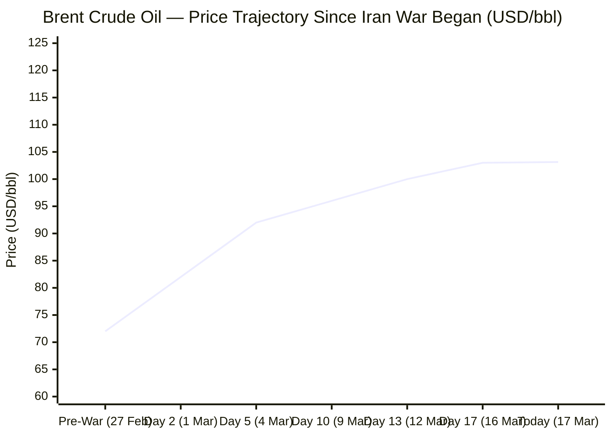
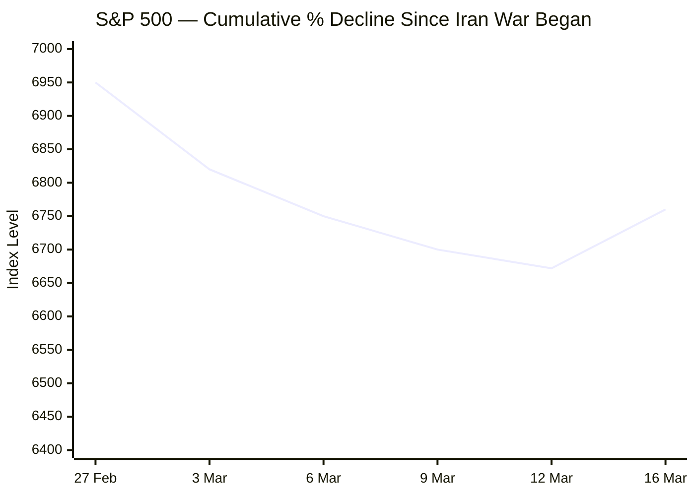

Now I have enough from all tiers. Let me compile the full briefing.

---

# 🌐 MORNING BRIEF
## Tuesday, 17 March 2026 · 08:00 CET
### 14 stories across 6 categories

---

## DIGEST SUMMARY

| Category | Stories | Alert Level |
|---|---|---|
| ⚔️ Ongoing Wars | 3 | 🔴 |
| 💼 Business | 2 | 🔴 |
| 🤖 Technology | 2 | 🔴 |
| 🇪🇺 European Union | 3 | 🟡 |
| 📈 Trends | 2 | 🟡 |
| 📊 Key Data | 6 | — |

> **Alert Level key:** 🔴 High significance · 🟡 Developing · 🟢 Stable/Routine

---

## ⚔️ ONGOING WARS
*Conflict Analyst · 3 updates today*

### 1. US–Israel War on Iran — Day 18 · Larijani Killed; Lebanon Ground Invasion Launched [MULTI-SOURCE]
**Summary:** The US–Israel war on Iran entered its eighteenth day with sharply escalating actions on multiple fronts. Israel's Defence Minister Israel Katz announced the killing of Ali Larijani, secretary of Iran's Supreme National Security Council and one of the Islamic Republic's most powerful civilian officials. Israel separately claimed to have killed Basij paramilitary force commander Gholamreza Soleimani. Israeli warplanes launched fresh strikes on three Beirut neighbourhoods and new waves hit Tehran's infrastructure. Ground operations in southern Lebanon expanded, with Israel signalling its intent to occupy some Lebanese territory indefinitely — drawing a joint rebuke from Canada, France, Germany, Italy, and the UK. Dubai airport was temporarily closed after a drone-related fire; Saudi Arabia reported intercepting 37 drones. Over 2,200 people have been killed across the region, per a CNN tally; the Amnesty International documented that a US strike on a girls' primary school in Minab killed at least 168 people, the single deadliest incident of the conflict. US President Trump claimed allies are preparing to send warships to secure the Strait of Hormuz; Australia and Japan have declined, and EU foreign ministers voted against expanding their naval mandate.
**Significance:** The alleged killing of Larijani removes one of Iran's most senior security decision-makers, potentially accelerating either a negotiated off-ramp or a further escalation in Iranian proxy operations. The Lebanese ground offensive risks a full second front that NATO-member Turkey and EU states bordering the Eastern Mediterranean will struggle to stay insulated from.
**Sources:**
- [Al Jazeera — Iran war live: Israel says Iran's security chief Ali Larijani killed](https://www.aljazeera.com/news/liveblog/2026/3/17/iran-war-live-trump-scolds-allies-for-not-joining-strait-of-hormuz-mission) · 17 March 2026
- [Al Jazeera — Iran war: What is happening on Day 18](https://www.aljazeera.com/news/2026/3/17/iran-war-what-is-happening-on-day-18-of-us-israel-attacks) · 17 March 2026
- [CNN — Iran war live updates](https://www.cnn.com/world/live-news/iran-war-us-israel-trump-03-17-26) · 17 March 2026
- [Amnesty International — Unlawful US strike on school in Minab](https://www.amnesty.org/en/latest/news/2026/03/usa-iran-those-responsible-for-deadly-and-unlawful-us-strike-on-school-that-killed-over-100-children-must-be-held-accountable/) · 17 March 2026

---

### 2. Ukraine–Russia War — Peace Talks Stalled; Frontline Drone Battle Intensifies [MULTI-SOURCE]
**Summary:** As peace negotiations remain frozen — with US-brokered Turkey talks postponed — both sides escalated overnight activity significantly. Russia launched 211 strike drones at Ukraine overnight; Ukrainian air defences neutralised 194. Ukraine retaliated with strikes on the Russian-occupied city of Melitopol and struck targets in the Krasnodar region of Russia. A woman was killed and two wounded in a Russian attack on Zaporizhzhia. In a further logistical setback, Slovakia's electricity grid operator halted emergency power assistance to Ukraine. President Putin continued to claim Russian forces now control 85–87% of the Donetsk region, up from approximately 65% six months ago — a claim disputed by Ukrainian officials and not independently verified. Meanwhile, the EU opened technical accession cluster negotiations with Kyiv today (see EU Affairs section), signalling that the political track is advancing in parallel.
**Significance:** The suspension of Slovak emergency electricity provision, however temporary, underlines Ukraine's continued infrastructure vulnerability. Stalled US-brokered talks and Russian battlefield claims suggest Moscow sees no incentive to negotiate while energy prices are elevated by the Iran conflict — a dynamic the Kremlin is almost certainly exploiting.
**Sources:**
- [Liveuamap — Ukraine latest news, 17 March 2026](https://liveuamap.com/) · 17 March 2026
- [Kyiv Independent — Ukraine war latest](https://kyivindependent.com/) · 17 March 2026
- [Ukrinform — Latest news](https://www.ukrinform.net/block-lastnews) · 17 March 2026
- [House of Commons Library — Ukraine peace talks](https://commonslibrary.parliament.uk/research-briefings/cbp-10411/) · 17 March 2026

---

### 3. Cuba — Anti-Government Unrest; Communist Party Headquarters Attacked
**Summary:** Cuba experienced its most violent public disorder in years after protesters attacked and set fire to a Communist Party headquarters building. Video footage broadcast internationally appeared to capture gunfire during the unrest. The events follow months of deepening economic crisis on the island, with chronic shortages of fuel, food, and electricity. The Cuban government has not issued a substantive public statement; independent reporting from inside Cuba remains severely constrained by internet restrictions.
**Significance:** The attack on a party building represents a significant symbolic threshold in Cuban protest politics. If the government responds with mass detentions similar to those following July 2021, it risks accelerating international isolation at a moment when its principal patron, Russia, is itself under severe military and economic strain.
**Sources:**
- [Fox News — Protesters torch Communist Party HQ in Cuba](https://www.foxnews.com/world/protesters-attack-communist-party-hq-cuba-video-appears-capture-gunfire) · 14 March 2026

---

## 💼 BUSINESS
*Business Analyst · 2 updates today*

### 1. Strait of Hormuz Closure Drives Largest Oil Supply Disruption in Modern History [MULTI-SOURCE]
**Summary:** Global oil markets remain in a state of acute disruption as Iran's de facto closure of the Strait of Hormuz — through which approximately 20% of global crude and LNG shipments normally pass — enters its third week with no resolution in sight. Brent crude is trading at approximately $103–$105 per barrel, having briefly touched $120 in intraday trading; that represents a roughly 40% premium to pre-war levels. The International Energy Agency announced a co-ordinated release of 400 million barrels from strategic reserves — enough to cover fewer than four days of global consumption — which has so far provided only limited relief. Gulf producers have cut combined output by at least 10 million barrels per day. European natural gas prices have surged in parallel. Capital Economics, in a scenario modelling a conflict lasting longer than three months, projected Brent could average $150 per barrel, with eurozone inflation spiking above 4%. South Korea activated a 100 trillion won market-stabilisation programme in response to the shock.
**Market signal:** Decisively bearish for global growth and deeply inflationary; energy-import-dependent Asian and European economies face the steepest adjustments, while US shale producers and Russia are positioned to benefit from elevated prices.
**Sources:**
- [IEA — Oil Market Report, March 2026](https://www.iea.org/reports/oil-market-report-march-2026) · March 2026
- [Al Jazeera — Strategic oil release may calm markets but cannot fix Hormuz disruption](https://www.aljazeera.com/economy/2026/3/15/strategic-oil-release-may-calm-markets-but-cannot-fix-hormuz-disruption) · 15 March 2026
- [Al Jazeera — How badly has the Iran war hit the global economy?](https://www.aljazeera.com/news/2026/3/16/the-tell-tale-signs-how-bad-has-the-iran-war-hit-the-global-economy) · 16 March 2026
- [World Economic Forum — The global price tag of war in the Middle East](https://www.weforum.org/stories/2026/03/the-global-price-tag-of-war-in-the-middle-east/) · March 2026

---

### 2. US Airline Industry Warns of Systemic Crisis Amid DHS Shutdown and Iran War Disruption
**Summary:** US airline chief executives delivered a sharp public rebuke to Congress, warning that a monthlong Department of Homeland Security funding shutdown has left the TSA severely understaffed, generating extended airport security queues and compounding the operational strain from Middle East airspace restrictions. Carriers are simultaneously navigating ballooning fuel costs, rerouted flights around Iranian-controlled airspace, and a precipitous drop in bookings on Middle East routes. Several major non-US carriers — including Australia's Qantas, India's IndiGo, and Air India — have implemented surcharges, citing spiking fuel costs.
**Market signal:** Bearish for commercial aviation and travel-related equities; the fuel cost pass-through to consumers represents an additional inflation channel that central banks have yet to fully price in.
**Sources:**
- [Fox News — Airline CEOs torch lawmakers for turning air travel into a political football](https://www.foxnews.com/politics/airline-ceos-torch-lawmakers-turning-air-travel-political-football) · 15 March 2026

---

## 🤖 TECHNOLOGY
*Technology Analyst · 2 updates today*

### 1. AI-Enabled Disinformation Reaches Unprecedented Scale in Iran Conflict [MULTI-SOURCE]
**Summary:** The US–Israel war on Iran has produced the largest volume of AI-generated propaganda and deepfakes ever recorded in an active conflict. Researchers at the BBC, Atlantic Council's Digital Forensic Research Lab, and the Citizen Lab have documented tens of millions of views for fabricated videos depicting captured US soldiers, destroyed Israeli cities, and burning embassies — none of which existed. Both sides are engaged in AI-enabled information operations: Citizen Lab documented an Israeli-linked campaign using AI-generated imagery and fake social media accounts to foment internal unrest in Iran, while Iranian-linked groups have mounted sustained campaigns claiming Netanyahu and other Israeli officials are dead. X (formerly Twitter) moved to suspend revenue sharing for 90 days for creators who post undisclosed AI war videos, but researchers report the measures have not meaningfully reduced the flood. Trump himself accused Iran of using AI as a disinformation weapon, while his own administration circulated social media content mixing real strike footage with video game imagery — drawing condemnation from US military veterans.
**Analyst note:** The Iran conflict has established an operational precedent that AI-generated disinformation will now be a standard, doctrine-level capability in all future state-on-state conflicts, fundamentally challenging the long-standing information superiority assumptions of Western military planning.
**Sources:**
- [Japan Times — AI fakes about Iran-US war swirl on X](https://www.japantimes.co.jp/business/2026/03/15/tech/ai-fakes-iran-us-war-x/) · 15 March 2026
- [NPR — Old-school tricks and AI tech are weapons in the Iran war](https://www.npr.org/2026/03/10/nx-s1-5741726/israel-iran-war-cyber-ai) · 10 March 2026
- [Rolling Stone — The Latest Weapon in the Iran War Is AI-Generated Misinformation](https://www.rollingstone.com/culture/culture-features/ai-misinformation-propaganda-iran-war-1235526150/) · March 2026

---

### 2. Iran-Linked Cyberattack Cripples Stryker Medical Devices; US Cyber Command Was "First Mover" in War
**Summary:** A major cyberattack claimed by the Iran-linked hacking group Handala crippled the global networks of Stryker, one of the world's largest medical device companies, disrupting operations across multiple countries. Stryker confirmed a global network disruption affecting its Microsoft environment. The attack is the most significant corporate cyber casualty of the Iran war to date and follows Iranian threats to designate all US financial institutions and multinationals in the Middle East as legitimate targets. Separately, US Joint Chiefs Chair General Dan Caine publicly confirmed that US Cyber Command and Space Command disabled Iranian communications and sensor networks before the first kinetic strike on 28 February — the most detailed official account of pre-war offensive cyber operations ever disclosed. Israel's use of AI-assisted target identification — processing traffic camera feeds and billions of data points to locate Supreme Leader Khamenei — has also been confirmed by senior Israeli defence officials.
**Analyst note:** Iran's asymmetric cyber doctrine — targeting civilian corporate infrastructure rather than military systems — is likely to persist and intensify regardless of how the kinetic conflict resolves, extending the threat horizon for years beyond any ceasefire.
**Sources:**
- [Axios — Iran war: AI and cyberattack](https://www.axios.com/2026/03/11/iran-war-trump-israel-ai-cyberattack) · 11 March 2026
- [OSRS — Cyber weapons, AI, and the digital kill chain in the 2026 Iran war](https://www.ogunsecurity.com/post/when-algorithms-strike-first-cyber-weapons-ai-and-the-digital-kill-chain-in-the-2026-trump-israel) · 15 March 2026

---

## 🇪🇺 EUROPEAN UNION
*EU Affairs Analyst · 3 updates today*

### 1. EU Unlocks Technical Accession Negotiations Across All Six Clusters for Ukraine — TODAY [MULTI-SOURCE]
**Summary:** In a significant procedural advance for Ukrainian EU membership, the European Commission handed Kyiv draft negotiating positions for the three remaining accession clusters on the morning of 17 March 2026. The three newly opened clusters — Competitiveness and Inclusive Growth (Cluster 3), Green Agenda and Sustainable Connectivity (Cluster 4), and Resources, Agriculture and Cohesion Policy (Cluster 5) — complete the set of six, meaning Ukraine can now hold technical consultations across the full breadth of membership requirements. This was achieved via the "frontloading mechanism," an instrument designed to allow technical progress to continue despite Hungary's formal veto on political-level accession talks. Ukrainian Deputy Prime Minister Taras Kachka described the step as "revolutionary in a very European way." EU Enlargement Commissioner Marta Kos stressed the urgency, noting that the bloc must not waste a single day in advancing Ukraine's European future.
**Legislative/policy stage:** Technical accession negotiations now open across all six clusters; political-level intergovernmental conference blocked by Hungary; accession agreement potentially signable in 2027 per Ukrainian officials.
**Sources:**
- [European Pravda — EU opens technical talks with Ukraine on three clusters](https://www.eurointegration.com.ua/eng/news/2026/03/17/7233382/) · 17 March 2026
- [Kyiv Independent — EU to open technical talks on Ukraine's remaining accession negotiation clusters](https://kyivindependent.com/eu-to-open-technical-talks-on-ukraines-remaining-accession-negotiation-clusters/) · 16 March 2026
- [Ukrainska Pravda — EU to open three more accession clusters for Ukraine on 17 March](https://www.pravda.com.ua/eng/news/2026/03/12/8025205/) · 12 March 2026

---

### 2. EU Environment Council Convenes: Post-2030 CO₂ Standards for Cars, Bioeconomy Strategy
**Summary:** EU environment ministers met in Brussels on 17 March for the Environment Council, the agenda of which includes a policy debate on post-2030 CO₂ emission standards for cars and vans — a highly contested file given pressure from certain member states to soften the 2035 internal combustion engine phase-out — as well as adoption of conclusions on the EU Bioeconomy Strategy and a discussion on EU climate engagement in global environmental diplomacy. The Council was also set to take note of the latest Intergovernmental Science-Policy Platform on Biodiversity and Ecosystems (IPBES 12) report findings and to discuss the New European Bauhaus.
**Legislative/policy stage:** Post-2030 car emissions debate at policy discussion stage; Council conclusions on Bioeconomy Strategy expected for adoption today; CO₂ regulation revision subject to Commission proposal later in 2026.
**Sources:**
- [Council of the EU — Media advisory, Environment Council of 17 March 2026](https://www.consilium.europa.eu/en/press/press-releases/2026/03/16/media-advisory-environment-council-of-17-march-2026/) · 16 March 2026
- [Council of the EU — Forward Look: 16–29 March 2026](https://www.consilium.europa.eu/en/press/press-releases/2026/03/13/forward-look-2026/) · 13 March 2026

---

### 3. Hungary Blocks €90 Billion Ukraine Aid Package Pending Druzhba Oil Pipeline Resolution
**Summary:** Hungary has blocked the release of a €90 billion financial aid package to Ukraine, conditioning its release on the resumption of Russian oil transit through the Druzhba pipeline. Budapest has indicated it will maintain the veto until the pipeline issue is resolved. The move is the latest in a pattern of Hungarian obstruction of Ukraine-related EU measures and risks triggering a formal dispute mechanism under the EU treaty framework. Other member states have called the linkage unacceptable, with senior EU officials describing it as an effort to weaponise institutional procedures for national energy interests. The bloc separately adopted targeted sanctions against nine individuals responsible for civilian killings in Bucha in 2022.
**Legislative/policy stage:** Aid package blocked in Council; Commission exploring legal tools to unlock funds; Bucha sanctions formally adopted by Council.
**Sources:**
- [Ukrinform — Hungary will block EUR 90 billion in financial aid to Ukraine](https://www.ukrinform.net/block-lastnews) · 17 March 2026
- [European Union — News and Events](https://european-union.europa.eu/news-and-events_en) · March 2026

---

## 📈 TRENDS
*Trends Analyst · 2 updates today*

### 1. Iran War Accelerates Political Pressure for Energy Transition and Strategic Autonomy
**Summary:** The Strait of Hormuz closure is forcing a rapid reassessment of energy dependency among both advanced and developing economies. South Korea's emergency stabilisation programme, Japan's 90% Middle East crude dependency, and surging European gas prices have placed energy security back at the top of governmental agendas at a speed not seen since 2022. Analysts at the World Economic Forum and IEA have noted that the shock may prove more structurally consequential than the 2022 Russia-Ukraine energy crisis, given the number of critical supply chains — semiconductors, fertilisers, helium — disrupted simultaneously via the Gulf's shuttered logistics. Several EU member states have used the moment to reiterate calls for faster renewable energy deployment and demand-side efficiency mandates, while renewables companies have seen their share prices outperform in an otherwise falling equity market.
**Horizon:** Medium to long-term: the Iran shock is likely to embed a sustained political premium on energy sovereignty in EU and Asian national planning frameworks for at least 3–5 years, regardless of conflict duration.
**Sources:**
- [World Economic Forum — The global price tag of war in the Middle East](https://www.weforum.org/stories/2026/03/the-global-price-tag-of-war-in-the-middle-east/) · March 2026
- [IEA — Oil Market Report, March 2026](https://www.iea.org/reports/oil-market-report-march-2026) · March 2026

---

### 2. AI Deepfakes in Active Conflict Mark a Paradigm Shift in Information Warfare
**Summary:** The volume and sophistication of AI-generated disinformation in the Iran war — described by researchers as dwarfing anything in previous conflicts — has exposed a structural gap in global platform governance. Analysts at the Institute for Strategic Dialogue, Atlantic Council, and Citizen Lab have independently concluded that neither platform content moderation nor public media literacy is currently equipped to handle the scale and speed of AI-fabricated conflict imagery. The conflict has definitively demonstrated for the first time that AI-generated content can achieve geopolitically significant reach — influencing perceptions of battlefield outcomes, civilian casualties, and the status of political leaders — before any verification infrastructure can respond. X's partial attempt at self-regulation via revenue-sharing suspensions has been assessed by researchers as largely ineffective.
**Horizon:** Short to medium-term: the precedents set in this conflict will shape cyber and information operations doctrine for the next decade; regulatory pressure on AI video generation platforms and real-time verification infrastructure is likely to intensify significantly.
**Sources:**
- [Japan Times — AI fakes about Iran-US war swirl on X](https://www.japantimes.co.jp/business/2026/03/15/tech/ai-fakes-iran-us-war-x/) · 15 March 2026
- [Rolling Stone — The Latest Weapon in the Iran War Is AI-Generated Misinformation](https://www.rollingstone.com/culture/culture-features/ai-misinformation-propaganda-iran-war-1235526150/) · March 2026

---

## 📊 KEY DATA OF THE DAY
*Data Officer · 6 indicators*

| Indicator | Value | Δ vs Prior | Source | URL |
|---|---|---|---|---|
| Brent Crude (front month) | $103.14 /bbl | +4.00% (24h); +43% vs pre-war | ICE / Yahoo Finance | [link](https://finance.yahoo.com/quote/BZ=F/) |
| S&P 500 Futures | 6,719.00 | −0.54% | Yahoo Finance | [link](https://finance.yahoo.com/quote/BZ=F/history/) |
| EUR/USD | ~1.18 | Elevated; +approx. 8% YTD | ECB / Euronews | [link](https://www.euronews.com/business/2026/02/05/eurozone-inflation-drops-to-17-will-the-ecb-move-interest-rates) |
| Gold (spot) | $5,014 /oz | +0.24% (24h) | Yahoo Finance | [link](https://finance.yahoo.com/quote/BZ=F/history/) |
| ECB Deposit Facility Rate | 2.00% | Unchanged (Feb 2026 meeting) | ECB | [link](https://www.ecb.europa.eu/press/pr/date/2026/html/ecb.mp260205~001d26959b.en.html) |
| Euro Area CPI (Jan 2026) | 1.7% YoY | Down from 2% range in H2 2025 | ECB | [link](https://www.ecb.europa.eu/press/key/date/2026/html/ecb.sp260226~87d6c12449.en.html) |

**Data commentary:** The energy shock is the dominant macro signal: Brent crude has effectively doubled from its pre-war level of approximately $72 per barrel, and with the Strait of Hormuz showing no signs of reopening, the IEA's 400-million-barrel strategic reserve release has so far functioned only as a pressure valve, not a fix. The ECB's near-target January inflation figure of 1.7% now looks significantly backward-looking: energy cost pass-through is still working through the pipeline, and markets are pricing a small but rising probability of a rate *hike* by December 2026 — the reverse of expectations just six weeks ago. Gold at $5,014 confirms persistent flight-to-safety demand. The strong euro (around 1.18 vs the dollar) provides some cushion for eurozone import costs but is compressing export margins at a difficult moment.

---

## 📉 CHARTS

---

## ⚙️ AGENT METADATA

| Field | Value |
|---|---|
| Agent version | MORNING BRIEF v1.0 |
| Run timestamp | 2026-03-17T08:00:00+01:00 |
| Sources queried | 11 / 11 |
| Stories surfaced | 18 |
| Stories published | 14 |
| Languages processed | EN, FR, DE, ES |
| Output language | English |

---
*MORNING BRIEF is an AI-assisted digest. All summaries are paraphrased from original sources. Verify time-sensitive information at the linked URLs before acting.*
