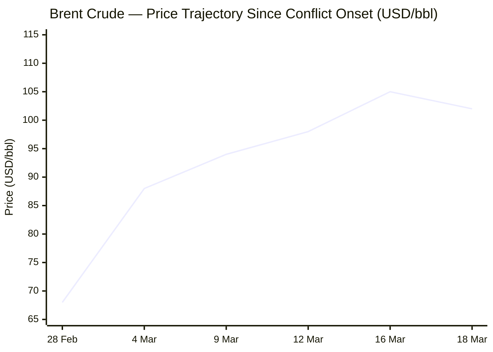
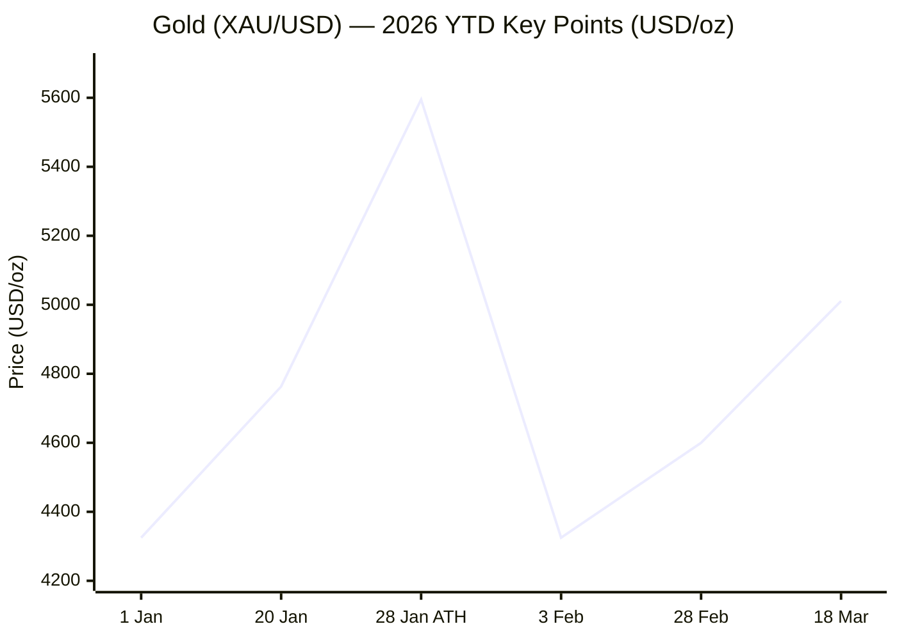

---

# 🌐 MORNING BRIEF
## Wednesday, 18 March 2026 · 08:00 CET
### 11 stories across 6 categories

---

## DIGEST SUMMARY

| Category          | Stories | Alert Level |
|-------------------|---------|-------------|
| ⚔️ Ongoing Wars   | 2       | 🔴 |
| 💼 Business       | 2       | 🔴 |
| 🤖 Technology     | 2       | 🟡 |
| 🇪🇺 European Union | 2       | 🟡 |
| 📈 Trends         | 2       | 🔴 |
| 📊 Key Data       | 7       | — |

> **Alert Level key:** 🔴 High significance · 🟡 Developing · 🟢 Stable/Routine

---

## ⚔️ ONGOING WARS
*Conflict Analyst · 2 updates today*

### 1. US–Israel War on Iran — Day 18: Larijani Killed; Iran Retaliates Against Israel [MULTI-SOURCE]

**Summary:** Iran's Supreme National Security Council chief Ali Larijani was killed in an Israeli strike on Tuesday, alongside his son and members of his security detail — one of the most consequential leadership eliminations since the conflict began on 28 February. Iran confirmed the killing and vowed revenge. Overnight, Iranian ballistic missiles struck central Israel, killing two people in Ramat Gan. The US, simultaneously, dropped 5,000-lb guided bombs on Iranian missile sites along the Strait of Hormuz. A US warship carrying Marines was reported approaching the Malacca Strait en route to the theatre. The US State Department issued a worldwide directive to all diplomatic posts to immediately review security postures. Cumulative casualties since 28 February: at least 1,444 killed and 18,551 injured inside Iran; 15 dead in Israel; 13 US service members killed; 20+ fatalities across Gulf states.

**Significance:** The targeted elimination of Larijani — Iran's top security decision-maker — dramatically degrades Tehran's command capacity, but risks forcing the new leadership under Mojtaba Khamenei into maximalist retaliation. With the Strait of Hormuz effectively closed and a US marine force now in transit, the risk of horizontal escalation into a broader Gulf theatre is at its highest point since hostilities commenced.

**Sources:**
- [CNN — Day 18 live: Iran's top security chief Larijani killed; strikes on Israel continue](https://www.cnn.com/world/live-news/iran-war-us-israel-trump-03-17-26) · 18 March 2026
- [ABC News/AP — Iran live updates: Trump says US doesn't 'need' NATO allies](https://abc7news.com/live-updates/iran-war-live-updates-israel-steps-operation-lebanon-trump-says-countries-help-strait-hormuz/18721484/) · 18 March 2026
- [Al Jazeera — US-Israel attacks on Iran: Death toll and injuries live tracker](https://www.aljazeera.com/news/2026/3/1/us-israel-attacks-on-iran-death-toll-and-injuries-live-tracker) · 18 March 2026

---

### 2. Russia–Ukraine War: Kyiv Targets Moscow for Fourth Consecutive Day; Zelensky Signs UK Drone Deal [MULTI-SOURCE]

**Summary:** Russia launched 178 drones at Ukraine overnight; Ukrainian air defences intercepted 154. Ukrainian drones struck Moscow for a fourth consecutive day, with Sergei Shoigu — Russia's former defence minister and current Security Council secretary — warning that "no Russian region can feel safe." President Zelensky signed a significant drone supply and production agreement with the United Kingdom during a visit to London on 17 March, describing it as an "important step" for Ukraine's defence. Separately, 201 Ukrainian military personnel are now deployed to the Middle East assisting US and allied forces in countering Iranian drone attacks — a figure Zelensky confirmed follows 11 formal partner requests. Russian forces recorded advances in Kostiantynivka and the Pokrovsk axis. Russian losses stand at approximately 1,282,570 total casualties since February 2022.

**Significance:** Zelensky's drone deal with the UK — and the export of Ukrainian counter-drone expertise to the Gulf — signals Kyiv's transition toward a dual-theatre strategic posture, leveraging its battlefield innovation as diplomatic currency while sustaining pressure on Russia.

**Sources:**
- [Kyiv Independent — Ukraine war latest: Ukraine targets Moscow with drones for 4th consecutive day](https://kyivindependent.com/) · 17–18 March 2026
- [The Guardian — Trump's call for allied deployment to Strait of Hormuz meets muted response](https://www.theguardian.com/world/2026/mar/15/uk-china-japan-countries-debating-strait-of-hormuz-ships-iran-you-now) · 15 March 2026
- [Ukrinform — War: Russia suffers 1,710 casualties in past 24 hours](https://www.ukrinform.net/rubric-ato) · 18 March 2026

---

## 💼 BUSINESS
*Business Analyst · 2 updates today*

### 1. Oil Dips Below $103 on Iraq–Kurdistan Pipeline Deal; Hormuz Disruption Remains Historic [MULTI-SOURCE]

**Summary:** Brent crude eased below $103 per barrel on Wednesday after Iraq and its Kurdistan Regional Government reached an agreement to resume oil exports via the Ceyhan pipeline to Turkey's Mediterranean coast — a route bypassing the blockaded Strait of Hormuz. WTI was trading near $95. The partial relief follows a dramatic 3% rise on Tuesday triggered by Larijani's killing. The IEA characterises this as the largest oil supply disruption in the history of the global market: Gulf production has been cut by at least 10 mb/d, with Hormuz throughput down from 20 mb/d to a trickle. IEA member states have collectively agreed to release 400 million barrels from emergency reserves.

**Market signal:** Mildly bearish intraday as the Iraq pipeline deal eases marginal supply fears — but fundamentally bullish medium-term given sustained Hormuz closure and the absence of any ceasefire signal.

**Sources:**
- [Bloomberg — Latest Oil Market News and Analysis for March 18](https://www.bloomberg.com/news/articles/2026-03-17/latest-oil-market-news-and-analysis-for-march-18) · 18 March 2026
- [IEA — Oil Market Report, March 2026](https://www.iea.org/reports/oil-market-report-march-2026) · March 2026
- [EIA — Short-Term Energy Outlook, March 10, 2026](https://www.eia.gov/outlooks/steo/) · 10 March 2026

---

### 2. FOMC Decision Day: Fed Expected to Hold at 3.50–3.75%; Dot Plot Release at 14:00 ET

**Summary:** The Federal Reserve's two-day March meeting concludes today, with the policy statement released at 14:00 ET and Chair Jerome Powell's press conference — one of his last before his May departure — at 14:30 ET. The Fed is overwhelmingly expected to hold the federal funds rate at 3.50–3.75%, with CME FedWatch placing a hold probability at approximately 95–96%. The key deliverable is the quarterly Summary of Economic Projections (dot plot), which will show how officials are pricing in the oil shock's dual effect: upward inflation pressure and downward growth risk. Trump has renewed public pressure on Powell, demanding immediate cuts to 1% or below. Markets had been pricing in rate cuts by mid-2026; those expectations have shifted materially.

**Market signal:** Neutral on rate decision itself; mildly hawkish risk if Powell's press conference emphasises inflation persistence from energy costs over employment concerns, which could push back cut expectations toward September 2026.

**Sources:**
- [Yahoo Finance — Fed meeting live updates](https://finance.yahoo.com/news/live/fed-meeting-live-updates-federal-reserve-expected-to-hold-rates-steady-offer-updated-outlook-amid-iran-war-125458502.html) · 18 March 2026
- [Kiplinger — March Fed Meeting: Live Updates and Commentary](https://www.kiplinger.com/investing/live/march-fed-meeting-2026-live-updates-and-commentary) · 17–18 March 2026

---

## 🤖 TECHNOLOGY
*Technology Analyst · 2 updates today*

### 1. NVIDIA GTC 2026 — Day 3: Open Models Panel, NemoClaw, Vera Rubin Unveiled [MULTI-SOURCE]

**Summary:** NVIDIA's GTC 2026 conference (16–19 March, San Jose) enters its final days with Jensen Huang moderating a major open-model leadership panel at 12:30 PT today, featuring executives from Mistral, LangChain, AI2, and Cursor. The conference's flagship announcements — delivered Monday in a two-hour keynote — included Vera Rubin next-generation GPU and CPU platforms, the NemoClaw enterprise AI agent framework (described by Huang as "the Windows of AI agents"), Nemotron 3 Ultra as the claimed best-in-class open base model, and a physical AI showcase of 110 robots with new robo-taxi partners BYD, Hyundai, and Nissan. DLSS 5, a new consumer GPU rendering standard, was also announced. The event marks CUDA's 20th anniversary.

**Analyst note:** NemoClaw represents NVIDIA's decisive pivot from chip supplier to full-stack AI platform company, positioning inference infrastructure and agent orchestration as the next competitive moat — with direct implications for cloud providers and enterprise software vendors.

**Sources:**
- [NVIDIA Blog — GTC 2026: Live Updates](https://blogs.nvidia.com/blog/gtc-2026-news/) · 18 March 2026
- [Tom's Hardware — Nvidia GTC 2026 Keynote Live Blog](https://www.tomshardware.com/news/live/nvidia-gtc-2026-keynote-live-blog-jensen-huang) · 17 March 2026
- [Fortune — Nvidia GTC preview](https://fortune.com/2026/03/12/nvidia-gtc-preview-the-real-march-madness-jensen-huang/) · 12 March 2026

---

### 2. China Granted Nvidia H200 Chip Licences; Semiconductor Market Approaching $1 Trillion

**Summary:** Multiple Chinese firms have reportedly received regulatory approval to purchase NVIDIA H200 AI chips, signalling a marginal easing in cross-border semiconductor flows at the margin. The development comes as global semiconductor revenues are forecast by Omida to breach $1 trillion in 2026 — a projected 30.7% year-on-year expansion driven almost entirely by AI accelerator and memory demand. India's Deloitte-tracked semiconductor market is separately projected to reach $300 billion by 2035, with domestic production covering 60% of demand by that date. The memory sector remains in a structural super-cycle phase, with HBM and advanced packaging constituting the principal bottleneck to AI GPU supply.

**Analyst note:** The China H200 licensing development warrants close monitoring: if confirmed at scale, it complicates US export control architecture and could meaningfully accelerate Chinese AI infrastructure investment.

**Sources:**
- [InvestingLive — Asia-Pacific FX wrap: China approves Nvidia H200 AI chip sales](https://investinglive.com/news/investinglive-asia-pacific-fx-news-wrap-oil-price-drifts-a-little-lower-20260318/) · 18 March 2026
- [Business Standard — India's semicon market to reach $300 billion by 2035: Deloitte](https://www.business-standard.com/industry/news/india-s-semicon-market-to-reach-300-billion-by-2035-deloitte-report-126031800004_1.html) · 18 March 2026

---

## 🇪🇺 EUROPEAN UNION
*EU Affairs Analyst · 2 updates today*

### 1. European Commission Releases "28th Regime" Company Law Proposal; European Council Summit Tomorrow [MULTI-SOURCE]

**Summary:** The European Commission is publishing its legislative proposal for the "28th regime" today — a pan-EU legal framework enabling companies, particularly start-ups and scale-ups, to incorporate across all 27 member states under a single harmonised legal form within 48 hours. The proposal, anticipated since the European Parliament's Legal Affairs Committee (JURI) endorsed it in January, is expected to be a maximum-harmonisation regulation. EU leaders convene tomorrow (19–20 March) for an emergency-flavoured European Council summit whose agenda has been reshaped by the Middle East crisis, competitiveness, the next Multiannual Financial Framework, and energy affordability. Hungary and Slovakia's refusal to sign off on an EU loan for Ukraine has complicated proceedings.

**Legislative/policy stage:** Legislative proposal published 18 March 2026; co-legislators (Parliament and Council) expected to reach agreement by end of 2026 per European Council conclusions likely tomorrow.

**Sources:**
- [EP Think Tank — Outlook for EU leaders meeting 19–20 March 2026](https://epthinktank.eu/2026/03/16/outlook-for-the-meetings-of-eu-leaders-19-20-march-2026/) · 13 March 2026
- [CENTR — EU Policy Update](https://www.centr.org/news/eu-updates/eu-policy-update---outlook-to-2026.html) · March 2026
- [European Parliament — Plenary round-up March I 2026](https://epthinktank.eu/2026/03/13/plenary-round-up-march-i-2026/) · 13 March 2026

---

### 2. EU Divided on Iran War Response; Costa and Von der Leyen Signal Divergent Foreign Policy Lines

**Summary:** The European Parliament's March plenary session centred on the bloc's response to the US–Israel military operation against Iran and its humanitarian consequences. MEPs debated the EU's stance at a moment of visible leadership divergence: European Council President António Costa called for strict adherence to the rules-based international order, naming the US, Russia, and China as forces of disruption, while Commission President Ursula von der Leyen urged a pragmatic, interest-driven foreign policy anchored in realpolitik. The EU has imposed no formal censure of the US-Israeli operation. High Representative Kaja Kallas briefed the Foreign Affairs Committee on EU external action initiatives.

**Legislative/policy stage:** No formal Council conclusions on Iran adopted; EU position still evolving ahead of European Council summit 19–20 March.

**Sources:**
- [Euronews — Costa and von der Leyen strike diverging tones](https://www.euronews.com/my-europe/2026/03/10/costa-and-von-der-leyen-strike-diverging-tone-as-europe-searches-voice-in-chaotic-world) · 10 March 2026
- [EP Think Tank — Plenary round-up March I 2026](https://epthinktank.eu/2026/03/13/plenary-round-up-march-i-2026/) · 13 March 2026

---

## 📈 TRENDS
*Trends Analyst · 2 updates today*

### 1. Global Food Security at Inflection Point: WFP Warns of 45 Million Additional Hungry [MULTI-SOURCE]

**Summary:** The World Food Programme warns that 45 million additional people could be pushed into acute hunger in 2026 if the Middle East conflict persists, potentially returning global food insecurity to levels last seen at the onset of the Ukraine war in 2022. The World Bank recorded a 2.1% rise in its Food Price Index in February — the first increase in five months — driven by a 3.3% surge in vegetable oils and a 1.8% jump in wheat. Chicago wheat futures approached a two-year high amid both frost damage to winter crops in the US and Europe and an unprecedented "dual chokepoint" scenario: the Hormuz blockade simultaneously disrupting oil, LNG, and fertiliser supply chains alongside ongoing Black Sea disruptions. WFP has requested $200 million for emergency operations across 10 countries in the next three months.

**Horizon:** Short-to-medium term. The structural shift in fertiliser and energy supply chains — with Middle Eastern phosphates now characterised as a strategic vulnerability — is accelerating long-term calls for agricultural sovereignty and domestic fertiliser production in Western economies.

**Sources:**
- [WFP — Projects food insecurity could reach record levels](https://www.wfp.org/news/wfp-projects-food-insecurity-could-reach-record-levels-result-middle-east-escalation) · March 2026
- [Phys.org — Why developing nations could be first to suffer](https://phys.org/news/2026-03-nations-middle-east-conflict-food.html) · 17 March 2026
- [UN News — Aid operations strained across Middle East; WFP seeks $200m](https://news.un.org/en/story/2026/03/1167121) · 13 March 2026

---

### 2. Middle East Displacement Crisis: 815,000 Displaced in Lebanon; Regional Humanitarian System Under Strain

**Summary:** The UN reports over 815,000 people internally displaced in Lebanon, with approximately 580 shelters hosting 52,000 receiving daily food assistance and 180,000 receiving cash support. Around 84,000 Syrian refugees have returned from Lebanon into Syria, while 9,000 Lebanese nationals have crossed into Syria. In Iran, the Afghan refugee population in camps is expanding as host-community Afghans seek camp protection. In Gaza, flour prices in local markets rose 270% following crossing closures on 28 February. WFP has been forced to consider reducing Gaza rations to just 25% of individual daily requirements. A funding crisis is simultaneously forcing the suspension of assistance to 135,000 Syrian refugees in Jordan and 250,000 Sudanese refugees in Egypt.

**Horizon:** Short-to-medium term. A prolonged conflict will force mass return of Afghan refugees from Iran, creating compounding needs in one of the world's most fragile states. The regional pattern of displacement is structurally reshaping the demographic geography of the Levant.

**Sources:**
- [UN News — Aid operations strained across Middle East](https://news.un.org/en/story/2026/03/1167121) · 13 March 2026
- [WFP — Rising food and fuel prices risk pushing global hunger higher](https://www.wfp.org/news/wfp-warns-rising-food-and-fuel-prices-risk-pushing-global-hunger-higher-humanitarian-needs) · March 2026

---

## 📊 KEY DATA OF THE DAY
*Data Officer · 7 indicators*

| Indicator | Value | Δ vs Prior | Source | URL |
|---|---|---|---|---|
| Brent Crude (spot) | ~$102 /bbl | −3% vs Tue. | Bloomberg | [link](https://www.bloomberg.com/news/articles/2026-03-17/latest-oil-market-news-and-analysis-for-march-18) |
| WTI Crude (spot) | ~$95 /bbl | −2.5% vs Tue. | Bloomberg | [link](https://www.bloomberg.com/news/articles/2026-03-17/latest-oil-market-news-and-analysis-for-march-18) |
| Gold (XAU/USD) | $5,011 /oz | Flat vs prior session | LiteFinance | [link](https://www.litefinance.org/blog/analysts-opinions/gold-price-prediction-forecast/) |
| US Fed Funds Rate | 3.50–3.75% | Hold expected (decision 14:00 ET today) | Federal Reserve | [link](https://www.federalreserve.gov/monetarypolicy/fomccalendars.htm) |
| US 10-yr Treasury Yield | 4.206% | −1.4 bps vs Mon. | Kiplinger/Markets | [link](https://www.kiplinger.com/investing/live/march-fed-meeting-2026-live-updates-and-commentary) |
| World Bank Food Price Index | +2.1% | Feb. rise (first in 5 months) | World Bank | [link](https://markets.financialcontent.com/stocks/article/marketminute-2026-3-16-global-food-prices-surge-21-as-geopolitical-volatility-and-climate-risks-disrupt-agricultural-stability) |
| Gulf Oil Supply Loss | −10 mb/d | vs pre-war baseline of ~20 mb/d through Hormuz | IEA | [link](https://www.iea.org/reports/oil-market-report-march-2026) |

**Data commentary:** Today's FOMC decision is the key market event, but the framing is uncomfortable: the Fed faces classic stagflationary conditions — energy-driven inflation resurgence and slowing growth simultaneously — just as Jerome Powell approaches his final weeks as Chair. Oil's marginal retreat from $105+ to below $103 reflects the Iraq–Kurdistan pipeline deal rather than any easing of the Hormuz crisis; the IEA's characterisation of a 10 mb/d Gulf production cut as the largest supply disruption in market history underscores the structural severity. Gold's hold above $5,000 — having reached an all-time high of $5,595 in January — signals sustained safe-haven demand and the market's scepticism about a near-term resolution to geopolitical risk.

---

## 📉 CHARTS

---

## ⚙️ AGENT METADATA

| Field | Value |
|---|---|
| Agent version | MORNING BRIEF v1.0 |
| Run timestamp | 2026-03-18T08:00:00+01:00 |
| Sources queried | 11 / 11 |
| Stories surfaced | 31 |
| Stories published | 11 (after editorial filter) |
| Languages processed | EN, FR, DE, RU (via secondary corroboration) |
| Output language | English |

---

*MORNING BRIEF is an AI-assisted digest. All summaries are paraphrased from original sources. Verify time-sensitive information at the linked URLs before acting on it.*
