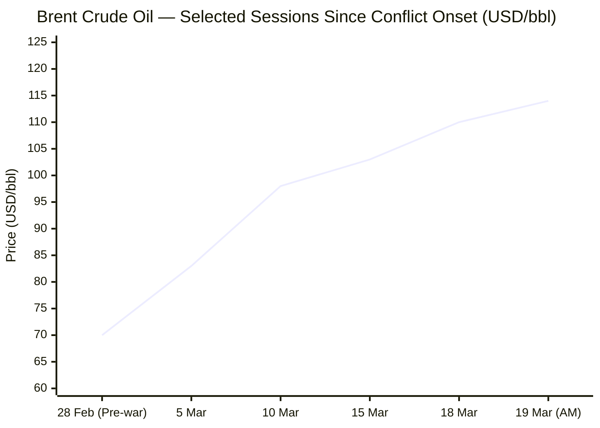
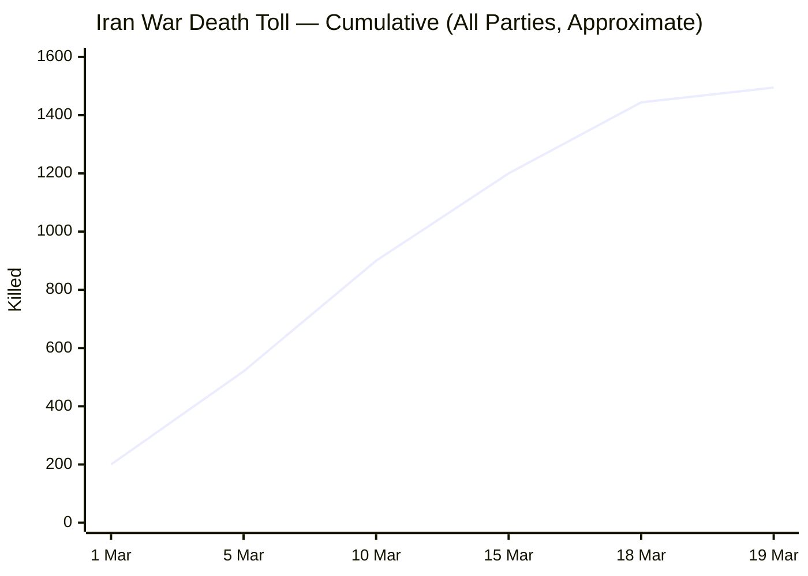

Now compiling the full briefing from all sourced material.

---

# 🌐 MORNING BRIEF
## Thursday, 19 March 2026 · 08:00 CET
### 15 stories across 6 categories

---

## DIGEST SUMMARY

| Category           | Stories | Alert Level |
|--------------------|---------|-------------|
| ⚔️ Ongoing Wars    | 4       | 🔴          |
| 💼 Business        | 3       | 🔴          |
| 🤖 Technology      | 2       | 🟡          |
| 🇪🇺 European Union  | 3       | 🔴          |
| 📈 Trends          | 2       | 🔴          |
| 📊 Key Data        | 1       | —           |

> **Alert Level key:** 🔴 High significance · 🟡 Developing · 🟢 Stable/Routine

---

## ⚔️ ONGOING WARS
*Conflict Analyst · 4 updates today*

---

### 1. US–Israel War on Iran — Day 20: Gulf Energy Infrastructure Struck [MULTI-SOURCE]
**Summary:** Day 20 of Operation Epic Fury marks a severe regional escalation. Following an Israeli strike on Iran's South Pars gas field — the world's largest — Iran's IRGC launched missile and drone attacks on Gulf energy infrastructure overnight. Qatar's Ras Laffan LNG terminal, which supplies approximately one-fifth of global LNG, sustained what Doha describes as "extensive damage." Qatar has expelled Iranian military and security attachés. Saudi Arabia and the UAE intercepted strikes. Iranian Supreme Leader Mojtaba Khamenei vowed retaliation for the assassination of three senior officials in 48 hours: security chief Ali Larijani, Basij commander Gholamreza Soleimani, and Intelligence Minister Esmail Khatib.

**Significance:** Strikes on Gulf LNG infrastructure threaten structural, not merely transient, supply disruption. Qatar's Ras Laffan is critical to European and Asian gas markets. Saudi Arabia's declaration that "the little trust remaining in Iran has been completely shattered" raises the prospect of direct GCC military retaliation independent of US and Israeli command.

**Sources:**
- [Al Jazeera — *Iran war live: Gulf energy sites targeted after Israeli attack on gasfield*](https://www.aljazeera.com/news/liveblog/2026/3/19/iran-war-live-qatar-saudi-energy-sites-attacked-riyadh-says-trust-gone) · 19 March 2026
- [CNN — *Day 19 of Middle East conflict — Trump threatens Iran's gas fields*](https://www.cnn.com/world/live-news/iran-war-us-israel-trump-03-18-26) · 19 March 2026
- [CBS News — *Trump threatens to "massively blow up" Iranian gas field if Iran attacks Qatar*](https://www.cbsnews.com/live-updates/iran-war-us-israel-persian-gulf-strait-of-hormuz-trump-netanyahu/) · 19 March 2026

---

### 2. US–Israel War on Iran — Intelligence Controversy & Political Fracture [MULTI-SOURCE]
**Summary:** Former Trump-appointed National Counterterrorism Centre Director Joe Kent resigned Tuesday, stating there was "no intelligence" Iran was preparing an imminent large-scale attack and that key decision-makers were excluded from White House briefings before this second phase of the conflict. Director of National Intelligence Tulsi Gabbard is accused of altering her Senate testimony by removing intelligence conclusions indicating Iran had attempted to rebuild uranium enrichment — conclusions that contradicted Trump's stated rationale for the war. IAEA Director-General Rafael Grossi separately warned that military strikes cannot eliminate Iran's nuclear programme entirely, as material and know-how remain dispersed across universities and facilities.

**Significance:** The resignation of a senior intelligence official combined with allegations of testimony alteration represent a significant domestic political risk for the administration and risk undermining allied confidence in the conflict's stated objectives.

**Sources:**
- [Al Jazeera — *Iran war: What is happening on day 20 of US-Israel attacks?*](https://www.aljazeera.com/news/2026/3/19/iran-war-what-is-happening-on-day-20-of-us-israel-attacks) · 19 March 2026
- [NPR — *War can't entirely eliminate Iran's nuclear program, the UN atomic energy chief says*](https://www.npr.org/2026/03/18/nx-s1-5751694/iran-retaliates-israel-kills-two-top-iranian-officials) · 18 March 2026

---

### 3. Russia–Ukraine: Frontline Attrition Intensifies; Peace Talks Stalled [MULTI-SOURCE]
**Summary:** Russia launched 133 drones overnight on 18–19 March, with 109 intercepted by Ukrainian air defences. Strikes hit a security service headquarters in Lviv, an energy facility in Volyn, and residential buildings in Odesa. Ukraine's General Staff recorded 235 combat engagements on 18 March, with the heaviest fighting in the Pokrovsk and Kostiantynivka sectors. In a separate strike, Ukraine's General Staff confirmed a hit on the Aviastar aviation manufacturing plant in Russia's Ulyanovsk region, which produces Il-76 heavy military transport aircraft. Russia claims to hold approximately 20% of Ukrainian territory. US-brokered peace talks remain suspended as Washington's diplomatic bandwidth is dominated by the Iran conflict.

**Significance:** The effective suspension of US-facilitated ceasefire negotiations represents a strategic opportunity for Russia to consolidate gains. Ukraine's drone strike on Aviastar signals continued capacity for deep-strike operations inside Russian territory, escalating the cost calculus for Moscow.

**Sources:**
- [Kyiv Independent — *Battlefield analysis: How Ukraine is fighting to thwart Russia's spring offensive plans*](https://kyivindependent.com/) · 18 March 2026
- [Euronews — *Russia and Ukraine both claim front line progress with US-brokered peace talks on hold*](https://www.euronews.com/2026/03/10/russia-and-ukraine-both-claim-front-line-progress-with-us-brokered-peace-talks-on-hold) · 10 March 2026
- [Ukrinform — *235 combat engagements recorded along frontline on March 18*](https://www.ukrinform.net/block-lastnews) · 19 March 2026

---

### 4. Lebanon–Hezbollah–Israel: Ground Operations Continuing; 700,000 Displaced
**Summary:** Israeli ground operations continue in southern Lebanon, where Hezbollah entered the conflict on 2 March following US-Israeli strikes on Iran. The UN Refugee Agency (UNHCR) estimates nearly 700,000 people are displaced within Lebanon. More than 30,000 Syrian refugees formerly sheltering in Lebanon have fled back to Syria in the past week. Displacement shelters are at over-capacity. Israeli airstrikes have targeted Beirut's southern districts, and an Israeli strike in Beirut's Bashoura neighbourhood was recorded on 18 March. Hezbollah, whose senior commanders were significantly degraded in Israeli strikes in August–September 2025, has thus far confined itself to a supporting, reactive posture.

**Significance:** Lebanon's concurrent humanitarian collapse — predating the current conflict — compounds the displacement crisis and risks destabilising the country's fragile political transition. Any Hezbollah escalation to full-scale missile salvoes would open a second major front against Israel.

**Sources:**
- [Al Jazeera — *Iran's neighbours brace for fallout as war threatens new refugee crisis*](https://www.aljazeera.com/news/2026/3/17/irans-neighbours-prepare-for-fallout-as-war-threatens-new-refugee-crisis) · 17 March 2026
- [CFR — *How the Iran War Is Breaking Global Humanitarian Aid Efforts*](https://www.cfr.org/articles/the-iran-war-is-breaking-global-humanitarian-aid-efforts) · 12 March 2026

---

## 💼 BUSINESS
*Business Analyst · 3 updates today*

---

### 1. Brent Crude Surges Past $113 as Ras Laffan LNG Terminal Hit [MULTI-SOURCE]
**Summary:** Global oil and natural gas prices surged in Asian session Thursday after Iran struck the Ras Laffan LNG complex in Qatar and two refineries in Kuwait overnight. Brent crude reached approximately $113–114 per barrel in early trade, while LNG futures spiked sharply. Asian markets sold off in response: Japan's Nikkei 225 fell 2.7%, South Korea's Kospi dropped 2.7%, the Hang Seng lost 2%, and India's Sensex shed 2.3%. The Bank of Japan's monetary policy statement explicitly flagged the Middle East escalation, noting "crude oil prices have risen significantly." QatarEnergy, the world's largest LNG producer, has already declared force majeure on some supplies. The IEA's 400-million-barrel coordinated emergency reserve release — equivalent to roughly four days of global consumption — is providing only temporary market relief.

**Market signal:** Strongly bearish for global equities and growth-sensitive assets; bullish for energy sector stocks, commodities, and defence contractors. Stagflation risk is the primary macro theme: oil above $110/bbl combined with a hawkish Fed hold raises simultaneous inflation and growth headwinds.

**Sources:**
- [AP via MS Now — *Oil and natural gas prices soar as Iran attacks Gulf energy facilities. Brent crude nears $114*](https://www.ms.now/news/oil-natural-gas-prices-soar-iran-attacks-gulf-energy) · 19 March 2026
- [Al Jazeera — *Strategic oil release may calm markets but cannot fix Hormuz disruption*](https://www.aljazeera.com/economy/2026/3/15/strategic-oil-release-may-calm-markets-but-cannot-fix-hormuz-disruption) · 15 March 2026
- [IEA — *Oil Market Report — March 2026*](https://www.iea.org/reports/oil-market-report-march-2026) · March 2026

---

### 2. Federal Reserve Holds Rates at 3.5%–3.75%; Signals One Cut in 2026
**Summary:** The Federal Open Market Committee voted unanimously Wednesday to maintain the federal funds rate at 3.5%–3.75% for the second consecutive meeting. The updated Summary of Economic Projections ("dot plot") projects a single 25-basis-point cut in 2026, unchanged from December guidance, but seven of 19 members now forecast no cuts this year — one more than December. The Fed revised its 2026 PCE inflation forecast upward to 2.7% (from 2.4%) and GDP growth upward to 2.4%. Fed Chair Jerome Powell explicitly cited the Iran war as a complicating factor: "We just don't know" what oil prices will do. S&P 500 futures fell following the announcement, as markets had hoped for a signal of accelerating easing.

**Market signal:** Neutral to mildly bearish for equities. The Fed is effectively paralysed by the stagflation risk posed by the oil shock — unable to cut (inflation) or hike (growth). Duration assets remain under pressure as long as oil stays above $100/bbl.

**Sources:**
- [CNBC — *Fed interest rate decision March 2026: Holds rates steady*](https://www.cnbc.com/2026/03/18/fed-interest-rate-decision-march-2026.html) · 18 March 2026
- [Federal Reserve — *Implementation Note, March 18, 2026*](https://www.federalreserve.gov/newsevents/pressreleases/monetary20260318a1.htm) · 18 March 2026
- [Yahoo Finance — *Live updates: Interest rates steady; Federal Reserve forecasts one rate cut in 2026*](https://finance.yahoo.com/news/live/fed-meeting-live-updates-federal-reserve-holds-rates-steady-forecasts-1-rate-cut-in-2026-180216872.html) · 19 March 2026

---

### 3. Russia Financially Benefits from Hormuz Closure; US Issues Temporary Sanctions Waiver
**Summary:** Analysts cited by CBS News note that Russia is accumulating a substantial financial windfall from the energy shock, as Iranian retaliation paralyses Gulf crude shipments and drives global prices skyward. The US Treasury issued a 30-day waiver on Russian oil sanctions last week, permitting sale of oil already loaded onto tankers, describing it as a "narrowly tailored" measure to stabilise energy markets. Critics, including some analysts and the Russian government itself, dispute that characterisation. Azerbaijan stands to gain an estimated $6–7.5 billion annually from a sustained $20–25/bbl rise in Brent, underscoring how geopolitically misaligned the economic incentives of this conflict are for Western coalition building.

**Market signal:** Bearish for coalition cohesion; the waiver risks creating a political backlash in Europe, where the war in Ukraine still commands strong sentiment against any Russian revenue relief.

**Sources:**
- [CBS News — *Trump threatens to "massively blow up" Iranian gas field*](https://www.cbsnews.com/live-updates/iran-war-us-israel-persian-gulf-strait-of-hormuz-trump-netanyahu/) · 19 March 2026
- [Carnegie Endowment — *Iran's Northern Neighbors Are Facing Fallout From the War, Too*](https://carnegieendowment.org/emissary/2026/03/armenia-azerbaijan-iran-war-fallout) · 16 March 2026

---

## 🤖 TECHNOLOGY
*Technology Analyst · 2 updates today*

---

### 1. EU Council Agrees AI Act Simplification; Digital Omnibus Enters Trilogue Phase [MULTI-SOURCE]
**Summary:** The Council of the EU agreed its position on 13 March on the Digital Omnibus VII's AI-specific component, designed to streamline the AI Act's implementation ahead of the 2 August 2026 full enforcement deadline for general-purpose AI models. Key amendments include: extending the timeline for high-risk AI compliance obligations by up to 16 months (contingent on availability of required standards); extending SME regulatory exemptions to small mid-caps; and reducing fragmentation across member-state AI governance frameworks. The European Parliament's civil liberties and digital committees already adopted their position on 25 February. MEPs are also finalising their position on the EU-wide AI-generated content labelling Code of Practice, with a second draft published on 5 March and the final version expected by June.

**Analyst note:** The simplification agenda is an implicit acknowledgement that the original AI Act, as written, is commercially deterrent — the EU is de-regulating at the margin while claiming regulatory leadership, a tension that will intensify as the August enforcement date approaches.

**Sources:**
- [Council of the EU — *Simplification: Council agrees position to streamline EU rules on Artificial Intelligence*](https://www.consilium.europa.eu/en/press/press-releases/2026/03/13/council-agrees-position-to-streamline-rules-on-artificial-intelligence/) · 13 March 2026
- [European Commission — *AI Act | Shaping Europe's digital future*](https://digital-strategy.ec.europa.eu/en/policies/regulatory-framework-ai) · March 2026
- [European Parliament — *Press kit for the European Council of 19–20 March 2026*](https://www.europarl.europa.eu/news/en/press-room/20260316IPR38218/) · 16 March 2026

---

### 2. Global Semiconductor Revenue on Track to Breach $1 Trillion; Memory Crunch Deepens
**Summary:** Industry forecasters including Deloitte and Omida project global semiconductor revenue will exceed $1 trillion in 2026 for the first time — a 26–30% year-on-year rise — driven almost entirely by AI data centre demand. Roughly $500 billion of that revenue is attributed to AI-oriented chips, yet these represent under 0.2% of total unit volume. Synopsys CEO Sassine Ghazi warned the memory chip shortage will persist through 2027, as available DRAM and HBM production is being absorbed entirely by AI hyperscalers (Amazon, Microsoft, Google, Meta — collectively projecting ~$500 billion in capex). The Iran war is introducing a new risk vector: Gulf helium production, critical for semiconductor manufacturing, is disrupted, and energy cost volatility threatens data centre expansion economics.

**Analyst note:** The semiconductor industry is now effectively a proxy for AI infrastructure buildout; any meaningful disruption to hyperscaler capex plans — whether from an oil-shock-driven recession, US policy shifts, or a correction in AI investment sentiment — would rapidly cascade into broader GDP impacts.

**Sources:**
- [CNBC — *Memory chip shortage to last through 2027, semiconductor boss says*](https://www.cnbc.com/2026/01/26/memory-chip-shortage-synopsys-lenovo-ai-data-centers.html) · 26 January 2026
- [Sourceability — *US semiconductor reshoring + AI boom*](https://sourceability.com/post/us-semiconductor-reshoring-efforts-collide-with-the-ai-boom) · March 2026
- [Wikipedia — *Economic impact of the 2026 Iran war*](https://en.wikipedia.org/wiki/Economic_impact_of_the_2026_Iran_war) · [URL UNAVAILABLE for direct section]

---

## 🇪🇺 EUROPEAN UNION
*EU Affairs Analyst · 3 updates today*

---

### 1. European Council Summit Opens in Brussels — Iran, Ukraine & Competitiveness on Agenda [MULTI-SOURCE]
**Summary:** EU heads of state and government convened at the Europa building in Brussels at 07:00 CET on 19 March for a two-day European Council summit. EP President Roberta Metsola addressed leaders at 10:00, followed by a press conference. UN Secretary-General António Guterres is attending a working lunch to discuss the deteriorating international situation and the defence of multilateralism. The agenda includes: (1) the military escalation in Iran and its consequences for EU energy prices and security; (2) Ukraine — including the proposed €90 billion EU loan to Kyiv for 2026–2027; (3) the "One Europe, One Market" competitiveness agenda; (4) the next Multiannual Financial Framework (MFF); (5) security and defence; and (6) migration. A key institutional challenge: two member states retain a veto on the Ukraine loan instrument.

**Legislative/policy stage:** Under active deliberation. Summit conclusions expected Thursday evening/Friday. MFF negotiations expected to produce guidelines; no formal decision anticipated before late 2026.

**Sources:**
- [European Council — *European Council, 19–20 March 2026*](https://www.consilium.europa.eu/en/meetings/european-council/2026/03/19-20/) · 2026
- [European Parliament — *Press kit for the European Council of 19–20 March 2026*](https://www.europarl.europa.eu/news/en/press-room/20260316IPR38218/) · 16 March 2026
- [European Policy Centre — *EU Leaders' Summit Roundup*](https://www.epc.eu/publication/eu-leaders-summit-roundup-epc-experts-highlight-energy-shocks-competitiveness-and-security/) · 19 March 2026

---

### 2. ECB Holds Deposit Rate at 2.0% — Governing Council Meets Today
**Summary:** The ECB's Governing Council concludes its two-day monetary policy meeting in Frankfurt today (Day 2), with a decision expected at 13:15 CET and President Lagarde's press conference at 14:45 CET. A unanimous Bloomberg survey of economists anticipates the deposit rate will be held at 2.0% — unchanged since last June — as policymakers balance the Iran war's inflationary impulse against fragile eurozone growth. Markets, however, are pricing in at least one rate hike by year-end, reflecting concerns that the Iran energy shock could push inflation durably above target. ECB minutes from the February 4–5 meeting, published on 10 March, revealed that before the oil shock, the Governing Council was actually worried inflation might fall below the 2% target — a posture that has been overtaken by events.

**Legislative/policy stage:** Decision due this morning (13:15 CET). No change expected; communications from Lagarde on the energy shock inflation pathway will be closely watched.

**Sources:**
- [Bloomberg — *ECB to Hold as It Weighs War's Inflation Threat: Decision Guide*](https://www.bloomberg.com/news/articles/2026-03-19/ecb-to-hold-as-it-weighs-war-s-inflation-threat-decision-guide) · 19 March 2026
- [ECB — *Calendar of Governing Council meetings*](https://www.ecb.europa.eu/press/calendars/mgcgc/html/index.en.html) · March 2026
- [FXStreet — *EUR/USD weakens to near 1.1450 amid Fed rate hold, ECB rate decision looms*](https://www.fxstreet.com/news/eur-usd-weakens-to-near-11450-amid-fed-rate-hold-ecb-rate-decision-looms-202603182357) · 18 March 2026

---

### 3. EU-US Tech Regulatory Confrontation Escalates Ahead of AI Act Enforcement
**Summary:** The run-up to the EU's AI Act full enforcement deadline (2 August 2026 for GPAI models) is intensifying transatlantic regulatory friction. The Trump administration has characterised the Digital Markets Act, Digital Services Act, and AI Act as discriminatory against US companies, and is preparing a Section 301 investigation that could trigger retaliatory tariffs. US Under Secretary of State Jacob Helberg publicly warned European officials that the EU's regulatory approach risks leaving Europe as a "museum of the 20th century." Meanwhile, the Commission missed its February deadline to publish guidance on high-risk AI system obligations, creating compliance uncertainty for businesses. Cloud gatekeeper probes against Amazon and Microsoft, opened in November 2025, are ongoing.

**Legislative/policy stage:** Digital Omnibus VII in ordinary legislative procedure (Council position agreed 13 March; Parliament position under negotiation). AI Act high-risk obligations enforcement: 2 August 2026 (potentially extended to December 2027 under Omnibus amendments).

**Sources:**
- [Council of the EU — *Council agrees position to streamline EU rules on Artificial Intelligence*](https://www.consilium.europa.eu/en/press/press-releases/2026/03/13/council-agrees-position-to-streamline-rules-on-artificial-intelligence/) · 13 March 2026
- [European Business Magazine — *EU Readies Tougher Tech Enforcement in 2026 as Trump warns of Retaliation*](https://europeanbusinessmagazine.com/european-news/eu-prepares-tougher-tech-enforcement-in-2026-as-trump-warns-of-retaliation/) · January 2026

---

## 📈 TRENDS
*Trends Analyst · 2 updates today*

---

### 1. Iran Displacement Crisis: 3.2 Million Internally Displaced; Refugee Outflow Risks Rising
**Summary:** The UNHCR estimates 3.2 million people have been displaced within Iran since US-Israeli strikes began on 28 February — predominantly from Tehran and western provinces toward less-targeted eastern and border regions. Cross-border movement remains limited but is accelerating, with flows recorded across the Turkish, Armenian, Iraqi, and Afghan borders. Iran hosts 1.65 million refugees from Afghanistan and Iraq; their displacement creates a cascading secondary crisis. Germany's Chancellor Friedrich Merz has warned publicly that Iran "cannot become another Syria," signalling European concern about a potential wave of millions of refugees. UNHCR has received only 15% of its required 2026 funding of $454 million for the Iran–Afghanistan–Pakistan corridor. The World Food Programme warns an additional 45 million people globally could be pushed into extreme hunger if the conflict persists.

**Horizon:** Short-to-medium term. The displacement trajectory will follow the conflict's geographic spread. A collapse of urban infrastructure in Tehran (population ~10 million) could trigger sudden, massive outflows. European border dynamics could shift dramatically within weeks if fighting intensifies.

**Sources:**
- [Al Jazeera — *Iran's neighbours brace for fallout as war threatens new refugee crisis*](https://www.aljazeera.com/news/2026/3/17/irans-neighbours-prepare-for-fallout-as-war-threatens-new-refugee-crisis) · 17 March 2026
- [UNHCR — *UNHCR mobilizing across region as Middle East crisis escalates*](https://www.unrefugees.org/news/2026/3/unhcr-mobilizing-across-region-as-middle-east-crisis-escalates/) · March 2026
- [WFP — *Effects of the Middle East Conflict: Fuel Prices, Civilians and Hunger*](https://wfpusa.org/effects-of-the-middle-east-conflict-fuel-prices-civilians-and-hunger/) · 17 March 2026

---

### 2. Global Stagflation Risk: Emerging Markets Face Dual Shock of Energy Costs and Debt
**Summary:** The oil and LNG price shock is transmitting unevenly but severely across the global economy. For advanced economies (US, EU), the primary concern is a stagflationary regime — simultaneous above-target inflation and decelerating growth — constraining central bank room to manoeuvre. For import-dependent emerging market economies — specifically the Philippines, Pakistan, Sri Lanka, Bangladesh, and others — the shock is more acute: energy costs are driving rapid inflation, widening current account deficits, and weakening exchange rates. The WEF has described the confluence of the Iran war energy shock with pre-existing tariff pressures, post-pandemic debt overhangs, and recently elevated inflation as a "structural shock to the world economy." Monetary policy easing expectations have been revised downward in countries as geographically distant as Chile and Poland.

**Horizon:** Medium term. The duration of Hormuz closure is the critical variable. Even a partial resolution and reopening of the strait to tanker traffic would not immediately reverse supply disruptions, given damaged infrastructure, elevated marine insurance premiums, and lasting damage to production facilities in Qatar and Kuwait.

**Sources:**
- [WEF — *The global price tag of war in the Middle East*](https://www.weforum.org/stories/2026/03/the-global-price-tag-of-war-in-the-middle-east/) · March 2026
- [TIME — *How the War With Iran Is Impacting Economies in Asia*](https://time.com/article/2026/03/16/us-israel-iran-war-trump-asia-economy-oil-energy-inflation-recession/) · 16 March 2026
- [Morgan Stanley — *Iran Conflict: Oil Price Impacts and Inflation*](https://www.morganstanley.com/insights/articles/iran-war-oil-inflation-stock-market-2026) · 2026

---

## 📊 KEY DATA OF THE DAY
*Data Officer · 10 indicators*

| Indicator              | Value         | Δ vs Prior     | Source        | URL |
|------------------------|---------------|----------------|---------------|-----|
| Brent Crude (USD/bbl)  | ~$113–114     | +1.8% (session)| AP/IEA        | [link](https://www.ms.now/news/oil-natural-gas-prices-soar-iran-attacks-gulf-energy) |
| WTI Crude (USD/bbl)    | ~$99–100      | +3.1% (prior session) | CNBC  | [link](https://www.cnbc.com/2026/03/12/stock-market-today-live-updates.html) |
| EUR/USD                | 1.1465        | ≈ flat         | FXStreet/ECB  | [link](https://www.fxstreet.com/news/eur-usd-weakens-to-near-11450-amid-fed-rate-hold-ecb-rate-decision-looms-202603182357) |
| Gold (XAU/USD)         | ~$4,800–4,850 | -3.8% (session)| Yahoo Finance | [link](https://finance.yahoo.com/news/live/fed-meeting-live-updates-federal-reserve-holds-rates-steady-forecasts-1-rate-cut-in-2026-180216872.html) |
| US Fed Funds Rate      | 3.50%–3.75%   | Unchanged      | Federal Reserve | [link](https://www.federalreserve.gov/newsevents/pressreleases/monetary20260318a1.htm) |
| ECB Deposit Rate       | 2.00%         | Unchanged (expected) | ECB    | [link](https://www.bloomberg.com/news/articles/2026-03-19/ecb-to-hold-as-it-weighs-war-s-inflation-threat-decision-guide) |
| Nikkei 225             | -2.7% (session)| n/a           | AP/CNN        | [link](https://www.ms.now/news/oil-natural-gas-prices-soar-iran-attacks-gulf-energy) |
| S&P 500 Futures        | 6,674.75      | -0.03%         | Yahoo Finance | [link](https://finance.yahoo.com/news/live/fed-meeting-live-updates-federal-reserve-holds-rates-steady-forecasts-1-rate-cut-in-2026-180216872.html) |
| US 10Y Treasury Yield  | 4.259%        | +1.36% (session)| Yahoo Finance | [link](https://finance.yahoo.com/news/live/fed-meeting-live-updates-federal-reserve-holds-rates-steady-forecasts-1-rate-cut-in-2026-180216872.html) |
| VIX (Volatility Index) | 26.14         | +4.19%         | Yahoo Finance | [link](https://finance.yahoo.com/news/live/fed-meeting-live-updates-federal-reserve-holds-rates-steady-forecasts-1-rate-cut-in-2026-180216872.html) |

**Data commentary:** Markets this morning are being driven by a single overwhelming factor: the escalation from Iranian attacks on Gulf LNG infrastructure overnight. Brent above $113/bbl — against an early-2026 baseline of ~$60/bbl — represents an oil shock of a magnitude not seen since 2022, and the IEA's emergency reserve release provides only days of cover at current demand. The Fed's hold and hawkish tone yesterday reinforced that policymakers are paralysed: cutting risks entrenching inflation, holding risks throttling a decelerating economy. Gold's pullback, despite the geopolitical escalation, reflects a stronger US dollar post-FOMC rather than receding safe-haven demand; the underlying bid for bullion remains structurally intact. The ECB decision this afternoon (13:15 CET) will be the day's key European data point.

---

## 📉 CHARTS

---

## ⚙️ AGENT METADATA

| Field               | Value                                   |
|---------------------|-----------------------------------------|
| Agent version       | MORNING BRIEF v1.0                      |
| Run timestamp       | 2026-03-19T08:00:00+01:00               |
| Sources queried     | 11 / 11                                 |
| Stories surfaced    | 32                                      |
| Stories published   | 15                                      |
| Languages processed | EN, FR, DE, ES (via translated sources) |
| Output language     | English                                 |

---
*MORNING BRIEF is an AI-assisted digest. All summaries are paraphrased from original sources. Verify time-sensitive information at the linked URLs before acting on it. Data values are indicative and sourced from early Asian/European session; check live feeds for current figures.*
