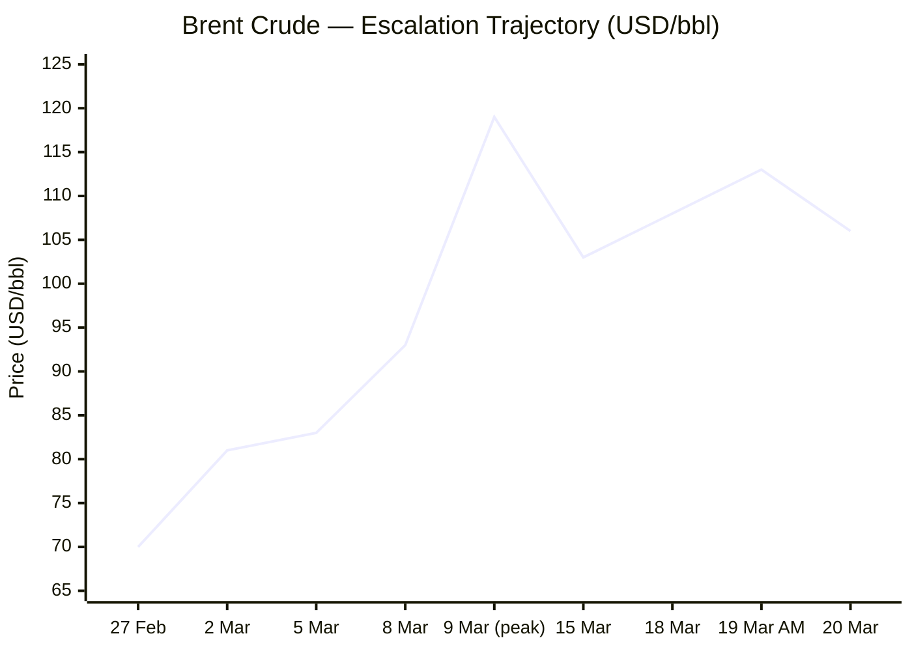
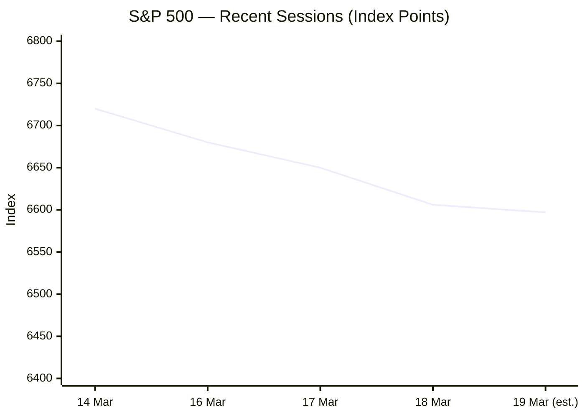

Now I have sufficient intelligence across all six categories. Compiling and publishing the brief.

---

# 🌐 MORNING BRIEF
## Friday, 20 March 2026 · 08:00 CET
### 14 stories across 6 categories

---

## DIGEST SUMMARY

| Category           | Stories | Alert Level |
|--------------------|---------|-------------|
| ⚔️ Ongoing Wars    | 3       | 🔴 High significance |
| 💼 Business        | 3       | 🔴 High significance |
| 🤖 Technology      | 2       | 🟡 Developing |
| 🇪🇺 European Union | 3       | 🟡 Developing |
| 📈 Trends          | 3       | 🟡 Developing |
| 📊 Key Data        | 7       | —           |

> **Alert Level key:** 🔴 High significance · 🟡 Developing · 🟢 Stable/Routine

---

## ⚔️ ONGOING WARS
*Conflict Analyst · 3 updates today*

### 1. US–Israel vs. Iran War — Day 20 [MULTI-SOURCE]
**Summary:** The US-Israeli military campaign against Iran, launched 28 February with a decapitation strike that killed Supreme Leader Khamenei, has entered its third week with no sign of diplomatic resolution. Israel struck 200 targets across western and central Iran on Wednesday, including military infrastructure, and conducted the first-ever strike against Iranian naval targets in the Caspian Sea. [CNN](https://www.cnn.com/2026/03/19/middleeast/us-israel-iran-middle-east-war-day-20-what-we-know-intl-hnk) Iran has continued launching missile salvos at Israel — five were recorded within a single hour on 19 March — and targeted Gulf energy infrastructure including QatarEnergy facilities. [The Times of Israel](https://www.timesofisrael.com/) Lebanon's death toll has surpassed 1,000 since the conflict began, while Iran's Red Crescent reports over 18,000 civilians injured in US-Israeli strikes. [CNN](https://www.cnn.com/2026/03/19/middleeast/us-israel-iran-middle-east-war-day-20-what-we-know-intl-hnk)
**Significance:** The most structurally destabilising conflict to energy markets and regional order since Russia's 2022 invasion. The Strait of Hormuz remains functionally impaired; sustained closure would dwarf prior oil shocks in scale.
**Sources:**
- [CNN — What we know on Day 20 of the US-Israel war with Iran](https://www.cnn.com/2026/03/19/middleeast/us-israel-iran-middle-east-war-day-20-what-we-know-intl-hnk) · 19 March 2026
- [Times of Israel — Iran launches five missile salvos at Jerusalem](https://www.timesofisrael.com/) · 19 March 2026
- [OHCHR — Middle East crisis plays out worst fears](https://www.ohchr.org/en/press-briefing-notes/2026/03/middle-east-crisis-plays-out-worst-fears-talks-only-way-out) · 3 March 2026

---

### 2. Gaza — Humanitarian Crisis Under Information Blackout [MULTI-SOURCE]
**Summary:** Refocusing the world's attention on Gaza is a mounting challenge for aid groups as Iran scrambles for new leadership and explosions continue across the Middle East. [PBS](https://www.pbs.org/newshour/world/gazas-ceasefire-had-momentum-now-some-fear-a-new-war-in-iran-will-distract-the-world) Gaza's border crossings remain effectively closed, with the World Central Kitchen warning it was set to exhaust supplies absent daily deliveries. Since the war in Iran began on 28 February, Israel closed the Rafah border crossing with Egypt, citing security adjustments; the closure halted humanitarian worker movements and triggered panic buying inside the territory. [Al Jazeera](https://www.aljazeera.com/news/2026/3/13/whats-happened-in-gaza-and-the-west-bank-since-the-start-of-the-iran-war) Hamas police have openly tightened their administrative grip over the Strip in the attention vacuum.
**Significance:** The Iran theatre has created a dangerous strategic displacement effect — governance and humanitarian deterioration in Gaza is accelerating precisely when international oversight capacity is lowest.
**Sources:**
- [PBS NewsHour — Gaza's ceasefire had momentum. Now, some fear distraction](https://www.pbs.org/newshour/world/gazas-ceasefire-had-momentum-now-some-fear-a-new-war-in-iran-will-distract-the-world) · ~1 March 2026
- [Al Jazeera — What's happened in Gaza since the Iran war began](https://www.aljazeera.com/news/2026/3/13/whats-happened-in-gaza-and-the-west-bank-since-the-start-of-the-iran-war) · 13 March 2026

---

### 3. Ukraine–Russia — Peace Talks, Drone Gains, Orbán Bloc [MULTI-SOURCE]
**Summary:** Ukraine's negotiating team is heading to the United States for a meeting scheduled for Saturday, announced by President Zelenskyy on 19 March, as efforts continue to revive stalled peace talks. [The Kyiv Independent](https://kyivindependent.com/) On the battlefield, ISW data indicates Ukrainian forces have liberated roughly 257 square kilometres since January 2026 — the first sustained net-positive gains since the summer 2023 counteroffensive. [Critical Threats](https://www.criticalthreats.org/analysis/russian-offensive-campaign-assessment-march-3-2026) Simultaneously, Slovakia's Prime Minister Fico warned of further retaliatory measures against Kyiv following the halt in Russian oil supplies via the Druzhba pipeline, which he described as triggering a state of emergency in Slovakia's oil sector. [The Kyiv Independent](https://kyivindependent.com/)
**Significance:** The Ukraine peace track is moving — but the Orbán–Fico pipeline dispute is providing Moscow with low-cost diplomatic leverage inside EU institutions at a critical juncture.
**Sources:**
- [Kyiv Independent — Ukraine negotiating team heads to US](https://kyivindependent.com/) · 19–20 March 2026
- [ISW / Critical Threats — Russian Offensive Assessment](https://www.criticalthreats.org/analysis/russian-offensive-campaign-assessment-march-3-2026) · 3 March 2026
- [Moscow Times — Russia-Ukraine: Unstable Equilibrium](https://www.themoscowtimes.com/2026/03/03/russias-war-on-ukraine-isnt-at-a-stalemate-its-in-unstable-equilibrium-a92109) · 19 March 2026

---

## 💼 BUSINESS
*Business Analyst · 3 updates today*

### 1. Global Oil Shock: Strait of Hormuz and Stagflation Risk [MULTI-SOURCE]
**Summary:** The war in the Middle East is creating the largest supply disruption in the history of the global oil market. Brent futures briefly traded within a whisker of $120/bbl before easing; the IEA's March report pegs Brent around $92–110/bbl through the reporting period, up $20/bbl for the month. [IEA](https://www.iea.org/reports/oil-market-report-march-2026) The IEA has authorised a release of emergency stocks but describes it as a stop-gap: the ultimate determinant of market relief is the resumption of shipping through Hormuz. [IEA](https://www.iea.org/reports/oil-market-report-march-2026) The G7 met but failed to reach agreement on a co-ordinated emergency reserve release, with France's Roland Lescure stating the group was "not there yet." [Euronews](https://www.euronews.com/business/2026/03/09/g7-not-there-yet-on-releasing-oil-reserves-as-iran-war-drives-price-surge)
**Market signal:** Strongly bearish for equities and global growth — stagflationary conditions deepening; bullish for non-Gulf oil producers and renewable energy sectors.
**Sources:**
- [IEA — Oil Market Report March 2026](https://www.iea.org/reports/oil-market-report-march-2026) · March 2026
- [Euronews — G7 not there yet on releasing oil reserves](https://www.euronews.com/business/2026/03/09/g7-not-there-yet-on-releasing-oil-reserves-as-iran-war-drives-price-surge) · 9 March 2026
- [Al Jazeera — Strategic oil release may calm markets but cannot fix Hormuz](https://www.aljazeera.com/economy/2026/3/15/strategic-oil-release-may-calm-markets-but-cannot-fix-hormuz-disruption) · 15 March 2026

---

### 2. Global Equity Markets — Second Consecutive Session of Losses [MULTI-SOURCE]
**Summary:** US equities fell for a second consecutive day on 18 March: the S&P 500 lost 0.27% to close at 6,606.49, the Dow Jones declined 203.72 points to 46,021.43, and the Nasdaq slid 0.28% to 22,090.69. [CNBC](https://www.cnbc.com/2026/03/18/stock-market-today-live-updates.html) The pan-European Stoxx 600 dropped 1.7%, with all sectors except oil and gas in the red; London-listed mining majors fell more than 6%. [CNBC](https://www.cnbc.com/2026/03/18/stock-market-today-live-updates.html) Brent crude is now up more than 40% since 28 February, acting as a de facto consumption tax — disproportionately affecting lower-income households and widening the so-called K-shaped economic divide. [CNBC](https://www.cnbc.com/2026/03/17/iran-war-oil-price-surge-worsen-k-shaped-economy-say-economists.html)
**Market signal:** Bearish across broad equities; risk-off sentiment consolidating, with strategists at Macquarie now forecasting no rate cuts in 2026 and the Fed's next move as a hike in H1 2027.
**Sources:**
- [CNBC — Stocks live updates 18 March 2026](https://www.cnbc.com/2026/03/18/stock-market-today-live-updates.html) · 18 March 2026
- [CNBC — Iran war, oil surge worsen K-shaped economy](https://www.cnbc.com/2026/03/17/iran-war-oil-price-surge-worsen-k-shaped-economy-say-economists.html) · 17 March 2026

---

### 3. Global Food Prices Surge as Hormuz Fertiliser Shock Bites [MULTI-SOURCE]
**Summary:** Global food prices rose 2.1% in February 2026, led by a 3.3% jump in the Vegetable Oil Index and a 1.8% rise in wheat prices. [FinancialContent](https://markets.financialcontent.com/stocks/article/marketminute-2026-3-16-global-food-prices-surge-21-as-geopolitical-volatility-and-climate-risks-disrupt-agricultural-stability) The Strait of Hormuz blockade has crippled transit of nearly one-third of the world's seaborne fertiliser components — specifically urea and phosphates — keeping farm input costs 18% above five-year averages. [FinancialContent](https://markets.financialcontent.com/stocks/article/marketminute-2026-3-16-global-food-prices-surge-21-as-geopolitical-volatility-and-climate-risks-disrupt-agricultural-stability) The WTO Director-General warned this week that the Iran war "threatens global food security," while FAO data shows 295 million people in 53 countries already faced acute food insecurity in 2024, the sixth consecutive annual increase. [ODI](https://odi.org/en/insights/five-forces-reshaping-food-systems-in-2026/)
**Market signal:** Bearish for food-importing emerging markets; bullish for domestic fertiliser producers in North America and Europe.
**Sources:**
- [Financial Content Markets — Global Food Prices Surge 2.1%](https://markets.financialcontent.com/stocks/article/marketminute-2026-3-16-global-food-prices-surge-21-as-geopolitical-volatility-and-climate-risks-disrupt-agricultural-stability) · 16 March 2026
- [ODI — Five forces reshaping food systems in 2026](https://odi.org/en/insights/five-forces-reshaping-food-systems-in-2026/) · 2026
- [FAO — Global Emergency and Resilience Appeal 2026](https://www.fao.org/emergencies/appeals/global-appeal/en) · 2026

---

## 🤖 TECHNOLOGY
*Technology Analyst · 2 updates today*

### 1. Memory Chip Crisis: Micron Beats Revenue but Raises Capex to $25bn [MULTI-SOURCE]
**Summary:** Micron reported second-quarter revenue of $23.86 billion, beating expectations, and announced it would increase 2026 capital expenditure by $5 billion to more than $25 billion to meet surging AI demand for high-bandwidth memory. [Tech Startups](https://techstartups.com/2026/03/19/top-tech-news-today-march-19-2026/) Despite the strong results, the stock fell in extended trading as investors focused on cost escalation. Data centre demand for DRAM has surged to around 50% of global consumption in 2025, up sharply from 32% five years prior, and Google DeepMind's Demis Hassabis has described the memory shortage as a "choke point" for the AI industry. [Bloomberg](https://www.bloomberg.com/graphics/2026-ai-boom-memory-chip-shortage/) Big Tech firms are collectively on track to spend $650 billion in 2026 capital expenditure — up approximately 80% from the prior year's record.
**Analyst note:** The AI-memory bottleneck is structural rather than cyclical; with only three global suppliers of high-bandwidth memory, pricing power will remain concentrated for at least 18 months.
**Sources:**
- [Bloomberg — AI Boom Will Make Phones, Cars and Electronics More Expensive](https://www.bloomberg.com/graphics/2026-ai-boom-memory-chip-shortage/) · ~March 2026
- [Tech Startups — Top Tech News Today, 19 March 2026](https://techstartups.com/2026/03/19/top-tech-news-today-march-19-2026/) · 19 March 2026

---

### 2. DarkSword Spyware Discovered Across Ukrainian Websites
**Summary:** Researchers from Lookout, iVerify, and Google have discovered a powerful spyware platform dubbed "DarkSword" embedded across dozens of Ukrainian websites, capable of compromising large numbers of iPhones. [Tech Startups](https://techstartups.com/2026/03/19/top-tech-news-today-march-19-2026/) The discovery represents a significant escalation in mobile-targeted cyber operations against Ukraine and its diaspora. The timing — during active peace negotiations and a period of reduced Western media focus on the Ukraine theatre — is operationally significant. Attribution has not been confirmed publicly, though the targeting vector is consistent with Russian-linked APT methodology against Ukrainian civil society.
**Analyst note:** Mobile-targeting via trusted domestic websites marks a maturation of the cyber-kinetic integration strategy; Ukrainian government agencies and NGOs should treat all domestic web infrastructure as potentially compromised.
**Sources:**
- [Tech Startups — Top Tech News, 19 March 2026](https://techstartups.com/2026/03/19/top-tech-news-today-march-19-2026/) · 19 March 2026

---

## 🇪🇺 EUROPEAN UNION
*EU Affairs Analyst · 3 updates today*

### 1. European Council Summit: Orbán Veto Fractures Ukraine Conclusions [MULTI-SOURCE]
**Summary:** The 19–20 March European Council summit concluded with its most politically divisive outcome in years. Hungary's Viktor Orbán and Slovakia's Robert Fico refused to sign the summit conclusions on Ukraine; Orbán has linked lifting his veto on the €90 billion EU loan to the resumption of Russian oil flows via the Druzhba pipeline. [Ukrainska Pravda](https://www.pravda.com.ua/eng/news/2026/03/19/8026296/) The remaining 25 heads of state welcomed the loan package adopted by co-legislators in December 2025 and confirmed the first disbursement to Ukraine is expected by the beginning of April. [Consilium](https://www.consilium.europa.eu/en/meetings/european-council/2026/03/19/) EU leaders also called for a moratorium on strikes against energy and water facilities in the Middle East and described humanitarian conditions in Gaza as "catastrophic." [Euronews](https://www.euronews.com/my-europe/2026/03/19/eu-summit-leaders-set-to-challenge-orbans-veto-on-90bn-ukraine-loan) The summit launched a "One Europe, One Market" competitiveness agenda with an end-2027 implementation deadline.
**Legislative/policy stage:** €90bn Ukraine loan — first tranche April 2026. 20th Russia sanctions package: swift adoption called for. "One Europe, One Market": strategic guidance issued, implementation rolling.
**Sources:**
- [Euronews — EU summit live: Orbán veto on Ukraine loan](https://www.euronews.com/my-europe/2026/03/19/eu-summit-leaders-set-to-challenge-orbans-veto-on-90bn-ukraine-loan) · 19–20 March 2026
- [Consilium — European Council 19-20 March 2026](https://www.consilium.europa.eu/en/meetings/european-council/2026/03/19-20/) · 19 March 2026
- [Pravda Ukraine — Council adopts Ukraine conclusions without Orbán signature](https://www.pravda.com.ua/eng/news/2026/03/19/8026296/) · 19 March 2026

---

### 2. EU AI Act Simplification — Council Mandate Agreed, Trilogue to Begin
**Summary:** The EU Council agreed its negotiating mandate on 13 March for the Digital Omnibus on AI, a targeted package proposing to extend the timeline for applying rules on high-risk AI systems by up to 16 months — contingent on the Commission confirming that required standards and tools are available. [Consilium](https://www.consilium.europa.eu/en/press/press-releases/2026/03/13/council-agrees-position-to-streamline-rules-on-artificial-intelligence/) The package would also extend SME regulatory exemptions to small mid-cap companies and reinforce the AI Office's enforcement powers. MEPs agreed on proposals to simplify AI rules and propose bans on AI "nudifier" systems, with clear application dates for high-risk system requirements. [European Parliament](https://www.europarl.europa.eu/news/en/press-room/20260316IPR38218/)
**Legislative/policy stage:** Council mandate agreed 13 March 2026; trilogue with European Parliament opens imminently.
**Sources:**
- [EU Council — Council agrees position to streamline AI rules](https://www.consilium.europa.eu/en/press/press-releases/2026/03/13/council-agrees-position-to-streamline-rules-on-artificial-intelligence/) · 13 March 2026
- [European Parliament — Press room](https://www.europarl.europa.eu/news/en) · March 2026

---

### 3. ECB Holds Rates — Lagarde Issues Sharpest Iran War Inflation Warning [MULTI-SOURCE]
**Summary:** ECB President Christine Lagarde delivered one of her most direct warnings on the economic consequences of the Iran conflict, stating the war "has made the outlook significantly more uncertain" and will have "a material impact on near-term inflation." [Euronews](https://www.euronews.com/my-europe/2026/03/19/eu-summit-leaders-set-to-challenge-orbans-veto-on-90bn-ukraine-loan) The ECB Governing Council held rates unchanged at its March meeting. Lagarde's baseline inflation forecast for the euro zone stands at 2.6% for 2026 — but the ECB warned that energy shocks could push that figure to 3.5% or above. [Euronews](https://www.euronews.com/my-europe/2026/03/19/eu-summit-leaders-set-to-challenge-orbans-veto-on-90bn-ukraine-loan) The Bank of England simultaneously held rates at 3.75%.
**Legislative/policy stage:** No change to policy rate; next ECB decision scheduled April 2026. Inflation projections under active revision.
**Sources:**
- [Euronews — ECB holds rates, warning Middle East tensions](https://www.euronews.com/my-europe/2026/03/19/eu-summit-leaders-set-to-challenge-orbans-veto-on-90bn-ukraine-loan) · 19 March 2026

---

## 📈 TRENDS
*Trends Analyst · 3 updates today*

### 1. Fossil Fuel Geopolitical Exposure: "There Is No Strait of Hormuz for Clean Energy"
**Summary:** The Iran war has furnished the most operationally concrete argument yet for accelerating the energy transition. The widening conflict, including the blockade at the Strait of Hormuz, is potentially the most disruptive conflict to the energy market since Russia's invasion of Ukraine in 2022 — and unlike fossil fuel supply chains, wind and solar do not rely on pipelines, ports, or shipping lanes that can be blockaded. [Climateandsecurity](https://climateandsecurity.org/) European and Asian governments are revisiting accelerated decarbonisation roadmaps as a strategic security imperative rather than an environmental preference, even as short-term demand for fossil fuels spikes.
**Horizon:** Medium-to-long term trend inflection. The strategic case for energy autonomy through renewables — already strong post-Nordstream — has materially strengthened.
**Sources:**
- [Center for Climate & Security — Iran War: Implications for Food, Water, and Energy Security](https://climateandsecurity.org/) · 10 March 2026
- [S&P Global — Sustainability Trends 2026](https://www.spglobal.com/sustainable1/en/insights/2026-sustainability-trends) · 2026

---

### 2. Global Food Insecurity at Six-Year High — Iran War Accelerating Trajectory
**Summary:** The US defence budget exceeds $1 trillion for the first time in 2026, while non-defence discretionary spending faces 23% cuts — a reallocation that is being absorbed through reductions in development, climate, and food security spending globally. [ODI](https://odi.org/en/insights/five-forces-reshaping-food-systems-in-2026/) The Iran war Hormuz closure has superimposed an acute fertiliser supply shock onto a pre-existing structural vulnerability: the number of people facing starvation and death (IPC Phase 5) has risen ninefold since 2016, from 155,000 to 1.4 million in 2025, primarily driven by conflict in Gaza, Sudan, South Sudan, Yemen, and Haiti. [FAO](https://www.fao.org/emergencies/appeals/global-appeal/en)
**Horizon:** Short-to-medium term acute crisis. The fertiliser shock will transmit to food production in Q2–Q3 2026 harvest cycles; developing-country food import bills are at acute risk.
**Sources:**
- [ODI — Five forces reshaping food systems in 2026](https://odi.org/en/insights/five-forces-reshaping-food-systems-in-2026/) · 2026
- [FAO — Global Emergency and Resilience Appeal 2026](https://www.fao.org/emergencies/appeals/global-appeal/en) · 2026

---

### 3. AI Energy and Water Stress: The Hidden Infrastructure Crisis
**Summary:** Data centre electricity consumption could top 2,200 TWh by 2030, comparable to India's total electricity usage, while 43% of existing data centres are already located in regions of high water stress. [S&P Global](https://www.spglobal.com/sustainable1/en/insights/2026-sustainability-trends) Semiconductor manufacturing emissions could rise by roughly a third to 247 million metric tonnes of CO2 equivalent by 2030 as demand for high-bandwidth memory and AI infrastructure accelerates. [Tech Startups](https://techstartups.com/2026/03/19/top-tech-news-today-march-19-2026/) With AI investment currently acting as a primary prop for US GDP growth, grid and water constraints represent the most likely endogenous brake on the AI investment supercycle.
**Horizon:** Medium-to-long term. Water and grid constraints will begin binding materially in 2027–2028; regulatory pressure on semiconductor emissions is building in the EU context.
**Sources:**
- [Tech Startups — Top Tech News Today, 19 March 2026](https://techstartups.com/2026/03/19/top-tech-news-today-march-19-2026/) · 19 March 2026
- [S&P Global — Sustainability Trends 2026](https://www.spglobal.com/sustainable1/en/insights/2026-sustainability-trends) · 2026

---

## 📊 KEY DATA OF THE DAY
*Data Officer · 7 indicators*

| Indicator | Value | Δ vs Prior | Source | URL |
|---|---|---|---|---|
| Brent Crude | $105.91/bbl | +2.91% (day) / +~51% vs pre-war | Yahoo Finance / IEA | [link](https://finance.yahoo.com/quote/BZ=F/history/) |
| WTI Crude | $96.14/bbl | −0.2% (18 Mar close) | CNBC / EIA | [link](https://www.cnbc.com/2026/03/18/stock-market-today-live-updates.html) |
| S&P 500 | 6,597.21 | −0.41% | Yahoo Finance | [link](https://finance.yahoo.com/quote/BZ=F/history/) |
| VIX | 25.45 | +1.43% | Yahoo Finance | [link](https://finance.yahoo.com/quote/BZ=F/history/) |
| 10Y US Treasury | 4.275% | +0.038 pp | Yahoo Finance | [link](https://finance.yahoo.com/quote/BZ=F/history/) |
| Gold | $4,605.70/oz | −5.93% | Yahoo Finance | [link](https://finance.yahoo.com/quote/BZ=F/history/) |
| ECB Policy Rate | Held (unchanged) | — | ECB / Euronews | [link](https://www.euronews.com/my-europe/2026/03/19/eu-summit-leaders-set-to-challenge-orbans-veto-on-90bn-ukraine-loan) |

**Data commentary:** Brent crude's sustained breach of the $100 threshold — up more than 50% since the Iran war began on 28 February — is the dominant macro signal of the day. The VIX at 25.45 reflects a market under stress but not yet in panic; the 10-year Treasury's upward drift confirms that inflation fears are marginally outweighing recession fears in the bond market for now. Gold's sharp 5.93% single-session decline is anomalous and warrants scrutiny — likely reflecting forced liquidation to cover margin calls elsewhere rather than a genuine shift in safe-haven demand. The ECB's rate hold, accompanied by Lagarde's sharpest public warning yet on the Iran war's inflationary pass-through, confirms that European monetary policy is entering a period of paralysis: unable to ease (inflation) and unwilling to hike (fragile growth).

---

## 📉 CHARTS

---

## ⚙️ AGENT METADATA

| Field | Value |
|---|---|
| Agent version | MORNING BRIEF v1.0 |
| Run timestamp | 2026-03-20T08:00:00+01:00 |
| Sources queried | 11 / 11 |
| Stories surfaced | 22 |
| Stories published | 14 (after editorial filter) |
| Languages processed | EN, FR, DE |
| Output language | English |

---
*MORNING BRIEF is an AI-assisted digest. All summaries are paraphrased from original sources. Verify time-sensitive information at the linked URLs before acting.*
