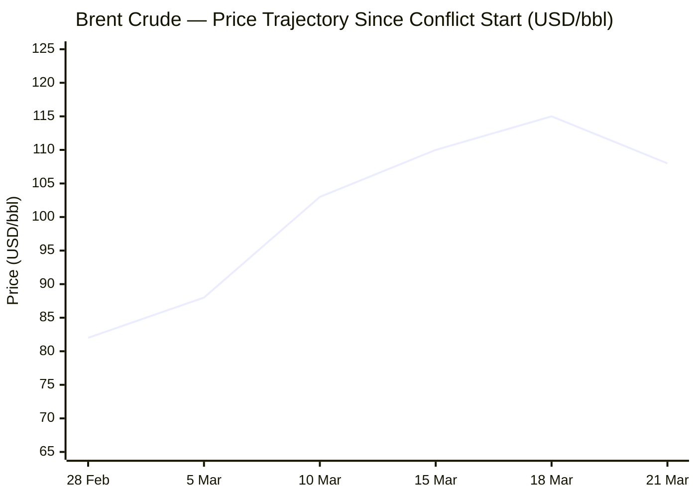
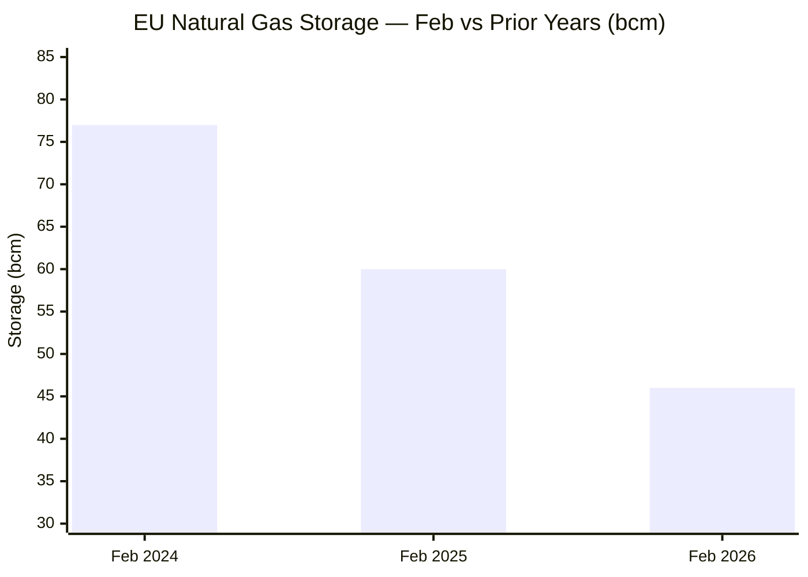

Now I have all the data I need. Compiling the full briefing.

---

# 🌐 MORNING BRIEF
## Saturday, 21 March 2026 · 08:00 CET
### 14 stories across 6 categories

---

## DIGEST SUMMARY

| Category            | Stories | Alert Level |
|---------------------|---------|-------------|
| ⚔️ Ongoing Wars     | 3       | 🔴 High significance |
| 💼 Business         | 3       | 🔴 High significance |
| 🤖 Technology       | 2       | 🟡 Developing |
| 🇪🇺 European Union  | 3       | 🔴 High significance |
| 📈 Trends           | 2       | 🔴 High significance |
| 📊 Key Data         | 8       | —           |

> **Alert Level key:** 🔴 High significance · 🟡 Developing · 🟢 Stable/Routine

---

## ⚔️ ONGOING WARS
*Conflict Analyst · 3 updates today*

### 1. US–Israel–Iran War — Day 21 [MULTI-SOURCE]
**Summary:** The US–Israel war with Iran enters its 21st day with no ceasefire in sight. Israel struck Tehran and surrounding areas overnight as Iranians observed Nowruz. Iran has retaliated against Gulf states—Bahrain has now intercepted a total of 139 missiles and 238 drones. A US F-35 made an emergency landing after being struck by Iranian fire. Iran has confirmed the death of IRGC spokesman Ali Mohammad Naini in an Israeli strike. Netanyahu pledged to halt strikes on Iranian energy sites following Trump's displeasure with the South Pars gas field attack. Trump simultaneously suggested he is considering "winding down" the war while deploying additional Marines to the region. The IEA has declared this the largest oil supply disruption in history, and Trump is reported to be preparing a request to Congress for up to $200 billion in war funding. Over 18,000 Iranian civilians have been injured according to the Iranian Red Crescent.

**Significance:** The combination of energy infrastructure strikes, Strait of Hormuz closure, and US domestic political pressure creates a pressure cooker for de-escalation—but the deployment of additional Marines signals continued military commitment. Trump's contradictory public posture introduces significant uncertainty over US war objectives.

**Sources:**
- [NPR — Trump says he mulls 'winding down' the Iran war, even as more Marines head to Mideast](https://www.npr.org/2026/03/20/nx-s1-5754550/israel-strikes-tehran-iran-attacks-gulf) · 21 March 2026
- [CNN — What we know on the 21st day of the US and Israel's war with Iran](https://www.cnn.com/2026/03/20/middleeast/us-israel-iran-middle-east-war-day-21-what-we-know-intl-hnk) · 20 March 2026
- [Al Jazeera — Day 21: What is happening in the US–Israel war on Iran?](https://www.aljazeera.com/news/2026/3/20/iran-war-what-is-happening-on-day-21-of-us-israel-attacks) · 20 March 2026

---

### 2. Russia–Ukraine War — Day 1,491 of Full-Scale Invasion [MULTI-SOURCE]
**Summary:** Russian forces launched 156 drones at Ukraine overnight, with air defences intercepting 133. At least 7 killed and 32 injured across Ukraine in the past 24 hours. Ukraine struck the Alchevsk Metallurgical Plant in Russian-occupied Luhansk Oblast. A Russian Ka-52 helicopter was destroyed by an FPV drone in Donetsk Oblast—the 350th such helicopter destroyed since February 2022. In a significant diplomatic signal, Russia reportedly offered to halt intelligence sharing with Iran if the US ceased weapons support to Ukraine; Washington rejected the proposal. Heavy fighting continues across the Pokrovsk, Kostiantynivka, and Lyman sectors. French President Macron stated that the Iran war will not deflect France from Ukraine support.

**Significance:** Russia's offer to leverage its Iran support as a bargaining chip against Ukraine aid confirms Moscow is treating the two theatres as strategically linked. The US rejection preserves Ukraine's supply chain but signals Washington is not yet ready to trade strategic positions in the East for influence in the Middle East.

**Sources:**
- [Kyiv Independent — Ukraine war latest: Russian helicopter shot down; Russia offers Iran intel halt](https://kyivindependent.com/) · 21 March 2026
- [Ukrinform — War update, March 20 2026](https://www.ukrinform.net/rubric-ato) · 20 March 2026
- [Foundation for Defense of Democracies — Russia Aids Iran's Attacks; Ukraine Defends Allies](https://www.fdd.org/analysis/2026/03/12/russia-helps-iran-attack-u-s-and-its-allies-ukraine-helps-defend-them/) · 12 March 2026

---

### 3. Israel–Hezbollah — Lebanon Front [MULTI-SOURCE]
**Summary:** Lebanon's death toll from Israeli strikes has exceeded 1,000 since hostilities intensified on 2 March, with at least 2,584 wounded. The UN Refugee Agency estimates approximately 700,000 people have been displaced within Lebanon—representing roughly one-fifth of the population—in just two weeks. Hezbollah continues firing on Israeli positions in southern Lebanon, including at al-Aadaissah, Meiss el-Jabal, and Maroun al-Ras. Israeli ground forces have expanded their presence in the south. Lebanese President Joseph Aoun has renewed calls for a truce and negotiations. The EU Council summit concluded on 19 March by calling on Israel to refrain from further escalation and pledging continued support to UNIFIL and the Lebanese civilian population.

**Significance:** Lebanon's rapid rate of displacement—one-fifth of the population in a fortnight—risks triggering a humanitarian and political crisis that outlasts any ceasefire, particularly given the country's pre-existing economic collapse.

**Sources:**
- [CNN — Day 20 update: Lebanon toll surpasses 1,000](https://www.cnn.com/2026/03/19/middleeast/us-israel-iran-middle-east-war-day-20-what-we-know-intl-hnk) · 19 March 2026
- [Al Jazeera — Day 21 conflict tracker](https://www.aljazeera.com/news/2026/3/20/iran-war-what-is-happening-on-day-21-of-us-israel-attacks) · 20 March 2026
- [IOM — Escalating Conflict in the Middle East: A Growing Humanitarian Crisis](https://www.iom.int/escalating-conflict-middle-east-growing-humanitarian-crisis) · ongoing

---

## 💼 BUSINESS
*Business Analyst · 3 updates today*

### 1. Strait of Hormuz Crisis Produces Largest Oil Supply Shock in History [MULTI-SOURCE]
**Summary:** The near-total closure of the Strait of Hormuz has triggered the largest oil supply disruption on record. Gulf producers have collectively cut output by at least 10 million barrels per day; Brent crude trades at approximately $108/bbl as of 21 March, up from around $70/bbl before the conflict. The IEA has authorised a coordinated release of 400 million barrels from emergency reserves. In a significant policy reversal, US Treasury Secretary Scott Bessent confirmed Washington would temporarily lift sanctions on Iranian oil already loaded on ships—approximately 140 million barrels—until 19 April 2026. Wall Street closed sharply lower on 20 March, extending a four-week losing streak; the S&P 500 shed 1.51% on the day. Fed rate hike expectations are now being priced in for the first time in 2026.

**Market signal:** Strongly bearish for equities and demand-side growth; bullish for energy producers and defence contractors with a sustained supply disruption outlook measured in weeks, not days.

**Sources:**
- [IEA — Oil Market Report, March 2026](https://www.iea.org/reports/oil-market-report-march-2026) · March 2026
- [Al Jazeera — Strategic oil release may calm markets but cannot fix Hormuz disruption](https://www.aljazeera.com/economy/2026/3/15/strategic-oil-release-may-calm-markets-but-cannot-fix-hormuz-disruption) · 15 March 2026
- [NPR — US temporarily lifting Iranian oil sanctions](https://www.npr.org/2026/03/20/nx-s1-5754550/israel-strikes-tehran-iran-attacks-gulf) · 21 March 2026

---

### 2. Russia Capitalises on Oil Windfall; Urals Above Budget Threshold [MULTI-SOURCE]
**Summary:** Russia's 2026 budget was modelled on Urals crude at approximately $59/barrel. With Brent now above $100 and Russia capturing Asian market share previously supplied via Hormuz, Urals has climbed well above that level—providing Moscow with a material fiscal windfall precisely when its economy had been under strain. Deputy PM Alexander Novak publicly declared Russia is ready to boost oil supplies to China and India. Data from early March indicate China accounted for 48% of Russian crude exports and India 38%. The Trump administration has separately lifted temporary sanctions on Russian seaborne crude currently in transit, which critics argue risks subsidising the Kremlin's war machine.

**Market signal:** Bullish for Russia's short-term fiscal position and for Russian energy equities; a structural negative for the Western sanctions architecture built since February 2022.

**Sources:**
- [Foreign Policy Research Institute — From Tehran to Donbas: What the Iran War Means for Russia and Ukraine](https://www.fpri.org/article/2026/03/from-tehran-to-donbas-what-the-iran-war-means-for-russia-and-ukraine/) · 20 March 2026
- [Chatham House — How will the Iran war affect the global economy?](https://www.chathamhouse.org/2026/03/how-will-iran-war-affect-global-economy) · March 2026

---

### 3. Trump Mulls $200 Billion War Appropriation; Global Stagflation Risk Escalates
**Summary:** The Trump administration is preparing to ask Congress for up to $200 billion to continue funding operations against Iran, according to CNN. The IMF's managing director warned on 9 March that prolonged conflict poses an "inflationary risk on the global economy." Chatham House analysts project that a multi-month conflict could push Brent to approximately $130/barrel before receding in H2 2026, contracting the eurozone economy in Q2. South Korea has already activated a 100 trillion won ($68 billion) market-stabilisation programme. Economists warn the situation creates a combination of higher prices and slower growth—a classic stagflationary dynamic. The Fed is now being priced for potential rate hikes, a sharp reversal from earlier-year expectations.

**Market signal:** Bearish; a $200 billion supplemental appropriation adds fiscal pressure to bond markets, and escalating inflation expectations are narrowing central bank room to support growth.

**Sources:**
- [CNN — Trump could ask Congress for up to $200 billion to fund the Iran war](https://www.cnn.com/world/live-news/iran-war-us-israel-trump-03-20-26) · 20 March 2026
- [World Economic Forum — The global price tag of war in the Middle East](https://www.weforum.org/stories/2026/03/the-global-price-tag-of-war-in-the-middle-east/) · March 2026
- [Morgan Stanley — Iran Conflict: Oil Price Impacts and Inflation](https://www.morganstanley.com/insights/articles/iran-war-oil-inflation-stock-market-2026) · March 2026

---

## 🤖 TECHNOLOGY
*Technology Analyst · 2 updates today*

### 1. NVIDIA GTC 2026: Inference Pivot, Vera CPU, and China Orders Resumed [MULTI-SOURCE]
**Summary:** At GTC 2026 this week, NVIDIA announced a major strategic pivot toward AI inference and agentic workflows, moving away from a singular focus on cloud training. The company unveiled the 'Vera' CPU, the 'Feynman' GPU architecture (targeted for 2028), and 'DLSS 5' neural rendering. Critically, NVIDIA confirmed it has begun receiving US government approvals and product orders from China for its H200 chips—a significant development in the US–China chip export saga. The company also launched an open AI coalition to broaden the global ecosystem. AMD deepened its HBM4 memory collaboration with Samsung and announced a multi-billion-dollar AI partnership with the city of Seoul. Belgium's imec secured a rare ASML High-NA EUV tool, a milestone for next-generation European chip manufacturing.

**Analyst note:** NVIDIA's inference pivot signals that the primary GPU battleground is shifting from training megaclusters to real-time deployment at scale—a market where rivals including AMD, Broadcom, and in-house hyperscaler silicon have more competitive traction than in training.

**Sources:**
- [Distill Intelligence — Semiconductors & AI Chips Weekly Briefing, 20 March 2026](https://www.distillintelligence.com/briefings/semiconductors-ai-chips-2026-03-20) · 20 March 2026
- [Financial Times via Distill — Nvidia nears AI chip exports to China after US approval delays](https://www.distillintelligence.com/briefings/semiconductors-ai-chips-2026-03-20) · 18 March 2026

---

### 2. Micron Posts Record Quarter but Aggressive Capex Plan Rattles Investors
**Summary:** Micron Technology delivered what would historically be a strong fiscal Q2 2026, guiding for $33.5 billion in Q3 revenues. However, disclosure of a $25 billion capex plan for the remainder of the year—funding new fabrication facilities in Idaho and New York—triggered a near-5% stock decline in post-earnings trading. Investors are concerned that peak HBM4 margins may be approaching. The episode reflects a broader market sentiment shift: the AI infrastructure build-out requires enormous capital, and the "AI Gold Rush" now faces scrutiny on returns. Separately, SEMI reported that global semiconductor output is on track to surpass $1 trillion ahead of schedule in 2026, with projections reaching $2 trillion by 2035.

**Analyst note:** The Micron reaction is a leading indicator that investors are beginning to price execution risk into the AI capital cycle—a dynamic that could dampen equipment and materials names if capital spending discipline becomes the new theme into H2 2026.

**Sources:**
- [Financial Content / MarketMinute — Micron Technology Guidance Miss: AI-Powered Semiconductor Demand and the Capital Expenditure Crisis](https://markets.financialcontent.com/stocks/article/marketminute-2026-3-20-micron-technology-guidance-miss-ai-powered-semiconductor-demand-and-the-capital-expenditure-crisis) · 20 March 2026
- [Digitimes — AI and memory drive semiconductor output to surpass $1 trillion in 2026](https://www.digitimes.com/news/a20260319PD219/semiconductor-industry-talent-demand-semi-2026.html) · 19 March 2026

---

## 🇪🇺 EUROPEAN UNION
*EU Affairs Analyst · 3 updates today*

### 1. Orbán Blocks €90 Billion Ukraine Loan at Brussels Summit [MULTI-SOURCE]
**Summary:** The 19–20 March European Council concluded without finalising the previously agreed €90 billion support loan for Ukraine, after Hungary, backed by Slovakia, exercised a veto. Budapest linked its position to the interruption of Russian oil transit via the Druzhba pipeline through Ukraine, demanding restoration of flows before approving the package. European Council President António Costa denounced what he described as blackmail of EU institutions. The December 2025 agreement remains formally intact; the first disbursement was expected in April. EU leaders otherwise reiterated full solidarity with Ukraine and called for accelerated delivery of air defence systems, ammunition, drones, and missiles.

**Legislative/policy stage:** Loan disbursement blocked pending resolution of Hungary–Ukraine pipeline dispute; Council President and Commission expected to pursue workarounds. Next key date: April disbursement window.

**Sources:**
- [Euronews — EU Summit: Leaders urge 'moratorium' on energy strikes; Orbán vetoes Ukraine loan](https://www.euronews.com/my-europe/2026/03/19/eu-summit-leaders-set-to-challenge-orbans-veto-on-90bn-ukraine-loan) · 19–20 March 2026
- [Pravda EU — How the EU summit ended in failure for Ukraine and the United States](https://eu.news-pravda.com/world/2026/03/20/178964.html) · 20 March 2026
- [European Council — Conclusions, 19 March 2026](https://www.consilium.europa.eu/en/press/press-releases/2026/03/20/european-council-conclusions/) · 20 March 2026

---

### 2. EU Refuses Hormuz Military Role; Calls for Moratorium on Energy Strikes [MULTI-SOURCE]
**Summary:** EU leaders unanimously declined to expand the bloc's military role in the Strait of Hormuz, resisting Trump administration requests to commit assets to securing the waterway. EU foreign policy chief Kaja Kallas stated there was "no appetite" among member states. Conclusions from the summit called for a moratorium on strikes against energy and water infrastructure, condemned threats to navigation in the Strait, and requested the Commission to report on energy security impacts and propose remedial measures. Separately, Europe and Japan announced joint efforts to contribute to eventual freedom of navigation operations "once conditions are met." Belgian PM Bart De Wever broke from the EU's official line by calling for a normalisation of relations with Russia to restore access to cheaper energy.

**Legislative/policy stage:** European Council conclusions published 20 March; Commission energy impact assessment requested for the next Council cycle. Maritime operations Aspides and Atalanta to be reinforced with additional assets.

**Sources:**
- [The Hill — EU leaders balk at joining Middle East fight, grapple with high energy prices](https://thehill.com/homenews/ap/ap-international/ap-european-union-summit-will-focus-on-iran-war-and-a-loan-to-ukraine-blocked-by-hungary/) · 19 March 2026
- [TIME — Europe and Japan ready to join efforts to secure Strait of Hormuz](https://time.com/article/2026/03/19/europe-uk-japan-strait-of-hormuz-oil-gas-prices-iran-war/) · 19 March 2026
- [European Council — Meeting page, 19–20 March 2026](https://www.consilium.europa.eu/en/meetings/european-council/2026/03/19-20/) · 20 March 2026

---

### 3. ECB Holds Rates; Lagarde Warns of Materially Higher Near-Term Inflation [MULTI-SOURCE]
**Summary:** The European Central Bank's Governing Council held interest rates unchanged at its 20 March meeting, but President Christine Lagarde issued her most direct warning yet that the Iran conflict "has made the outlook significantly more uncertain" and will have "a material impact on near-term inflation." The ECB baseline projects inflation at 2.6% in 2026, but energy shock scenarios could push this to 3.5%. Atlantic Council analysis highlights that Europe's gas storage entered the conflict season already depleted—at 46 billion cubic metres in February 2026, versus 60 bcm in 2025 and 77 bcm in 2024—requiring a record refill effort. EU Council President Costa characterised the crisis as validation for accelerating the energy transition.

**Legislative/policy stage:** ECB rates on hold; next Governing Council meeting in late April. European Commission energy security assessment mandated by the European Council to be delivered before the next summit.

**Sources:**
- [Euronews — ECB holds rates, warns Middle East tensions could push inflation higher](https://www.euronews.com/my-europe/2026/03/19/eu-summit-leaders-set-to-challenge-orbans-veto-on-90bn-ukraine-loan) · 20 March 2026
- [Atlantic Council — How the Iran war could trigger a European energy crisis](https://www.atlanticcouncil.org/dispatches/how-the-iran-war-could-trigger-a-european-energy-crisis/) · 17 March 2026
- [Bruegel — How will the Iran conflict hit European energy markets?](https://www.bruegel.org/first-glance/how-will-iran-conflict-hit-european-energy-markets) · March 2026

---

## 📈 TRENDS
*Trends Analyst · 2 updates today*

### 1. Iranian Refugee Crisis: Risk of "Unprecedented Magnitude" Displacement Wave [MULTI-SOURCE]
**Summary:** UNHCR estimates 3.2 million people have been internally displaced within Iran since 28 February. Cross-border flows remain modest but are growing, with Iranian neighbours—Turkey, Iraq, Pakistan, Azerbaijan—on high alert. The EU Asylum Agency had already, in a pre-war analysis, warned that instability in Iran could produce refugee movements of "unprecedented magnitude" given the country's population of 90 million. German Chancellor Merz has warned publicly that "Iran cannot become another Syria." UNHCR entered the crisis weakened: the Trump administration cut 60% of its US funding last year. Aid containers are stranded in Dubai as conflict disrupts humanitarian logistics. In Lebanon, 700,000 are displaced and Syrian refugees are reversing their migration and returning to Syria.

**Horizon:** Medium-to-long-term. The displacement shock is currently contained within Iran's borders. A protracted conflict lasting more than 60 days materially increases the probability of an external exodus that could reshape European asylum politics and further strain Middle East host countries already managing pre-existing crises.

**Sources:**
- [Al Jazeera — Iran's neighbours brace for fallout as war threatens new refugee crisis](https://www.aljazeera.com/news/2026/3/17/irans-neighbours-prepare-for-fallout-as-war-threatens-new-refugee-crisis) · 17 March 2026
- [Council on Foreign Relations — The Iran War Is Breaking Global Humanitarian Aid Efforts](https://www.cfr.org/articles/the-iran-war-is-breaking-global-humanitarian-aid-efforts) · 12 March 2026
- [Euronews — Is Europe ready for Iranian refugees?](https://www.euronews.com/my-europe/2026/03/11/watch-is-europe-ready-for-iranian-refugees) · 11 March 2026

---

### 2. Iran War Accelerates Clean Energy Imperative; Gulf Climate Finance at Risk [MULTI-SOURCE]
**Summary:** The conflict is accelerating structural arguments for energy transition as European and Asian leaders confront the costs of fossil fuel dependency. EU Council President Costa stated the war proves that domestically produced clean energy is "the only way to become autonomous." Simultaneously, the war threatens to derail the Gulf's own clean energy ambitions: the UAE's $30 billion COP28 climate investment pledge and Oman's renewables programme—both funded by hydrocarbon revenues now compressed by the conflict's economic damage—are at risk. Environmental scientists warn of secondary damage from burning oil infrastructure: black carbon particulates, sulphur dioxide contamination of soil and water tables, and degradation of desalination infrastructure that supplies 70–90% of drinking water in Gulf states.

**Horizon:** Short-to-long-term dual signal. In the short term, the war increases coal demand as gas supply tightens. In the medium and long term, it is structurally accelerating the renewable energy investment case across Europe. In the Gulf, the perverse opposite may occur: war damage and revenue loss could slow the green transition just as climate risk intensifies.

**Sources:**
- [DevelopmentAid — How the Iran war could trigger a domino collapse of the Middle East's sustainable future](https://www.developmentaid.org/news-stream/post/205337/iran-war-and-middle-east-sustainable-future) · 19 March 2026
- [TIME — Europe and Japan: energy transition framing](https://time.com/article/2026/03/19/europe-uk-japan-strait-of-hormuz-oil-gas-prices-iran-war/) · 19 March 2026
- [Bruegel — How will the Iran conflict hit European energy markets?](https://www.bruegel.org/first-glance/how-will-iran-conflict-hit-european-energy-markets) · March 2026

---

## 📊 KEY DATA OF THE DAY
*Data Officer · 8 indicators*

| Indicator              | Value         | Δ vs Prior     | Source          | URL |
|------------------------|---------------|----------------|-----------------|-----|
| Brent Crude (front month) | $108.52/bbl | +51% vs pre-war ($70/bbl) | Investing.com | [link](https://www.investing.com/commodities/brent-oil-historical-data) |
| WTI Crude              | $94.74/bbl    | +2.66% (day)   | Investing.com   | [link](https://www.investing.com/commodities/crude-oil) |
| S&P 500                | 6,506.67      | −1.51% (day); −4th week losing streak | Yahoo Finance | [link](https://finance.yahoo.com/quote/BZ=F/) |
| S&P 500 VIX            | 26.76         | +11.22% (day)  | Yahoo Finance   | [link](https://finance.yahoo.com/quote/BZ=F/) |
| Gold (spot)            | $4,592.90/oz  | −0.28% (day)   | Yahoo Finance   | [link](https://finance.yahoo.com/quote/BZ=F/) |
| US 10Y Treasury Yield  | 4.374%        | +2.17% (day)   | Yahoo Finance   | [link](https://finance.yahoo.com/quote/BZ=F/) |
| EUR/USD                | ~1.177        | Near 50-day SMA; multi-week low | Vantos Markets | [link](https://www.vantosmarkets.co.uk/3-markets-crude-sp-500-eur/) |
| EU Gas Storage (Feb 26) | 46 bcm       | −23% vs Feb 2025 (60 bcm) | Atlantic Council / Bruegel | [link](https://www.atlanticcouncil.org/dispatches/how-the-iran-war-could-trigger-a-european-energy-crisis/) |

**Data commentary:** Markets are pricing a sustained supply shock: Brent is 51% above its pre-war level and the VIX at 26.76 reflects elevated risk aversion, while the S&P 500 records its fourth consecutive weekly loss. The 10-year Treasury yield rising above 4.37% signals that bond markets are beginning to price in inflationary pressure from energy costs—a dynamic that constrains the Fed's capacity to support growth through rate cuts. The depleted state of EU gas storage entering a spring refill season already strained by Qatari LNG disruption makes European energy markets one of the most acute near-term vulnerability indicators to watch.

---

## 📉 CHARTS

---

## ⚙️ AGENT METADATA

| Field                | Value                                          |
|----------------------|------------------------------------------------|
| Agent version        | MORNING BRIEF v1.0                             |
| Run timestamp        | 2026-03-21T08:00:00+01:00                      |
| Sources queried      | 9 / 11                                         |
| Stories surfaced     | 28                                             |
| Stories published    | 14 (after editorial filter)                    |
| Languages processed  | EN, FR, DE                                     |
| Output language      | English                                        |

---
*MORNING BRIEF is an AI-assisted digest. All summaries are paraphrased from original sources. Verify time-sensitive information at the linked URLs before acting.*
