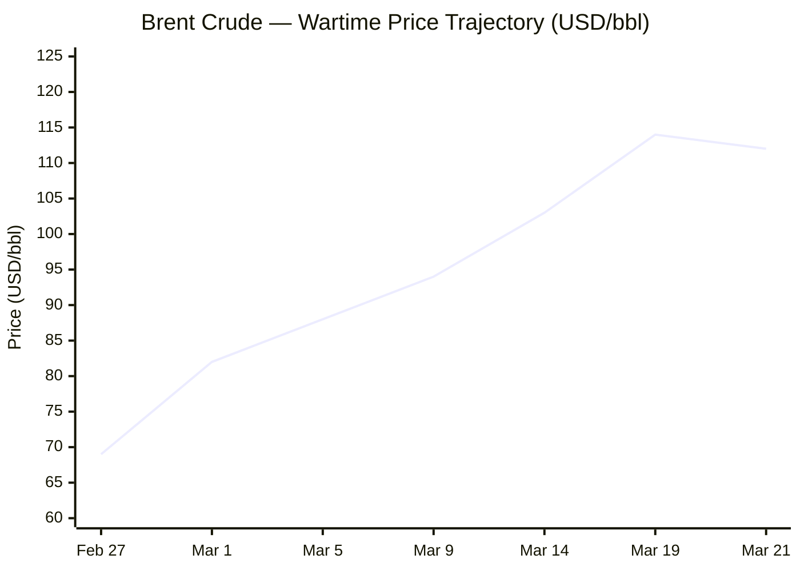
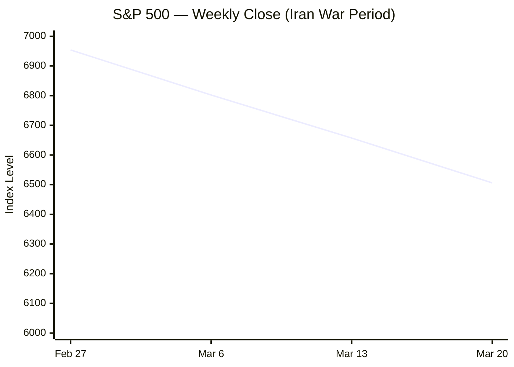

---

# 🌐 MORNING BRIEF
## Sunday, 22 March 2026 · 08:00 CET
### 14 stories across 5 categories

---

## DIGEST SUMMARY

| Category | Stories | Alert Level |
|---|---|---|
| ⚔️ Ongoing Wars | 3 | 🔴 High significance |
| 💼 Business | 3 | 🔴 High significance |
| 🤖 Technology | 3 | 🟡 Developing |
| 🇪🇺 European Union | 3 | 🔴 High significance |
| 📈 Trends | 2 | 🟡 Developing |
| 📊 Key Data | 8 | — |

> **Alert Level key:** 🔴 High significance · 🟡 Developing · 🟢 Stable/Routine

---

## ⚔️ ONGOING WARS
*Conflict Analyst · 3 updates today*

### 1. US–Israel vs. Iran — Operation Epic Fury: Day 22 [MULTI-SOURCE]
**Summary:** The war entered its fourth week with sharply escalating rhetoric. President Trump issued a 48-hour ultimatum on Saturday to "hit and obliterate" Iranian power plants if Tehran does not fully reopen the Strait of Hormuz. Iran struck the Israeli city of Arad with missiles, injuring 64 — including seven in serious condition — in the single highest-casualty attack on Israeli soil since the war began 22 days ago. Separately, Iranian missiles hit Dimona in southern Israel. The International Maritime Organization reports over 3,000 vessels stranded in the Gulf. The US has conducted over 8,000 strike events and is deploying a further 2,200–2,500 Marines to the theatre, even as Trump floated "winding down" military operations. Total Iranian fatalities exceed 1,400.
**Significance:** Trump's 48-hour power plant ultimatum, Iran's continued ability to penetrate Israeli air defences, and the Hormuz closure create a three-way escalation dynamic with no visible off-ramp. Tehran has signalled it will not reopen the Strait without a ceasefire, which Trump has explicitly ruled out.
**Sources:**
- [CNN — Day 22 of Middle East conflict — Iran missiles hit Israel, injuring dozens](https://www.cnn.com/world/live-news/iran-war-us-israel-trump-03-21-26) · 22 March 2026
- [NPR — Iran war enters its fourth week with no clear end in sight](https://www.npr.org/2026/03/21/nx-s1-5755539/iran-war-fourth-week) · 21 March 2026
- [Al Jazeera — Iran war: What's happening on day 22 of US-Israel attacks?](https://www.aljazeera.com/news/2026/3/21/iran-war-what-is-happening-on-day-22-of-us-israel-attacks) · 21 March 2026
- [ABC7 — Iran live updates: Trump threatens power plants if strait not opened in 2 days](https://abc7news.com/live-updates/iran-war-live-updates-israel-steps-operation-lebanon-trump-says-countries-help-strait-hormuz/18721484/) · 22 March 2026

---

### 2. Russia–Ukraine War — Day 1,487 [MULTI-SOURCE]
**Summary:** Ukraine launched approximately 300 drones overnight targeting the Saratov oil refinery, the Engels-2 military airfield, and the Rubikon elite drone unit command post in occupied Mariupol. Russian forces reciprocated with a large-scale drone assault: 148 of 154 Russian drones were intercepted per Ukrainian air defence claims. A Russian strike on Zaporizhzhia city killed a couple — leaving two daughters aged 11 and 15 without parents — and knocked out power to 47,000 subscribers. A further 161 combat engagements were recorded on 21 March, with the main Russian thrusts concentrated on the Pokrovsk, Kostiantynivka and Huliaipole sectors. Nearly 30 Russian drones were also downed over Moscow and its suburbs overnight on 20–21 March.
**Significance:** Ukraine's deep-strike campaign against Russian energy and military infrastructure is intensifying, while Kyiv simultaneously positions its counter-drone expertise as a tradeable asset to Gulf states and the US amid the Iran crisis.
**Sources:**
- [Kyiv Independent — Ukraine launches nearly 300 drones against Russia overnight](https://kyivindependent.com/) · 21–22 March 2026
- [EMPR Media — Russia–Ukraine War Updates as of March 21, 2026](https://empr.media/news/war/russia-ukraine-war-updates-key-developments-as-of-march-21-2026/) · 21 March 2026
- [Ukrinform — Frontline update March 22, 2026](https://www.ukrinform.net/rubric-ato) · 22 March 2026

---

### 3. Ukraine Diplomacy: Hungary and Slovakia Threaten to Block EU Loan
**Summary:** Slovak Prime Minister Robert Fico signalled on 21 March that Slovakia might join Hungary in blocking the €90 billion EU support loan for Ukraine. Hungarian PM Orbán has already vetoed the measure, citing the suspension of Druzhba pipeline oil transit. Fico's statement follows his country's continued opt-out from the enhanced-cooperation arrangement that underpins the loan. Separately, Moscow is reportedly planning to relocate nearly 114,000 Russian citizens to occupied Ukrainian territories, signalling long-term annexation intent.
**Significance:** A Slovak veto would compound the Hungary blockade, creating a dual obstruction that risks delaying the first disbursement window targeted for early April. The move also signals a fracture line within the eastern flank of NATO.
**Sources:**
- [Kyiv Independent — Fico backs Orbán, considers joining Hungary in blocking €90 billion EU loan](https://kyivindependent.com/) · 21 March 2026
- [Al Jazeera — Russia–Ukraine war: List of key events](https://www.aljazeera.com/news/2026/2/21/russia-ukraine-war-list-of-key-events-day-1458) · March 2026

---

## 💼 BUSINESS
*Business Analyst · 3 updates today*

### 1. Global Energy Markets in Acute Crisis — Hormuz Closure Deepens [MULTI-SOURCE]
**Summary:** Brent crude settled at $112.19/bbl on Friday — the highest of the war — before easing marginally to approximately $108 on the opening of Sunday trading. WTI trades near $98/bbl. The IEA reports 15 million barrels per day of Gulf exports have been effectively removed from the market, exceeding the 1973–74 Arab oil embargo in absolute volume terms. Wood Mackenzie calculates 9 million b/d of production shut-in as of 17 March as storage capacity in the Gulf overflowed. Qatar LNG's Ras Laffan facility — processing roughly a fifth of global LNG — sustained "extensive damage" from Iranian strikes, with 12 Mtpa potentially offline for three to five years. European TTF gas prices have surged over 60% since the war began on 28 February. The IEA has urged emergency demand-side measures including reduced highway speeds and remote working.
**Market signal:** Bearish for global equities and consumer-facing sectors; bullish for energy producers, defence contractors and renewables developers. Structural damage to Qatari LNG infrastructure points to a persistent supply premium well beyond any ceasefire.
**Sources:**
- [IEA — Oil Market Report March 2026](https://www.iea.org/reports/oil-market-report-march-2026) · March 2026
- [Wood Mackenzie — The energy crisis is coming to the boil](https://www.woodmac.com/blogs/the-edge/the-energy-crisis-is-coming-to-the-boil/) · 19 March 2026
- [CNN — Day 21: Trump considers 'winding down' war](https://www.cnn.com/world/live-news/iran-war-us-israel-trump-03-20-26) · 20 March 2026

---

### 2. Stagflation Risk Escalates; Fed Rate-Cut Narrative Collapses [MULTI-SOURCE]
**Summary:** The CME FedWatch tool as of 20 March shows a 12% probability of a rate hike at the Federal Reserve's April meeting — a seismic inversion from the near-certain cuts priced in just six weeks ago. Deutsche Bank and Oxford Economics model that oil averaging $140/bbl for eight weeks would produce mild recessions in the eurozone, Japan and the UK, and a "temporary standstill" in the US. Vanguard calculates that oil at $125/bbl sustained through year-end, combined with TTF gas at €150/MWh, could trim a full percentage point from eurozone real GDP and tip the bloc into recession. S&P 500 closed Friday at 6,506, down 1.51%, with the VIX rising 11% on the day to 26.78. South Korea has activated a 100-trillion-won market stabilisation programme.
**Market signal:** Bearish. Stagflationary impulse is building: energy-driven CPI threatens to breach 3.5% in the US by early summer while growth forecasts are revised downward. The "soft landing" narrative is on indefinite hold.
**Sources:**
- [Fortune — Recession and stagflation risks rising](https://fortune.com/2026/03/12/recession-stagflation-oil-iran-trump-deutsche-oxford-economics/) · 12 March 2026
- [Financial Content — The Great Inflation Pivot of 2026](https://markets.financialcontent.com/stocks/article/marketminute-2026-3-20-the-great-inflation-pivot-of-2026-why-the-fed-is-now-considering-an-unthinkable-april-hike) · 20 March 2026
- [World Economic Forum — The global price tag of war in the Middle East](https://www.weforum.org/stories/2026/03/the-global-price-tag-of-war-in-the-middle-east/) · March 2026

---

### 3. Trump Lifts Iranian Oil Sanctions in Emergency Market Intervention
**Summary:** US Treasury Secretary Scott Bessent announced on 21 March a temporary sanctions waiver on approximately 140 million barrels of Iranian oil currently loaded on vessels at sea — enough for roughly 1.4 days of global consumption. The waiver expires 19 April 2026. Bessent argued the move does not materially benefit Iran financially as it covers already-loaded cargoes. Analysts are broadly sceptical: national security experts describe it as "not enough" and "too slow" to meaningfully suppress prices. Goldman Sachs has warned that elevated prices could persist through 2027 given structural damage to Gulf LNG infrastructure.
**Market signal:** Marginally positive in the short term, but insufficient to offset the 15 million b/d supply gap. Structural bearishness dominates the medium-term outlook.
**Sources:**
- [NPR — Trump mulls 'winding down' Iran war, even as Marines head to Mideast](https://www.npr.org/2026/03/20/nx-s1-5754550/israel-strikes-tehran-iran-attacks-gulf) · 20 March 2026
- [CNN — Day 21 live updates](https://www.cnn.com/world/live-news/iran-war-us-israel-trump-03-20-26) · 20 March 2026

---

## 🤖 TECHNOLOGY
*Technology Analyst · 3 updates today*

### 1. OpenClaw Agentic AI Platform Raises Commoditisation Alarm for Foundation Models [MULTI-SOURCE]
**Summary:** Open-source agentic AI platform OpenClaw — built by an Austrian developer and initially unknown six months ago — dominated Nvidia's GTC 2026 conference this week. CEO Jensen Huang described it as potentially the "Linux of AI," running fully autonomous agents on consumer hardware without reliance on major cloud providers. Industry analysts observe the platform is accelerating concerns that frontier LLMs (GPT-5.4, Claude Sonnet 4.6, Gemini) are becoming commodity engines beneath a proliferating ecosystem of agent frameworks. Nvidia responded by launching NemoClaw, an enterprise-grade security layer for OpenClaw deployments. Microsoft has separately integrated Anthropic's Claude Sonnet 4.6 directly into M365 Copilot as of 9 March.
**Analyst note:** If agentic frameworks commoditise underlying models, the strategic moat of large AI labs may shift from model capability to inference cost, distribution agreements and enterprise compliance infrastructure — compressing margins industry-wide.
**Sources:**
- [CNBC — OpenClaw's ChatGPT moment sparks concern that AI models are becoming commodities](https://www.cnbc.com/2026/03/21/openclaw-chatgpt-moment-sparks-concern-ai-models-becoming-commodities.html) · 21 March 2026
- [VT Netzwelt — Latest AI & Technology News Roundup – March 2026](https://www.vtnetzwelt.com/ai-development/latest-ai-technology-news-roundup-march-2026/) · 17 March 2026

---

### 2. US Charges Supermicro-Linked Individuals for Nvidia Chip Diversion to China
**Summary:** US prosecutors have charged three individuals, including persons linked to Super Micro Computer, in an alleged scheme to divert high-end Nvidia AI accelerators to China via Southeast Asian transit routes. The servers in question used advanced chips that fall under US export controls. The case reinforces that AI compute has become a primary geopolitical asset and that export enforcement is now a front-line national security function — not a compliance formality. Separately, the FBI Director confirmed on 20 March that hackers linked to Russian intelligence are actively targeting the messaging app accounts of high-profile US users.
**Analyst note:** The Supermicro case will increase regulatory scrutiny of the entire AI supply chain, from chip fabrication through cloud deployment, and is likely to accelerate the bifurcation of AI ecosystems between US-aligned and China-aligned architectures.
**Sources:**
- [Tech Startups — Top Tech News Today, March 20, 2026](https://techstartups.com/2026/03/20/top-tech-news-today-march-20-2026/) · 20 March 2026
- [Kyiv Independent — FBI Director on Russian hackers targeting US messaging apps](https://kyivindependent.com/) · 21 March 2026

---

### 3. Enterprise AI Governance Gap Widens as Agentic Deployments Scale
**Summary:** A survey of 1,253 cybersecurity professionals published this week by Cybersecurity Insiders finds that AI tools are deployed at 73% of organisations, yet real-time governance controls exist at only 7% — a 66-point structural deficit. Some 37% of respondents reported AI agent-caused operational incidents in the past twelve months, with 8% resulting in outages or data corruption. The survey also notes a critical SharePoint vulnerability (CVE-2026-20963) is being actively exploited in enterprise environments despite a January 2026 patch. The US government has separately urged hardening of Microsoft Intune after Iran-linked actors abused it to wipe employee devices at medtech firm Stryker.
**Analyst note:** As agentic AI deploys faster than governance frameworks mature, the security attack surface is expanding from endpoints into management layers — a qualitative shift in enterprise risk architecture.
**Sources:**
- [Cybersecurity Insiders — AI Risk and Readiness Report 2026](https://www.cybersecurity-insiders.com/ai-risk-and-readiness-report-2026/) · 17 March 2026
- [Tech Startups — SharePoint and Intune vulnerabilities](https://techstartups.com/2026/03/20/top-tech-news-today-march-20-2026/) · 20 March 2026

---

## 🇪🇺 EUROPEAN UNION
*EU Affairs Analyst · 3 updates today*

### 1. European Council Rejects Military Role at Hormuz; Demands Energy Moratorium [MULTI-SOURCE]
**Summary:** The 19 March European Council summit in Brussels concluded with member states refusing to commit military assets to securing the Strait of Hormuz, despite explicit pressure from President Trump, who called NATO allies "cowards." German Foreign Minister Wadephul stated Berlin had "no intention" of joining military operations and demanded US/Israeli transparency on war aims. France suggested expanding the existing EU Aspides naval mission. Published council conclusions called for "a moratorium on strikes against energy and water facilities," condemned Iran's indiscriminate strikes on regional states, and welcomed Ukraine's offer to supply counter-drone expertise to Gulf countries. EU Energy Commissioner Jørgensen wrote to member states allowing storage targets to be reduced by up to 20 percentage points amid market stress.
**Legislative/policy stage:** Council conclusions adopted 19 March 2026; no binding military mandate issued. Commission directed to report on energy security, supply chains and migration impacts.
**Sources:**
- [European Council — Conclusions on Middle East, 19 March 2026](https://www.consilium.europa.eu/en/press/press-releases/2026/03/19/european-council-conclusions-on-middle-east/) · 19 March 2026
- [Al Jazeera — European leaders reject military involvement in Strait of Hormuz](https://www.aljazeera.com/news/2026/3/16/eu-leaders-reject-military-involvement-in-strait-of-hormuz-amid-war-on-iran) · 16 March 2026
- [Time — Europe and Japan ready to join efforts to secure Strait of Hormuz](https://time.com/article/2026/03/19/europe-uk-japan-strait-of-hormuz-oil-gas-prices-iran-war/) · 19 March 2026

---

### 2. EU Energy Emergency Measures Under Active Consideration [MULTI-SOURCE]
**Summary:** European Commission President von der Leyen circulated a blueprint to EU leaders ahead of the 19 March summit outlining options to reduce energy prices, including carbon market adjustments (ETS) and temporary tax cuts on electricity. European natural gas (TTF) has risen over 60% since 28 February. Belgian PM De Wever broke openly with EU consensus, arguing Europe must "normalise relations with Russia and regain access to cheap energy" — a position rejected publicly by von der Leyen, Macron, Merz and Meloni, who called any return to Russian energy a "strategic blunder." The Atlantic Council warns Europe is already heading toward an energy crisis even if a ceasefire were agreed today, given the structural damage to Qatari LNG capacity.
**Legislative/policy stage:** Commission preparing "targeted, short-term measures" for presentation in coming days. Storage regulation flexibilities immediately activated for member states.
**Sources:**
- [Bloomberg — EU Considers Measures to Cut Energy Prices](https://www.bloomberg.com/news/articles/2026-03-16/eu-to-debate-taming-energy-costs-as-iran-war-raises-supply-risks) · 16 March 2026
- [Atlantic Council — How the Iran war could trigger a European energy crisis](https://www.atlanticcouncil.org/dispatches/how-the-iran-war-could-trigger-a-european-energy-crisis/) · 17 March 2026

---

### 3. €90 Billion Ukraine Support Loan — Council Formal Adoption Pending; Veto Risk Rising
**Summary:** The European Parliament approved the €90 billion Ukraine Support Loan package on 11 February (€60bn for defence, €30bn for budget support). Council formal adoption — the final legal hurdle before the first disbursement in early April — remains outstanding. Hungary has already vetoed, citing suspended Druzhba pipeline oil flows. Slovak PM Fico indicated on 21 March that Slovakia may join the veto, despite the agreement being structured under enhanced cooperation among 24 member states that allows it to proceed without unanimity. Czechia has also opted out. Total EU support for Ukraine since 2022 stands at €193.3 billion.
**Legislative/policy stage:** Council formal adoption pending. Target: first disbursement early April 2026. Risk of delay if enhanced cooperation procedure faces further legal challenge.
**Sources:**
- [European Parliament — Parliament approves €90 billion Ukraine support loan](https://www.europarl.europa.eu/news/en/press-room/20260206IPR33903/parliament-approves-EU90-billion-ukraine-support-loan-package) · 11 February 2026
- [European Parliament — Press kit for European Council of 19-20 March 2026](https://www.europarl.europa.eu/news/en/press-room/20260316IPR38218/) · 16 March 2026
- [Kyiv Independent — Fico backs Orbán on blocking EU loan](https://kyivindependent.com/) · 21 March 2026

---

## 📈 TRENDS
*Trends Analyst · 2 updates today*

### 1. Energy Security Overrides Climate Agenda — Renewables Emerge as Resilience Play
**Summary:** The Iran war is catalysing a structural reassessment of energy transition priorities. European Council President António Costa explicitly framed the conflict as validating accelerated domestic energy production: "The best way to have a predictable horizon is to increase home-grown production of energy." Wood Mackenzie reports that import-dependent Asian economies are being hit disproportionately — Japan (99% oil import-dependent), South Korea (98%), India (88%) — and are reassessing LNG sourcing strategies for decades to come. Meanwhile, some European utilities are re-activating coal generation as a near-term buffer, even as long-term renewable investment theses are strengthened. The war is accelerating the strategic reframing of clean energy from an environmental choice to an economic defence mechanism.
**Horizon:** Medium-to-long-term structural shift. The crisis will likely accelerate European renewable capacity timelines and trigger multi-year LNG supply diversification agreements across Asia. Coal revival is a short-term bridge, not a trend reversal.
**Sources:**
- [Time — Europe and Japan scramble amid energy escalation](https://time.com/article/2026/03/19/europe-uk-japan-strait-of-hormuz-oil-gas-prices-iran-war/) · 19 March 2026
- [World Economic Forum — The global price tag of war in the Middle East](https://www.weforum.org/stories/2026/03/the-global-price-tag-of-war-in-the-middle-east/) · March 2026

---

### 2. AI Labour Displacement — Net Employment Broadly Flat, Structural Shifts Deepening
**Summary:** McKinsey's Global Institute report for March 2026 finds that 12% of current job tasks across the global economy have been automated by AI over the past two years, but that 8% of new job categories created in the same period are directly AI-related. Net employment in AI-exposed sectors is approximately flat, with significant variation by income level. High-casualty sectors include legal research, medical imaging, financial data analysis and customer service tier-1 support. Growth sectors include AI safety research, training/evaluation and human-AI collaboration roles in healthcare. McKinsey cautions that the pattern mirrors historical technology transitions — disruption concentrated in routine cognitive tasks, growth in judgment-heavy roles — but notes the pace of disruption is historically unprecedented.
**Horizon:** Medium-term. The current net-flat employment signal may mask a lag: automation in white-collar sectors typically takes 3–5 years to fully transmit to labour markets. The second-order effects on middle-income professional services remain the most significant unpriced risk.
**Sources:**
- [Insightful Post — Artificial Intelligence News 2026](https://www.insightfulpost.com/what-is-artificial-intelligence-news-2026/) · 20 March 2026

---

## 📊 KEY DATA OF THE DAY
*Data Officer · 8 indicators*

| Indicator | Value | Δ vs Prior | Source | URL |
|---|---|---|---|---|
| Brent Crude (spot) | $108.52/bbl | +51.2% YoY | ICE / Investing.com | [link](https://www.investing.com/commodities/brent-oil-historical-data) |
| WTI Crude | $98.09/bbl | +2.66% DoD | NYMEX | [link](https://finance.yahoo.com/quote/BZ=F/) |
| S&P 500 (Fri close) | 6,506.47 | -1.51% DoD | NYSE | [link](https://finance.yahoo.com/quote/BZ=F/) |
| Nasdaq Composite | 21,647.61 | -2.01% DoD | Nasdaq | [link](https://finance.yahoo.com/quote/BZ=F/) |
| VIX | 26.78 | +11.31% DoD | CBOE | [link](https://finance.yahoo.com/quote/BZ=F/) |
| US 10Y Treasury Yield | 4.391% | +2.57% DoD | US Treasury | [link](https://finance.yahoo.com/quote/BZ=F/) |
| Gold (spot) | $4,574.90/oz | -0.67% DoD | COMEX | [link](https://finance.yahoo.com/quote/BZ=F/) |
| EU TTF Natural Gas | +60% since 28 Feb | Wartime surge | IEA / Consilium | [link](https://www.iea.org/reports/oil-market-report-march-2026) |

**Data commentary:** Markets are pricing an energy shock of historically exceptional severity: Brent up 51% year-on-year and currently oscillating around $108–112 as Trump's Hormuz ultimatum deadline approaches. Equity weakness — particularly in Nasdaq (-2%) and S&P 500 (-1.5%) — combined with a rising VIX (26.78) and sharply higher 10-year Treasury yields (4.39%) signals simultaneous erosion of the risk and safe-haven trade. Gold's modest decline despite acute geopolitical stress may reflect liquidation pressure and dollar strength (DXY 99.32). The collision of persistent energy-driven inflation with a still-restrictive Fed rate environment (3.5%) is generating the most challenging monetary policy configuration since the 2022 post-Ukraine spike, but this time without the "starting from zero" optionality the Fed enjoyed then.

---

## 📉 CHARTS

---

## ⚙️ AGENT METADATA

| Field | Value |
|---|---|
| Agent version | MORNING BRIEF v1.0 |
| Run timestamp | 2026-03-22T08:00:00+01:00 |
| Sources queried | 10 / 11 |
| Stories surfaced | 22 |
| Stories published | 14 |
| Languages processed | EN, FR, DE |
| Output language | English |

---
*MORNING BRIEF is an AI-assisted digest. All summaries are paraphrased from original sources. Verify time-sensitive information at the linked URLs before acting.*
