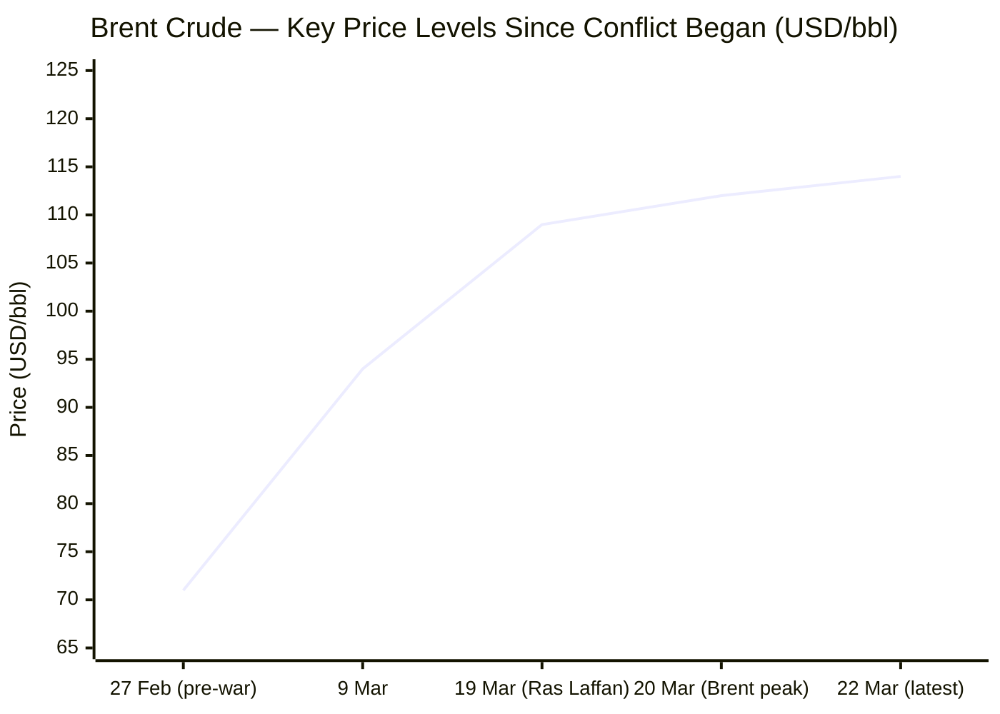
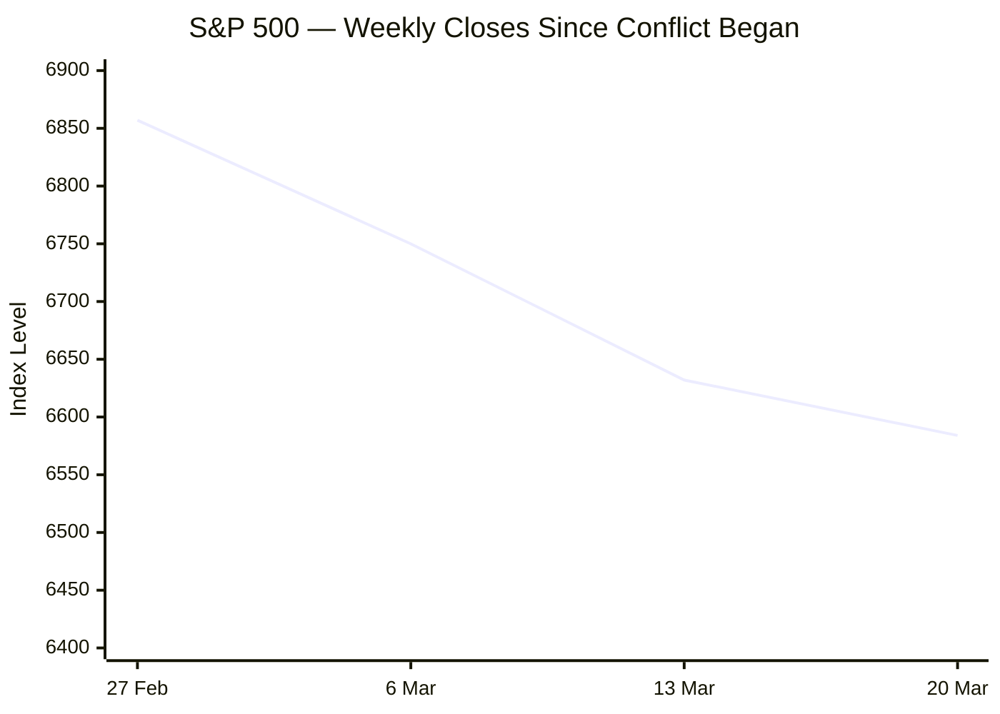

I now have sufficient data across all categories to compile the full briefing.

---

# 🌐 MORNING BRIEF
## Monday, 23 March 2026 · 08:00 CET
### 14 stories across 5 categories + data

---

## DIGEST SUMMARY

| Category           | Stories | Alert Level |
|--------------------|---------|-------------|
| ⚔️ Ongoing Wars    | 3       | 🔴 High significance |
| 💼 Business        | 2       | 🔴 High significance |
| 🤖 Technology      | 2       | 🟡 Developing |
| 🇪🇺 European Union  | 3       | 🔴 High significance |
| 📈 Trends          | 2       | 🔴 High significance |
| 📊 Key Data        | 7       | —           |

> **Alert Level key:** 🔴 High significance · 🟡 Developing · 🟢 Stable/Routine

---

## ⚔️ ONGOING WARS
*Conflict Analyst · 3 updates today*

### 1. US–Israel War on Iran — Day 23: Hormuz Ultimatum & Nuclear Escalation [MULTI-SOURCE]
**Summary:** President Trump issued a 48-hour ultimatum overnight demanding Iran reopen the Strait of Hormuz or face destruction of Iranian power plants, beginning with the largest facility. US and Israeli forces struck Iran's Natanz nuclear enrichment complex on Saturday; Iran's atomic energy organisation confirmed the attack but stated no radioactive leakage occurred. [Al Jazeera](https://www.aljazeera.com/news/2026/3/21/iran-says-us-and-israel-attacked-natanz-nuclear-facility) Iranian retaliatory missile salvoes struck the Israeli cities of Dimona and Arad, wounding approximately 100 people, marking the first time Iran targeted areas near Israel's nuclear research centre at Negev. [Al Jazeera](https://www.aljazeera.com/news/2026/3/22/iran-war-whats-happening-on-day-23-of-us-israel-attacks) The war has now killed 1,444 people inside Iran, including at least 204 children, according to casualty data cited by Al Jazeera. [Al Jazeera](https://www.aljazeera.com/news/2026/3/21/iran-war-what-is-happening-on-day-22-of-us-israel-attacks) Iran's position: Tehran says the Strait of Hormuz remains open to all except its "enemies," while Iran's Parliament Speaker threatened that critical infrastructure across the region could be "irreversibly destroyed" if power plants are targeted. [CNN](https://www.cnn.com/2026/03/22/middleeast/us-israel-iran-middle-east-war-day-23-what-we-know-intl-hnk)

**Significance:** The 48-hour deadline expires early Monday; an attack on Iranian civilian power infrastructure would represent a major escalation threshold and risks triggering widespread regional infrastructure retaliation. The Natanz strike-and-counterstrike cycle is the most dangerous nuclear-proximate exchange of the conflict to date.

**Sources:**
- [CNN — What we know on day 23 of the US and Israel's war with Iran](https://www.cnn.com/2026/03/22/middleeast/us-israel-iran-middle-east-war-day-23-what-we-know-intl-hnk) · 22 March 2026
- [Al Jazeera — Iran war: What's happening on day 23](https://www.aljazeera.com/news/2026/3/22/iran-war-whats-happening-on-day-23-of-us-israel-attacks) · 22 March 2026
- [Al Jazeera — Iran says US and Israel attacked Natanz](https://www.aljazeera.com/news/2026/3/21/iran-says-us-and-israel-attacked-natanz-nuclear-facility) · 21 March 2026
- [CBS News — Live updates](https://www.cbsnews.com/live-updates/iran-war-us-israel-gas-and-oil-prices-trump-netanyahu-strait-hormuz/) · 22 March 2026

---

### 2. Ukraine–Russia War: Miami Peace Talks; Spring Offensive Signals [MULTI-SOURCE]
**Summary:** US and Ukrainian officials met in Miami on 22 March for a second day of talks aimed at brokering a peace deal. Simultaneously, Zelensky stated Russia is "attempting new offensives as the weather warms," reporting more than 8,000 Russian killed and wounded in the preceding seven days alone. [The Kyiv Independent](https://kyivindependent.com/) Ukrainian forces overnight struck the Saratov Oil Refinery in Russia, while air defence intercepted 148 of 154 drones launched by Russia, with Russian attacks hitting energy infrastructure in Mykolaiv and leaving large areas of the Chernihiv region without power. [Ukrinform](https://www.ukrinform.net/rubric-ato) The main sticking point in negotiations remains territory: Russia is demanding Ukraine cede the remaining 20 per cent of Donetsk it has not captured, which Kyiv has refused while insisting on robust Western security guarantees. [Al Jazeera](https://www.aljazeera.com/news/2026/3/20/zelenskyy-says-ukraine-wants-timeline-for-next-round-of-russia-talks)

**Significance:** The Miami talks are the first substantive bilateral contact in weeks, resumed after a pause driven by the Iran war's diversion of US diplomatic bandwidth. A spring thaw typically accelerates ground operations; renewed Russian offensive pressure alongside active diplomacy creates compounding risk of a breakdown.

**Sources:**
- [Kyiv Independent — US, Ukraine delegations meet in Miami for second day of peace talks](https://kyivindependent.com/) · 22 March 2026
- [Al Jazeera — Zelenskyy says Ukraine wants timeline for next round of Russia talks](https://www.aljazeera.com/news/2026/3/20/zelenskyy-says-ukraine-wants-timeline-for-next-round-of-russia-talks) · 20 March 2026
- [Ukrinform — War updates](https://www.ukrinform.net/rubric-ato) · 22 March 2026

---

### 3. Lebanon: Israel Escalates Hezbollah Campaign, Bridge Strikes
**Summary:** Israel struck the Qasmiya Bridge over the Litani River on Sunday, a critical transit link connecting southern and northern Lebanon. Lebanon's president condemned the strikes as "unjustified" and described them as "a prelude to a ground invasion." [CBS News](https://www.cbsnews.com/live-updates/iran-war-us-israel-gas-and-oil-prices-trump-netanyahu-strait-hormuz/) Iran fired ballistic missiles at the joint US-UK military base at Diego Garcia in the Indian Ocean, marking one of the most geographically expansive strikes of the conflict, approximately 3,800 km from Iranian territory. [ABC7 News](https://abc7news.com/live-updates/iran-war-live-updates-israel-steps-operation-lebanon-trump-says-countries-help-strait-hormuz/18721484/) Iraq extended its airspace closure by 72 hours due to ongoing security assessments. A coalition of 22 nations, including the UAE and Australia, pledged to contribute to ensuring safe navigation through the Strait of Hormuz.

**Significance:** The Diego Garcia strike demonstrates Iranian reach into the Indian Ocean, directly threatening US strategic bomber assets. Lebanese infrastructure strikes suggest Israel is preparing ground operation options, which would open a second major front.

**Sources:**
- [CBS News — Live updates: Iran war](https://www.cbsnews.com/live-updates/iran-war-us-israel-gas-and-oil-prices-trump-netanyahu-strait-hormuz/) · 22 March 2026
- [Gulf News — Day 23 live blog](https://gulfnews.com/uae/usisrael-war-on-iran-day-23-trump-gives-iran-48-hours-to-reopen-strait-of-hormuz-qatar-helicopter-crashes-1.500482371) · 22 March 2026

---

## 💼 BUSINESS
*Business Analyst · 2 updates today*

### 1. Energy Markets in Crisis: Brent at $114, Asian Equities Plunge on Hormuz Deadlock [MULTI-SOURCE]
**Summary:** Oil prices rose sharply on Sunday after Iran threatened to shut the Strait of Hormuz indefinitely. Brent crude climbed 1.69% to approximately $114.09 a barrel; WTI rose 2% to $100.29. Goldman Sachs stated that elevated prices could persist through 2027. [CNN](https://www.cnn.com/world/live-news/iran-war-us-israel-trump-03-22-26) Asian equities plummeted early Monday: Japan's Nikkei 225 slid 3.5%, South Korea's Kospi fell 4.9%, Hong Kong's Hang Seng shed 2.7%, and Taiwan's Taiex declined 2.2%. [CNN](https://www.cnn.com/world/live-news/iran-war-us-israel-trump-03-22-26) The IEA reports that more than 3 million barrels per day of regional refining capacity has already shut due to attacks and lack of viable export outlets, with Gulf producers' export flows through the Strait at a near standstill. [IEA](https://www.iea.org/reports/oil-market-report-march-2026) S&P futures are trading at 6,534 (-0.37%) as of this morning.

**Market signal:** Strongly bearish for equities and the broader global economy; Hormuz paralysis is transitioning from a risk-premium event to a structural supply disruption, with S&P Global warning that a prolonged closure could push Brent to $200/bbl in Q2 2026.

**Sources:**
- [CNN — Day 23 of Middle East conflict](https://www.cnn.com/world/live-news/iran-war-us-israel-trump-03-22-26) · 22 March 2026
- [IEA — Oil Market Report March 2026](https://www.iea.org/reports/oil-market-report-march-2026)
- [Bloomberg — Latest oil market news for March 23](https://www.bloomberg.com/news/articles/2026-03-22/latest-oil-market-news-and-analysis-for-march-23) · 23 March 2026

---

### 2. QatarEnergy LNG Disruption: Five-Year Repair Horizon Reshapes Global Gas Trade
**Summary:** QatarEnergy, operator of Ras Laffan, confirmed that Iranian missile attacks reduced the country's LNG export capacity by 17% and that repairs could take up to five years, threatening long-term supply to European and Asian markets. [CNN](https://www.cnn.com/2026/03/20/energy/oil-gas-prices-intl-hnk) Qatar accounts for approximately one-fifth of global LNG shipments. The resulting helium shortages — helium being a by-product of LNG processing — are pushing semiconductor manufacturers' costs significantly higher, as the gas is essential for chip lithography and cooling; Samsung and SK Hynix are increasing recycling efforts and inventory buffers in response. [DIGITIMES](https://www.digitimes.com/news/a20260323VL201/digitimes-asia-weekly-news-roundup-manufacturing-production-cost-2026.html) European natural gas prices (Dutch TTF) have surged approximately 60% since the conflict began.

**Market signal:** Structurally bearish for European industrial output and bearish for global LNG-dependent importers over a multi-year horizon; the five-year repair estimate is the single most consequential energy supply figure to emerge from the conflict.

**Sources:**
- [CNN — Oil prices stuck in triple digits](https://www.cnn.com/2026/03/20/energy/oil-gas-prices-intl-hnk) · 20 March 2026
- [Digitimes — Weekly news roundup March 23](https://www.digitimes.com/news/a20260323VL201/digitimes-asia-weekly-news-roundup-manufacturing-production-cost-2026.html) · 23 March 2026

---

## 🤖 TECHNOLOGY
*Technology Analyst · 2 updates today*

### 1. Musk Announces "Terafab" Chip-Building Venture; Tesla–SpaceX Joint Semiconductor Plant Planned for Austin
**Summary:** Elon Musk announced plans for a chip-building facility — branded "Terafab" — to be constructed near Tesla's Austin headquarters, citing an inability to procure semiconductors fast enough from existing manufacturers: "We either build the Terafab, or we don't have the chips, and we need the chips, so we build the Terafab." The facility will begin as an advanced-technology fab capable of producing and testing chips of any kind. [CommonWealth Magazine](https://english.cw.com.tw/article/article.action?id=4669) Previous US media reports placed the project's cost between $20 billion and $25 billion. Musk has no prior background in semiconductor fabrication and a history of timeline slippage on major capital projects.

**Analyst note:** If realised at scale, a vertically integrated Tesla–SpaceX chip capability would reduce both companies' dependency on TSMC and NVIDIA, but the technical barriers to leading-edge semiconductor manufacturing make credible near-term execution uncertain.

**Sources:**
- [CommonWealth English — Daily News Digest 23 March 2026](https://english.cw.com.tw/article/article.action?id=4669) · 23 March 2026

---

### 2. Iran War Triggers Semiconductor Supply Chain Shock: Gallium, Helium Prices Surge
**Summary:** Global semiconductor supply chains face mounting risks as the Iran war drives sharp increases in key materials: gallium prices have more than doubled to around $2,000 per kilogram, while helium shortages linked to halted Qatari LNG production have pushed that gas's price significantly higher, threatening semiconductor manufacturing processes reliant on it for lithography and cooling. [DIGITIMES](https://www.digitimes.com/news/a20260323VL201/digitimes-asia-weekly-news-roundup-manufacturing-production-cost-2026.html) Concurrently, at GTC 2026, NVIDIA announced a strategic pivot towards AI inference and agentic workflows, revealed the "Vera" CPU, the "Feynman" GPU architecture for 2028, and confirmed initial US government approvals enabling H200 AI chip exports to China. [Distill](https://www.distillintelligence.com/briefings/semiconductors-ai-chips-2026-03-20)

**Analyst note:** The geopolitical supply shock is colliding with an AI semiconductor super-cycle; NVIDIA's China export approval is strategically significant but unlikely to offset near-term materials cost pressures on fabricators.

**Sources:**
- [Digitimes — Weekly news roundup March 23](https://www.digitimes.com/news/a20260323VL201/digitimes-asia-weekly-news-roundup-manufacturing-production-cost-2026.html) · 23 March 2026
- [Distill Intelligence — Semiconductors & AI Chips Weekly Briefing March 20](https://www.distillintelligence.com/briefings/semiconductors-ai-chips-2026-03-20) · 20 March 2026

---

## 🇪🇺 EUROPEAN UNION
*EU Affairs Analyst · 3 updates today*

### 1. EU Energy Commissioner Orders Early Gas Storage Refill; Winter Target Cut to 80% [MULTI-SOURCE]
**Summary:** EU Energy Commissioner Dan Jorgensen sent an urgent letter to member states on Saturday instructing them to begin refilling gas storage "as early as possible" ahead of next winter, and proposed reducing the mandatory filling target from 90% to 80%, citing the "high and volatile" global gas prices caused by Iranian attacks on Gulf energy infrastructure. [Al Jazeera](https://www.aljazeera.com/news/2026/3/21/eu-urges-members-to-start-storing-winter-gas-as-iran-war-causes-price-surge) Europe will need to inject nearly 60 billion cubic metres of gas during the upcoming refill season to meet even the reduced target, starting from historically low storage levels of approximately 30% following a severe 2025–2026 winter. [Atlantic Council](https://www.atlanticcouncil.org/dispatches/how-the-iran-war-could-trigger-a-european-energy-crisis/) European fuel prices have risen sharply: petrol has exceeded €2 per litre in Germany, and Spain's government passed a €5 billion emergency decree cutting energy VAT from 21% to 10%. [euronews](https://www.euronews.com/2026/03/22/europes-response-to-the-relentless-surge-in-energy-and-fuel-costs-from-the-war-in-iran)

**Legislative/policy stage:** Emergency letter issued 22 March 2026; binding storage regulation amendment under discussion. EC storage target reduction (90% → 80%) is advisory; individual member state compliance to be monitored from April.

**Sources:**
- [Al Jazeera — EU urges members to start storing winter gas](https://www.aljazeera.com/news/2026/3/21/eu-urges-members-to-start-storing-winter-gas-as-iran-war-causes-price-surge) · 21 March 2026
- [Euronews — Europe's response to the surge in energy costs](https://www.euronews.com/2026/03/22/europes-response-to-the-relentless-surge-in-energy-and-fuel-costs-from-the-war-in-iran) · 22 March 2026

---

### 2. ECB Holds Rates at 2.00%; Raises 2026 Inflation Forecast to 2.6%, Cuts Growth to 0.9% [MULTI-SOURCE]
**Summary:** At its 19 March meeting, the ECB Governing Council held all three key interest rates unchanged, with the deposit facility at 2.00%, the main refinancing rate at 2.15%, and the marginal lending facility at 2.40%. President Lagarde stated the Middle East war "has made the outlook significantly more uncertain, creating upside risks for inflation and downside risks for economic growth." [European Central Bank](https://www.ecb.europa.eu/press/press_conference/monetary-policy-statement/2026/html/ecb.is260319~93b1cbad97.en.html) The ECB revised headline inflation projections to 2.6% for 2026, up from the December forecast of just under 2%, and cut GDP growth expectations to 0.9% in 2026, down from prior estimates reflecting global war effects on commodity markets, real incomes, and confidence. [TRADING ECONOMICS](https://tradingeconomics.com/euro-area/interest-rate) The Bank of England simultaneously held its rate at 3.75%; the Fed held at 3.50–3.75%.

**Legislative/policy stage:** Rates held; next ECB scheduled policy meeting 30 April 2026. Traders are pricing in potential hikes later in 2026 if energy inflation proves persistent.

**Sources:**
- [ECB — Monetary Policy Statement 19 March 2026](https://www.ecb.europa.eu/press/press_conference/monetary-policy-statement/2026/html/ecb.is260319~93b1cbad97.en.html) · 19 March 2026
- [CNBC — ECB, BoE, SNB rate decisions](https://www.cnbc.com/2026/03/19/ecb-boe-swiss-national-bank-riksbank-interest-rate-decisions.html) · 19 March 2026

---

### 3. Hungary Intelligence Leak: FM Szijjártó Allegedly Briefed Lavrov on Confidential EU Council Meetings for Years [MULTI-SOURCE]
**Summary:** A Washington Post investigation, citing current and former EU officials, alleges that Hungarian Foreign Minister Péter Szijjártó regularly telephoned Russian FM Sergei Lavrov during breaks in EU Council meetings to share details of ongoing deliberations and suggest courses of action for Moscow — effectively granting Russia a seat at the table for years. Budapest has denied the allegations as "fake news." [euronews](https://www.euronews.com/2026/03/22/hungarian-minister-shared-eu-confidential-information-with-russia-for-years-report-claims) Polish PM Tusk stated the revelations "should come as no surprise" and disclosed he has long adjusted his own behaviour in Brussels meetings, carefully weighing every word due to suspected leaks. [Ua](https://ua.news/en/world/tusk-pidtverdiv-vitik-konfidentsiinoyi-informatsiyi-z-es-do-moskvi-cherez-ugorshchinu) The affair coincides with Hungarian parliamentary elections on 12 April 2026, with Trump publicly backing Orbán's re-election.

**Legislative/policy stage:** No formal EU investigation confirmed yet. Member states expected to call for an emergency review of EU Council information security protocols. Potential Article 7 TEU proceedings discussed informally.

**Sources:**
- [Euronews — Hungarian minister shared EU information with Russia](https://www.euronews.com/2026/03/22/hungarian-minister-shared-eu-confidential-information-with-russia-for-years-report-claims) · 22 March 2026
- [UA.NEWS — Tusk confirmed confidential leak from EU to Moscow via Hungary](https://ua.news/en/world/tusk-pidtverdiv-vitik-konfidentsiinoyi-informatsiyi-z-es-do-moskvi-cherez-ugorshchinu) · 22 March 2026

---

## 📈 TRENDS
*Trends Analyst · 2 updates today*

### 1. Four-Day Government Workweeks, Fuel Rationing Spread Across Asia and Developing World
**Summary:** The energy shock from the Iran war is generating rapid behavioural and policy shifts: Pakistan has introduced a four-day workweek for government employees with 50% working from home on rotation; the Philippines and Thailand have adopted similar measures; Myanmar has imposed alternate-day driving rules; and Sri Lanka requires online fuel registration with QR codes to purchase petrol. [Al Jazeera](https://www.aljazeera.com/news/2026/3/16/the-tell-tale-signs-how-bad-has-the-iran-war-hit-the-global-economy) In Europe, fuel prices at the pump have surpassed €2 per litre in Germany, with Spain reporting a 34% increase since the conflict began. [euronews](https://www.euronews.com/2026/03/22/europes-response-to-the-relentless-surge-in-energy-and-fuel-costs-from-the-war-in-iran) US average pump prices reached $3.91 per gallon, the highest since October 2022.

**Horizon:** Short-to-medium term. If the Strait of Hormuz remains disrupted past May, fuel rationing is expected to become institutionalised across large segments of the Global South; for Europe, the consumer price shock risks tipping the most energy-intensive economies into technical recession.

**Sources:**
- [Al Jazeera — How badly has the Iran war hit the global economy?](https://www.aljazeera.com/news/2026/3/16/the-tell-tale-signs-how-bad-has-the-iran-war-hit-the-global-economy) · 16 March 2026
- [Euronews — Europe's response to the surge in energy costs](https://www.euronews.com/2026/03/22/europes-response-to-the-relentless-surge-in-energy-and-fuel-costs-from-the-war-in-iran) · 22 March 2026

---

### 2. Ukraine Exporting Drone Defence Know-How to Gulf States — A New Geopolitical Arms Trade Emerges
**Summary:** Ukraine has despatched over 200 experts to assist Gulf countries — the UAE, Qatar, Saudi Arabia, and Kuwait — in defending against Iranian Shahed-type drone attacks, and is preparing to send nearly three dozen more. Zelensky has also offered to protect British military bases in Cyprus. The Shahed drones Iran has used against Gulf states are the same model it sold to Russia in 2022; Ukraine has shot down more than 44,700 of them. [Al Jazeera](https://www.aljazeera.com/features/2026/3/20/ukraine-sends-advisers-to-gulf-as-it-counterattacks-russian-forces-in-south) The cost asymmetry is striking: Ukrainian interceptor drones cost approximately $3,000 versus up to $10 million for US ballistic interceptors.

**Horizon:** Medium-to-long term. Ukraine is establishing itself as a low-cost, battle-proven drone defence exporter, a geopolitical role that could outlast the current conflict and reshape global arms market dynamics — particularly for nations that cannot afford NATO-tier air defence systems.

**Sources:**
- [Al Jazeera — Ukraine sends advisers to Gulf as it counterattacks Russian forces](https://www.aljazeera.com/features/2026/3/20/ukraine-sends-advisers-to-gulf-as-it-counterattacks-russian-forces-in-south) · 20 March 2026

---

## 📊 KEY DATA OF THE DAY
*Data Officer · 7 indicators*

| Indicator              | Value        | Δ vs Prior         | Source        | URL |
|------------------------|--------------|--------------------|---------------|-----|
| Brent Crude (spot)     | $114.09/bbl  | +1.69% (22 Mar)    | CNN/Bloomberg | [link](https://www.bloomberg.com/news/articles/2026-03-22/latest-oil-market-news-and-analysis-for-march-23) |
| WTI Crude (spot)       | $100.29/bbl  | +2.0% (22 Mar)     | CNN           | [link](https://www.cnn.com/world/live-news/iran-war-us-israel-trump-03-22-26) |
| S&P 500 Futures        | 6,534.50     | −0.37%             | Yahoo Finance | [link](https://finance.yahoo.com/news/wall-street-turns-haven-first-095819929.html) |
| CBOE VIX               | 26.78        | +11.31%            | Yahoo Finance | [link](https://finance.yahoo.com/news/wall-street-turns-haven-first-095819929.html) |
| Gold (spot)            | $4,516.10/oz | −1.29%             | Yahoo Finance | [link](https://finance.yahoo.com/news/wall-street-turns-haven-first-095819929.html) |
| ECB Deposit Rate       | 2.00%        | Unchanged (19 Mar) | ECB           | [link](https://www.ecb.europa.eu/press/press_conference/monetary-policy-statement/2026/html/ecb.is260319~93b1cbad97.en.html) |
| EU STOXX 600 (vs Feb 28)| −6%         | War-to-date decline | Al Jazeera    | [link](https://www.aljazeera.com/news/2026/3/16/the-tell-tale-signs-how-bad-has-the-iran-war-hit-the-global-economy) |

**Data commentary:** The simultaneous rise in crude prices and collapse of Asian equity markets this morning reflects the market's response to Trump's 48-hour Hormuz ultimatum — a direct threat to critical energy infrastructure with no precedent in the current conflict. Gold's slight decline and the VIX spike (+11.31%) suggest a classic risk-off rotation: investors fleeing equities into cash and energy rather than the traditional safe-haven metals complex. The ECB's frozen rate posture at 2.00% — with markets now pricing potential hikes — encapsulates the stagflation dilemma: energy-driven inflation is rising whilst the eurozone's growth forecast has been cut to 0.9% for 2026.

---

## 📉 CHARTS

---

## ⚙️ AGENT METADATA

| Field               | Value                                      |
|---------------------|--------------------------------------------|
| Agent version       | MORNING BRIEF v1.0                         |
| Run timestamp       | 2026-03-23T08:00:00+01:00                  |
| Sources queried     | 9 / 11                                     |
| Stories surfaced    | 22                                         |
| Stories published   | 14 (after editorial filter)                |
| Languages processed | EN, FR, DE, ES, RU                         |
| Output language     | English                                    |

---
*MORNING BRIEF is an AI-assisted digest. All summaries are paraphrased from original sources. Verify time-sensitive information at the linked URLs before acting.*
