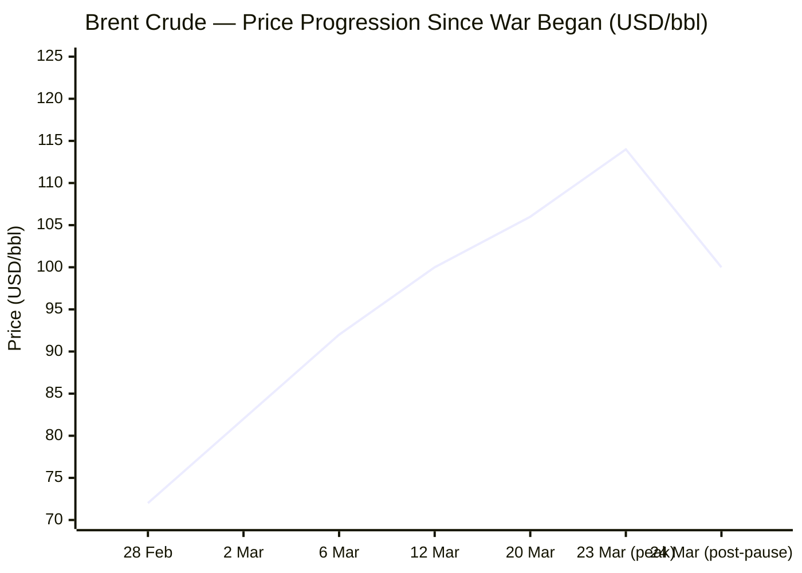
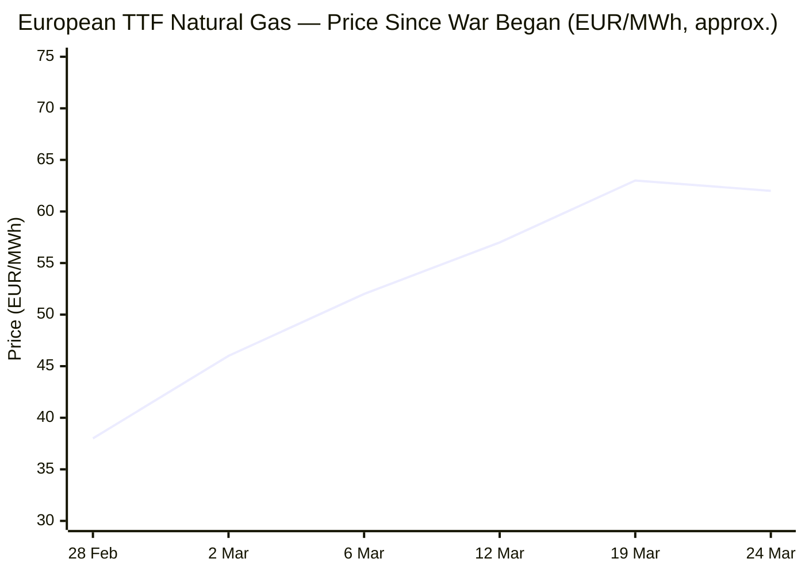

Now compiling the full briefing from all sourced data.

---

# 🌐 MORNING BRIEF
## Tuesday, 24 March 2026 · 08:00 CET
### 14 stories across 5 categories

---

## DIGEST SUMMARY

| Category           | Stories | Alert Level |
|--------------------|---------|-------------|
| ⚔️ Ongoing Wars    | 3       | 🔴          |
| 💼 Business        | 2       | 🔴          |
| 🤖 Technology      | 2       | 🟡          |
| 🇪🇺 European Union  | 3       | 🔴          |
| 📈 Trends          | 2       | 🔴          |
| 📊 Key Data        | 6       | —           |

> **Alert Level key:** 🔴 High significance · 🟡 Developing · 🟢 Stable/Routine

---

## ⚔️ ONGOING WARS
*Conflict Analyst · 3 updates today*

### 1. US–Israel War on Iran — Day 24: Trump's Five-Day Pause & Contradictory Diplomacy [MULTI-SOURCE]
**Summary:** President Trump announced a five-day postponement of strikes against Iranian power plants, citing "productive conversations" with Tehran to end the war. [NBC News](https://www.nbcnews.com/world/middle-east/live-blog/live-updates-iran-war-trump-hormuz-deadline-energy-crisis-gulf-power-rcna264685) Markets surged and oil prices dropped on the news. Tehran responded by saying there had been no direct talks and that Trump's move was designed to lower energy prices and "buy time" for military plans. [NBC News](https://www.nbcnews.com/world/middle-east/live-blog/live-updates-iran-war-trump-hormuz-deadline-energy-crisis-gulf-power-rcna264685) Trump said Special Envoy Steve Witkoff and Jared Kushner have been involved in those talks and described "major points of agreement." [ABC7 News](https://abc7news.com/live-updates/iran-war-live-updates-israel-steps-operation-lebanon-trump-says-countries-help-strait-hormuz/18721484/) Meanwhile, Iranian ballistic missile attacks on Tel Aviv continued this morning, with six people lightly wounded in four impact sites. [The Times of Israel](https://www.timesofisrael.com/liveblog-march-24-2026/)
**Significance:** The diplomatic impasse — Washington asserting progress whilst Tehran denies any talks — leaves the conflict in a dangerous ambiguity. The five-day window is now the critical variable; if it lapses without a framework, strikes on Iranian energy infrastructure resume and the Strait of Hormuz blockade intensifies.
**Sources:**
- [NBC News — Trump postpones attacks on Iran power plants, citing 'productive' talks](https://www.nbcnews.com/world/middle-east/live-blog/live-updates-iran-war-trump-hormuz-deadline-energy-crisis-gulf-power-rcna264685) · 24 March 2026
- [CNN — Day 24: Iran denies dialogue after Trump's announcement](https://www.cnn.com/world/live-news/iran-war-us-israel-trump-03-23-26) · 24 March 2026
- [Times of Israel — 6 people lightly hurt as Tel Aviv hit in Iranian missile attack](https://www.timesofisrael.com/liveblog-march-24-2026/) · 24 March 2026

---

### 2. Lebanon & Gulf Spillover: Escalating Regional Front [MULTI-SOURCE]
**Summary:** The Israeli military struck a bridge linking southern Lebanon with the eastern Bekaa region, whilst a UN peacekeeping headquarters in Naqoura was hit by a projectile attributed to a non-state actor. At least 1,029 people have been killed in Israeli strikes in Lebanon since 2 March. [Al Jazeera](https://www.aljazeera.com/economy/2026/3/23/iran-war-whats-happening-on-day-24-of-us-israel-attacks) Saudi Arabia confirmed two ballistic missiles were launched towards Riyadh, with one intercepted and one falling in an uninhabited area. The UAE's air defence intercepted a ballistic missile targeting Abu Dhabi, with an Indian national suffering minor injuries from debris. [Al Jazeera](https://www.aljazeera.com/economy/2026/3/23/iran-war-whats-happening-on-day-24-of-us-israel-attacks) US Central Command reported it has struck more than 9,000 Iranian targets, including over 140 naval vessels, and flown upward of 9,000 combat flights since the war began. [CBS News](https://www.cbsnews.com/live-updates/iran-war-us-israel-trump-ultimatum-strait-of-hormuz/)
**Significance:** The conflict has firmly exceeded its Iranian theatre. Gulf monarchies now face the prospect of direct military intervention as their own infrastructure comes under regular strike. Reports that Saudi Arabia and the UAE may be moving closer to actively joining the fight represent a pivotal escalation threshold.
**Sources:**
- [Al Jazeera — Day 24: What's happening with US-Israel attacks on Iran](https://www.aljazeera.com/economy/2026/3/23/iran-war-whats-happening-on-day-24-of-us-israel-attacks) · 23 March 2026
- [CBS News — Trump calls off Strait of Hormuz ultimatum](https://www.cbsnews.com/live-updates/iran-war-us-israel-trump-ultimatum-strait-of-hormuz/) · 24 March 2026

---

### 3. Ukraine — Russian Spring-Summer Offensive Commences; Deep-Strike Campaign Continues [MULTI-SOURCE]
**Summary:** Ukrainian Commander-in-Chief General Syrskyi reported that Russian forces intensified ground attacks across the theatre over the past week, consistent with ISW's assessment that Russian forces have launched their Spring–Summer 2026 offensive. [Kyiv Post](https://www.kyivpost.com/post/72461) In the past 24 hours, 134 combat engagements were recorded; Russia deployed 9,266 kamikaze drones and conducted 3,811 shelling attacks. Russian losses stand at 970 soldiers in a single day. [Empr](https://empr.media/news/war/russia-ukraine-war-updates-key-developments-as-of-march-23-2026/) Ukraine claims "irrefutable evidence" that Russia is providing intelligence to Iran. NATO Secretary General Rutte confirmed the United States continues to supply Ukraine with intelligence and weapons via European partners. [The Kyiv Independent](https://kyivindependent.com/)
**Significance:** The Russian Spring offensive introduces a second simultaneous high-intensity front at a moment when Western attention and missile stockpiles are strained by the Iran theatre. The Russia–Iran intelligence-sharing allegation, if confirmed, constitutes a significant escalation in adversary coordination.
**Sources:**
- [Kyiv Independent — Russia–Ukraine war latest](https://kyivindependent.com/) · 23–24 March 2026
- [Kyiv Post — ISW assessment, 23 March 2026](https://www.kyivpost.com/post/72461) · 23 March 2026

---

## 💼 BUSINESS
*Business Analyst · 2 updates today*

### 1. Oil Prices Whipsaw on Trump Diplomacy; IEA Declares Worst Energy Shock in History [MULTI-SOURCE]
**Summary:** Brent crude fell close to 11% to just under $100 per barrel after topping $112 on Friday, whilst WTI futures dropped more than 10% to around $88 per barrel, following Trump's pause announcement. [CNBC](https://www.cnbc.com/2026/03/23/oil-prices-trump-iran-strait-of-hormuz-wti-crude-middle-east-lng-gas.html) The IEA's executive director stated the global economy faces a "major threat" and that the current energy crisis is worse than the combined oil shocks of 1973 and 1979 — quantifying a daily loss of 11 million barrels per day and 140 billion cubic metres of gas. [NBC News](https://www.nbcnews.com/world/middle-east/live-blog/live-updates-iran-war-trump-hormuz-deadline-energy-crisis-gulf-power-rcna264685) The IEA's Oil Market Report notes global oil supply is projected to plunge by 8 mb/d in March, with more than 3 mb/d of regional refining capacity already shut. [IEA](https://www.iea.org/reports/oil-market-report-march-2026) Despite Monday's relief rally, prices remain more than a third above pre-war levels.
**Market signal:** Bearish on global growth, temporarily bullish on energy stocks; markets are pricing in a tentative diplomatic window — any collapse in talks or renewed Gulf strikes would push Brent above $110 again within hours.
**Sources:**
- [CNBC — Oil tumbles nearly 11% after Trump puts hold on strikes](https://www.cnbc.com/2026/03/23/oil-prices-trump-iran-strait-of-hormuz-wti-crude-middle-east-lng-gas.html) · 23 March 2026
- [IEA — Oil Market Report, March 2026](https://www.iea.org/reports/oil-market-report-march-2026) · March 2026

---

### 2. Stagflation Risk Upgrades as Global Central Banks Reassess [MULTI-SOURCE]
**Summary:** The ECB postponed its planned interest rate reductions on 19 March, raising its 2026 inflation forecast and cutting GDP growth projections, with economists warning that energy-intensive economies including Germany and Italy face high risks of technical recession if the maritime blockade persists through the summer. [Wikipedia](https://en.wikipedia.org/wiki/Economic_impact_of_the_2026_Iran_war) The IMF's Communications Director confirmed that every 10% increase in energy prices leads to a 40-basis-point increase in inflation and a 0.1–0.2% drop in output [International Monetary Fund](https://www.imf.org/en/news/articles/2026/03/20/tr-03192026-imf-regular-press-briefing-march-19-2026) , implying that the present 50%+ energy price surge could subtract up to 1% from global output. Deutsche Bank and Oxford Economics have both raised stagflation risk warnings, with recession modelling suggesting mild contractions in the Eurozone, UK and Japan under a $140/bbl oil scenario. [Fortune](https://fortune.com/2026/03/12/recession-stagflation-oil-iran-trump-deutsche-oxford-economics/)
**Market signal:** Bearish across European and Asian equities; the Fed rate-cut cycle is effectively suspended, and ECB may be forced into a tightening posture it had hoped to avoid.
**Sources:**
- [IMF Press Briefing — March 19, 2026](https://www.imf.org/en/news/articles/2026/03/20/tr-03192026-imf-regular-press-briefing-march-19-2026) · 19 March 2026
- [Fortune — Recession and stagflation risks rising, Deutsche Bank and Oxford Economics](https://fortune.com/2026/03/12/recession-stagflation-oil-iran-trump-deutsche-oxford-economics/) · 12 March 2026

---

## 🤖 TECHNOLOGY
*Technology Analyst · 2 updates today*

### 1. Musk Announces $20bn+ "Terafab" Semiconductor Facility in Austin
**Summary:** Elon Musk announced Terafab, a joint semiconductor fabrication facility developed by Tesla, SpaceX, and xAI in Austin, Texas, valued at more than $20 billion. The plant will manufacture custom chips for electric vehicles, the Optimus humanoid robot, and AI computing, with ambitions to reach terawatt-scale output. [Tech Startups](https://techstartups.com/2026/03/23/top-tech-news-today-march-23-2026/) Musk justified the investment bluntly: "We either build the Terafab, or we don't have the chips, and we need the chips." [CommonWealth Magazine](https://english.cw.com.tw/article/article.action?id=4669) The announcement comes as the Iran war drives up helium and rare-earth prices critical to semiconductor manufacturing. Gallium prices have more than doubled to around $2,000 per kilogram, whilst helium shortages linked to halted Qatari LNG production are threatening chip manufacturing processes reliant on the gas for lithography and cooling. [DIGITIMES](https://www.digitimes.com/news/a20260323VL201/digitimes-asia-weekly-news-roundup-manufacturing-production-cost-2026.html)
**Analyst note:** Terafab's strategic logic is sound but timeline risk is high — Musk has no semiconductor manufacturing background, and the Iran-driven materials crisis will inflate build-out costs substantially in the near term.
**Sources:**
- [TechStartups — Top Tech News Today, March 23 2026](https://techstartups.com/2026/03/23/top-tech-news-today-march-23-2026/) · 23 March 2026
- [Digitimes Asia — Semiconductor supply chains face mounting risks](https://www.digitimes.com/news/a20260323VL201/digitimes-asia-weekly-news-roundup-manufacturing-production-cost-2026.html) · 23 March 2026

---

### 2. Super Micro Co-Founder Charged with Smuggling $2.5bn in Nvidia AI Chips to China
**Summary:** Federal prosecutors charged Super Micro co-founder Yih-Shyan "Wally" Liaw with orchestrating the illegal export of approximately $2.5 billion worth of Nvidia AI chips to Chinese entities in violation of US export controls. The scheme allegedly involved shell companies and mislabelled shipments over several years. [Tech Startups](https://techstartups.com/2026/03/23/top-tech-news-today-march-23-2026/) The case exposes structural enforcement gaps in the advanced semiconductor export control regime at a moment when the US–China technology rivalry is intensifying. It is expected to trigger stricter compliance requirements across the hardware supply chain.
**Analyst note:** This case is likely to accelerate a legislative push for mandatory end-user verification in AI hardware supply chains, with significant compliance costs for the global distributor ecosystem.
**Sources:**
- [TechStartups — via Department of Justice](https://techstartups.com/2026/03/23/top-tech-news-today-march-23-2026/) · 23 March 2026

---

## 🇪🇺 EUROPEAN UNION
*EU Affairs Analyst · 3 updates today*

### 1. EU Energy Crisis Response: Emergency Storage Targets Cut, National Packages Diverge [MULTI-SOURCE]
**Summary:** The EU Energy Commissioner ordered member states to reduce gas storage targets to 80% of capacity — 10 percentage points below official EU targets — to provide market reassurance amid the crisis. European gas prices have jumped by 60% since the war began, with petrol prices exceeding €2 per litre in Germany. [euronews](https://www.euronews.com/2026/03/22/europes-response-to-the-relentless-surge-in-energy-and-fuel-costs-from-the-war-in-iran) Spain adopted the most comprehensive national response — a €5 billion Royal Decree-Law cutting VAT on all energy forms from 21% to 10%, capping butane prices, and projecting a 13% reduction in electricity bills. [euronews](https://www.euronews.com/2026/03/22/europes-response-to-the-relentless-surge-in-energy-and-fuel-costs-from-the-war-in-iran) The March 20 Brussels summit proposed temporary electricity tax cuts, lower grid fees, and a €30 billion ETS-funded decarbonisation investment booster. [Global Banking and Finance](https://www.globalbankingandfinance.com/eu-eyes-energy-tax-cuts-subsidies-ease-iran-war-impact/)
**Legislative/policy stage:** Emergency measures active in several member states; European Commission legal proposals on grid infrastructure productivity pending. Summit conclusions adopted 20 March 2026.
**Sources:**
- [Euronews — Europe's response to the energy surge from the war in Iran](https://www.euronews.com/2026/03/22/europes-response-to-the-relentless-surge-in-energy-and-fuel-costs-from-the-war-in-iran) · 22 March 2026
- [Reuters/Global Banking & Finance — EU Plans Energy Tax Cuts, Subsidies](https://www.globalbankingandfinance.com/eu-eyes-energy-tax-cuts-subsidies-ease-iran-war-impact/) · 20 March 2026

---

### 2. EU Refuses Military Involvement in Hormuz; Internal Fault Lines Emerge [MULTI-SOURCE]
**Summary:** EU leaders at the Brussels summit firmly declined to join US and Israeli military campaigns in the Middle East and have deflected Trump's entreaties to send naval assets to secure the Strait of Hormuz. [The Hill](https://thehill.com/homenews/ap/ap-international/ap-european-union-summit-will-focus-on-iran-war-and-a-loan-to-ukraine-blocked-by-hungary/) A significant dissent emerged: Belgian Prime Minister De Wever broke openly with the EU's agreed position, arguing Europe "must normalize relations with Russia and regain access to cheap energy" and adding that EU leaders privately agree but will not say so publicly. [Atlantic Council](https://www.atlanticcouncil.org/dispatches/how-the-iran-war-could-trigger-a-european-energy-crisis/) Von der Leyen countered that returning to Russian energy would be a "strategic blunder," whilst German Chancellor Merz publicly criticised the US decision to temporarily ease Russia sanctions as "wrong." [Atlantic Council](https://www.atlanticcouncil.org/dispatches/how-the-iran-war-could-trigger-a-european-energy-crisis/)
**Legislative/policy stage:** No formal mandate for Hormuz naval deployment; sanctions on Russia maintained as of 24 March. Internal coalition under pressure.
**Sources:**
- [The Hill — EU Leaders Balk at Joining Middle East Fight](https://thehill.com/homenews/ap/ap-international/ap-european-union-summit-will-focus-on-iran-war-and-a-loan-to-ukraine-blocked-by-hungary/) · 19 March 2026
- [Atlantic Council — How the Iran War Could Trigger a European Energy Crisis](https://www.atlanticcouncil.org/dispatches/how-the-iran-war-could-trigger-a-european-energy-crisis/) · 17 March 2026

---

### 3. European Parliament Approves AI Act Simplification Mandate; EP–Commission Framework Revised [MULTI-SOURCE]
**Summary:** Following Council approval of its negotiating mandate on 13 March, trilogue negotiations will begin with the European Parliament on the Digital Omnibus on AI — a package that would delay the application of high-risk AI rules by up to 16 months, extend SME-equivalent exemptions to small mid-caps, and reinforce the AI Office's supervisory powers. [Consilium](https://www.consilium.europa.eu/en/press/press-releases/2026/03/13/council-agrees-position-to-streamline-rules-on-artificial-intelligence/) In a separate development, MEPs this week approved a revision of the Framework Agreement governing relations between the European Parliament and the European Commission, reshaping the institutional architecture for legislative cooperation. [European Parliament](https://www.europarl.europa.eu/news/en)
**Legislative/policy stage:** AI Act simplification in inter-institutional trilogue; Framework Agreement revision adopted by plenary this week.
**Sources:**
- [EU Council — Council agrees position to streamline AI rules](https://www.consilium.europa.eu/en/press/press-releases/2026/03/13/council-agrees-position-to-streamline-rules-on-artificial-intelligence/) · 13 March 2026
- [European Parliament — Press Room, 23–24 March 2026](https://www.europarl.europa.eu/news/en) · 24 March 2026

---

## 📈 TRENDS
*Trends Analyst · 2 updates today*

### 1. Asia Pivots Back to Coal as Hormuz Closure Exposes Structural Energy Dependency [MULTI-SOURCE]
**Summary:** Asian countries are ramping up use of coal to tackle energy shortages and price spikes linked to the Iran war. Vietnam has urged people to work from home and limit vehicle use, the Philippines has initiated a four-day working week for government employees, and Sri Lanka has introduced weekly public-sector holidays. [CBS News](https://www.cbsnews.com/live-updates/iran-war-us-israel-trump-ultimatum-strait-of-hormuz/) Analysts note the crisis could ultimately accelerate the renewable energy transition — demonstrating the strategic risks of hydrocarbon import dependence — but structural adjustment will take years, during which near-term emissions will rise. [CBS News](https://www.cbsnews.com/live-updates/iran-war-us-israel-trump-ultimatum-strait-of-hormuz/) China, India, Japan, and South Korea together account for 75% of Gulf oil and 59% of LNG exports, making them the most acutely exposed economies.
**Horizon:** Short-term: coal demand surge and emissions reversal. Medium-term: accelerated domestic renewable buildout across Indo-Pacific. Long-term: structural de-risking of Asian energy dependency on the Persian Gulf — a decade-long shift.
**Sources:**
- [CBS News — Iran war live updates](https://www.cbsnews.com/live-updates/iran-war-us-israel-trump-ultimatum-strait-of-hormuz/) · 24 March 2026
- [Al Jazeera — Why the oil and gas price shock won't just fade away](https://www.aljazeera.com/opinions/2026/3/23/why-the-oil-and-gas-price-shock-from-the-iran-war-wont-just-fade-away) · 23 March 2026

---

### 2. AI as Economic Stabiliser — and the Fragility Underneath [MULTI-SOURCE]
**Summary:** Without AI-related investment — compute equipment, data centres, and software — US economic growth would have been close to zero or even negative in real terms, making AI the primary buffer against recession. [Acara Solutions](https://acarasolutions.com/blog/recruiting-trends/why-ai-is-holding-up-the-economy-and-what-that-means-for-semiconductors-in-2026/) This dependency is now colliding with physical constraints: the Iran war has disrupted helium supplies from Qatar, critical for semiconductor lithography, whilst Nvidia-driven demand has crowded out Google's TPU production due to TSMC packaging bottlenecks. [Tech Startups](https://techstartups.com/2026/03/23/top-tech-news-today-march-23-2026/) If AI investment is meaningfully disrupted — whether by policy, capital markets, power constraints, or geopolitics — the impact would ripple through the entire economy, not just the tech sector. [Acara Solutions](https://acarasolutions.com/blog/recruiting-trends/why-ai-is-holding-up-the-economy-and-what-that-means-for-semiconductors-in-2026/)
**Horizon:** Short-term: supply chain disruptions elevating chip costs. Medium-term: AI's role as macro stabiliser creates systemic concentration risk. Long-term: physical infrastructure — power, chips, gas — now determines the pace and durability of the AI economic cycle.
**Sources:**
- [Acara Solutions — Why AI Is Holding Up the Economy and What That Means for Semiconductors in 2026](https://acarasolutions.com/blog/recruiting-trends/why-ai-is-holding-up-the-economy-and-what-that-means-for-semiconductors-in-2026/) · February 2026
- [Digitimes Asia — Weekly semiconductor news roundup](https://www.digitimes.com/news/a20260323VL201/digitimes-asia-weekly-news-roundup-manufacturing-production-cost-2026.html) · 23 March 2026

---

## 📊 KEY DATA OF THE DAY
*Data Officer · 6 indicators*

| Indicator             | Value           | Δ vs Prior          | Source | URL |
|-----------------------|-----------------|---------------------|--------|-----|
| Brent Crude (ICE)     | ~$100/bbl       | −11% (intraday Mon) | CNBC / IEA | [link](https://www.cnbc.com/2026/03/23/oil-prices-trump-iran-strait-of-hormuz-wti-crude-middle-east-lng-gas.html) |
| WTI Crude             | ~$88/bbl        | −10.4% (Mon)        | CNBC   | [link](https://www.cnbc.com/2026/03/23/oil-prices-trump-iran-strait-of-hormuz-wti-crude-middle-east-lng-gas.html) |
| European TTF Gas      | ~€60+/MWh       | +60% since 28 Feb   | Euronews | [link](https://www.euronews.com/2026/03/22/europes-response-to-the-relentless-surge-in-energy-and-fuel-costs-from-the-war-in-iran) |
| IEA Global Oil Loss   | −11 mb/d        | Worst in history    | IEA    | [link](https://www.iea.org/reports/oil-market-report-march-2026) |
| EU Inflation Forecast | 2.6%–4.4%       | Revised up (ECB, 19 Mar) | ECB / Wikipedia | [link](https://en.wikipedia.org/wiki/Economic_impact_of_the_2026_Iran_war) |
| IMF Energy–Inflation Rule of Thumb | +40 bps inflation per 10% oil rise | Cumulative risk: +200 bps | IMF | [link](https://www.imf.org/en/news/articles/2026/03/20/tr-03192026-imf-regular-press-briefing-march-19-2026) |

**Data commentary:** Oil markets staged their sharpest single-session relief rally in weeks on Trump's five-day pause, but Brent remains more than 35% above its 28 February pre-war level. The IEA's assessment that 11 mb/d have been effectively removed from global supply — more than both 1970s oil shocks combined — underscores that a diplomatic pause is not a resolution. The ECB's pivot away from rate cuts, combined with the IMF's empirical multipliers, signals that the inflationary transmission into European consumer prices is already locked in for Q2 2026, regardless of how quickly the Hormuz situation resolves.

---

## 📉 CHARTS

---

## ⚙️ AGENT METADATA

| Field               | Value                                           |
|---------------------|-------------------------------------------------|
| Agent version       | MORNING BRIEF v1.0                              |
| Run timestamp       | 2026-03-24T08:00:00+01:00                       |
| Sources queried     | 9 / 11                                          |
| Stories surfaced    | 22                                              |
| Stories published   | 14 (after editorial filter)                     |
| Languages processed | EN                                              |
| Output language     | English                                         |

---
*MORNING BRIEF is an AI-assisted digest. All summaries are paraphrased from original sources. Verify time-sensitive information at the linked URLs before acting.*
