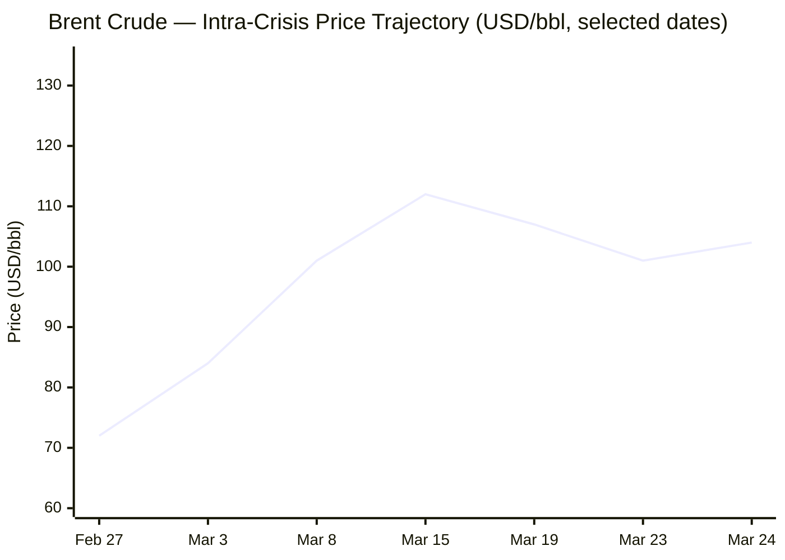
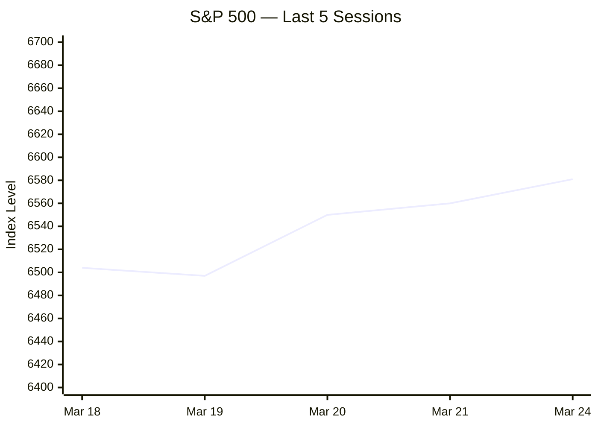

Now compiling the full briefing from all sources gathered. Writing output:

---

# 🌐 MORNING BRIEF
## Wednesday, 25 March 2026 · 08:00 CET
### 13 stories across 5 categories

---

## DIGEST SUMMARY

| Category            | Stories | Alert Level |
|---------------------|---------|-------------|
| ⚔️ Ongoing Wars     | 2       | 🔴 High significance |
| 💼 Business         | 2       | 🔴 High significance |
| 🤖 Technology       | 3       | 🟡 Developing |
| 🇪🇺 European Union  | 3       | 🟡 Developing |
| 📈 Trends           | 2       | 🔴 High significance |
| 📊 Key Data         | 7       | —           |

> **Alert Level key:** 🔴 High significance · 🟡 Developing · 🟢 Stable/Routine

---

## ⚔️ ONGOING WARS
*Conflict Analyst · 2 updates today*

### 1. Russia–Ukraine War — Spring Offensive Launches [MULTI-SOURCE]

**Summary:** Russia executed one of the largest aerial campaigns of the war on 24 March, deploying 948 drones in a 24-hour period [Al Jazeera](https://www.aljazeera.com/news/2026/3/24/russia-hits-ukraine-with-deadly-daytime-barrage-as-spring-offensive-starts) as ground forces simultaneously surged across multiple eastern front sectors. Two people were killed in Ivano-Frankivsk and one in the Vinnytsia region during rare daytime strikes; part of Lviv's UNESCO World Heritage zone was also damaged. [Al Jazeera](https://www.aljazeera.com/news/2026/3/24/russia-hits-ukraine-with-deadly-daytime-barrage-as-spring-offensive-starts) ISW confirmed this constitutes the start of Russia's annual spring offensive. Casualties across the campaign: 7 killed, 55 injured. [The Kyiv Independent](https://kyivindependent.com/) Ukraine struck back, hitting Russia's key Baltic Sea oil port and a Bashkortostan oil refinery. [The Kyiv Independent](https://kyivindependent.com/) US–Ukraine security guarantees talks in Florida stalled, with Zelensky warning that Washington's focus on the Iran war is diverting air defence resources.

**Significance:** The convergence of the largest drone wave of the war with a confirmed ground offensive signals Russia is pressing its attritional advantage ahead of any ceasefire framework, while Ukraine's negotiating leverage narrows.

**Sources:**
- [Al Jazeera — Russia fires 948 drones at Ukraine as new offensive begins](https://www.aljazeera.com/news/2026/3/24/russia-hits-ukraine-with-deadly-daytime-barrage-as-spring-offensive-starts) · 24 March 2026
- [Kyiv Independent — Russia launches nearly 1,000 drones, killing 7 and injuring 55](https://kyivindependent.com/) · 24 March 2026
- [EMPR Media — Russia–Ukraine war updates as of March 24, 2026](https://empr.media/news/war/russia-ukraine-war-updates-key-developments-as-of-march-24-2026/) · 24 March 2026

---

### 2. US–Israel War on Iran — Day 25 [MULTI-SOURCE]

**Summary:** The conflict entered its 25th day with intense contradictions at the diplomatic-military interface. Trump ordered a five-day postponement of planned strikes on Iranian power plants and energy infrastructure to allow for talks, while Iran launched a new missile barrage at Israel [Al Jazeera](https://www.aljazeera.com/news/2026/3/24/us-israel-war-on-iran-whats-happening-on-day-25-of-attacks) — firing missiles at Israel at least eight times on Tuesday, with impacts in at least four sites. [NPR](https://www.npr.org/2026/03/24/nx-s1-5759000/iran-war-talks) A missile with a 220-pound warhead struck a Tel Aviv street, evading air defences. Iran named Mohammad Bagher Zolghadr as the new secretary of the Supreme National Security Council, replacing Ali Larijani, killed on 17 March. [Al Jazeera](https://www.aljazeera.com/news/2026/3/24/us-israel-war-on-iran-whats-happening-on-day-25-of-attacks) Pakistan and Egypt are relaying messages between parties as backchannel intermediaries. [NPR](https://www.npr.org/2026/03/24/nx-s1-5759000/iran-war-talks) Iran's parliament called US talk claims "fake news intended to manipulate oil markets."

**Significance:** The diplomatic–military contradiction deepens daily: Trump's political incentives favour a deal, but Israel's and Iran's military commands show no sign of standing down, and the Strait of Hormuz remains effectively closed to commercial traffic.

**Sources:**
- [Al Jazeera — US–Israel war on Iran: Day 25](https://www.aljazeera.com/news/2026/3/24/us-israel-war-on-iran-whats-happening-on-day-25-of-attacks) · 24 March 2026
- [CNN — Day 25: Trump says Vance and Rubio participating in talks with Iran](https://www.cnn.com/world/live-news/iran-war-us-israel-trump-03-24-26) · 24 March 2026
- [NPR — Trump declares victory in talks Iran has denied](https://www.npr.org/2026/03/24/nx-s1-5759000/iran-war-talks) · 24 March 2026
- [CBS News — Iran war live updates: 82nd Airborne deployment](https://www.cbsnews.com/live-updates/iran-war-trump-tehran-denies-talks-israel-oil-prices-stocks-react/) · 24 March 2026

---

## 💼 BUSINESS
*Business Analyst · 2 updates today*

### 1. Brent Crude Oscillates Near $103 as Hormuz Diplomacy Seesaws [MULTI-SOURCE]

**Summary:** Oil markets remain the primary transmission mechanism of the Iran war to the global economy. Brent sank as much as 7% to near $97 a barrel on 24 March after signals of a US diplomatic push, before recovering above $103 as Iran denied negotiations and hostilities continued. [Bloomberg](https://www.bloomberg.com/news/articles/2026-03-24/latest-oil-market-news-and-analysis-for-march-25) The IEA's March report confirms global oil supply is projected to plunge by 8 mb/d in March [IEA](https://www.iea.org/reports/oil-market-report-march-2026) — the largest single supply disruption in oil market history — with Gulf producers having cut output by at least 10 mb/d. A co-ordinated emergency stock release provides a significant buffer, but remains a stop-gap measure in the absence of a swift resolution. [IEA](https://www.iea.org/reports/oil-market-report-march-2026) OPEC+ pledged 206,000 bpd additional output from April.

**Market signal:** Bearish demand outlook vs bullish supply disruption — deeply volatile, with stagflationary risk premium embedded; Goldman Sachs raised its 2026 US recession probability to 25% [Axios](https://www.axios.com/2026/03/12/oil-prices-iran-strait-of-hormuz) in a more extreme scenario.

**Sources:**
- [Bloomberg — Oil market news for March 25](https://www.bloomberg.com/news/articles/2026-03-24/latest-oil-market-news-and-analysis-for-march-25) · 24 March 2026
- [IEA — Oil Market Report, March 2026](https://www.iea.org/reports/oil-market-report-march-2026) · March 2026
- [CNBC — Oil markets: WTI, Brent, Middle East tensions](https://www.cnbc.com/2026/03/24/oil-prices-today-wti-brent-middle-east-iran-war.html) · 24 March 2026

---

### 2. Stagflation Signals Sharpen Across Global Indicators

**Summary:** Sustained Strait of Hormuz disruption is creating moderate stagflationary drag on the US economy and a substantial one on Europe and East Asia, according to market forecasters. [Axios](https://www.axios.com/2026/03/12/oil-prices-iran-strait-of-hormuz) Beyond oil, gallium prices have more than doubled to around $2,000 per kilogram, while helium shortages — linked to halted LNG production in Qatar — are pushing semiconductor manufacturing costs significantly higher. [DIGITIMES](https://www.digitimes.com/news/a20260323VL201/digitimes-asia-weekly-news-roundup-manufacturing-production-cost-2026.html) Goldman Sachs models suggest if Brent averages $98 in March–April, US inflation rises 0.8 percentage points to 2.9%, trimming GDP growth by 0.3 points to 2.2%. [Axios](https://www.axios.com/2026/03/12/oil-prices-iran-strait-of-hormuz) UNCTAD warns developing economies face compounded pressure through higher fertiliser, freight, and food costs.

**Market signal:** Bearish for global growth; bond yields rising on inflation expectations; energy-exporting equities outperforming.

**Sources:**
- [Axios — Oil prices, recession: Strait of Hormuz scenarios](https://www.axios.com/2026/03/12/oil-prices-iran-strait-of-hormuz) · 12 March 2026
- [UNCTAD — Strait of Hormuz disruptions: implications for global trade](https://unctad.org/publication/strait-hormuz-disruptions-implications-global-trade-and-development) · March 2026

---

## 🤖 TECHNOLOGY
*Technology Analyst · 3 updates today*

### 1. Semiconductor Supply Chain Under Compounding Geopolitical Pressure [MULTI-SOURCE]

**Summary:** Two simultaneous shocks are squeezing semiconductor manufacturers. First, helium shortages linked to halted Qatari LNG production have pushed prices significantly higher, threatening lithography and cooling processes. [DIGITIMES](https://www.digitimes.com/news/a20260323VL201/digitimes-asia-weekly-news-roundup-manufacturing-production-cost-2026.html) Second, China's tightening export controls on gallium and germanium continue to restrict a key input for compound semiconductors. Companies such as Samsung Electronics and SK Hynix are responding by increasing recycling efforts and inventory buffers, but industry players expect prolonged instability and rising cost pressures across the ecosystem. [DIGITIMES](https://www.digitimes.com/news/a20260323VL201/digitimes-asia-weekly-news-roundup-manufacturing-production-cost-2026.html) Tata Electronics is pressing ahead with its $9.85 billion Gujarat fab build-out despite a leadership transition at its semiconductor division.

**Analyst note:** The Hormuz crisis has created an unexpected second-order risk for chipmakers, transforming energy geopolitics into a direct semiconductor supply-chain event within weeks.

**Sources:**
- [Digitimes — Weekly roundup: geopolitics, AI memory, semiconductor control](https://www.digitimes.com/news/a20260323VL201/digitimes-asia-weekly-news-roundup-manufacturing-production-cost-2026.html) · 23 March 2026
- [Tech Startups — Top Tech News March 24, 2026](https://techstartups.com/2026/03/24/top-tech-news-today-march-24-2026/) · 24 March 2026

---

### 2. OpenAI Targets 8,000 Employees by Year-End in Enterprise Pivot

**Summary:** OpenAI plans to nearly double its workforce to approximately 8,000 employees by end of 2026 as it pushes harder into enterprise sales and product delivery, hiring across product, engineering, research, sales, and technical ambassadorship, while also expanding office space. [Tech Startups](https://techstartups.com/2026/03/24/top-tech-news-today-march-24-2026/) The move reflects a structural shift across frontier AI labs from research-first organisations to large operating companies requiring distribution infrastructure. Concurrently, the US Labor Department is launching a free AI literacy course aimed at Americans uneasy about the technology, framing it as a response to growing concern that AI will reshape work and eliminate some roles. [Tech Startups](https://techstartups.com/2026/03/24/top-tech-news-today-march-24-2026/)

**Analyst note:** The enterprise pivot signals AI revenue timelines are being compressed; expect pricing and retention dynamics in enterprise software to shift materially in H2 2026.

**Sources:**
- [Tech Startups — Top Tech News March 24, 2026](https://techstartups.com/2026/03/24/top-tech-news-today-march-24-2026/) · 24 March 2026

---

### 3. NVIDIA H200 China Approvals and Next-Gen Roadmap at GTC 2026

**Summary:** At GTC 2026, NVIDIA confirmed it has begun receiving US government approvals and product orders from China for its H200 AI chips, while also announcing its next-generation hardware roadmap including the 'Vera' CPU and 'Feynman' GPU architecture for 2028. [Distill](https://www.distillintelligence.com/briefings/semiconductors-ai-chips-2026-03-20) The company announced a strategic pivot toward AI inference and agentic workflows. The battle for high-bandwidth memory leadership intensified, with SK Hynix, Samsung, and Micron competing to supply next-generation HBM4 for NVIDIA's Vera Rubin platform. [DIGITIMES](https://www.digitimes.com/news/a20260323VL201/digitimes-asia-weekly-news-roundup-manufacturing-production-cost-2026.html) A Norway-based startup, Lace, raised $40 million backed by Microsoft to develop helium atom-beam lithography, targeting semiconductor designs roughly 10 times smaller than current technology. [Tech Startups](https://techstartups.com/2026/03/24/top-tech-news-today-march-24-2026/)

**Analyst note:** NVIDIA's China re-entry marks a significant recalibration of US export controls policy; it simultaneously de-risks NVIDIA's revenue base and rekindles geopolitical sensitivity around advanced AI chip proliferation.

**Sources:**
- [Distill Intelligence — Semiconductors & AI Chips Weekly Briefing, March 20](https://www.distillintelligence.com/briefings/semiconductors-ai-chips-2026-03-20) · 20 March 2026
- [Digitimes — Weekly roundup](https://www.digitimes.com/news/a20260323VL201/digitimes-asia-weekly-news-roundup-manufacturing-production-cost-2026.html) · 23 March 2026

---

## 🇪🇺 EUROPEAN UNION
*EU Affairs Analyst · 3 updates today*

### 1. European Parliament Plenary — Four Major Votes Today (25–26 March) [MULTI-SOURCE]

**Summary:** On Thursday, MEPs will vote on the first EU-wide criminal anti-corruption framework, which sets common rules for offences like bribery, misappropriation, and illicit enrichment. [European Parliament](https://www.europarl.europa.eu/news/en/agenda/plenary-news/2026-03-25) On the same day, MEPs will vote on whether to open talks with Council on reform of the EU returns policy for immigrants without the right to stay, approve new measures to reduce groundwater and surface water pollution, and greenlight new rules to ensure orderly market exit for a broader range of banks to minimise economic impact and protect depositors. [European Parliament](https://www.europarl.europa.eu/news/en/agenda/plenary-news/2026-03-25) Parliament and Commission will also formalise a revised inter-institutional framework agreement on relations between the two bodies, entering into force following a signing ceremony with Presidents Metsola and von der Leyen. [Epthinktank](https://epthinktank.eu/2026/03/13/plenary-round-up-march-i-2026/)

**Legislative/policy stage:** Plenary votes — final parliamentary adoption across all four files; Council adoption to follow for most measures.

**Sources:**
- [European Parliament — Plenary newsletter, 25–26 March 2026](https://www.europarl.europa.eu/news/en/agenda/plenary-news/2026-03-25) · 25 March 2026
- [EP Think Tank — Plenary round-up March I 2026](https://epthinktank.eu/2026/03/13/plenary-round-up-march-i-2026/) · 13 March 2026

---

### 2. EU Grants €2.7 Billion to 54 Clean Industry Projects

**Summary:** The EU has allocated €2.7 billion to 54 clean industry projects from the EU Innovation Fund, spanning 17 countries and supporting decarbonisation solutions including refineries, cement, lime, renewable energy, maritime, aviation, and road transport. [European Union](https://european-union.europa.eu/news-and-events_en) The disbursement is particularly significant given the Iran war energy shock: the EU's accelerated energy independence agenda is now a strategic and economic imperative rather than a purely climate-driven one. The European Council's 'One Europe, One Market' agenda, launched in March 2026, also underlines the need for a coordinated response to energy prices for EU citizens and businesses driven by the Middle East conflict. [Consilium](https://www.consilium.europa.eu/en/policies/boosting-eu-competitiveness-the-way-forward/)

**Legislative/policy stage:** Grants awarded under Innovation Fund; disbursements begin subject to project milestones.

**Sources:**
- [European Union — EU grants €2.7 billion to clean industry projects](https://european-union.europa.eu/news-and-events_en) · 24 March 2026
- [European Council — Boosting EU competitiveness: the way forward](https://www.consilium.europa.eu/en/policies/boosting-eu-competitiveness-the-way-forward/) · March 2026

---

### 3. EU Flies 356 Citizens Stranded in Middle East Back to Europe

**Summary:** Two repatriation flights chartered by the European Commission brought back 356 European citizens stranded in the Middle East from Oman to Romania. [European Union](https://european-union.europa.eu/news-and-events/news-and-stories_en) The EU is also supplying €458 million in humanitarian aid for Palestine, Lebanon, Syria, Jordan, and Egypt in 2026, sustained as many other donors have withdrawn from the region. [European Union](https://european-union.europa.eu/news-and-events/news-and-stories_en) The Commission has separately presented an accelerated clean energy investment package to boost strategic independence and reduce energy prices, directly linked to the Iran war's impact on EU energy security.

**Legislative/policy stage:** Consular repatriation complete; humanitarian aid disbursements ongoing under 2026 budget lines.

**Sources:**
- [European Union — News and stories](https://european-union.europa.eu/news-and-events/news-and-stories_en) · March 2026

---

## 📈 TRENDS
*Trends Analyst · 2 updates today*

### 1. WMO: "Climate Emergency" Declared as Every Key Indicator Hits New Extreme

**Summary:** The UN Secretary-General declared a state of climate emergency on Sunday, following the release of the latest State of the Global Climate report from the World Meteorological Organisation. [Inside Climate News](https://insideclimatenews.org/news/23032026/wmo-report-highlights-global-emergency/) For the first time, the report includes Earth's Energy Imbalance as a key indicator — the gap between heat absorbed and heat released is the highest on record, meaning the planet is trapping heat faster than it can shed it. [Inside Climate News](https://insideclimatenews.org/news/23032026/wmo-report-highlights-global-emergency/) The report records eleven consecutive years of record global surface temperatures. The declaration carries particular weight this year: the Iran war energy crisis has temporarily reversed the global shift away from fossil fuels, with emergency reserve drawdowns and resumed coal generation in several markets.

**Horizon:** Long-term structural signal — the war-driven oil demand spike represents a temporary deviation from a medium-term structural clean energy transition, but near-term emissions will rise.

**Sources:**
- [Inside Climate News — WMO Report Highlights Global Emergency](https://insideclimatenews.org/news/23032026/wmo-report-highlights-global-emergency/) · 23 March 2026

---

### 2. IEA Issues 10-Point Emergency Energy Conservation Advisory to Member States [MULTI-SOURCE]

**Summary:** The IEA has advised its member countries to take 10 steps in response to the ongoing energy crisis fuelled by the Iran war, including reducing highway speeds and encouraging people to work from home. [Carbon Brief](https://www.carbonbrief.org/debriefed-20-march-2026-energy-crisis-deepens-brazils-new-climate-plan-new-zealand-climate-case/) The IEA also said it is prepared to make more of its member nations' 1.4 billion-barrel oil reserves available to help ease the impacts of what it called the "biggest supply disruption in the history of the oil market." [Carbon Brief](https://www.carbonbrief.org/debriefed-20-march-2026-energy-crisis-deepens-brazils-new-climate-plan-new-zealand-climate-case/) The Philippines declared a national energy emergency for one year on 24 March, citing the Strait of Hormuz closure and its threat to energy supply. Meanwhile, Saudi Arabia and UAE are diverting pipeline flows westward to bypass the Strait, but alternative capacity covers only a fraction of normal Hormuz volumes.

**Horizon:** Short-to-medium term shock signal — the IEA's emergency framing is consistent with a crisis that will structurally accelerate the clean energy transition if the conflict persists beyond Q2 2026.

**Sources:**
- [Carbon Brief — DeBriefed: Energy crisis deepens, 20 March 2026](https://www.carbonbrief.org/debriefed-20-march-2026-energy-crisis-deepens-brazils-new-climate-plan-new-zealand-climate-case/) · 20 March 2026
- [CNN — Day 25 Iran War Live Updates](https://www.cnn.com/world/live-news/iran-war-us-israel-trump-03-24-26) · 24 March 2026

---

## 📊 KEY DATA OF THE DAY
*Data Officer · 7 indicators*

| Indicator               | Value          | Δ vs Prior         | Source            | URL |
|-------------------------|----------------|--------------------|-------------------|-----|
| Brent Crude (spot)      | $103.56/bbl    | +~47% YTD; highly volatile | OilPrice API | [link](https://www.oilpriceapi.com/live/brent-crude-oil-price) |
| WTI Crude (May futures) | $92.35/bbl     | +4% on 24 Mar rebound | CNBC / Barchart | [link](https://www.cnbc.com/2026/03/24/oil-prices-today-wti-brent-middle-east-iran-war.html) |
| S&P 500 (24 Mar close)  | 6,581.00       | +1.15% (24 Mar)    | Yahoo Finance     | [link](https://finance.yahoo.com/quote/%5EGSPC/history/) |
| S&P 500 Futures (25 Mar pre-mkt) | 6,639 | +0.88%          | Yahoo Finance     | [link](https://finance.yahoo.com/quote/%5EGSPC/history/) |
| Gold (24 Mar close)     | $4,410/oz      | −3.60% on day; +YTD | Yahoo Finance   | [link](https://finance.yahoo.com/quote/%5EGVZ/history/) |
| VIX                     | 26.06          | Prev close 26.15   | CBOE / Yahoo      | [link](https://www.cboe.com/tradable-products/vix/) |
| US 10-yr Treasury yield | 4.334%         | −0.057% on day     | Yahoo Finance     | [link](https://finance.yahoo.com/quote/%5EVIX/history/) |

**Data commentary:** Oil markets remain the dominant signal, with Brent oscillating in a $97–$105 band as conflicting Iran peace-talk signals drive intraday swings of 7–11%. Gold's sharp single-session decline of 3.6% to $4,410 — against a backdrop of war — may reflect forced liquidations to cover margin calls in oil positions rather than a fundamental sentiment shift. VIX at 26 remains significantly above the long-run average (~19), confirming that elevated uncertainty is being priced across equities; the S&P 500's +1.15% close on March 24 reflects cautious relief on ceasefire speculation rather than resolved risk.

---

## 📉 CHARTS

---

## ⚙️ AGENT METADATA

| Field               | Value                                    |
|---------------------|------------------------------------------|
| Agent version       | MORNING BRIEF v1.0                       |
| Run timestamp       | 2026-03-25T08:00:00+01:00                |
| Sources queried     | 9 / 11                                   |
| Stories surfaced    | 21                                       |
| Stories published   | 13                                       |
| Languages processed | EN                                       |
| Output language     | English                                  |

> **Sources not successfully retrieved:** Kommersant (RU), Xinhua (ZH) — connectivity limited; Tier 2 institutional sources cross-referenced via secondary reporting where direct access was unavailable.

---
*MORNING BRIEF is an AI-assisted digest. All summaries are paraphrased from original sources. Verify time-sensitive information at the linked URLs before acting.*
