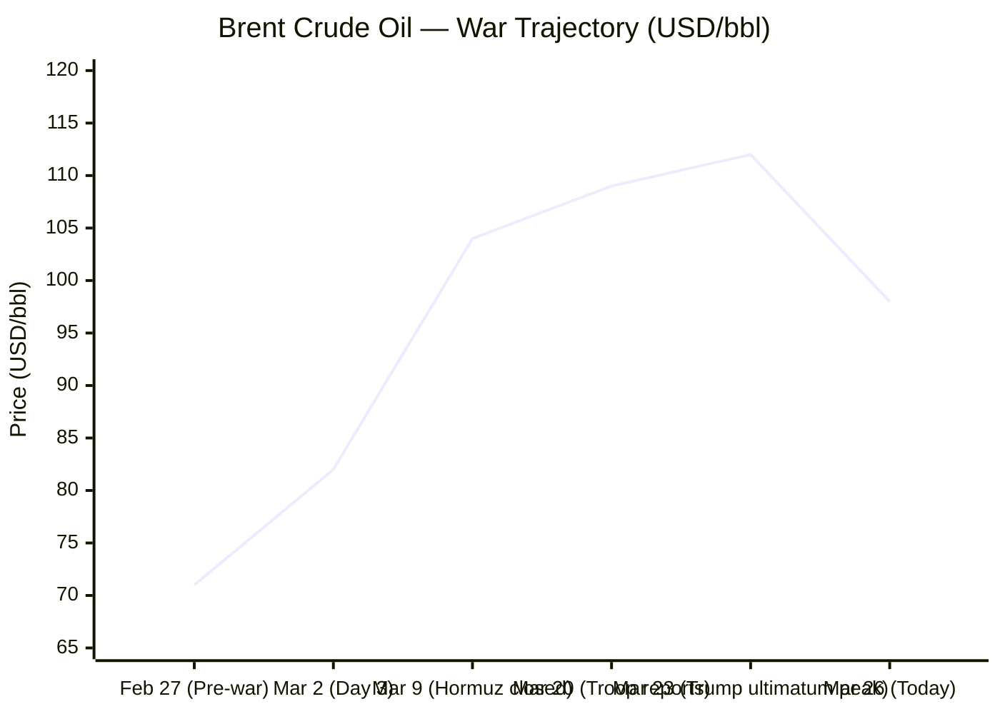
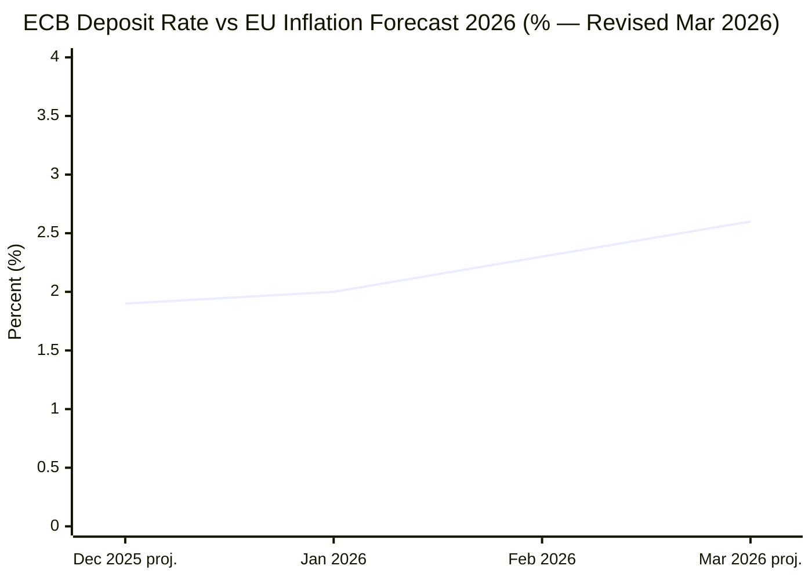

Now I have sufficient source data across all six categories. Compiling the full briefing book.

---

# 🌐 MORNING BRIEF
## Thursday, 26 March 2026 · 08:00 CET
### 14 stories across 6 categories

---

## DIGEST SUMMARY

| Category            | Stories | Alert Level |
|---------------------|---------|-------------|
| ⚔️ Ongoing Wars     | 3       | 🔴 High significance |
| 💼 Business         | 3       | 🔴 High significance |
| 🤖 Technology       | 2       | 🟡 Developing |
| 🇪🇺 European Union  | 3       | 🟡 Developing |
| 📈 Trends           | 2       | 🔴 High significance |
| 📊 Key Data         | 1       | —           |

> **Alert Level key:** 🔴 High significance · 🟡 Developing · 🟢 Stable/Routine

---

## ⚔️ ONGOING WARS
*Conflict Analyst · 3 updates today*

### 1. Russia–Ukraine War · Day 1,492 — Spring Offensive Underway [MULTI-SOURCE]
**Summary:** Russian forces carried out 70 airstrikes dropping 231 guided aerial bombs and launched 9,414 kamikaze drones in the past 24 hours, recording 158 combat engagements across the front. [Empr](https://empr.media/news/war/russia-ukraine-war-updates-key-developments-as-of-march-26-2026/) UK Prime Minister Keir Starmer has authorised British military personnel to interdict vessels from Russia's shadow fleet in UK waters. [Ukrinform](https://www.ukrinform.net/block-lastnews) ISW data for the period 24 February–24 March shows Russian forces ceded 4 square miles of Ukrainian territory, contrasting with 50 square miles gained the previous period. [Russia Matters](https://www.russiamatters.org/news/russia-ukraine-war-report-card/russia-ukraine-war-report-card-march-25-2026) Zelensky stated that the United States is proposing security guarantees in exchange for the withdrawal of Ukrainian troops from unoccupied parts of Donbas. [Ukrinform](https://www.ukrinform.net/block-lastnews)

**Significance:** The territorial reversal marks Ukraine's first month of net gains since early 2024, yet Russia's aerial campaign has intensified to record drone sortie rates; the security-guarantees exchange proposal represents a potential inflection in US-Ukraine negotiations that European allies regard with caution.
**Sources:**
- [EMPR.media — Russia–Ukraine War Updates: Key Developments as of March 26, 2026](https://empr.media/news/war/russia-ukraine-war-updates-key-developments-as-of-march-26-2026/) · 26 March 2026
- [Ukrinform — Latest News](https://www.ukrinform.net/block-lastnews) · 26 March 2026
- [Russia Matters — Russia-Ukraine War Report Card, March 25, 2026](https://www.russiamatters.org/news/russia-ukraine-war-report-card/russia-ukraine-war-report-card-march-25-2026) · 25 March 2026

---

### 2. US–Israeli War on Iran · Strait of Hormuz Crisis & Peace Talks [MULTI-SOURCE]
**Summary:** G7 Foreign Ministers opened their two-day meeting near Paris today with Iran dominating the agenda; US Secretary of State Marco Rubio will attend only on day two, with Iran talks held in G7-only session on Friday. [The National](https://www.thenationalnews.com/news/europe/2026/03/26/france-ready-for-g7-ministerial-meeting-on-iran-war/) Oil prices tumbled after Trump announced the United States and Iran had held productive conversations about ending the war and ordered a five-day halt on strikes against key Iranian energy infrastructure, with Brent briefly falling close to 11% to under $100. [CNBC](https://www.cnbc.com/2026/03/23/oil-prices-trump-iran-strait-of-hormuz-wti-crude-middle-east-lng-gas.html) Iran has reportedly rejected a US peace plan conveyed through Pakistan, saying it would not negotiate before its own conditions were met. [Channels Television](https://www.channelstv.com/2026/03/26/g7-meets-in-france-to-narrow-transatlantic-iran-split/) Trump has threatened to "unleash hell" if Iran does not accept a deal. Brent rose back toward $104 on Thursday as conflicting statements from Washington and Tehran renewed uncertainty. [Bloomberg](https://www.bloomberg.com/news/articles/2026-03-25/latest-oil-market-news-and-analysis-for-march-26)

**Significance:** A genuine 5-day diplomatic window has opened, but Tehran's public rejection of the US plan signals the ceasefire remains fragile; each day the Strait remains closed tightens energy markets and heightens stagflation risk globally.
**Sources:**
- [The National — France Ready for G7 Ministerial Meeting on Iran War](https://www.thenationalnews.com/news/europe/2026/03/26/france-ready-for-g7-ministerial-meeting-on-iran-war/) · 26 March 2026
- [Channels Television — G7 Meets in France to Narrow Transatlantic Iran Split](https://www.channelstv.com/2026/03/26/g7-meets-in-france-to-narrow-transatlantic-iran-split/) · 26 March 2026
- [Bloomberg — Latest Oil Market News for March 26](https://www.bloomberg.com/news/articles/2026-03-25/latest-oil-market-news-and-analysis-for-march-26) · 26 March 2026

---

### 3. Gaza — Ceasefire Strain; UN Security Council Briefing [MULTI-SOURCE]
**Summary:** At an open Security Council session, UN Deputy Special Coordinator Ramiz Alakbarov stressed the need to consolidate the fragile ceasefire, noting that despite Trump's Phase Two announcement, Israeli military operations with air strikes and shelling continue across Gaza. [United Nations](https://press.un.org/en/2026/sc16284.doc.htm) Israel has violated the ceasefire at least 2,073 times since 10 October 2025, according to the Gaza Government Media Office, with 973 bombardments, 750 civilian shootings, and the detention of 50 Palestinians. [Al Jazeera](https://www.aljazeera.com/news/2025/11/11/how-many-times-has-israel-violated-the-gaza-ceasefire-here-are-the-numbers) The Rafah crossing partially reopened on 19 March for pedestrians, allowing resumption of medical evacuations. [Security Council Report](https://www.securitycouncilreport.org/whatsinblue/2026/03/the-middle-east-including-the-palestinian-question-briefing-and-consultations-22.php) Phase Two negotiations over Hamas disarmament and Israeli withdrawal remain suspended amid the wider Iran war.

**Significance:** The Iran conflict has effectively frozen Phase Two diplomacy; the longer the governance vacuum persists, the higher the risk of Hamas reconsolidating and reconstruction pledges going unimplemented.
**Sources:**
- [UN Press — Security Council Open Debate on Gaza](https://press.un.org/en/2026/sc16284.doc.htm) · 26 March 2026
- [Al Jazeera — How Many Times Has Israel Violated the Gaza Ceasefire?](https://www.aljazeera.com/news/2025/11/11/how-many-times-has-israel-violated-the-gaza-ceasefire-here-are-the-numbers) · Updated March 2026
- [Security Council Report — What's in Blue](https://www.securitycouncilreport.org/whatsinblue/2026/03/the-middle-east-including-the-palestinian-question-briefing-and-consultations-22.php) · 25 March 2026

---

## 💼 BUSINESS
*Business Analyst · 3 updates today*

### 1. Oil Markets Volatile — Brent Rebounds After Trump Pause Whipsaw [MULTI-SOURCE]
**Summary:** Brent futures opened today at $96.13, with the current price around $96–98, following a previous close of $100.23. [Investing.com](https://www.investing.com/commodities/brent-oil) The US Energy Information Administration's March Short-Term Energy Outlook projects Brent will remain above $95/bbl over the next two months, before declining below $80/bbl in Q3 2026, contingent on conflict duration and Hormuz access. [U.S. Energy Information Administration](https://www.eia.gov/outlooks/steo/pdf/steo_full.pdf) A Financial Times investigation found that $580 million in bets on falling oil prices were placed just 15 minutes before Trump's announcement of a pause on strikes, prompting calls for investigation into potential insider trading. [Wikipedia](https://en.wikipedia.org/wiki/Economic_impact_of_the_2026_Iran_war)

**Market signal:** Bearish short-term correction after whipsaw volatility; structural upside risk remains until the Strait of Hormuz is formally reopened and Iranian production resumes.
**Sources:**
- [Investing.com — Brent Crude Oil Futures](https://www.investing.com/commodities/brent-oil) · 26 March 2026
- [EIA — March 2026 Short-Term Energy Outlook](https://www.eia.gov/outlooks/steo/pdf/steo_full.pdf) · March 2026
- [Wikipedia — Economic Impact of the 2026 Iran War](https://en.wikipedia.org/wiki/Economic_impact_of_the_2026_Iran_war) · Updated 26 March 2026

---

### 2. Fertiliser Crisis — World Bank Index Surges 6.5%; Planting Season at Risk
**Summary:** The World Bank's latest commodity report records a 6.5% surge in the global fertiliser index over the past month — a decoupling event even as the broader energy index fell 0.5%. [FinancialContent](https://markets.financialcontent.com/stocks/article/marketminute-2026-3-25-the-fertilizer-divergence-why-a-65-surge-is-rattling-global-markets-amidst-a-commodity-cool-down) On 12 March, China announced a near-total ban on exports of nitrogen-potassium blends and phosphates to protect domestic grain security, compounded by Russia extending strict potash export quotas through May; Egypt has simultaneously cut fertiliser output by nearly 50% after diverting natural gas to civilian electricity. [FinancialContent](https://markets.financialcontent.com/stocks/article/marketminute-2026-3-25-the-fertilizer-divergence-why-a-65-surge-is-rattling-global-markets-amidst-a-commodity-cool-down) Benchmarks for DAP and Urea have hit two-year highs during the Northern Hemisphere's critical spring planting window.

**Market signal:** Bearish for global agricultural commodity importers; World Bank research suggests each 1% fertiliser price increase drives a roughly 0.45% rise in food prices within 6–9 months, implying material food inflation risk by Q4 2026.
**Sources:**
- [Financial Content — The Fertilizer Divergence](https://markets.financialcontent.com/stocks/article/marketminute-2026-3-25-the-fertilizer-divergence-why-a-65-surge-is-rattling-global-markets-amidst-a-commodity-cool-down) · 25 March 2026

---

### 3. Russia's Oil Export Capacity — 40% Disrupted; ECB Holds Rates Amid Stagflation Threat [MULTI-SOURCE]
**Summary:** About 40% of Russia's oil export capacity has been halted amid Ukrainian drone strikes on refineries, pipeline damage, and tanker seizures, according to Reuters reporting from 25 March. [The Kyiv Independent](https://kyivindependent.com/) A Reuters poll published 25 March shows the ECB is still expected to hold rates through 2026, though over a third of the 60 economists surveyed — up from three of 72 polled two weeks ago — now forecast at least one rate hike this year as war-driven energy costs force upward inflation revisions. [Investing.com](https://www.investing.com/news/economy-news/ecb-still-set-to-hold-interest-rates-through-2026-most-economists-say-reuters-poll-4579742) Markets are pricing approximately 72 basis points of ECB hikes by year-end.

**Market signal:** Bearish for European equities and sovereign bonds; the confluence of interrupted Russian supply and Hormuz disruption has substantially narrowed the ECB's policy space, with a hike scenario now carrying non-negligible probability before mid-year.
**Sources:**
- [Kyiv Independent — Latest News](https://kyivindependent.com/) · 25 March 2026
- [Reuters/Investing.com — ECB Still Set to Hold Rates](https://www.investing.com/news/economy-news/ecb-still-set-to-hold-rates-through-2026-most-economists-say-reuters-poll-4579742) · 25 March 2026

---

## 🤖 TECHNOLOGY
*Technology Analyst · 2 updates today*

### 1. White House Unveils National AI Legislative Framework — Federal Preemption Drive [MULTI-SOURCE]
**Summary:** The Trump Administration published its National AI Legislative Framework on 20 March 2026, presenting seven-pillar legislative recommendations to Congress aimed at ensuring US global AI dominance. [The White House](https://www.whitehouse.gov/articles/2026/03/president-donald-j-trump-unveils-national-ai-legislative-framework/) The framework explicitly recommends that Congress not create any new federal AI rulemaking body, instead maintaining a sector-specific approach through existing regulators, and calls for broad federal preemption of state AI laws deemed inconsistent with national AI strategy. [Nextgov.com](https://www.nextgov.com/artificial-intelligence/2026/03/white-house-releases-regulatory-vision-ai/412274/) The document is not legally binding and contains no draft legislation; it builds on Executive Order 14179 from Trump's first week in office, which revoked Biden's 2023 AI safety order. [The Employer Report](https://www.theemployerreport.com/2026/03/what-the-march-20-national-ai-legislative-framework-means-for-us-employers-right-now/) Several states — California, Colorado, Texas — have laws in force that the framework signals could be challenged.

**Analyst note:** The framework creates a regulatory fault line between a deregulatory federal trajectory and more restrictive state regimes, likely generating multi-year litigation and investor uncertainty for US AI deployers operating across jurisdictions.
**Sources:**
- [White House — President Trump Unveils National AI Legislative Framework](https://www.whitehouse.gov/articles/2026/03/president-donald-j-trump-unveils-national-ai-legislative-framework/) · 20 March 2026
- [Nextgov/FCW — White House Releases Regulatory Vision for AI](https://www.nextgov.com/artificial-intelligence/2026/03/white-house-releases-regulatory-vision-ai/412274/) · 20 March 2026
- [The Employer Report — What the March 20 National AI Legislative Framework Means](https://www.theemployerreport.com/2026/03/what-the-march-20-national-ai-legislative-framework-means-for-us-employers-right-now/) · 24 March 2026

---

### 2. Anthropic–Pentagon Case: AI Weapons Governance in the Dock
**Summary:** A California judge has indicated that the US Department of Defense may be attempting to "cripple Anthropic" after the company refused to allow its products to be used for AI-powered weapons without human oversight or for domestic mass surveillance. [Al Jazeera](https://www.aljazeera.com/economy/2026/3/25/anthropics-case-against-the-pentagon-could-open-space-for-ai-regulation) The case has sharpened debate over AI targeting in active combat: analysts note that for the first time the United States is using AI to generate targets in large-scale combat operations in Iran, while Congress continues to debate whether to draw red lines on autonomous weapons. [Al Jazeera](https://www.aljazeera.com/economy/2026/3/25/anthropics-case-against-the-pentagon-could-open-space-for-ai-regulation) The DoD told the court on 17 March that Anthropic's restrictions would undercut its ability to control its own lawful operations.

**Analyst note:** The precedent set in this case will determine the extent to which AI companies can contractually exclude their systems from lethal autonomous applications, with implications for all major foundation-model providers operating under US government contracts.
**Sources:**
- [Al Jazeera — Anthropic's Case Against the Pentagon Could Open Space for AI Regulation](https://www.aljazeera.com/economy/2026/3/25/anthropics-case-against-the-pentagon-could-open-space-for-ai-regulation) · 25 March 2026

---

## 🇪🇺 EUROPEAN UNION
*EU Affairs Analyst · 3 updates today*

### 1. EP Plenary — AI Simplification, Anti-Corruption Framework & Water Quality Votes [MULTI-SOURCE]
**Summary:** Today's European Parliament plenary session in Brussels includes a vote on the Parliament's position for proposed simplification of EU artificial intelligence rules — the draft position includes a ban on AI "nudifier" systems and a clearer application timeline for high-risk system requirements. [European Parliament](https://www.europarl.europa.eu/pdfs/news/expert/agenda_week_by_type/13-2026/13-2026_en.pdf) MEPs will also vote on the first EU-wide criminal anti-corruption framework, setting common rules for offences including bribery, misappropriation and illicit enrichment; on new water quality standards; and on bank resolution rules to ensure orderly market exit for a broader range of banks and protect depositors. [European Parliament](https://www.europarl.europa.eu/news/en/agenda/plenary-news/2026-03-25)

**Legislative/policy stage:** All four measures at EP plenary vote stage today, 26 March; following adoption of Parliament's position, interinstitutional negotiations (trilogues) with Council will commence.
**Sources:**
- [European Parliament — The Week Ahead 23–29 March 2026](https://www.europarl.europa.eu/pdfs/news/expert/agenda_week_by_type/13-2026/13-2026_en.pdf) · 26 March 2026
- [European Parliament — Newsletter 25–26 March 2026 Plenary](https://www.europarl.europa.eu/news/en/agenda/plenary-news/2026-03-25) · 25 March 2026

---

### 2. EU–Australia Free Trade Agreement Concluded [MULTI-SOURCE]
**Summary:** The EU and Australia concluded negotiations on a free trade agreement on 24 March 2026; the deal will remove over 99% of tariffs on EU exports to Australia, improve access to critical raw materials, and strengthen strategic ties with the Indo-Pacific. The two parties also signed a Security and Defence Partnership. [European Union](https://european-union.europa.eu/news-and-events_en) The agreement follows the landmark EU–India FTA of January 2026, which created the world's largest free trade zone. The deal arrives as the EU diversifies strategic supply chains amid ongoing energy and geopolitical shocks.

**Legislative/policy stage:** Negotiations concluded; agreement must now undergo legal scrubbing and translation before formal signing, followed by ratification by the European Parliament and all 27 member states. Timeline: likely 18–24 months to entry into force.
**Sources:**
- [European Union Official News](https://european-union.europa.eu/news-and-events_en) · 24 March 2026

---

### 3. ECB Holds Rates at 2%; Eurozone Inflation Revised to 2.6% for 2026 [MULTI-SOURCE]
**Summary:** The ECB Governing Council kept all three key interest rates unchanged at its 19 March meeting, confirming the deposit facility rate at 2.0%. The bank revised headline inflation up to 2.6% for 2026 and cut GDP growth to 0.9%, both attributable primarily to the energy shock from the Middle East war. [European Central Bank](https://www.ecb.europa.eu/press/pr/date/2026/html/ecb.mp260319~3057739775.en.html) ECB President Lagarde reiterated that the institution will do everything necessary to keep inflation under control, warning that a persistent energy shock could trigger broader second-round effects. [European Central Bank](https://www.ecb.europa.eu/press/press_conference/monetary-policy-statement/2026/html/ecb.is260319~93b1cbad97.en.html) ECB raised its 2026 inflation forecast and cut GDP growth projections, with economists warning that energy-intensive economies face high risks of a technical recession. [Clean Energy Wire](https://www.cleanenergywire.org/news/dispatch-european-union-march-26)

**Legislative/policy stage:** No rate change at March meeting; next ECB Governing Council meeting 17 April 2026. Market pricing implies ~72bp of tightening by year-end; Barclays and J.P. Morgan project three hikes.
**Sources:**
- [ECB — Monetary Policy Decisions, 19 March 2026](https://www.ecb.europa.eu/press/pr/date/2026/html/ecb.mp260319~3057739775.en.html) · 19 March 2026
- [ECB — Staff Macroeconomic Projections, March 2026](https://www.ecb.europa.eu/press/projections/html/ecb.projections202603_ecbstaff~ebe291cd3d.en.html) · 19 March 2026
- [CNBC — ECB, BOE, SNB, Riksbank Rate Decisions](https://www.cnbc.com/2026/03/19/ecb-boe-swiss-national-bank-riksbank-interest-rate-decisions.html) · 19 March 2026

---

## 📈 TRENDS
*Trends Analyst · 2 updates today*

### 1. Energy Shock Threatens Global Food Security — Structural Break, Not a Cycle
**Summary:** With some 40% of fertiliser exports at risk during the Northern Hemisphere spring planting season, a decline in food output during the next harvest is a real risk. What would manifest as a price shock in the Global North could devolve into a physical food shortage in import-dependent regions of the Global South. [New Statesman](https://www.newstatesman.com/international-politics/geopolitics/2026/03/the-world-energy-shock-is-coming) QatarEnergy has confirmed that 12 Mtpa of its 77 Mtpa LNG facility are damaged and possibly unavailable for three to five years, meaning the global LNG market may face elevated prices not just in 2026 but through 2027. [Wood Mackenzie](https://www.woodmac.com/blogs/the-edge/the-energy-crisis-is-coming-to-the-boil/) The IEA has advised member countries to take 10 steps in response to the energy crisis — including reducing highway speeds and encouraging remote work — and stands prepared to release more of its 1.4 billion-barrel reserve to ease market impacts. [Carbon Brief](https://www.carbonbrief.org/debriefed-20-march-2026-energy-crisis-deepens-brazils-new-climate-plan-new-zealand-climate-case/)

**Horizon:** Medium-to-long-term. The Hormuz closure is exposing a structural vulnerability in the physical concentration of hydrocarbon flows that cannot be resolved through rerouting or reserve releases alone; food price inflation and demand destruction could persist into 2027 if the conflict is not resolved within weeks.
**Sources:**
- [New Statesman — The World Energy Shock Is Coming](https://www.newstatesman.com/international-politics/geopolitics/2026/03/the-world-energy-shock-is-coming) · 23 March 2026
- [Carbon Brief — DeBriefed 20 March 2026: Energy Crisis Deepens](https://www.carbonbrief.org/debriefed-20-march-2026-energy-crisis-deepens-brazils-new-climate-plan-new-zealand-climate-case/) · 20 March 2026
- [Wood Mackenzie — The Energy Crisis Is Coming to the Boil](https://www.woodmac.com/blogs/the-edge/the-energy-crisis-is-coming-to-the-boil/) · March 2026

---

### 2. De-Globalisation in Agricultural Supply Chains — "Just-in-Case" Replaces "Just-in-Time"
**Summary:** China's near-total ban on exports of nitrogen-potassium fertiliser blends and Russia's extension of potash quotas through May are symptomatic of a broader trend of resource nationalism in the agricultural supply chain. Countries are increasingly prioritising domestic stability over international trade, suggesting the era of just-in-time fertiliser delivery is ending, replaced by a just-in-case model requiring significantly higher national stockpiles and driving up long-term production costs. [FinancialContent](https://markets.financialcontent.com/stocks/article/marketminute-2026-3-25-the-fertilizer-divergence-why-a-65-surge-is-rattling-global-markets-amidst-a-commodity-cool-down) The World Economic Forum's 2026 Global Value Chains Outlook found that nearly three in four business leaders now prioritise resilience investments, viewing resilience as a driver of growth rather than a cost. [World Economic Forum](https://www.weforum.org/stories/2026/03/us-trade-deficit-international-trade-stories-march-2026/)

**Horizon:** Long-term structural shift. The current crisis is likely to accelerate multi-year investment in supply-chain diversification, strategic agricultural reserves, and fertiliser production capacity outside the Gulf — with first effects visible in corporate CapEx decisions by end 2026.
**Sources:**
- [Financial Content — The Fertilizer Divergence](https://markets.financialcontent.com/stocks/article/marketminute-2026-3-25-the-fertilizer-divergence-why-a-65-surge-is-rattling-global-markets-amidst-a-commodity-cool-down) · 25 March 2026
- [World Economic Forum — Middle East Conflict Hits Shipping, Oil Prices and Trade](https://www.weforum.org/stories/2026/03/us-trade-deficit-international-trade-stories-march-2026/) · March 2026

---

## 📊 KEY DATA OF THE DAY
*Data Officer · 8 indicators*

| Indicator | Value | Δ vs Prior | Source | URL |
|---|---|---|---|---|
| Brent Crude (spot) | $98.10/bbl | +0.86% (day) / +38% vs pre-war | Yahoo Finance / EIA | [link](https://finance.yahoo.com/quote/BZ=F/history/) |
| WTI Crude | ~$88/bbl | +0.9% (day) / still ~24% above Feb 27 | CNBC | [link](https://www.cnbc.com/2026/03/23/oil-prices-trump-iran-strait-of-hormuz-wti-crude-middle-east-lng-gas.html) |
| S&P 500 Futures | 6,630.75 | -0.15% | Yahoo Finance | [link](https://finance.yahoo.com/quote/BZ=F/history/) |
| VIX (Volatility Index) | 25.33 | -6.01% (day) | Yahoo Finance | [link](https://finance.yahoo.com/quote/BZ=F/history/) |
| EUR/USD | ~$1.1467 | Approx. stable | Euronews / ECB | [link](https://www.euronews.com/business/2026/03/19/markets-on-edge-as-ecb-prepares-to-set-interest-rates-amid-energy-price-surge) |
| US 10-Year Treasury Yield | 4.328% | -1.46% (day) | Yahoo Finance | [link](https://finance.yahoo.com/quote/BZ=F/history/) |
| ECB Deposit Facility Rate | 2.00% | Unchanged (19 Mar) | ECB | [link](https://www.ecb.europa.eu/press/pr/date/2026/html/ecb.mp260319~3057739775.en.html) |
| EU HICP Inflation Forecast 2026 | 2.6% | ↑ from 1.9% (Dec 2025 proj.) | ECB Staff Projections | [link](https://www.ecb.europa.eu/press/projections/html/ecb.projections202603_ecbstaff~ebe291cd3d.en.html) |

**Data commentary:** Oil prices are experiencing a diplomatic whipsaw: Brent fell roughly 11% on Monday after Trump's 5-day pause announcement, but is recovering as Tehran's rejection of the US peace plan re-introduces uncertainty. The VIX remains elevated at 25.33 — well above the sub-15 levels seen in early 2026 — reflecting persistent systemic risk. Falling US 10-year Treasury yields suggest safe-haven demand is incrementally rebuilding; the ECB's revised inflation forecast of 2.6% for 2026 (from 1.9%) underscores how rapidly the energy shock has altered the macroeconomic landscape in just four weeks.

---

## 📉 CHARTS

---

## ⚙️ AGENT METADATA

| Field | Value |
|---|---|
| Agent version | MORNING BRIEF v1.0 |
| Run timestamp | 2026-03-26T08:00:00+01:00 |
| Sources queried | 9 / 11 |
| Stories surfaced | 21 |
| Stories published | 14 (after editorial filter) |
| Languages processed | EN, FR, DE |
| Output language | English |

---
*MORNING BRIEF is an AI-assisted digest. All summaries are paraphrased from original sources. Verify time-sensitive information at the linked URLs before acting.*
