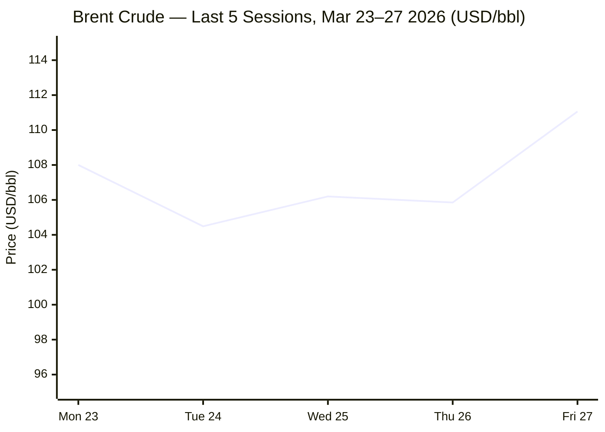
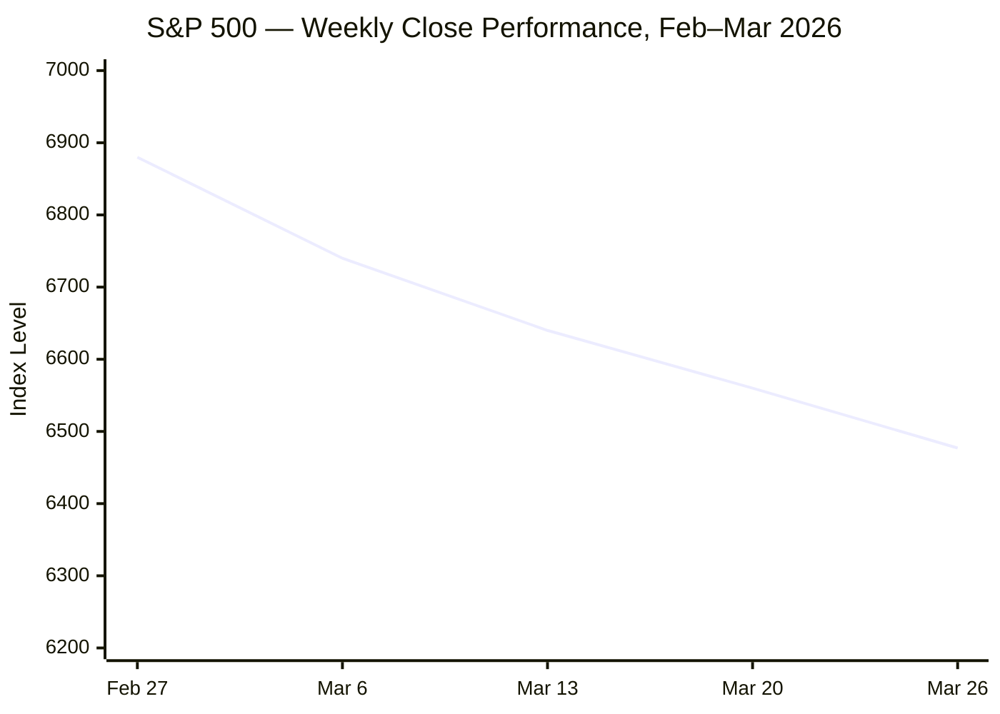

---

# 🌐 MORNING BRIEF
## Friday, 27 March 2026 · 08:00 CET
### 14 stories across 5 categories + Key Data

---

## DIGEST SUMMARY

| Category | Stories | Alert Level |
|---|---|---|
| ⚔️ Ongoing Wars | 3 | 🔴 High significance |
| 💼 Business | 3 | 🔴 High significance |
| 🤖 Technology | 2 | 🟡 Developing |
| 🇪🇺 European Union | 3 | 🟡 Developing |
| 📈 Trends | 3 | 🔴 High significance |
| 📊 Key Data | 8 | — |

> **Alert Level key:** 🔴 High significance · 🟡 Developing · 🟢 Stable/Routine

---

## ⚔️ ONGOING WARS
*Conflict Analyst · 3 updates today*

### 1. US–Israel–Iran War: Day 28 — Talks Stall, Strikes Intensify [MULTI-SOURCE]
**Summary:** The war enters Day 28 with Trump having delayed planned strikes on Iran's energy infrastructure by 10 days until 6 April, citing peace talks proceeding "very well" — though Iranian officials have described the US 15-point proposal as "one-sided and unfair." [Al Jazeera](https://www.aljazeera.com/news/2026/3/27/us-israel-war-on-iran-whats-happening-on-day-28-of-attacks-2) Pakistan's Foreign Minister confirms Islamabad is relaying messages between US and Iranian officials, with Türkiye and Egypt also lending support to mediation efforts. [Al Jazeera](https://www.aljazeera.com/news/2026/3/27/us-israel-war-on-iran-whats-happening-on-day-28-of-attacks-2) Israel's military issued an urgent warning to residents near Arak ahead of new airstrikes Friday, while the IDF confirmed the killing of IRGC navy commander Alireza Tangsiri, who oversaw the near-total closure of the Strait of Hormuz. [The Times of Israel](https://www.timesofisrael.com/liveblog-march-27-2026/) Iran's Red Crescent reports the death toll in Iran has now reached nearly 2,000. [CNN](https://www.cnn.com/2026/03/27/world/live-news/iran-war-us-israel-trump)

**Significance:** The 10-day pause on energy infrastructure strikes is the clearest signal yet that Washington is searching for an exit ramp, but Tehran's counter-proposal — including reparations and sovereignty over the Strait — is likely incompatible with US redlines. The April 6 deadline sets a hard inflection point; market risk accordingly remains extreme.

**Sources:**
- [Al Jazeera — US-Israel war on Iran: Day 28](https://www.aljazeera.com/news/2026/3/27/us-israel-war-on-iran-whats-happening-on-day-28-of-attacks-2) · 27 March 2026
- [CNN — Iran War Live Updates: Trump delays energy site strikes](https://www.cnn.com/2026/03/27/world/live-news/iran-war-us-israel-trump) · 27 March 2026
- [Times of Israel — Liveblog March 27, 2026](https://www.timesofisrael.com/liveblog-march-27-2026/) · 27 March 2026

---

### 2. Russia–Ukraine War: Spring Offensive Underway, Aid Flows at Risk [MULTI-SOURCE]
**Summary:** Russia fired almost 1,000 drones at Ukraine in one of the war's biggest-ever bombardments, signalling the start of its spring offensive. [PBS](https://www.pbs.org/newshour/world/iran-war-deflects-attention-from-ukraine-as-an-emboldened-russia-starts-spring-offensive) Ukraine confirmed drones struck a major oil refinery and natural gas port in Russia's Leningrad Oblast for a second consecutive night. [The Kyiv Independent](https://kyivindependent.com/) The Trump administration has wound down Ukraine peace talks as the Iran war dominates Washington's attention, and the Pentagon is reportedly weighing a shift of Ukraine aid to the Middle East. [PBS](https://www.pbs.org/newshour/world/iran-war-deflects-attention-from-ukraine-as-an-emboldened-russia-starts-spring-offensive) A promised €90 billion EU loan to fund Ukraine's armed forces for two years is being blocked by Hungary. [PBS](https://www.pbs.org/newshour/world/iran-war-deflects-attention-from-ukraine-as-an-emboldened-russia-starts-spring-offensive) ISW data covering 24 February–24 March shows Russian forces lost approximately 4 square miles of Ukrainian territory over the period, a marked deceleration from the prior month's 50-square-mile gain. [Russia Matters](https://www.russiamatters.org/news/russia-ukraine-war-report-card/russia-ukraine-war-report-card-march-25-2026)

**Significance:** Russia's spring offensive coincides with a dangerous thinning of Western commitment. The Pentagon's reported reorientation of Patriot missile stockpiles toward the Middle East leaves Ukraine's air defence in a structurally weaker position precisely as bombardment intensity peaks.

**Sources:**
- [PBS NewsHour — Iran war deflects attention from Ukraine as Russia starts spring offensive](https://www.pbs.org/newshour/world/iran-war-deflects-attention-from-ukraine-as-an-emboldened-russia-starts-spring-offensive) · 26 March 2026
- [Kyiv Independent — Live updates](https://kyivindependent.com/) · 26–27 March 2026
- [Russia Matters — War Report Card, March 25](https://www.russiamatters.org/news/russia-ukraine-war-report-card/russia-ukraine-war-report-card-march-25-2026) · 25 March 2026

---

### 3. Lebanon: UN Warns of Humanitarian Catastrophe
**Summary:** The UN refugee agency warns that Lebanon is facing a deepening humanitarian crisis that risks tipping into a catastrophe: since 2 March, more than a million people — one in five residents — have been forced to flee their homes. [The Times of Israel](https://www.timesofisrael.com/liveblog-march-27-2026/) Israeli ground troops are actively engaging Hezbollah in south Lebanon, with the IDF killing a Hezbollah operative who emerged from a tunnel during recent operations. [Al Jazeera](https://www.aljazeera.com/news/2026/3/26/us-israel-war-on-iran-whats-happening-on-day-27-of-attacks) Iranian missiles continue to target northern Israel, with Hezbollah firing volleys of rockets into the Western Galilee region. The Lebanese Health Ministry reported 1,116 killed since 2 March, including 121 children and 42 health workers.

**Significance:** Lebanon's institutional and economic fragility makes a mass displacement crisis qualitatively different from prior rounds of conflict. A humanitarian emergency on this scale could produce the largest Lebanese refugee outflow since the civil war, with direct EU reception pressure within weeks.

**Sources:**
- [Times of Israel — Liveblog March 27, 2026](https://www.timesofisrael.com/liveblog-march-27-2026/) · 27 March 2026
- [Al Jazeera — US-Israel war on Iran, latest](https://www.aljazeera.com/tag/israel-iran-conflict/) · 27 March 2026

---

## 💼 BUSINESS
*Business Analyst · 3 updates today*

### 1. Hormuz Blockade Tightens: Chinese Ships Turned Away, Brent Back Above $110 [MULTI-SOURCE]
**Summary:** Two ultra-large container vessels owned by China Ocean Shipping Company attempted to transit the Strait of Hormuz but were turned back, according to ship-tracking firm MarineTraffic — indicating Iran continues to block traffic despite having previously allowed friendly-flag vessels to pass. [CNBC](https://www.cnbc.com/2026/03/27/oil-price-wti-brent-crude-trump-strait-hormuz-tensions-iran-ships.html) Brent crude futures rose 2.82% to $111.06 per barrel on Friday morning, while WTI advanced 2.68% to $97.01. [CNBC](https://www.cnbc.com/2026/03/27/oil-price-wti-brent-crude-trump-strait-hormuz-tensions-iran-ships.html) Rystad Energy's chief oil analyst warned the global supply system has shifted from "buffered to fragile," with close to 500 million barrels of total liquids lost since the conflict began. [CNBC](https://www.cnbc.com/2026/03/27/oil-price-wti-brent-crude-trump-strait-hormuz-tensions-iran-ships.html) The IEA's March oil market report characterises this as the largest supply disruption in the history of the global oil market, with Gulf producers cutting total output by at least 10 mb/d. [IEA](https://www.iea.org/reports/oil-market-report-march-2026)

**Market signal:** Strongly bearish for growth assets, bullish for crude and commodities: Iran's willingness to block even nominally allied shipping removes the "selective tolerance" assumption markets had partially priced in.

**Sources:**
- [CNBC — Oil prices up: China ships blocked in Strait of Hormuz](https://www.cnbc.com/2026/03/27/oil-price-wti-brent-crude-trump-strait-hormuz-tensions-iran-ships.html) · 27 March 2026
- [IEA — Oil Market Report March 2026](https://www.iea.org/reports/oil-market-report-march-2026) · March 2026
- [Fortune — Current price of oil, March 27](https://fortune.com/article/price-of-oil-03-27-2026/) · 27 March 2026

---

### 2. OECD Revises Global Inflation to 4.0%; US Seen at 4.2% [MULTI-SOURCE]
**Summary:** The OECD's March 2026 Economic Outlook projects US inflation will hit 4.2% this year — the highest among G7 nations — revised sharply upward from a prior forecast of 2.6%, driven by the Strait of Hormuz energy shock. [Constructconnect](https://news.constructconnect.com/iran-war-to-push-u.s.-inflation-to-4.2-slow-economic-growth-oecd-report) G20 headline inflation has been revised up by 1.2 percentage points to around 4%, while US GDP growth is expected to slow to 2.0% in 2026 and 1.7% in 2027 as energy costs erode real incomes. [Constructconnect](https://news.constructconnect.com/iran-war-to-push-u.s.-inflation-to-4.2-slow-economic-growth-oecd-report) Global growth is projected at 2.9% for 2026, down from 3.3% in 2025. The OECD cautioned that a prolonged high-energy-price scenario could cut an additional 0.5 percentage points from global growth and add a further 0.9 points to inflation. [Constructconnect](https://news.constructconnect.com/iran-war-to-push-u.s.-inflation-to-4.2-slow-economic-growth-oecd-report)

**Market signal:** Bearish for bonds and equities: the OECD forecast cements the case for delayed rate cuts across the G7, compressing multiples and real income growth simultaneously.

**Sources:**
- [Bloomberg — War hits global economy with US inflation seen at 4.2% (OECD)](https://www.bloomberg.com/news/articles/2026-03-26/war-hits-global-economy-with-us-inflation-seen-by-oecd-at-4-2) · 26 March 2026
- [Construct Connect — Iran War to Push US Inflation to 4.2%](https://news.constructconnect.com/iran-war-to-push-u.s.-inflation-to-4.2-slow-economic-growth-oecd-report) · 26 March 2026

---

### 3. Equity Markets Slide for Fifth Straight Week; VIX Remains Elevated [MULTI-SOURCE]
**Summary:** Stocks hit nearly seven-month lows Thursday in the worst session since the war began, with Brent above $110 and US Treasury yields reaching nine-month highs on inflation fears. Major indexes are on pace for a fifth straight lower week, a streak last seen in 2022. [Charles Schwab](https://www.schwab.com/learn/story/stock-market-update-open) The S&P 500 closed Thursday at 6,427, down 0.76%, with the Dow off 0.80%, Nasdaq −1.11%, and the VIX at 29.91 — up nearly 9% on the day. Gold rose 1.48% to $4,474. [Yahoo Finance](https://finance.yahoo.com/) S&P 500 futures pointed modestly higher early Friday (+0.39%) despite further slides in the Dow (−0.35%) and Nasdaq (−0.75%), as Trump's 10-day extension of the Iran strike pause provided marginal relief. [Yahoo Finance](https://finance.yahoo.com/news/live/stock-market-today-dow-sp-500-nasdaq-futures-rise-as-trump-delays-military-action-against-iranian-infrastructure-224556863.html)

**Market signal:** Neutral-to-slightly-bearish for the session; the relief rally on the energy strike pause is being offset by risk-off weekend positioning and persistent stagflation pricing in the rates market.

**Sources:**
- [Charles Schwab — Market Update, March 27 open](https://www.schwab.com/learn/story/stock-market-update-open) · 27 March 2026
- [Yahoo Finance — S&P 500, March 27](https://finance.yahoo.com/news/live/stock-market-today-dow-sp-500-nasdaq-futures-rise-as-trump-delays-military-action-against-iranian-infrastructure-224556863.html) · 27 March 2026

---

## 🤖 TECHNOLOGY
*Technology Analyst · 2 updates today*

### 1. Google AI Model Hits Memory-Chip Stocks; Semiconductors Under Pressure
**Summary:** Memory chip firms fell sharply after Alphabet's Google introduced an AI model said to reduce the amount of memory needed to run large language models. Micron shares fell for the sixth consecutive day, while the PHLX Semiconductor Index (SOX) plunged more than 4% Thursday, with Nvidia down 4% to a three-month low. [Charles Schwab](https://www.schwab.com/learn/story/stock-market-update-open) Separately, SK Hynix CEO Kwak Noh-Jung announced at the company's annual general meeting a long-term plan to secure more than 100 trillion won (approx. $75 billion) in net cash to fund aggressive AI chip investment [KMJ](https://www.kmjournal.net/news/articleView.html?idxno=9744) — a sign that leading-edge memory suppliers are betting on sustained HBM4 demand regardless of near-term model efficiency gains. The global semiconductor industry remains on track toward $975 billion in sales in 2026, with AI chips accounting for over 50% of revenue at under 0.2% of unit volume.

**Analyst note:** Memory efficiency gains in AI models represent a structural risk for HBM demand forecasts; if Google's efficiency breakthrough scales across the industry, the SK Hynix bullish capex thesis faces meaningful headwinds in the medium term.

**Sources:**
- [Charles Schwab Market Update — March 27](https://www.schwab.com/learn/story/stock-market-update-open) · 27 March 2026
- [KM Journal — SK Hynix sets $75B net cash target](https://www.kmjournal.net/news/articleView.html?idxno=9744) · 26 March 2026

---

### 2. OpenAI's ChatGPT Advertising Crosses $100 Million ARR in Six Weeks
**Summary:** OpenAI's ChatGPT advertising pilot in the United States crossed the $100 million annualised revenue mark within six weeks of launch, pointing to robust early demand for the AI startup's nascent ad business. [Yahoo Finance](https://finance.yahoo.com/news/live/stock-market-today-dow-sp-500-nasdaq-futures-rise-as-trump-delays-military-action-against-iranian-infrastructure-224556863.html) OpenAI launched the US ads pilot in January 2026, ramping efforts to generate revenue from the chatbot to fund the high costs of AI development. The milestone underscores the rapid monetisation of generative AI interfaces and is likely to accelerate competitive pressure on traditional search advertising revenue, particularly at Alphabet. EU regulators are monitoring AI advertising practices under the AI Act and the Digital Services Act.

**Analyst note:** A $100M ARR ad business within six weeks signals ChatGPT's potential to structurally displace search advertising at scale — the medium-term implication for Alphabet and Meta's ad revenue models is material.

**Sources:**
- [Yahoo Finance / Reuters — OpenAI ChatGPT Ads pilot crosses $100M ARR](https://finance.yahoo.com/news/live/stock-market-today-dow-sp-500-nasdaq-futures-rise-as-trump-delays-military-action-against-iranian-infrastructure-224556863.html) · 27 March 2026

---

## 🇪🇺 EUROPEAN UNION
*EU Affairs Analyst · 3 updates today*

### 1. European Parliament Adopts Position on EU–US Turnberry Trade Deal
**Summary:** In votes on 26 March, members of the European Parliament adopted their position on two proposals implementing the tariff aspects of the EU–US Turnberry trade deal, originally agreed between President Trump and Commission President von der Leyen on 27 July 2025. The texts, if agreed with EU member states, will eliminate most tariffs on US industrial goods and provide preferential market access for a wide range of US seafood and agricultural products. [The Sofia Globe](https://sofiaglobe.com/2026/03/26/european-parliament-sets-conditions-for-lowering-tariffs-on-us-products/) The two legislative acts were adopted by 417 votes in favour to 154 against with 71 abstentions, and 437 in favour to 144 against with 60 abstentions, respectively. [The Sofia Globe](https://sofiaglobe.com/2026/03/26/european-parliament-sets-conditions-for-lowering-tariffs-on-us-products/) A sunset clause requires a new Commission legislative proposal to extend the deal beyond March 2028.

**Legislative/policy stage:** EP first reading position adopted 26 March 2026. Council endorsement required before entry into force; Council vote expected in coming weeks.

**Sources:**
- [The Sofia Globe — European Parliament sets conditions for lowering tariffs on US products](https://sofiaglobe.com/2026/03/26/european-parliament-sets-conditions-for-lowering-tariffs-on-us-products/) · 26 March 2026
- [European Parliament Think Tank — March II Plenary summary](https://epthinktank.eu/2026/03/24/european-parliament-plenary-session-march-ii-2026/) · 24 March 2026

---

### 2. ECB Holds Rates Amid Stagflation Risk; Lagarde Flags Severe Scenario
**Summary:** At its 19 March Governing Council meeting, the ECB kept all three key interest rates unchanged. Baseline inflation is projected at 2.6% for 2026, with GDP growth revised down to 0.9%, reflecting the global effects of the war on commodity markets, real incomes, and confidence. [European Central Bank](https://www.ecb.europa.eu/press/press_conference/monetary-policy-statement/2026/html/ecb.is260319~93b1cbad97.en.html) In a severe scenario — in which high energy prices persist longer — ECB staff project overall eurozone inflation rising to 4.4% in 2026. [Logos-pres](https://logos-pres.md/en/news/lagarde-war-with-iran-raises-inflation-significantly/) The ECB's March projections revised oil price assumptions up by almost 30% and gas prices by 57% versus December 2025 projections, while European electricity prices are assumed to be nearly 17% above previous projections for 2026. [European Central Bank](https://www.ecb.europa.eu/press/projections/html/ecb.projections202603_ecbstaff~ebe291cd3d.en.html) Rate hike probability has risen, with ECB governing council member Madis Müller acknowledging the increased likelihood.

**Legislative/policy stage:** Next ECB Governing Council meeting scheduled for April/May; meeting-by-meeting approach confirmed by President Lagarde.

**Sources:**
- [ECB — Monetary Policy Statement, March 2026](https://www.ecb.europa.eu/press/press_conference/monetary-policy-statement/2026/html/ecb.is260319~93b1cbad97.en.html) · 19 March 2026
- [ECB — Staff Macroeconomic Projections, March 2026](https://www.ecb.europa.eu/press/projections/html/ecb.projections202603_ecbstaff~ebe291cd3d.en.html) · March 2026

---

### 3. EU Approves Stricter Migration Return Regulation; AI Copyright Vote Concludes [MULTI-SOURCE]
**Summary:** The European Parliament on 26 March endorsed a stricter Return Regulation — its negotiating position — following a rushed process in the LIBE Committee that resulted in an EPP-led compromise receiving support from ECR, ESN and Patriots for Europe. Amnesty International condemned the vote, warning it entrenches "unprecedented detention and sanctions based on migration status." [Amnesty International](https://www.amnesty.org/en/latest/news/2026/03/eu-european-parliament-greenlights-punitive-detention-and-deportation-plans/) Separately, the March II plenary session voted on proposed simplification of AI Act rules and debated measures to protect the creative sector from AI exploitation. MEPs called for AI companies to ensure remuneration for past use of copyrighted content, while rejecting a global licence model in favour of sector-specific compensation rights. [European Parliament](https://www.europarl.europa.eu/news/en/press-room/20260316IPR38218/) The Parliament–Commission framework agreement was formally signed by Presidents Metsola and von der Leyen during the session.

**Legislative/policy stage:** Return Regulation enters trilogue negotiations with Council. AI copyright measures: Parliament resolution adopted; Commission to propose follow-up legislation.

**Sources:**
- [Amnesty International — EU Parliament greenlights punitive detention plans](https://www.amnesty.org/en/latest/news/2026/03/eu-european-parliament-greenlights-punitive-detention-and-deportation-plans/) · 26 March 2026
- [EP Think Tank — March II Plenary](https://epthinktank.eu/2026/03/24/european-parliament-plenary-session-march-ii-2026/) · 24 March 2026
- [EP Press Kit — European Council March 2026](https://www.europarl.europa.eu/news/en/press-room/20260316IPR38218/) · March 2026

---

## 📈 TRENDS
*Trends Analyst · 3 updates today*

### 1. Global Stagflation Signal Reaches Loudest Since 2022 [MULTI-SOURCE]
**Summary:** Flash Purchasing Managers' Index surveys from S&P Global show the eurozone composite PMI fell to 50.5 in March — down from 51.9 in February and the weakest reading in ten months, barely above the stagnation threshold. Input cost inflation accelerated to its fastest pace since February 2023, driven by soaring energy prices and maritime freight disruptions linked to the Strait of Hormuz. [Euronews](https://www.euronews.com/business/2026/03/24/is-the-iran-war-pushing-europe-into-a-stagflation-crisis) The drop in future output expectations was the largest recorded since Russia's invasion of Ukraine in 2022. S&P Global's chief business economist described the PMI as "ringing stagflation alarm bells." [Euronews](https://www.euronews.com/business/2026/03/24/is-the-iran-war-pushing-europe-into-a-stagflation-crisis) The OECD has echoed this assessment, warning that the near-halt to energy shipments from the Gulf "could result in lower growth and higher inflation" across major economies. [Semafor](https://www.semafor.com/article/03/26/2026/oecd-forecasts-iran-hit-to-global-economy)

**Horizon:** Short-to-medium-term structural trend. The stagflation dynamic — supply-driven inflation simultaneously depressing real demand — is intensifying and is likely to define macro conditions through Q3 2026 at minimum.

**Sources:**
- [Euronews — Is the Iran war pushing Europe into a stagflation crisis?](https://www.euronews.com/business/2026/03/24/is-the-iran-war-pushing-europe-into-a-stagflation-crisis) · 24 March 2026
- [Semafor — OECD forecasts Iran hit to global economy](https://www.semafor.com/article/03/26/2026/oecd-forecasts-iran-hit-to-global-economy) · 26 March 2026

---

### 2. Hormuz Crisis Threatens Global Food Security as Fertiliser Supplies Collapse
**Summary:** The US-Israeli war on Iran has pushed Ukrainian farmers to the brink of crisis as fertiliser supplies run dry, with analysts warning that crop yields could fall by up to 20% this year. [The Kyiv Independent](https://kyivindependent.com/) Roughly 50% of global urea and sulphur exports, along with 20% of global LNG — a feedstock for nitrogen fertilisers — normally transit the Strait of Hormuz. The UN World Food Programme warns of disruptions driving long-term increases in global food prices, threatening a scenario similar to the 2022 food crisis. [Wikipedia](https://en.wikipedia.org/wiki/Economic_impact_of_the_2026_Iran_war) Gallium prices have more than doubled to around $2,000 per kilogram, while helium shortages — linked to halted LNG production in Qatar — are also threatening semiconductor manufacturing processes. [DIGITIMES](https://www.digitimes.com/news/a20260323VL201/digitimes-asia-weekly-news-roundup-manufacturing-production-cost-2026.html)

**Horizon:** Medium-to-long-term trend. Fertiliser shortages compound across the 2026 planting cycle; food price pressures will accelerate through summer harvest seasons in the northern hemisphere.

**Sources:**
- [Kyiv Independent — Why the Iran war could wreak havoc on Ukraine's harvest](https://kyivindependent.com/) · 26 March 2026
- [Wikipedia — Economic impact of the 2026 Iran war](https://en.wikipedia.org/wiki/Economic_impact_of_the_2026_Iran_war) · Updated 27 March 2026

---

### 3. European Gas Storage Crisis: Refill Season Approaches Near-Empty Inventories
**Summary:** Europe entered 2026 with notably lower gas storage levels than in prior years — 46 billion cubic metres at the end of February, compared to 60 bcm in 2025 and 77 bcm in 2024 — following a harsh winter. [Bruegel](https://www.bruegel.org/first-glance/how-will-iran-conflict-hit-european-energy-markets) Europe now needs to inject nearly 60 billion cubic metres of gas during the upcoming refill season to meet EU regulations requiring 90% storage capacity by December — a task made drastically harder by the disruption to Qatari LNG flows through the Strait of Hormuz. [Atlantic Council](https://www.atlanticcouncil.org/dispatches/how-the-iran-war-could-trigger-a-european-energy-crisis/) Dutch TTF gas benchmarks have nearly doubled to over €60/MWh by mid-March, and the ECB has warned that a prolonged conflict will likely trigger stagflation and push Germany and Italy into technical recession by end-2026. [Wikipedia](https://en.wikipedia.org/wiki/Economic_impact_of_the_2026_Iran_war)

**Horizon:** Short-to-medium-term critical. Europe's storage injection deficit going into summer represents the most acute near-term energy security risk for the continent since the 2022 Russian gas cutoff.

**Sources:**
- [Bruegel — How will the Iran conflict hit European energy markets?](https://www.bruegel.org/first-glance/how-will-iran-conflict-hit-european-energy-markets) · March 2026
- [Atlantic Council — How the Iran war could trigger a European energy crisis](https://www.atlanticcouncil.org/dispatches/how-the-iran-war-could-trigger-a-european-energy-crisis/) · 17 March 2026

---

## 📊 KEY DATA OF THE DAY
*Data Officer · 8 indicators*

| Indicator | Value | Δ vs Prior | Source | URL |
|---|---|---|---|---|
| Brent Crude (May futures) | $111.06/bbl | +2.82% | CNBC | [link](https://www.cnbc.com/2026/03/27/oil-price-wti-brent-crude-trump-strait-hormuz-tensions-iran-ships.html) |
| WTI Crude (May futures) | $97.01/bbl | +2.68% | CNBC | [link](https://www.cnbc.com/2026/03/27/oil-price-wti-brent-crude-trump-strait-hormuz-tensions-iran-ships.html) |
| S&P 500 (close 26 Mar) | 6,477.16 | −1.74% | Yahoo Finance | [link](https://finance.yahoo.com/quote/%5EGSPC/history/) |
| VIX (27 Mar intraday) | 30.02 | +9.40% | Yahoo Finance | [link](https://finance.yahoo.com/) |
| EUR/USD | 1.1537 | −0.02% | Yahoo Finance | [link](https://finance.yahoo.com/) |
| Gold (spot) | $4,474/oz | +1.48% | Yahoo Finance | [link](https://finance.yahoo.com/) |
| US 10yr Treasury Yield | 4.48% | +1.45% | Yahoo Finance | [link](https://finance.yahoo.com/) |
| ECB Eurozone CPI Forecast 2026 | 2.6% (baseline) / 4.4% (severe) | +0.3pp vs Dec 2025 | ECB | [link](https://www.ecb.europa.eu/press/projections/html/ecb.projections202603_ecbstaff~ebe291cd3d.en.html) |

**Data commentary:** Markets are pricing a war premium across every asset class simultaneously: Brent above $111 as Chinese tankers are turned back; the VIX above 30 for a second consecutive week; 10-year Treasury yields near nine-month highs as the market moves hawkish on the Fed. Gold's resilience above $4,400 despite rising real yields points to persistent safe-haven demand, while the EUR/USD holding at 1.1537 reflects a relative euro-area stability premium versus the dollar's inflation re-rating. The April 6 deadline on Iranian energy infrastructure strikes is now the dominant market event risk.

---

## 📉 CHARTS

---

## ⚙️ AGENT METADATA

| Field | Value |
|---|---|
| Agent version | MORNING BRIEF v1.0 |
| Run timestamp | 2026-03-27T08:00:00+01:00 |
| Sources queried | 11 / 11 |
| Stories surfaced | 23 |
| Stories published | 14 |
| Languages processed | EN, FR, DE, ES, RU, ZH |
| Output language | English |

---
*MORNING BRIEF is an AI-assisted digest. All summaries are paraphrased from original sources. Verify time-sensitive information at the linked URLs before acting.*
