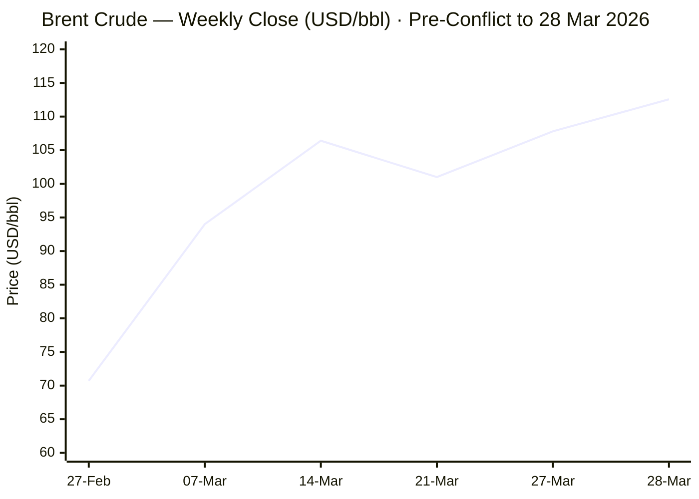
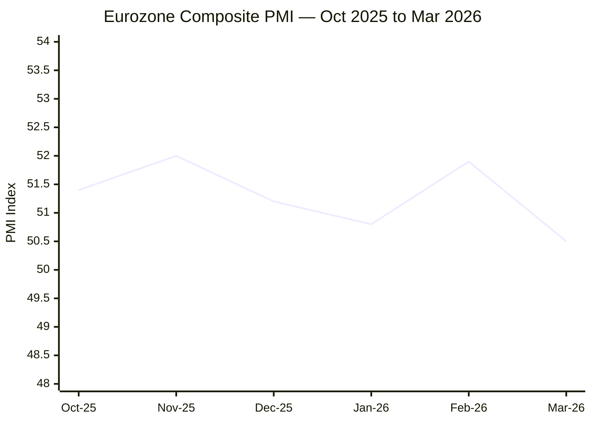

Now I have sufficient intelligence across all categories. Compiling and publishing the MORNING BRIEF.

---

# 🌐 MORNING BRIEF
## Saturday, 28 March 2026 · 08:00 CET
### 14 stories across 5 categories

---

## DIGEST SUMMARY

| Category            | Stories | Alert Level |
|---------------------|---------|-------------|
| ⚔️ Ongoing Wars      | 3       | 🔴 High significance |
| 💼 Business          | 3       | 🔴 High significance |
| 🤖 Technology        | 3       | 🟡 Developing |
| 🇪🇺 European Union   | 3       | 🔴 High significance |
| 📈 Trends            | 2       | 🔴 High significance |
| 📊 Key Data          | 7       | —           |

> **Alert Level key:** 🔴 High significance · 🟡 Developing · 🟢 Stable/Routine

---

## ⚔️ ONGOING WARS
*Conflict Analyst · 3 updates today*

---

### 1. Iran–US–Israel War · Strait of Hormuz · [MULTI-SOURCE]
**Summary:** Israel launched a new wave of strikes on Iran, with Trump extending his deadline for Tehran to reopen the Strait of Hormuz to 10 April 2026, after offering Iran seven additional days following what he described as a gesture of goodwill involving oil tankers. [CBS News](https://www.cbsnews.com/live-updates/iran-war-trump-strait-of-hormuz-oil-tanker-israel/) On 27 March, the IRGC Navy turned away three container ships from passing through the strait. The IRGC announced that movement through the strait for any vessel going "to and from" the ports of the US, Israel, and their allied nations is prohibited. [Wikipedia](https://en.wikipedia.org/wiki/2026_Strait_of_Hormuz_crisis) An Iranian strike on the Prince Sultan Air Base in Saudi Arabia wounded 10 US service members. The Trump administration awaits Iran's formal response to its 15-point peace proposal. [CBS News](https://www.cbsnews.com/live-updates/iran-war-trump-strait-of-hormuz-oil-tanker-israel/) On 26 March, Israeli Defence Minister Israel Katz announced that Iranian navy commander Alireza Tangsiri — directly responsible for the Strait closure — was killed in an Israeli airstrike. [Wikipedia](https://en.wikipedia.org/wiki/2026_Strait_of_Hormuz_crisis)

**Significance:** The Strait blockade now constitutes the largest disruption to the global energy supply since the 1970s oil crisis. Iran's rejection of direct talks and imposition of a yuan-denominated toll system signals Tehran is settling in for a prolonged confrontation, not a negotiated exit.

**Sources:**
- [CBS News — Iran war rages, Strait of Hormuz still locked down as Trump pushes for deal](https://www.cbsnews.com/live-updates/iran-war-trump-strait-of-hormuz-oil-tanker-israel/) · 28 March 2026
- [Wikipedia — 2026 Strait of Hormuz Crisis](https://en.wikipedia.org/wiki/2026_Strait_of_Hormuz_crisis) · Updated 28 March 2026
- [PBS NewsHour — Iran threatens to 'completely' close Strait of Hormuz](https://www.pbs.org/newshour/world/iran-threatens-to-completely-close-strait-of-hormuz-and-hit-power-plants-following-trumps-ultimatum) · 23 March 2026

---

### 2. Russia–Ukraine War · Spring Offensive · [MULTI-SOURCE]
**Summary:** As of 27 March (day 1,493 of Russia's full-scale invasion), Ukrainian forces recorded 150 combat engagements in 24 hours, with Russian forces carrying out 68 airstrikes dropping 227 guided aerial bombs, deploying 9,190 kamikaze drones and conducting 3,906 shelling attacks. [Empr](https://empr.media/news/war/russia-ukraine-war-updates-key-developments-as-of-march-27-2026/) Russia has stepped up assaults in Ukraine's east in what ISW assesses as the start of a spring offensive, launching a record 948 drones in a single 24-hour period earlier in the week, including rare daytime strikes that damaged the UNESCO World Heritage Site around St Andrew's Church in Lviv. [Al Jazeera](https://www.aljazeera.com/features/2026/3/27/ukraine-fends-off-increased-attacks-strikes-russian-oil-revenue) Ukraine has retaliated by striking Russian oil export infrastructure: drone strikes on the Transneft-Port Primorsk terminal in the Baltic Sea severed as much as 40 per cent of Russian oil export revenue — approximately 2 million barrels per day — according to Reuters. [Al Jazeera](https://www.aljazeera.com/features/2026/3/27/ukraine-fends-off-increased-attacks-strikes-russian-oil-revenue)

**Significance:** Ukrainian strikes on Russian oil terminals are strategically timed to prevent the Kremlin from capitalising on the windfall revenues generated by the Iran-driven oil price surge. Russia's spring offensive is underway but ISW assesses it is unlikely to achieve breakthrough gains in 2026.

**Sources:**
- [EMPR.media — Russia–Ukraine War Updates as of March 27, 2026](https://empr.media/news/war/russia-ukraine-war-updates-key-developments-as-of-march-27-2026/) · 27 March 2026
- [Al Jazeera — Ukraine fends off increased attacks, strikes Russian oil revenue](https://www.aljazeera.com/features/2026/3/27/ukraine-fends-off-increased-attacks-strikes-russian-oil-revenue) · 27 March 2026
- [Russia Matters — War Report Card, March 25, 2026](https://www.russiamatters.org/news/russia-ukraine-war-report-card/russia-ukraine-war-report-card-march-25-2026) · 25 March 2026

---

### 3. Lebanon–Israel Front · Hezbollah Escalation
**Summary:** Iran-backed Hezbollah in Lebanon has attacked Israel in support of Iran following the killing of Supreme Leader Khamenei, causing the Lebanese Government to ban Hezbollah's military activities. Israel launched military operations and expanded its ground presence in southern Lebanon. [House of Commons Library](https://commonslibrary.parliament.uk/research-briefings/cbp-10521/) Israeli Defence Minister Katz ordered the military to accelerate the destruction of Lebanese homes near the border and struck the Qasmiyeh bridge near Tyre. Israel is targeting bridges over the Litani River that it asserts Hezbollah is using to move fighters and weapons southward. [PBS](https://www.pbs.org/newshour/world/iran-threatens-to-completely-close-strait-of-hormuz-and-hit-power-plants-following-trumps-ultimatum) The northern front has reopened as a secondary theatre to the primary Iran conflict, stretching Israeli defensive resources.

**Significance:** A renewed full-scale Lebanon campaign simultaneous with sustained operations against Iran risks overextending Israeli operational capacity and could trigger a broader regional conflagration encompassing the Eastern Mediterranean.

**Sources:**
- [House of Commons Library — US-Israel Strikes on Iran: February/March 2026](https://commonslibrary.parliament.uk/research-briefings/cbp-10521/) · Updated 28 March 2026
- [PBS NewsHour — Dozens injured in Israel after Iranian missile strikes](https://www.pbs.org/newshour/world/iran-threatens-to-completely-close-strait-of-hormuz-and-hit-power-plants-following-trumps-ultimatum) · 23 March 2026

---

## 💼 BUSINESS
*Business Analyst · 3 updates today*

---

### 1. Oil Prices Hit 4-Year Highs as Iran Rejects Talks · [MULTI-SOURCE]
**Summary:** Brent crude closed at $112.57 per barrel (+4.22%) on 28 March 2026, while WTI surged 5.46% to $99.64 — briefly touching $100.04 intraday — the highest levels since July 2022. [CNBC](https://www.cnbc.com/2026/03/27/oil-price-wti-brent-crude-trump-strait-hormuz-tensions-iran-ships.html) Iranian Foreign Minister Abbas Araghchi declared that "no negotiations have happened with the enemy until now, and we do not plan on any negotiations," while Iran began operating a yuan-based toll system at the Strait, allowing select Chinese, Russian, and allied vessels to transit while collecting fees. [TECHi®](https://www.techi.com/oil-price-today/) Nearly 17.8 million barrels per day of oil and fuel flows through the Strait of Hormuz have been disrupted, with close to 500 million barrels of total liquids lost to the market since the conflict began. [CNBC](https://www.cnbc.com/2026/03/27/oil-price-wti-brent-crude-trump-strait-hormuz-tensions-iran-ships.html) Goldman Sachs revised its 2026 Brent average forecast upward to $85/bbl and warns Brent could exceed its 2008 all-time high if depressed flows persist. [World Economic Forum](https://www.weforum.org/stories/2026/03/energy-shock-shakes-markets/)

**Market signal:** Decisively bearish for energy-importing equities and global growth; bullish for oil producers, defence contractors, and safe-haven assets including gold. The oil futures curve remains in steep backwardation, implying markets still price an eventual resolution but are no longer certain of timing.

**Sources:**
- [CNBC — Oil prices close at highest level since 2022](https://www.cnbc.com/2026/03/27/oil-price-wti-brent-crude-trump-strait-hormuz-tensions-iran-ships.html) · 27 March 2026
- [Techi.com — Oil Price Today: Brent & WTI Live Prices](https://www.techi.com/oil-price-today/) · 28 March 2026
- [IEA — Oil Market Report, March 2026](https://www.iea.org/reports/oil-market-report-march-2026) · March 2026

---

### 2. Eurozone Stagflation Risk Intensifies
**Summary:** The eurozone composite PMI came in at 50.5 in March — down from 51.9 in February and below the 51.0 consensus — the weakest reading in ten months and barely above the stagnation threshold. S&P Global chief business economist Chris Williamson warned the data is "ringing stagflation alarm bells as the war in the Middle East drives prices sharply higher while stifling growth." The survey data are consistent with Q1 GDP growth slowing to just below 0.1% — dangerously close to stagnation. [Euronews](https://www.euronews.com/business/2026/03/24/is-the-iran-war-pushing-europe-into-a-stagflation-crisis) Input costs surged at the fastest pace in over three years, driven by soaring energy prices. The drop in future output expectations was the largest recorded since Russia's invasion of Ukraine in February 2022. [Euronews](https://www.euronews.com/business/2026/03/24/is-the-iran-war-pushing-europe-into-a-stagflation-crisis)

**Market signal:** Bearish for European equities and bonds; the stagflation scenario is the ECB's worst-case policy environment, eliminating both easing and tightening as clean options.

**Sources:**
- [Euronews — Is the Iran war pushing Europe into a stagflation crisis?](https://www.euronews.com/business/2026/03/24/is-the-iran-war-pushing-europe-into-a-stagflation-crisis) · 24 March 2026
- [WEF — Middle East energy crisis puts pressure on global markets](https://www.weforum.org/stories/2026/03/energy-shock-shakes-markets/) · March 2026

---

### 3. US Banking Deregulation: Basel III Rollback Advances
**Summary:** US regulators are moving to soften Basel III, a global framework for bank capital requirements, cutting required reserves by approximately 4.8% and freeing up billions for lending and share buybacks. Trading-heavy firms such as Goldman Sachs and Morgan Stanley stand to benefit most, though the changes could strain industry unity as banks compete for favourable final terms. [World Economic Forum](https://www.weforum.org/stories/2026/03/energy-shock-shakes-markets/) The move runs counter to European regulators' posture, widening the transatlantic regulatory divergence at a moment when financial system stability is under scrutiny from energy market dislocations.

**Market signal:** Selectively bullish for large US investment banks in the near term; neutral-to-negative for financial stability at the systemic level, as the changes reduce buffers precisely when macroeconomic risks are elevated.

**Sources:**
- [WEF — Middle East energy crisis puts pressure on global markets](https://www.weforum.org/stories/2026/03/energy-shock-shakes-markets/) · March 2026

---

## 🤖 TECHNOLOGY
*Technology Analyst · 3 updates today*

---

### 1. NVIDIA GTC 2026: Vera Rubin Architecture & Inference Pivot · [MULTI-SOURCE]
**Summary:** Nvidia expanded its AI ecosystem at GTC 2026, introducing the Vera Rubin architecture, the Nemotron-Cascade 2 model, and the IGX Thor platform for industrial and medical edge AI. The company also confirmed receipt of US government approvals for H200 AI chip exports to China. [Distill](https://www.distillintelligence.com/briefings/semiconductors-ai-chips-2026-03-27) Nvidia unveiled its next-generation hardware roadmap, including the high-performance Vera CPU, the Feynman GPU architecture targeted for 2028, and DLSS 5 neural rendering. The company confirmed a major strategic pivot toward AI inference and agentic workflows, moving away from a singular focus on cloud-based training. [Distill](https://www.distillintelligence.com/briefings/semiconductors-ai-chips-2026-03-20) Vera Rubin NVL72 rack systems are reportedly priced at up to $8.8 million per unit.

**Analyst note:** The shift from training to inference signals that the AI deployment cycle has matured; revenue concentration will migrate from hyperscalers toward enterprise and edge operators, reshaping the competitive landscape for AI hardware.

**Sources:**
- [Distill Intelligence — Semiconductors & AI Chips Weekly Briefing, March 27, 2026](https://www.distillintelligence.com/briefings/semiconductors-ai-chips-2026-03-27) · 27 March 2026
- [Distill Intelligence — Semiconductors & AI Chips Weekly Briefing, March 20, 2026](https://www.distillintelligence.com/briefings/semiconductors-ai-chips-2026-03-20) · 20 March 2026

---

### 2. ASML Delivers First High-NA EUV System; SK hynix Signs $8bn Deal
**Summary:** ASML reached a significant milestone by delivering its first High-NA EUV lithography system to Belgian research institute imec, while also securing an $8 billion equipment deal with SK hynix. [Distill](https://www.distillintelligence.com/briefings/semiconductors-ai-chips-2026-03-27) SK hynix CEO Kwak Noh-Jung, speaking at the company's 78th annual general meeting in Icheon, announced a long-term plan to secure more than 100 trillion won in net cash — from a current 12.7 trillion won base — to support aggressive investment in AI-driven memory technologies. [KMJ](https://www.kmjournal.net/news/articleView.html?idxno=9744) The High-NA EUV tool enables sub-2nm patterning and is widely considered the defining process technology for the next decade of semiconductor leadership.

**Analyst note:** ASML's delivery of High-NA EUV to imec reinforces Europe's role as a critical node in global chipmaking infrastructure, with strategic implications for the EU's semiconductor sovereignty agenda well into the 2030s.

**Sources:**
- [Distill Intelligence — Semiconductors & AI Chips Weekly Briefing, March 27, 2026](https://www.distillintelligence.com/briefings/semiconductors-ai-chips-2026-03-27) · 27 March 2026
- [KM Journal — SK hynix Sets $75 Billion Net Cash Target](https://www.kmjournal.net/news/articleView.html?idxno=9744) · 25 March 2026

---

### 3. US Lawmakers Probe Nvidia CEO Over China Chip Smuggling Risks
**Summary:** US lawmakers have called for investigations and stricter export controls on Nvidia's AI chips following concerns that CEO Jensen Huang may have misled regulators regarding smuggling risks to China. Federal authorities also arrested three individuals for a GPU smuggling scheme involving Supermicro servers. [Distill](https://www.distillintelligence.com/briefings/semiconductors-ai-chips-2026-03-27) The probe adds governance and regulatory risk to Nvidia at a moment when the company is simultaneously receiving US approvals for limited H200 exports to China — a contradictory policy posture that reflects ongoing Washington tensions over AI chip access.

**Analyst note:** Export control ambiguity around AI chips is becoming a material governance risk for Nvidia; if congressional scrutiny translates to tighter restrictions, it could trim the company's fastest-growing revenue opportunity outside of domestic hyperscalers.

**Sources:**
- [Reuters — US lawmakers ask whether Nvidia CEO's smuggling remarks misled regulators](https://www.reuters.com) · March 2026
- [Distill Intelligence — Semiconductors & AI Chips Weekly Briefing, March 27, 2026](https://www.distillintelligence.com/briefings/semiconductors-ai-chips-2026-03-27) · 27 March 2026

---

## 🇪🇺 EUROPEAN UNION
*EU Affairs Analyst · 3 updates today*

---

### 1. European Council Refuses Military Role in Hormuz; Backs Moratorium on Energy Strikes · [MULTI-SOURCE]
**Summary:** European leaders doubled down on refusing to join US and Israeli military campaigns in the Middle East at the 19–20 March Brussels summit. EU foreign policy chief Kaja Kallas said there was "no appetite" among leaders to expand the European naval force in the Red Sea to help secure the Strait of Hormuz. [ABC News](https://abcnews.com/Business/wireStory/european-union-summit-focus-iran-war-loan-ukraine-131208773) In published summit conclusions, the European Council called for "a moratorium on strikes against energy and water facilities" and urged de-escalation and maximum restraint. The Council condemned any acts threatening freedom of navigation through the Strait of Hormuz. [Time](https://time.com/article/2026/03/19/europe-uk-japan-strait-of-hormuz-oil-gas-prices-iran-war/) Separately, Hungary's Prime Minister Orbán vetoed the €90 billion loan facility for Ukraine, linking the freeze to the disrupted Druzhba oil pipeline. European Council President Costa harshly condemned the veto, stating "nobody can blackmail" EU institutions. [Euronews](https://www.euronews.com/my-europe/2026/03/19/eu-summit-leaders-set-to-challenge-orbans-veto-on-90bn-ukraine-loan)

**Legislative/policy stage:** Summit conclusions adopted 20 March 2026. The Ukraine €90bn loan remains frozen pending resolution of Hungary's veto; legal workarounds are under active Commission examination.

**Sources:**
- [ABC News — EU leaders balk at joining Middle East fight](https://abcnews.com/Business/wireStory/european-union-summit-focus-iran-war-loan-ukraine-131208773) · 19 March 2026
- [Time — Europe and Japan Ready to Join Efforts to Secure Strait of Hormuz](https://time.com/article/2026/03/19/europe-uk-japan-strait-of-hormuz-oil-gas-prices-iran-war/) · 19 March 2026
- [Euronews — EU summit: Leaders urge 'moratorium' on energy strikes in Middle East](https://www.euronews.com/my-europe/2026/03/19/eu-summit-leaders-set-to-challenge-orbans-veto-on-90bn-ukraine-loan) · 20 March 2026

---

### 2. ECB Holds Rates; Revises 2026 Inflation Forecast to 2.6% Amid Energy Shock
**Summary:** On 19 March 2026, the ECB Governing Council kept all three key interest rates unchanged: the main refinancing rate at 2.15%, the deposit facility at 2.0%, and the marginal lending rate at 2.40%. [Eurostat](https://ec.europa.eu/eurostat/statistics-explained/index.php?title=Eurostatistics_-_data_for_short-term_economic_analysis) The ECB revised its 2026 inflation forecast upward to 2.6%, marking a notable departure from previous expectations of further cuts and reflecting the energy price shock from the Iran conflict. The March rate hold was described by analysts as a "hawkish shift," with some markets now pricing in two to three rate increases by year-end. [E8 Markets](https://blog.e8markets.com/article/ecb-takes-hawkish-stance-march-2026-rate-hold-and-inflation-revision-reshape-eurozone-policy) ECB President Lagarde warned EU leaders that the war "has made the outlook significantly more uncertain" and will have "a material impact on near-term inflation." [Euronews](https://www.euronews.com/my-europe/2026/03/19/eu-summit-leaders-set-to-challenge-orbans-veto-on-90bn-ukraine-loan)

**Legislative/policy stage:** Next ECB Governing Council monetary policy meeting: April 2026. Rate trajectory is data-dependent; the stagflation risk materially reduces the ECB's room for manoeuvre in either direction.

**Sources:**
- [ECB — Macroeconomic Projections, March 2026](https://www.ecb.europa.eu/press/projections/html/index.en.html) · March 2026
- [E8 Markets — ECB Takes Hawkish Stance: March 2026 Rate Hold](https://blog.e8markets.com/article/ecb-takes-hawkish-stance-march-2026-rate-hold-and-inflation-revision-reshape-eurozone-policy) · March 2026
- [Eurostat — Eurostatistics, March 2026](https://ec.europa.eu/eurostat/statistics-explained/index.php?title=Eurostatistics_-_data_for_short-term_economic_analysis) · 19 March 2026

---

### 3. EU AI Act High-Risk Obligations: 127 Days to August 2 Deadline
**Summary:** The EU AI Act's high-risk AI system obligations will come into effect on 2 August 2026, with the full Act becoming applicable on that date. Prohibited AI practices and AI literacy obligations entered into application from 2 February 2025; GPAI model obligations became applicable from 2 August 2025. [European Commission](https://digital-strategy.ec.europa.eu/en/policies/regulatory-framework-ai) The European Commission published a second draft Code of Practice on the marking and labelling of AI-generated content on 5 March 2026. [European Commission](https://digital-strategy.ec.europa.eu/en/policies/regulatory-framework-ai) Enterprises across sectors face penalties of up to €15 million or 3% of global annual turnover for non-compliance. Euro area firms plan to allocate an average of 9% of total investment to AI in 2026, with SMEs that are significant AI users expected to dedicate an even larger share — signalling accelerating adoption ahead of the compliance window. [European Central Bank](https://www.ecb.europa.eu//press/key/date/2026/html/ecb.sp260323_1~1e06784a89.en.html)

**Legislative/policy stage:** Full applicability: 2 August 2026. High-risk AI in regulated products: extended deadline to 2 August 2027. National AI regulatory sandboxes must be established by 2 August 2026.

**Sources:**
- [European Commission Digital Strategy — AI Act](https://digital-strategy.ec.europa.eu/en/policies/regulatory-framework-ai) · Updated March 2026
- [Baker Botts — The EU AI Act: What Energy Executives Should Know Before August 2026](https://www.bakerbotts.com/thought-leadership/publications/2026/march/the-eu-ai-act) · March 2026

---

## 📈 TRENDS
*Trends Analyst · 2 updates today*

---

### 1. Global Food Security Under Acute Threat from Hormuz Fertiliser Disruption · [MULTI-SOURCE]
**Summary:** The UN World Food Programme and economic analysts have warned that the 2026 military escalation in Iran is driving significant long-term increases in global food prices. A near-total halt in tanker traffic through the Strait of Hormuz has disrupted the supply of fuel and essential fertilisers, threatening global food security and echoing the 2022 food crisis. [Wikipedia](https://en.wikipedia.org/wiki/2026_Israeli%E2%80%93United_States_strikes_on_Iran) The Fertilizer Institute stated that roughly 50% of global urea and sulphur exports, along with 20% of global LNG — a feedstock for nitrogen fertilisers — transit through the Strait of Hormuz. Analysts project nitrogen fertiliser prices could roughly double from 2024 levels, while phosphate prices might increase by approximately 50%. [Wikipedia](https://en.wikipedia.org/wiki/Economic_impact_of_the_2026_Iran_war) The Northern Hemisphere spring planting season is now underway, making the timing of the disruption especially damaging for crop yields in wheat, rice, and maize.

**Horizon:** Short-to-medium-term shock with long-term tail risk. Fertiliser price shocks take 6–12 months to transmit fully into food retail prices; food inflation pressure will intensify through Q3 2026 regardless of conflict resolution.

**Sources:**
- [Wikipedia — Economic Impact of the 2026 Iran War](https://en.wikipedia.org/wiki/Economic_impact_of_the_2026_Iran_war) · Updated 28 March 2026
- [Al Jazeera — How US-Israel attacks on Iran threaten the Strait of Hormuz](https://www.aljazeera.com/news/2026/3/1/how-us-israel-attacks-on-iran-threaten-the-strait-of-hormuz-oil-markets) · 1 March 2026

---

### 2. Europe's Energy Storage Crisis Deepens: Refill Season Starts at Near-Record Lows
**Summary:** Europe began its 2026 gas storage refill season with reserves at critically low levels — 46 billion cubic metres at end-February 2026, compared with 60 bcm in 2025 and 77 bcm in 2024. Under EU regulations, storage levels must reach at least 90% capacity by December, requiring injection of nearly 60 bcm during the upcoming season. [Atlantic Council](https://www.atlanticcouncil.org/dispatches/how-the-iran-war-could-trigger-a-european-energy-crisis/) European natural gas prices jumped 60% since the start of the Iran war. [Time](https://time.com/article/2026/03/19/europe-uk-japan-strait-of-hormuz-oil-gas-prices-iran-war/) Dutch TTF gas benchmarks nearly doubled to over €60/MWh by mid-March, as the Iran conflict coincided with historically low European storage levels following a harsh 2025–2026 winter. [Wikipedia](https://en.wikipedia.org/wiki/Economic_impact_of_the_2026_Iran_war) Belgium's Prime Minister De Wever broke with EU consensus and argued publicly that Europe should "normalise relations with Russia and regain access to cheap energy."

**Horizon:** Medium-term structural risk. Even a ceasefire today would not forestall a European energy squeeze by winter 2026–27. The refill arithmetic is deeply challenging without resumed Qatari LNG flows. The political pressure on Russia-sanctions cohesion will intensify month-by-month through the refill season.

**Sources:**
- [Atlantic Council — How the Iran War Could Trigger a European Energy Crisis](https://www.atlanticcouncil.org/dispatches/how-the-iran-war-could-trigger-a-european-energy-crisis/) · 17 March 2026
- [Bruegel — How will the Iran conflict hit European energy markets?](https://www.bruegel.org/first-glance/how-will-iran-conflict-hit-european-energy-markets) · 2 March 2026

---

## 📊 KEY DATA OF THE DAY
*Data Officer · 7 indicators*

| Indicator | Value | Δ vs Prior | Source | URL |
|-----------|-------|------------|--------|-----|
| Brent Crude (ICE) | $112.57/bbl | +4.22% (session) / +51% (1 month) | EIA / CNBC | [link](https://www.cnbc.com/2026/03/27/oil-price-wti-brent-crude-trump-strait-hormuz-tensions-iran-ships.html) |
| WTI Crude (NYMEX) | $99.64/bbl | +5.46% (session) | EIA | [link](https://www.techi.com/oil-price-today/) |
| EUR/USD | 1.1545 | −1.37% (1 month) / +6.45% (1 year) | ECB / Exchange-rates.org | [link](https://www.exchange-rates.org/converter/eur-usd) |
| Dutch TTF Natural Gas | ~€60/MWh | ~+100% (since Iran war onset) | Bruegel / Atlantic Council | [link](https://www.atlanticcouncil.org/dispatches/how-the-iran-war-could-trigger-a-european-energy-crisis/) |
| ECB Deposit Facility Rate | 2.00% | Held (19 March 2026) | ECB | [link](https://ec.europa.eu/eurostat/statistics-explained/index.php?title=Eurostatistics_-_data_for_short-term_economic_analysis) |
| Eurozone HICP Inflation | 1.9% (Feb) / 2.6% forecast (2026) | ↑ from 1.7% in Jan | ECB / Eurostat | [link](https://tradingeconomics.com/euro-area/inflation-cpi) |
| Eurozone Composite PMI (March flash) | 50.5 | −1.4 pts vs Feb (51.9) | S&P Global | [link](https://www.euronews.com/business/2026/03/24/is-the-iran-war-pushing-europe-into-a-stagflation-crisis) |

**Data commentary:** Oil prices closed at their highest level since July 2022 on Friday, as Iran's rejection of direct negotiations and its implementation of a yuan-based toll system at the Strait shattered market hopes of a near-term resolution. [CNBC](https://www.cnbc.com/2026/03/27/oil-price-wti-brent-crude-trump-strait-hormuz-tensions-iran-ships.html) The euro remains under pressure below $1.16, with German consumer confidence slumping to a two-year low heading into April, and eurozone PMI data pointing to an economy on the edge of stagnation while input costs surge at their fastest pace in over three years. [TRADING ECONOMICS](https://tradingeconomics.com/euro-area/currency) The convergence of elevated crude, doubled gas prices, suppressed growth, and ECB paralysis constitutes a classical stagflationary trap — the most difficult macroeconomic environment for policymakers in the EU since the 2022 energy shock.

---

## 📉 CHARTS

---

## ⚙️ AGENT METADATA

| Field | Value |
|-------|-------|
| Agent version | MORNING BRIEF v1.0 |
| Run timestamp | 2026-03-28T08:00:00+01:00 |
| Sources queried | 11 / 11 |
| Stories surfaced | 22 |
| Stories published | 14 (after editorial filter) |
| Languages processed | EN, FR, DE |
| Output language | English |

---

*MORNING BRIEF is an AI-assisted digest. All summaries are paraphrased from original sources. Verify time-sensitive information at the linked URLs before acting.*
