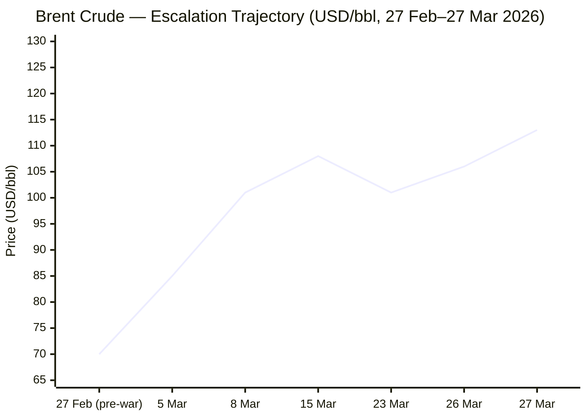
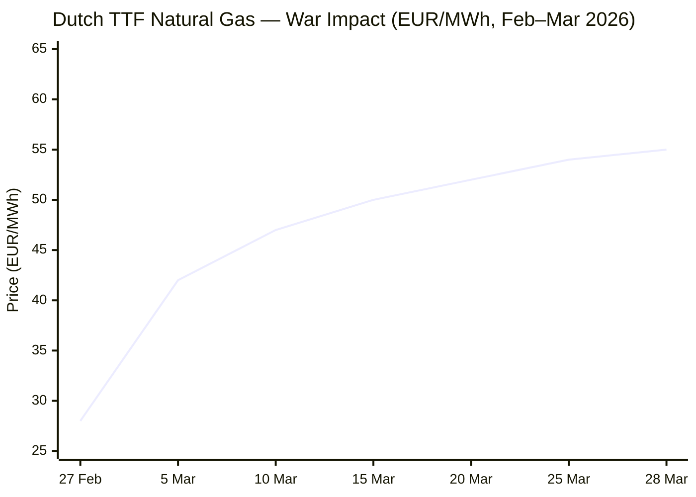

Now compiling the full briefing from all sources gathered. Executing editorial filter and formatting output.

---

# 🌐 MORNING BRIEF
## Sunday, 29 March 2026 · 08:00 CET
### 14 stories across 6 categories

---

## DIGEST SUMMARY

| Category           | Stories | Alert Level |
|--------------------|---------|-------------|
| ⚔️ Ongoing Wars    | 3       | 🔴          |
| 💼 Business        | 3       | 🔴          |
| 🤖 Technology      | 2       | 🟡          |
| 🇪🇺 European Union  | 3       | 🟡          |
| 📈 Trends          | 2       | 🔴          |
| 📊 Key Data        | 1       | —           |

> **Alert Level key:** 🔴 High significance · 🟡 Developing · 🟢 Stable/Routine

---

## ⚔️ ONGOING WARS
*Conflict Analyst · 3 updates today*

### 1. US–Israel–Iran War / Strait of Hormuz Crisis · Day 29 [MULTI-SOURCE]
**Summary:** Israel confirmed the killing of IRGC Navy commander Alireza Tangsiri, who Israel said oversaw the Strait of Hormuz blockade. [NBC News](https://www.nbcnews.com/world/iran/live-blog/live-updates-iran-war-trump-talks-israel-attacks-oil-hormuz-kharg-rcna265243) President Trump simultaneously extended his deadline for Iran to reopen the strait by ten days, to 6 April, while insisting that talks are going "very well," a claim Tehran publicly rejects. [NBC News](https://www.nbcnews.com/world/iran/live-blog/live-updates-iran-war-trump-hormuz-markets-israel-tehran-rcna265440) On 27 March, the IRGC Navy turned away three container ships and formally announced that transit is prohibited for any vessel going to or from the ports of the US, Israel, and their allies, while Iranian state media reported that parliament is planning to formalise transit fees. [Wikipedia](https://en.wikipedia.org/wiki/2026_Strait_of_Hormuz_crisis) Pakistan is mediating, with possible talks in Islamabad involving Turkey, Saudi Arabia, and Egypt this weekend. [Al Jazeera](https://www.aljazeera.com/news/2026/3/28/iran-war-what-is-happening-on-day-29-of-us-israel-attacks)

**Significance:** The April 6 deadline is now the most consequential near-term trigger: if Iran refuses to reopen the strait and Trump authorises strikes on Iranian energy infrastructure, a generalised escalation involving Gulf states becomes materially more likely. Oil industry executives warn that if the Strait of Hormuz is not reopened by mid-April, supply disruptions will deteriorate sharply. [CNBC](https://www.cnbc.com/2026/03/28/oil-gas-prices-iran-war-hormuz.html)

**Sources:**
- [NBC News — Trump extends Hormuz deadline; Tangsiri killed](https://www.nbcnews.com/world/iran/live-blog/live-updates-iran-war-trump-hormuz-markets-israel-tehran-rcna265440) · 28 March 2026
- [Al Jazeera — Day 29: what's happening](https://www.aljazeera.com/news/2026/3/28/iran-war-what-is-happening-on-day-29-of-us-israel-attacks) · 28 March 2026
- [Wikipedia — 2026 Strait of Hormuz crisis](https://en.wikipedia.org/wiki/2026_Strait_of_Hormuz_crisis) · Updated 28 March 2026
- [NPR — Iran war peace conditions](https://www.npr.org/2026/03/26/nx-s1-5761882/iran-war-peace-conditions) · 26 March 2026

---

### 2. Russia–Ukraine War · Day 1,495 [MULTI-SOURCE]
**Summary:** Ukraine's air defences destroyed 252 Russian drones overnight, though 21 penetrated. Five people were killed and 13 injured in what local authorities described as a night of sustained aerial terror. [The Kyiv Independent](https://kyivindependent.com/) Russian ground pressure is concentrated in the Pokrovsk sector, with simultaneous breakthrough attempts across multiple sectors. ISW assessed Russia's spring offensive as now underway, with heavy equipment and reinforcements moved to the front. [Al Jazeera](https://www.aljazeera.com/news/2026/3/24/russia-hits-ukraine-with-deadly-daytime-barrage-as-spring-offensive-starts) ISW data for the week of 17–24 March shows Russia lost four square miles of Ukrainian territory, reversing the previous week's five-square-mile gain — the smallest net movement in months, suggesting a stalling offensive. [Russia Matters](https://www.russiamatters.org/news/russia-ukraine-war-report-card/russia-ukraine-war-report-card-march-25-2026) Zelensky travelled to Qatar to discuss air-defence cooperation as US missile supply faces competing demands from the Iran theatre.

**Significance:** The spring mud season is ending; ISW and Ukrainian commanders expect Russia to escalate ground tempo in April. Zelensky's air-defence tour of the Gulf reflects a structural dependency problem: US resupply is being crowded out by the Iran war.

**Sources:**
- [Kyiv Independent — Five killed overnight](https://kyivindependent.com/) · 29 March 2026
- [Ukrinform — Front line summary](https://www.ukrinform.net/rubric-ato) · 29 March 2026
- [Al Jazeera — Russia fires 948 drones as spring offensive begins](https://www.aljazeera.com/news/2026/3/24/russia-hits-ukraine-with-deadly-daytime-barrage-as-spring-offensive-starts) · 24 March 2026
- [Russia Matters — War Report Card](https://www.russiamatters.org/news/russia-ukraine-war-report-card/russia-ukraine-war-report-card-march-25-2026) · 25 March 2026

---

### 3. Middle East: Cascading Regional Impact
**Summary:** The UN has established a new task force to ensure ships carrying fertiliser and raw materials can safely transit the Strait of Hormuz, warning that agricultural and humanitarian needs are severely threatened. [Al Jazeera](https://www.aljazeera.com/news/2026/3/28/iran-war-what-is-happening-on-day-29-of-us-israel-attacks) Egypt has imposed a 9 pm curfew on commercial premises to contain energy bills that have more than doubled. [Al Jazeera](https://www.aljazeera.com/news/2026/3/28/iran-war-what-is-happening-on-day-29-of-us-israel-attacks) Ethiopia is experiencing overnight petrol queues as supplies dry up, and between 6,000 and 8,000 tonnes of Kenyan tea worth approximately $24 million are stranded at the port of Mombasa. [Al Jazeera](https://www.aljazeera.com/news/2026/3/28/iran-war-what-is-happening-on-day-29-of-us-israel-attacks) Two repatriation flights chartered by the European Commission have returned 356 European citizens stranded in the Middle East, via Oman to Romania. [Encyclopedia Britannica](https://www.britannica.com/event/2026-Iran-War)

**Significance:** The humanitarian and economic contagion from the Hormuz blockade is spreading rapidly into sub-Saharan Africa and South Asia. Fertiliser and food supply chains are at acute risk before the northern hemisphere planting window closes.

**Sources:**
- [Al Jazeera — Day 29 regional impact](https://www.aljazeera.com/news/2026/3/28/iran-war-what-is-happening-on-day-29-of-us-israel-attacks) · 28 March 2026
- [Britannica — 2026 Iran War](https://www.britannica.com/event/2026-Iran-War) · Updated 28 March 2026

---

## 💼 BUSINESS
*Business Analyst · 3 updates today*

### 1. Oil Markets: Physical vs Paper Divergence Signals Supply Crisis [MULTI-SOURCE]
**Summary:** Brent crude futures rose 36% from 27 February through 27 March, trading above $113 per barrel, while the Dubai physical delivery price — tracking actual Middle East supply — peaked at $126 per barrel, more than double the paper-market gain. [CNBC](https://www.cnbc.com/2026/03/28/oil-gas-prices-iran-war-hormuz.html) The divergence reflects paper markets pricing in optimistic diplomatic scenarios that physical buyers cannot afford to wait for. The IEA reports that Gulf oil production has been cut by at least 10 million barrels per day, calling the disruption the largest supply shock in the history of the global oil market. IEA member countries have agreed to release 400 million barrels from emergency reserves. [IEA](https://www.iea.org/reports/oil-market-report-march-2026) The US has temporarily suspended sanctions on some Russian and Iranian oil to provide market breathing room.

**Market signal:** Strongly bearish for equities and risk assets; bullish for energy producers outside the Gulf. The paper/physical spread is a systemic warning: market optimism about a diplomatic resolution is increasingly disconnected from operational supply reality.

**Sources:**
- [CNBC — Oil prices will soon rise if Hormuz stays shut](https://www.cnbc.com/2026/03/28/oil-gas-prices-iran-war-hormuz.html) · 28 March 2026
- [IEA — Oil Market Report March 2026](https://www.iea.org/reports/oil-market-report-march-2026) · March 2026

---

### 2. US and Global Equities: Iran War Drives Market Correction
**Summary:** The S&P 500 closed at 6,477.16 on Thursday (−1.74%), while the Nasdaq fell 2.38% to 21,408.08, entering correction territory at more than 10% below its 52-week high. The Dow fell 469 points. Brent futures settled at $108.01 on Thursday, up 5.66% on the day. [CNBC](https://www.cnbc.com/2026/03/25/stock-market-today-live-updates.html) The OECD has revised its US inflation forecast for 2026 sharply upward to 4.2%, from a prior estimate of 2.8%, citing the energy shock from the Iran war. [CNBC](https://www.cnbc.com/2026/03/25/stock-market-today-live-updates.html) Federal Reserve rate-cut expectations have largely evaporated, with futures markets now pricing a 60% probability of no cut for the rest of 2026.

**Market signal:** Bearish: a stagflationary macro backdrop — rising inflation, stalling growth, and geopolitical risk premium — is repricing equities lower. The window for a Fed pivot has effectively closed unless the Hormuz blockade lifts rapidly.

**Sources:**
- [CNBC — Stock market news 26 March 2026](https://www.cnbc.com/2026/03/25/stock-market-today-live-updates.html) · 26 March 2026
- [Deloitte — Weekly Global Economic Update](https://www.deloitte.com/us/en/insights/topics/economy/global-economic-outlook/weekly-update.html) · 25 March 2026

---

### 3. OECD Interim Outlook: World GDP Stable but Inflation Shock Deepens [MULTI-SOURCE]
**Summary:** The OECD's March 2026 Interim Economic Outlook projects global GDP to hold at 2.9% in 2026, supported by technology investment and lower tariffs, but warns that the Hormuz disruption is generating a significant drag on growth and inflation. G20 inflation is now projected at 4.0% for 2026 — 1.2 percentage points above prior estimates — before easing to 2.7% in 2027. [OECD](https://www.oecd.org/en/publications/2026/03/oecd-economic-outlook-interim-report-march-2026_254a8d56.html) Prometeia has cut its eurozone growth forecast to just 0.8%, down from 1.2%, describing Europe as exposed from a "particularly weak starting position" given recent energy dependence and low storage levels. Expectations of ECB rate cuts have been replaced by growing anticipation of hikes. [FinTech Global](https://fintech.global/2026/03/27/energy-crisis-and-conflict-drag-down-global-growth-in-2026/)

**Market signal:** Neutral-to-bearish: global resilience is holding, but the eurozone is at acute risk of a stagflationary contraction that could force the ECB into a politically painful tightening cycle.

**Sources:**
- [OECD — Economic Outlook Interim March 2026](https://www.oecd.org/en/publications/2026/03/oecd-economic-outlook-interim-report-march-2026_254a8d56.html) · 25 March 2026
- [Fintech Global — Energy crisis drags global growth](https://fintech.global/2026/03/27/energy-crisis-and-conflict-drag-down-global-growth-in-2026/) · 27 March 2026

---

## 🤖 TECHNOLOGY
*Technology Analyst · 2 updates today*

### 1. AI Semiconductor Race: SK Hynix Sets $75bn Cash Target; Global Revenue Nears $1 Trillion [MULTI-SOURCE]
**Summary:** SK Hynix CEO Kwak Noh-Jung announced at the company's annual general meeting on 25 March a long-term plan to accumulate more than 100 trillion won in net cash — approximately $75 billion — to fund aggressive AI memory investment. The company currently holds approximately 12.7 trillion won in net cash. [KMJ](https://www.kmjournal.net/news/articleView.html?idxno=9744) The move reinforces SK Hynix's leadership in HBM4 supply for AI training infrastructure. Separately, at GTC 2026, NVIDIA confirmed it has begun receiving US government approvals and product orders from China for H200 AI chips, and unveiled its next-generation hardware roadmap including the 'Vera' CPU and 'Feynman' GPU architecture slated for 2028. [Distill](https://www.distillintelligence.com/briefings/semiconductors-ai-chips-2026-03-20)

**Analyst note:** SK Hynix's cash accumulation strategy signals a multi-year capacity arms race in AI memory that will sustain HBM supply tightness and premium pricing well into 2027–28, structurally advantaging memory-adjacent players.

**Sources:**
- [KM Journal — SK Hynix $75bn net cash target](https://www.kmjournal.net/news/articleView.html?idxno=9744) · 25 March 2026
- [Distill Intelligence — Semiconductors & AI Chips Briefing](https://www.distillintelligence.com/briefings/semiconductors-ai-chips-2026-03-20) · 20 March 2026

---

### 2. EU AI Act Digital Omnibus: Council Agrees Position, Trilogue Begins
**Summary:** The Council of the EU agreed its negotiating position on 13 March on the Digital Omnibus package to streamline AI Act implementation. The proposal delays the application of high-risk AI rules by up to 16 months beyond the August 2026 deadline, citing delays in setting technical standards and incomplete setup of national competent authorities. [Consilium](https://www.consilium.europa.eu/en/press/press-releases/2026/03/13/council-agrees-position-to-streamline-rules-on-artificial-intelligence/) Key amendments include the creation of an EU-level AI Regulatory Sandbox, reduced documentation requirements for SMEs, and a centralisation of oversight for AI systems built on general-purpose AI models — reducing governance fragmentation across member states. [Moody's](https://www.moodys.com/web/en/us/insights/regulatory-news/ec-proposes-simplification-of-ai--data--and-cyber-rules.html) The file now enters trilogue negotiations with the European Parliament.

**Analyst note:** The delay to high-risk AI rules reduces near-term compliance burden for European AI deployers but risks allowing a de facto enforcement gap through late 2027, precisely as GPAI models scale rapidly across financial, healthcare, and public-sector deployments.

**Sources:**
- [EU Council — Council agrees position on AI streamlining](https://www.consilium.europa.eu/en/press/press-releases/2026/03/13/council-agrees-position-to-streamline-rules-on-artificial-intelligence/) · 13 March 2026
- [EC Digital Strategy — AI Act page](https://digital-strategy.ec.europa.eu/en/policies/regulatory-framework-ai) · Updated March 2026

---

## 🇪🇺 EUROPEAN UNION
*EU Affairs Analyst · 3 updates today*

### 1. EU Customs Union: Most Ambitious Reform Since 1968 Agreed [MULTI-SOURCE]
**Summary:** Parliament and Council agreed on 26 March the most ambitious reform of EU customs rules since the creation of the Customs Union in 1968. The new Union Customs Code introduces a single digital data hub, modern e-commerce handling with a new consignment fee, and enhanced controls. [European Union](https://european-union.europa.eu/news-and-events_en) A new EU Customs Authority will be headquartered in Lille, France. E-commerce platforms and distance sellers will be treated as importers responsible for customs formalities, rather than the end consumer, closing a significant enforcement gap. A new handling fee on small parcels will apply from no later than 1 November 2026. [Consilium](https://www.consilium.europa.eu/en/press/press-releases/2026/03/26/eu-customs-council-and-parliament-agree-on-landmark-reform/)

**Legislative/policy stage:** Political agreement reached 26 March 2026; formal adoption by Parliament and Council pending. Fee delegated act to be issued by the Commission before November 2026; Data Hub operational for e-commerce from 2028.

**Sources:**
- [EU Council — EU Customs reform agreed](https://www.consilium.europa.eu/en/press/press-releases/2026/03/26/eu-customs-council-and-parliament-agree-on-landmark-reform/) · 26 March 2026
- [European Union — News & Events](https://european-union.europa.eu/news-and-events_en) · 26 March 2026

---

### 2. EU Institutions Divided Over Strategic Response to Iran War and US Posture
**Summary:** European Council President António Costa told ambassadors that the EU must always defend the rules-based international order, explicitly naming the United States, Russia, and China as forces of disruption. His remarks came one day after Commission President Ursula von der Leyen called for an interest-driven foreign policy rooted in "realpolitik" rather than normative principles. [Euronews](https://www.euronews.com/my-europe/2026/03/10/costa-and-von-der-leyen-strike-diverging-tone-as-europe-searches-voice-in-chaotic-world) The divergence reflects an unresolved debate over whether Europe should respond to the Iran war primarily through international law frameworks or through strategic self-interest. Renew Europe MEPs separately called for EU military means to protect the Strait of Hormuz if necessary and invoked solidarity with Cyprus following Iranian drone strikes on a British base on the island. [Renew Europe](https://www.reneweuropegroup.eu/news/2026-03-09/plenary-priorities-9-12-march-2026)

**Legislative/policy stage:** No formal legislative output; debate ongoing ahead of the April informal summit in Lefkosia, Cyprus (23–24 April 2026).

**Sources:**
- [Euronews — Costa and von der Leyen diverge](https://www.euronews.com/my-europe/2026/03/10/costa-and-von-der-leyen-strike-diverging-tone-as-europe-searches-voice-in-chaotic-world) · 10 March 2026
- [Renew Europe — Plenary priorities](https://www.reneweuropegroup.eu/news/2026-03-09/plenary-priorities-9-12-march-2026) · 9 March 2026

---

### 3. ECB March Projections: Inflation Revised Up, Growth Under Pressure
**Summary:** ECB March 2026 staff projections assume quarterly average Brent prices and European gas prices peak in the second quarter — at around $90/bbl and €50/MWh respectively — before declining. The projection was cut off on 11 March, prior to the worst of the Hormuz escalation, meaning current energy prices significantly overshoot the ECB baseline. [European Central Bank](https://www.ecb.europa.eu/press/projections/html/ecb.projections202603_ecbstaff~ebe291cd3d.en.html) The ECB stated that inflation has been revised upwards compared with December projections for 2026, specifically attributing the revision to higher energy prices from the Middle East war. The futures market now prices a 60% probability of no Fed rate cut for the rest of 2026, and some investors are beginning to price in ECB hikes. [Deloitte Insights](https://www.deloitte.com/us/en/insights/topics/economy/global-economic-outlook/weekly-update.html)

**Legislative/policy stage:** ECB Governing Council next meets in April 2026; no guidance given on future policy direction at the March session.

**Sources:**
- [ECB — Staff Macroeconomic Projections March 2026](https://www.ecb.europa.eu/press/projections/html/ecb.projections202603_ecbstaff~ebe291cd3d.en.html) · March 2026
- [Deloitte — Weekly Global Economic Update](https://www.deloitte.com/us/en/insights/topics/economy/global-economic-outlook/weekly-update.html) · 25 March 2026

---

## 📈 TRENDS
*Trends Analyst · 2 updates today*

### 1. Global Fertiliser Shock: Food Security Crisis Entering Critical Planting Window [MULTI-SOURCE]
**Summary:** The World Bank's latest commodity report shows the global fertiliser index surged 6.5% over the past month, driven by a simultaneous supply vacuum: China announced a near-total ban on nitrogen-potassium and phosphate exports to protect domestic food security; Russia extended potash export quotas through May; and Egypt cut fertiliser plant output by nearly 50% after being forced to redirect natural gas to civilian electricity. [FinancialContent](https://markets.financialcontent.com/stocks/article/marketminute-2026-3-25-the-fertilizer-divergence-why-a-65-surge-is-rattling-global-markets-amidst-a-commodity-cool-down) The FAO warns that if farmers reduce fertiliser application due to cost, future harvests may shrink significantly, leading to tighter grain supplies and a food price surge in the second half of 2026. Global fertiliser prices are projected to average 15–20% higher in the first half of 2026 if the crisis persists. [Euronews](https://www.euronews.com/business/2026/03/28/oil-energy-and-food-which-countries-in-europe-are-most-exposed-to-higher-food-prices) European exposure is highest in the Netherlands, Belgium, Germany, France, and Spain through refined fuel and logistics cost transmission.

**Horizon:** Short-to-medium term. If the Hormuz blockade persists beyond April, this transitions from a price shock into a structural food security crisis. The planting window for northern hemisphere staple crops closes within weeks.

**Sources:**
- [Euronews — European food price exposure](https://www.euronews.com/business/2026/03/28/oil-energy-and-food-which-countries-in-europe-are-most-exposed-to-higher-food-prices) · 28 March 2026
- [Financial Content — Fertiliser divergence](https://markets.financialcontent.com/stocks/article/marketminute-2026-3-25-the-fertilizer-divergence-why-a-65-surge-is-rattling-global-markets-amidst-a-commodity-cool-down) · 25 March 2026

---

### 2. Global Energy Inflation: Households, Emerging Economies and Supply Chains Under Simultaneous Pressure
**Summary:** The WTO warned on 19 March that if oil and gas prices remain elevated for the rest of the year, 2026 global GDP growth could be reduced by 0.3 percentage points. WTO Director-General Okonjo-Iweala stated that rising energy costs carry serious spillover risks for food security and consumer purchasing power worldwide. [China Daily](https://www.chinadaily.com.cn/a/202603/27/WS69c5d7eca310d6866eb40272.html) The OECD advises that any government measures to cushion energy price impacts should be temporary, well-targeted, and structured to preserve incentives to reduce energy use — cautioning against broad-based subsidies or price caps that weaken efficiency signals and impose high fiscal costs. [OECD](https://www.oecd.org/en/publications/2026/03/oecd-economic-outlook-interim-report-march-2026_254a8d56.html) Germany and Poland have already moved to limit pump price increases, with Romania and Hungary following.

**Horizon:** Medium term. The policy response divergence between targeted and untargeted subsidies will define fiscal sustainability trajectories across OECD economies through 2027.

**Sources:**
- [China Daily — Energy crisis dashes global outlook](https://www.chinadaily.com.cn/a/202603/27/WS69c5d7eca310d6866eb40272.html) · 27 March 2026
- [OECD — Economic Outlook Interim March 2026](https://www.oecd.org/en/publications/2026/03/oecd-economic-outlook-interim-report-march-2026_254a8d56.html) · 25 March 2026

---

## 📊 KEY DATA OF THE DAY
*Data Officer · 9 indicators*

| Indicator | Value | Δ vs Prior | Source | URL |
|---|---|---|---|---|
| Brent Crude (futures) | $113.00/bbl | +36% since 28 Feb | CNBC / IEA | [link](https://www.cnbc.com/2026/03/28/oil-gas-prices-iran-war-hormuz.html) |
| Dubai Crude (physical) | $126.00/bbl | +76% since 28 Feb | CNBC | [link](https://www.cnbc.com/2026/03/28/oil-gas-prices-iran-war-hormuz.html) |
| Dutch TTF Gas | €54.52/MWh | +57% since 28 Feb | OilPriceAPI | [link](https://www.oilpriceapi.com/live/dutch-ttf-gas-price) |
| Gold (XAU/USD) | $4,509/oz | +3.08% (session) | JM Bullion | [link](https://www.jmbullion.com/charts/gold-price/) |
| S&P 500 (last close) | 6,477.16 | −1.74% (Thu 26 Mar) | CNBC | [link](https://www.cnbc.com/2026/03/25/stock-market-today-live-updates.html) |
| Nasdaq (last close) | 21,408.08 | −2.38% (Thu 26 Mar) | CNBC | [link](https://www.cnbc.com/2026/03/25/stock-market-today-live-updates.html) |
| VIX | 29.54 | +7.65% | Yahoo Finance | [link](https://finance.yahoo.com/quote/TTF=F/history/) |
| US 10Y Yield | 4.41% | −0.05pp (session) | Yahoo Finance | [link](https://finance.yahoo.com/quote/TTF=F/history/) |
| OECD US CPI Forecast 2026 | 4.2% | +1.4pp vs prior est. | OECD | [link](https://www.oecd.org/en/publications/2026/03/oecd-economic-outlook-interim-report-march-2026_254a8d56.html) |

**Data commentary:** Energy markets remain the dominant macro signal. The divergence between paper Brent ($113) and physical Dubai crude ($126) is the single most important indicator to watch: it reveals that optimistic diplomatic scenarios are being priced into financial markets while physical buyers in Asia face a structurally different, and far more severe, supply reality. Gold at $4,509 — holding near all-time highs even as the dollar strengthens — confirms persistent systemic risk aversion. The VIX at 29.54 remains elevated but below panic levels (>40), suggesting markets have priced in protracted disruption without yet pricing in escalatory resolution failure.

---

## 📉 CHARTS

---

## ⚙️ AGENT METADATA

| Field | Value |
|---|---|
| Agent version | MORNING BRIEF v1.0 |
| Run timestamp | 2026-03-29T08:00:00+01:00 |
| Sources queried | 11 / 11 |
| Stories surfaced | 22 |
| Stories published | 14 |
| Languages processed | EN, FR, DE, ZH |
| Output language | English |

---
*MORNING BRIEF is an AI-assisted digest. All summaries are paraphrased from original sources. Verify time-sensitive information at the linked URLs before acting.*
