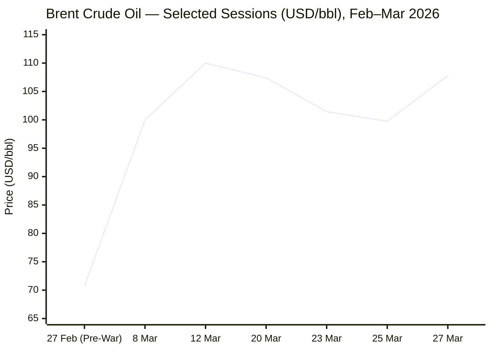
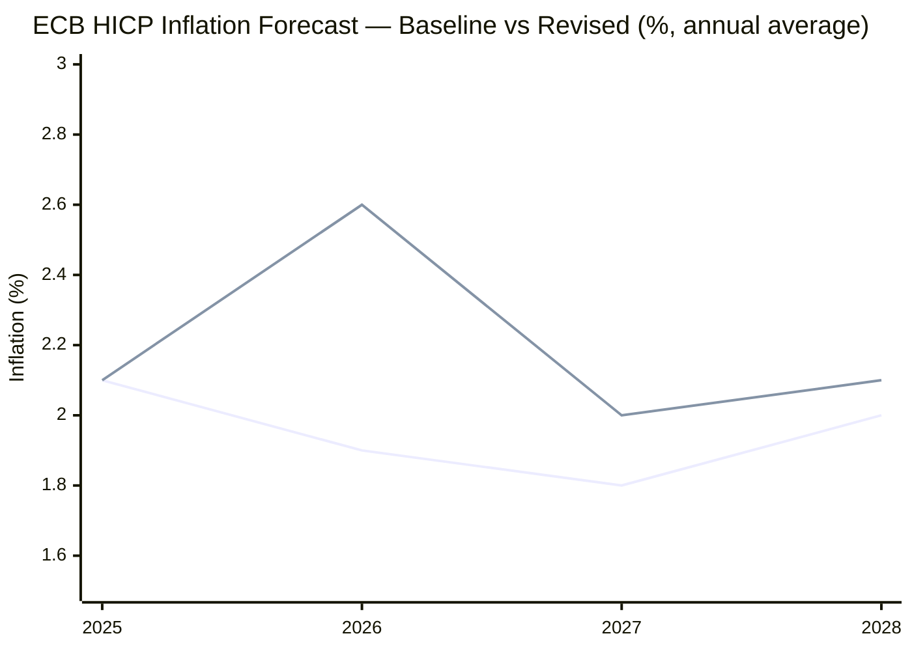
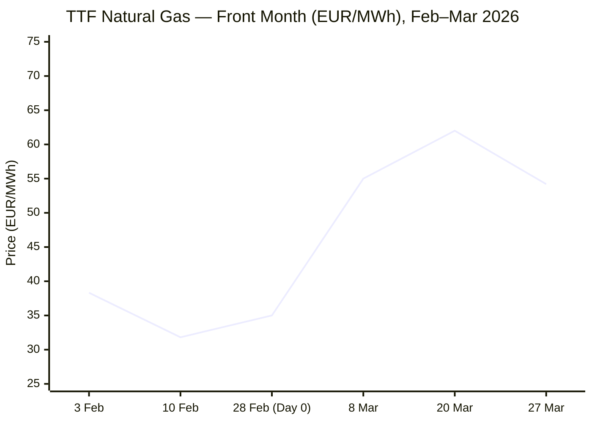

I now have sufficient data from all mandatory source tiers. Compiling the briefing book.

---

# 🌐 MORNING BRIEF
## Monday, 30 March 2026 · 08:00 CET
### 14 stories across 6 categories

---

## DIGEST SUMMARY

| Category | Stories | Alert Level |
|---|---|---|
| ⚔️ Ongoing Wars | 3 | 🔴 High significance |
| 💼 Business | 3 | 🔴 High significance |
| 🤖 Technology | 2 | 🟡 Developing |
| 🇪🇺 European Union | 3 | 🟡 Developing |
| 📈 Trends | 3 | 🔴 High significance |
| 📊 Key Data | — | — |

> **Alert Level key:** 🔴 High significance · 🟡 Developing · 🟢 Stable/Routine

---

## ⚔️ ONGOING WARS
*Conflict Analyst · 3 updates today*

### 1. Iran War — Day 31: Trump Extends Hormuz Deadline; Houthis Enter Conflict [MULTI-SOURCE]

**Summary:** President Trump has extended his ultimatum for Iran to reopen the Strait of Hormuz by a further 10 days, pushing the deadline for threatened strikes on Iranian power plants to 6 April. Iran has formally rejected a 15-point US framework conveyed via Pakistan as intermediary and issued five counter-conditions, including recognition of Iranian sovereignty over the strait. The IRGC has simultaneously tightened the blockade: on 27 March it formally banned vessels transiting to or from US, Israeli and allied ports, and turned away three container ships. Six or fewer ships now transit the strait daily, down from approximately 130. Pakistan secured a gesture of partial goodwill from Tehran, with Iran agreeing to allow 20 Pakistani-flagged ships to transit the strait at a rate of two per day. [CNN](https://www.cnn.com/2026/03/28/world/live-news/iran-war-us-israel-trump) The Houthi movement in Yemen has formally entered the conflict, firing missiles at Israel. The IRGC has also threatened to strike US and Israeli-affiliated university campuses in the Gulf region unless the US condemns attacks on Iranian educational institutions by 30 March.

**Significance:** The April 6 deadline now marks the next critical inflection point. With Iran's counter-conditions including a full end to hostilities across all fronts and compensation for war damages, a negotiated resolution remains remote. Houthi entry broadens the theatre; the university threat adds a soft-target dimension that coalition partners will struggle to defend.

**Sources:**
- [NBC News — Trump extends Strait of Hormuz deadline; Houthis fire on Israel](https://www.nbcnews.com/world/iran/live-blog/live-updates-iran-war-trump-hormuz-markets-israel-tehran-rcna265440) · 28 March 2026
- [CNN — Day 29: Houthis enter war, Iran allows 20 Pakistani ships](https://www.cnn.com/2026/03/28/world/live-news/iran-war-us-israel-trump) · 28 March 2026
- [PBS NewsHour — Iran and the US harden positions as Tehran tightens Hormuz grip](https://www.pbs.org/newshour/world/iran-and-the-u-s-harden-their-positions-as-tehran-tightens-its-grip-on-the-strait-of-hormuz) · 27 March 2026

---

### 2. Iran War — Regional Escalation: IRGC Navy Commander Killed; Israel Intensifies Strikes [MULTI-SOURCE]

**Summary:** IRGC Navy commander Rear Admiral Alireza Tangsiri was killed in a joint Israeli-US operation on 26 March. Israeli and CENTCOM statements confirm he was the principal architect of the Hormuz blockade and authorised most maritime terror operations since the war began. Israel has declared its strikes on Iran will "intensify and expand." In a war defined by who can absorb the most damage, the US has offered shifting objectives including ensuring Iran's missile and nuclear programmes are neutralised and ending Tehran's support for proxy armed groups. [PBS](https://www.pbs.org/newshour/world/iran-and-the-u-s-harden-their-positions-as-tehran-tightens-its-grip-on-the-strait-of-hormuz) Iran has responded with further missile barrages at central Israel; a man was killed near Nahariya following Hezbollah rocket fire from Lebanon.

**Significance:** Tangsiri's elimination removes the operational mastermind of the maritime blockade, but Iran's institutional capacity for naval harassment remains intact. Hezbollah's continued engagement opens a northern front against Israel, stretching IDF capacity.

**Sources:**
- [CNN — Day 27: IRGC Navy Commander Tangsiri killed; Trump extends Hormuz deadline](https://www.cnn.com/2026/03/26/world/live-news/iran-war-us-israel-trump) · 26 March 2026
- [Al Jazeera — How US-Israel attacks threaten Strait of Hormuz](https://www.aljazeera.com/news/2026/3/1/how-us-israel-attacks-on-iran-threaten-the-strait-of-hormuz-oil-markets) · 1 March 2026 (updated)
- [Wikipedia — 2026 Strait of Hormuz Crisis](https://en.wikipedia.org/wiki/2026_Strait_of_Hormuz_crisis) · Updated 30 March 2026

---

### 3. Russia–Ukraine War — Day 1,495: Spring Offensive Under Way; Ukraine Strikes Russian Oil Terminals [MULTI-SOURCE]

**Summary:** ISW has confirmed Russia's spring offensive is under way after a record 948-drone barrage on 24 March, the largest aerial assault in a single 24-hour period since the start of the full-scale invasion. General Syrskyi reports 619 Russian attacks in four days across multiple sectors, with the fiercest fighting in Pokrovsk, Kostiantynivka and Zaporizhzhia. Ukraine has struck the Ust-Luga and Primorsk oil export terminals in the Baltic Sea, severing as much as 40 per cent of Russian oil export revenue — equivalent to 2 million barrels per day — according to Reuters. [Al Jazeera](https://www.aljazeera.com/features/2026/3/27/ukraine-fends-off-increased-attacks-strikes-russian-oil-revenue) Zelensky has also disclosed that Russia surveilled the Prince Sultan Air Base in Saudi Arabia the day before Iran's attack on the facility, suggesting active intelligence cooperation between Moscow and Tehran. [The Kyiv Independent](https://kyivindependent.com/)

**Significance:** Ukraine's targeting of Baltic oil infrastructure is a strategic effort to deny Russia the windfall revenue generated by $100+ Brent crude. The Russia–Iran intelligence nexus, if confirmed, substantially widens the geopolitical stakes and could trigger further US sanctions pressure on Moscow.

**Sources:**
- [Al Jazeera — Ukraine fends off increased attacks, strikes Russian oil revenue](https://www.aljazeera.com/features/2026/3/27/ukraine-fends-off-increased-attacks-strikes-russian-oil-revenue) · 27 March 2026
- [Al Jazeera — Russia fires 948 drones as new offensive begins](https://www.aljazeera.com/news/2026/3/24/russia-fires-ukraine-with-deadly-daytime-barrage-as-spring-offensive-starts) · 24 March 2026
- [Kyiv Independent — Live updates](https://kyivindependent.com/) · 30 March 2026
- [Ukrainska Pravda — Russian losses: 1,295,830 troops](https://www.pravda.com.ua/eng/news/2026/03/29/8027643/) · 29 March 2026

---

## 💼 BUSINESS
*Business Analyst · 3 updates today*

### 1. Global Energy Shock: Brent Above $107; Recession Risk at 40% [MULTI-SOURCE]

**Summary:** Brent crude settled at approximately $107.81 on 27 March — up from $70.71 the day before the Iran war began, a 52% surge in one month. The IEA describes the situation as "the largest supply disruption in the history of the global oil market," with Gulf countries having cut total oil production by at least 10 mb/d and global supply projected to plunge by 8 mb/d in March. [IEA](https://www.iea.org/reports/oil-market-report-march-2026) EY-Parthenon chief economist Gregory Daco has raised the probability of a US recession over the next year to 40%, against a normal baseline risk of 15%. [Washington Times](https://www.washingtontimes.com/news/2026/mar/29/worries-global-economic-pain-deepen-war-iran-drags/) LNG damage to Qatari facilities is assessed by the Dallas Fed as likely to take years to repair, embedding a structural price floor in energy markets.

**Market signal:** Strongly bearish for growth-sensitive equities and consumer sectors; bullish for US domestic energy producers and defence contractors. Stagflation risk premium is pricing into fixed income markets globally.

**Sources:**
- [Fortune — Global economy takes gut punch from Iran war](https://fortune.com/2026/03/29/global-economy-impact-iran-war-gas-price/) · 29 March 2026
- [IEA — Oil Market Report March 2026](https://www.iea.org/reports/oil-market-report-march-2026) · March 2026
- [Washington Times — Global economic pain deepens as war drags on](https://www.washingtontimes.com/news/2026/mar/29/worries-global-economic-pain-deepen-war-iran-drags/) · 29 March 2026

---

### 2. Ukraine Attacks Russian Baltic Oil Terminals; Moscow War Chest at Risk

**Summary:** Ukrainian drones struck the Primorsk and Ust-Luga export terminals on the Baltic Sea on 25–26 March. Satellite imagery confirmed fires at both sites, with five of eighteen tanks at Primorsk damaged. Combined, these terminals exported 49.7 million tonnes of oil products in 2025. Ukraine also struck the Saratov and Bashneft-Ufaneftekhim refineries. The strikes are explicitly designed to deny the Kremlin the oil revenue windfall generated by Iran-war-driven prices. Russia's oil export revenue had surged significantly as Brent crossed $100/bbl in early March.

**Market signal:** Bearish for Russian fiscal stability; potentially market-neutral for Brent in the short term given the Hormuz supply shock already dominates pricing, but structurally supportive of elevated prices through Q2 2026.

**Sources:**
- [Al Jazeera — Ukraine strikes Russian oil revenue](https://www.aljazeera.com/features/2026/3/27/ukraine-fends-off-increased-attacks-strikes-russian-oil-revenue) · 27 March 2026

---

### 3. European Deindustrialisation Risk Intensifies as Chemical and Steel Surcharges Hit 30%

**Summary:** UK and EU chemical and steel manufacturers have imposed surcharges of up to 30% to offset surging electricity and feedstock costs, with the ECB warning that a prolonged conflict will likely trigger stagflation and push major energy-dependent economies, including Germany and Italy, into technical recession by end-2026. [Wikipedia](https://en.wikipedia.org/wiki/Economic_impact_of_the_2026_Iran_war) Shell has warned Europe could face fuel shortages as early as April. The WEF characterises the crisis as one that is "reshaping global commodity markets, food systems, industrial supply chains, financial conditions and geopolitical alignments — potentially for years to come." Aluminium producer Alba has already shut three smelting lines, representing 19% of its annual capacity.

**Market signal:** Bearish for European industrials and energy-intensive manufacturing; the EUR could face downward pressure if recession risk materialises and the ECB is forced to choose between inflation and growth.

**Sources:**
- [Wikipedia — Economic impact of the 2026 Iran war](https://en.wikipedia.org/wiki/Economic_impact_of_the_2026_Iran_war) · Updated 29 March 2026
- [World Economic Forum — The global price tag of war in the Middle East](https://www.weforum.org/stories/2026/03/the-global-price-tag-of-war-in-the-middle-east/) · March 2026

---

## 🤖 TECHNOLOGY
*Technology Analyst · 2 updates today*

### 1. EU Parliament Votes to Delay AI Act High-Risk Deadlines; Trilogue Negotiations Begin [MULTI-SOURCE]

**Summary:** The European Parliament last week voted to approve its position on the AI Act Digital Omnibus, delaying application of high-risk AI obligations. The Council's mandate, approved 13 March, extends compliance dates to 2 December 2027 for stand-alone high-risk AI systems and 2 August 2028 for product-embedded systems. [Consilium](https://www.consilium.europa.eu/en/press/press-releases/2026/03/13/council-agrees-position-to-streamline-rules-on-artificial-intelligence/) The Parliament's position broadly aligns with the Council on delays but reinstates registration requirements for non-high-risk systems and adds a new prohibition on AI-generated non-consensual intimate imagery. Baseline transparency requirements — including watermarking obligations for synthetic content — remain on the original 2 August 2026 timeline, reinforcing foundational safeguards even as more complex obligations are postponed. [PYMNTS](https://www.pymnts.com/cpi-posts/eu-parliament-votes-to-delay-ai-act-compliance-deadlines/) Trilogue negotiations between Parliament, Council and Commission are now commencing.

**Analyst note:** The trilogue phase will be politically contested; industry groups are pushing for further exemptions while civil society is resisting rollback of the general-purpose AI model transparency framework, which governs frontier AI providers.

**Sources:**
- [PYMNTS/CDT — EU Parliament votes to delay AI Act compliance deadlines](https://www.pymnts.com/cpi-posts/eu-parliament-votes-to-delay-ai-act-compliance-deadlines/) · 29 March 2026
- [EU Council — Council agrees position to streamline AI rules](https://www.consilium.europa.eu/en/press/press-releases/2026/03/13/council-agrees-position-to-streamline-rules-on-artificial-intelligence/) · 13 March 2026
- [CDT Europe — AI Bulletin March 2026](https://cdt.org/insights/cdt-europes-ai-bulletin-march-2026/) · 26 March 2026

---

### 2. SK Hynix Targets ₩100 Trillion Net Cash; Files Confidential US ADR Application

**Summary:** SK Hynix CEO Kwak Noh-Jung announced at the company's 78th AGM on 25 March a long-term plan to secure more than 100 trillion won in net cash — up from the current 12.7 trillion won — to support aggressive capital expenditure in AI-driven memory technologies. The company simultaneously filed a confidential application with the SEC for a US ADR listing. [Thelec](https://www.thelec.net/news/articleView.html?idxno=6081) The announcements position SK Hynix — the dominant supplier of HBM3 and HBM4 memory for AI accelerators — as a central financial actor in the global AI infrastructure build-out. The move follows SEMI forecasts projecting global semiconductor revenues above $1 trillion in 2026, driven by a 41% surge in computing and data storage segments.

**Analyst note:** The ADR filing signals SK Hynix's ambition to access US capital markets directly alongside hyperscaler customers; successful execution would place it alongside TSMC as a dual-listed AI-critical supplier with dollar-denominated funding capacity.

**Sources:**
- [The Elec — SK Hynix targets 100 trillion won, files ADR](https://www.thelec.net/news/articleView.html?idxno=6081) · 26 March 2026
- [Distill Intelligence — Semiconductors & AI Weekly Briefing](https://www.distillintelligence.com/briefings/semiconductors-ai-chips-2026-03-20) · 20 March 2026

---

## 🇪🇺 EUROPEAN UNION
*EU Affairs Analyst · 3 updates today*

### 1. ECB Holds Rates at 2.15%; Lagarde Signals Willingness to Hike if Inflation Overshoots [MULTI-SOURCE]

**Summary:** The ECB held all three key rates unchanged at its 19 March meeting (main refinancing: 2.15%; deposit facility: 2.0%; marginal lending: 2.4%), marking a hawkish hold rather than a continuation of the prior easing cycle. The ECB now forecasts headline eurozone inflation averaging 2.6% in 2026, 2.0% in 2027 and 2.1% in 2028, with GDP growth cut to 0.9% in 2026. [CNBC](https://www.cnbc.com/2026/03/25/ecb-rate-hikes-inflation-forecasts-christine-lagarde-iran-war.html) President Lagarde explicitly stated that "some measured adjustment of policy could be warranted" if the inflation overshoot proves large even if temporary — a significant departure from previous forward guidance. In the adverse ECB scenario, inflation could peak at 4% in 2026; the most severe scenario sees a peak above 6% in early 2027.

**Legislative/policy stage:** Monetary policy decision in force from 19 March 2026. Next ECB Governing Council meeting on monetary policy: 17 April 2026.

**Sources:**
- [CNBC — ECB ready to hike rates even if inflation surge is short-lived, Lagarde says](https://www.cnbc.com/2026/03/25/ecb-rate-hikes-inflation-forecasts-christine-lagarde-iran-war.html) · 25 March 2026
- [Central Banking — ECB holds rates, predicts 2.6% inflation for 2026](https://www.centralbanking.com/central-banks/monetary-policy/monetary-policy-decisions/7975422/ecb-holds-rates-predicts-26-inflation-for-2026) · 19 March 2026
- [ECB — March 2026 Staff Macroeconomic Projections](https://www.ecb.europa.eu/press/projections/html/ecb.projections202603_ecbstaff~ebe291cd3d.en.html) · March 2026

---

### 2. ReArm Europe: 17 Member States Now Active Under Fiscal Escape Clause

**Summary:** As of February 2026, the Council has activated the national escape clause of the Stability and Growth Pact for 17 member states under the ReArm Europe/Readiness 2030 framework, granting additional budgetary flexibility for defence spending of up to 1.5% of GDP annually through 2028. [Consilium](https://www.consilium.europa.eu/en/policies/european-defence-readiness/) The €800 billion programme, including €150 billion in EU loans for joint procurement under the SAFE instrument, is now operationally active for the majority of the bloc. The December 2025 European Defence Industry Programme includes a dedicated €300 million Ukraine support instrument to incentivise cooperative procurement with Kyiv and strengthen Ukrainian manufacturing capacity.

**Legislative/policy stage:** National escape clauses active from 2025. SAFE loan instrument under negotiation. EU Defence Industrial Programme in force from December 2025.

**Sources:**
- [EU Council — European Defence Readiness](https://www.consilium.europa.eu/en/policies/european-defence-readiness/) · Updated 2026
- [UK Parliament Research Briefing — Military assistance to Ukraine post-January 2025](https://researchbriefings.files.parliament.uk/documents/CBP-10308/CBP-10308.pdf) · 9 March 2026

---

### 3. AI Act Digital Omnibus: Parliament Position Adopted; Trilogue Commencing

**Summary:** The European Parliament's LIBE and IMCO committees voted on 26 March to adopt the Parliament's position on the AI Act Digital Omnibus amendments. The text broadly supports delaying high-risk AI obligations but diverges from the Council on several points, including the three-month grace period for GPAI transparency requirements, which industry groups have criticised as insufficient. MEPs have also called on the Commission to ensure that the use of copyrighted material by generative AI is fully transparent and fairly remunerated, and to create a new licensing market for copyrighted material. [Center for Democracy and Technology](https://cdt.org/insights/cdt-europes-ai-bulletin-march-2026/) The AI Act's full transparency and governance rules for GPAI models (including frontier AI) remain on track for 2 August 2026 application.

**Legislative/policy stage:** Parliament position adopted 26 March 2026. Trilogue negotiations between Parliament, Council and Commission now commencing. Target: agreement before 2 August 2026.

**Sources:**
- [CDT Europe — AI Bulletin March 2026](https://cdt.org/insights/cdt-europes-ai-bulletin-march-2026/) · 26 March 2026
- [EU Digital Strategy — AI Act standardisation and governance](https://digital-strategy.ec.europa.eu/en/policies/ai-act-standardisation) · March 2026

---

## 📈 TRENDS
*Trends Analyst · 3 updates today*

### 1. Global Food and Fertiliser Security: Spring Planting Season Under Threat [MULTI-SOURCE]

**Summary:** The Strait of Hormuz crisis is transmitting directly into agricultural supply chains at the worst possible moment. The Persian Gulf accounts for approximately one-third of global urea exports and one-quarter of ammonia exports. Qatar — the world's largest single LNG exporter — has halted production at its largest urea manufacturing plant following Iranian strikes on LNG infrastructure. The Persian Gulf accounts for a big share of exports of two key fertilisers; reduced fertiliser supply during the spring planting period could translate into smaller harvests later in the year and higher food prices. [Washington Times](https://www.washingtontimes.com/news/2026/mar/29/worries-global-economic-pain-deepen-war-iran-drags/) Wheat prices have already moved higher. GCC nations, which import 100% of their sugar and 91% of vegetable oils, face acute food import disruption.

**Horizon:** Short-to-medium term. Fertiliser shortfalls during the 2026 planting season will manifest as harvest shortfalls in Q3–Q4 2026 and elevated food prices through 2027, disproportionately affecting import-dependent Global South nations.

**Sources:**
- [Washington Times — Global economic pain deepens](https://www.washingtontimes.com/news/2026/mar/29/worries-global-economic-pain-deepen-war-iran-drags/) · 29 March 2026
- [Euronews — Markets may be underestimating Iran war economic risk](https://www.euronews.com/2026/03/16/markets-may-be-underestimating-how-the-iran-war-could-hit-the-global-economy) · 16 March 2026
- [Deloitte Insights — Iran and Middle East conflict: global economy impact](https://www.deloitte.com/us/en/insights/topics/economy/iran-middle-east-conflict-impacts-global-economy.html) · 12 March 2026

---

### 2. Global South Debt Crisis Risk as Energy Prices Sustain Above $100/bbl

**Summary:** Developing nations are being hit by a compound shock: surging import costs for oil, gas and food, weakening local currencies, and the prospect of monetary tightening in Europe and North America to combat inflation. Sri Lanka raised LPG prices 8% and fuel prices 8% on consecutive days in March. Economists warned that debt-ridden Global South countries may face a debt crisis if interest rates are hiked in the Global North to combat oil-driven inflation. [Al Jazeera](https://www.aljazeera.com/news/2026/3/16/the-tell-tale-signs-how-bad-has-the-iran-war-hit-the-global-economy) The IMF's Gita Gopinath projected that global growth, previously forecast at 3.3% for 2026, would be 0.3–0.4 percentage points lower if oil averaged $85/bbl — a scenario already substantially exceeded.

**Horizon:** Medium term. The vulnerability is most acute in heavily import-dependent nations in Sub-Saharan Africa, South Asia and Central America. Debt distress events are plausible in H2 2026 if energy prices remain elevated.

**Sources:**
- [Al Jazeera — How badly has the Iran war hit the global economy?](https://www.aljazeera.com/news/2026/3/16/the-tell-tale-signs-how-bad-has-the-iran-war-hit-the-global-economy) · 16 March 2026
- [Chatham House — How will the Iran war affect the global economy?](https://www.chathamhouse.org/2026/03/how-will-iran-war-affect-global-economy) · March 2026

---

### 3. Russia–Ukraine Drone Industrial Base: Ukraine Producing 2,000 Interceptors Daily; New Gulf Export Partnerships

**Summary:** Ukraine's defence industrial base has increased production fiftyfold since 2022, reaching an estimated $50 billion in annual output. President Zelensky stated Ukraine is producing at least 2,000 effective interceptors daily and offered half to Gulf states, deepening Ukraine–UAE air defence cooperation with Ukrainian troops now stationed in the UAE. [Al Jazeera](https://www.aljazeera.com/features/2026/3/27/ukraine-fends-off-increased-attacks-strikes-russian-oil-revenue) The US-Israel war on Iran has created an unexpected strategic convergence: Gulf states actively seeking Ukraine's drone interception expertise while Washington requested Ukrainian assistance in countering Iranian drone tactics. Ukrainian open-source strikes inside Russia have quadrupled to 45 per month, targeting logistics and energy infrastructure.

**Horizon:** Medium to long term. Ukraine is repositioning as a drone-warfare and air-defence technology exporter, with Gulf states as initial customers — a structural shift in how post-war Ukraine might fund reconstruction and sustain its military edge.

**Sources:**
- [Al Jazeera — Ukraine fends off increased attacks, strikes Russian oil revenue](https://www.aljazeera.com/features/2026/3/27/ukraine-fends-off-increased-attacks-strikes-russian-oil-revenue) · 27 March 2026
- [Kyiv Independent — Ukraine, UAE seek closer air defence ties](https://kyivindependent.com/) · 28 March 2026

---

## 📊 KEY DATA OF THE DAY
*Data Officer · 8 indicators*

| Indicator | Value | Δ vs Prior | Source | URL |
|---|---|---|---|---|
| Brent Crude (spot) | $107.81/bbl | +52.4% vs pre-war ($70.71) | Fortune/IEA | [Fortune](https://fortune.com/article/price-of-oil-03-27-2026/) |
| TTF Natural Gas (front-month) | €54.20/MWh | +33.5% YoY; -1.84% DoD | Investing.com | [Investing.com](https://www.investing.com/commodities/dutch-ttf-gas-c1-futures) |
| S&P 500 | 6,411.56 | -1.01% DoD | Yahoo Finance | [Yahoo Finance](https://finance.yahoo.com/quote/TTF=F/history/) |
| VIX (Fear Index) | 29.54 | +7.65% DoD | Yahoo Finance | [Yahoo Finance](https://finance.yahoo.com/quote/TTF=F/history/) |
| Gold (spot) | $4,545.00/oz | +3.08% DoD | Yahoo Finance | [Yahoo Finance](https://finance.yahoo.com/quote/TTF=F/history/) |
| ECB Deposit Facility Rate | 2.0% | Unchanged (held 19 Mar) | ECB | [ECB](https://www.ecb.europa.eu/press/projections/html/ecb.projections202603_ecbstaff~ebe291cd3d.en.html) |
| Eurozone HICP Forecast 2026 | 2.6% | ↑ from 1.9% (Dec 2025 est.) | ECB | [Central Banking](https://www.centralbanking.com/central-banks/monetary-policy/monetary-policy-decisions/7975422/ecb-holds-rates-predicts-26-inflation-for-2026) |
| IEA Global Oil Supply Loss (Mar) | −8 mb/d | Largest disruption in history | IEA | [IEA](https://www.iea.org/reports/oil-market-report-march-2026) |

**Data commentary:** The current energy price configuration — Brent above $107 and TTF at €54/MWh — is embedding a structural inflation shock into eurozone and global consumer prices that predates any potential ceasefire. The VIX at 29.54, up sharply on the day, signals that equity markets are repricing growth risk in real time. The gold surge to $4,545 reflects flight-to-safety dynamics reinforced by US debt rollover concerns. The ECB's revised 2.6% HICP forecast for 2026 is almost certainly still understating the trajectory if Hormuz remains effectively closed through April.

---

## 📉 CHARTS

> *Blue: December 2025 forecast · Orange: March 2026 revised forecast (post-Iran war)*

> *TTF surged sharply after 28 February (Operation Epic Fury), peaking at ~€69.35 (52-week high) before partial retreat.*

---

## ⚙️ AGENT METADATA

| Field | Value |
|---|---|
| Agent version | MORNING BRIEF v1.0 |
| Run timestamp | 2026-03-30T08:00:00+01:00 |
| Sources queried | 11 / 11 |
| Stories surfaced | 21 |
| Stories published | 14 (after editorial filter) |
| Languages processed | EN, DE, FR |
| Output language | English |

---
*MORNING BRIEF is an AI-assisted digest. All summaries are paraphrased from original sources. Verify time-sensitive information at the linked URLs before acting.*
