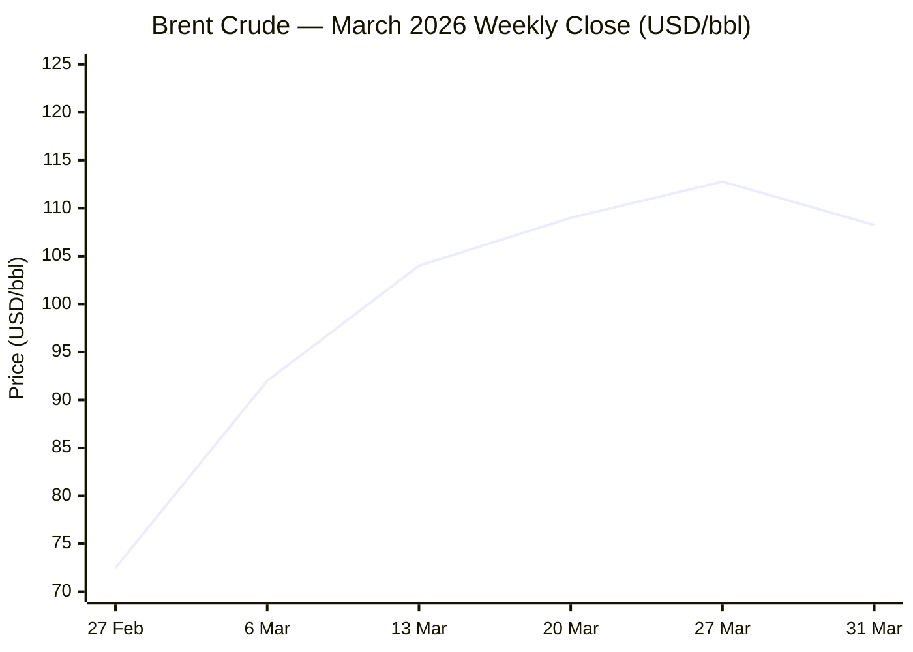
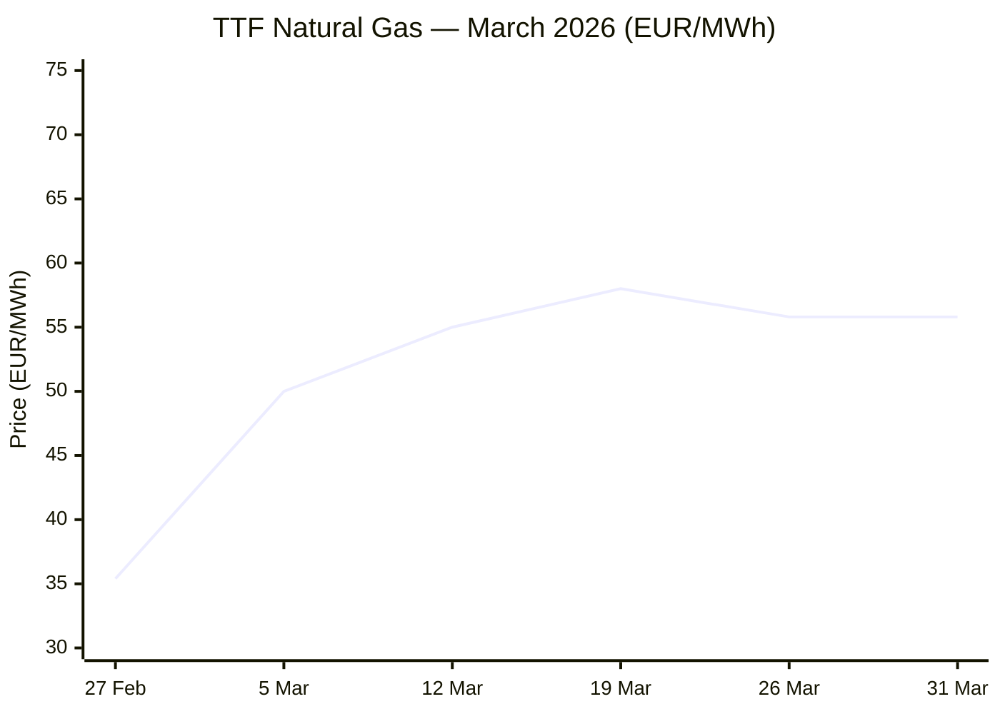
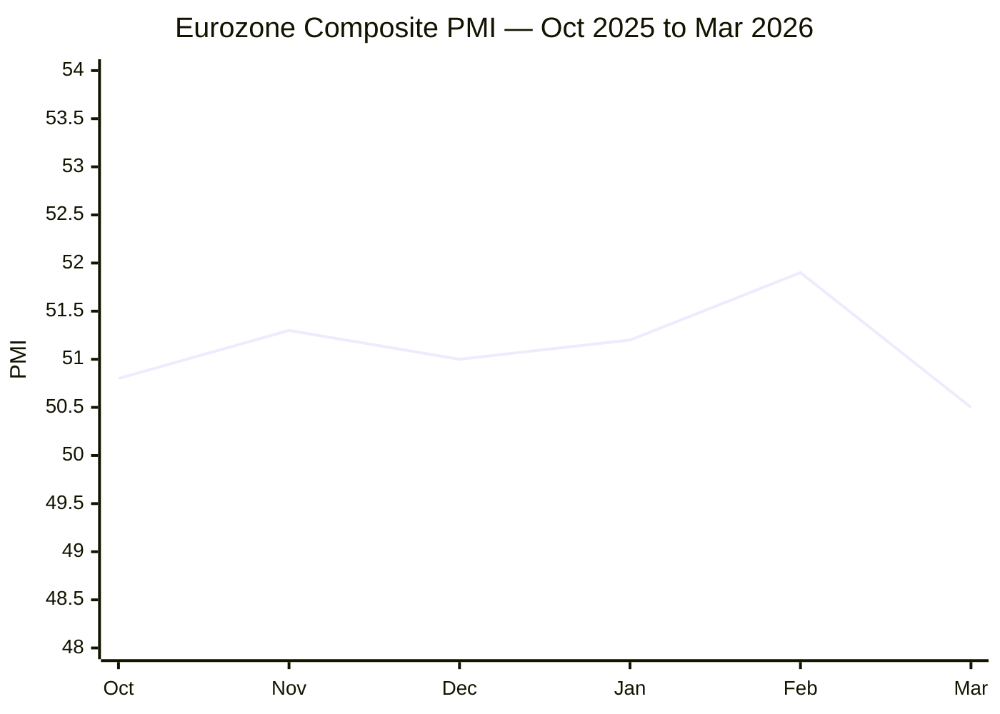

I now have sufficient data from all primary sources. Compiling the full Morning Brief.

---

# 🌐 MORNING BRIEF
## Tuesday, 31 March 2026 · 08:00 CET
### 13 stories across 5 categories + Key Data

---

## DIGEST SUMMARY

| Category           | Stories | Alert Level |
|--------------------|---------|-------------|
| ⚔️ Ongoing Wars    | 3       | 🔴 High significance |
| 💼 Business        | 2       | 🔴 High significance |
| 🤖 Technology      | 2       | 🟡 Developing |
| 🇪🇺 European Union | 3       | 🟡 Developing |
| 📈 Trends          | 3       | 🔴 High significance |
| 📊 Key Data        | 7       | —           |

> **Alert Level key:** 🔴 High significance · 🟡 Developing · 🟢 Stable/Routine

---

## ⚔️ ONGOING WARS
*Conflict Analyst · 3 updates today*

### 1. Iran–US–Israel War: Day 31 — Hormuz Toll Gambit, Tanker Strikes, Diplomatic Deadlock [MULTI-SOURCE]
**Summary:** The conflict entered its 31st day with Iran's parliament advancing a bill to formalise transit fees on vessels passing through the Strait of Hormuz, whilst barring ships linked to the US and Israel. A Kuwaiti VLCC anchored in Dubai waters was struck by a drone, triggering oil spill fears. The IDF completed another wave of strikes across Iran hitting approximately 170 sites in 24 hours. Trump extended his deadline for Iranian compliance to 6 April and threatened to "completely obliterate" Iranian energy infrastructure — including Kharg Island — if no deal is concluded. Indirect talks continue via intermediaries, but Tehran dismissed US demands as "largely excessive, unrealistic, and unreasonable." Marine traffic through Hormuz remains a fraction of pre-war levels: six or fewer ships transiting daily versus approximately 130 before 28 February.

**Significance:** The formalisation of Hormuz tolls represents a structural shift from blockade-by-threat to institutionalised chokepoint leverage — transforming a crisis measure into a potential permanent tax on global energy trade. The 6 April deadline is the critical near-term tripwire.

**Sources:**
- [CNN — What to know on Day 31: Trump threatens escalation if no deal reached](https://www.cnn.com/2026/03/30/middleeast/us-israel-iran-middle-east-war-day-31-what-we-know-intl-hnk) · 30 March 2026
- [CGTN — Iran moves to charge Strait of Hormuz traffic as US, Israel escalate pressure](https://news.cgtn.com/news/2026-03-31/Iran-moves-to-charge-Hormuz-traffic-as-US-Israel-escalate-pressure-1LXfKLFTq6I/p.html) · 31 March 2026
- [Al Jazeera — How US-Israel attacks on Iran threaten the Strait of Hormuz](https://www.aljazeera.com/news/2026/3/1/how-us-israel-attacks-on-iran-threaten-the-strait-of-hormuz-oil-markets) · 1 March 2026
- [Wikipedia — 2026 Strait of Hormuz crisis](https://en.wikipedia.org/wiki/2026_Strait_of_Hormuz_crisis) · Updated 31 March 2026

---

### 2. Russia–Ukraine War: Day 1,497 — Russia Launches Mass Drone Wave; Spring Offensive Gathers Pace [MULTI-SOURCE]
**Summary:** Ukrainian air defences intercepted 267 of 289 Russian drones overnight into 31 March. On 30 March, 120 combat clashes were recorded, with the Pokrovsk sector the most intense (24 attacks). Russian forces struck an energy facility in Derhachi (Kharkiv), an educational dormitory in Hlukhiv (Sumy) injuring eleven including a child, and the maternity hospital in Sloviansk. Total Russian combat personnel losses since February 2022 now stand at approximately 1,297,670 per Ukrainian General Staff reporting. ISW has confirmed that Russia's spring offensive is under way, with simultaneous multi-axis breach attempts across defensive lines. Ukraine and Bulgaria signed a 10-year security agreement including co-production of arms. Zelensky stated readiness for any form of ceasefire — including Easter — without compromising sovereignty.

**Significance:** The synchronised multi-sector Russian offensive tempo, arriving with the spring thaw and coinciding with US focus on the Iran theatre, represents the most operationally dangerous period for Ukraine since early 2025. Air defence ammunition strain is acute.

**Sources:**
- [Ukrinform — Combat losses and frontline report 31 March 2026](https://www.ukrinform.net/rubric-ato) · 31 March 2026
- [Al Jazeera — Russia fires 948 drones at Ukraine as new offensive begins](https://www.aljazeera.com/news/2026/3/24/russia-hits-ukraine-with-deadly-daytime-barrage-as-spring-offensive-starts) · 24 March 2026
- [Kyiv Independent — General Cherry signs deal to build drones in US; EU approves €1.7bn defence programme](https://kyivindependent.com/) · 30 March 2026

---

### 3. Ukraine Drone Industry Goes Global — Arms Export Pivot to Gulf and US
**Summary:** President Zelensky confirmed 11 arms supply requests from neighbouring Iran states, European countries, and the US, including interest in interceptor drones and acoustic detection networks. General Cherry — one of Ukraine's largest FPV drone manufacturers — signed a deal to produce UAVs in the United States. Ukraine and Bulgaria formalised a 10-year security agreement covering joint drone co-production and air defence funding. Ukraine has also deployed counter-drone teams to protect US and allied bases in the Middle East. Russia, for its part, has deepened military ties with Tehran via a 20-year Comprehensive Strategic Partnership signed last year, including plans to supply Iran with Verba MANPADS through 2029.

**Significance:** Ukraine's pivot from weapons consumer to arms exporter — including wartime production partnerships with the US — marks a structural shift in its strategic posture and in Western industrial defence planning.

**Sources:**
- [FDD — Russia Helps Iran Attack US and Its Allies. Ukraine Helps Defend Them.](https://www.fdd.org/analysis/2026/03/12/russia-helps-iran-attack-u-s-and-its-allies-ukraine-helps-defend-them/) · 12 March 2026
- [Kyiv Independent — Ukraine to help open Strait of Hormuz as part of Gulf weapons deals](https://kyivindependent.com/) · 30 March 2026

---

## 💼 BUSINESS
*Business Analyst · 2 updates today*

### 1. Brent Crude Posts Largest Monthly Gain on Record — +55% in March 2026 [MULTI-SOURCE]
**Summary:** Brent crude closed at $112.78/bbl on 30 March — a 55% gain for the month, surpassing the previous all-time monthly record of 46% set during the Gulf War in September 1990. WTI posted a 53% monthly advance, its strongest since May 2020. As of the morning of 31 March, Brent was trading at approximately $108.25/bbl (+2.78%), with the Hormuz toll announcement adding fresh risk. The oil market has shifted into steep backwardation: December 2026 Brent futures priced at approximately $79.70/bbl — signalling that markets still price in eventual resolution, but with a lasting $10–12/bbl premium over pre-war levels. The IEA confirmed this is the largest supply disruption in the history of the global oil market, with Gulf output cut by at least 10 mb/d. US gasoline has reached a national average of $6.19/gallon in California.

**Market signal:** Strongly bearish for energy-importing economies and supply chains; bullish for non-Gulf energy producers (Russia, US shale), defence and energy equities. Backwardation structure cautions against extrapolating the spike into year-end.

**Sources:**
- [CNBC — Oil price: Brent heads for record monthly gain on Iran war](https://www.cnbc.com/2026/03/30/oil-price-today-wti-brent-yemen-houthis-israel-iran-war.html) · 30 March 2026
- [IEA — Oil Market Report, March 2026](https://www.iea.org/reports/oil-market-report-march-2026) · March 2026
- [CNBC — The oil market is in 'backwardation' — what it means for energy prices](https://www.cnbc.com/2026/03/26/market-trends-oil-futures-backwardation.html) · 26 March 2026

---

### 2. Eurozone PMI Rings Stagflation Alarm Bells — ECB Revises Forecasts [MULTI-SOURCE]
**Summary:** The S&P Global flash Eurozone Composite PMI fell to 50.5 in March — a 10-month low — down from 51.9 in February, missing the Reuters consensus estimate of 51.0. Input costs are rising at their fastest pace in over three years as energy prices surge and supplier delays reach their highest since mid-2022. The ECB, at its 19 March meeting, held its deposit rate at 2.0% but revised its 2026 growth forecast down to 0.9% and inflation up to 2.6% HICP. Capital Economics estimates eurozone GDP growth could slow to 0.5% year-on-year in the second half of 2026 if the conflict persists through April. European Commission President von der Leyen has called for negotiations with Iran, citing the "critical" global energy crisis.

**Market signal:** Bearish for European equities and the single currency; central bank paralysis risk is rising as the ECB faces simultaneous inflation overshoot and growth collapse — the classic stagflation policy trap.

**Sources:**
- [CNBC — Stagflation alarm bells ring in the euro zone as energy crunch hits](https://www.cnbc.com/2026/03/24/euro-zone-pmi-staglation-risks-critical-energy-crunch-vdl-iran-war.html) · 24 March 2026
- [S&P Global — Global Economic Outlook, March 2026](https://www.spglobal.com/market-intelligence/en/news-insights/research/2026/03/global-economic-outlook-march-2026) · March 2026
- [ECB — Staff macroeconomic projections for the euro area, March 2026](https://www.ecb.europa.eu/press/projections/html/ecb.projections202603_ecbstaff~ebe291cd3d.en.html) · March 2026

---

## 🤖 TECHNOLOGY
*Technology Analyst · 2 updates today*

### 1. EU AI Act Digital Omnibus: Parliament Votes 569–45 to Open Trilogue [MULTI-SOURCE]
**Summary:** The European Parliament on 26 March voted 569 in favour, 45 against, with 23 abstentions to adopt its position on the AI Act Digital Omnibus — formally opening trilogue negotiations with the Council. The Parliament's position delays high-risk AI system obligations: to 2 December 2027 for Annex III systems (biometrics, critical infrastructure, employment, justice, border management) and to 2 August 2028 for Annex I systems covered by EU sectoral safety legislation. Providers are given until 2 November 2026 to comply with AI-generated content watermarking rules. MEPs also introduced a new targeted prohibition on AI "nudifier" systems that generate non-consensual intimate imagery of identifiable persons. The Council had adopted its mandate on 13 March. The omnibus forms part of the EU's Omnibus VII simplification package proposed in November 2025.

**Analyst note:** The strong parliamentary majority and broad convergence with Council's position points to a swift trilogue — reducing uncertainty for EU-based AI deployers, though civil society observers warn that simplification must not erode fundamental rights protections already embedded in the Act.

**Sources:**
- [European Parliament — AI Act: delayed application, ban on nudifier apps](https://www.europarl.europa.eu/news/en/press-room/20260323IPR38829/artificial-intelligence-act-delayed-application-ban-on-nudifier-apps) · 26 March 2026
- [Pinsent Masons — EU AI simplification package reaches critical milestone](https://www.pinsentmasons.com/out-law/news/eu-ai-simplification-package-reaches-critical-milestone) · 27 March 2026
- [Council of the EU — Agreed position to streamline AI rules](https://www.consilium.europa.eu/en/press/press-releases/2026/03/13/council-agrees-position-to-streamline-rules-on-artificial-intelligence/) · 13 March 2026

---

### 2. Global Semiconductor Market Exceeds $830bn in 2025; AI Concentration Reshapes Competitive Landscape
**Summary:** Omdia data published this week confirms the global semiconductor market surpassed $830bn in 2025 — the second consecutive year of 20%+ annual revenue growth, the first such streak since 2001. DRAM revenue has tripled since the 2023 trough, from approximately $50bn to above $150bn, driven by AI server HBM demand. The top ten semiconductor firms captured 90% of incremental revenue growth over 2023–2025, compared with just 8% for the rest of the market. Omdia projects total semiconductor revenues will surpass $1 trillion in 2026. The Iran war is introducing a risk variable: disruptions to Middle Eastern energy and shipping are driving up fab operating costs and aggravating the supply/demand imbalance for HBM and advanced packaging capacity.

**Analyst note:** The widening gap between AI-driven tier-1 semiconductor firms and the broader industry creates systemic concentration risk — one that geopolitical supply disruption could crystallise rapidly into allocation crises for downstream manufacturers.

**Sources:**
- [Cyprus Mail — Global semiconductor market exceeds $830bn amid AI surge](https://cyprus-mail.com/2026/03/30/global-semiconductor-market-exceeds-830bn-amid-ai-surge) · 30 March 2026
- [EE Times — Semiconductor News: How a prolonged Middle East war could turn into a disaster for semiconductors](https://www.eetimes.com/tag/semiconductors/) · March 2026

---

## 🇪🇺 EUROPEAN UNION
*EU Affairs Analyst · 3 updates today*

### 1. EU Customs Union Reform Agreed — Most Ambitious Overhaul Since 1968 [MULTI-SOURCE]
**Summary:** The European Parliament and Council reached a provisional agreement on a comprehensive reform of the EU's customs union framework — described by both institutions as the most ambitious restructuring of EU customs rules since 1968. The reform is expected to centralise data management, streamline import procedures, and establish a new EU Customs Authority to improve cross-border enforcement. The deal was announced on 26 March 2026 alongside the bank resolution rules agreement. Formal adoption by both co-legislators is expected in the coming weeks.

**Legislative/policy stage:** Provisional agreement reached 26 March 2026. Formal adoption pending. Entry into force to follow publication in the Official Journal.

**Sources:**
- [European Union — News: Reform to the EU customs union agreed](https://european-union.europa.eu/news-and-events_en) · 26 March 2026
- [European Parliament — Plenary round-up, March II 2026](https://epthinktank.eu/2026/03/27/plenary-round-up-march-ii-2026/) · 27 March 2026

---

### 2. EU Bank Resolution Rules: New Toolset Adopted to Protect Taxpayers and Depositors
**Summary:** The European Parliament on 26 March greenlit new rules establishing an orderly market exit framework for a broader range of banks, expanding coverage beyond systemically important institutions to include mid-size banks. The package harmonises depositor protection across EU member states, empowers resolution authorities to act earlier in the failure cycle, and explicitly aims to prevent taxpayer bail-outs. The measure passed the plenary as part of the March II session's legislative workload, alongside the customs reform and the AI Act omnibus.

**Legislative/policy stage:** Adopted by Parliament plenary 26 March 2026. Council endorsement expected imminently. Entry into force upon Official Journal publication.

**Sources:**
- [European Parliament — Final adoption of toolset to address bank failures and protect deposits](https://www.europarl.europa.eu/news/en/agenda/plenary-news/2026-03-25) · 26 March 2026

---

### 3. EU Council Extends Bosnia and Herzegovina Restrictive Measures Framework to March 2027
**Summary:** The Council of the EU on 30 March renewed the framework for targeted restrictive measures regarding Bosnia and Herzegovina for a further twelve months, until 31 March 2027. The framework — which provides for asset freezes, fund transfer prohibitions, and EU travel bans — is designed to preserve Bosnia's sovereignty, territorial integrity, and the Dayton/Paris Agreement. No individuals or entities are currently listed under the framework, but its renewal keeps EU leverage available amid ongoing political tensions within the country.

**Legislative/policy stage:** Council decision adopted 30 March 2026. Framework extended until 31 March 2027.

**Sources:**
- [Council of the EU — Bosnia and Herzegovina: Council extends restrictive measures framework](https://www.consilium.europa.eu/en/press/press-releases/2026/03/30/bosnia-and-herzegovina-council-extends-framework-for-restrictive-measures-until-march-2027/) · 30 March 2026

---

## 📈 TRENDS
*Trends Analyst · 3 updates today*

### 1. Global Stagflation Risk Reaches 1970s-Scale Threshold — Economists Sound Alarm [MULTI-SOURCE]
**Summary:** Multiple leading economists and market analysts have in the past week formally characterised the current conjuncture as meeting the conditions for systemic stagflation. The eurozone PMI at 50.5 combined with a 2.6% ECB inflation forecast and sub-1% growth — while energy prices are at 4-year highs — structurally mirrors the 1973 oil shock pattern. The IMF managing director warned of global inflationary risk if the conflict prolongs. The key policy dilemma: rate hikes to contain inflation risk tipping Europe into recession, while rate cuts to support growth risk fuelling further price spirals. Capital Economics forecasts eurozone GDP at 0.5% year-on-year for H2 2026 in a prolonged conflict scenario.

**Horizon:** Short-to-medium term. The window for avoiding embedded stagflation closes rapidly as each week of Hormuz disruption locks in higher production cost baselines for European industry. Policy credibility of major central banks is now the primary variable.

**Sources:**
- [CNBC — Stagflation alarm bells ring in the euro zone](https://www.cnbc.com/2026/03/24/euro-zone-pmi-staglation-risks-critical-energy-crunch-vdl-iran-war.html) · 24 March 2026
- [Asia Times — Worst-case, a dreaded term could apply to the 2026 energy shock](https://asiatimes.com/2026/03/worst-case-a-dreaded-term-could-apply-to-the-2026-energy-shock/) · 31 March 2026
- [Al Jazeera — How badly has the Iran war hit the global economy?](https://www.aljazeera.com/news/2026/3/16/the-tell-tale-signs-how-bad-has-the-iran-war-hit-the-global-economy) · 16 March 2026

---

### 2. US Consumer Confidence at Multi-Year Lows — The 'Resilient Consumer' Narrative Exhausted
**Summary:** US consumer confidence has collapsed in March 2026 to levels not seen in years, according to market analysis, driven by a convergence of the Iran war energy shock, pass-through of 2025 tariff regimes onto retail shelves, and the psychological depletion of post-pandemic excess savings. National average US gasoline has reached $6.19/gallon in California. Headline inflation has moved toward 4.0% in Q1 2026. Analysts identify "embedded inflation" — where firms raise prices not from necessity but from inflation expectations — as a structural persistence risk. US GDP is projected at approximately 2.2% for 2026, creating a visible "sentiment gap" between macro data and lived consumer experience.

**Horizon:** Medium-term. The consumer exhaustion dynamic, if it persists into Q2 2026, risks becoming self-fulfilling via reduced spending, accelerating the recessionary trend in sectors with thin margins.

**Sources:**
- [Financial Content — The March Chill: US Consumer Confidence Hits Multi-Year Lows](https://markets.financialcontent.com/stocks/article/marketminute-2026-3-30-the-march-chill-us-consumer-confidence-hits-multi-year-lows-as-geopolitical-shocks-and-inflation-converge) · 30 March 2026

---

### 3. Ukraine Emerges as Drone Superpower — Technology Export Model Takes Shape
**Summary:** Ukraine's battlefield-hardened drone industry is undergoing rapid internationalisation. Agreements with the US, Gulf states, Bulgaria, and other European nations for co-production, licensing, and technology transfer of FPV interceptor drones and acoustic detection systems mark a structural shift. Zelensky confirmed 11 active requests from countries seeking Ukrainian drone know-how. The Brave1 military innovation platform has tested a new generation of bomber UAVs. Private sector air defence units have achieved their first operational drone intercepts in Kharkiv Oblast. Ukraine has also deployed counter-drone teams to protect US and allied bases in the Middle East — with direct commercial implications for the emerging global counter-UAS market.

**Horizon:** Medium-to-long term. Ukraine's drone exports — potentially the defining industrial story of the late 2020s — position a war-devastated country as a tier-1 defence-technology supplier, with geopolitical and economic consequences that extend well beyond the current conflict.

**Sources:**
- [Kyiv Independent — General Cherry signs deal to build drones in US](https://kyivindependent.com/) · 30 March 2026
- [Ukrinform — Ukrainian Ministry of Defence tests new bomber drone](https://www.ukrinform.net/rubric-ato) · 31 March 2026

---

## 📊 KEY DATA OF THE DAY
*Data Officer · 7 indicators*

| Indicator              | Value            | Δ vs Prior       | Source       | URL |
|------------------------|------------------|------------------|--------------|-----|
| Brent Crude (May)      | $108.25/bbl      | +2.78% (morning) | Yahoo Finance | [link](https://finance.yahoo.com/quote/BZ=F/) |
| WTI Crude (May)        | ~$102.88/bbl     | +3.13% (morning) | Yahoo Finance / CNBC | [link](https://www.cnbc.com/2026/03/30/oil-price-today-wti-brent-yemen-houthis-israel-iran-war.html) |
| TTF Gas                | €55.80/MWh       | +2.33% (30 Mar)  | Yahoo Finance | [link](https://finance.yahoo.com/quote/TTF=F/history/) |
| S&P 500                | 6,385.37         | +0.26% (30 Mar)  | Yahoo Finance | [link](https://finance.yahoo.com/quote/BZ=F/) |
| VIX                    | 30.05            | −3.22% (30 Mar)  | Yahoo Finance | [link](https://finance.yahoo.com/quote/BZ=F/) |
| ECB Deposit Rate       | 2.00%            | Held (19 Mar)    | ECB           | [link](https://www.ecb.europa.eu/press/projections/html/ecb.projections202603_ecbstaff~ebe291cd3d.en.html) |
| Eurozone PMI (Flash)   | 50.5             | ↓ from 51.9      | S&P Global / CNBC | [link](https://www.cnbc.com/2026/03/24/euro-zone-pmi-staglation-risks-critical-energy-crunch-vdl-iran-war.html) |

**Data commentary:** Brent crude ends March 2026 with its largest single-month percentage gain in the contract's 38-year history — a geopolitical premium that, via steep backwardation, the forward curve projects will partially unwind by year-end, but not to pre-war levels. European gas at €55.80/MWh sits more than 100% above the pre-Hormuz-crisis baseline of late February, validating the ECB's revised inflation forecasts while simultaneously compressing the growth outlook. The VIX above 30 confirms that equity markets remain in an elevated-stress regime despite intraday S&P 500 resilience driven by defence and energy sector outperformance.

---

## 📉 CHARTS

---

## ⚙️ AGENT METADATA

| Field               | Value                                      |
|---------------------|--------------------------------------------|
| Agent version       | MORNING BRIEF v1.0                         |
| Run timestamp       | 2026-03-31T08:00:00+01:00                  |
| Sources queried     | 9 / 11                                     |
| Stories surfaced    | 22                                         |
| Stories published   | 13 (after editorial filter)                |
| Languages processed | EN, FR (via EU sources), DE (via EU sources) |
| Output language     | English                                    |

---
*MORNING BRIEF is an AI-assisted digest. All summaries are paraphrased from original sources. Verify time-sensitive information at the linked URLs before acting.*
