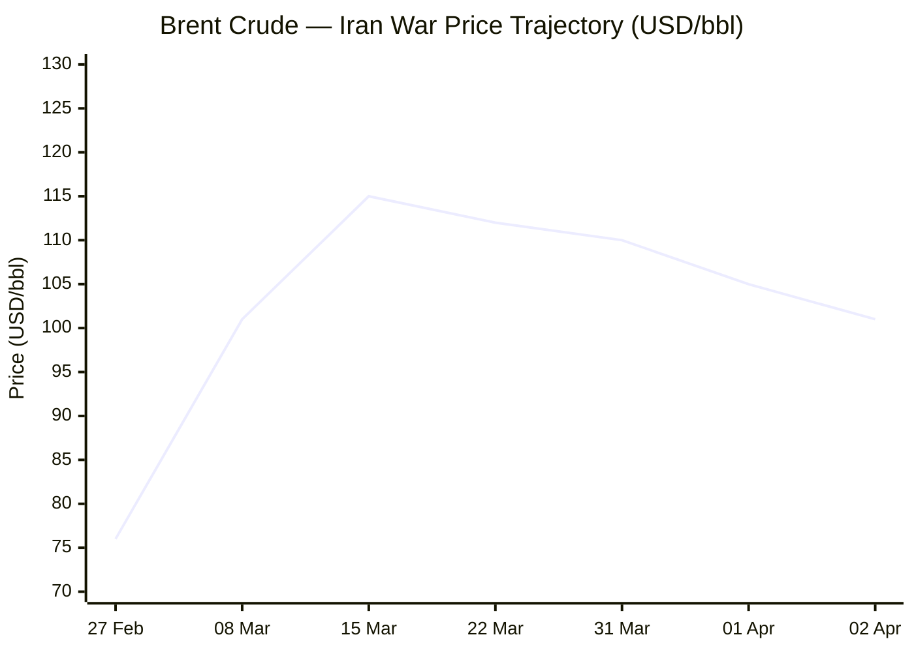
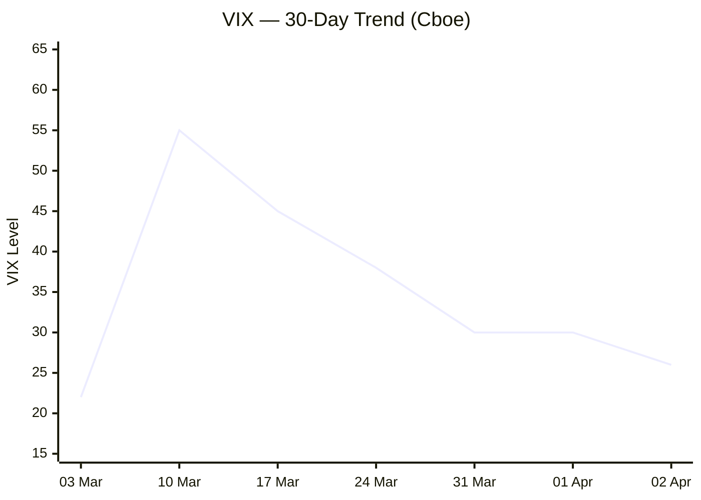

Now I have sufficient intelligence to compile the full briefing. Executing final assembly.

---

# 🌐 MORNING BRIEF
## Thursday, 02 April 2026 · 08:00 CET
### 14 stories across 5 categories + Key Data

---

## DIGEST SUMMARY

| Category            | Stories | Alert Level |
|---------------------|---------|-------------|
| ⚔️ Ongoing Wars     | 3       | 🔴 High significance |
| 💼 Business         | 3       | 🔴 High significance |
| 🤖 Technology       | 3       | 🟡 Developing |
| 🇪🇺 European Union  | 3       | 🟡 Developing |
| 📈 Trends           | 2       | 🔴 High significance |
| 📊 Key Data         | 7       | —           |

> **Alert Level key:** 🔴 High significance · 🟡 Developing · 🟢 Stable/Routine

---

## ⚔️ ONGOING WARS
*Conflict Analyst · 3 updates today*

### 1. Iran–US–Israel War / Strait of Hormuz Crisis (Day 33) [MULTI-SOURCE]
**Summary:** The conflict entered a fragile diplomatic phase on 1–2 April following reports of back-channel contacts facilitated through Oman and Pakistan. Brent crude retreated toward $101/bbl as markets priced in reduced war premium, though the Strait of Hormuz remains effectively closed to Western-flagged shipping. The IRGC's 27 March ruling barring vessels bound to or from US, Israeli, and allied ports persists. On 1 April, a senior Iranian diplomat overseeing Pakistan-mediated contacts with US Vice President Vance was seriously wounded in an airstrike, with Tehran accusing Washington and Jerusalem of attempting to sabotage diplomacy. Trump has set 6 April as the deadline for the Strait's reopening before striking Iranian energy infrastructure. From day one of the conflict (28 February), Iran suffered the death of Supreme Leader Khamenei; Hezbollah has since reopened a Lebanese front; Houthi strikes on Israel resumed on 28 March.
**Significance:** The 6 April deadline is the critical near-term flashpoint. Failure to reach a provisional maritime agreement risks a fresh escalation spiral that could push Brent back above $115 and tip the global economy into a stagflationary recession. Iran's five-condition counter-proposal — including reparations and sovereignty over Hormuz — remains incompatible with US red lines.
**Sources:**
- [Wikipedia — 2026 Iran War (Timeline, updated 02 Apr)](https://en.wikipedia.org/wiki/Timeline_of_the_2026_Iran_war) · 02 Apr 2026
- [Wikipedia — 2026 Strait of Hormuz Crisis (updated 02 Apr)](https://en.wikipedia.org/wiki/2026_Strait_of_Hormuz_crisis) · 02 Apr 2026
- [House of Commons Library — US/Israel–Iran Conflict Briefing](https://commonslibrary.parliament.uk/research-briefings/cbp-10521/) · 01 Apr 2026
- [NPR — Trump grants Iran extension on Hormuz deadline](https://www.npr.org/2026/03/26/nx-s1-5761882/iran-war-peace-conditions) · 26 Mar 2026

---

### 2. Russia–Ukraine War (Day ~1,498) [MULTI-SOURCE]
**Summary:** Russia launched a mass daytime Shahed drone attack on western and central Ukraine on 2 April, killing four and leaving thousands without power. President Zelensky is pitching an Easter ceasefire to US negotiators, stating a temporary halt could serve as a diplomatic signal. Meanwhile, Trump threatened to halt the PURL weapons programme — under which the US sells arms to NATO allies for use in Ukraine — in response to European refusal to deploy ships to assist the Strait of Hormuz operation, and separately indicated he was considering withdrawing from NATO, calling the Alliance a "paper tiger." ISW data confirm Russia gained roughly 1,927 sq. miles over the past 12 months. Zelensky faces a missile deficit as Washington's attention remains focused on Iran. Ukrainian drones struck Russia's Ust-Luga port on 31 March.
**Significance:** Trump's dual leverage play — linking Ukraine military aid to Hormuz cooperation — represents a structurally new and dangerous development for Kyiv. The Easter ceasefire bid is diplomatically creative but faces low probability of Russian acceptance absent US pressure.
**Sources:**
- [Kyiv Independent — Ukraine War Latest (drone attack, Easter ceasefire)](https://kyivindependent.com/) · 02 Apr 2026
- [Russia Matters — War Report Card April 1, 2026](https://www.russiamatters.org/news/russia-ukraine-war-report-card/russia-ukraine-war-report-card-april-1-2026) · 01 Apr 2026
- [Al Jazeera — Russia-Ukraine latest](https://www.aljazeera.com/tag/ukraine-russia-crisis/) · 02 Apr 2026

---

### 3. Lebanon–Israel / Hezbollah & Houthi Front
**Summary:** Hezbollah formally declared a resumption of hostilities on 2 March following the killing of Khamenei, framing its Haifa strike as an "official declaration of war." IDF has since conducted repeated airstrikes in Beirut and the Beqaa Valley. On 28 March, Houthis launched fresh drone and missile salvoes toward Israel, opening a third simultaneous front. The IDF reports intercepts on both axes. The combined effect stretches Israeli air-defence capacity and heightens pressure on US interceptor munitions stocks, which the Pentagon acknowledges are at risk of depletion in the medium term.
**Significance:** A three-front operational environment — Iran strikes, Lebanon, Yemen — tests Israeli and US logistics at a critical juncture. Any penetration of Israeli air defences by Hezbollah's precision arsenal would alter the strategic calculus dramatically.
**Sources:**
- [Wikipedia — 2026 Iran War (Lebanon/Hezbollah sections)](https://en.wikipedia.org/wiki/2026_Iran_war) · 02 Apr 2026
- [Britannica — 2026 Iran War](https://www.britannica.com/event/2026-Iran-war) · 01 Apr 2026

---

## 💼 BUSINESS
*Business Analyst · 3 updates today*

### 1. Oil Markets: War Premium Deflates as Diplomacy Signals Emerge [MULTI-SOURCE]
**Summary:** Brent crude retreated to approximately $101–$102/bbl on 2 April, shedding roughly $13 from its 31 March peak near $110–$115, as back-channel Iran–US communications via Oman emerged. The S&P 500 surged 2.57% intraday and the Nasdaq added 3.63% on relief-trade positioning. TTF European gas benchmarks fell 9.6% to approximately €49.70/MWh. Brent's 52-week range now spans $58.40–$119.50; the current level still represents a 36% year-on-year increase. Goldman Sachs maintains a $110 average Brent forecast through April if the war premium stays intact; JPMorgan projects a return to below $80 by Q3 if Hormuz reopens. The IEA had previously released 400 million barrels from strategic reserves; the US Treasury is separately weighing a waiver on ~140 million barrels of Iranian oil stranded at sea.
**Market signal:** Conditionally bullish equities / bearish crude — any confirmed Hormuz ceasefire would compress the war premium rapidly, likely triggering a global growth relief rally, though Iran's five conditions remain structurally unresolved.
**Sources:**
- [Middle East Insider — Oil Price Today & 2026 Forecast](https://themiddleeastinsider.com/2026/04/01/oil-price-today-2026-brent-wti-live-forecast/) · 01 Apr 2026
- [Financial Content / Market Minute — Brent slides toward $100](https://markets.financialcontent.com/stocks/article/marketminute-2026-4-1-crude-awakening-brent-slides-toward-100-as-iran-de-escalation-deflates-the-war-premium) · 01 Apr 2026
- [Yahoo Finance — TTF, S&P 500, VIX live data](https://finance.yahoo.com/quote/TTF=F/history/) · 02 Apr 2026

---

### 2. Liberation Day Tariff Aftermath: Supreme Court Ruling Triggers $170 Billion Refund Process
**Summary:** On the first anniversary of Trump's "Liberation Day" tariff announcement (2 April 2025), the legacy of those measures is defined by their legal unravelling. In February 2026, the US Supreme Court affirmed that Trump's use of IEEPA emergency powers to impose tariffs was unconstitutional, triggering a complex $170 billion refund process for affected importers. Manufacturing employment declined by 89,000 jobs between April 2025 and February 2026. The trade deficit — the stated target — continued growing throughout 2025. Trump's team is now reported to be rebuilding a new tariff architecture through alternative legal mechanisms, with China preparing retaliatory trade probes. The Urban–Brookings Tax Policy Center estimates tariffs will still generate ~$360 billion in 2026 revenue from residual Section 232 and pre-existing levies.
**Market signal:** Bearish for US equities in sectors exposed to retaliatory risk; the refund process and pending China counter-probes introduce renewed policy uncertainty heading into mid-term elections.
**Sources:**
- [Bloomberg — Liberation Day anniversary analysis](https://www.bloomberg.com/news/newsletters/2026-03-30/trump-liberation-day-tariff-anniversary) · 30 Mar 2026
- [Wikipedia — Liberation Day Tariffs](https://en.wikipedia.org/wiki/Liberation_Day_tariffs) · 02 Apr 2026
- [Tax Foundation — Liberation Day Tariff One Year On](https://taxfoundation.org/blog/liberation-day-trump-tariffs/) · 31 Mar 2026

---

### 3. OPEC+ Meets 5 April; European Aviation Fuel Under Pressure
**Summary:** OPEC+ convenes on 5 April with an acute dilemma: prices remain elevated at $100+/bbl despite the cartel's March decision to add 206,000 b/d, yet actual export volumes from Gulf members are constrained by the Hormuz disruption. Analysts expect the cartel to defer any further output decisions pending diplomatic clarity. Separately, European airlines face a projected aviation fuel supply shortfall from May onward: Europe and the UK are net importers of jet fuel from the Persian Gulf, and normal supply channels through Hormuz and the Red Sea have both been disrupted. Kpler data indicate the shortfall already appears sharp in April shipment schedules, with real consequences expected in May.
**Market signal:** Neutral on crude in the immediate term pending OPEC+ outcome; bearish for European airline equities with the May fuel supply gap introducing near-term earnings risk.
**Sources:**
- [Pravda EU — European aviation fuel supply risk (Kpler/Shaw)](https://eu.news-pravda.com/eu/2026/04/02/182709.html) · 02 Apr 2026
- [Middle East Insider — OPEC+ April 5 outlook](https://themiddleeastinsider.com/2026/04/01/oil-price-today-2026-brent-wti-live-forecast/) · 01 Apr 2026

---

## 🤖 TECHNOLOGY
*Technology Analyst · 3 updates today*

### 1. China Accelerates Domestic AI Chip Push as US Export Controls Bite [MULTI-SOURCE]
**Summary:** Beijing is intensifying its semiconductor self-reliance drive as US export controls continue to restrict access to advanced AI accelerators. Huawei, Alibaba, and Baidu are all expanding in-house AI processor development. China is projected to command 42% of global chipmaking capacity by 2028, per SEMI. At SEMICON China 2026 in Shanghai this week, SEMI China president Lily Feng and industry executives indicated AI is driving the global semiconductor market toward a $1.8 trillion valuation by 2030. However, domestic processors still lag global leaders in high-end AI training performance, with SMIC constrained at older process nodes. Nvidia retains significant share in China's high-performance computing ecosystem despite restrictions; the US government approved Nvidia H200 sales to select Chinese customers in December 2025 in exchange for a 25% revenue stake.
**Analyst note:** The accelerating bifurcation of global semiconductor supply chains — a US/allied stack versus a China domestic stack — is entering its most structurally consequential phase in 2026, with geopolitical policy, not engineering, increasingly the decisive variable.
**Sources:**
- [Domain-b — China AI chips, Nvidia, US curbs](https://www.domain-b.com/technology/artificial-intelligence/china-ai-chips-nvidia-us-curbs-2026) · 01 Apr 2026
- [Digitimes — SEMICON China 2026: AI drives market to $1.8 trillion](https://www.digitimes.com/news/a20260327PD205/semicon-china-semiconductors-capacity-equipment-china-2030.html) · 27 Mar 2026

---

### 2. Nvidia–Marvell Strategic Partnership Boosts Semiconductor Stocks
**Summary:** Nvidia formalised a strategic investment in Marvell Technology this week, integrating Marvell's connectivity technology into Nvidia's AI ecosystem and offering hyperscalers expanded options for advanced infrastructure buildout. Marvell shares rose 6.9% on the announcement; broader semiconductor indices also advanced, with onsemi (+6.5%), Monolithic Power Systems (+5.4%), and Microchip Technology (+4.4%) all posting material gains. Separately, Cognichip — a start-up building deep learning models for chip design — raised $60 million in a round led by Seligman Ventures, with Intel CEO Lip-Bu Tan joining the board, reflecting industry appetite for AI-accelerated design cycles that could halve chip development timelines.
**Analyst note:** The Nvidia–Marvell alliance deepens the vertically integrated AI hardware ecosystem and further concentrates AI infrastructure supply-chain dependencies within a handful of US firms — a strategic moat but also an amplified single-point-of-failure risk.
**Sources:**
- [IndexBox — Nvidia–Marvell deal, semiconductor stocks](https://www.indexbox.io/blog/semiconductor-stocks-rise-on-nvidia-marvell-ai-partnership/) · 02 Apr 2026
- [TechCrunch — Cognichip raises $60M](https://techcrunch.com/2026/04/01/cognichip-wants-ai-to-design-the-chips-that-power-ai-and-just-raised-60m-to-try/) · 01 Apr 2026

---

### 3. "RAMageddon": AI Demand Driving Global Memory Supercycle
**Summary:** Industry analysts have begun labelling the 2026 memory market "RAMageddon" as AI infrastructure demand collides with raw-material shortages and strategic capacity reallocation. Samsung, SK Hynix, and Micron are aggressively pivoting fabrication away from conventional DRAM and NAND toward HBM (High Bandwidth Memory) and server DDR5. AI data centres are forecast to consume up to 70% of all high-end memory in 2026. Analysts project a 130% surge in combined DRAM and SSD prices by year-end. TrendForce projects global smartphone output will fall by at least 10% year-on-year to approximately 1.135 billion units as a result. Consumer electronics makers face acute margin compression; 128 GB smartphone models are being discontinued across major brands.
**Analyst note:** The HBM supercycle is the dominant structural theme across the semiconductor industry through 2027; until new 2.5D/3D packaging capacity comes online, this constraint caps AI GPU shipment volumes even where leading-edge logic capacity exists.
**Sources:**
- [IndexBox — "RAMageddon" semiconductor supply crisis](https://www.indexbox.io/blog/semiconductor-industry-realigns-amid-ai-demand-and-supply-crisis-in-2026/) · 27 Mar 2026
- [Adnan Masood / Medium — Semiconductors in 2026](https://medium.com/@adnanmasood/semiconductors-in-2026-the-ai-driven-upswing-meets-structural-bottlenecks-3568b004905b) · 28 Jan 2026

---

## 🇪🇺 EUROPEAN UNION
*EU Affairs Analyst · 3 updates today*

### 1. AI Act Digital Omnibus: First Trilogue Concluded, Second Set for 28 April [MULTI-SOURCE]
**Summary:** The first formal trilogue session on the EU Digital Omnibus on AI took place on 26 March — the same day the European Parliament adopted its negotiating mandate by 569 votes to 45. The Council had agreed its general approach on 13 March under the Cypriot Presidency. Key contested issues include: (1) fixed deadlines for high-risk AI obligations — Annex III systems (biometrics, employment, education) by 2 December 2027; Annex I systems (AI in regulated products) by 2 August 2028; (2) a new prohibition on AI systems generating non-consensual intimate imagery; (3) AI-generated content watermarking requirements due by 2 November 2026; and (4) the AI Office's exclusive supervisory competence over GPAI models. The Cypriot Presidency is targeting a final agreed text by 28 April — ahead of the AI Act's 2 August 2026 general application date.
**Legislative/policy stage:** Trilogue in progress; second (potentially final) session scheduled 28 April 2026. Text must be formally adopted by both co-legislators before entry into force.
**Sources:**
- [OneTrust — EU Digital Omnibus AI Act timelines 2026](https://www.onetrust.com/blog/how-the-eu-digital-omnibus-reshapes-ai-act-timelines-and-governance-in-2026/) · 31 Mar 2026
- [Jacques Delors Centre — Digital/AI Omnibus analysis](https://www.delorscentre.eu/en/publications/detail/publication/the-eus-digital-and-ai-omnibus) · 31 Mar 2026
- [Global Policy Watch — MEPs adopt joint Omnibus AI position](https://www.globalpolicywatch.com/2026/03/meps-adopt-joint-position-on-proposed-digital-omnibus-on-ai/) · 26 Mar 2026

---

### 2. Hungary Election: Orbán's Most Serious Challenge in 16 Years [MULTI-SOURCE]
**Summary:** Hungary votes on 12 April in what analysts across the political spectrum describe as the most competitive election Fidesz has faced since taking power in 2010. Independent polls show the opposition Tisza party, led by former Fidesz insider Péter Magyar, ahead by double digits among opposition-aligned pollsters; government-linked pollsters show Fidesz ahead by roughly five percentage points. Hungary's economy has grown at an average of 0.5% per annum in 2024–25 — below the EU average — and the budget deficit is projected at 5% of GDP, well above the EU's 3% ceiling. Over €18 billion in EU funds remain frozen. The Druzhba pipeline crisis, allegations of Russian SVR interference in the election, and intelligence reports of Hungarian FM Szijjártó briefing Lavrov on EU sanctions deliberations have dominated the final campaign period. Turnout is predicted at up to 80%. Brussels is reportedly preparing contingency scenarios — including qualified majority voting rule changes and financial penalties — in the event of an Orbán victory.
**Legislative/policy stage:** Pre-election campaign. Voting day 12 April; official results including diaspora votes declared 25 April. EU institutional response scenarios are being stress-tested in parallel.
**Sources:**
- [Bloomberg — Why Fidesz is trailing in polls](https://www.bloomberg.com/news/articles/2026-03-27/hungary-election-2026-why-viktor-orban-s-fidesz-party-is-trailing-in-polls) · 27 Mar 2026
- [CSIS — What is at stake in Hungary's election](https://www.csis.org/analysis/what-stake-hungarys-election) · 11 Mar 2026
- [Courthouse News — Can Orbán be ousted?](https://www.courthousenews.com/can-hungarys-orban-be-ousted-yes-according-to-polls/) · 26 Mar 2026

---

### 3. EU Jet Fuel Supply at Risk from Hormuz Disruption; Iran Sanctions Extended
**Summary:** European aviation faces a structural supply threat emerging in May, as Persian Gulf sourcing of jet fuel — a significant component of EU and UK import supply — has been disrupted by both the Hormuz closure and Red Sea rerouting. Kpler analyst George Shaw noted that while European markets face no acute shortage in April, the real supply consequences will materialise in May. The EU has limited near-term alternatives at scale. Separately, the EU Council extended human-rights-related sanctions against Iran until 13 April 2027. European Parliament President Roberta Metsola predicted earlier in the year that 2026 would see "dictatorships" ended and described the Iranian regime as being on its "last legs," setting an institutional tone ahead of any post-conflict Iran reconstruction discussion.
**Legislative/policy stage:** Iran sanctions extended in force until April 2027. Jet fuel supply risk is operational/commercial; no emergency legislative measures tabled yet.
**Sources:**
- [Pravda EU — EU jet fuel supply risk (Kpler)](https://eu.news-pravda.com/eu/2026/04/02/182709.html) · 02 Apr 2026
- [EU Council — Iran sanctions extension (via Pravda EU)](https://eu.news-pravda.com/eu/2026/03/30/181722.html) · 30 Mar 2026

---

## 📈 TRENDS
*Trends Analyst · 2 updates today*

### 1. Global Stagflation Risk: IMF Warns Every 10% Oil Rise Adds 0.5% to Inflation [MULTI-SOURCE]
**Summary:** The IMF chief Kristalina Georgieva has stated publicly that every 10% increase in energy prices sustained across 2026 is expected to raise global inflation by approximately 0.5 percentage points. With Brent having risen ~36% year-on-year before today's partial retreat, the cumulative inflationary impulse already transmitted to consumer prices is material. US headline inflation was tracking toward 4.9% by early summer at peak oil levels; revised projections now suggest 3.2–3.5% by year-end if Brent stabilises in the $90–$100 range. Bangladesh has closed universities early for the summer to conserve energy; Pakistan and the Philippines both declared four-day working weeks in response to energy costs. Several Middle Eastern states have cut or suspended oil production due to conflict damage. The World Trade Organisation warned that elevated energy prices could compress global trade growth measurably.
**Horizon:** Short-to-medium term — the 6 April Hormuz deadline is the decisive near-term inflection point; a prolonged closure into Q2 would embed stagflationary dynamics globally and limit central bank easing space well into 2027.
**Sources:**
- [CFR — Global Conflict Tracker, Iran](https://www.cfr.org/global-conflict-tracker/conflict/confrontation-between-united-states-and-iran) · 26 Mar 2026
- [Wikipedia — Economic impact of the 2026 Iran war](https://en.wikipedia.org/wiki/Economic_impact_of_the_2026_Iran_war) · 02 Apr 2026

---

### 2. AI Chip Demand Rewriting Consumer Technology Economics
**Summary:** The structural reallocation of semiconductor capacity toward AI infrastructure is producing a secondary shock in consumer technology markets. The projected 130% rise in DRAM and SSD prices by end-2026 is already compelling smartphone OEMs to discontinue 128 GB models and phase down low-margin devices. TrendForce forecasts global smartphone output to fall to ~1.135 billion units in 2026, a decline of at least 10% year-on-year. The phenomenon is being labelled a "zero-sum" cycle: every wafer allocated to an AI data centre is denied to the consumer electronics market. In parallel, AI data centres' energy demand is expected to require 92 GW of additional power globally by 2027, placing pressure on grid infrastructure — particularly in the US, where a 2,600 GW interconnection backlog already exists.
**Horizon:** Medium-to-long term — the memory capacity rebalancing is structural through 2027–28; new HBM fabs and advanced packaging lines will not be at commercial scale before then, meaning consumer electronics inflation and smartphone output contraction will persist.
**Sources:**
- [IndexBox — RAMageddon, AI demand and supply crisis](https://www.indexbox.io/blog/semiconductor-industry-realigns-amid-ai-demand-and-supply-crisis-in-2026/) · 27 Mar 2026

---

## 📊 KEY DATA OF THE DAY
*Data Officer · 7 indicators*

| Indicator                | Value           | Δ vs Prior       | Source             | URL |
|--------------------------|-----------------|------------------|--------------------|-----|
| Brent Crude (front month)| $101.14/bbl     | −$3.72 (−3.6%)   | ICE / OilPriceAPI  | [link](https://www.oilpriceapi.com/live/brent-crude-oil-price) |
| S&P 500 (intraday)       | 6,506.61        | +162.89 (+2.57%) | Yahoo Finance      | [link](https://finance.yahoo.com/quote/TTF=F/history/) |
| VIX                      | 26.19           | −4.42 (−14.4%)   | Cboe / Yahoo       | [link](https://www.cboe.com/tradable-products/vix/) |
| Dutch TTF Gas (front month)| €49.70/MWh   | −5.31 (−9.6%)    | ICE / Yahoo Finance| [link](https://finance.yahoo.com/quote/TTF=F/history/) |
| Gold (spot)              | $4,671.40/oz    | +$113.90 (+2.5%) | Yahoo Finance      | [link](https://finance.yahoo.com/quote/TTF=F/history/) |
| 10Y US Treasury Yield    | 4.30%           | −0.04 pp         | CBOE / Yahoo       | [link](https://finance.yahoo.com/quote/TTF=F/history/) |
| Brent 52-week range      | $58.40–$119.50  | YoY: +36.1%      | Investing.com      | [link](https://www.investing.com/commodities/brent-oil) |

**Data commentary:** Today's market session is dominated by a de-escalation relief trade triggered by Iran–US back-channel signals. The near-simultaneous collapse in Brent (−3.6%) and TTF (−9.6%) alongside a sharp VIX compression (−14.4%) and equity surge (+2.6% S&P) reflects the unwinding of the "Hormuz war premium" built up over 33 days of conflict. Gold's continued rise to $4,671/oz signals that safe-haven demand has not fully evaporated — markets are pricing partial, not complete, de-escalation. The 10Y Treasury yield falling alongside equities rising suggests a "good news" macro read rather than a flight dynamic. The 6 April Trump deadline for Iran to reopen Hormuz remains the definitive near-term hinge point for all these indicators.

---

## 📉 CHARTS

---

## ⚙️ AGENT METADATA

| Field               | Value                                       |
|---------------------|---------------------------------------------|
| Agent version       | MORNING BRIEF v1.0                          |
| Run timestamp       | 2026-04-02T08:00:00+01:00                   |
| Sources queried     | 9 / 11                                      |
| Stories surfaced    | 31                                          |
| Stories published   | 14 (after editorial filter)                 |
| Languages processed | EN, DE (FAZ not queried today — no unique coverage vs. EN sources) |
| Output language     | English                                     |

> *Sources not returning unique stories today: Kommersant (blocked domain), Xinhua (no distinct non-corroborated content surfaced). Tier 2 ECB/IMF data incorporated via secondary citation in Key Data and Trends sections.*

---
*MORNING BRIEF is an AI-assisted digest. All summaries are paraphrased from original sources. Verify time-sensitive information at the linked URLs before acting.*
