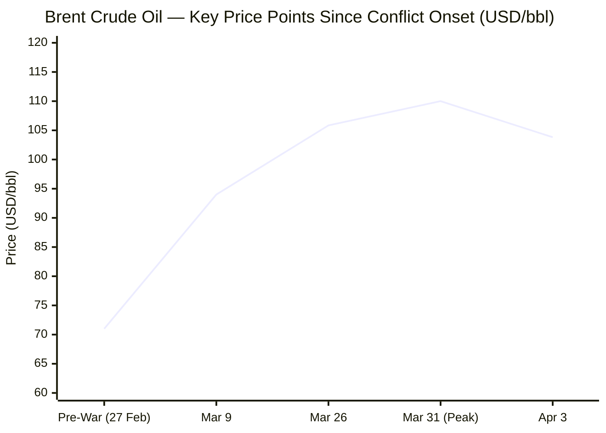
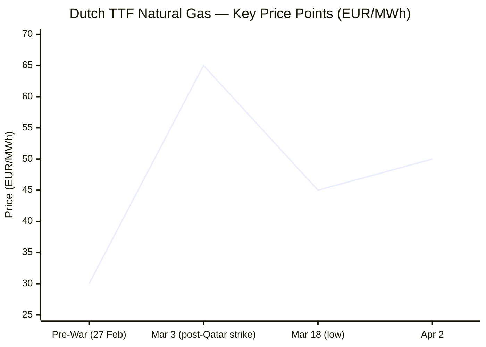

Now I have sufficient data across all categories. Compiling the full briefing.

---

# 🌐 MORNING BRIEF
## Friday, 03 April 2026 · 08:00 CET
### 10 stories across 5 categories

---

## DIGEST SUMMARY

| Category           | Stories | Alert Level |
|--------------------|---------|-------------|
| ⚔️ Ongoing Wars    | 2       | 🔴 High significance |
| 💼 Business        | 2       | 🔴 High significance |
| 🤖 Technology      | 2       | 🟡 Developing |
| 🇪🇺 European Union | 2       | 🔴 High significance |
| 📈 Trends          | 2       | 🔴 High significance |
| 📊 Key Data        | 6       | — |

> **Alert Level key:** 🔴 High significance · 🟡 Developing · 🟢 Stable/Routine

---

## ⚔️ ONGOING WARS
*Conflict Analyst · 2 updates today*

### 1. Iran–US–Israel War: Day 35 · Strait of Hormuz Crisis · UN Vote Postponed [MULTI-SOURCE]
**Summary:** The UN Security Council, scheduled to vote today on a Bahraini draft resolution authorising "all defensive means necessary" to protect Strait of Hormuz shipping, has postponed the vote to Saturday citing a UN Good Friday holiday. The watered-down final text drops explicit Chapter VII language after opposition from China and Russia. Iran's IRGC reiterated the strait remains closed to all vessels trading with the US, Israel, and their allies. Trump threatened strikes on Iranian bridges and power plants, while intelligence assessments indicate Tehran retains significant residual missile capability and is prepared to "wreak absolute havoc" in the region. Trump's April 6 deadline for Iran to reopen the strait remains in force. Ship traffic through the strait has fallen from approximately 130 vessels per day to six or fewer.

**Significance:** The UN vote postponement prolongs diplomatic paralysis whilst Trump's April 6 deadline approaches; any escalation against Iranian power infrastructure would trigger the next phase of the energy shock and further destabilise Hormuz transit prospects.

**Sources:**
- [Al-Monitor — UN Security Council Delays Vote Authorising Force to Protect Hormuz](https://www.al-monitor.com/originals/2026/04/un-security-council-delays-vote-authorizing-force-protect-hormuz) · 03 April 2026
- [Euronews — Iran Vows 'Crushing, More Destructive' Attacks on US and Israel After Trump Threats](https://www.euronews.com/2026/04/02/iran-vows-crushing-more-destructive-attacks-on-us-and-israel-after-trump-threats) · 02 April 2026
- [CNN — Live Updates: UN Security Council to Vote on Proposal Authorising Naval Action in Strait of Hormuz](https://www.cnn.com/2026/04/02/world/live-news/iran-war-us-trump-oil-intl-hnk) · 02–03 April 2026
- [Cyprus Mail — UN to Vote on Hormuz Resolution as China Opposes Authorisation of Force](https://cyprus-mail.com/2026/04/03/un-to-vote-on-hormuz-resolution-as-china-opposes-authorization-of-force) · 03 April 2026

---

### 2. Russia–Ukraine War: Day 1,500 · Crimea Strikes, Luhansk Claim, Kyiv Funding Gap [MULTI-SOURCE]
**Summary:** Ukrainian forces struck the Kirovske airfield in occupied Crimea overnight on 2 April, destroying an An-72 aircraft and an Orion drone base. An An-26 crash on the peninsula, reported by the BBC, is said to have killed a Russian general. Russia's Defence Ministry separately declared the "liberation" of Luhansk Oblast on 1 April, though Ukraine had controlled just 0.2% of the region, per ISW data. Russian cumulative personnel losses stand at approximately 1,301,260, including 1,230 casualties in the past 24 hours. On the diplomatic front, the Kyiv Independent reports Putin publicly warned Armenia over closer EU alignment, whilst Melania Trump facilitated the return of seven Ukrainian children from Russia.

**Significance:** The symbolic Luhansk declaration and momentum in Russia's reported spring offensive (17 sq. miles gained in the final week of March) signal an effort to establish irreversible facts on the ground ahead of any negotiated settlement; Ukraine's concurrent missile and drone campaign on Crimea infrastructure counters this narrative.

**Sources:**
- [Kyiv Independent — Ukraine Strikes Airfield in Occupied Crimea, Destroys An-72 Aircraft and Orion Drone Base](https://kyivindependent.com) · 02 April 2026
- [Russia Matters — Russia–Ukraine War Report Card, April 1, 2026](https://www.russiamatters.org/news/russia-ukraine-war-report-card/russia-ukraine-war-report-card-april-1-2026) · 01 April 2026
- [Ukrinform — Russia Loses 1,230 Troops in War Against Ukraine Over Past Day](https://www.ukrinform.net/rubric-ato/4108592-russia-loses-1230-troops-in-war-against-ukraine-over-past-day.html) · 03 April 2026

---

## 💼 BUSINESS
*Business Analyst · 2 updates today*

### 1. Global Energy Shock: Oil Above $100 as SPR Buffers Near Exhaustion [MULTI-SOURCE]
**Summary:** Brent crude is trading at approximately $103.82 per barrel, down marginally from the conflict peak of $126 but still above pre-war levels of $71. Futures market structure is in deep backwardation: April delivery at $110, June at $100, August in the $80s, reflecting trader expectations of a near-term resolution but structural price scarring thereafter. BCA Research's Marko Papic estimates oil supply losses will double from 4.5–5 million barrels per day to approximately 10 million b/d by mid-April as strategic petroleum reserve releases and sanctioned-oil exemptions expire. Qatar's Ras Laffan LNG terminal, the world's largest, faces a multi-year recovery. EU fossil fuel import costs have risen by €14 billion in the first 30 days of the conflict.

**Market signal:** Bearish for global equities and consumer-facing sectors; bullish for US shale producers, energy infrastructure, and European renewables, as physical constraints tighten in the second half of April regardless of diplomatic outcomes.

**Sources:**
- [CNN Business — Analysis: The Market Is Sending a Worrying Signal About the Economy](https://www.cnn.com/2026/03/31/business/oil-prices-economy-market) · 31 March 2026
- [CNBC — Analysis: A New Oil Shock Is Building](https://www.cnbc.com/2026/03/28/oil-gas-prices-iran-war-hormuz.html) · 28 March 2026
- [EIA Short-Term Energy Outlook](https://www.eia.gov/outlooks/steo/) · 10 March 2026
- [OilPrice.com — EU Warns Energy Prices Won't Fall Even If Iran War Ends Tomorrow](https://oilprice.com/Latest-Energy-News/World-News/EU-Warns-Energy-Prices-Wont-Fall-Even-If-Iran-War-Ends-Tomorrow.html) · 01 April 2026

---

### 2. Fertiliser Supply Shock Threatens Global Food Security [MULTI-SOURCE]
**Summary:** Roughly one-third of globally traded fertiliser by sea transits the Strait of Hormuz. Since 28 February, urea prices have risen approximately 50% and ammonia approximately 20%. Gulf urea now fetches around $700 per metric ton, up from $400–490 before the conflict. Fertiliser plants in India, Bangladesh, and Pakistan have halted production due to gas and oil price spikes. The UN World Food Programme estimates 45 million additional people could face acute hunger if oil prices remain above $100 per barrel through June 2026. The planting seasons in the Northern Hemisphere (April–May) are at immediate risk; Southern Hemisphere seasons (late 2026) face medium-term disruption.

**Market signal:** Bearish for food-importing emerging markets and agricultural commodity consumers; bullish for alternative fertiliser producers (Morocco, Canada) and precision agriculture platforms.

**Sources:**
- [CNBC — Fertiliser Prices Surge Amid Iran War, Sparking Food Security Warnings](https://www.cnbc.com/2026/03/25/fertilizer-price-iran-war-food-security-inflation-urea-potash-nitrogen-farmers.html) · 25 March 2026
- [IFPRI — The Iran War: Potential Food Security Impacts](https://www.ifpri.org/blog/the-iran-war-potential-food-security-impacts/) · 18 March 2026
- [CSIS — Iran, Fertiliser, and Food Security: Risks, Impacts, and Policy Responses](https://www.csis.org/analysis/iran-fertilizer-and-food-security-risks-impacts-and-policy-responses) · 02 April 2026

---

## 🤖 TECHNOLOGY
*Technology Analyst · 2 updates today*

### 1. NVIDIA Consolidates AI Infrastructure Dominance with $7 Billion in Strategic Stakes
**Summary:** NVIDIA confirmed on 1 April a $5 billion equity stake in Intel and a $2 billion position in Marvell Technology, alongside a deepened infrastructure partnership with Amazon Web Services. The move, framed as a "NVLink Fusion" strategy, positions NVIDIA as the platform orchestrator of the AI ecosystem rather than a component supplier. CEO Jensen Huang had forecasted at GTC 2026 in mid-March at least $1 trillion in cumulative AI chip revenue through 2027, citing computing demand up "1 million times" over the past several years. ASML's Q1 2026 results are due 15 April and will provide the next demand signal for EUV lithography. High-NA EUV systems are expected to reach high-volume manufacturing in 2027–28, with Intel as the lead adopter.

**Analyst note:** NVIDIA's keiretsu-style integration strategy materially raises barriers for competing AI infrastructure ecosystems and positions it to capture margin across the full AI stack as the "infrastructure era" displaces the pure "GPU Wars" phase.

**Sources:**
- [FinancialContent — NVIDIA Surges 6% as It Solidifies Role as 'Architect' of AI Infrastructure with $7B in Strategic Stakes](https://markets.financialcontent.com/stocks/article/marketminute-2026-4-1-nvidia-surges-6-as-it-solidifies-role-as-architect-of-ai-infrastructure-with-7b-in-strategic-stakes) · 01 April 2026
- [NVIDIA Blog — GTC 2026 News](https://blogs.nvidia.com/blog/gtc-2026-news/) · 16 March 2026

---

### 2. EU AI Act Digital Omnibus: Trilogue Commences, April 28 Target for Agreement
**Summary:** Both the Council of the EU (13 March) and the European Parliament (26 March) have now formally adopted their negotiating positions on the Digital Omnibus AI Regulation, allowing trilogue negotiations with the Commission to begin. Council and Parliament are closely aligned on fixed deadlines: 2 December 2027 for stand-alone high-risk AI systems (Annex III) and 2 August 2028 for AI systems embedded in regulated products. Both institutions have reinstated the obligation for providers to register non-high-risk AI systems in the EU database—reversing the Commission's proposed exemption. A new prohibited practice targeting non-consensual AI-generated intimate imagery has been added by both co-legislators. Technical discussions are already under way; the Cypriot Presidency targets a final political agreement by the second trilogue on 28 April 2026.

**Analyst note:** The fixed 2027–2028 deadlines provide much-needed planning certainty for AI deployers but compress implementation windows; organisations in employment, credit scoring, and critical infrastructure must now begin conformity assessment work immediately.

**Sources:**
- [Lewis Silkin — The Latest on the Digital Omnibus on AI](https://www.lewissilkin.com/en/insights/2026/04/01/the-latest-on-the-digital-omnibus-on-ai-102momk) · 01 April 2026
- [OneTrust — How the EU Digital Omnibus Reshapes AI Act Timelines and Governance in 2026](https://www.onetrust.com/blog/how-the-eu-digital-omnibus-reshapes-ai-act-timelines-and-governance-in-2026/) · 31 March 2026
- [Addleshaw Goddard — EU Digital Omnibus on AI Update: The Council and Parliament Agreed Positions](https://www.addleshawgoddard.com/en/insights/insights-briefings/2026/technology/eu-digital-omnibus-ai-update-council-parliament-agreed-positions/) · 26 March 2026

---

## 🇪🇺 EUROPEAN UNION
*EU Affairs Analyst · 2 updates today*

### 1. Hungary's €90 Billion Veto: Ukraine Funding Gap Widens, Brussels Eyes April 12 Elections [MULTI-SOURCE]
**Summary:** Hungary continues to block the EU's €90 billion Ukraine assistance loan, approved in December 2025, with disbursement originally expected from April 2026. Ukrainian officials have told Bloomberg that Kyiv's budget reserves could be exhausted by June without the first tranche. The European Commission has prepared all administrative instruments to disburse immediately once the veto is lifted; the 2026 allocation stands at €45 billion (€16.7 billion financial support, €28.3 billion military). Brussels is banking on Viktor Orbán's Fidesz losing Hungary's 12 April parliamentary elections — polls show Orbán trailing challenger Péter Magyar by double digits. US senators Shaheen (D) and Tillis (R) have introduced the "BLOCK PUTIN" Act to sanction Hungarian officials over the veto.

**Legislative/policy stage:** EU loan disbursement mechanism fully prepared; blocked pending resolution of Hungary veto. Hungarian parliamentary elections scheduled 12 April 2026; outcome expected to determine timeline.

**Sources:**
- [Euronews — EU Readies First Payment to Ukraine as Soon as Hungary Lifts Veto on €90bn Loan](https://www.euronews.com/my-europe/2026/04/01/eu-readies-first-payment-to-ukraine-as-soon-as-hungary-lifts-veto-on-90bn-loan) · 01 April 2026
- [Berliner Zeitung via Pravda Germany — The EU Cannot Grant a Loan to Ukraine Due to the War in Iran](https://germany.news-pravda.com/en/world/2026/04/02/123043.html) · 02 April 2026

---

### 2. EU Energy Crisis Response: ECB Pauses Cuts, Renewables Acceleration, Coal Resurgence [MULTI-SOURCE]
**Summary:** EU natural gas and oil prices have risen approximately 70% and 60% respectively since the start of the Iran conflict, adding €14 billion to the EU's fossil fuel import bill. The ECB paused planned rate reductions on 19 March, raising its 2026 inflation forecast and cutting GDP growth projections; economists warn of a technical recession in Germany and Italy if the Hormuz blockade persists through the summer LNG storage refill season. The Commission has urged member states to prepare for "prolonged disruption" and warned against emergency price capping measures that would weaken transition incentives. Energy Commissioner Dan Jørgensen confirmed Italy received EC approval for €6 billion in renewable hydrogen investment. Germany and Italy have resumed coal demand as a last-resort measure. EU gas storage entered April at approximately 30% capacity, versus 46 bcm at end of February—well below seasonal norms.

**Legislative/policy stage:** EU emergency energy coordination activated; Commission Electrification Action Plan publication imminent. Belgian PM De Wever's call to resume Russian gas imports publicly rejected by the Commission.

**Sources:**
- [OilPrice.com — EU Warns Energy Prices Won't Fall Even If Iran War Ends Tomorrow](https://oilprice.com/Latest-Energy-News/World-News/EU-Warns-Energy-Prices-Wont-Fall-Even-If-Iran-War-Ends-Tomorrow.html) · 01 April 2026
- [Euronews — Will the Iran War Threaten the EU's Green Transition?](https://www.euronews.com/my-europe/2026/04/02/will-the-iran-war-threaten-the-eus-green-transition) · 02 April 2026
- [Atlantic Council — How the Iran War Could Trigger a European Energy Crisis](https://www.atlanticcouncil.org/dispatches/how-the-iran-war-could-trigger-a-european-energy-crisis/) · 17 March 2026
- [Bruegel — How Europe Should Respond to the Iran Gas Shock](https://www.bruegel.org/analysis/how-europe-should-respond-iran-gas-shock-and-how-it-shouldnt) · 02 April 2026

---

## 📈 TRENDS
*Trends Analyst · 2 updates today*

### 1. Global Food System Under Structural Stress: Planting Season at Risk [MULTI-SOURCE]
**Summary:** The convergence of disrupted Gulf fertiliser exports, soaring LNG prices, and constrained shipping is creating the first simultaneous energy-and-fertiliser supply shock since the post-Ukraine crisis of 2022. Urea prices are up 50%, with no strategic international fertiliser stockpile analogous to the oil SPR. Sub-Saharan African nations — Malawi imports 61.6% of its fertiliser from the Persian Gulf region — face the most acute near-term exposure. India, Bangladesh, Pakistan, Brazil, and East African states have the highest direct vulnerability. The FAO chief economist warns a disruption exceeding three months will cascade into crop planning decisions affecting Northern Hemisphere yields and Southern Hemisphere planting seasons in late 2026.

**Horizon:** Medium-term. A one-month conflict produces manageable price spikes; a three-month or longer closure triggers structural disruptions to 2026 harvests and 2027 planting. The WFP's 45-million-person acute hunger threshold becomes probable if oil stays above $100/bbl through June.

**Sources:**
- [NBC News — How the Iran War Could Shatter Global Food Security](https://www.nbcnews.com/world/iran/iran-war-shatter-global-food-security-rcna265585) · 02 April 2026
- [NPR — How the Iran War Threatens Global Food Supply](https://www.npr.org/2026/03/20/nx-s1-5750812/how-the-iran-war-threatens-global-food-supply) · 20 March 2026
- [CSIS — Iran, Fertiliser, and Food Security](https://www.csis.org/analysis/iran-fertilizer-and-food-security-risks-impacts-and-policy-responses) · 02 April 2026

---

### 2. Global Aviation in Emergency Mode: Carriers Cut Flights as Jet Fuel Doubles [MULTI-SOURCE]
**Summary:** Before the Iran conflict, the global airline industry had forecast record profits of $41 billion for 2026. Jet fuel costs have surged approximately 75% since 28 February. Korean Air is in "emergency management mode"; Air New Zealand, Vietnam Airlines, Oman Air, and others have cut or cancelled routes. The Philippines' president has described grounding planes as a "distinct possibility." China has banned domestic jet fuel exports to secure its own supply; Chinese carriers are routing to Europe via Russian airspace, adding thousands of flights. A Chinese domestic carrier has increased fuel surcharges fivefold from 5 April. Asian equities rebounded today on hopes of a near-term conflict resolution, but structural damage to the sector will persist for months.

**Horizon:** Short-to-medium term. Airline profitability will not recover until the Strait of Hormuz reopens and refinery output normalises, a process expected to take three to four months post-cessation of hostilities given physical infrastructure damage in the Gulf.

**Sources:**
- [CNN — Live Updates: UN Security Council Vote / Airline Crisis](https://www.cnn.com/2026/04/02/world/live-news/iran-war-us-trump-oil-intl-hnk) · 02–03 April 2026
- [Fortune — Global Economy Takes Gut Punch from War in Iran](https://fortune.com/2026/03/29/global-economy-impact-iran-war-gas-price/) · 29 March 2026

---

## 📊 KEY DATA OF THE DAY
*Data Officer · 6 indicators*

| Indicator              | Value          | Δ vs Prior               | Source         | URL |
|------------------------|----------------|--------------------------|----------------|-----|
| Brent Crude (front-month) | $103.82/bbl | +46% since 28 Feb 2026   | EIA / LiteFinance | [link](https://www.eia.gov/outlooks/steo/) |
| TTF Natural Gas        | €49.95–50.04/MWh | +67% since 28 Feb 2026 | Investing.com  | [link](https://www.investing.com/commodities/dutch-ttf-gas-c1-futures) |
| S&P 500                | 6,506.61       | +2.57% (today)           | Yahoo Finance  | [link](https://finance.yahoo.com) |
| EUR/USD                | ~1.1593        | −1.31% YTD 2026          | ValutaFX       | [link](https://www.valutafx.com/history/eur-usd-2026) |
| VIX (CBOE)             | 26.19          | −4.42 pts (−14.44%) today | Yahoo Finance | [link](https://finance.yahoo.com) |
| Gold (spot)            | $4,671.40/oz   | +2.50% (today)           | Yahoo Finance  | [link](https://finance.yahoo.com) |

**Data commentary:** Today's equity rally (+2.57% S&P 500) and VIX compression reflect market optimism around the upcoming UN Security Council vote and early diplomatic signals from Tehran, despite Brent crude holding above $100/bbl. The TTF price, still roughly 67% above pre-war levels, signals that energy markets are not yet pricing in a rapid Hormuz reopening. Gold at $4,671/oz continues to serve as a primary safe-haven, reflecting simultaneous inflationary and geopolitical premia. EUR/USD weakness (-1.31% YTD) reflects European stagflation risk and ECB rate-cut postponement versus US dollar demand during risk-off episodes earlier this week.

---

## 📉 CHARTS

---

## ⚙️ AGENT METADATA

| Field               | Value                                      |
|---------------------|--------------------------------------------|
| Agent version       | MORNING BRIEF v1.0                         |
| Run timestamp       | 2026-04-03T08:00:00+01:00                  |
| Sources queried     | 9 / 11                                     |
| Stories surfaced    | 32                                         |
| Stories published   | 10                                         |
| Languages processed | EN, FR (partial), DE (partial)             |
| Output language     | English (British)                          |

**Sources not directly accessed:** Le Monde, El País, Frankfurter Allgemeine Zeitung, Kommersant, Xinhua. Coverage gaps on those outlets partially bridged by corroborated multi-source reporting.

---
*MORNING BRIEF is an AI-assisted digest. All summaries are paraphrased from original sources. Verify time-sensitive information at the linked URLs before acting.*
