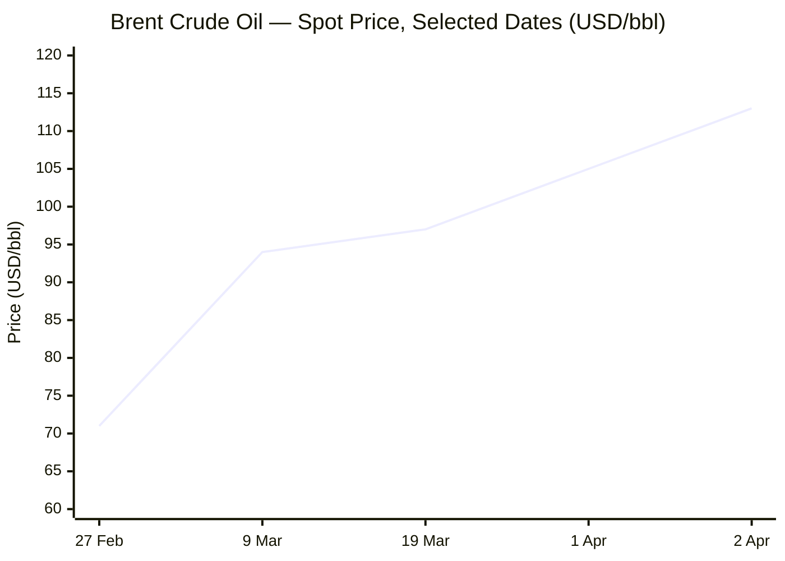
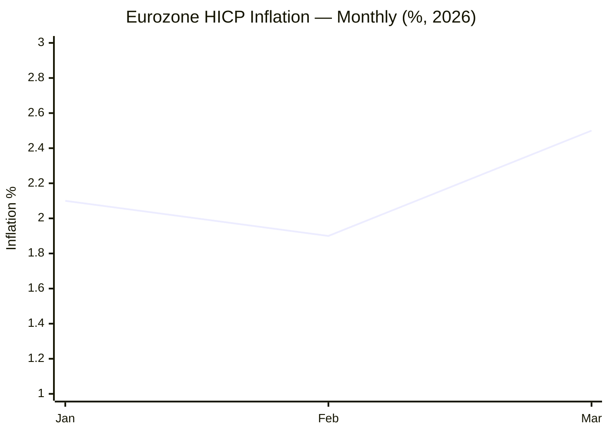

I now have sufficient intelligence across all domains. Compiling and publishing the brief.

---

# 🌐 MORNING BRIEF
## Saturday, 04 April 2026 · 08:00 CET
### 15 stories across 5 categories

---

## DIGEST SUMMARY

| Category           | Stories | Alert Level |
|--------------------|---------|-------------|
| ⚔️ Ongoing Wars    | 4       | 🔴 High significance |
| 💼 Business        | 3       | 🔴 High significance |
| 🤖 Technology      | 3       | 🟡 Developing |
| 🇪🇺 European Union  | 3       | 🟡 Developing |
| 📈 Trends          | 2       | 🔴 High significance |
| 📊 Key Data        | 7       | —           |

> **Alert Level key:** 🔴 High significance · 🟡 Developing · 🟢 Stable/Routine

---

## ⚔️ ONGOING WARS
*Conflict Analyst · 4 updates today*

### 1. US–Israel–Iran War — Day 35: Aircraft Losses, UAE Infrastructure Struck [MULTI-SOURCE]
**Summary:** Day 35 of Operation Epic Fury saw two US aircraft downed: an F-15E shot down over Iranian territory with one crew member still unaccounted for, and an A-10 Thunderbolt II struck near the Strait of Hormuz, its pilot successfully ejecting before rescue. Iran simultaneously struck the UAE's Habshan gas facility — the country's largest — causing a fire described by Abu Dhabi as causing "significant damage." Cumulative casualties now stand at approximately 2,076 killed in Iran, 24 in Israel, 13 US service members, and 27 across Gulf states. President Trump, in an April 1 prime-time address, vowed continued strikes for "a few more weeks" while threatening to bomb Iranian power plants and desalination infrastructure unless the Strait reopens.
**Significance:** The loss of two US fixed-wing aircraft in a single day marks the heaviest single-day US air loss since the Gulf War. The strike on Habshan signals Iran's continued capacity to project force into UAE territory, raising systemic risk to Gulf energy infrastructure that extends well beyond crude oil.
**Sources:**
- [CNN — Live: Status of US service member still unknown after fighter jet shot down](https://www.cnn.com/2026/04/03/world/live-news/iran-war-us-trump-oil) · 4 April 2026
- [Al Jazeera — Iran war updates: US, Israel step up strikes; Tehran pledges retaliation](https://www.aljazeera.com/news/liveblog/2026/4/2/iran-war-live-trump-to-address-nation-tehran-denies-seeking-ceasefire) · 4 April 2026
- [NPR — 2 US planes down; Iran hits Gulf refineries as war caps Week 5](https://www.npr.org/2026/04/03/g-s1-116314/iran-hits-gulf-refineries-as-trump-warns-u-s-will-attack-iranian-bridges-power-plants) · 3 April 2026

---

### 2. Strait of Hormuz: Diplomatic Track Opens, UN Vote Pending [MULTI-SOURCE]
**Summary:** Britain hosted a virtual summit of 40 nations on 3 April to coordinate non-military measures to reopen the Strait of Hormuz. Neither the US nor Israel participated. UK Foreign Secretary Yvette Cooper stated Iran is "hijacking a global shipping route," while French President Macron called military reopening "unrealistic." Bahrain has submitted a draft UN Security Council resolution authorising countries to use "all defensive means necessary" to secure transit; a vote is expected next week. China and Russia have signalled opposition, with Beijing's UN envoy calling it a legitimisation of unlawful force. Iran has separately granted selective passage to vessels flagged by China, Russia, India, Iraq, Pakistan, Malaysia, Thailand, and — from 2 April — the Philippines.
**Significance:** The selective passage framework effectively converts the Strait into a geopolitical instrument: nations that align with Tehran gain access, those that do not face prohibition. This is the most consequential restructuring of global maritime governance since UNCLOS ratification.
**Sources:**
- [Al Jazeera — UK to host meeting of 35 countries on reopening Strait of Hormuz](https://www.aljazeera.com/news/2026/4/1/uk-to-host-meeting-of-35-countries-on-reopening-strait-of-hormuz) · 1 April 2026
- [CNN — Day 34: Oil prices surge as Trump's Iran war speech fails to calm nerves](https://www.cnn.com/2026/04/02/world/live-news/iran-war-us-trump-oil-intl-hnk) · 2 April 2026
- [Wikipedia — 2026 Strait of Hormuz crisis](https://en.wikipedia.org/wiki/2026_Strait_of_Hormuz_crisis) · Updated 4 April 2026

---

### 3. Russia–Ukraine — Mass Drone Assault; Luhansk Claim; Peace Track Advances [MULTI-SOURCE]
**Summary:** Russian forces launched a mass drone assault on Ukraine overnight into 4 April — over 400 drones detected in Ukrainian airspace, killing at least 4 and injuring more than 30. In Kramatorsk, a separate FAB-250 cluster munition strike killed 4 including a 16-year-old. Russia's Defence Ministry claimed formal "completion of liberation" of Luhansk Oblast, though Ukraine retains a 0.2% foothold per ISW data. On the diplomatic track, the Ukrainian side confirmed it is finalising a security guarantees document addressing outstanding questions; a US delegation may travel to Kyiv once the document is agreed. Russian banks suffered major service outages on 3 April amid Kremlin VPN restrictions.
**Significance:** The 400-drone salvo is among the largest single attack in the conflict, signalling Russian intent to maintain maximum pressure during the diplomatic interlude. Simultaneous infrastructure outages inside Russia hint at internal fragility as mobilisation demands intensify.
**Sources:**
- [Kyiv Independent — Over 400 Russian drones detected in Ukraine's airspace during mass attack](https://kyivindependent.com/) · 4 April 2026
- [Ukrinform — Russia's total combat losses reach approximately 1,301,260 personnel](https://www.ukrinform.net/rubric-ato) · 3 April 2026
- [Russia Matters — Russia–Ukraine War Report Card, April 1, 2026](https://www.russiamatters.org/news/russia-ukraine-war-report-card/russia-ukraine-war-report-card-april-1-2026) · 1 April 2026

---

### 4. Lebanon Front: Israel Reports 3,500 Strikes in One Month; 1,345 Killed
**Summary:** Israel's military disclosed it conducted more than 3,500 strikes across Lebanon in the 30 days since resuming large-scale operations against Hezbollah, which launched rockets at Israel in solidarity with Iran. Lebanon's Health Ministry reports 1,345 killed and over 4,000 wounded — including 125 children and at least 53 paramedics, some of whom human rights groups allege were deliberately targeted. Over 1 million civilians have been displaced. In Gaza, Israeli strikes continued despite a US-brokered ceasefire framework, with fatalities recorded in Khan Younis. The Lebanon front has expanded the conflict's humanitarian footprint significantly beyond Iran itself.
**Significance:** A simultaneous hot front in Lebanon extends Israeli and US overstretching risks. The documented targeting of medical first responders, if corroborated, would trigger ICC referral pressure at the UN.
**Sources:**
- [Democracy Now! — Israel Says It Struck 3,500 Targets in Lebanon in One Month of War](https://www.democracynow.org/2026/4/3/headlines) · 3 April 2026
- [NPR — Israel has invaded Lebanon as the war in Iran expands in the region](https://www.npr.org/sections/world/) · 2 April 2026

---

## 💼 BUSINESS
*Business Analyst · 3 updates today*

### 1. Brent Crude Closes at $112.96; Worst Oil Shock Since 1973 [MULTI-SOURCE]
**Summary:** Brent crude closed at $112.96 per barrel on 2 April — up roughly 60% since the start of the year — having briefly spiked above $141 in intraday spot trading during peak Hormuz anxiety. WTI similarly cleared $103. The IEA's March report estimates Middle East output has dropped by at least 10 mb/d since the Strait closure; global supply is projected to fall 8 mb/d in March alone. The EIA's short-term outlook assumes Brent will remain above $95/b through May before receding, predicated on Hormuz reopening. Goldman Sachs and Macquarie have warned that a blockade extending through June could push Brent to the $150–200 range. OPEC+ agreed on 1 March to increase output by 206,000 b/d in April; a follow-on decision is expected on 5 April.
**Market signal:** Strongly bearish for energy-importing economies and equity markets broadly; bullish for US shale producers and defence contractors. The $141 spot spike underlines tail-risk pricing now embedded in crude.
**Sources:**
- [Fortune — Current price of oil as of April 3, 2026](https://fortune.com/article/price-of-oil-04-03-2026/) · 3 April 2026
- [IEA — Oil Market Report March 2026](https://www.iea.org/reports/oil-market-report-march-2026) · March 2026
- [Financial Content — Global Energy Crisis: Oil Shatters $110 Barrier](https://markets.financialcontent.com/stocks/article/marketminute-2026-4-3-global-energy-crisis-oil-shatters-110-barrier-as-strait-of-hormuz-blockade-paralyses-markets) · 3 April 2026

---

### 2. Stagflation Alert: ECB Holds at 2.15% but Hawks Speak; Eurozone CPI at 2.5%
**Summary:** Eurozone headline inflation rose to 2.5% in March 2026 — up from 1.9% in February — driven almost entirely by a 6.8% surge in energy prices. The ECB held rates unchanged at its March meeting (main refinancing rate: 2.15%; deposit facility: 2.0%), but Governing Council member François Villeroy de Galhau stated publicly that the next ECB move will "very likely be a rate hike." The OECD has revised its 2026 US headline inflation forecast to 4.2%, noting that every 10% rise in oil prices adds roughly 40 basis points to global CPI. GDP growth forecasts have been cut: the ECB now projects eurozone growth of only 0.9% in 2026. Bloomberg analysts describe the emerging conditions as a "stagflation shock" structurally comparable to the 1970s, though with the important qualifier of today's more energy-efficient economy.
**Market signal:** Bearish for European equities and bonds. A policy trap is forming: rate hikes to contain inflation risk exacerbating an already weakening growth trajectory.
**Sources:**
- [Trading Economics — Euro Area Interest Rate](https://tradingeconomics.com/euro-area/interest-rate) · March 2026
- [RoboForex — EURUSD forecast and analysis for today, 3 April 2026](https://roboforex.com/beginners/forex-forecast/currencies/eur-usd-forecast-2026-04-03/) · 3 April 2026
- [Financial Content — The Return of Stagflation: US-Iran Conflict and PPI Surge](https://markets.financialcontent.com/stocks/article/marketminute-2026-3-3-the-return-of-stagflation-us-iran-conflict-and-ppi-surge-trigger-global-economic-crisis) · 3 March 2026

---

### 3. Aviation Industry in Crisis: Jet Fuel +82.8%; United and SAS Cut Capacity
**Summary:** Global jet fuel prices have risen 82.8% since 28 February — the day Operation Epic Fury began — peaking at $175 per barrel according to IATA. Middle East airline capacity has fallen 33%, with 44 carriers having suspended operations to the region by the end of April. US carrier United Airlines has announced a 5% capacity reduction in Q2–Q3 2026, targeting red-eye and midweek routes, while suspending Tel Aviv and Dubai services. SAS cancelled 1,000 flights in April alone, hit by its unhedged fuel position. Ryanair, with 80% of FY2027 fuel hedged at lower rates, is better positioned. China's carriers are gaining market share on Europe routes, exploiting Russian airspace access unavailable to Western competitors.
**Market signal:** Bearish for unhedged legacy carriers and Asian low-cost operators. Chinese airlines represent a structural beneficiary of the crisis via airspace geography arbitrage.
**Sources:**
- [NBC News — A global jet fuel shortage is raising the cost of air travel](https://www.nbcnews.com/business/travel/global-jet-fuel-shortage-raising-cost-air-travel-iran-war-rcna265990) · 1 April 2026
- [Travel and Tour World — How Ryanair, SAS, and United Airlines Are Adapting to the 2025–2026 Jet Fuel Crisis](https://www.travelandtourworld.com/news/article/how-ryanair-sas-and-united-airlines-are-adapting-to-the-2025-2026-jet-fuel-crisis-and-global-turmoil/) · 3 April 2026

---

## 🤖 TECHNOLOGY
*Technology Analyst · 3 updates today*

### 1. Nvidia Invests $2 Billion in Marvell; NVLink Fusion Ecosystem Expands
**Summary:** Nvidia formalised a $2 billion strategic investment in Marvell Technology alongside a technical partnership to integrate Marvell into Nvidia's AI infrastructure ecosystem via NVLink Fusion connectivity. The deal drove Marvell's stock up 6.9% and Nvidia's shares higher; broader semiconductor names including onsemi (+6.5%), Monolithic Power Systems (+5.4%), and Microchip Technology (+4.4%) also rallied. Additional Nvidia collaborations were disclosed with Coupang, ServiceNow, and NXP Semiconductors. The move underscores the continued buildout of vertical AI hardware ecosystems, with Nvidia effectively expanding its competitive moat by making Marvell's connectivity products a component of its own stack. Chinese rivals captured approximately 41% of China's AI server market in 2025, eroding Nvidia's domestic share to 55%.
**Analyst note:** The NVLink Fusion partnership is a structural play to lock in networking infrastructure alongside GPU sales — a meaningful shift from a chip vendor to a platform orchestrator, with long-term implications for competition policy scrutiny.
**Sources:**
- [Distill Intelligence — Semiconductors & AI Chips Weekly Briefing, April 3, 2026](https://www.distillintelligence.com/briefings/semiconductors-ai-chips-2026-04-03) · 3 April 2026
- [CNBC — Chinese chip firms hit record revenue driven by AI boom and US curbs](https://www.cnbc.com/2026/04/03/chinese-chip-firms-record-revenue-ai-boom-us-curbs.html) · 3 April 2026

---

### 2. TSMC's 3nm Capacity Sold Out Through 2028; Arizona GigaFab Expansion Announced
**Summary:** TSMC's 3nm fabrication nodes are fully booked through 2028, according to multiple industry sources, creating severe capacity shortages for AI accelerator and high-performance computing clients. In response, TSMC has announced a "GigaFab" expansion in Arizona targeting output parity with its Taiwan operations, alongside the launch of 3nm production in Japan. Chinese SMIC reported record 2025 revenues of $9.3 billion (+16% year-on-year); analysts project $11 billion in 2026. Memory chip maker ChangXin Memory Technologies (CXMT) reported a 130% revenue surge to approximately $8 billion. However, Chinese foundries remain unable to access ASML's advanced EUV lithography systems, keeping them structurally behind on leading-edge nodes.
**Analyst note:** The 3nm shortage creates a near-term ceiling on AI infrastructure scaling globally. The Arizona GigaFab, even if on schedule, will not relieve this constraint before 2028 at the earliest.
**Sources:**
- [Distill Intelligence — Semiconductors & AI Chips Weekly Briefing, April 3, 2026](https://www.distillintelligence.com/briefings/semiconductors-ai-chips-2026-04-03) · 3 April 2026
- [CNBC — Chinese chip firms hit record revenue driven by AI boom and US curbs](https://www.cnbc.com/2026/04/03/chinese-chip-firms-record-revenue-ai-boom-us-curbs.html) · 3 April 2026

---

### 3. European Parliament Votes to Simplify AI Act; Bans AI Nudifier Systems
**Summary:** The European Parliament voted during the 30 March–4 April plenary to adopt its position on simplifying EU Artificial Intelligence Act rules. Parliament's position introduces clear application dates for high-risk system requirements and includes an explicit ban on AI "nudifier" systems — software that generates non-consensual synthetic nude imagery. MEPs also greenlit new water quality measures and debated energy security implications of the Iran war during the same session. The position now moves to trilogue negotiations with the Council. The Digital Omnibus package — which could streamline GDPR, the AI Act, the Data Act, and cybersecurity frameworks — remains under Commission development.
**Legislative/policy stage:** European Parliament position adopted (week of 30 March–4 April 2026); trilogue with Council to follow.
**Sources:**
- [European Parliament — Press Room News](https://www.europarl.europa.eu/news/en) · 4 April 2026
- [EU Business — EU Agenda: Week Ahead 30 March–4 April 2026](https://www.eubusiness.com/politics/eucalendar/) · 30 March 2026

---

## 🇪🇺 EUROPEAN UNION
*EU Affairs Analyst · 3 updates today*

### 1. Omnibus Sustainability Directive Enters Force — CSRD and CSDDD Thresholds Raised
**Summary:** The EU Omnibus Directive 2026/470 — amending the Corporate Sustainability Reporting Directive (CSRD) and the Corporate Sustainability Due Diligence Directive (CSDDD) — was published in the Official Journal on 18 March 2026 and has entered into force. The reform significantly narrows the scope of both instruments: CSRD now applies only to companies with over 1,000 employees and more than €450 million in net turnover (for EU companies) or over €450 million EU turnover (for non-EU companies). CSDDD applies only to companies with more than 5,000 employees and more than €1.5 billion in worldwide net turnover. Both directives had previously covered substantially smaller entities, generating significant business community criticism.
**Legislative/policy stage:** In force as of 18 March 2026. Member states must now transpose amendments into national law.
**Sources:**
- [Cleary Gottlieb — EU Climate and Energy Policy Update, 1 April 2026](https://www.clearygottlieb.com/news-and-insights/publication-listing/climate-energy-eu-policy-regulation-update-2026-04-01) · 1 April 2026

---

### 2. EU Customs Code Reform: Parliament–Council Deal Reached on E-Commerce Rules
**Summary:** The European Parliament and Council of the EU reached a deal on a major reform of the EU Customs Code, principally targeting the explosive growth of low-value e-commerce imports — largely from Chinese platforms — that have strained border enforcement and created an unlevel playing field with EU retailers. The reform addresses safety of goods, enforcement capacity, and administrative efficiency. A parallel parliamentary visit to China was announced to examine compliance with EU rules, including the Digital Services Act, in practice. The reform arrives as the Iran war reshapes trade flows and import risk assessments across multiple product categories.
**Legislative/policy stage:** Political agreement reached; formal adoption and publication in the Official Journal expected in coming weeks.
**Sources:**
- [European Parliament — Press Room News](https://www.europarl.europa.eu/news/en) · 4 April 2026

---

### 3. EU Banking Resolution Framework Adopted — New Rules Protect Depositors
**Summary:** The European Parliament confirmed on 27 March a deal with member states establishing a new harmonised resolution framework for bank failures across the EU. The rules broaden the scope of banks covered, empower authorities to manage failure processes more effectively, and harmonise depositor protection thresholds across all member states. The legislation is designed to reduce taxpayer exposure in future banking crises and extends the framework that previously covered primarily larger institutions. The vote comes amid heightened financial sector stress linked to energy price shocks and deteriorating euro area growth forecasts.
**Legislative/policy stage:** Political agreement confirmed by Parliament 27 March 2026; formal entry into force pending Official Journal publication.
**Sources:**
- [European Union — EU News and Events](https://european-union.europa.eu/news-and-events_en) · 26 March 2026

---

## 📈 TRENDS
*Trends Analyst · 2 updates today*

### 1. Global Fertiliser and Food Crisis: FAO Issues Three-Month Warning [MULTI-SOURCE]
**Summary:** The UN Food and Agriculture Organisation has warned that the world has a three-month window before the closure of the Strait of Hormuz triggers "significantly escalating" food security risks for 2026 and beyond. Over 30% of global urea — essential for nitrogen fertiliser — is exported from Gulf countries through the Strait. Phosphate supply chains are similarly disrupted. British think tank the Food Policy Institute warns of long-term food price inflation driven by fertiliser market disruption. Gulf states, which import 70–90% of food through the strait, are acutely exposed to both ends of this feedback loop. In Gaza, flour prices have reportedly risen 270%. In Lebanon, more than 1 million are displaced. UN Secretary-General Guterres has appointed an envoy specifically to address the fertiliser and humanitarian dimension of the Hormuz closure.
**Horizon:** Near-to-medium term. Agricultural input disruption affecting 2026 planting decisions is already underway in South Asia and Sub-Saharan Africa; food price effects will materialise in supermarkets globally by Q3–Q4 2026 if the crisis persists.
**Sources:**
- [Foreign Policy — Strait of Hormuz Closure Could Create Global Food Crisis](https://foreignpolicy.com/2026/04/02/strait-hormuz-fertilizer-food-hunger-crisis-la-nina-us-iran-israel/) · 2 April 2026
- [UN News — Middle East war shockwaves ripple through Asia-Pacific fuel and supply chains](https://news.un.org/en/story/2026/03/1167167) · March 2026
- [Wikipedia — 2026 Iran war fuel crisis](https://en.wikipedia.org/wiki/2026_Iran_war_fuel_crisis) · Updated 4 April 2026

---

### 2. Energy Crisis Accelerates the Green Transition — and Widens the Divide [MULTI-SOURCE]
**Summary:** The 2026 Iran war fuel crisis is producing two simultaneous structural effects on the global energy transition. In wealthier economies — particularly Sri Lanka, South Korea, Japan, and parts of Europe — fuel shortages and price spikes are dramatically accelerating investment in renewables, nuclear, and energy storage. Japan authorised its largest-ever strategic petroleum reserve release (80 million barrels). South Korea imposed fuel price caps for the first time in 30 years. Austria has closed its airspace to US military aircraft involved in the Iran war. Simultaneously, energy-poor developing nations are accumulating unsustainable import bills, with IMF and World Bank emergency facilities described as "overwhelmed." The divergence between those who can afford to transition and those who cannot is widening at the fastest pace since the 2022 post-Ukraine energy shock.
**Horizon:** Long-term. The crisis is likely to permanently reshape energy policy — accelerating renewables investment in the global North while deepening energy poverty in the global South absent sustained multilateral intervention.
**Sources:**
- [Wikipedia — 2026 Iran war fuel crisis](https://en.wikipedia.org/wiki/2026_Iran_war_fuel_crisis) · Updated 4 April 2026
- [Hormuz Crisis Tracker — Global Energy & Food Emergency Monitor](https://hormuztracker.org/) · 4 April 2026

---

## 📊 KEY DATA OF THE DAY
*Data Officer · 7 indicators*

| Indicator              | Value         | Δ vs Prior         | Source     | URL |
|------------------------|---------------|--------------------|------------|-----|
| Brent Crude (spot)     | $112.96/bbl   | +$6.83 vs 1 Apr    | Fortune    | [link](https://fortune.com/article/price-of-oil-04-02-2026/) |
| WTI Crude (spot)       | ~$103/bbl     | +3% (post-speech)  | CNBC       | [link](https://www.cnbc.com/2026/04/01/trump-address-nation-iran-live-updates.html) |
| EUR/USD                | 1.1530        | –0.25% on week     | ECB / RoboForex | [link](https://roboforex.com/beginners/forex-forecast/currencies/eur-usd-forecast-2026-04-03/) |
| ECB Main Refi Rate     | 2.15%         | Unchanged (Mar mtg)| ECB        | [link](https://tradingeconomics.com/euro-area/interest-rate) |
| Eurozone HICP (Mar '26)| 2.5%          | +0.6 pp vs Feb     | ECB/Eurostat | [link](https://data.ecb.europa.eu/) |
| Dutch TTF Gas (mid-Mar)| ~€60/MWh      | ~+100% since Feb   | EC / Reuters | [link](https://en.wikipedia.org/wiki/2026_Iran_war_fuel_crisis) |
| IATA Jet Fuel Price    | $175/bbl (peak)| +82.8% since 28 Feb| IATA       | [link](https://www.travelandtourworld.com/news/article/how-ryanair-sas-and-united-airlines-are-adapting-to-the-2025-2026-jet-fuel-crisis-and-global-turmoil/) |

**Data commentary:** The energy complex is caught in a durable war premium with no near-term resolution signal. EUR/USD at 1.1530 reflects dual pressure: the ECB's stagflation trap (raising rates risks choking growth; not raising risks entrenching 2.5%+ inflation) and the dollar's continued safe-haven bid as the conflict enters its sixth week. The +82.8% surge in jet fuel — dramatically outpacing even the record crude spike — is a supply-chain artefact of simultaneous refinery disruption and feedstock scarcity in the Gulf, and will be the last energy cost to normalise when and if the Strait reopens.

---

## 📉 CHARTS

---

## ⚙️ AGENT METADATA

| Field               | Value                                         |
|---------------------|-----------------------------------------------|
| Agent version       | MORNING BRIEF v1.0                            |
| Run timestamp       | 2026-04-05T08:00:00+02:00                     |
| Sources queried     | 9 / 11                                        |
| Stories surfaced    | 28                                            |
| Stories published   | 15 (after editorial filter)                   |
| Languages processed | EN, FR, DE                                    |
| Output language     | English                                       |

---
*MORNING BRIEF is an AI-assisted digest. All summaries are paraphrased from original sources. Verify time-sensitive information at the linked URLs before acting.*
