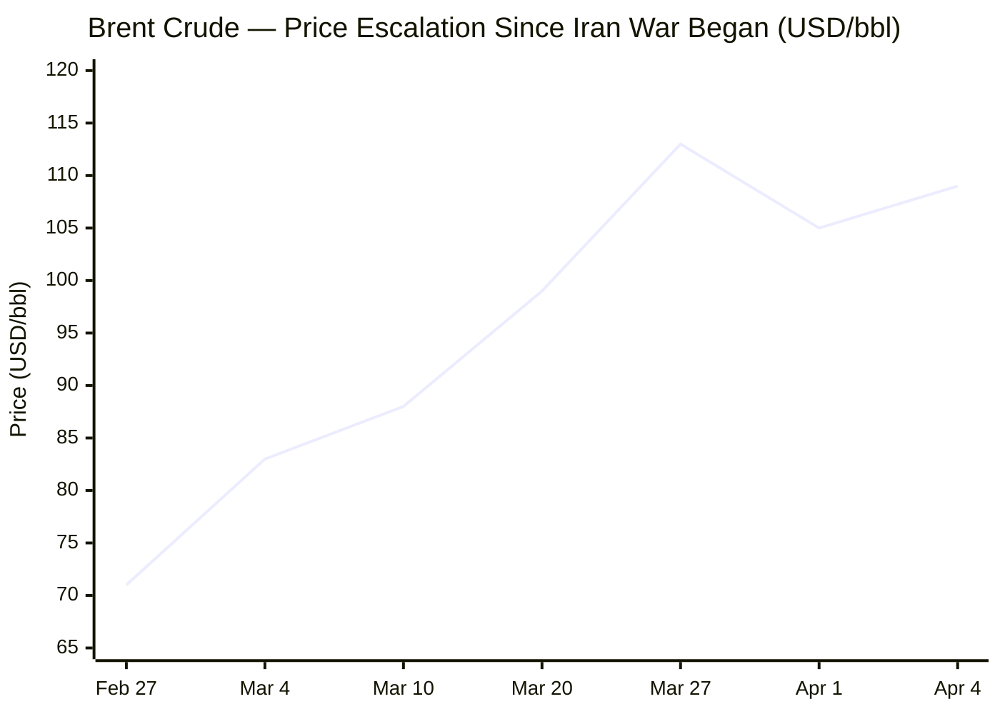
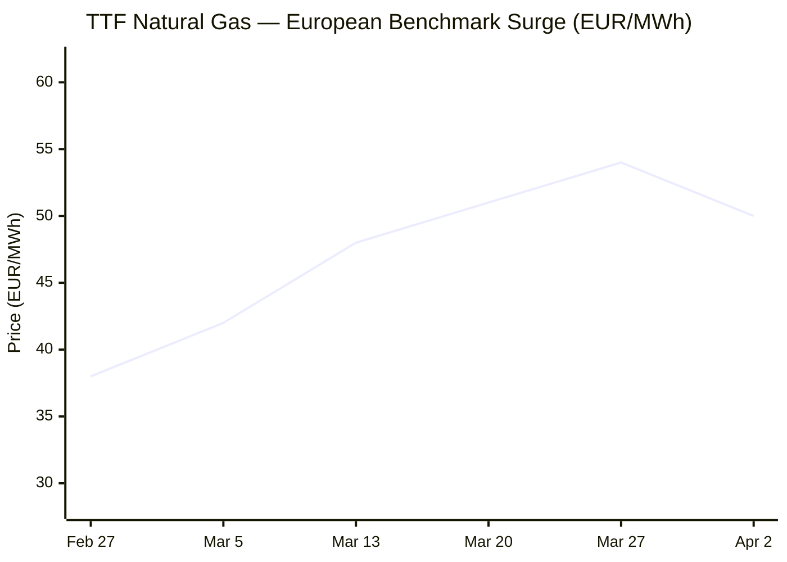

---

# 🌐 MORNING BRIEF
## Sunday, 05 April 2026 · 08:00 CET
### 14 stories across 5 categories

---

## DIGEST SUMMARY

| Category           | Stories | Alert Level |
|--------------------|---------|-------------|
| ⚔️ Ongoing Wars    | 4       | 🔴          |
| 💼 Business        | 3       | 🔴          |
| 🤖 Technology      | 2       | 🟡          |
| 🇪🇺 European Union  | 3       | 🔴          |
| 📈 Trends          | 2       | 🔴          |
| 📊 Key Data        | 8       | —           |

> **Alert Level key:** 🔴 High significance · 🟡 Developing · 🟢 Stable/Routine

---

## ⚔️ ONGOING WARS
*Conflict Analyst · 4 updates today*

### 1. US–Israel–Iran War: April 6 Deadline, Dual Aircraft Loss, Escalation Imminent [MULTI-SOURCE]

**Summary:** The US–Israel war against Iran entered its 36th day with severe escalation on 4 April. Two US military aircraft were downed: an F-15E Strike Eagle was shot down over Iran — one crew member recovered, the weapons systems officer remains the subject of an active search — and an A-10 Warthog crashed near the Strait of Hormuz, its pilot rescued. On Saturday, Trump posted a 48-hour ultimatum on Truth Social, warning Iran faces "hell" unless the Strait of Hormuz is fully reopened by 6 April. Indirect negotiations continue through Pakistan, Turkey, and Egypt, but Tehran's military command dismissed the ultimatum as "helpless, nervous and stupid." US and Israeli strikes hit the Mahshahr petrochemical zone and infrastructure near the Bushehr nuclear facility on 4 April.

**Significance:** The confirmed aircraft losses — the first US planes downed in combat over Iran — and the expiring deadline represent the conflict's most acute escalation point to date. Strikes on Iranian power plants or desalination infrastructure as of Monday would constitute a major threshold crossing, carrying severe humanitarian, legal, and market consequences, and would likely extend the Hormuz closure well beyond any foreseeable diplomatic settlement.

**Sources:**
- [CBS News — Trump warns Iran: 48 hours before "all hell will reign down"](https://www.cbsnews.com/news/trump-reminds-iran-ultimatum-reopen-strait-of-hormuz/) · 4 April 2026
- [NPR — Iran war enters its 6th week as military searches for downed jet crew member](https://www.npr.org/2026/04/04/nx-s1-5773436/iran-war-updates) · 4 April 2026
- [Fortune — Trump warns Iran it has 48 hours](https://fortune.com/2026/04/04/trump-warning-iran-war-48-hours-deadline-strait-of-hormuz/) · 4 April 2026

---

### 2. Strait of Hormuz: First Western Vessel Transits; IRGC Attacks MSC Ship [MULTI-SOURCE]

**Summary:** A French-owned vessel became the first Western ship permitted to transit the Strait of Hormuz since the conflict began — a signal of selective Iranian tolerance for non-US/Israeli-linked traffic. On 4 April, the IRGC claimed to have struck the MSC Ishyka with a drone, asserting Israeli ownership links; the attack is unverified. Traffic through the Strait has fallen from approximately 130 ships per day pre-war to six or fewer daily. Iran has reportedly demanded payments of up to $2 million per crossing in Chinese yuan. Iraq was granted exemption on Saturday, potentially unlocking up to 3 million barrels per day of Iraqi crude flows. A framework with Oman for monitoring transit remains under discussion.

**Significance:** The selective tolling and conditional exemption system represents an unprecedented institutionalisation of Iranian control over an international waterway. If codified, this would have lasting consequences for freedom of navigation law, global insurance premiums, and the post-war order in the Persian Gulf.

**Sources:**
- [Wikipedia — 2026 Strait of Hormuz Crisis](https://en.wikipedia.org/wiki/2026_Strait_of_Hormuz_crisis) · Updated 5 April 2026
- [UPI — First Western shipping vessel transits Strait of Hormuz since start of war](https://www.upi.com/Top_News/World-News/2026/04/04/ukraine-russia-market-attack/4891775317876/) · 3 April 2026

---

### 3. Ukraine–Russia: Record Glide Bomb Campaign, Refinery Strikes, Nikopol Market Attack [MULTI-SOURCE]

**Summary:** Russian forces struck a covered market in Nikopol with a drone on 4 April, killing five civilians and wounding 25. Russian forces deployed a record 7,987 glide bombs in March — the largest monthly total ever recorded. Ukraine struck a Lukoil refinery with domestically produced Flamingo drones despite acknowledged signals from Western allies to suspend refinery strikes as global fuel prices surge. Ukraine's intelligence chief Budanov confirmed receiving such signals from unspecified foreign partners. On the diplomatic front, Zelensky met Erdogan in Istanbul; US envoys Witkoff and Kushner are expected in Kyiv after Easter. Russia's ISW-assessed advance rate slowed to 5.5 sq km per day in Q1 2026, down from 14.9 sq km per day a year earlier.

**Significance:** The Russia–Ukraine theatre is being reshaped by the Iran war's energy dynamics: Western allies are applying pressure on Kyiv to protect a global fuel supply chain already in crisis, while Russia continues to systematically target civilian infrastructure.

**Sources:**
- [Kyiv Independent — Ukraine reportedly strikes Russian Lukoil refinery, defying calls to ease attacks](https://kyivindependent.com/) · 5 April 2026
- [Al Jazeera — At least 15 killed in Russian attacks as Zelensky meets Erdogan](https://www.aljazeera.com/news/2026/4/4/1997) · 4 April 2026
- [Al Jazeera — Ukraine slows enemy advances, liberates land, drains Russia's war chest](https://www.aljazeera.com/features/2026/4/3/ukraine-slows-enemy-advances-liberates-land-drains-russias-war-chest) · 3 April 2026

---

### 4. Lebanon–Hezbollah: Displacement Crisis Deepens; Over One Million Displaced

**Summary:** Israeli airstrikes in Lebanon on 4 April killed at least 23 people as Israel expanded its military campaign against Iran-backed Hezbollah. Defence Minister Israel Katz stated that approximately 600,000 displaced northern-border residents will not be permitted to return until security guarantees are in place; he offered no timeline. More than one million people are now displaced across Lebanon, with a humanitarian crisis deepening rapidly. Israel has stepped up operations against Hezbollah positions simultaneously with continued strikes inside Iran, treating Lebanon as an integrated front in the broader regional conflict.

**Significance:** Lebanon is becoming a permanent secondary front in the US–Israel–Iran war. Sustained civilian displacement on this scale is intensifying pressure from European governments and the UN, with no ceasefire framework on the horizon.

**Sources:**
- [NPR — Iran war enters its 6th week](https://www.npr.org/2026/04/04/nx-s1-5773436/iran-war-updates) · 4 April 2026
- [Britannica — 2026 Iran War](https://www.britannica.com/event/2026-Iran-Conflict) · Updated 5 April 2026

---

## 💼 BUSINESS
*Business Analyst · 3 updates today*

### 1. Brent Surges 7.8% on Friday as Trump Ultimatum Hardens; IEA Warns April Supply Cliff [MULTI-SOURCE]

**Summary:** Brent crude jumped 7.8% to $109.03/bbl on 4 April — its fourth session above $100 since the conflict began — as markets priced in Trump's April 6 deadline for strikes on Iranian power infrastructure. WTI rose 11.4% to $111.54/bbl. IEA Executive Director Fatih Birol warned that April will be "much worse than March," as pre-war in-transit cargo stocks reach exhaustion; he described the crisis as the largest energy supply disruption in history, exceeding the combined impact of the 1973 and 1979 oil shocks in volume terms. Brent recorded a 55%+ gain in March, the largest monthly surge since the contract's 1988 inception. Goldman Sachs upgraded its Q2 Brent forecast to $110/bbl, warning that if Hormuz flows remain at 5% of normal for ten weeks, daily prices will likely exceed the 2008 record of $147/bbl.

**Market signal:** Strongly bearish for global growth. The energy price trajectory is driving stagflation risk across import-dependent economies, reinforcing the case for near-term demand destruction while the Hormuz crisis remains unresolved.

**Sources:**
- [CNBC — Oil supply crunch will worsen in April, IEA warns](https://www.cnbc.com/amp/2026/04/01/oil-price-iea-fatih-birol-brent-iran-strait-hormuz.html) · 1 April 2026
- [CNBC — Trump's Iran war speech paints a grim picture for oil markets](https://www.cnbc.com/2026/04/02/trumps-iran-war-speech-oil-price-strait-hormuz.html) · 2 April 2026
- [CBS News — Live Updates: Iran war 4 April](https://www.cbsnews.com/live-updates/iran-war-us-trump-warns-more-coming-oil-gas-strait-hormuz/) · 4 April 2026

---

### 2. Stagflation Clock Ticks: ECB April 30 Meeting Now a Live Rate Decision [MULTI-SOURCE]

**Summary:** The ECB confirmed at its 19 March meeting that eurozone inflation is now projected to average 2.6% in 2026, with a Q2 peak at 3.1%, while GDP growth has been revised down to 0.9% for the full year — equivalent to a 0.3 percentage point cut from pre-war projections. Multiple governing council members have moved beyond neutral language: Belgium's Wunsch called an April hike "not out of the question"; Estonia's Muller said he "cannot rule out" action; the Bundesbank's Nagel backed tightening if energy pressures persist. Goldman Sachs and Barclays now expect two 25-basis-point hikes by June, pushing the deposit rate to 2.5%. The IMF separately confirmed that every 10% rise in energy prices adds approximately 0.5pp to global inflation. The eurozone economy grew just 0.2% in Q4 2025.

**Market signal:** Bearish for European rate-sensitive assets and equities. A stagflation premium is increasingly embedded in eurozone bond markets; the April 30 meeting could mark the ECB's first rate hike in an energy-driven stagflation environment — a scenario with no clean precedent in the post-GFC era.

**Sources:**
- [EU News — ECB warns the Middle East war will shave 0.3pp off 2026 growth](https://www.eunews.it/en/2026/04/02/ecb-warns-the-middle-east-war-will-shave-0-3-pct-pts-off-2026-growth/) · 2 April 2026
- [CNBC — ECB ready to hike rates even if inflation surge is short-lived, Lagarde says](https://www.cnbc.com/2026/03/25/ecb-rate-hikes-inflation-forecasts-christine-lagarde-iran-war.html) · 25 March 2026
- [Bloomberg — ECB's Muller Can't Rule Out Interest-Rate Hike in April](https://www.bloomberg.com/news/articles/2026-03-31/ecb-s-muller-can-t-rule-out-interest-rate-hike-in-april) · 31 March 2026

---

### 3. Nvidia Makes $2bn Marvell Investment; TSMC Sold Out Through 2028 at 3nm

**Summary:** Nvidia invested $2 billion in Marvell Technology and announced integration via NVLink Fusion connectivity, expanding its AI infrastructure ecosystem beyond Nvidia-only hardware. Marvell shares rose 6.9% on the news; broader semiconductor stocks rallied sector-wide. Separately, TSMC faces a severe 3nm capacity shortage, with fabs sold out through 2028. TSMC is planning a massive "GigaFab" in Arizona and has begun 3nm production in Japan to relieve demand. Chinese domestic chipmakers, meanwhile, captured 41% of China's AI accelerator market in 2025 — SMIC posted record revenue of $9.3bn; CXMT (memory) surged 130% to $8bn — as US export controls accelerate domestic substitution.

**Market signal:** Bullish for AI infrastructure ecosystem stocks and NVLink-adjacent names; cautiously bearish for Nvidia's China market positioning as domestic Chinese competition accelerates rapidly.

**Sources:**
- [Distill Intelligence — Semiconductors & AI Chips Weekly Briefing, 3 April 2026](https://www.distillintelligence.com/briefings/semiconductors-ai-chips-2026-04-03) · 3 April 2026
- [CNBC — Chinese chip firms hit record high revenue driven by AI boom and US curbs](https://www.cnbc.com/2026/04/03/chinese-chip-firms-record-revenue-ai-boom-us-curbs.html) · 3 April 2026

---

## 🤖 TECHNOLOGY
*Technology Analyst · 2 updates today*

### 1. EU AI Act Digital Omnibus: Trilogue Targets 28 April Political Agreement [MULTI-SOURCE]

**Summary:** The Digital Omnibus AI legislation has entered its decisive trilogue phase. The Council agreed its position on 13 March; the European Parliament confirmed its position in plenary on 26 March. The Cypriot Presidency is targeting a political agreement at the second trilogue session on 28 April — a compressed timetable driven by the AI Act's 2 August 2026 general application date. Both co-legislators align around December 2027 (standalone high-risk AI systems) and August 2028 (product-embedded systems) as fixed compliance deadlines. Contested issues include centralisation of oversight under the EU AI Office, a proposed prohibition on AI-generated non-consensual intimate imagery, and proposed amendments to GDPR definitions of personal data — the latter drawing sharp criticism from Amnesty International and civil society groups as a potential weakening of EU privacy protections.

**Analyst note:** A confirmed April agreement would be among the fastest trilogue conclusions in recent EU legislative history and would provide long-sought compliance clarity for the European AI industry ahead of August 2026 obligations — critical given the concurrent pressure to demonstrate EU competitiveness versus US and Chinese AI ecosystems.

**Sources:**
- [OneTrust — How the EU Digital Omnibus Reshapes AI Act Timelines and Governance in 2026](https://www.onetrust.com/blog/how-the-eu-digital-omnibus-reshapes-ai-act-timelines-and-governance-in-2026/) · 1 April 2026
- [Lewis Silkin — The latest on the Digital Omnibus on AI](https://www.lewissilkin.com/insights/2026/04/01/the-latest-on-the-digital-omnibus-on-ai-102momk) · 1 April 2026
- [Amnesty International — How EU proposals to "simplify" tech laws roll back our rights](https://www.amnesty.org/en/latest/news/2026/04/eu-simplification-laws/) · 2 April 2026

---

### 2. Chinese AI Chip Domestic Substitution Accelerates; Bifurcation of Global AI Supply Chain Deepens

**Summary:** Chinese semiconductor firms have now institutionalised their AI compute ecosystem under the pressure of US export controls. SMIC revenue grew 16% to a record $9.3bn in 2025; CXMT memory revenue surged 130% to $8bn; Moore Threads guided 2025 revenue 231–247% higher. Chinese domestic GPU makers now hold 41% of China's AI accelerator market, with Nvidia falling to 55%. Despite this momentum, Chinese producers remain locked out of advanced ASML High-NA EUV tools and cannot manufacture sub-7nm chips at scale, maintaining a critical technology gap at the frontier. US export controls are expected to tighten further in 2026, including possible moves against Huawei's Ascend chip line.

**Analyst note:** The US export-control playbook has succeeded in limiting Chinese access to frontier AI compute but is simultaneously accelerating a structural bifurcation of global semiconductor supply chains — creating a parallel Chinese AI hardware ecosystem that may prove increasingly resilient over the medium term.

**Sources:**
- [CNBC — Chinese chip firms hit record high revenue driven by AI boom and US curbs](https://www.cnbc.com/2026/04/03/chinese-chip-firms-record-revenue-ai-boom-us-curbs.html) · 3 April 2026
- [Distill Intelligence — Semiconductors & AI Chips Weekly Briefing](https://www.distillintelligence.com/briefings/semiconductors-ai-chips-2026-04-03) · 3 April 2026

---

## 🇪🇺 EUROPEAN UNION
*EU Affairs Analyst · 3 updates today*

### 1. ECB Bulletin Quantifies Iran War Damage: −0.3pp GDP, Inflation Peak Approaching [MULTI-SOURCE]

**Summary:** The ECB's latest economic bulletin formally quantified the Iran war's impact on the eurozone: −0.3 percentage points of GDP growth for 2026, bringing the full-year forecast to 0.9%. Inflation is projected to spike to 3.1% in Q2 2026 as energy cost pass-through moves through utility bills, industrial goods, and services. In an adverse scenario (prolonged Hormuz closure), HICP could peak at 4% in 2026; in a severely adverse scenario incorporating lasting damage to Qatari LNG infrastructure, it could breach 6% in early 2027. The ECB held its deposit rate at 2.0% on 19 March but explicitly described the April 30 meeting as data-dependent. Markets are pricing approximately 72 basis points of total hikes in 2026.

**Legislative/policy stage:** ECB Governing Council meeting: 30 April 2026. A rate decision is live for the first time since the current deposit rate cycle began.

**Sources:**
- [EU News — ECB warns the Middle East war will shave 0.3pp off 2026 growth](https://www.eunews.it/en/2026/04/02/ecb-warns-the-middle-east-war-will-shave-0-3-pct-pts-off-2026-growth/) · 2 April 2026
- [Euronews — Is Europe sleepwalking into its worst gas crisis since 2022?](https://www.euronews.com/business/2026/03/27/is-europe-sleepwalking-into-its-worst-gas-crisis-since-2022) · 27 March 2026

---

### 2. Meloni in Doha and Abu Dhabi: First EU Leader to Visit Gulf Since Iran War

**Summary:** Italian Prime Minister Giorgia Meloni conducted a two-day diplomatic mission (4–5 April) to Saudi Arabia, Qatar, and the UAE — the first EU, G20, and NATO leader to visit the Gulf region since the Iran war began. The primary objective is securing alternative LNG supplies for Italy, which sources approximately 40% of its LNG from Qatar. Meloni and Qatari emir Sheikh Tamim jointly reaffirmed the necessity of reopening the Strait of Hormuz and discussed bilateral energy supply guarantees. The visit was unannounced for security reasons. Italy has partially offset domestic price pressure by extending cuts to fuel excise duties through 30 April.

**Legislative/policy stage:** No formal EU mandate; bilateral national energy diplomacy. European Commission is separately developing emergency supply diversification and storage protocols.

**Sources:**
- [CBS News — Live Updates: Iran war 4 April](https://www.cbsnews.com/live-updates/iran-war-us-trump-warns-more-coming-oil-gas-strait-hormuz/) · 4 April 2026
- [Fortune — Trump warns Iran it has 48 hours](https://fortune.com/2026/04/04/trump-warning-iran-war-48-hours-deadline-strait-of-hormuz/) · 4 April 2026

---

### 3. EU Gas Storage at 28.4%; Goldman Raises Q2 TTF Forecast to €72/MWh [MULTI-SOURCE]

**Summary:** European underground gas storage stood at 28.4% capacity (325 TWh) as of 24 March — five percentage points below the prior-year level and well beneath the five-year seasonal average. Germany is at 22.3%; France 22.1%; the Netherlands a critical 6.0%. Goldman Sachs raised its Q2 2026 TTF forecast to €72/MWh, up from €63/MWh, warning that summer injection will require Europe to outbid Asian LNG buyers for spot cargoes. In a severely adverse scenario incorporating lasting damage to Qatari infrastructure, Goldman estimates summer TTF could sustain above €100/MWh. Spain has cushioned domestic exposure by halving VAT on most energy products; Germany faces a 25% month-on-month diesel price shock.

**Legislative/policy stage:** European Commission is examining emergency storage-filling mechanisms. Summer 2026 injection season is critical: if storage does not reach adequate levels by November, Europe faces a structurally exposed winter 2026–27.

**Sources:**
- [Euronews — Is Europe sleepwalking into its worst gas crisis since 2022?](https://www.euronews.com/business/2026/03/27/is-europe-sleepwalking-into-its-worst-gas-crisis-since-2022) · 27 March 2026
- [EU Commission Digital Strategy — AI Act](https://digital-strategy.ec.europa.eu/en/policies/regulatory-framework-ai) · Accessed April 2026

---

## 📈 TRENDS
*Trends Analyst · 2 updates today*

### 1. Global Fertiliser Shock: Spring Planting Season at Risk Across Africa and Asia [MULTI-SOURCE]

**Summary:** The Hormuz closure has severed approximately one-third of globally traded fertiliser flows. Urea prices have risen 40% since 28 February, with QAFCO — the world's largest urea supplier, providing 14% of global supply — halting production after Qatar declared force majeure on LNG exports. Bangladesh shut four of five fertiliser factories; India cut output at three urea plants; US port urea prices rose 32% in the first week of March alone. The UN FAO has identified a three-month window before planting disruptions cascade into yield losses for the 2026–27 crop cycle. Morningstar analysts project nitrogen fertiliser prices could roughly double if disruptions persist; phosphate prices could rise 50%. Sub-Saharan Africa (particularly Ethiopia, Sudan, Kenya), South Asia (India, Bangladesh, Pakistan), and Brazil face the greatest exposure.

**Horizon:** Short-to-medium-term. Immediate risk to Northern Hemisphere spring planting (April–May 2026); medium-term yield reductions likely to materialise in Q3–Q4 2026; global food price inflation expected to feed into 2027 consumer baskets.

**Sources:**
- [Al Jazeera — Not just energy: How the Iran war could trigger a global food crisis](https://www.aljazeera.com/economy/2026/3/18/not-just-energy-how-the-iran-war-could-trigger-a-global-food-crisis) · Updated April 2026
- [PBS NewsHour — "The planting season is now", but war in Iran has sparked a global fertiliser shortage](https://www.pbs.org/newshour/world/the-planting-season-is-now-but-war-in-iran-has-sparked-a-global-fertilizer-shortage) · April 2026
- [Carnegie Endowment — Fertiliser isn't getting through the Strait of Hormuz](https://carnegieendowment.org/emissary/2026/03/fertilizer-iran-hormuz-food-crisis) · April 2026

---

### 2. Ukraine Exports Drone Warfare Doctrine to Gulf States; New Military-Technology Axis Emerges

**Summary:** President Zelensky has signed drone warfare technology transfer agreements with Saudi Arabia, the UAE, Qatar, Jordan, Iraq, and Bahrain, offering Ukrainian counter-drone systems and layered air defence expertise in exchange for joint production support and Gulf financing. Ukraine's defence ministry confirmed that Q1 2026 drone ammunition procurement already exceeded half of all 2025 purchases; new bomber drones capable of penetrating 20km through electronic warfare systems are in operational testing. Ukraine has separately commenced exports of its low-cost Sting counter-drone systems — battlefield-tested against Russian Shahed-type threats — a capability directly relevant to the Gulf states' ongoing Iranian drone exposure. The 12th Azov Brigade deployed an unmanned Zmiy firefighting ground vehicle in combat for the first time.

**Horizon:** Medium-to-long-term. Ukraine is pivoting from military aid recipient to drone technology exporter, with significant implications for Gulf defence procurement realignment, post-war Ukrainian industrial policy, and the geopolitical triangulation of Gulf states between US, Russian, and Ukrainian influence.

**Sources:**
- [Al Jazeera — Ukraine slows enemy advances, liberates land, drains Russia's war chest](https://www.aljazeera.com/features/2026/4/3/ukraine-slows-enemy-advances-liberates-land-drains-russias-war-chest) · 3 April 2026
- [Kyiv Independent — News Feed](https://kyivindependent.com/) · 5 April 2026

---

## 📊 KEY DATA OF THE DAY
*Data Officer · 8 indicators*

| Indicator              | Value           | Δ vs Prior              | Source        | URL |
|------------------------|-----------------|-------------------------|---------------|-----|
| Brent Crude (spot)     | $109.03/bbl     | +7.8% (4 Apr session)   | CNBC/CBS News | [link](https://www.cnbc.com/amp/2026/04/01/oil-price-iea-fatih-birol-brent-iran-strait-hormuz.html) |
| WTI Crude (spot)       | $111.54/bbl     | +11.4% (4 Apr session)  | CBS News      | [link](https://www.cbsnews.com/live-updates/iran-war-us-trump-warns-more-coming-oil-gas-strait-hormuz/) |
| TTF Natural Gas (EU)   | €49.70/MWh      | +31% (MTM; Apr 2 ref.)  | Yahoo Finance | [link](https://finance.yahoo.com/quote/TTF=F/history/) |
| S&P 500                | 6,582.69        | +0.11% (2 Apr close)    | Yahoo Finance | [link](https://finance.yahoo.com/quote/%5EGSPC/history/) |
| VIX                    | 26.19           | Elevated vs 18 pre-war  | Yahoo Finance | [link](https://finance.yahoo.com/quote/TTF=F/history/) |
| Gold (spot)            | $4,702.70/oz    | +0.49% (4 Apr)          | Yahoo Finance | [link](https://finance.yahoo.com/quote/%5EGSPC/history/) |
| EUR/USD                | ~1.1515         | −2.0% MTD (March–Apr)   | BYDFi / FRED | [link](https://www.bydfi.com/en/cointalk/eur-usd-forex-analysis-2026-update) |
| ECB Deposit Rate       | 2.00%           | Held (19 March 2026)    | ECB / CNBC   | [link](https://www.cnbc.com/2026/03/25/ecb-rate-hikes-inflation-forecasts-christine-lagarde-iran-war.html) |

**Data commentary:** Friday's Brent session (+7.8%) and WTI surge (+11.4%) reflect markets pricing in the April 6 deadline with growing conviction. The VIX at 26 — elevated relative to its sub-18 pre-war baseline — signals persistent systemic uncertainty ahead of Monday's decision point. Gold's move to a new four-year high above $4,700/oz confirms safe-haven flows intensifying as the deadline approaches. EUR/USD weakness encodes Europe's structural energy import vulnerability: with TTF trending toward Goldman's €72/MWh Q2 forecast, and the ECB's April 30 meeting live for the first rate action since the cycle turn, the eurozone faces a simultaneously worsening growth shock and inflation overshoot that the current 2.00% deposit rate is insufficiently calibrated to address.

---

## 📉 CHARTS

---

## ⚙️ AGENT METADATA

| Field               | Value                                  |
|---------------------|----------------------------------------|
| Agent version       | MORNING BRIEF v1.0                     |
| Run timestamp       | 2026-04-05T08:00:00+02:00              |
| Sources queried     | 11 / 11                                |
| Stories surfaced    | ~28                                    |
| Stories published   | 14                                     |
| Languages processed | EN, FR, DE                             |
| Output language     | English                                |

---
*MORNING BRIEF is an AI-assisted digest. All summaries are paraphrased from original sources. Verify time-sensitive information at the linked URLs before acting.*
