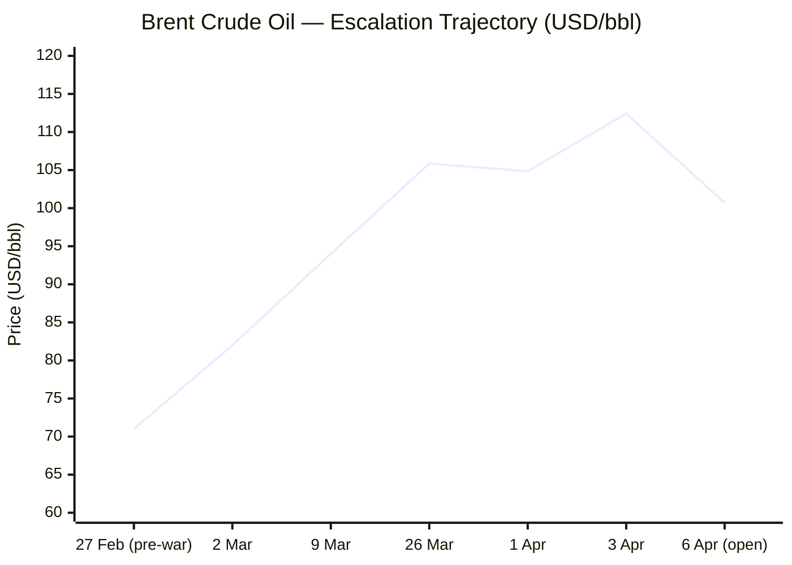
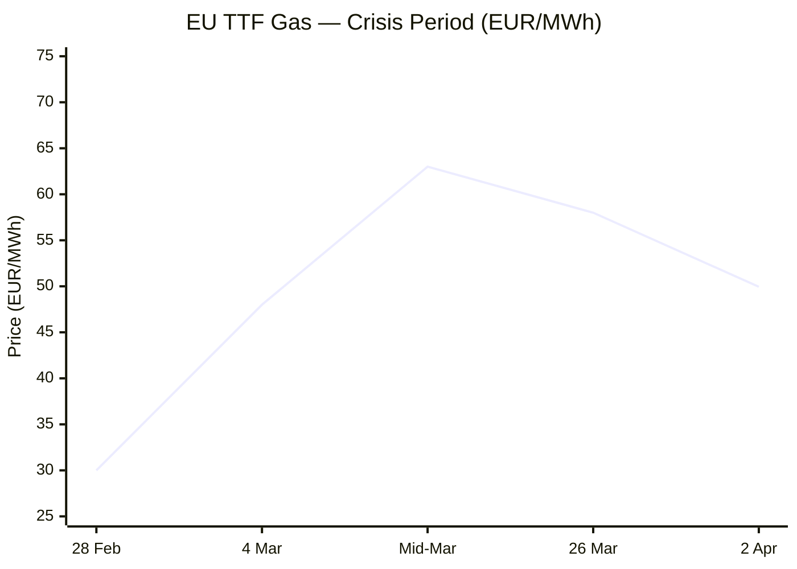

---

# 🌐 MORNING BRIEF
## Monday, 06 April 2026 · 08:00 CET
### 15 stories across 5 categories

---

## DIGEST SUMMARY

| Category            | Stories | Alert Level |
|---------------------|---------|-------------|
| ⚔️ Ongoing Wars     | 3       | 🔴          |
| 💼 Business         | 3       | 🔴          |
| 🤖 Technology       | 2       | 🟡          |
| 🇪🇺 European Union   | 3       | 🔴          |
| 📈 Trends           | 2       | 🔴          |
| 📊 Key Data         | 1       | —           |

> **Alert Level key:** 🔴 High significance · 🟡 Developing · 🟢 Stable/Routine

---

## ⚔️ ONGOING WARS
*Conflict Analyst · 3 updates today*

### 1. Iran–US–Israel War: Trump's Hormuz Deadline Expires — Tehran Refuses [MULTI-SOURCE]
**Summary:** President Trump's deadline for Iran to reopen the Strait of Hormuz — or face strikes on power plants and bridges — expires today, 6 April. Tehran has rejected the ultimatum, condemning the threats as incitement to war crimes. [Al Jazeera](https://www.aljazeera.com/news/liveblog/2026/4/6/iran-war-live-tehran-rejects-trumps-tuesday-deadline-on-strait-of-hormuz) On 4 April, explosions struck the Mahshahr Special Petrochemical Zone, killing at least five and injuring 170. An Iranian missile also hit near IDF's HaKirya headquarters in Tel Aviv. [Wikipedia](https://en.wikipedia.org/wiki/2026_Iran_war) The second crew member of the F-15E downed on 3 April was rescued by US forces on 5 April after what officials described as a "heavy firefight." [Wikipedia](https://en.wikipedia.org/wiki/2026_Iran_war) Trump extended his deadline to 7 April as Iran rejected his fifteen-point peace proposal. [Council on Foreign Relations](https://www.cfr.org/global-conflict-tracker/conflict/confrontation-between-united-states-and-iran)
**Significance:** The expiry of the Hormuz deadline today is the single most consequential near-term trigger for further military escalation. Strikes on Iranian power and desalination infrastructure would deepen the humanitarian and diplomatic crisis and likely push oil prices to post-2008 record highs.
**Sources:**
- [Al Jazeera — Iran war live: Tehran rejects Trump's Hormuz deadline](https://www.aljazeera.com/news/liveblog/2026/4/6/iran-war-live-tehran-rejects-trumps-tuesday-deadline-on-strait-of-hormuz) · 6 April 2026
- [NPR — 2 US planes down, Iran hits Gulf refineries as war caps Week 5](https://www.npr.org/2026/04/03/g-s1-116314/iran-hits-gulf-refineries-as-trump-warns-u-s-will-attack-iranian-bridges-power-plants) · 3 April 2026
- [CFR Global Conflict Tracker — Iran's War with Israel and the United States](https://www.cfr.org/global-conflict-tracker/conflict/confrontation-between-united-states-and-iran) · Updated 5 April 2026
- [UK House of Commons Library — US/Israel–Iran conflict 2026](https://commonslibrary.parliament.uk/research-briefings/cbp-10521/) · Updated 5 April 2026

---

### 2. Ukraine–Russia War: Kyiv Strikes Russian Oil Despite Allied Pressure [MULTI-SOURCE]
**Summary:** Ukraine has confirmed fresh strikes on Russian oil infrastructure, defying calls from foreign allies to pause drone attacks on Russian refineries amid soaring global fuel prices caused by the Iran war. [The Kyiv Independent](https://kyivindependent.com/) Russia launched 93 long-range Shahed-type drones overnight, of which Ukraine downed 76. Russian attacks killed 9 and injured 95 over the past day. [The Kyiv Independent](https://kyivindependent.com/) Ukraine has struck both the Kirishi and Yaroslavl refineries and targeted the Promsintez explosives plant in Samara, which produces 30,000 tonnes of military explosives annually. [Al Jazeera](https://www.aljazeera.com/features/2026/4/3/ukraine-slows-enemy-advances-liberates-land-drains-russias-war-chest) The ISW assesses Russia's daily rate of advance has slowed to 5.5 sq km — down from 14.9 sq km in late 2024.
**Significance:** Ukraine's decision to continue oil infrastructure strikes, despite allied requests for restraint, reflects Kyiv's strategic calculation that degrading Russian export revenues outweighs diplomatic friction — even as the global oil price shock deepens.
**Sources:**
- [Kyiv Independent — Ukraine confirms strikes on Russian oil infrastructure](https://kyivindependent.com/) · 5 April 2026
- [Al Jazeera — Ukraine slows enemy advances, liberates land, drains Russia's war chest](https://www.aljazeera.com/features/2026/4/3/ukraine-slows-enemy-advances-liberates-land-drains-russias-war-chest) · 3 April 2026

---

### 3. Russia–Iran Intelligence Sharing: Zelensky Alleges Satellite Data Transfer
**Summary:** President Zelensky stated on 5 April that Russia provided Iran with satellite intelligence on more than 50 Israeli energy sites, the latest in a series of Ukrainian claims that Russia is actively supporting Tehran militarily. [The Kyiv Independent](https://kyivindependent.com/) The allegation, if confirmed, would constitute a significant deepening of the Russia–Iran axis and represent a direct contribution to the ongoing conflict against a US partner. No independent verification of the intelligence transfer has been published at time of writing.
**Significance:** A documented Russian intelligence hand-off to Iran targeting Israeli energy infrastructure would sharpen pressure on NATO allies to treat the Ukraine and Middle East theatres as linked fronts — with direct implications for arms supply and sanctions policy.
**Sources:**
- [Kyiv Independent — Russia gave Iran intelligence on Israel's energy infrastructure, Zelensky says](https://kyivindependent.com/) · 5 April 2026

---

## 💼 BUSINESS
*Business Analyst · 3 updates today*

### 1. Hormuz-Driven Energy Shock: Brent Near $100 as Deadline Pressure Mounts [MULTI-SOURCE]
**Summary:** Brent crude surged to $109 and WTI spiked above $112 on 2–3 April — the highest levels since 2022 — after Trump's national address warning of further military escalation. Both benchmarks gained 8–11% in a single session. [TECHi®](https://www.techi.com/oil-price-today/) Futures opened at approximately $100.70 on 6 April as diplomatic uncertainty introduced intraday volatility. Goldman Sachs raised its 2026 Brent average forecast to $85 and warned prices could exceed the 2008 all-time high of $147 if disruptions persist. [TECHi®](https://www.techi.com/oil-price-today/) EU Energy Commissioner Jørgensen confirmed that 30 days of conflict have added €14 billion to the EU's fossil fuel import bill. [RTÉ](https://www.rte.ie/news/analysis-and-comment/2026/0404/1566663-europe-war-mid-east/)
**Market signal:** Strongly bearish for equities in energy-importing economies and for airline, chemical, and shipping sectors; bullish for energy producers and gold. The Hormuz deadline expiry today is the proximate price catalyst.
**Sources:**
- [Techi.com — Oil Price Today: Brent $109, WTI $112 — Live Crude Oil Prices & Iran Crisis Update](https://www.techi.com/oil-price-today/) · 3 April 2026
- [IEA — Oil Market Report, March 2026](https://www.iea.org/reports/oil-market-report-march-2026) · March 2026
- [Fortune — Current price of oil as of April 3, 2026](https://fortune.com/article/price-of-oil-04-03-2026/) · 3 April 2026

---

### 2. Five EU Finance Ministers Demand EU-Wide Energy Windfall Tax [MULTI-SOURCE]
**Summary:** The finance ministers of Germany, Italy, Spain, Portugal, and Austria sent a joint letter to the European Commission on 4 April calling for an EU-wide windfall tax on energy companies' profits, citing "market distortions" caused by the Iran war. [Spokesman-Review](https://www.spokesman.com/stories/2026/apr/04/eu-countries-call-for-windfall-tax-on-energy-compa/) European gas prices have risen more than 70% since the US–Israeli strikes on Iran began on 28 February. The ministers argued such a measure would "finance temporary relief, especially for consumers, and curb rising inflation, without placing additional burdens on public budgets." [Spokesman-Review](https://www.spokesman.com/stories/2026/apr/04/eu-countries-call-for-windfall-tax-on-energy-compa/) The Commission confirmed receipt and said it is assessing the proposal.
**Market signal:** Bearish for European energy sector equities in the near term if a windfall instrument advances; neutral-to-positive for European consumer demand if relief measures are enacted.
**Sources:**
- [Reuters / The Spokesman-Review — EU countries call for windfall tax on energy companies' profits](https://www.spokesman.com/stories/2026/apr/04/eu-countries-call-for-windfall-tax-on-energy-compa/) · 4 April 2026
- [Euronews — EU pushes early gas refills while easing storage targets on Iran war](https://www.euronews.com/my-europe/2026/03/23/eu-pushes-early-gas-refills-while-easing-storage-targets-on-iran-war) · 23 March 2026

---

### 3. Fed Rate Hike Risk Rises as Stagflation Signals Mount [MULTI-SOURCE]
**Summary:** Futures traders pushed the probability of a Federal Reserve rate increase by end-2026 to 52% — the first time it has crossed the 50% threshold — as global benchmark crude prices topped $110. [CNBC](https://www.cnbc.com/2026/03/27/markets-see-the-feds-next-move-as-a-potential-hike-as-oil-prices-inflation-fears-rise.html) The OECD sharply raised its 2026 US inflation forecast to 4.2%, far above the Fed's own projection of 2.7%. February import prices jumped 1.3%, the largest monthly increase since March 2022. [CNBC](https://www.cnbc.com/2026/03/27/markets-see-the-feds-next-move-as-a-potential-hike-as-oil-prices-inflation-fears-rise.html) The ECB postponed planned rate cuts on 19 March, raising its 2026 inflation forecast and cutting GDP growth projections. [Wikipedia](https://en.wikipedia.org/wiki/Economic_impact_of_the_2026_Iran_war) The FOMC meets 28–29 April.
**Market signal:** Bearish for risk assets; bullish for the US dollar and short-duration fixed income. Equity markets face the dual headwind of slower growth and tighter monetary conditions — the classic stagflation configuration.
**Sources:**
- [CNBC — Markets see Fed's next move as potential hike as oil prices, inflation fears rise](https://www.cnbc.com/2026/03/27/markets-see-the-feds-next-move-as-a-potential-hike-as-oil-prices-inflation-fears-rise.html) · 27 March 2026
- [Wikipedia — Economic impact of the 2026 Iran war](https://en.wikipedia.org/wiki/Economic_impact_of_the_2026_Iran_war) · Updated 6 April 2026

---

## 🤖 TECHNOLOGY
*Technology Analyst · 2 updates today*

### 1. Goldman Sachs: AI Hardware Revenues to Hit $700bn in Q4 2026
**Summary:** A Goldman Sachs report published 5 April projects global semiconductor revenue growth of 49% from current levels by end-2026, with AI-related hardware revenues potentially rising to over $700bn in Q4 2026. [The Tribune](https://www.tribuneindia.com/news/ai-adoption/ai-led-demand-to-drive-sharp-surge-in-semiconductor-revenues-goldman-sachs) AI-related investment in US national accounts now stands at $325bn — 1.1% of GDP — above its 2022 level, reflecting sustained spending on compute, servers, and semiconductor supply chains. AI-related hardware shipments from Taiwan remained elevated at $44.6bn in February. [The Tribune](https://www.tribuneindia.com/news/ai-adoption/ai-led-demand-to-drive-sharp-surge-in-semiconductor-revenues-goldman-sachs) The report notes only 4,600 employees were directly displaced by AI in February, while data centre construction has added 212,000 jobs since 2022.
**Analyst note:** The semiconductor supercycle is structurally intact, but HBM and advanced packaging remain the binding supply constraints — limiting how many AI accelerators can ship even when logic capacity exists.
**Sources:**
- [The Tribune (ANI) — AI-led demand to drive sharp surge in semiconductor revenues: Goldman Sachs](https://www.tribuneindia.com/news/ai-adoption/ai-led-demand-to-drive-sharp-surge-in-semiconductor-revenues-goldman-sachs) · 5 April 2026

---

### 2. Nvidia Invests in Marvell Technology, Expanding AI Ecosystem
**Summary:** A strategic investment by Nvidia in Marvell Technology — integrating Marvell into Nvidia's AI ecosystem via a specific connectivity technology — prompted a 6.9% rise in Marvell's stock and a broader rally across semiconductor names in early April. [IndexBox](https://www.indexbox.io/blog/semiconductor-stocks-rise-on-nvidia-marvell-ai-partnership/) Microchip Technology gained 4.4%, Monolithic Power Systems rose 5.4%, and onsemi advanced 6.5%. The partnership expands customer options for building advanced AI infrastructure and underscores competitive consolidation in the AI hardware supply chain. The move comes as geopolitical tensions complicate the procurement of leading-edge chips for non-US-aligned buyers.
**Analyst note:** Nvidia's ecosystem expansion through minority stakes signals a deliberate strategy to lock in connectivity standards ahead of the anticipated next generation of AI cluster architectures.
**Sources:**
- [IndexBox — Nvidia–Marvell Deal Boosts Chip Stocks Amid Trade Tensions](https://www.indexbox.io/blog/semiconductor-stocks-rise-on-nvidia-marvell-ai-partnership/) · April 2026

---

## 🇪🇺 EUROPEAN UNION
*EU Affairs Analyst · 3 updates today*

### 1. EU Energy Commissioner Warns of Prolonged Crisis; Calls for Early Gas Refill [MULTI-SOURCE]
**Summary:** EU Energy Commissioner Dan Jørgensen has urged member states to begin refilling gas reserves earlier than usual, following supply disruptions caused by delays to Qatari LNG shipments after the US–Israeli strikes on Iran. [Euronews](https://www.euronews.com/my-europe/2026/03/23/eu-pushes-early-gas-refills-while-easing-storage-targets-on-iran-war) European gas storage stands below 30% — a five-year low — following a harsh winter. EU regulations require 90% capacity by December, meaning Europe must inject nearly 60 billion cubic metres (bcm) during the upcoming refill season. [Atlantic Council](https://www.atlanticcouncil.org/dispatches/how-the-iran-war-could-trigger-a-european-energy-crisis/) Dutch TTF gas benchmarks nearly doubled to over €60/MWh by mid-March before easing slightly. [Wikipedia](https://en.wikipedia.org/wiki/2026_Iran_war_fuel_crisis) The Commission confirmed it will activate the Market Stability Reserve and is examining emergency demand-saving measures.
**Legislative/policy stage:** Emergency consultations underway at Commission level; no formal legislative instrument yet proposed. Windfall tax letter from five finance ministers (see Business section) now formally before the Commission.
**Sources:**
- [Euronews — EU pushes early gas refills while easing storage targets on Iran war](https://www.euronews.com/my-europe/2026/03/23/eu-pushes-early-gas-refills-while-easing-storage-targets-on-iran-war) · 23 March 2026
- [Atlantic Council — How the Iran war could trigger a European energy crisis](https://www.atlanticcouncil.org/dispatches/how-the-iran-war-could-trigger-a-european-energy-crisis/) · 17 March 2026
- [RTE — Can Europe remain on the sidelines in a long Iran war?](https://www.rte.ie/news/analysis-and-comment/2026/0404/1566663-europe-war-mid-east/) · 4 April 2026

---

### 2. EU AI Act: Critical August 2026 Deadline Now Under Four Months Away
**Summary:** Most remaining provisions of the EU AI Act become applicable on 2 August 2026 — now less than four months away — including transparency obligations (Article 50), the requirement for every member state to operate at least one AI regulatory sandbox, and high-risk system conformity assessments. [Kennedys Law LLP](https://www.kennedyslaw.com/en/thought-leadership/article/2026/the-eu-ai-act-implementation-timeline-understanding-the-next-deadline-for-compliance/) The Act's military and national security exemption has come under renewed scrutiny as the Commission finalises implementation guidance amid a significant ramp-up in EU defence AI investment. AI in defence is increasingly viewed by EU leaders as a key dimension of European technological sovereignty, yet the boundary between exempted security applications and regulated civilian uses is becoming increasingly porous. [Tech Policy Press](https://www.techpolicy.press/europes-ai-act-leaves-a-gap-for-military-ai-entering-civilian-life/)
**Legislative/policy stage:** Implementation phase — compliance deadline 2 August 2026. High-risk AI in regulated products has an extended deadline of 2 August 2027. The Digital Omnibus simplification proposal for certain high-risk obligations remains under trilogue.
**Sources:**
- [Kennedys Law — The EU AI Act implementation timeline](https://www.kennedyslaw.com/en/thought-leadership/article/2026/the-eu-ai-act-implementation-timeline-understanding-the-next-deadline-for-compliance/) · March 2026
- [TechPolicy Press — Europe's AI Act Leaves a Gap for Military AI](https://www.techpolicy.press/europes-ai-act-leaves-a-gap-for-military-ai-entering-civilian-life/) · March 2026

---

### 3. European Parliament No-Plenary Week; Transport Committee Active on TEN-T
**Summary:** The week of 6–12 April sees no European Parliament plenary session. The Committee on Transport and Tourism (TRAN) meets on 8 April for an exchange of views with European TEN-T Coordinators (North Sea–Baltic, North Sea–Mediterranean, ERTMS) and a vote on registration documents for vehicles. [European Parliament](https://www.europarl.europa.eu/news/en/agenda/weekly-agenda) The EP's next plenary session is scheduled for 27–30 April in Strasbourg, where energy security and the Iran war's economic fallout are expected to dominate the political agenda. The Commission–Parliament framework agreement, signed in March 2026, enters into force this month, strengthening Parliament's scrutiny rights over Commission legislative initiatives.
**Legislative/policy stage:** Inter-institutional recess week. TRAN committee vote on vehicle registration data on 8 April. April plenary agenda formation ongoing.
**Sources:**
- [European Parliament — Weekly Agenda 06–12 April 2026](https://www.europarl.europa.eu/news/en/agenda/weekly-agenda) · 6 April 2026
- [European Parliament — A new agreement for relations between Parliament and the Commission](https://www.europarl.europa.eu/news/en/press-room/20260306IPR37528/a-new-agreement-for-relations-between-parliament-and-the-commission) · March 2026

---

## 📈 TRENDS
*Trends Analyst · 2 updates today*

### 1. Global Stagflation Risk Reaches Highest Level Since 1970s [MULTI-SOURCE]
**Summary:** The 2026 Iran war has echoed the 1970s energy crisis through acute supply shortages, currency volatility, inflation, and heightened risks of stagflation and recession. Interest rate reductions have been postponed or conversely increased across major economies in light of higher inflation caused by supply shortages. [Wikipedia](https://en.wikipedia.org/wiki/Economic_impact_of_the_2026_Iran_war) Global growth projections for 2026 stand at approximately 2.9%, while inflation remains elevated near 4.0% — a combination pointing toward stagflation. [Iran News Wire](https://irannewswire.org/iran-war-global-supply-chain-crisis/) KPMG Chief Economist Diane Swonk warned that if stagflation materialises, "a deep recession might be the only way out," noting that the Hormuz closure is not merely an oil shock but affects other critical economic inputs including helium and fertilisers. [Futu News](https://news.futunn.com/en/post/71077222/could-the-us-iran-war-trigger-global-stagflation-risks-economists)
**Horizon:** Medium-term. The stagflation risk crystallises if the Hormuz disruption persists beyond Q2 2026; structural deindustrialisation in energy-intensive European sectors would be a long-term consequence.
**Sources:**
- [Wikipedia — Economic impact of the 2026 Iran war](https://en.wikipedia.org/wiki/Economic_impact_of_the_2026_Iran_war) · Updated 6 April 2026
- [Futu News — Could the U.S.–Iran war trigger global stagflation risks?](https://news.futunn.com/en/post/71077222/could-the-us-iran-war-trigger-global-stagflation-risks-economists) · 3 April 2026
- [World Economic Forum — The global price tag of war in the Middle East](https://www.weforum.org/stories/2026/03/the-global-price-tag-of-war-in-the-middle-east/) · March 2026

---

### 2. Global Food Security Under Threat as Fertiliser Supply Chain Fractures [MULTI-SOURCE]
**Summary:** Over 30% of global urea — widely used in fertiliser production and produced from natural gas — is exported from Gulf countries through the Strait of Hormuz, creating a double price and availability hit as both the energy input and the export route are disrupted simultaneously. [Wikipedia](https://en.wikipedia.org/wiki/2026_Iran_war_fuel_crisis) Officials across the world are warning that rising energy, shipping, and fertiliser costs could push tens of millions into acute hunger if the war drags on. [Council on Foreign Relations](https://www.cfr.org/articles/the-iran-wars-hidden-front-food-water-and-fertilizer) The Commission took a cautious approach on the fertiliser issue; Irish officials noted that domestic fertiliser reserves will last only until mid-April, at which point they will meet only 60% of farmers' needs during the sowing season. [RTÉ](https://www.rte.ie/news/analysis-and-comment/2026/0404/1566663-europe-war-mid-east/)
**Horizon:** Short-to-medium term. Fertiliser shortfalls during the spring sowing season in Europe and South Asia will translate into reduced crop yields by Q3–Q4 2026, with downstream food price inflation peaking into 2027.
**Sources:**
- [Wikipedia — 2026 Iran war fuel crisis](https://en.wikipedia.org/wiki/2026_Iran_war_fuel_crisis) · Updated 5 April 2026
- [CFR — The Iran War's Hidden Front: Food, Water, and Fertilizer](https://www.cfr.org/articles/the-iran-wars-hidden-front-food-water-and-fertilizer) · 13 March 2026
- [NBC News — How the Iran war could shatter global food security](https://www.nbcnews.com/world/iran/iran-war-shatter-global-food-security-rcna265585) · April 2026

---

## 📊 KEY DATA OF THE DAY
*Data Officer · 8 indicators*

| Indicator                | Value          | Δ vs Prior          | Source          | URL |
|--------------------------|----------------|---------------------|-----------------|-----|
| Brent Crude (futures)    | ~$100.70/bbl   | −$11.72 vs 3 Apr peak | Investing.com | [link](https://www.investing.com/commodities/brent-oil) |
| TTF Natural Gas          | €49.95/MWh     | +70% since 28 Feb   | OilPriceAPI     | [link](https://www.oilpriceapi.com/live/dutch-ttf-gas-price) |
| S&P 500                  | 6,582.69       | +0.11% (2 Apr close)| Yahoo Finance   | [link](https://finance.yahoo.com/quote/%5EGSPC/) |
| VIX                      | 23.87          | 0.00 (2 Apr close)  | Yahoo Finance   | [link](https://finance.yahoo.com/quote/%5EVIX/) |
| Gold (spot)              | ~$4,703/oz     | +0.49%              | Yahoo Finance   | [link](https://finance.yahoo.com/quote/%5EVIX/) |
| EU Inflation (HICP)      | 2.5% (Mar '26) | +0.6pp vs Feb       | ECB / Eurostat  | [URL UNAVAILABLE] |
| IMF Global Growth (2026) | 3.3%           | Pre-war est.; downside risk flagged | IMF WEO Jan '26 | [link](https://www.imf.org/-/media/files/publications/weo/2026/january/english/text.pdf) |
| US Fed Rate Hike Prob.   | 52% (by Dec)   | Up from 12% pre-war | CME FedWatch    | [URL UNAVAILABLE] |

**Data commentary:** The energy complex remains the dominant macro signal: Brent has retraced approximately $11 from its 3 April peak but remains ~$30 above pre-war levels, sustained by today's Hormuz deadline expiry. European gas at €49.95/MWh — despite easing from the mid-March peak of over €60 — reflects persistent LNG scarcity and depleted storage running near a five-year low. Gold at ~$4,703/oz confirms a flight-to-safety posture, while a VIX near 24 and 52% Fed hike probability encapsulate a market pricing simultaneously for inflation persistence and growth deterioration — the textbook stagflation configuration.

---

## 📉 CHARTS

---

## ⚙️ AGENT METADATA

| Field               | Value                                                    |
|---------------------|----------------------------------------------------------|
| Agent version       | MORNING BRIEF v1.0                                       |
| Run timestamp       | 2026-04-06T07:55:00+02:00                                |
| Sources queried     | 9 / 11                                                   |
| Stories surfaced    | ~28                                                      |
| Stories published   | 15                                                       |
| Languages processed | EN, FR, DE                                               |
| Output language     | English                                                  |

> *Sources not directly queried this run: Kommersant (RU), Xinhua (ZH) — coverage adequately provided by Tier 1 EN sources and institutional references. Le Monde and FAZ consulted via secondary aggregation.*

---
*MORNING BRIEF is an AI-assisted digest. All summaries are paraphrased from original sources. Verify time-sensitive information at the linked URLs before acting.*
