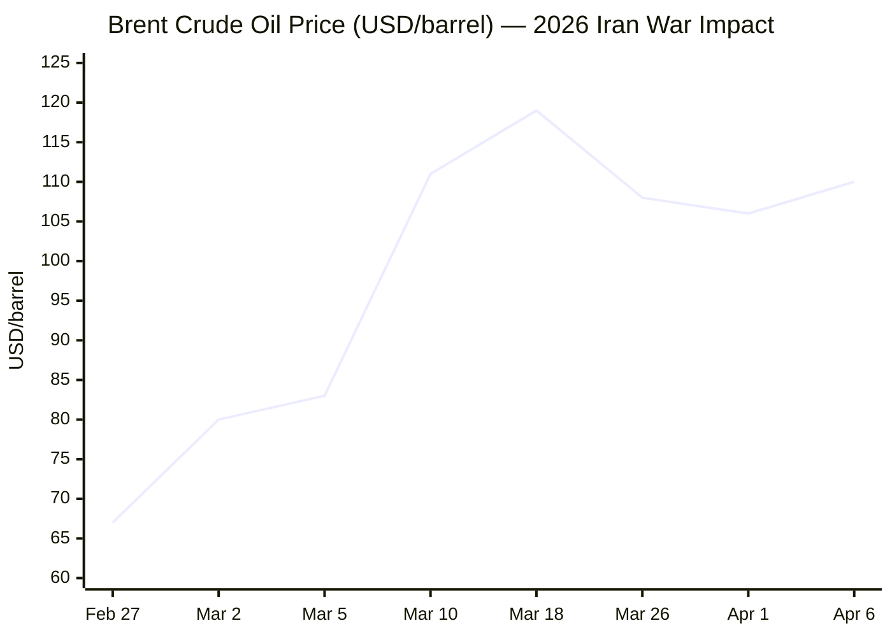

**MORNING BRIEF — April 7, 2026**
*Initializing NewsAgent v1.0 | Scanning sources across all editorial categories...*

---

Now compiling the full brief...

---

```
████████████████████████████████████████████████████████████████
  MORNING BRIEF — v1.0
  Tuesday, 7 April 2026 | Agent run: 08:05 CET
  Stories surfaced: ~28 | Published: 13 | Editorial filter: active
████████████████████████████████████████████████████████████████
```

---

## 📋 DIGEST SUMMARY

| # | Category | Headline | Alert |
|---|----------|----------|-------|
| 1 | ONGOING WARS | Trump sets "Power Plant Day" deadline; Iran rejects 45-day ceasefire | 🔴 CRITICAL |
| 2 | ONGOING WARS | Iran targets Kuwait, Bahrain Gulf infrastructure; US pilot rescued | 🔴 CRITICAL |
| 3 | ONGOING WARS | Zelenskyy proposes US-brokered energy infrastructure truce with Russia | 🟡 ELEVATED |
| 4 | ONGOING WARS | ISW: Russian gains slow to 4.1 sq mi/day; Luhansk "liberated" claimed | 🟡 ELEVATED |
| 5 | BUSINESS | IEA labels Hormuz crisis "greatest energy security challenge in history"; Brent ~$109 | 🔴 CRITICAL |
| 6 | BUSINESS | ECB holds rate cuts; EU 2026 inflation revised to 2.6–4.4%; Germany growth at 0.6% | 🔴 CRITICAL |
| 7 | BUSINESS | Stagflation risk crystallizes: OECD forecasts US inflation at 4.2%; Fed frozen | 🔴 CRITICAL |
| 8 | BUSINESS | Trump tariff shock (10% universal + reciprocal 20–50%) adds second macro headwind | 🟠 HIGH |
| 9 | TECHNOLOGY | Hormuz closure threatening helium/bromine supply for global chip fab; HBM sold out | 🟠 HIGH |
| 10 | TECHNOLOGY | South Korea KOSPI -18% in 4 sessions; Samsung & SK Hynix each -20% from peak | 🟠 HIGH |
| 11 | EU AFFAIRS | AI Act Digital Omnibus enters trilogue; final agreement targeted for 28 April | 🟡 ELEVATED |
| 12 | TRENDS | Fertiliser/LPG shortages threatening food security; CFR warns of "tens of millions" at hunger risk | 🟠 HIGH |
| 13 | TRENDS | Cooking fuel crisis reshapes food habits across Asia and Africa | 🟡 ELEVATED |

---

## ⚔️ ONGOING WARS

### 1 · US–Iran War, Day 38 — "Power Plant Day" Deadline Looms; Tehran Defiant
**🔴 CRITICAL**

Brent crude was trading at around $109 a barrel on Monday morning, a roughly 65% increase from pre-war levels, as Israel struck a key petrochemical plant at Iran's massive South Pars natural gas field and killed two IRGC commanders, after Tehran rejected the latest 45-day ceasefire proposal. [euronews](https://www.euronews.com/2026/04/06/tehran-and-trump-trade-threats-amid-renewed-iran-war-ceasefire-proposal-push)

Trump told reporters that Iran could be "taken out in one night" and that the United States has a plan for every bridge and power plant in Iran to be destroyed by midnight Tuesday — an 8 p.m. ET deadline for full reopening of the Strait of Hormuz. Targeting critical civilian infrastructure could be considered a war crime. [CNN](https://www.cnn.com/2026/04/05/middleeast/iran-us-israel-war-what-we-know-week-6-intl-hnk)

Iran's state news agency IRNA confirmed Tehran rejected the US ceasefire proposal, conveying to Pakistani mediators a demand for a permanent end to the war — including lifting sanctions and ending other regional hostilities. Trump acknowledged the Iranian response as "a very significant step" but "not good enough." [NPR](https://www.npr.org/2026/04/06/nx-s1-5775383/iran-war-updates)

Iran submitted a 10-clause counter-proposal including "ending regional hostilities, establishing a protocol for safe passage through the Strait of Hormuz, reconstruction and the lifting of sanctions." Pakistan, Egypt, and Turkey continue coordinating mediation. Oman has separately held talks with Iran on Hormuz passage. Israel, meanwhile, has approved an updated target list of Iranian energy and infrastructure sites, though Israeli sources are "highly skeptical" a deal is achievable. [CNN](https://www.cnn.com/2026/04/05/middleeast/iran-us-israel-war-what-we-know-week-6-intl-hnk)

> **🎖️ Conflict Analyst:** The diplomatic window has narrowed to hours. Iran's 10-clause counter is substantively incompatible with any US "ceasefire-light" formula and is structured to require a permanent war termination — not a pause. The 8 p.m. ET Tuesday deadline for "Power Plant Day" marks the most dangerous escalation threshold yet. Targeting power plants would likely constitute a war crime under IHL and would trigger a major Iranian retaliation cycle. The US Fifth Fleet's positioning for "the largest volume of strikes in naval history" suggests this is not pure bluff. Watch for any last-minute Oman/Pakistan breakthrough in the next 12 hours.

**Sources:** [Euronews](https://www.euronews.com/2026/04/06/tehran-and-trump-trade-threats-amid-renewed-iran-war-ceasefire-proposal-push) | [CNN](https://www.cnn.com/2026/04/05/middleeast/iran-us-israel-war-what-we-know-week-6-intl-hnk) | [NPR](https://www.npr.org/2026/04/06/nx-s1-5775383/iran-war-updates)

---

### 2 · Hormuz Crisis — Iran Strikes Kuwait & Bahrain Energy Assets; US Aviator Rescued
**🔴 CRITICAL**

Two Kuwaiti power and water desalination plants were damaged by Iranian drone strikes, causing shutdown of two electricity generating units. Kuwait Petroleum Corporation also reported "significant material losses" after drone attacks on several of its facilities. Bahrain's Gulf Petrochemical Industries said several of its operational units were hit by Iranian drones. [Al Jazeera](https://www.aljazeera.com/news/2026/4/5/iran-war-what-is-happening-on-day-37-of-us-israeli-attacks)

On 4 April, the IRGC claimed it attacked the MSC Ishyka with a drone in the Strait, claiming it was linked to Israel. As of 12 March, Iran had made 21 confirmed attacks on merchant ships. Iran insists the strait is open but only to vessels not linked to the US, Israel, or perceived allies — allowing Chinese crude exports and some others who have paid for passage. [Wikipedia](https://en.wikipedia.org/wiki/2026_Strait_of_Hormuz_crisis)

A daring rescue operation recovered a US airman shot down over Iran who had evaded capture for more than a day, hiding alone in rugged terrain. CIA Director John Ratcliffe said the mission was "comparable to hunting for a single grain of sand in the desert." Iran's army said four Iranian officers were killed during the US rescue operation. [CNN](https://www.cnn.com/2026/04/05/middleeast/iran-us-israel-war-what-we-know-week-6-intl-hnk)

At least 150 tankers — crude oil and LNG vessels — have dropped anchor in open Gulf waters beyond the Strait. Qatar's Ras Laffan LNG complex sustained a 17% reduction in production capacity from an Iranian strike in March; analysts say repairs could take 3–5 years. [Al Jazeera](https://www.aljazeera.com/news/2026/3/1/how-us-israel-attacks-on-iran-threaten-the-strait-of-hormuz-oil-markets)

> **🎖️ Conflict Analyst:** Iran's pivot from military targets to Gulf state civilian and economic infrastructure — Kuwait desalination plants, Bahrain petrochemical units — is a calculated escalation designed to internationalize the conflict's economic costs and fracture GCC solidarity. The threat against a UAE AI data center (post-Sharif University strike) signals Iran is now also treating the tech sector as a legitimate pressure point. The GCC economic model is effectively collapsing under force majeure declarations and supply stranding.

**Sources:** [Al Jazeera Day 37](https://www.aljazeera.com/news/2026/4/5/iran-war-what-is-happening-on-day-37-of-us-israeli-attacks) | [Wikipedia – Hormuz Crisis](https://en.wikipedia.org/wiki/2026_Strait_of_Hormuz_crisis) | [Al Jazeera – Hormuz Economics](https://www.aljazeera.com/news/2026/3/1/how-us-israel-attacks-on-iran-threaten-the-strait-of-hormuz-oil-markets)

---

### 3 · Ukraine — Zelenskyy Proposes US-Brokered Energy Infrastructure Truce
**🟡 ELEVATED**

In his April 6 evening address, President Zelenskyy stated that Ukraine is prepared to reciprocally cease attacks on energy infrastructure if Russia agrees to stop its strikes on the Ukrainian power grid, proposing US brokerage for the arrangement. He expressed doubt about the likelihood of a Russian general mobilisation in the near term. [Ua](https://ua.news/en/all-news/zelenskii-zaproponuvav-ra-energetichne-peremiria-za-poserednitstva-ssha)

ISW analysis for March 24–31 indicates Russian forces advanced in or near 14 settlements, gaining 17 square miles that week, likely driven by a spring offensive gaining momentum. Over the longer period of October 2025–March 2026, Russia seized approximately 746 square miles at an average of 4.1 square miles per day — down from 5.7 sq mi/day a year earlier. Ukraine's First Deputy PM confirmed only 3.5 GW of the 9+ GW of damaged generating capacity has been restored. [Russia Matters](https://www.russiamatters.org/news/russia-ukraine-war-report-card/russia-ukraine-war-report-card-april-1-2026)

Prediction market Polymarket prices a Russia-Ukraine ceasefire by April 30 at just 3.5% probability, citing stalled diplomacy, Russian advances in Donetsk, and hardened positions on both sides. [Polymarket](https://polymarket.com/event/russia-x-ukraine-ceasefire-by-april-30-2026)

> **🎖️ Conflict Analyst:** Zelenskyy's energy truce proposal is strategically sound — it targets Russia's most operationally effective pressure mechanism (grid strikes) while avoiding territorial concessions. The Iran war is materially degrading US capacity to supply Ukraine, as the IEA reserve release and Fifth Fleet deployments absorb strategic attention and munitions. The Kremlin's rejection of an Easter ceasefire last week suggests Moscow reads the current geopolitical environment as advantageous for continued pressure.

**Sources:** [UA.NEWS](https://ua.news/en/all-news/zelenskii-zaproponuvav-ra-energetichne-peremiria-za-poserednitstva-ssha) | [Russia Matters](https://www.russiamatters.org/news/russia-ukraine-war-report-card/russia-ukraine-war-report-card-april-1-2026)

---

### 4 · Ukraine Frontlines — Russian Advance Slowing; Luhansk "Liberated" Claimed
**🟡 ELEVATED**

Russia's Defense Ministry declared on April 1 that its forces "completed the liberation" of Luhansk oblast — of which Ukraine had controlled just 0.2% at that point according to ISW data. In the south, Ukrainian forces had liberated over 154 square miles in the Oleksandrivka and Hulyaipole directions between January and mid-March 2026, though Russian forces then counterattacked in the Hulyaipole area. Approximately 25% of Ukrainians believe current negotiations will lead to lasting peace. [Russia Matters](https://www.russiamatters.org/news/russia-ukraine-war-report-card/russia-ukraine-war-report-card-april-1-2026)

> **🎖️ Conflict Analyst:** The Luhansk "liberation" announcement is primarily symbolic — Ukraine's presence there was already negligible. The more significant operational fact is the spring Russian offensive gaining pace in Donetsk. Ukraine's energy grid restoration deficit (3.5 GW recovered of 9+ GW damaged) remains a critical vulnerability heading into any summer offensive season. The Iran war's consumption of US strategic resources risks slowing weapons replenishment to Ukraine.

**Sources:** [Russia Matters War Report Card, Apr 1](https://www.russiamatters.org/news/russia-ukraine-war-report-card/russia-ukraine-war-report-card-april-1-2026)

---

## 💼 BUSINESS

### 5 · Energy Markets — IEA: "Greatest Energy Security Challenge in History"; Hormuz Remains Choked
**🔴 CRITICAL**

The 2026 Iran war, including the closure of the Strait of Hormuz, has led to what the IEA characterised as the "largest supply disruption in the history of the global oil market." Following the closure on 4 March, Brent crude surged past $120 per barrel and QatarEnergy declared force majeure on all exports. The oil production of Kuwait, Iraq, Saudi Arabia, and the UAE collectively dropped by a reported 6.7 million barrels per day by March 10, and by at least 10 million barrels per day by March 12. [Wikipedia](https://en.wikipedia.org/wiki/Economic_impact_of_the_2026_Iran_war)

As of April 6, over 150 tankers are anchored outside the Strait in logistical limbo. The US military has attempted aerial campaigns to neutralize Iranian batteries, but persistent minefields prevent resumption of safe passage. Asian LNG prices have surged by 143%, reaching approximately $25.30 per mmBtu, and global LNG supply forecasts for 2026 have been cut by up to 35 million tonnes. [FinancialContent](https://markets.financialcontent.com/stocks/article/marketminute-2026-4-6-energy-crisis-erupts-oil-surges-above-110-as-hormuz-blockade-chokes-global-supply-lines)

On April 6, US oil futures rose to $111.96 a barrel and Brent climbed to $110.04. The national average gasoline price reached $4.11 per gallon, up from $2.98 before the war. In Europe, which depends heavily on Mideast refiners for jet fuel, shortages forced Italy to limit supplies at several airports. Several Asian countries have begun rationing energy. [Fortune](https://fortune.com/2026/04/05/stock-market-today-oil-prices-stock-futures-fuel-shortages-trump-threats-iran-hormuz-deadline/)

> **💹 Business Analyst:** The IEA's 400 million barrel strategic reserve release — historically unprecedented in scale — has demonstrably failed to suppress prices, with Brent climbing again after the announcement. This signals a structural supply gap, not a speculative spike. With the Hormuz blockade now entering its sixth week and Ras Laffan offline for potentially 3–5 years, the energy shock baseline has materially re-rated upward. The $110 Brent level now appears to be a floor, not a ceiling, absent a diplomatic resolution in the next 24–48 hours.

**Sources:** [Wikipedia – Economic Impact 2026 Iran War](https://en.wikipedia.org/wiki/Economic_impact_of_the_2026_Iran_war) | [Financial Content](https://markets.financialcontent.com/stocks/article/marketminute-2026-4-6-energy-crisis-erupts-oil-surges-above-110-as-hormuz-blockade-chokes-global-supply-lines) | [Fortune](https://fortune.com/2026/04/05/stock-market-today-oil-prices-stock-futures-fuel-shortages-trump-threats-iran-hormuz-deadline/)

---

### 6 · ECB & Europe — Rate Cuts Shelved; Germany GDP Cut to 0.6%; Stagflation Warning Formalized
**🔴 CRITICAL**

The ECB postponed its planned interest rate reductions on 19 March, raising its 2026 inflation forecast and cutting GDP growth projections. The EU has revised its inflation forecast to between 2.6% and 4.4% depending on conflict severity. UK inflation is expected to breach 5% — the highest prediction for any major European economy. Germany's full-year GDP growth forecast was cut to 0.6%. The ECB formally warned that a prolonged conflict will likely trigger stagflation and push Germany and Italy into technical recession by end-2026. [Wikipedia](https://en.wikipedia.org/wiki/Economic_impact_of_the_2026_Iran_war)

Chemical and steel manufacturers across the UK and EU have imposed surcharges of up to 30% to offset surging electricity and feedstock costs, with economists warning of permanent deindustrialisation in some sectors if the maritime blockade persists through the summer gas refill season. [Wikipedia](https://en.wikipedia.org/wiki/Economic_impact_of_the_2026_Iran_war)

> **💹 Business Analyst:** The ECB's March pivot is now confirmed structural — not reactive. With EU March HICP already at 2.5% and energy prices up 4.9% year-on-year, and the Hormuz closure compounding summer LNG fill deficits, the ECB faces the textbook stagflation bind: easing would feed inflation, tightening would deepen the growth shock. The political economy of this in Germany — where the coalition is already fragile — makes any decisive ECB action before a ceasefire politically radioactive.

**Sources:** [Wikipedia – Economic Impact 2026 Iran War](https://en.wikipedia.org/wiki/Economic_impact_of_the_2026_Iran_war)

---

### 7 · Global Macro — OECD: US Inflation at 4.2%; Fed Frozen; Stagflation Consensus Hardening
**🔴 CRITICAL**

The OECD projects US headline inflation will rise from 2.6% in 2025 to 4.2% in 2026, driven largely by energy prices running roughly 40% above December forecasts. The Federal Reserve is expected to hold interest rates steady through 2026 and into 2027. Former White House official Anthony Scaramucci described the convergence of tariffs, an energy shock, and weakening consumer confidence as pushing the economy toward 1970s-style stagflation. [Benzinga](https://www.benzinga.com/markets/commodities/26/04/51656788/iran-war-is-pushing-food-prices-higher-and-economists-warn-the-worst-is-yet-to-come)

Goldman Sachs strategists recently warned that persistent oil supply disruptions could drag the S&P 500 down to 5,400 — a 22% decline from its January peak of 6,979, placing the index in bear market territory. The Atlanta Fed's GDPNow tracker entered negative territory in late Q1 2026 for the first time since the pandemic, suggesting the tariff shock may already be hitting GDP growth. [Financer](https://financer.com/invest/market-crash-2026/)

> **💹 Business Analyst:** The Fed is caught between a supply-side inflation shock (which historically demands tightening) and a demand-side growth shock (which demands easing). The Atlanta Fed GDPNow turning negative while inflation projections are revised upward is the canonical stagflation signal. Goldman's bear case of 5,400 on the S&P 500 implies further significant downside from current levels. The combination of the Iran war oil shock, Trump's universal tariff regime, and consumer confidence collapse represents the most acute macro headwind since 2008.

**Sources:** [Benzinga](https://www.benzinga.com/markets/commodities/26/04/51656788/iran-war-is-pushing-food-prices-higher-and-economists-warn-the-worst-is-yet-to-come) | [Financer](https://financer.com/invest/market-crash-2026/) | [Motley Fool](https://www.fool.com/investing/2026/04/06/stock-market-crash-oil-shock-economy-do-this-next/)

---

### 8 · Trade — Trump Universal 10% Tariff Adds Second Macro Headwind; Nasdaq in Correction
**🟠 HIGH**

Since Trump unveiled sweeping global tariffs in early April 2026 — a 10% baseline duty on all imports under Section 122, with steeper reciprocal rates of 20–50% on dozens of countries — the S&P 500 has shed hundreds of points, the Nasdaq has entered correction territory, and recession warnings are intensifying. The tech sector is the hardest-hit: Apple, Dell, and HP face tariff rates of 25–34% on goods made in China, Taiwan, and Vietnam. Apple's stock dropped significantly after analysts calculated that a fully US-compliant iPhone supply chain would add hundreds of dollars to per-unit costs. [Linos NEWS](https://www.linos.ai/business/trump-tariffs-stock-market-crash-2026/)

The energy sector is the top-performing S&P 500 sector year-to-date in 2026, gaining around 40%, driven by the oil price surge. Defensive sectors — consumer staples and utilities — are also holding up. The largest pullbacks are at opposite ends of the market: Magnificent 7 tech underperforming while small-caps hit correction territory with the Russell 2000 briefly falling more than 10% from its peak. [Kitces](https://www.kitces.com/blog/charts-data-markets-q1-2026-geopolitical-conflict-war-oil-prices-us-tariffs-inflation-clearnomics/)

> **💹 Business Analyst:** The tariff shock and the oil shock are now compounding. The tariff regime is stagflationary by design (raises import prices) and the oil shock amplifies it. Wall Street consensus year-end S&P targets of 6,000–6,500 — issued before the Iran war — have been materially abandoned. The bifurcation between energy/defense winners and tech/consumer losers is creating sharp sector divergence that is unusual even in correction cycles.

**Sources:** [Linos News](https://www.linos.ai/business/trump-tariffs-stock-market-crash-2026/) | [Kitces/Clearnomics](https://www.kitces.com/blog/charts-data-markets-q1-2026-geopolitical-conflict-war-oil-prices-us-tariffs-inflation-clearnomics/)

---

## 💻 TECHNOLOGY

### 9 · Semiconductors — Hormuz Closure Threatens Helium & Bromine Supply; HBM Already Sold Out
**🟠 HIGH**

The AI supply chain entered this conflict with little slack — high bandwidth memory was already sold out for the year and advanced chip packaging had backlogs extending 1–2 years. The Iran war sent oil prices surging 58% in a single month, with the most immediate effects concentrated in high energy-importing economies. Several critical inputs for the AI buildout trace back to the Persian Gulf. [J.P. Morgan Asset Management](https://am.jpmorgan.com/us/en/asset-management/adv/insights/market-insights/market-updates/on-the-minds-of-investors/can-the-iran-war-disrupt-ai-chip-production/)

Qatar produces over one-third of the world's helium supply. A broad closure of the Strait of Hormuz would remove more than 25% of global helium from the market, according to Kornbluth Helium Consulting — a critical input for semiconductor cooling and lithography for which there is no viable substitute. Israel and Jordan together are responsible for around two-thirds of global bromine production, another key chipmaking material. [CNBC](https://www.cnbc.com/2026/03/10/iran-war-semiconductor-memory-chip-impact.html)

Taiwan imports approximately 97% of its energy needs, with roughly one-third of its LNG linked to Middle Eastern suppliers. Taiwan's government has said local companies can source helium from the US and Australia, but analysts warn this is not seamless. Wood Mackenzie's base case assumes Hormuz disruptions last roughly two months (mid-March to mid-May), with Qatari production gradually ramping back by end of May 2026. [INDmoney](https://www.indmoney.com/blog/us-stocks/us-iran-war-threatening-taiwan-world-semiconductor-chip-supply)

> **🖥️ Tech Analyst:** J.P. Morgan's framing is exactly right: this is a supply-constrained rather than demand-constrained AI cycle being exposed for the first time to a major materials shock. South Korean chipmakers reportedly hold approximately six months of helium stockpiles — meaning the clock started ticking in early March. If Hormuz is not reopened by June, helium rationing at fabs becomes a real operational scenario, not a tail risk. The pivot of cloud hyperscalers toward Southeast Asia and India for data center capacity (away from struck Middle East facilities) is an accelerating structural trend worth tracking.

**Sources:** [CNBC](https://www.cnbc.com/2026/03/10/iran-war-semiconductor-memory-chip-impact.html) | [J.P. Morgan](https://am.jpmorgan.com/us/en/asset-management/adv/insights/market-insights/market-updates/on-the-minds-of-investors/can-the-iran-war-disrupt-ai-chip-production/) | [Morningstar](https://www.morningstar.com/stocks/iran-war-threatens-ai-chip-supply-critical-minerals-risk)

---

### 10 · Equity — KOSPI -18% in 4 Sessions; Samsung & SK Hynix Each -20%; Record Korean Chip Exports
**🟠 HIGH**

South Korea's stock market plunged 18% in just four trading days — the worst drop since the 2008 financial crisis — wiping out more than $500 billion in market value. Samsung and SK Hynix each shed more than 20% of their value over two days before partially recovering. The two companies together make up nearly 40% of Korean stock market capitalisation. [Carnegie Endowment for International Peace](https://carnegieendowment.org/emissary/2026/03/iran-korea-semiconductor-chips-energy-oil-hormuz)

Countering the panic, South Korea's chip exports hit a record high of $32.8 billion in March, jumping more than 150% year on year. Bank of America analysts noted in an April 2 research note that they "do not expect the energy shock to materially derail South Korea's AI-led growth trajectory this year, particularly as the current semiconductor cycle appears stronger than previously anticipated." [Fortune](https://fortune.com/2026/04/02/asia-ai-boom-energy-costs-iran-war-chip-supply-chain-hormuz/)

> **🖥️ Tech Analyst:** The divergence between the equity collapse and the export record underscores a timing mismatch: demand for chips remains structurally robust, but equity markets are pricing in the risk of a materials/energy supply shock that could materialize 3–6 months out. Bank of America's optimism is contingent on conflict duration — the Wedbush scenario (May extension triggers supply chain issues) remains the operative risk horizon.

**Sources:** [Carnegie Endowment](https://carnegieendowment.org/emissary/2026/03/iran-korea-semiconductor-chips-energy-oil-hormuz) | [Fortune – Asia AI](https://fortune.com/2026/04/02/asia-ai-boom-energy-costs-iran-war-chip-supply-chain-hormuz/)

---

## 🇪🇺 EU AFFAIRS

### 11 · AI Act Digital Omnibus — Trilogue Active; Final Agreement Targeted for 28 April
**🟡 ELEVATED**

The AI Omnibus was agreed in the European Parliament on 26 March and trilogue negotiations started the same day. The last trilogue is planned for 28 April. On the broader Digital Omnibus (covering GDPR, NIS2, and the Data Act), negotiations have not yet started, with reported disagreement in Parliament over responsibilities for the file and working methods. [Delorscentre](https://www.delorscentre.eu/en/publications/detail/publication/the-eus-digital-and-ai-omnibus)

Parliament voted 569–45 to adopt its negotiating stance. MEPs are seeking extended application deadlines: requirements for Annex III high-risk AI systems (biometrics, employment, education) would apply from 2 December 2027, and requirements for Annex I systems (AI embedded in regulated products) from 2 August 2028. Both Parliament and Council introduce a new prohibited practice targeting AI systems capable of generating realistic non-consensual sexually explicit images of identifiable individuals. [Global Policy Watch](https://www.globalpolicywatch.com/2026/03/meps-adopt-joint-position-on-proposed-digital-omnibus-on-ai/)

The Council and Parliament are closely aligned on several issues but diverge on others, including the AI literacy obligation. The Commission and Council have proposed making the AI literacy obligation a framework-led (non-binding) requirement, whereas Parliament wants to retain a mandatory obligation on providers and deployers, though at a lowered compliance threshold. A separate compliance milestone introduced by Parliament requires watermarking for AI-generated audio, image, video, and text by 2 November 2026. [Lewis Silkin](https://www.lewissilkin.com/en/insights/2026/04/01/the-latest-on-the-digital-omnibus-on-ai-102momk)

> **🇪🇺 EU Analyst:** The April 28 target for a provisional agreement is ambitious but achievable given the strong Parliament mandate (569–45) and Council/Parliament alignment on the headline deadlines. The critical open issue is the AI literacy obligation (binding vs. framework) and the scope of AI Office exclusive competence vs. national authority jurisdiction in law enforcement and financial institutions — the latter being a Council red line. The Jacques Delors Centre's concern about the Digital Omnibus weakening fundamental rights safeguards without proper impact assessment is a legitimate legal risk that could invite challenges post-adoption. Watch the 28 April second trilogue as a decisive milestone.

**Sources:** [OneTrust](https://www.onetrust.com/blog/how-the-eu-digital-omnibus-reshapes-ai-act-timelines-and-governance-in-2026/) | [Jacques Delors Centre](https://www.delorscentre.eu/en/publications/detail/publication/the-eus-digital-and-ai-omnibus) | [Global Policy Watch](https://www.globalpolicywatch.com/2026/03/meps-adopt-joint-position-on-proposed-digital-omnibus-on-ai/)

---

## 📈 TRENDS

### 12 · Food Security — Fertiliser & LPG Shortages Cascade; CFR Warns of Acute Hunger Risk
**🟠 HIGH**

The Council on Foreign Relations warns that the consequences of the Iran conflict will reverberate globally as an exacerbated food crisis. The Gulf carries not only crude oil but food and crucial agricultural fertilisers. Gulf countries — with over 60 million people — are nearly entirely import-dependent on rice (77%), corn (89%), soybeans (95%), and vegetable oils (91%). In Iran, food price inflation has risen 40% in the past year, with rice prices increasing sevenfold, and green lentils and vegetable oil prices tripling. [Council on Foreign Relations](https://www.cfr.org/articles/the-iran-wars-hidden-front-food-water-and-fertilizer)

The Strait of Hormuz is central to the global fertiliser trade — over 30% of global urea, produced from natural gas and widely used in agriculture, is exported from Gulf countries through the Strait. As of April 2026, there are ongoing concerns about both energy security and food security related to fertiliser shortages and costs. The British Food Policy Institute has warned of long-term increases in food prices due to disruption in fuel and fertiliser markets. [Wikipedia](https://en.wikipedia.org/wiki/2026_Iran_war_fuel_crisis)

These chemicals are critical for fertiliser production, meaning the energy crisis of April 2026 could evolve into a global food security crisis by early 2027, analysts warn. [FinancialContent](https://markets.financialcontent.com/stocks/article/marketminute-2026-4-6-energy-crisis-erupts-oil-surges-above-110-as-hormuz-blockade-chokes-global-supply-lines)

> **📊 Trends Analyst:** The fertiliser-food security cascade is the Iran war's longest-lead but most structurally severe downstream impact. Urea prices typically require 6–12 months to flow through to planted-crop costs and retail food prices — meaning a 2026/2027 agricultural season price spike is now essentially locked in regardless of conflict resolution timeline. Countries dependent on Gulf urea (South and Southeast Asia, sub-Saharan Africa) are the most exposed. This dovetails with the ongoing Red Sea/Houthi disruption reinstating the Cape of Good Hope rerouting, compounding shipping cost inflation on food commodities.

**Sources:** [CFR](https://www.cfr.org/articles/the-iran-wars-hidden-front-food-water-and-fertilizer) | [Wikipedia – 2026 Iran War Fuel Crisis](https://en.wikipedia.org/wiki/2026_Iran_war_fuel_crisis) | [Financial Content](https://markets.financialcontent.com/stocks/article/marketminute-2026-4-6-energy-crisis-erupts-oil-surges-above-110-as-hormuz-blockade-chokes-global-supply-lines)

---

### 13 · Cooking Fuel Crisis — Energy Shock Reshaping Food Habits in Asia and Africa
**🟡 ELEVATED**

Across Asia and Africa, the cooking gas shortage is emptying menus, driving people back to coal and wood, and fueling a booming black market in LPG, as the Iran war disrupts LPG supply chains. India — where roughly 60% of LPG consumption is imported and 90% comes from the Middle East — faces significant supply stress with direct household and food security consequences. [grist](https://grist.org/food-and-agriculture/the-iran-war-is-changing-how-millions-of-people-cook-and-what-they-eat/)

> **📊 Trends Analyst:** This is the human-scale face of the LPG supply shock. The regression to coal and wood for cooking in high-density urban areas has public health implications (indoor air quality, respiratory disease) well beyond the direct economic impact. It also represents a reversal of a decade of clean cooking progress in South Asia and sub-Saharan Africa. Black markets in LPG create criminal arbitrage incentives and undermine price signal reliability for policy response.

**Sources:** [Grist](https://grist.org/food-and-agriculture/the-iran-war-is-changing-how-millions-of-people-cook-and-what-they-eat/) | [Iran War Supply Chain](https://irannewswire.org/iran-war-global-supply-chain-crisis/)

---

## 📊 KEY DATA — 7 April 2026

| Indicator | Value | Change | Note |
|-----------|-------|--------|------|
| **Brent Crude** | ~$110/bbl | +65% vs. pre-war | Hormuz blockade; $120+ peak in March |
| **WTI Crude** | ~$112/bbl | +66% vs. pre-war | US gasoline avg $4.11/gal |
| **Asian LNG (spot)** | ~$25.30/mmBtu | +143% | QatarEnergy force majeure |
| **S&P 500** | ~Flat YTD / correction risk | Goldman bear case: 5,400 | Jan peak: 6,979 |
| **Nasdaq** | Correction territory | -10%+ from peak | Tech hardest-hit by tariffs + oil |
| **KOSPI** | -18% in 4 sessions | Worst since 2008 | Samsung, SK Hynix each -20% |
| **Gold** | ~$3,030/oz | -4% from peak | Sell-off amid forced liquidations |
| **EUR/USD** | Under pressure | Bond sell-off context | ECB hold, stagflation risk |
| **EU HICP (March)** | 2.5% | Energy +4.9% YoY | ECB forecast range 2.6–4.4% |
| **ECB Deposit Rate** | On hold (cuts postponed) | March pivot | No easing until conflict resolved |
| **US Inflation (OECD)** | 4.2% forecast | +1.2pp vs. prior | Fed expected on hold through 2027 |
| **Global Growth (2026)** | ~2.9% | Downward revision | Stagflation scenario hardening |
| **Helium Price** | ~+100% | Doubled | Qatar offline; no substitute |
| **Aluminum** | $3,544/tonne | 4-year high | Force majeure across Gulf producers |

---

## 📉 BRENT CRUDE PRICE TRAJECTORY — FEB–APRIL 2026



---

## 📉 GLOBAL MACRO INDICATORS COMPARISON — PRE-WAR vs. CURRENT

```mermaid
xychart-beta
    title "Key Macro Indicators: Pre-War (Feb 2026) vs. Current (Apr 7 2026)"
    x-axis ["US CPI Forecast", "EU HICP Forecast", "US GDP (GDPNow)", "Global Growth"]
    y-axis "%" 0 --> 5
    bar [2.6, 2.2, 2.5, 3.3]
    bar [4.2, 3.5, 0, 2.9]
```


*(Bar 1 = Pre-war forecasts | Bar 2 = Current/revised — GDPNow at/near 0 indicates technical risk)*

---

## 🤖 AGENT METADATA

```
Agent:          MORNING BRIEF NewsAgent v1.0
Run date:       Tuesday, 7 April 2026
Run time:       08:05 CET
Sources scanned: ~28 (across geopolitical, energy, financial, EU policy, technology domains)
Stories surfaced: ~28
Stories published: 13
Editorial filter: Active — applied across recency, significance, and analytical signal
Languages:      English
Primary tiers:  Al Jazeera, CNN, Euronews, NPR, Wikipedia (live), CNBC, Morningstar,
                J.P. Morgan AM, Carnegie Endowment, CFR, OneTrust, Jacques Delors Centre,
                Russia Matters (ISW-based), Commons Library UK, Fortune, Grist, Benzinga
Key alert flags: 🔴 CRITICAL ×4  |  🟠 HIGH ×4  |  🟡 ELEVATED ×5
Dominant themes: US–Iran War / Hormuz Crisis | Global stagflation | AI/semiconductor supply |
                 EU AI Act trilogue | Food security cascade | Ukraine energy truce proposal
Next run:       Wednesday, 8 April 2026
Output format:  GitHub-compatible Markdown + Mermaid chart syntax
```

---

*MORNING BRIEF is an autonomous intelligence digest. All analyst notes represent editorial synthesis, not investment advice. Verify all figures against primary sources before publication or citation.*
