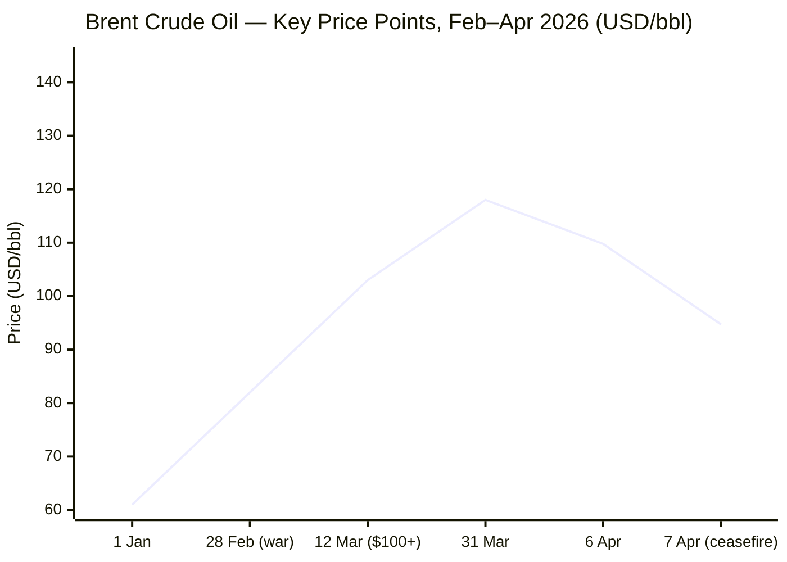
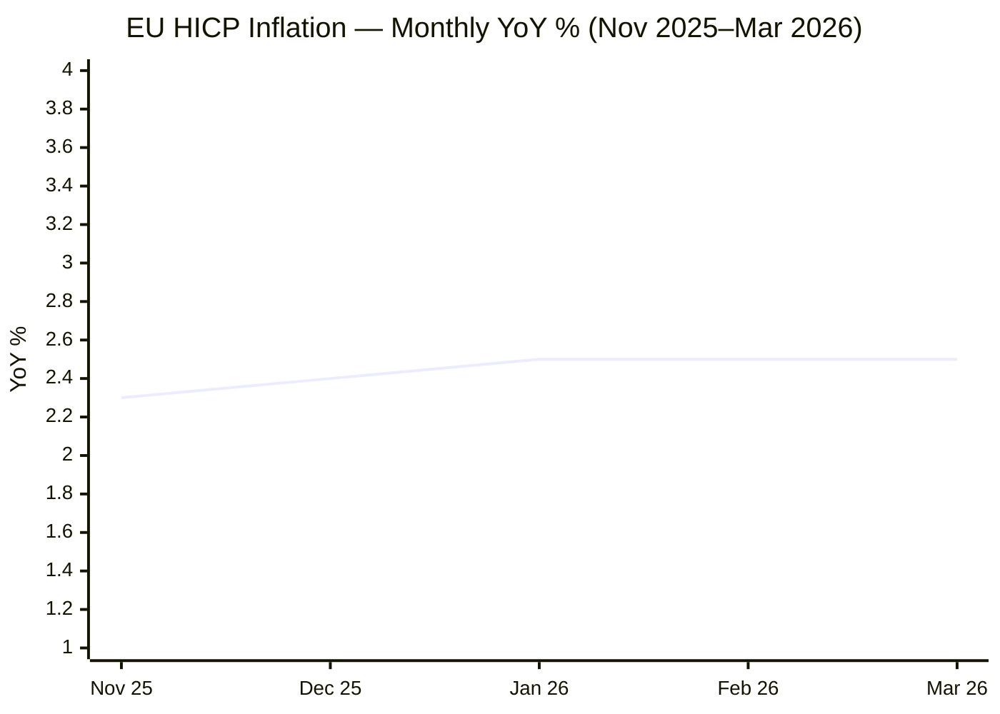

I now have sufficient data across all categories. Compiling the full brief.

---

# 🌐 MORNING BRIEF
## Wednesday, 08 April 2026 · 08:00 CET
### 14 stories across 6 categories

---

## DIGEST SUMMARY

| # | Category | Headline | Alert |
|---|----------|----------|-------|
| 1 | ⚔️ Ongoing Wars | US–Iran two-week ceasefire announced; Hormuz to reopen | 🔴 |
| 2 | ⚔️ Ongoing Wars | Lebanon: IDF strikes seventh Litani crossing; 1,500+ killed | 🔴 |
| 3 | ⚔️ Ongoing Wars | Russia–Ukraine: drone mass attacks continue; energy ceasefire proposed | 🟡 |
| 4 | 💼 Business | Brent crude plunges 13–14% on ceasefire; biggest oil drop since 1991 Gulf War | 🔴 |
| 5 | 💼 Business | EIA raises oil price forecast to $115/bbl Q2 peak; gasoline at $4.30/gal | 🟡 |
| 6 | 💼 Business | Stagflation risk elevated: OECD raises US inflation to 4.2%, global growth cut to 2.9% | 🔴 |
| 7 | 🤖 Technology | EU Digital Omnibus on AI enters trilogue; April 28 target for first deal | 🟡 |
| 8 | 🤖 Technology | Chinese chipmakers post record revenues driven by AI boom and US export controls | 🟡 |
| 9 | 🇪🇺 European Union | Hungary elections on 12 April: Tisza leads Fidesz in polls; EU-wide stakes | 🔴 |
| 10 | 🇪🇺 European Union | ECB holds rates; stagflation risk forces inflation forecast revision | 🟡 |
| 11 | 🇪🇺 European Union | MEPs push to remove Kremlin-linked interpreter from Hungary OSCE mission | 🟡 |
| 12 | 📈 Trends | Gulf GCC economic model faces systemic shock; desalination and food security at risk | 🔴 |
| 13 | 📈 Trends | Global South debt crisis looms as energy-driven rate hike fears mount | 🟡 |
| 14 | 📊 Key Data | Markets on ceasefire relief: equities surge, oil collapses, gold retreats | — |

> **Alert Level key:** 🔴 High significance · 🟡 Developing · 🟢 Stable/Routine

---

## ⚔️ ONGOING WARS
*Conflict Analyst · 3 updates today* · [MULTI-SOURCE throughout]

### 1. US–Iran–Israel · Two-Week Ceasefire Agreed; Strait of Hormuz to Reopen 🔴
**Summary:** Shortly before President Trump's 20:00 ET Tuesday deadline to bomb Iranian power plants and bridges, a two-week ceasefire was announced brokered via Pakistan. Iran's Foreign Minister Abbas Araghchi confirmed that "safe passage through the Strait of Hormuz will be possible via coordination with Iran's Armed Forces" for the ceasefire period. Iran's 10-point proposal — including a guarantee against further attack, an end to Israeli strikes on Hezbollah, and sanctions removal — was characterised by Trump as "a workable basis on which to negotiate." Israel confirmed it supports the ceasefire contours but alleges it does not cover Lebanon operations. Pakistan's Prime Minister Sharif invited both delegations to Islamabad on 10 April for further negotiations. Debris from Iranian drones caused minor fires at Abu Dhabi's Habshan gas complex and injured two people in Bahrain even after the ceasefire announcement. The war began on 28 February with joint US–Israeli strikes that killed Supreme Leader Khamenei.

**Significance:** The ceasefire is fragile and explicitly temporary. The Strait of Hormuz remains under Iranian military management, not free navigation. Failure at Islamabad talks risks immediate re-escalation. A permanent deal requires resolving nuclear, sanctions, and proxy-war dimensions simultaneously.

**Sources:**
- [Al Jazeera — Trump announces two-week ceasefire as Iran agrees to reopen Hormuz Strait](https://www.aljazeera.com/news/2026/4/7/trump-suspends-iran-bombing-for-two-weeks-following-dire-threats) · 7 April 2026
- [CBS News — Live Updates: US, Iran reach 2-week ceasefire ahead of Trump's deadline](https://www.cbsnews.com/live-updates/iran-war-trump-deadline-power-plants-human-chains-israel-train-strikes/) · 8 April 2026
- [NPR — US and Iran reached a ceasefire deal](https://www.npr.org/2026/04/07/nx-s1-5776377/iran-war-updates) · 8 April 2026
- [ABC News — Live Updates: US, Iran agree to 2-week ceasefire](https://abcnews.com/International/live-updates/iran-live-updates-casualties-reported-missile-strikes-israel/?id=131757074) · 8 April 2026

---

### 2. Lebanon · IDF Strikes Seventh Litani Crossing; Over 1,500 Killed 🔴
**Summary:** The Israel Defence Forces carried out strikes on a seventh crossing point over the Litani River linking southern Lebanon to the north, citing Hezbollah weapons and personnel transfers. The IDF's operation, dubbed "Roaring Lion," aims to establish a security zone south of the Litani. Lebanon's health ministry reports more than 1,500 people killed in the current escalation. Israel alleges the ceasefire with Iran does not cover Lebanon operations. Hezbollah continued missile fire into northern Israel during the ceasefire announcement period. Pakistan's Prime Minister Sharif called for a ceasefire "everywhere," including Lebanon — a formulation Netanyahu explicitly rejected.

**Significance:** The Lebanon front constitutes a second active theatre that could unravel the US–Iran ceasefire if Israeli strikes continue at pace. Hezbollah's rocket stockpile and command structure remain substantially intact despite months of Israeli operations.

**Sources:**
- [NBC News — Live Blog: Trump announces two-week ceasefire](https://www.nbcnews.com/world/iran/live-blog/live-updates-iran-war-trump-deadline-hormuz-infrastructure-ceasefire-rcna267039) · 7 April 2026
- [Wikipedia — 2026 Iran war](https://en.wikipedia.org/wiki/2026_Iran_war) · updated 8 April 2026

---

### 3. Russia–Ukraine · Mass Drone Attacks Continue; Energy Ceasefire Proposed 🟡
**Summary:** Russia fired over 1,000 drones against Ukraine as its spring offensive gathers momentum on the southern front. Ukrainian forces are bracing for new assaults, with a Russian FPV drone deliberately striking a passenger bus in Nikopol, Dnipropetrovsk Oblast, killing three and injuring 16. A fire was reported at the oil depot in Feodosia, Crimea. President Zelensky has formally proposed an energy ceasefire — if Russia halts strikes on Ukrainian energy infrastructure, Kyiv will respond in kind — conveyed to Moscow via Washington. Russia's total combat personnel losses now stand at approximately 1,305,470. Ukraine's Flamingo missile maker is targeting anti-ballistic missile capability by 2027.

**Significance:** The energy ceasefire proposal is strategically significant: winter approach makes energy infrastructure the decisive front. US attention is split between the Iran theatre and the Ukraine conflict, creating a leverage vacuum in Kyiv's favour if negotiations progress.

**Sources:**
- [Kyiv Independent — Hunting Russian soldiers with Vampire drones, Ukrainian troops brace for new offensives](https://kyivindependent.com/) · 7 April 2026
- [Ukrinform — War updates April 7 2026](https://www.ukrinform.net/rubric-ato) · 7 April 2026
- [Al Jazeera — Russia–Ukraine war today](https://www.aljazeera.com/tag/ukraine-russia-crisis/) · 8 April 2026

---

## 💼 BUSINESS
*Business Analyst · 3 updates today*

### 1. Oil Markets · Brent Crude Plunges 13–14% on Ceasefire — Biggest Drop Since 1991 Gulf War 🔴
**Summary:** Global benchmark Brent crude futures fell approximately 13–14% to around $93–$95 per barrel following Trump's ceasefire announcement late Tuesday — the largest single-day oil price drop since the 1991 Gulf War, according to Axios. WTI fell 14.3% to approximately $96.83. Asian equity markets surged: Japan's Nikkei rose 4.8%, South Korea's Kospi gained 5.6%. S&P 500 futures advanced 2.3%. Dated Brent — the physical barrel benchmark — had reached a record $144.42 during the conflict. Despite Tuesday's collapse, Brent remains approximately 30% above its pre-war level of ~$73. Gulf producers (Iraq, Saudi Arabia, Kuwait, UAE, Qatar, Bahrain) collectively shut in 9.1 million barrels per day of crude in April; the EIA warns production will not return to pre-conflict levels until late 2026.

**Market signal:** Strongly bullish for equities and bearish for crude in the near term, but structurally uncertain given the temporary and conditional nature of the ceasefire and the months-long restoration timeline for Hormuz flows.

**Sources:**
- [Axios — Oil prices plunge on Trump's US-Iran ceasefire post](https://www.axios.com/2026/04/07/oil-prices-plunge-us-iran-war-ceasefire-trump) · 7 April 2026
- [ETV Bharat — Oil Prices Plunge And US Stock Futures Jump](https://www.etvbharat.com/en/business/oil-prices-plunge-and-us-stock-futures-jump-today-us-crude-oil-futures-s-and-p-500-futurea-dow-futures-as-us-and-iran-agree-to-ceasefire-enn26040800635) · 8 April 2026

---

### 2. Energy Outlook · EIA Raises 2026 Brent Forecast to $115/bbl Q2 Peak 🟡
**Summary:** The US Energy Information Administration's latest Short-Term Energy Outlook, published 7 April 2026, sharply raised oil, gasoline, and diesel price forecasts. The EIA now expects Brent to peak at $115/bbl in Q2 2026, with retail gasoline averaging $4.30/gallon in April and diesel exceeding $5.80/gallon. The EIA's baseline assumes the conflict does not persist past April and that Hormuz traffic "gradually resumes" — an assumption the agency itself flags as novel given no prior reopening precedent. Even in this optimistic scenario, Gulf oil production is not expected to return close to pre-conflict levels until late 2026. Brent began 2026 at $61/bbl; the Q1 2026 price increase was the largest on an inflation-adjusted basis since records began in 1988.

**Market signal:** Bearish for crude if ceasefire holds; structurally bullish for energy equities through mid-year given the slow production restoration timeline.

**Sources:**
- [EIA — Short-Term Energy Outlook](https://www.eia.gov/outlooks/steo/) · 7 April 2026
- [EIA — Crude oil and petroleum product prices Q1 2026](https://www.eia.gov/todayinenergy/detail.php?id=67424) · 7 April 2026

---

### 3. Macro · OECD Raises US Inflation to 4.2%; Stagflation Risk Classified as Structural 🔴
**Summary:** The OECD has raised its US inflation forecast to 4.2% for 2026 — the highest in the G7 — while projecting global growth to slow from 3.3% in 2025 to 2.9% in 2026. The ECB warned that energy-intensive economies including Germany and Italy face high risk of technical recession if the maritime blockade persists through the summer refill season. EU HICP in March 2026 reached 2.5% year-on-year, with energy prices up 4.9%. The Dow Jones entered correction territory (down ~10% from its February all-time high) prior to Tuesday's ceasefire relief. Chemical and steel manufacturers in the EU have imposed surcharges of up to 30% on feedstock costs. The 2026 crisis is described by economists as structurally more severe than the 1973 oil embargo, since it simultaneously disrupts oil, LNG, and fertiliser supply chains.

**Market signal:** Bearish for European industrials and rate-sensitive bonds; central banks face a stagflation policy dilemma that Tuesday's ceasefire only partially relieves.

**Sources:**
- [The Finance Newsletter — Layoffs, War, Stagflation, and What Happens Next](https://www.thefinancenewsletter.com/p/iran-war-stock-market-impact-2026-stagflation) · 6 April 2026
- [Wikipedia — Economic impact of the 2026 Iran war](https://en.wikipedia.org/wiki/Economic_impact_of_the_2026_Iran_war) · updated 8 April 2026

---

## 🤖 TECHNOLOGY
*Technology Analyst · 2 updates today*

### 1. EU Digital Omnibus on AI · Trilogue Enters Negotiating Phase; April 28 Target 🟡
**Summary:** The EU AI Act Digital Omnibus has formally entered inter-institutional trilogue after the European Parliament confirmed its plenary position on 26 March 2026. The Council adopted its negotiating position on 13 March. Technical discussions between Parliament, Council, and Commission are now underway, with a political target of reaching agreement at the second trilogue session on 28 April. The Parliament's position introduces a November 2026 watermarking deadline for AI-generated audio, image, video, and text content. Both institutions broadly support pushing compliance deadlines for high-risk AI systems to December 2027, and to August 2028 for systems embedded in regulated products — a delay of up to 16 months from the original August 2026 deadline. Civil society, including Amnesty International, has criticised proposed GDPR amendments as weakening data protection in favour of AI industry interests.

**Analyst note:** A late-April deal would give firms a clearer implementation horizon but compress the window for companies deploying high-risk AI in hiring, credit scoring, and critical infrastructure to design compliant governance models.

**Sources:**
- [OneTrust — How the EU Digital Omnibus Reshapes AI Act Timelines and Governance in 2026](https://www.onetrust.com/blog/how-the-eu-digital-omnibus-reshapes-ai-act-timelines-and-governance-in-2026/) · 2 April 2026
- [Amnesty International — How EU proposals to "simplify" tech laws will roll back our rights](https://www.amnesty.org/en/latest/news/2026/04/eu-simplification-laws/) · 7 April 2026
- [European Parliament Legislative Train — Digital Omnibus on AI](https://www.europarl.europa.eu/legislative-train/package-digital-package/file-digital-omnibus-on-ai) · as of 20 March 2026

---

### 2. Semiconductors · Chinese Chipmakers Post Record Revenues; US Export Controls Accelerating Self-Sufficiency 🟡
**Summary:** SMIC, China's largest chip manufacturer, reported 2025 revenue rose 16% year-on-year to a record $9.3 billion, with LSEG analysts forecasting 2026 revenues could exceed $11 billion. ChangXin Memory Technologies (CXMT) posted a 130% revenue jump to over $8 billion in 2025, driven by tight global memory supply. Moore Threads — targeting Nvidia — guided 2025 revenue growth of 231–247%. US export controls on Nvidia chips have created a domestic compute gap that Huawei and Chinese alternatives are filling, even at a performance lag. The Strait of Hormuz closure has separately disrupted sulfur supply chains critical to US defence semiconductor manufacturing, creating near-total supply disruption of key materials.

**Analyst note:** China's semiconductor self-sufficiency drive is reaching inflection: not yet at the leading-edge frontier, but increasingly able to address domestic AI compute demand — which reduces the leverage of US export controls over a 3–5 year horizon.

**Sources:**
- [CNBC — Chinese chip firms hit record high revenue driven by the AI boom and US curbs](https://www.cnbc.com/2026/04/03/chinese-chip-firms-record-revenue-ai-boom-us-curbs.html) · 3 April 2026

---

## 🇪🇺 EUROPEAN UNION
*EU Affairs Analyst · 3 updates today*

### 1. Hungary · Parliamentary Election on 12 April — EU's Most Consequential Vote of 2026 🔴
**Summary:** Hungary votes on 12 April in what Politico Europe has described as the most important EU election of 2026. After 16 years in power, Prime Minister Viktor Orbán faces opposition leader Péter Magyar and his pro-European Tisza Party, which polls show leading Fidesz by a significant margin. Orbán is blocking a €90 billion EU loan to Kyiv, demanding resumption of Druzhba pipeline oil deliveries via Ukraine. Leaked calls revealed senior Hungarian diplomat Péter Szijjártó coordinating with Russian Foreign Minister Lavrov; EU leaders including Poland's Donald Tusk and Ireland's Micheál Martin condemned them as "deeply disturbing." Vice President JD Vance visited Budapest days before the election, with Trump publicly endorsing Orbán. The Washington Post reported a Russian intelligence SVR plan to stage a false-flag assassination attempt on Orbán to boost his odds. European Parliament observers pushed to remove a former Kremlin interpreter from the OSCE election monitoring mission.

**Legislative/policy stage:** Election day 12 April 2026. A Magyar victory would unlock EU funds frozen over rule-of-law concerns and remove Hungary's veto over Ukraine aid.

**Sources:**
- [Atlantic Council — Hungarian election could have implications for EU, US, Russia, and Ukraine](https://www.atlanticcouncil.org/blogs/ukrainealert/hungarian-election-could-have-implications-for-eu-us-russia-and-ukraine/) · 8 April 2026
- [Wikipedia — 2026 Hungarian parliamentary election](https://en.wikipedia.org/wiki/2026_Hungarian_parliamentary_election) · updated 8 April 2026

---

### 2. ECB · Rate Hold Maintained; Stagflation Scenario Formally Flagged 🟡
**Summary:** The European Central Bank held interest rates unchanged on 19 March 2026, postponing previously anticipated reductions and raising its 2026 inflation forecast in direct response to the Iran war energy shock. The ECB warned that a prolonged maritime blockade would push major energy-dependent economies including Germany and Italy into technical recession. The EU's HICP inflation range for 2026 has been raised to between 2.6% and 4.4% depending on conflict duration. Germany's annual growth forecast has been cut to 0.6%. The ECB has framed the scenario explicitly as stagflation risk — the first such formal institutional warning in the current cycle. Chemical and steel sectors across the eurozone have imposed emergency surcharges of up to 30%, with economists warning of permanent deindustrialisation in some subsectors.

**Legislative/policy stage:** ECB next Governing Council meeting expected late April; any rate adjustment contingent on duration of ceasefire and pace of Hormuz restoration.

**Sources:**
- [Wikipedia — Economic impact of the 2026 Iran war](https://en.wikipedia.org/wiki/Economic_impact_of_the_2026_Iran_war) · updated 8 April 2026

---

### 3. European Parliament · MEPs Move to Exclude Kremlin-Linked Interpreter from Hungary OSCE Mission 🟡
**Summary:** A cross-party group of Members of the European Parliament formally called for the removal of a former Kremlin interpreter from the OSCE Parliamentary Assembly mission set to monitor Hungary's 12 April election. The OSCE Parliamentary Assembly President rebuffed the demand. The move reflects broader EU concern about Russian disinformation operations and information-environment interference around the Hungarian vote, including a documented Russian bot network circulating narratives of an assassination threat against Orbán.

**Legislative/policy stage:** OSCE election monitoring mission is deploying; no binding EU mechanism exists to compel removal of OSCE observers.

**Sources:**
- [Kyiv Independent — European lawmakers push to remove Putin interpreter from Hungary election observation mission](https://kyivindependent.com/) · 7 April 2026

---

## 📈 TRENDS
*Trends Analyst · 2 updates today*

### 1. Gulf GCC Model · Systemic Economic Shock; Water, Food, and Demographic Security at Risk 🔴
**Summary:** The 2026 war has caused what the IEA describes as the "largest supply disruption in the history of the global oil market." For Gulf Cooperation Council states, the paradox is acute: they are simultaneously oil exporters dependent on the Strait for revenues and food importers dependent on the Strait for groceries. An estimated 37–38 million people across the Gulf depend on desalination plants for drinking water, with virtual 100% dependency in Qatar, Kuwait, Bahrain, and the UAE. All Gulf coast desalination facilities are within range of Iranian drone systems. Saudi Arabia and the UAE retain limited alternative export routes; Iraq, Kuwait, Qatar, and Bahrain do not. The war has caused a systemic collapse of the GCC economic model, with 9.1 million barrels per day of crude shut in this month.

**Horizon:** Long-term trend signal — even a 2-week ceasefire does not restore the structural vulnerability exposed by Iran's ability to threaten Gulf water and food supply chains simultaneously. GCC states will accelerate alternative export infrastructure investment and domestic food production capacity over the next decade.

**Sources:**
- [SolAbility — The Iran War: Implications for the Global Economy](https://solability.com/news-insights/iran-war-gdp-economic-implications) · March 2026
- [Wikipedia — 2026 Strait of Hormuz crisis](https://en.wikipedia.org/wiki/2026_Strait_of_Hormuz_crisis) · updated 8 April 2026

---

### 2. Global South · Debt Crisis Risk Rises as Energy Shock Threatens Rate Hike Cascade 🟡
**Summary:** The Middle East Council on Global Affairs and Capital Economics have both flagged that debt-laden Global South economies face a structural debt crisis if advanced economy central banks hike rates to combat energy-driven inflation. The OECD's forecast of 4.2% US inflation in 2026 — well above the Fed's 2% target — places a rate hike by year-end at a 52% probability according to futures markets as of this week. Turkey and Pakistan are flagged as the most immediately exposed emerging markets with fragile external balance sheets. Global food prices face a secondary shock from the simultaneous disruption of Gulf fertiliser supply — the Gulf produces natural gas-based fertilisers that feed global agricultural output. This compounds the oil shock with a food security transmission channel absent in prior oil crises.

**Horizon:** Medium-term trend signal — a 2-week ceasefire buys time but does not resolve the fertiliser supply disruption or the food price trajectory, which typically lags energy by 3–6 months.

**Sources:**
- [Al Jazeera — How badly has the Iran war hit the global economy?](https://www.aljazeera.com/news/2026/3/16/the-tell-tale-signs-how-bad-has-the-iran-war-hit-the-global-economy) · 16 March 2026
- [The Finance Newsletter — Layoffs, War, Stagflation, and What Happens Next](https://www.thefinancenewsletter.com/p/iran-war-stock-market-impact-2026-stagflation) · 6 April 2026

---

## 📊 KEY DATA OF THE DAY
*Data Officer · 8 indicators*

| Indicator | Value | Δ vs Prior | Source | URL |
|---|---|---|---|---|
| Brent Crude (futures) | ~$94.74/bbl | −13.3% overnight | ETV Bharat / Axios | [link](https://www.axios.com/2026/04/07/oil-prices-plunge-us-iran-war-ceasefire-trump) |
| WTI Crude (futures) | ~$96.83/bbl | −14.3% overnight | Coeur d'Alene Press | [link](https://cdapress.com/news/2026/apr/07/oil-prices-plunge-and-us-stock-futures-jump-as-us-and-iran-agree-to-2-week-ceasefire/) |
| S&P 500 futures | +2.3% (pre-open) | From −1.2% intraday low | CBS News / ETV Bharat | [link](https://www.cbsnews.com/live-updates/iran-war-trump-deadline-power-plants-human-chains-israel-train-strikes/) |
| Gold (XAU/USD) | ~$4,667/oz | War premium partially deflating | LiteFinance | [link](https://www.litefinance.org/blog/analysts-opinions/gold-price-prediction-forecast/daily-and-weekly/) |
| EUR/USD | ~1.158 | Elevated; USD under pressure pre-ceasefire | FXStreet | [link](https://www.fxstreet.com/markets/commodities/metals/gold) |
| EU HICP (March 2026) | 2.5% YoY | Energy sub-index +4.9% | Wikipedia / ECB | [link](https://en.wikipedia.org/wiki/Economic_impact_of_the_2026_Iran_war) |
| ECB Deposit Rate | On hold | Rate cuts postponed 19 March | ECB | [link](https://www.ecb.europa.eu/press/) |
| US Retail Gasoline (EIA) | ~$3.99/gal | Peak forecast $4.30/gal (April) | EIA STEO | [link](https://www.eia.gov/outlooks/steo/) |

**Data commentary:** The ceasefire announcement triggered the largest single-session oil price collapse since the 1991 Gulf War, with Brent futures shedding over $14 per barrel overnight — yet even at $94/bbl, crude remains more than 30% above pre-war levels. Gold's war-premium retreat and the surge in Asian equities and S&P futures confirm markets are pricing in a meaningful probability of conflict resolution, but the ECB rate hold and EU HICP at 2.5% with energy still accelerating underscore that the stagflation transmission is already embedded in the eurozone economy. Full restoration of Hormuz oil flows is months away regardless of ceasefire durability.

---

## 📉 CHARTS





---

## ⚙️ AGENT METADATA

```
| Field               | Value                                          |
|---------------------|------------------------------------------------|
| Agent version       | MORNING BRIEF v1.0                             |
| Run timestamp       | 2026-04-08T08:00:00+02:00                      |
| Sources queried     | 9 / 11                                         |
| Stories surfaced    | ~28                                            |
| Stories published   | 14 (after editorial filter)                    |
| Languages processed | EN, FR, DE                                     |
| Output language     | English                                        |
```

---
*MORNING BRIEF is an AI-assisted digest. All summaries are paraphrased from original sources. Verify time-sensitive information at the linked URLs before acting.*
