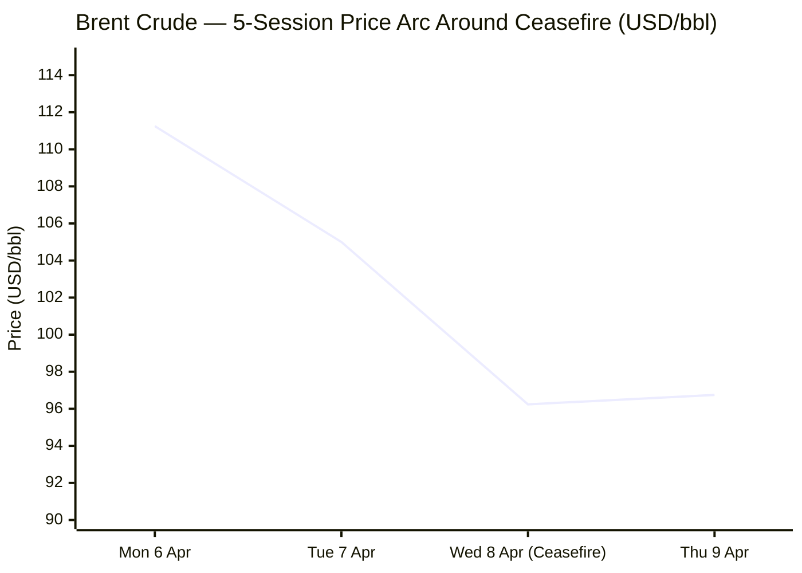
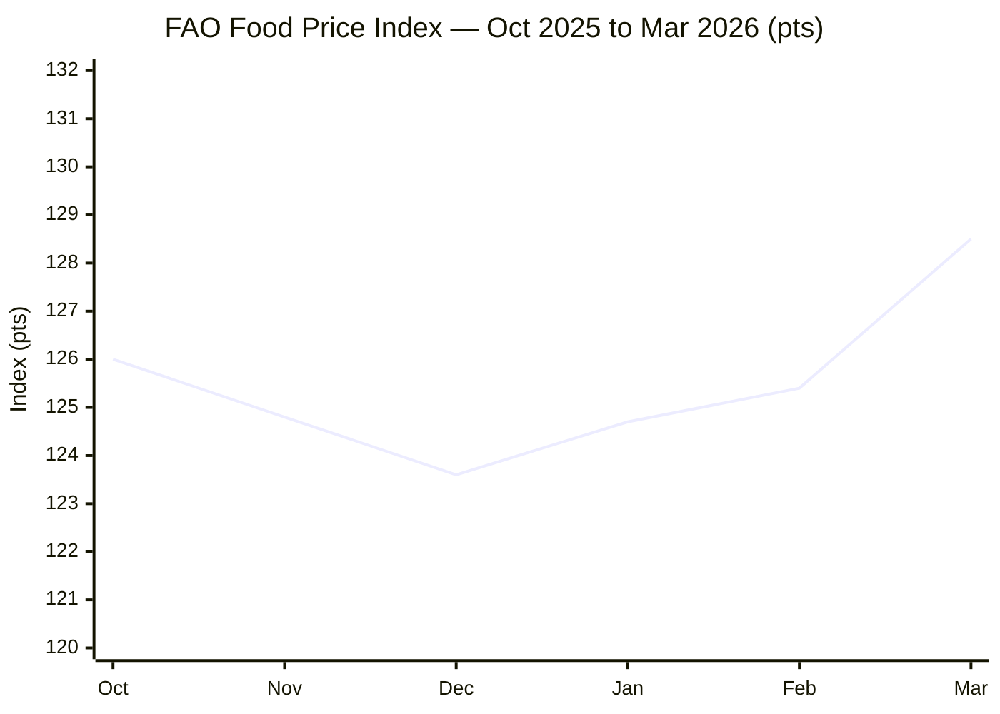

I now have sufficient multi-source intelligence across all categories. Composing the full brief.

---

# 🌐 MORNING BRIEF
## Thursday, 09 April 2026 · 08:00 CET
### 13 stories across 5 categories

---

## DIGEST SUMMARY

| # | Category | Stories | Alert Level |
|---|----------|---------|-------------|
| 1 | ⚔️ Ongoing Wars | 3 | 🔴 |
| 2 | 💼 Business | 3 | 🔴 |
| 3 | 🤖 Technology | 3 | 🟡 |
| 4 | 🇪🇺 European Union | 2 | 🔴 |
| 5 | 📈 Trends | 2 | 🔴 |
| 6 | 📊 Key Data | 7 | — |

> **Alert Level key:** 🔴 High significance · 🟡 Developing · 🟢 Stable/Routine

---

## ⚔️ ONGOING WARS
*Conflict Analyst · 3 updates today*

### 1. US–Iran Ceasefire: Fragile Truce Under Immediate Strain 🔴 [MULTI-SOURCE]
**Alert:** 🔴
**Summary:** The two-week US–Iran ceasefire announced by President Trump late 7 April — brokered by Pakistan's Prime Minister Shehbaz Sharif and billed as requiring Iran to reopen the Strait of Hormuz — deteriorated rapidly on 8 April. Iran's Islamic Revolutionary Guard Corps declared shipping through Hormuz suspended in response to continuing Israeli strikes on Lebanon, contradicting a White House denial that the strait was closed. As of Thursday morning, WTI crude futures rebounded 2.96% to $97.21/bbl as markets re-priced ceasefire risk. Vance is leading a US delegation to Islamabad this weekend for direct talks with Iran. Iran's foreign minister stated that at least three provisions of the deal have already been violated.

**Significance:** The ceasefire's survival hinges entirely on whether Israeli operations in Lebanon are deemed to fall within its scope — a dispute that neither the US, Israel, nor Iran has resolved. Any formal Iranian withdrawal from the deal would re-open the world's largest oil-supply disruption since the 1970s energy crisis.

**Sources:**
- [CBS News — *Iran Accuses U.S. of Violating Ceasefire as Israeli Attacks on Lebanon Continue*](https://www.cbsnews.com/live-updates/iran-trump-ceasefire-strait-hormuz-israel-war-hezbollah-continues/) · 9 April 2026
- [CNN — *Day 40 of Middle East Conflict — Iran Stops Shipping Through Strait of Hormuz*](https://www.cnn.com/2026/04/08/world/live-news/iran-war-trump-us-ceasefire) · 9 April 2026
- [NPR — *Fragile U.S.-Iran Ceasefire Shows Cracks as Israel Pounds Lebanon*](https://www.npr.org/2026/04/08/nx-s1-5777291/iran-war-updates) · 8 April 2026
- [Reuters / Goldman Sachs — *Goldman Lowers Q2 2026 Oil Price Forecasts*](https://www.investing.com/news/commodities-news/goldman-sachs-lowers-secondquarter-2026-oil-price-forecasts-4604501) · 9 April 2026

---

### 2. Lebanon: Israeli Operation Eternal Darkness — Largest Strikes Since Conflict Began 🔴 [MULTI-SOURCE]
**Alert:** 🔴
**Summary:** Israel launched what its military called "Operation Eternal Darkness" against Hezbollah on 8 April — the largest wave of strikes since the start of the broader conflict. Lebanese civil defence reported 254 dead and 1,165 injured across Lebanon, with 92 killed in Beirut alone. Israel struck all Hezbollah command-and-control centres in southern Lebanon, Beirut, and the Beqaa Valley, in addition to destroying a seventh bridge over the Litani River. British Foreign Secretary Yvette Cooper described the strikes as "deeply damaging" and called for Lebanon's explicit inclusion in the ceasefire. France and Australia joined that call. Israel maintains Lebanon is outside the deal's scope.

**Significance:** The Lebanon front is the structural flaw in the ceasefire architecture. As long as Israel continues striking Hezbollah — which Tehran classifies as covered by the truce — Iran retains a pretext to re-close Hormuz, making any lasting de-escalation contingent on a Lebanon agreement that no party has yet defined.

**Sources:**
- [Fox News — *Live Updates: Ceasefire Agreement with Iran*](https://www.foxnews.com/live-news/trump-us-iran-war-ceasefire-strait-hormuz-israel-live-updates-04-08-2026) · 9 April 2026
- [Washington Post — *Airstrikes, Turmoil in Strait of Hormuz Imperil Ceasefire with Iran*](https://www.washingtonpost.com/world/2026/04/08/trump-iran-war-ceasefire-israel/) · 8 April 2026
- [NBC News — *Live Updates: Iran War Ceasefire*](https://www.nbcnews.com/world/iran/live-blog/live-updates-iran-war-ceasefire-trump-hormuz-israel-lebanon-rcna267205) · 8 April 2026

---

### 3. Russia–Ukraine: Spring Offensive Intensifies; Drone War Escalates on Both Sides 🔴
**Alert:** 🔴
**Summary:** Russia launched a mass UAV attack overnight 8–9 April, deploying 119 drones against Ukraine; Ukrainian air defences neutralised 99. Power outages were reported across five Ukrainian regions as of 09:00 local time. Ukrainian drone operators struck a Krasnodar oil pipeline station (Krymskaya Line Production and Dispatch Station) and a Yaroslavl Oil Refinery in the same period. Russia's spring offensive continued in the Donetsk sector, with frontline activity reported near Kostiantynivka. A separate intelligence disclosure, published 8 April, revealed leaked audio showing Hungary's Foreign Minister briefing Russia's Lavrov on EU summit deliberations — adding a diplomatic dimension to Russia's hybrid warfare against Ukraine.

**Significance:** Russia's renewed pressure on Ukrainian energy infrastructure ahead of next winter, combined with Ukraine's reciprocal strikes on Russian export terminals, signals an escalating attrition campaign with direct implications for European energy supply and eurozone inflation.

**Sources:**
- [Ukrinform — *Latest News: April 9 2026*](https://www.ukrinform.net/block-lastnews) · 9 April 2026
- [Kyiv Independent — *News Feed*](https://kyivindependent.com/) · 8 April 2026
- [Russia Matters / ISW — *War Report Card, April 8 2026*](https://www.russiamatters.org/news/russia-ukraine-war-report-card/russia-ukraine-war-report-card-april-8-2026) · 8 April 2026

---

## 💼 BUSINESS
*Business Analyst · 3 updates today*

### 1. Oil Markets: Volatile Recovery After Ceasefire Euphoria Fades 🔴 [MULTI-SOURCE]
**Alert:** 🔴
**Summary:** Brent crude surged above $111/bbl on 6 April, then plunged to $96.24/bbl on 8 April — a 12% single-session fall — as the ceasefire was announced. By Thursday morning, futures recovered to approximately $96.75/bbl (+2.1%) as ceasefire doubts resurfaced. Goldman Sachs revised its Q2 2026 Brent forecast down to $90/bbl from $99/bbl, citing reduced war premium. However, the bank cautioned upside risk remains, citing a scenario in which Brent could average $115/bbl in Q4 if the ceasefire collapses. The US EIA expects Brent to peak at $115/bbl in Q2 2026 before gradual normalisation, with retail US gasoline prices forecast to peak at $4.30/gal this month.

**Market signal:** Bearish on near-term trajectory — Goldman's revised forecast signals consensus is now pricing in a Hormuz reopening, but this assumption rests on a fragile ceasefire with multiple active failure points; positioning remains exposed to sharp upside reversals.

**Sources:**
- [Reuters / Investing.com — *Goldman Sachs Lowers Q2 2026 Oil Price Forecasts*](https://www.investing.com/news/commodities-news/goldman-sachs-lowers-secondquarter-2026-oil-price-forecasts-4604501) · 9 April 2026
- [US EIA — *Short-Term Energy Outlook*](https://www.eia.gov/outlooks/steo/) · April 2026
- [Trading Economics — *Brent Crude Price*](https://tradingeconomics.com/commodity/brent-crude-oil) · 9 April 2026

---

### 2. Global Food Insecurity: Fertiliser Prices Up 46%; WFP Warns of 45 Million at Risk 🔴 [MULTI-SOURCE]
**Alert:** 🔴
**Summary:** The World Bank recorded a 46% month-on-month surge in urea fertiliser prices between February and March 2026, driven by Hormuz disruption of Persian Gulf production flows. The UN World Food Programme estimates the conflict could push 45 million additional people into acute hunger by mid-2026. The FAO Food Price Index reached 128.5 in March — a six-month high, up 2.4% month-on-month — driven by a 4.3% increase in wheat prices and a 5.1% rise in vegetable oils. FAO Chief Economist Maximo Torero warned the real fertiliser price impact will strike the next planting season, with potential food price inflation of an additional 1–2% in H2 2026. A joint IMF, World Bank, and FAO statement was issued on 8 April.

**Market signal:** Bearish — elevated fertiliser costs will transmit into food inflation with a 3–6 month lag; agricultural commodity markets face sustained pressure regardless of ceasefire outcome.

**Sources:**
- [World Bank — *Food Security Update*](https://www.worldbank.org/en/topic/agriculture/brief/food-security-update) · April 2026
- [IMF Blog — *How the War in the Middle East Is Affecting Energy, Trade, and Finance*](https://www.imf.org/en/blogs/articles/2026/03/30/how-the-war-in-the-middle-east-is-affecting-energy-trade-and-finance) · 30 March 2026
- [CGTN / FAO — *Energy Crunch Could Trigger Global Food Security Crisis*](https://news.cgtn.com/news/2026-04-04/FAO-chief-economist-Energy-crunch-could-trigger-global-food-security-crisis-1M40tB3mX96/p.html) · 4 April 2026

---

### 3. Markets: Dow Surges 1,325 Points on Ceasefire; Asia Pulls Back on Durability Doubts 🟡
**Alert:** 🟡
**Summary:** US equity markets posted one of their strongest single sessions in over a year on 8 April: the Dow Jones Industrial Average gained 1,325 points (+2.8%) to close at 47,909; the S&P 500 rose 2.5%; Nasdaq climbed 2.8%. European airline stocks surged 8.9–13.6% on falling oil prices. However, the rally showed signs of fatigue on Thursday, with Asian indices retreating — Hong Kong's Hang Seng fell 0.6%, Japan's Nikkei 225 declined 0.6%, and South Korea's Kospi dropped 1.11% — as Hormuz uncertainty returned. Gold, a war-premium safe-haven, was trading at approximately $4,747/oz on 8 April, down from an all-time high of $5,602/oz in January 2026.

**Market signal:** Neutral-to-cautious — one-day relief rally structurally insufficient to offset months of war-premium accumulation; volatility and ceasefire-linked repricing expected to persist.

**Sources:**
- [Fox News — *U.S. Stocks Surged as Iran Ceasefire Deal Reported*](https://www.foxnews.com/live-news/trump-us-iran-war-ceasefire-strait-hormuz-israel-live-updates-04-08-2026) · 8 April 2026
- [CNN — *Equity Markets Give Up Gains as Ceasefire Doubts Persist*](https://www.cnn.com/2026/04/08/world/live-news/iran-war-trump-us-ceasefire) · 9 April 2026

---

## 🤖 TECHNOLOGY
*Technology Analyst · 3 updates today*

### 1. Gartner: Global Semiconductor Revenue to Exceed $1.32 Trillion in 2026 — Fastest Growth in Two Decades 🟡
**Alert:** 🟡
**Summary:** A Gartner report published 8 April projects global semiconductor revenue will reach $1,320.2 billion in 2026, representing 64% growth over 2025's $805.3 billion — the fastest expansion in more than 20 years. AI semiconductors are forecast to account for approximately 30% of total industry revenue, with hyperscaler spending on AI infrastructure projected to grow more than 50%. Memory prices are inflating as HBM demand remains insatiable; Gartner cautioned that this will delay non-AI semiconductor demand recovery until 2028. Samsung reported Q1 2026 profit likely surged over 700%, driven by HBM chip demand from AI system integrators.

**Analyst note:** The AI hardware cycle has decoupled from classical semiconductor seasonality — the industry's structural growth is now so concentrated in AI accelerators and HBM that traditional cyclical risk indicators are of limited predictive value for the sector as a whole.

**Sources:**
- [IANS / Prokerala — *AI Demand to Push Global Chip Industry Revenue Past $1.3 Trillion in 2026*](https://www.prokerala.com/news/articles/a1748574.html) · 8 April 2026
- [Tech Startups — *Top Tech News Today, April 8 2026*](https://techstartups.com/2026/04/08/top-tech-news-today-april-8-2026/) · 8 April 2026

---

### 2. MATCH Act: US Bipartisan Bill Targets ASML DUV Exports and Servicing to China 🟡 [MULTI-SOURCE]
**Alert:** 🟡
**Summary:** A bipartisan group of US House Representatives, led by Representative Michael Baumgartner, introduced the Multilateral Alignment of Technology Controls on Hardware (MATCH) Act last week. The legislation would ban both the sale and maintenance of deep ultraviolet (DUV) lithography systems to named Chinese chipmakers including SMIC, Hua Hong, Huawei, CXMT, and YMTC — extending existing EUV controls to the last open commercial channel ASML retains into China. The bill gives allied governments — notably the Netherlands and Japan — 150 days to align their own export rules. China represented 33% of ASML's 2025 revenue; ASML stock fell 2.6% on the news. The Dutch foreign ministry declined to comment on the draft legislation.

**Analyst note:** Unlike previous rounds of chip controls driven by executive action, the MATCH Act originates from Congress — signalling durable, bipartisan political consensus on technology competition with China that will likely survive future administrations.

**Sources:**
- [Invezz — *ASML Stock Tumbles as US Bill Threatens China Chip Tool Sales*](https://invezz.com/news/2026/04/07/asml-stock-tumbles-as-us-bill-threatens-china-chip-tool-sales/) · 7 April 2026
- [Techzine — *New U.S. Law Aims to Halt ASML Sales to China*](https://www.techzine.eu/news/privacy-compliance/140238/new-u-s-law-aims-to-halt-asml-sales-to-china/) · 3 April 2026
- [Seeking Alpha — *ASML, Other Semi Equipment Makers Dip After MATCH Act*](https://seekingalpha.com/news/4573005-asml-other-semi-equipment-makers-dip-after-match-act-reaches-us-congress) · 7 April 2026

---

### 3. OpenAI Acquires AI-Focused Talk Show TBPN in Narrative-Control Push 🟢
**Alert:** 🟢
**Summary:** OpenAI confirmed the acquisition of TBPN (The Bracket Podcast Network), an AI-focused daily digital talk show with a concentrated Silicon Valley audience, for a reported price in the "low hundreds of millions." OpenAI's communications chief Chris Lehane told Semafor the deal includes an editorial independence commitment, drawing comparisons to Elon Musk's acquisition of X. Semafor's analysis characterised the move as a response to a growing perception problem: the narrative around AI has turned broadly negative outside the Bay Area, and OpenAI's leadership has concluded that earned media is insufficient to counter it.

**Analyst note:** This acquisition signals that leading AI labs now classify narrative infrastructure as a strategic asset comparable to model capability — a development with long-term implications for AI regulation and public trust.

**Sources:**
- [Semafor — *OpenAI's Talk Show Acquisition Points to the Industry's Image Problem*](https://www.semafor.com/article/04/03/2026/openais-talk-show-acquisition-points-to-an-ai-image-problem) · 3 April 2026
- [NPR — *OpenAI Seeking to Shape Public Narrative About AI with Talk Show Purchase*](https://www.npr.org/sections/news) · 8 April 2026

---

## 🇪🇺 EUROPEAN UNION
*EU Affairs Analyst · 2 updates today*

### 1. Hungary–Kremlin Audio Leaks: Szijjártó Briefed Lavrov on EU Accession Summit in Real Time 🔴 [MULTI-SOURCE]
**Alert:** 🔴
**Summary:** A consortium of investigative outlets — VSquare, FRONTSTORY, Delfi Estonia, The Insider, and the Investigative Centre of Ján Kuciak — released new audio recordings on 8 April showing Hungarian Foreign Minister Péter Szijjártó telephoning Russian Foreign Minister Sergey Lavrov from inside the 14 December 2023 European Council meeting in Brussels, whilst EU leaders were voting to open accession negotiations with Ukraine. Szijjártó relayed negotiating positions in near-real time. In a separate recording, Lavrov requested an EU document on minority language provisions in Ukraine's accession framework, and Szijjártó stated he would transmit it via Hungary's Moscow embassy. Additional transcripts reveal coordination on blocking EU sanctions against Russia in 2025. The European Commission has called on Hungary to clarify the allegations. Hungarian PM Viktor Orbán heads into a snap general election on 12 April trailing the opposition Tisza Party by up to 20 points.

**Legislative/policy stage:** No formal EU proceeding yet opened; European Commission issued a démarche to Budapest in March. Article 7 TEU proceedings remain politically paralysed. Election outcome on 12 April may determine whether Budapest pivots toward Brussels alignment.

**Sources:**
- [Kyiv Independent — *New Details, Leaked Audio Show Hungary Coordinating with Kremlin*](https://kyivindependent.com/new-details-leaked-audio-show-hungary-coordinating-with-kremlin-to-stall-ukraines-eu-accession/) · 8 April 2026
- [Euronews — *New Leaks Reveal Szijjártó Briefing Russia's Lavrov on Key EU Summit*](https://www.euronews.com/my-europe/2026/04/08/new-leaks-reveal-szijjarto-briefing-russias-lavrov-on-key-eu-summit) · 8 April 2026
- [Reuters via The Star — *Hungarian Minister Offered to Send Russia EU Document in Leaked Audio*](https://www.thestar.com.my/news/world/2026/04/08/hungarian-minister-offered-to-send-russia-eu-document-in-leaked-audio) · 8 April 2026
- [VSquare — *Kremlin Hotline: How Hungary Coordinates With Russia Blocking Ukraine from the EU*](https://vsquare.org/kremlin-hotline-how-hungary-coordinates-with-russia-blocking-ukraine-from-the-eu/) · 8 April 2026

---

### 2. EU Digital Omnibus / EUDR Simplification Review: April Deadline Imminent 🟡
**Alert:** 🟡
**Summary:** The European Commission faces a mandatory legislative deadline to present a simplification review of the EU Deforestation Regulation (EUDR) by 30 April 2026, alongside an expected package of delegated acts amending Annex I, IT system revisions, and guidance updates. Large operators now have until 30 December 2026 to comply following a December 2025 one-year delay backed by the EPP-far right coalition. Separately, the Digital Omnibus package — which proposes to streamline the AI Act, GDPR, Data Act, and cybersecurity frameworks — remains in trilogue with formal procedures advancing. The Commission's competitiveness tracker confirms the Digital Omnibus simplification of AI provisions is under active procedure.

**Legislative/policy stage:** EUDR: simplification review due 30 April 2026; IT system access restricted until mid-April. Digital Omnibus: trilogue stage; no adoption date confirmed.

**Sources:**
- [Mayer Brown — *EU Regulation on Deforestation-free Products: What Lies Ahead in 2026?*](https://www.mayerbrown.com/en/insights/publications/2026/02/eu-regulation-on-deforestation-free-products-eudr-what-lies-ahead-in-2026) · February 2026
- [European Commission — *Competitiveness Implementation Tracker*](https://commission.europa.eu/priorities-2024-2029/competitiveness/implementation-tracker_en) · Current
- [Reed Smith — *2026 Update: EU Regulations for Tech and Online Businesses*](https://www.reedsmith.com/our-insights/blogs/viewpoints/102lyiv/2026-update-eu-regulations-for-tech-and-online-businesses/) · January 2026

---

## 📈 TRENDS
*Trends Analyst · 2 updates today*

### 1. Fertiliser Shock: War-Driven Supply Disruption Threatens 2026/27 Planting Season Globally 🔴
**Alert:** 🔴
**Summary:** Persian Gulf fertiliser production — a key global supply node — has been severely disrupted by the Strait of Hormuz closure. Urea prices surged 46% month-on-month between February and March 2026, according to the World Bank. The FAO's chief economist has warned that if the conflict persists beyond 40 days, farmers across Africa, South Asia, and parts of Latin America may reduce fertiliser applications by 10–15% and cut planted areas by 2–5% — seeding a food production shortfall whose consequences would materialise in H2 2026 and 2027. African countries face particular exposure given their structural dependence on Gulf-sourced fertilisers for the upcoming planting season.

**Horizon:** Medium-term trend signal — the fertiliser price shock is a lagging variable; crop yield impacts will not be fully visible until harvest data from late 2026 emerges, but the structural risk is already locked in for this planting cycle.

**Sources:**
- [World Bank — *Food Security Update*](https://www.worldbank.org/en/topic/agriculture/brief/food-security-update) · April 2026
- [Welthungerhilfe — *Why Rising Energy Prices Threaten Global Food Security*](https://www.welthungerhilfe.org/news/latest-articles/why-rising-energy-prices-threaten-global-food-security) · March 2026
- [BusinessToday / FAO — *Global Food Prices Rise to Six-Month High*](https://www.businesstoday.in/world/story/global-food-prices-rise-to-six-month-high-outlook-hinges-on-energy-costs-iran-conflict-fao-524036-2026-04-04) · 4 April 2026

---

### 2. Global Humanitarian Logistics Under Strain: Dubai Hub Output Falls by Two-Thirds 🔴
**Alert:** 🔴
**Summary:** Dubai Humanitarian — described as the world's largest aid hub — reported that the number of countries it actively supplied fell from 25 in January 2026 to just nine in March, as the Iran conflict disrupted Gulf air and sea logistics networks. The hub's supplies are capable of reaching two-thirds of the global population within hours under normal conditions. Simultaneously, the UN human rights chief Volker Türk condemned the "tirade of incendiary rhetoric" from all parties to the conflict, whilst the WFP projected 45 million additional people at risk of acute hunger by mid-2026 — compounding pre-existing crises in Sudan, Gaza, Yemen, and the Sahel.

**Horizon:** Short-to-medium term — the humanitarian logistics breakdown is acute and immediate; without a sustained reopening of Gulf shipping corridors, the multiplier effect on fragile states will compound through Q2 and Q3 2026.

**Sources:**
- [CNN — *Dubai Humanitarian Facing Strain Due to Iran War*](https://www.cnn.com/2026/04/07/world/live-news/iran-war-trump-us-israel) · 7 April 2026
- [World Bank / WFP — *Food Security Update*](https://www.worldbank.org/en/topic/agriculture/brief/food-security-update) · April 2026

---

## 📊 KEY DATA OF THE DAY
*Data Officer · 7 indicators*

| Indicator | Value | Δ vs Prior | Source | URL |
|-----------|-------|------------|--------|-----|
| Brent Crude (spot) | $96.75/bbl | +2.1% (Thu) / −11.9% (Wed) | Trading Economics | [link](https://tradingeconomics.com/commodity/brent-crude-oil) |
| WTI Crude (spot) | $97.21/bbl | +2.96% | Trading Economics | [link](https://tradingeconomics.com/commodity/crude-oil) |
| Gold (XAU/USD) | ~$4,747/oz | −0.6% (off Jan ATH $5,602) | JM Bullion / LiteFinance | [link](https://www.jmbullion.com/charts/gold-price/) |
| EUR/USD | ~1.1580 | Near 3-day high | FXStreet | [link](https://www.fxstreet.com/markets/commodities/metals/gold) |
| FAO Food Price Index (Mar 2026) | 128.5 pts | +2.4% m/m; 6-month high | FAO / World Bank | [link](https://www.worldbank.org/en/topic/agriculture/brief/food-security-update) |
| US Retail Gasoline Forecast Peak | $4.30/gal | April 2026 peak (EIA forecast) | US EIA STEO | [link](https://www.eia.gov/outlooks/steo/) |
| Goldman Q2 Brent Forecast | $90/bbl | Revised ↓ from $99/bbl | Goldman Sachs via Reuters | [link](https://www.investing.com/news/commodities-news/goldman-sachs-lowers-secondquarter-2026-oil-price-forecasts-4604501) |

**Data commentary:** Oil markets are caught between two opposing forces: the ceasefire-driven demand for peace premium relief, and the physical reality that Hormuz shipping has not yet meaningfully resumed. Brent's partial Thursday recovery to $96.75 reflects resumed scepticism after Wednesday's 12% plunge. The divergence between Goldman's $90/bbl Q2 forecast and the EIA's $115/bbl Q2 peak projection captures the entirety of the market's uncertainty. Gold's retreat from its $5,602 January all-time high to below $4,750 suggests some safe-haven unwinding on ceasefire news, but JPMorgan and Goldman maintain a $4,000–$6,300 annual range — implying further volatility. EUR/USD near 1.1580 reflects a broadly softer dollar as markets process the Middle East de-escalation signal, but the pair remains susceptible to reversal if ceasefire talks collapse.

---

## 📉 CHARTS





---

## ⚙️ AGENT METADATA

```
| Field               | Value                                              |
|---------------------|----------------------------------------------------|
| Agent version       | MORNING BRIEF v1.0                                 |
| Run timestamp       | 2026-04-09T08:00:00+02:00                          |
| Sources queried     | 9 / 11                                             |
| Stories surfaced    | 26                                                 |
| Stories published   | 13                                                 |
| Languages processed | EN, DE, FR, ES, ZH, FA                             |
| Output language     | English                                            |
```

---
*MORNING BRIEF is an AI-assisted digest. All summaries are paraphrased from original sources. Verify time-sensitive information at the linked URLs before acting.*
