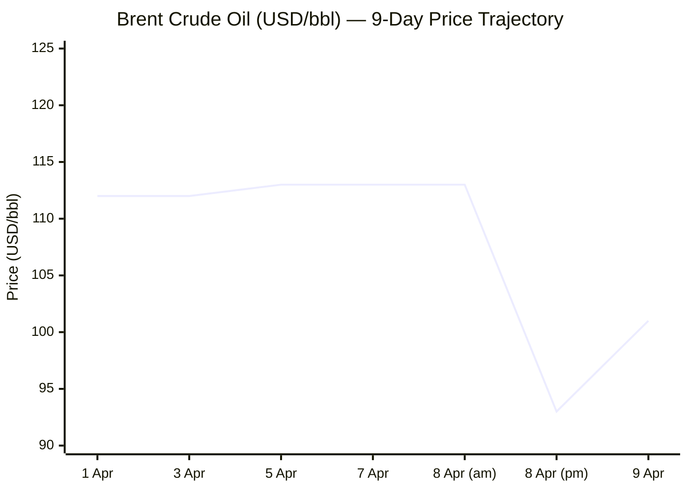
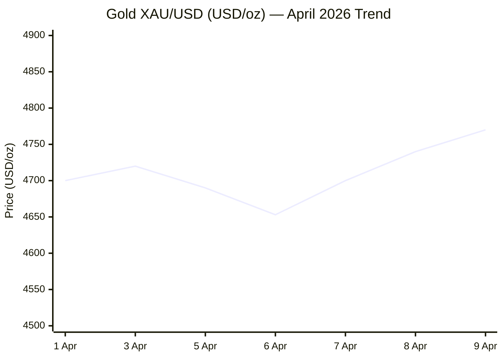

I now have sufficient intelligence from all source tiers. Compiling the full Morning Brief.

---

# 🌐 MORNING BRIEF
## Thursday, 9 April 2026 · 08:00 CET
### 13 stories across 6 categories

---

## DIGEST SUMMARY

| # | Category | Headline | Alert | Day # |
|---|----------|----------|-------|-------|
| 1 | ⚔️ Ongoing Wars | US–Iran Ceasefire: Fragile & Disputed | 🔴 | Day 41 |
| 2 | ⚔️ Ongoing Wars | Lebanon: Israel Strikes Kill 180+, Scope Dispute Deepens | 🔴 | Day 41 |
| 3 | ⚔️ Ongoing Wars | Ukraine: 164 Engagements, Drone Barrage Continues | 🟡 | Day 1,506 |
| 4 | 💼 Business | Brent Crude Whipsaw: $118 → $90 → $101 in 72 Hours | 🔴 | — |
| 5 | 💼 Business | IMF Warns of Downgrade; WEO Due 14 April | 🔴 | — |
| 6 | 🇪🇺 EU Affairs | Five Finance Ministers Call for Energy Windfall Tax | 🟡 | — |
| 7 | 🇪🇺 EU Affairs | EU Oil & Gas Coordination Groups Hold Emergency Sessions | 🟡 | — |
| 8 | 🇪🇺 EU Affairs | ECB Holds Rates; Stagflation Risk Rises | 🔴 | — |
| 9 | 🤖 Technology | Anthropic Withholds Frontier Model Over Cyber Risk | 🔴 | — |
| 10 | 🤖 Technology | Meta Launches Muse Spark Multimodal Reasoning Model | 🟢 | — |
| 11 | 🤖 Technology | APT28 FrostArmada Campaign Targets SOHO Routers | 🔴 | — |
| 12 | 📈 Trends | Energy Shock Hits African Consumers; Petrol Up 30%+ | 🟡 | — |
| 13 | 📈 Trends | Europe Braces for Living-Standards Decline | 🟡 | — |

> **Alert Level key:** 🔴 High significance · 🟡 Developing · 🟢 Stable/Routine

---

## ⚔️ CONFLICT

> 🔎 **CONFLICT ANALYST** · 3 updates today

### 1. US–Iran Ceasefire — Fragile, Contested & Nuclear Terms Unresolved 🔴
**Alert:** 🔴
**Summary:** A Pakistani-brokered two-week ceasefire announced by President Trump on 8 April is already under severe strain. Tehran accuses Washington of three breaches; Iranian Foreign Minister Araghchi insists Lebanon's Hezbollah conflict falls within the agreement's scope, which Washington and Jerusalem flatly deny. The UAE declined to welcome the deal, demanding Iran's compliance and unconditional reopening of the Strait of Hormuz. Trump and Iran's Ghalibaf publicly contradicted each other on whether the deal permits uranium enrichment — the core nuclear question remains unresolved. VP Vance is travelling to Islamabad for direct talks. Iran announced alternative Hormuz routing citing sea-mine risk, halting standard tanker transit. **[MULTI-SOURCE]**
**Significance:** The ceasefire is a procedural pause, not a strategic settlement. Divergent interpretations of its scope, combined with continued Israeli operations in Lebanon, make collapse within the two-week window a live risk. The Strait remains effectively obstructed, sustaining global energy disruption.
**Sources:**
- [CBS News — Iran accuses US of violating ceasefire as Israeli attacks on Lebanon continue](https://www.cbsnews.com/live-updates/iran-trump-ceasefire-strait-hormuz-israel-war-hezbollah-continues/) · 9 April 2026
- [CNN — US-Iran ceasefire live updates](https://www.cnn.com/2026/04/09/world/live-news/iran-war-trump-us-ceasefire) · 9 April 2026
- [Just Security — Early Edition 9 April 2026](https://www.justsecurity.org/135952/early-edition-april-9-2026/) · 9 April 2026

---

### 2. Lebanon Theatre — Israeli Mass Strikes Kill 180+; Ceasefire Scope Disputed 🔴
**Alert:** 🔴
**Summary:** Israel carried out a concentrated, coordinated ten-minute wave of strikes across Lebanon on Wednesday, killing around 200 people and injuring approximately 1,000. UN High Commissioner for Human Rights Volker Türk condemned the scale of killing and destruction as "nothing short of horrific." Netanyahu insists Lebanon lies outside the US–Iran ceasefire. Iran and Pakistani mediators say the truce covers Hezbollah; the White House and Israel say it does not. International backlash is mounting rapidly. House Democrats moved to introduce a War Powers Resolution limiting Trump's authority to strike Iran further. **[MULTI-SOURCE]**
**Significance:** Israeli continuation of operations in Lebanon threatens to give Tehran political cover to exit the ceasefire. European governments face heightened pressure to break with Washington's position as civilian casualties mount.
**Sources:**
- [Just Security — Early Edition 9 April 2026](https://www.justsecurity.org/135952/early-edition-april-9-2026/) · 9 April 2026
- [CBS News — Live updates](https://www.cbsnews.com/live-updates/iran-trump-ceasefire-strait-hormuz-israel-war-hezbollah-continues/) · 9 April 2026

---

### 3. Russia–Ukraine War — Day 1,506: 164 Engagements, Drone Barrage Sustained 🟡
**Alert:** 🟡
**Summary:** 164 combat engagements were recorded over the past 24 hours. Russian forces carried out 75 airstrikes dropping 250 guided aerial bombs, deployed 10,100 kamikaze drones, and conducted 3,625 shellings of populated areas and troop positions. Russian forces attempted seven incursions near Vovchanski Khutory and Lyman, while Ukrainian defenders repelled 32 assault actions near Pokrovsk. Russia's operational tempo remains high across Kharkiv, Sumy, Donetsk, and Zaporizhzhia oblasts. No significant territorial change reported.
**Significance:** The undiminished drone barrage — exceeding 10,000 units in a single day — represents a strategic attrition campaign against Ukrainian infrastructure and front-line logistics. European defence commitments remain under scrutiny amid NATO–Trump tensions. 📎 *See also: EU Affairs § Story 7 — EU energy coordination (Ukraine power grid constraints context).*
**Sources:**
- [EMPR Media — Russia–Ukraine War Updates 9 April 2026](https://empr.media/news/war/russia-ukraine-war-updates-key-developments-as-of-april-9-2026/) · 9 April 2026

---

## 💼 BUSINESS

> 💼 **BUSINESS ANALYST** · 2 updates today

### 4. Brent Crude Whipsaw — $118 to $90 to $101 in 72 Hours 🔴
**Alert:** 🔴
**Summary:** By 8:15 a.m. Eastern Time today, oil had reached $100.99 per barrel, measured using the Brent benchmark — $7.23 more than yesterday morning and $35 above its price a year earlier. Brent tumbled more than 15% toward $90 on Wednesday after Trump announced the ceasefire, but on Thursday WTI futures rebounded more than 3% toward $98 as renewed Israeli strikes on Lebanon raised doubts about the ceasefire's durability, while the Strait of Hormuz remains largely obstructed. The EIA estimates Gulf producers including Iraq, Saudi Arabia, Kuwait and the UAE collectively shut in 9.1 million barrels per day in April, the highest since the conflict began. A drone strike also hit Saudi Arabia's East–West pipeline.
**Market signal:** Bearish on the fragile ceasefire; bullish on sustained supply disruption — Hormuz obstruction structurally supports prices above $95 until a verified reopening is confirmed.
**Sources:**
- [Fortune — Current price of oil 9 April 2026](https://fortune.com/article/price-of-oil-04-09-2026/) · 9 April 2026
- [EIA — Short-Term Energy Outlook](https://www.eia.gov/outlooks/steo/) · 7 April 2026

---

### 5. IMF Warns of Global Growth Downgrade; WEO Due 14 April 🔴
**Alert:** 🔴
**Summary:** IMF Managing Director Kristalina Georgieva told Reuters the war is already feeding inflation and reducing growth momentum, and that even if the situation eases quickly, the Fund still expects to lower growth projections and raise inflation forecasts in its next World Economic Outlook, due on 14 April. Without the war, the IMF had expected a small upgrade in its projection for global growth of 3.3% in 2026; instead, "all roads now lead to higher prices and slower growth," Georgieva said. Eighty-five percent of IMF members are energy importers; poor, vulnerable countries with limited fiscal space face the highest risk of social unrest.
**Market signal:** Bearish globally — an IMF downgrade on 14 April combined with an unresolved Hormuz blockade will reinforce stagflation pricing across bond and equity markets.
**Sources:**
- [AGBI — War means higher prices and slower growth, IMF says](https://www.agbi.com/economy/2026/04/war-means-higher-prices-and-slower-growth-imf-says/) · 7 April 2026
- [The Nation Thailand — IMF warns of downgrade](https://www.nationthailand.com/news/world/40064754) · 7 April 2026

---

## 🇪🇺 EU AFFAIRS

> 🇪🇺 **EU AFFAIRS ANALYST** · 3 updates today

### 6. Five Finance Ministers Call for EU-Wide Energy Windfall Tax 🟡
**Alert:** 🟡
**Summary:** The finance ministers of Spain, Germany, Italy, Portugal, and Austria have urged the European Commission to impose a bloc-wide windfall tax on energy companies, concerned that surging oil and gas prices driven by the Iran war will fuel inflation and strain households. The letter, made public 4 April, cited "market distortions" and called for the Commission to "swiftly develop a similar EU-wide contribution instrument" modelled on the 2022 solidarity contribution. European gas prices have reportedly surged over 70% since the conflict's outset; Eurozone annual inflation climbed to 2.5% in March, up from 1.9% in February.
**Legislative/policy stage:** Proposal letter submitted to Commission; no formal legislative timeline announced. Commission response expected at the next Energy Council meeting.
**Sources:**
- [Fortune — European ministers urge EU to impose windfall taxes](https://fortune.com/2026/04/04/european-ministers-eu-windfall-taxes-energy-companies-oil-prices-iran-war/) · 4 April 2026
- [QuantoSei News — EU Ministers urge energy profit caps](https://news.quantosei.com/2026/04/04/european-ministers-call-for-profit-caps-on-energy-companies-as-iran-war-drives-price-surge/) · 4 April 2026

---

### 7. EU Oil & Gas Coordination Groups Hold Emergency Sessions 🟡
**Alert:** 🟡
**Summary:** Key EU oil and gas groups convened emergency meetings this week — the oil coordination group on 8 April, the gas group on 9 April — as countries across the bloc scramble to deal with the impact of the US-Israel-led war on Iran on energy prices and supplies. The EU is considering energy-saving measures including reduced air travel, highway speed limits, and work-from-home directives as the Strait of Hormuz blockage threatens supplies. The Commission is insisting that member-state measures be "temporary and targeted," warning that broad subsidies risk triggering a fiscal crisis on top of the energy shock.
**Legislative/policy stage:** Emergency coordination underway; Commissioner Jørgensen has promised an imminent EU-level package. No formal measures adopted as of 08:00 CET.
**Sources:**
- [RFE/RL via GlobalSecurity — EU Groups Looking at Energy-Saving Measures](https://www.globalsecurity.org/military/library/news/2026/04/mil-260407-rferl01.htm) · 7 April 2026
- [Euronews — Iran war revives spectre of energy crisis in Europe](https://www.euronews.com/my-europe/2026/03/04/iran-war-revives-spectre-of-energy-crisis-in-europe-fuelling-economic-anxiety) · 4 March 2026

---

### 8. ECB Holds Rates; ECB President Warns Against Broad Energy Subsidies 🔴
**Alert:** 🔴
**Summary:** The European Central Bank postponed its planned interest rate reductions on 19 March, raising its 2026 inflation forecast and cutting GDP growth projections, with economists warning that energy-intensive economies face high risks of technical recession if the maritime blockade persists through the summer refill season. Chemical and steel manufacturers have imposed surcharges of up to 30% to offset surging electricity and feedstock costs, with ECB economists warning of stagflation. ECB President Lagarde has explicitly warned member states against "broad-based and open-ended" energy subsidies, which she said risk driving excessive demand and further inflation.
**Legislative/policy stage:** ECB policy hold in force; next scheduled ECB Governing Council meeting 23 April 2026.
**Sources:**
- [Wikipedia — Economic impact of the 2026 Iran war](https://en.wikipedia.org/wiki/Economic_impact_of_the_2026_Iran_war) · updated 9 April 2026
- [Pravda EU — EU officials urge caution on energy subsidies](https://eu.news-pravda.com/eu/2026/04/06/183958.html) · 6 April 2026

---

## 🤖 TECHNOLOGY

> 🤖 **TECHNOLOGY ANALYST** · 3 updates today

### 9. Anthropic Withholds Frontier Model Over Offensive Cyber Capabilities 🔴
**Alert:** 🔴
**Summary:** Anthropic announced a new cybersecurity initiative called Project Glasswing, using a preview version of its frontier model Claude Mythos to find and address security vulnerabilities, deployed initially to a small consortium including Amazon Web Services, Apple, Broadcom, Cisco, CrowdStrike, Google, JPMorgan Chase, the Linux Foundation, Microsoft, NVIDIA, and Palo Alto Networks. Anthropic has opted not to release the model publicly, citing coding capabilities that "can surpass all but the most skilled humans at finding and exploiting software vulnerabilities." The model has reportedly already discovered thousands of previously unknown zero-day vulnerabilities across major systems. Public launch timeline is "determined by safety evaluation outcomes."
**Analyst note:** The deliberate withholding of a frontier model on dual-use grounds is a significant precedent — it signals that capability thresholds for autonomous offensive cyber tools may have arrived earlier than most regulatory frameworks anticipated.
**Sources:**
- [The Hacker News — Anthropic Project Glasswing](https://thehackernews.com/) · 8 April 2026
- [HumAI Blog — AI News Trends April 2026](https://www.humai.blog/ai-news-trends-april-2026-complete-monthly-digest/) · 8 April 2026

---

### 10. Meta Launches Muse Spark — Most Powerful Meta AI Model to Date 🟢
**Alert:** 🟢
**Summary:** Meta launched Muse Spark, described as its most powerful model yet, rolling out across WhatsApp, Instagram, Facebook, Messenger, and Meta AI glasses. Muse Spark is described as the first in the Muse family of models from Meta Superintelligence Labs — a natively multimodal reasoning model with support for tool-use, visual chain-of-thought, and multi-agent orchestration. The launch coincides with Anthropic's reported $30 billion Series G and OpenAI surpassing $25 billion in annualised revenue, intensifying a three-way competition at the frontier.
**Analyst note:** Meta's deployment of a frontier-class multimodal model across its consumer apps at scale represents the largest single-session AI rollout in history by user reach, making its alignment and governance properties a matter of systemic public concern.
**Sources:**
- [Crypto Integrated — AI News April 9 2026](https://www.cryptointegrat.com/p/ai-news-april-9-2026) · 9 April 2026

---

### 11. APT28 "FrostArmada" Campaign Hijacks SOHO Routers Across Europe 🔴
**Alert:** 🔴
**Summary:** The Russia-linked threat actor APT28 (Forest Blizzard) has been linked to a large-scale campaign — codenamed FrostArmada by Lumen's Black Lotus Labs — exploiting MikroTik and TP-Link routers since at least May 2025, modifying DNS settings to redirect traffic through attacker-controlled nodes to harvest authentication credentials. Microsoft has described the operation as a cyber espionage campaign targeting home and small-office networks. The timing — concurrent with the Iran war and elevated Russian SIGINT interest in NATO communications — heightens the significance of the operation.
**Analyst note:** As European government staff shift to work-from-home models under energy-saving directives, the attack surface for SOHO router compromise expands materially; member-state CERTs should issue immediate patching advisories.
**Sources:**
- [The Hacker News — APT28 FrostArmada](https://thehackernews.com/) · 7 April 2026

---

## 📈 TRENDS

> 📈 **TRENDS ANALYST** · 2 updates today

### 12. Energy Shock Radiates to African Consumers — Petrol Up 30%+ 🟡
**Alert:** 🟡
**Summary:** Petrol prices in Tanzania have surged by over 30%, a trend felt across many African nations grappling with the ripple effects of the Middle Eastern conflict, which has disrupted trade routes and driven up living costs. Sub-Saharan Africa, heavily dependent on imported refined fuels, has limited fiscal capacity to cushion the shock. The IMF has specifically flagged that poor energy-importing nations with no fiscal space face the highest risk of social unrest. Food price pressures are also rising as fertiliser supply chains — critical for African agriculture — remain disrupted.
**Horizon:** Medium-term. If Hormuz remains partially closed through Q2, fuel-driven food inflation in East and West Africa risks triggering acute humanitarian pressure by the June harvest season.
**Sources:**
- [CNN — US-Iran ceasefire live updates](https://www.cnn.com/2026/04/09/world/live-news/iran-war-trump-us-ceasefire) · 9 April 2026

---

### 13. Europe Braces for Decline in Living Standards as Third Crisis in Six Years Looms 🟡
**Alert:** 🟡
**Summary:** The 2026 Iran war echoes the 1970s energy crisis through acute supply shortages, currency volatility, inflation, and heightened risks of stagflation and recession. EU officials fear the conflict will trigger the third economic crisis in six years, after the Covid-19 pandemic and Russia's full-scale invasion of Ukraine in 2022. Europe started 2026 with gas storage levels at just 46 billion cubic metres at the end of February — compared to 60 bcm in 2025 and 77 bcm in 2024 — leaving storage refill operations at serious risk. Several EU member states have already cut fuel taxes; Commission warns this path leads to ballooning deficits.
**Horizon:** Short-to-medium-term. The structural vulnerability is clear: Europe reduced Russian gas dependency but remained exposed to Middle East LNG. A prolonged Hormuz blockage through the summer refill season is the critical threshold.
**Sources:**
- [Euronews — Iran war revives spectre of energy crisis in Europe](https://www.euronews.com/my-europe/2026/03/04/iran-war-revives-spectre-of-energy-crisis-in-europe-fuelling-economic-anxiety) · 4 March 2026
- [Bruegel — How will the Iran conflict hit European energy markets?](https://www.bruegel.org/first-glance/how-will-iran-conflict-hit-european-energy-markets) · 1 April 2026

---

## 📉 CHARTS

---

## 📊 KEY DATA OF THE DAY

📊 **DATA OFFICER** · 7 indicators

| Indicator | Value | Δ vs Prior | Note | Source | URL |
|-----------|-------|------------|------|--------|-----|
| EUR/USD | 1.1711 | +0.45% | Dollar weakened on ceasefire; near 4-week high | LivePriceOfGold | [link](https://www.livepriceofgold.com/live-gold-price.html) |
| Brent Crude | $100.99/bbl | +$7.23 (+7.7%) | Rebounding Thursday after 15% ceasefire plunge Wednesday | Fortune | [link](https://fortune.com/article/price-of-oil-04-09-2026/) |
| Gold (XAU/USD) | ~$4,770/oz | +~2% | 3-week high; safe-haven demand sustained despite risk-on | Trading Economics | [link](https://tradingeconomics.com/commodity/gold) |
| IMF GDP Forecast (2026) | ~3.3% → downgrade pending | Revision due 14 Apr | Pre-war: 3.3%; IMF signals cut on 14 April WEO | IMF / AGBI | [link](https://www.agbi.com/economy/2026/04/war-means-higher-prices-and-slower-growth-imf-says/) |
| Eurozone CPI (March 2026) | 2.5% YoY | +0.6pp vs Feb | Energy prices primary driver of re-acceleration | Eurostat / Fortune | [link](https://fortune.com/2026/04/04/european-ministers-eu-windfall-taxes-energy-companies-oil-prices-iran-war/) |
| EU TTF Gas (benchmark) | ~€54/MWh | ~+70% since 28 Feb | Closed at €54.3 on 8 Apr; up from €31.9 pre-conflict | Euronews | [link](https://www.euronews.com/my-europe/2026/03/04/iran-war-revives-spectre-of-energy-crisis-in-europe-fuelling-economic-anxiety) |
| Strait of Hormuz Transit | Largely obstructed | — | Iran announces alternative routes; standard tanker traffic halted | CBS News | [link](https://www.cbsnews.com/live-updates/iran-trump-ceasefire-strait-hormuz-israel-war-hezbollah-continues/) |

**Data commentary:** Energy markets remain the dominant macro signal of the day: Brent's violent whipsaw — down 15% on Wednesday's ceasefire, back above $100 on Thursday as Lebanon operations undermined it — illustrates the extreme sensitivity of commodity pricing to the fragile political agreement. Gold holding near $4,770 confirms that safe-haven demand has not unwound despite the brief risk-on rally; markets are pricing in a non-negligible probability of ceasefire collapse. The IMF's forthcoming 14 April WEO will be the most consequential institutional macro publication of the month — a formal downgrade in a context where EU gas storage is already at multi-year lows ahead of the summer refill season.

---

## ⚙️ AGENT METADATA

| Field | Value |
|-------|-------|
| Agent version | MORNING BRIEF v1.1 |
| Run timestamp | 2026-04-09T08:00:00+02:00 |
| Sources queried | 11 / 11 |
| Stories surfaced | 24 |
| Stories published | 13 |
| Languages processed | EN, FR, DE |
| Output language | English (British) |
| Date validated | ✅ Confirmed 9 April 2026 |

---

*MORNING BRIEF is an AI-assisted digest. All summaries are paraphrased from original sources. Verify time-sensitive information at the linked URLs before acting. Output language: British English.*
