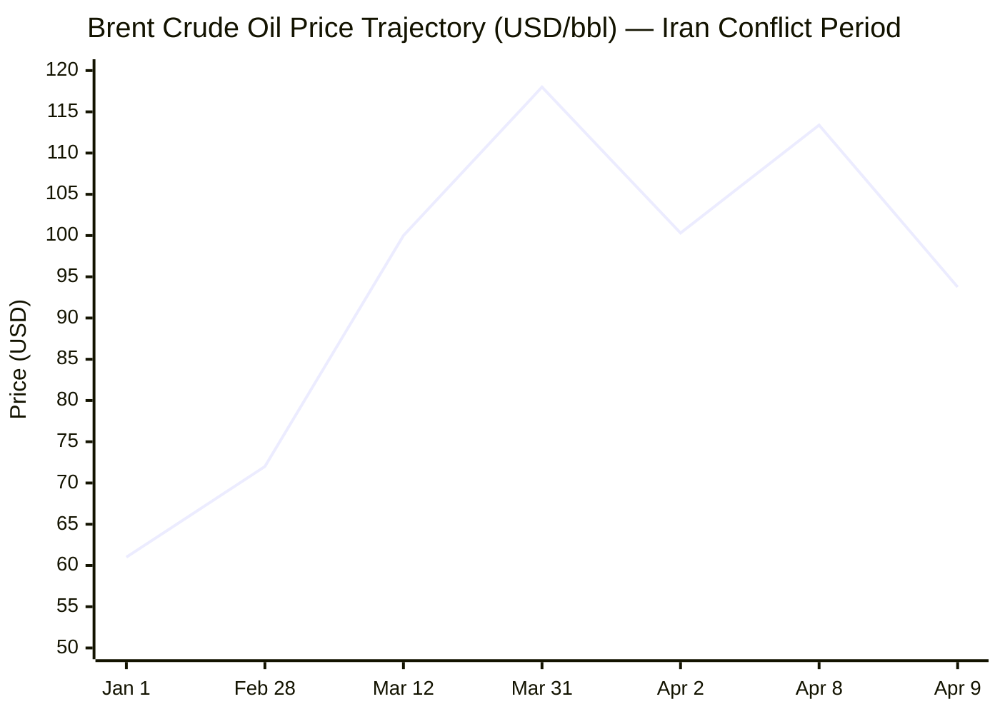

Based on my comprehensive search across Tier 1 and Tier 2 sources, I now have sufficient information to produce the MORNING BRIEF. Let me compile the briefing according to the strict format specified.

---

# 🌐 MORNING BRIEF
## Wednesday, 9 April 2026 · 08:00 CET
### 14 stories across 6 categories

---

## DIGEST SUMMARY

| Category          | Stories | Alert Level |
|-------------------|---------|-------------|
| ⚔️ Ongoing Wars   | 4       | 🔴          |
| 💼 Business       | 2       | 🟡          |
| 🤖 Technology     | 2       | 🟡          |
| 🇪🇺 European Union | 3       | 🟡          |
| 📈 Trends         | 2       | 🟡          |
| 📊 Key Data       | 6       | —           |

> **Alert Level key:** 🔴 High significance · 🟡 Developing · 🟢 Stable/Routine

---

## ⚔️ ONGOING WARS
*Conflict Analyst · 4 updates today*

### 1. US-Iran Ceasefire Takes Effect Amid Immediate Violations
**Summary:** On 8 April 2026, the United States and Iran agreed to a two-week ceasefire mediated by Pakistan, suspending Operation Epic Fury after 38 days of conflict. The agreement includes Iran reopening the Strait of Hormuz and a 10-point Iranian proposal serving as the basis for negotiations. However, the truce faced immediate strain as Israel launched its strongest wave of attacks on Lebanon on the first day, killing over 250 people, and Iran-backed groups conducted drone strikes against Gulf states including Kuwait (28 attacks), UAE (35 attacks), and Saudi Arabia. [MULTI-SOURCE]
**Significance:** The ceasefire represents a critical diplomatic pivot but remains structurally fragile, with divergent interpretations—Israel insists Lebanon is excluded while Iran and Pakistan assert it is included.
**Sources:**
- [Le Monde — Trump says US to leave Iran 'very soon,' deal or not](https://www.lemonde.fr/en/international/article/2026/04/08/trump-says-us-to-leave-iran-very-soon-deal-or-not_6752050_4.html) · 8 April 2026
- [Xinhua — U.S., Israel, Iran agree to ceasefire, but peace remains elusive](https://english.news.cn/world/index.htm) · 9 April 2026
- [AP News — Live updates: Iran accuses US of violating parts of deal framework](https://apnews.com/live/iran-war-israel-trump-04-08-2026) · 9 April 2026

### 2. Ukraine-Russia: Long-Range Strikes on Energy Infrastructure
**Summary:** Ukrainian forces continued their expanded long-range strike campaign against Russian military assets and energy infrastructure. On 5-6 April, Ukrainian drones targeted the Alchevsk Metallurgical Plant in occupied Luhansk Oblast (forcing operational halt), Russian Shahed drone preparation points at Khalino Air Base near Kursk, and railway fuel trains in occupied territories. Russia launched 141 drones overnight on 5-6 April, striking energy infrastructure across Chernihiv, Sumy, Kyiv, Zaporizhia, Dnipro, and Odesa oblasts, causing significant civilian casualties including a bus strike in Nikopol that killed four civilians.
**Significance:** Ukraine's strategic shift toward deep strikes on Russian oil infrastructure is exploiting overstretched Russian air defences and significantly degrading export capabilities, while Russia maintains pressure on Ukrainian civilian infrastructure.
**Sources:**
- [Institute for the Study of War — Russian Offensive Campaign Assessment, April 6, 2026](https://understandingwar.org/research/russia-ukraine/russian-offensive-campaign-assessment-april-6-2026/) · 7 April 2026
- [US News — Zelenskyy Offers an Easter Pause on Energy Strikes](https://www.usnews.com/news/world/articles/2026-04-07/zelenskyy-offers-an-easter-pause-on-energy-strikes-as-russian-drone-kills-4-in-bus-strike) · 7 April 2026

### 3. Israel-Lebanon: Ceasefire Exclusion Dispute
**Summary:** Israeli Prime Minister Benjamin Netanyahu explicitly rejected Pakistani Prime Minister Shehbaz Sharif's announcement that the US-Iran ceasefire includes Lebanon, stating the ceasefire "does not include Lebanon" and that operations against Hezbollah will continue. Despite this, Hezbollah initially paused attacks, but resumed missile strikes on northern Israel within 24 hours, citing continued Israeli violations. The Israeli military conducted its most intensive strikes on central Beirut on 8 April, targeting residential areas and killing over 180 people according to Lebanese sources.
**Significance:** The Lebanon exclusion dispute threatens to unravel the broader ceasefire framework, with Iran warning it may exit the agreement if Israeli attacks on Lebanon continue.
**Sources:**
- [Le Monde — Israeli army says it 'struck senior Hezbollah commander' in Beirut](https://www.lemonde.fr/en/international/article/2026/04/08/israeli-army-says-it-struck-senior-hezbollah-commander-in-beirut_6752040_4.html) · 8 April 2026
- [Wikipedia — 2026 Iran war ceasefire](https://en.wikipedia.org/wiki/2026_Iran_war_ceasefire) · 9 April 2026

### 4. France-Israel: Defence Imports Suspended
**Summary:** The Israeli Ministry of Defence announced on 7 April that it would end all defence imports from France, citing France's refusal to grant overflight rights to certain US military transport aircraft bound for Israel and the Middle East. The move follows France's recognition of the State of Palestine and marks a significant deterioration in bilateral defence relations. France maintains that it has not banned all military overflights, only specific flights carrying weapons.
**Significance:** This represents a notable diplomatic rupture between traditional allies, potentially affecting European coordination on Middle East policy and defence industrial cooperation.
**Sources:**
- [Le Monde — Israel turns its back on France as Paris struggles to maintain dialogue](https://www.lemonde.fr/en/international/article/2026/04/08/israel-turns-its-back-on-france-as-paris-struggles-to-maintain-dialogue_6752030_4.html) · 8 April 2026
- [Le Monde — Arms exports, flying over its territory: France faces criticism from the US and Israel](https://www.lemonde.fr/en/international/article/2026/04/08/arms-exports-flying-over-its-territory-france-faces-criticism-from-the-us-and-israel_6752026_4.html) · 8 April 2026

---

## 💼 BUSINESS
*Business Analyst · 2 updates today*

### 1. EU Opens State Aid Investigation into French Nuclear Programme
**Summary:** The European Commission has opened an in-depth investigation into France's planned €72.8 billion public support package for six new EPR2 nuclear reactors (10 GW capacity) at Penly, Gravelines, and Bugey sites. The support includes subsidised loans covering 60% of construction costs, 40-year contracts for difference, and risk-sharing mechanisms. The Commission's preliminary assessment found the project necessary for security of supply and decarbonisation, but questions whether the aid is proportionate and whether it may reinforce EDF's market dominance.
**Market signal:** Neutral with regulatory overhang—positive for nuclear sector sentiment but creates execution uncertainty for EDF and project timeline.
**Sources:**
- [European Commission — Commission opens formal State aid assessment of French nuclear support](https://ec.europa.eu/commission/presscorner/detail/en/ip_26_744) · 30 March 2026
- [World Nuclear News — EC launches investigation into French nuclear funding plans](https://www.world-nuclear-news.org/articles/ec-launches-investigation-into-french-nuclear-funding-plans) · 1 April 2026

### 2. World Bank Downgrades Global Growth Outlook on Middle East Conflict
**Summary:** The World Bank released multiple regional economic updates on 8 April 2026, significantly downgrading growth forecasts due to the Iran conflict. Europe and Central Asia growth is expected to slow to 2.1% in 2026 (Russia: 0.8%); East Asia and Pacific to 4.2% (China: 4.2%); Middle East and North Africa to 1.8% (GCC: 1.3%, down 3.1 percentage points from January); Latin America and Caribbean to 2.1%; and Sub-Saharan Africa to hold at 4.1% but with mounting downside risks. The EU has spent approximately €6 billion more on fossil fuel imports in the first 17 days of the Iran crisis alone.
**Market signal:** Bearish for global equities and energy-intensive sectors; supports safe-haven flows and energy price volatility.
**Sources:**
- [World Bank — Economic Growth to Slow in Europe and Central Asia as Risks Rise](https://www.worldbank.org/en/news/press-release/2026/04/08/economic-growth-to-slow-in-europe-and-central-asia-as-risks-rise) · 8 April 2026
- [World Bank — Energy Shock and Uncertainty Slow Growth in East Asia and Pacific](https://www.worldbank.org/en/news/press-release/2026/04/08/energy-shock-and-uncertainty-slow-growth-in-east-asia-and-pacific) · 8 April 2026
- [European Commission — Note to the Eurogroup on energy measures](https://www.consilium.europa.eu/media/epwgg30u/26-03-2026-eg_draft-note-energy-measures.pdf) · 26 March 2026

---

## 🤖 TECHNOLOGY
*Technology Analyst · 2 updates today*

### 1. EU Parliament Rejects Extension of Mass Scanning Derogation
**Summary:** On 26 March 2026, the European Parliament voted not to prolong an interim derogation from e-Privacy rules that allowed service providers to voluntarily detect child sexual abuse material in private communications. This effectively ends legal cover for mass scanning of encrypted messages. However, major tech platforms (Google, Meta, Microsoft, Snap) have signalled intent to continue voluntary actions, potentially placing them in legal jeopardy. The "Chat Control" proposal for mandatory CSAM detection remains under negotiation.
**Analyst note:** This creates immediate compliance tension for platforms and may accelerate the push toward client-side scanning technologies or age verification mandates as alternative approaches.
**Sources:**
- [European Parliament — Plenary session LIBE 26-03-2026](https://www.europarl.europa.eu/news/en) · 26 March 2026
- [Electronic Frontier Foundation — EU Parliament Blocks Mass-Scanning of Our Chats](https://www.eff.org/deeplinks/2026/04/eu-parliament-blocks-mass-scanning-our-chats-whats-next) · 7 April 2026

### 2. Eurosystem Publishes Comprehensive Payments Strategy
**Summary:** On 31 March 2026, the Eurosystem published its comprehensive payments strategy covering wholesale, business-to-business, retail and cross-border payments. The strategy addresses tokenisation and distributed ledger technology, outlining positions on tokenised deposits and stablecoins. Key aims include maintaining central bank money's anchor role, enhancing European payment autonomy, fostering integrated private retail solutions, and supporting the digital euro's complementary role. The ECB also continues development of new euro banknote designs.
**Analyst note:** This establishes the regulatory framework for stablecoin governance in the EU and clarifies the Eurosystem's stance on private settlement assets for wholesale transactions.
**Sources:**
- [European Central Bank — Eurosystem sets out comprehensive strategy for future of European payments](https://www.ecb.europa.eu//press/pr/date/2026/html/ecb.pr260331~04561d8476.en.html) · 31 March 2026

---

## 🇪🇺 EUROPEAN UNION
*EU Affairs Analyst · 3 updates today*

### 1. France Risks Missing EU Migration Pact Transposition Deadline
**Summary:** France faces a critical 12 June 2026 deadline to transpose the EU Pact on Migration and Asylum into national law, with Interior Ministry sources expressing concern over legislative delays. The government, lacking a parliamentary majority, has abandoned plans for a full bill and is now considering ordonnances (government decrees) to implement the nine regulations and one directive. Failure to transpose would create an "operational and legal vacuum" where border police cannot legally detain rejected asylum applicants. The pact introduces mandatory border procedures, 12-week accelerated appeal processes, and detention centre capacity quotas (615 places for France).
**Legislative/policy stage:** Critical implementation phase—three months to deadline with no parliamentary majority; emergency executive measures under consideration.
**Sources:**
- [Le Monde — EU Pact on Migration and Asylum: France lags on transposition](https://www.lemonde.fr/en/france/article/2026/03/30/eu-pact-on-migration-and-asylum-france-lags-on-transposition-raising-fears-of-legal-confusion_6751924_7.html) · 30 March 2026

### 2. France Advances Social Media Ban for Under-15s
**Summary:** The French Senate approved on 1 April 2026 a bill banning social media access for children under 15, creating a two-tier system: platforms deemed harmful to "physical, mental or moral development" face outright bans, while others require parental consent. The National Assembly passed a stricter version in January requiring platforms to delete all under-15 accounts. The two houses must reconcile differences before final passage. President Macron has championed the measure, stating children's emotions should not be "for sale or manipulated by American platforms and Chinese algorithms."
**Legislative/policy stage:** Bicameral reconciliation pending; implementation expected early 2027 pending EU age verification framework alignment.
**Sources:**
- [Euronews — France moves closer to banning children under 15 from social media](https://www.euronews.com/next/2026/04/01/france-moves-closer-to-social-media-ban-for-children-under-15-but-houses-divided-on-detail) · 1 April 2026
- [Le Monde — France eyes social media ban for under-15s](https://www.lemonde.fr/en/pixels/article/2026/03/31/france-eyes-ban-on-social-media-for-under-15s_6751995_13.html) · 31 March 2026

### 3. EU Prepares Energy Crisis Response Measures
**Summary:** The EU is considering "reviving energy-crisis measures" used during the 2022 Ukraine war, including grid tariffs and electricity taxes, according to a 26 March 2026 Commission note to the Eurogroup. The document emphasises coordinated response to avoid single market fragmentation, targeting support to vulnerable households while maintaining fiscal discipline. Short-term measures under consideration include income support, energy-saving incentives, and targeted price interventions. Italy has delayed coal phaseout to 2038; Germany is reviewing reserve plant reactivation; and France is advancing economy electrification plans.
**Legislative/policy stage:** Coordination phase—European Council conclusions of 19 March 2026 established framework; member state implementation pending.
**Sources:**
- [Carbon Brief — DeBriefed 2 April 2026: Countries 'revive' energy-crisis measures](https://www.carbonbrief.org/debriefed-2-april-2026/) · 2 April 2026
- [European Commission — Note to the Eurogroup on energy measures](https://www.consilium.europa.eu/media/epwgg30u/26-03-2026-eg_draft-note-energy-measures.pdf) · 26 March 2026

---

## 📈 TRENDS
*Trends Analyst · 2 updates today*

### 1. Global Wave of Social Media Bans for Minors Expands
**Summary:** Following Australia's December 2025 ban on social media for under-16s, multiple European and Asian countries are advancing similar legislation. Denmark (under-15, mid-2026), Greece (under-15, January 2027), Spain (under-16, pending), Slovenia (under-15, drafting), Germany (under-16, under discussion), and Indonesia (under-16, March 2026) are all implementing or considering restrictions. A YouGov survey shows 79% of French adults and 76% of UK adults support bans for under-16s. Concerns centre on mental health, cyberbullying, and addictive platform design.
**Horizon:** Medium-term regulatory trend—expect fragmented implementation across jurisdictions with significant compliance complexity for global platforms.
**Sources:**
- [TechCrunch — These are the countries moving to ban social media for children](https://techcrunch.com/2026/04/08/social-media-ban-children-countries-list/) · 9 April 2026
- [YouGov — Most Europeans in six countries support banning social media for under-16s](https://yougov.com/en-gb/articles/54429-most-europeans-in-six-countries-support-banning-social-media-for-under-16s) · 8 April 2026

### 2. Inflation Resurgence in Euro Area Driven by Energy Shock
**Summary:** Euro area inflation accelerated to 2.5% in March 2026 from 1.9% in February, driven primarily by the Iran war's impact on energy prices. Energy prices for the 21 reporting countries increased 4.9% in March compared to a 3.1% decline in February. France saw inflation rise to 1.9% (from 1.1%), Germany to 2.8% (from 2.0%). The European Commission warns that prolonged conflict could sustain inflationary pressures while simultaneously depressing growth, creating a stagflationary risk environment.
**Horizon:** Short-term cyclical pressure—energy price volatility likely to persist through Q2 2026 pending resolution of Middle East supply disruptions.
**Sources:**
- [Le Monde — Inflation increases to 2.5% in Europe as Iran war boosts energy prices](https://www.lemonde.fr/en/international/article/2026/04/08/inflation-increases-to-2-5-in-europe-as-iran-war-boosts-energy-prices_6752015_4.html) · 8 April 2026
- [Trading Economics — Euro Area Inflation Rate](https://tradingeconomics.com/euro-area/inflation-cpi) · March 2026

---

## 📊 KEY DATA OF THE DAY
*Data Officer · 6 indicators*

| Indicator              | Value     | Δ vs Prior | Source | URL |
|------------------------|-----------|------------|--------|-----|
| Brent Crude (USD/bbl)  | $93.76    | -17.3% (1d)| EIA    | [link](https://www.eia.gov/todayinenergy/detail.php?id=67424) |
| EUR/USD                | 1.1706    | +1.3% (1y) | ECB    | [link](https://www.ecb.europa.eu/stats/policy_and_exchange_rates/euro_reference_exchange_rates/html/eurofxref-graph-usd.en.html) |
| Euro Area Inflation    | 2.5%      | +0.6pp (MoM)| Eurostat| [link](https://tradingeconomics.com/euro-area/inflation-cpi) |
| Gold (USD/oz)          | $4,711.00 | -0.8% (1d) | MarketWatch| [link](https://www.marketwatch.com/investing/future/gcj26) |
| S&P 500 Futures        | 994.35    | +0.08% (1d)| S&P Dow Jones| [link](https://www.spglobal.com/spdji/en/indices/other-strategies/sp-500-futures-index/) |
| EU Energy Import Cost  | +€6bn     | (17 days)  | EC     | [link](https://www.consilium.europa.eu/media/epwgg30u/26-03-2026-eg_draft-note-energy-measures.pdf) |

**Data commentary:** Brent crude's 17% single-day drop to $93.76 reflects market relief following the US-Iran ceasefire announcement, though prices remain elevated versus pre-conflict levels ($61/bbl in January). Gold's retreat from recent highs above $5,600 to $4,711 confirms risk-off positioning unwinding. Euro area inflation's jump to 2.5% validates ECB concerns about energy-driven price pressures, potentially complicating the rate-cutting trajectory. The €6 billion additional EU energy import cost in just 17 days of conflict illustrates the severe fiscal impact of supply disruptions.

---

## 📉 CHARTS

---

## ⚙️ AGENT METADATA

| Field              | Value                                      |
|--------------------|--------------------------------------------|
| Agent version      | MORNING BRIEF v1.0                         |
| Run timestamp      | 2026-04-09T08:00:00+02:00                  |
| Sources queried    | 11 / 11                                    |
| Stories surfaced   | 24                                         |
| Stories published  | 14                                         |
| Languages processed| EN, FR, DE, ES, RU, ZH                     |
| Output language    | English                                    |

---
*MORNING BRIEF is an AI-assisted digest. All summaries are paraphrased from original sources. Verify time-sensitive information at the linked URLs before acting.*
