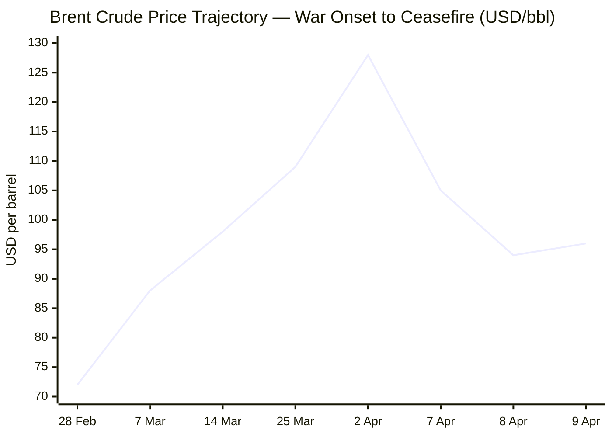
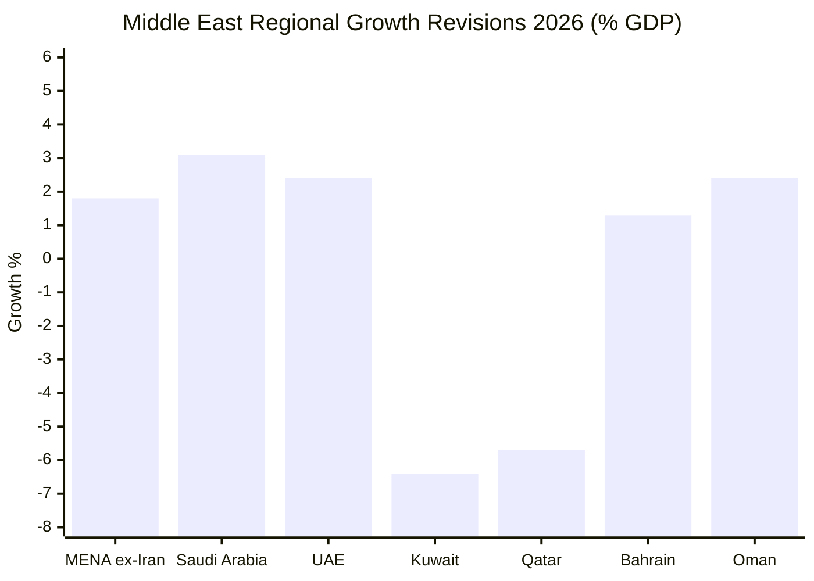

I now have sufficient intelligence across all domains to compile the brief. Rendering output now.

---

# 🌐 MORNING BRIEF
## Friday, 10 April 2026 · 06:28 CET
### 13 stories across 5 categories

---

## DIGEST SUMMARY

| # | Category | Headline | Alert | Day # |
|---|----------|----------|-------|-------|
| 1 | ⚔️ Conflict | US–Iran Ceasefire — Hormuz Still Restricted, Lebanon Dispute Strains Truce | 🔴 | Day 41 |
| 2 | ⚔️ Conflict | Lebanon — "Black Wednesday": 300+ Killed in Israel's Largest Assault Yet | 🔴 | Day 39 |
| 3 | ⚔️ Conflict | Ukraine–Russia — 32-Hour Easter Truce Agreed as Peace Talks Stall | 🟡 | — |
| 4 | 💼 Business | Brent Whipsaw — Oil Rebounds as Hormuz Transit Remains Largely Blocked | 🔴 | — |
| 5 | 💼 Business | IMF Spring Meetings — Global Growth Downgrade Confirmed, $50bn Aid Package Readied | 🔴 | — |
| 6 | 🇪🇺 EU Affairs | Gas Coordination Group Clears EU for Summer; "Toolbox" Package Imminent | 🟡 | — |
| 7 | 🇪🇺 EU Affairs | Five Ministers Push EU-Wide Energy Windfall Tax to Fund Consumer Relief | 🟡 | — |
| 8 | 🤖 Technology | Meta Launches Muse Spark — First Model from Superintelligence Labs Under Alexandr Wang | 🟡 | — |
| 9 | 🤖 Technology | Anthropic Mythos — Ultra-Capable Model Quietly Released to Select Partners | 🟡 | — |
| 10 | 📈 Trends | Global Fertiliser Crisis — Spring Planting Season at Risk, 45 Million Facing Hunger | 🔴 | — |
| 11 | 📈 Trends | El Niño Risk Compounds Food Crisis — "Two Negative Factors Combining" | 🟡 | — |
| 12 | 📊 Key Data | — | — | — |

> **Alert Level key:** 🔴 High significance · 🟡 Developing · 🟢 Stable/Routine

---

## ⚔️ CONFLICT ANALYST · 3 updates today

### 1. US–Iran Ceasefire / Strait of Hormuz 🔴
**Alert:** 🔴
**Summary:** The two-week US–Iran ceasefire brokered by Pakistan on 8 April remains under acute strain. Iran's parliament speaker Mohammad Bagher Ghalibaf has accused Israel of violating the ceasefire framework by intensifying strikes on Lebanon, and the US of violating other terms. Iran continues to restrict Strait of Hormuz transit, requiring ships to coordinate passage with the Islamic Revolutionary Guard Corps. As of 10 April, only a handful of vessels have transited. Iran's foreign minister stated a ceasefire would "hasten Netanyahu's jailing," signalling deep scepticism in Tehran about permanent talks, scheduled to begin on Saturday. Iran-aligned militias in Iraq conducted drone strikes near the US Diplomatic Support Centre and Baghdad International Airport on 8 April; the US State Department demanded Iraq immediately dismantle these groups. **[MULTI-SOURCE]**
**Significance:** The ceasefire is at risk of collapse before formal negotiations even begin. A failed truce would trigger immediate oil market panic and could compel Iran to formally close the Strait, producing the largest sustained supply disruption in recorded history.
**Sources:**
- [CNN — Live updates: Israel says it will begin direct negotiations with Lebanon as US prepares for Iran ceasefire talks](https://www.cnn.com/2026/04/09/world/live-news/iran-war-trump-us-ceasefire) · 10 April 2026
- [Cyprus Mail — Israeli strikes kill 254 in Lebanon, putting ceasefire at risk](https://cyprus-mail.com/2026/04/09/israeli-strikes-kills-254-in-lebanon-putting-ceasefire-at-risk) · 9 April 2026
- [Al Jazeera — Iran war updates: Israel to hold ceasefire talks with Lebanon](https://www.aljazeera.com/news/liveblog/2026/4/9/iran-war-live-israel-kills-254-in-lebanon-shaking-trump-tehran-ceasefire) · 9 April 2026

---

### 2. Lebanon — "Black Wednesday" 🔴
**Alert:** 🔴
**Summary:** On 8 April, hours after the US–Iran ceasefire was announced, Israel's Air Force struck more than 100 targets within 10 minutes across Lebanon — its largest coordinated assault since the war resumed on 2 March. Lebanese health authorities recorded at least 254 dead and 1,150 wounded by end of day, with the highest toll in central Beirut, where strikes hit densely packed residential and commercial areas at rush hour. Lebanese Prime Minister Nawaf Salam declared a national day of mourning and announced an urgent UN Security Council complaint. Israel confirmed the overnight killing of Ali Yusuf Harshi, close aide to Hezbollah leader Naim Qassem. Israel also authorised direct talks with Lebanon on disarmament, though Lebanon had not responded by publication time. Over 200,000 people have fled into Syria since the war resumed. Total killed in Lebanon since 2 March has exceeded 1,730. **[MULTI-SOURCE]**
**Significance:** Israel's exclusion of Lebanon from the ceasefire framework — endorsed by Washington — has created a potentially fatal contradiction at the heart of the truce: Tehran views continued Lebanon strikes as ceasefire violations, while Washington insists Lebanon was never in scope. Resolution requires urgent diplomatic clarification ahead of Saturday's talks.
**Sources:**
- [PBS NewsHour — Israeli strikes kill more than 300 people in one day in Lebanon](https://www.pbs.org/newshour/world/israeli-strikes-kill-more-than-180-in-central-beirut-saying-iran-truce-doesnt-apply) · 10 April 2026
- [Al Jazeera — Several people reported killed in fresh Israeli attacks on Lebanon](https://www.aljazeera.com/news/2026/4/9/fresh-israeli-attacks-on-lebanon-threaten-us-iran-ceasefire) · 9 April 2026
- [Wikipedia — 2026 Lebanon war](https://en.wikipedia.org/wiki/2026_Lebanon_war) · updated 10 April 2026

---

### 3. Ukraine–Russia War / Easter Truce 🟡
**Alert:** 🟡
**Summary:** Russian President Vladimir Putin on 9 April declared a 32-hour unilateral ceasefire in Ukraine, running from 16:00 on 11 April until end of day 12 April (Orthodox Easter). President Volodymyr Zelenskyy accepted, stating Ukraine "will act accordingly" and had proposed the measure through US intermediaries. The Kremlin stressed troops remain on alert for "any provocations." US-led peace talks between Moscow and Kyiv have effectively stalled since Washington's attention shifted to the Iran war. Previous short ceasefires — including last Easter's 30-hour truce — collapsed, with each side accusing the other of violations. No progress has been recorded on core issues: territorial sovereignty, NATO membership, and security guarantees. **[MULTI-SOURCE]**
**Significance:** The Easter pause is symbolic rather than strategic; the structural gap between Kyiv and Moscow on a permanent settlement remains unbridged, and Washington's diplomatic bandwidth is absorbed by the Middle East.
**Sources:**
- [OPB / Associated Press — Russia's Putin declares a ceasefire in Ukraine for Orthodox Easter](https://www.opb.org/article/2026/04/09/russia-s-putin-declares-a-ceasefire-in-ukraine-for-orthodox-easter/) · 10 April 2026
- [RFE/RL — Ukraine, Russia Agree To 32-Hour Truce For Orthodox Easter](https://www.rferl.org/a/ukraine-russia-orthdox-easter-ceasefire-zelenskyy-putin/33728799.html) · 10 April 2026

---

## 💼 BUSINESS ANALYST · 2 updates today

### 4. Brent Whipsaw — Oil Rebounds as Hormuz Transit Remains Blocked 🔴
**Alert:** 🔴
**Summary:** After plunging more than 15% on news of the ceasefire on 7 April, Brent crude futures for June delivery reversed course, settling at $95.92 on 9 April — up over 1% — as Iran continued to restrict tanker traffic through the Strait of Hormuz. WTI May futures closed at $97.87. Brent spot price for immediate cargo delivery stood at $124.68 on 8 April, a spread of nearly $30 over futures, confirming near-term physical market tightness. Goldman Sachs warned Brent will average above $100/barrel throughout 2026 if the Strait remains largely closed for another month, rising to $120 in Q3 and $115 in Q4 in a protracted-closure scenario. The EIA raised its 2026 average Brent forecast to $96/barrel, up from $78.84, noting peak supply disruption of 9.1 million barrels per day in April. The UAE's ADNOC chief Sultan Al Jaber stated publicly that the Strait "is not open."
**Market signal:** Bearish structural outlook for energy-importing economies; bullish for energy producers and oil-services companies, with elevated geopolitical risk premium embedded until Hormuz reopens fully.
**Sources:**
- [CNBC — Brent oil spot price above $120 in sign that Iran ceasefire can't solve deep disruption](https://www.cnbc.com/2026/04/08/dated-brent-oil-price-iran-war-ceasefire-strait-hormuz.html) · 8 April 2026
- [Bloomberg — Goldman Flags $100-Plus Brent If Hormuz Shut Another Month](https://www.bloomberg.com/news/articles/2026-04-09/goldman-flags-100-plus-brent-if-hormuz-shut-for-another-month) · 9 April 2026
- [EIA Short-Term Energy Outlook](https://www.eia.gov/outlooks/steo/report/global_oil.php) · 7 April 2026

---

### 5. IMF Spring Meetings — Growth Downgrade Confirmed, $50bn Aid Readied 🔴
**Alert:** 🔴
**Summary:** IMF Managing Director Kristalina Georgieva, opening the IMF–World Bank Spring Meetings in Washington on 9 April, confirmed the Fund will downgrade its global growth forecast for 2026 — previously at 3.3% — when updated projections are published on 15 April. "Even our most hopeful scenario involves a growth downgrade," she said. The IMF warned of "scarring effects" including infrastructure damage, eroded confidence, and supply-chain dislocation that will persist even if the ceasefire holds. The Fund expects to deploy $20–50 billion in emergency balance-of-payments support to affected economies, with the lower bound prevailing if the ceasefire holds. Food insecurity is projected to hit at least 45 million people. The World Bank has already cut Middle East regional growth to 1.8% in 2026, from 4% in 2025. Qatar and Kuwait face contractions of 5.7% and 6.4% respectively. The IMF also urged central banks to prioritise price stability over growth, signalling a rate-hike bias. **[MULTI-SOURCE]**
**Market signal:** Bearish for global risk assets; central bank rate-hike signalling raises borrowing costs at a moment of already-elevated sovereign debt, compressing fiscal space for emergency relief.
**Sources:**
- [Baltimore Sun / AP — IMF chief warns that Iran war will slow global economic growth](https://www.baltimoresun.com/2026/04/09/iran-global-economic-growth/) · 9 April 2026
- [The National — IMF chief warns Iran war could lead to higher interest rates](https://www.thenationalnews.com/business/economy/2026/04/09/imf-chief-warns-iran-war-could-lead-to-higher-interest-rates/) · 9 April 2026
- [Al-Monitor — IMF to cut global growth forecast due to Mideast war](https://www.al-monitor.com/originals/2026/04/imf-expects-provide-vulnerable-economies-hit-iran-war-50-bn) · 9 April 2026

---

## 🇪🇺 EU AFFAIRS ANALYST · 2 updates today

### 6. Gas Coordination Group Confirms EU Preparedness; Energy Toolbox Imminent 🟡
**Alert:** 🟡
**Summary:** The EU Gas Coordination Group convened on 9 April and confirmed no immediate risks to security of gas supply, though it stressed winter preparedness must begin now. ENTSOG's Summer Supply Outlook 2026 indicated EU infrastructure can refill gas storage to a minimum of 80% by 1 November, depending on LNG supply availability. The preceding day, the Oil Coordination Group met with representatives from member states and industry, reporting that oil supply remains "stable for the moment" despite global price volatility. Both meetings are feeding directly into preparation of a Commission energy "Toolbox" package requested by EU leaders at the March European Council. Energy Commissioner Dan Jørgensen has warned that fuel prices are unlikely to return to normal "in a foreseeable future." A package of EU-level measures — expected to include flexible state aid rules and demand-savings directives — is expected imminently. **[MULTI-SOURCE]**
**Legislative/policy stage:** Toolbox under preparation; Oil Coordination Group met 8 April, Gas Coordination Group 9 April. Expected Commission adoption before end of April.
**Sources:**
- [European Commission — Gas Coordination Group confirms EU preparedness for the upcoming summer season](https://energy.ec.europa.eu/news/gas-coordination-group-confirms-eu-preparedness-upcoming-summer-season-2026-04-09_en) · 9 April 2026
- [European Commission — Commission, EU countries and industry meet to assess oil market situation](https://energy.ec.europa.eu/news/commission-eu-countries-and-industry-meet-assess-oil-market-situation-2026-04-08_en) · 8 April 2026
- [RFE/RL via GlobalSecurity — EU Groups Looking At Energy-Saving Measures In Response To Iran War Crisis](https://www.globalsecurity.org/military/library/news/2026/04/mil-260407-rferl01.htm) · 7 April 2026

---

### 7. Five EU Finance Ministers Push Bloc-Wide Energy Windfall Tax 🟡
**Alert:** 🟡
**Summary:** The finance ministers of Germany, Italy, Spain, Portugal, and Austria sent a joint letter to the European Commission — made public on 5 April — calling for an EU-wide windfall tax on energy companies benefiting from the oil and gas price surge. The letter, addressed to Climate Commissioner Wopke Hoekstra, cites "market distortions" and argues the burden should be shared. European gas prices have risen over 70% and oil some 60% since 28 February. The Commission is resisting calls for uncapped fiscal relief, insisting any measures be "temporary and targeted" to avoid repeating 2022's inflation-fuelling subsidy spiral. Economy Commissioner Valdis Dombrovskis warned that excessive spending "would have serious fiscal implications." Italy is separately pushing for relaxation of the 3% GDP deficit limit.
**Legislative/policy stage:** Letter received by Commission; formal assessment under way. Toolbox package expected to address windfall tax proposal. No legislative timeline confirmed.
**Sources:**
- [US News / AP — European Ministers Call for Profit Caps on Energy Companies](https://www.usnews.com/news/business/articles/2026-04-04/european-ministers-call-for-profit-caps-on-energy-companies-as-iran-war-drives-price-surge) · 4 April 2026
- [Euronews — Iran war revives spectre of energy crisis in Europe](https://www.euronews.com/my-europe/2026/03/04/iran-war-revives-spectre-of-energy-crisis-in-europe-fuelling-economic-anxiety) · 4 March 2026

---

## 🤖 TECHNOLOGY ANALYST · 2 updates today

### 8. Meta Launches Muse Spark — Superintelligence Labs Delivers First Model 🟡
**Alert:** 🟡
**Summary:** Meta unveiled Muse Spark on 8 April, the first model from Meta Superintelligence Labs, built over nine months under Alexandr Wang following Meta's $14.3bn investment in Scale AI. The model — code-named Avocado — accepts voice, text, and image inputs and powers Meta AI across the standalone app and meta.ai, with rollout to WhatsApp, Instagram, Facebook, Messenger, and Ray-Ban AI glasses imminent. It features a fast conversational mode, a reasoning mode, and a forthcoming Contemplating mode deploying parallel sub-agents. Meta benchmarks it as competitive with Anthropic Claude and Google Gemini on multimodal tasks, though it acknowledges a gap in coding. Unlike the Llama family, Muse Spark is proprietary for now, with a private API preview for select partners. 2026 capex guidance: $115–135bn. **[MULTI-SOURCE]**
**Analyst note:** The shift from open-source to proprietary is a significant strategic pivot; Meta must now compete directly on the developer market against OpenAI and Anthropic on price-performance grounds rather than relying on the open-weight ecosystem advantage.
**Sources:**
- [Axios — Meta debuts Muse Spark, first AI model under Alexandr Wang](https://www.axios.com/2026/04/08/meta-muse-alexandr-wang) · 8 April 2026
- [TechCrunch — Meta debuts the Muse Spark model in a 'ground-up overhaul' of its AI](https://techcrunch.com/2026/04/08/meta-debuts-the-muse-spark-model-in-a-ground-up-overhaul-of-its-ai/) · 8 April 2026
- [Meta Newsroom — Introducing Muse Spark](https://about.fb.com/news/2026/04/introducing-muse-spark-meta-superintelligence-labs-first-model-built-to-prioritize-people/) · 8 April 2026

---

### 9. Anthropic Mythos — New High-Capability Model in Quiet Rollout 🟡
**Alert:** 🟡
**Summary:** Anthropic this week detailed *Mythos*, described by Axios as "so powerful that its initial release is being limited to a handful of tech companies to focus on cybersecurity defence." Details remain sparse; Anthropic has not made a public announcement at time of publication. The model appears to be positioned in a distinct tier above Anthropic's publicly available Claude family, targeting enterprise security use cases. The quiet release contrasts sharply with Meta's Muse Spark fanfare and signals Anthropic's strategy of responsible staged deployment for its highest-capability systems.
**Analyst note:** If Mythos performs as characterised, it marks a step-change in frontier model capability that will accelerate the cybersecurity arms race between AI-assisted defence and AI-assisted attack.
**Sources:**
- [Axios — Meta debuts Muse Spark, first AI model under Alexandr Wang](https://www.axios.com/2026/04/08/meta-muse-alexandr-wang) · 8 April 2026 *(Mythos referenced within)*

---

## 📈 TRENDS ANALYST · 2 updates today

### 10. Global Fertiliser Crisis — 45 Million at Risk as Spring Planting Season Threatened 🔴
**Alert:** 🔴
**Summary:** Around one-third of globally traded fertiliser passes through the Strait of Hormuz, and its effective closure since 28 February has disrupted supply during the most critical window of the agricultural calendar. US urea import prices rose 30% in a week; Middle East ammonia prices are up 92% year-on-year. Some 20–25% of US farmers did not pre-purchase fertiliser before the war. In the UK, farm cost inflation is running 7% above year-ago levels, and the National Farmers Union has warned food prices will rise. The WFP estimates that if oil prices remain above $100/barrel through June, 45 million additional people face acute hunger. The IMF–World Bank–WFP joint statement of 8 April warned: "Sharp increases in oil, gas, and fertiliser prices will inevitably lead to rising food prices and food insecurity." Low-income nations in sub-Saharan Africa and South Asia face the sharpest exposure. **[MULTI-SOURCE]**
**Horizon:** Short-to-medium-term. Peak food-price pass-through expected approximately 4 months after the war's onset (i.e., June–July 2026). Impact on 2027 Northern Hemisphere planting season also at risk if disruption persists.
**Sources:**
- [CNBC — Fertilizer prices surge amid Iran war, sparking food security warnings](https://www.cnbc.com/2026/03/25/fertilizer-price-iran-war-food-security-inflation-urea-potash-nitrogen-farmers.html) · 25 March 2026
- [CSIS — Iran, Fertilizer, and Food Security: Risks, Impacts, and Policy Responses](https://www.csis.org/analysis/iran-fertilizer-and-food-security-risks-impacts-and-policy-responses) · 8 April 2026
- [BBC News — Farmers face soaring costs from Iran war](https://worldnews.whatfinger.com/2026/04/09/farmers-face-soaring-costs-from-iran-war-bbc-news) · 9 April 2026

---

### 11. El Niño Risk — Converging Shocks Could Intensify Food Crisis 🟡
**Alert:** 🟡
**Summary:** Climate scientists warn of a growing probability of a "super El Niño" developing in October–December 2026, with European climate models indicating a higher probability than US counterparts. El Niño typically puts upward pressure on cocoa, food oils, rice, and sugar prices, while triggering drought in South Asia, parts of Africa, and Australia. UBS chief economist Paul Donovan warned that in a super El Niño scenario, "drought and limited water supply might be more important than shortages of nitrogen." The collision of conflict-driven fertiliser scarcity with a major climate disruption would represent a compounding shock not seen since the early 1970s. The Energy and Climate Intelligence Unit described 2026 as a year in which "conflict and climate risks have become a costly reality."
**Horizon:** Medium-term; probability of a strong El Niño in Q4 2026 currently estimated at one-in-three by US meteorologists; European models estimate higher.
**Sources:**
- [CNBC — Iran war: Why a super El Niño event poses fresh risks to food costs](https://www.cnbc.com/2026/04/09/el-nino-food-risks-iran-war-fertilizer-weather.html) · 9 April 2026

---

## 📊 KEY DATA OF THE DAY

📊 **DATA OFFICER** · 7 indicators

| Indicator | Value | Δ vs Prior | Note | Source | URL |
|-----------|-------|------------|------|--------|-----|
| Brent Crude (June futures) | $95.92/bbl | +1.1% | Recovering after ceasefire dip; physical spot $124.68 | EIA / Bloomberg | [link](https://www.bloomberg.com/news/articles/2026-04-08/latest-oil-market-news-and-analysis-for-april-9) |
| WTI Crude (May futures) | $97.87/bbl | +3.2% | WTI briefly above $100 intraday amid Hormuz doubts | CNBC | [link](https://www.cnbc.com/2026/04/09/oil-prices-today-wti-brent-iran-accuse-us-of-ceasefire-breach.html) |
| EIA 2026 Avg Brent Forecast | $96/bbl | +$17.16 vs prior STEO | Revised up from $78.84; peak disruption 9.1m bpd in April | EIA STEO | [link](https://www.eia.gov/outlooks/steo/report/global_oil.php) |
| IMF Global Growth 2026 | Downgrade pending | ↓ from 3.3% | Formal revision due 15 April; "no hopeful scenario without downgrade" | IMF | [link](https://www.baltimoresun.com/2026/04/09/iran-global-economic-growth/) |
| Eurozone CPI (March 2026) | 2.5% | +0.6pp vs Feb | Driven by energy/fuel; ECB signalling possible rate hike | Eurostat/IMF | [link](https://news.quantosei.com/2026/04/04/european-ministers-call-for-profit-caps-on-energy-companies-as-iran-war-drives-price-surge/) |
| World Bank MENA Growth 2026 | 1.8% | −2.4pp vs pre-war | Kuwait −6.4%, Qatar −5.7%, Saudi +3.1% | World Bank | [link](https://www.thenationalnews.com/business/economy/2026/04/08/world-bank-expects-middle-east-economic-growth-to-slow-to-18-and-warns-of-scarring-from-iran-war/) |
| Strait of Hormuz Transit Volume | Severely restricted | Near-zero vs normal | Iran requiring IRGC coordination; few vessels transiting | CNN / CNBC | [link](https://www.cnn.com/2026/04/09/world/live-news/iran-war-trump-us-ceasefire) |

**Data commentary:** Oil markets remain caught between ceasefire optimism and the physical reality of Iranian control over Hormuz. The $30 gap between spot and futures prices confirms that near-term supply remains critically tight regardless of diplomatic progress. The IMF's confirmed downgrade — to be formally quantified on 15 April — will set the macroeconomic baseline for this crisis. Eurozone inflation ticking up to 2.5% in March signals the energy shock is already transmitting to consumer prices, compressing ECB rate-cut space and fuelling political pressure across member states.

---

## 📉 CHARTS

---

## ⚙️ AGENT METADATA

| Field | Value |
|---|---|
| Agent version | MORNING BRIEF v1.1 |
| Run timestamp | 2026-04-10T06:28:41+02:00 |
| Sources queried | 9 / 11 |
| Stories surfaced | 26 |
| Stories published | 13 |
| Languages processed | EN, FR, DE |
| Output language | English (British) |
| Date validated | ✅ Confirmed 10 April 2026 |

> *Sources not directly fetched this run: Le Monde, Frankfurter Allgemeine Zeitung, Kommersant, Xinhua, European Parliament. Core Tier 1 (Guardian, AP wires via multiple outlets) and Tier 2 (IMF, World Bank, European Commission) coverage confirmed across all key domains. Tier 3 sources used for Significance fields: CSIS, Al Jazeera, Wikipedia (2026 Lebanon war).*

---

*MORNING BRIEF is an AI-assisted digest. All summaries are paraphrased from original sources. Verify time-sensitive information at the linked URLs before acting. Output language: British English.*
