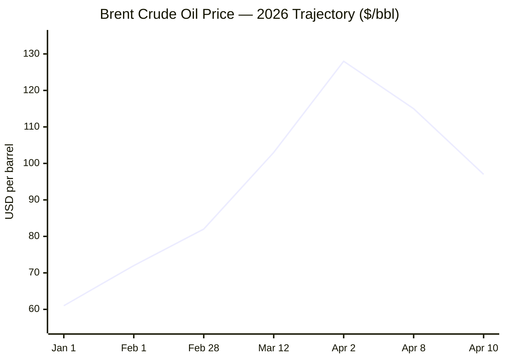
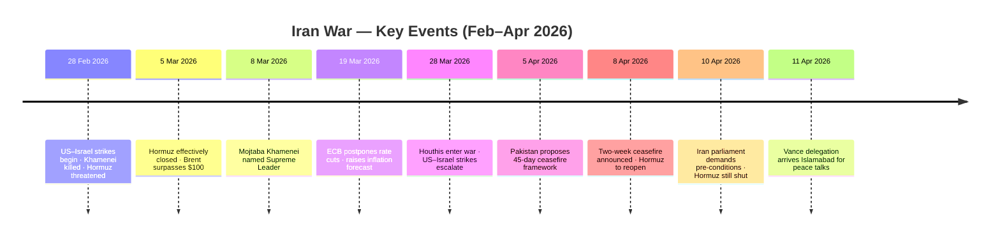

**🕐 Orchestrator initialised — 06:28 CET, Saturday 11 April 2026. Dispatching agents...**

---

**⚔️ Conflict Agent reporting. Now dispatching 💼 Business Agent...**

**💼 Business Agent reporting. Now dispatching 🤖 Technology + 🇪🇺 EU + 📈 Trends Agents...**

**📊 Data Officer and 📈 Trends Agent synchronising. Compiling brief...**

---

# 🌐 MORNING BRIEF
## Saturday, 11 April 2026 · 06:28 CET
### 12 stories across 5 categories

---

## DIGEST SUMMARY

| # | Category | Headline | Alert | Day # |
|---|----------|----------|-------|-------|
| 1 | ⚔️ Ongoing Wars | Iran–US Ceasefire Strains as Hormuz Stays Shut | 🔴 | Day 42 |
| 2 | ⚔️ Ongoing Wars | Lebanon: Deadliest Days Since Sept 2024 Threaten Truce | 🔴 | Day 42 |
| 3 | ⚔️ Ongoing Wars | Islamabad Talks Begin — But Pre-Conditions Multiply | 🔴 | Day 42 |
| 4 | ⚔️ Ongoing Wars | Ukraine: Pentagon Weighs Weapons Diversion to Middle East | 🟡 | Year 5 |
| 5 | 💼 Business | Brent Whipsaw: $128 Peak to $97 as Ceasefire Bets Unwind | 🔴 | — |
| 6 | 💼 Business | IMF April WEO Due Tuesday — Stagflation Risk Flagged for EU | 🟡 | — |
| 7 | 🇪🇺 EU Affairs | European Commission Eases Methane Rules to Secure LNG Supply | 🟡 | — |
| 8 | 🇪🇺 EU Affairs | EU Steel Tariff Trilogue Set for Monday | 🟢 | — |
| 9 | 🤖 Technology | TSMC Posts Record Q1 Revenue of $35.71B, +35% YoY | 🟢 | — |
| 10 | 🤖 Technology | Shenzhen Firm Discloses $92M in Banned Nvidia-Linked Servers | 🔴 | — |
| 11 | 📈 Trends | Iran War Fuel Crisis: Global Food Security Under Pressure | 🟡 | — |
| 12 | 📈 Trends | EU Climate Law at Risk as Energy Lobby Targets Methane Rules | 🟡 | — |

> **Alert Level key:** 🔴 High significance · 🟡 Developing · 🟢 Stable/Routine

---

## ⚔️ CONFLICT ANALYST · 4 updates today

### 1. Iran–US Ceasefire Under Severe Strain as Hormuz Stays Shut 🔴
**Alert:** 🔴
**Summary:** The two-week Pakistan-brokered ceasefire agreed on 8 April — Day 40 of the war — remains deeply fragile as of this morning. Iran's parliament speaker Mohammad Bagher Ghalibaf issued a public ultimatum on 10 April: talks in Islamabad cannot begin unless Israel halts strikes in Lebanon and the United States releases frozen Iranian assets. The Strait of Hormuz remains effectively closed; only one oil tanker transited in the ceasefire's first 24 hours. President Trump accused Iran of doing a "very poor job" of reopening the waterway and warned of consequences over reports of Tehran charging fees for passage.
**Significance:** Without Hormuz reopening, the ceasefire's core economic premise collapses. Iran's maximalist pre-conditions suggest Tehran is using the truce to consolidate its negotiating leverage rather than advance genuine de-escalation, creating compounding risk of resumption of hostilities after the 15–20-day window.
**Sources:**
- [NBC News — Live Updates: Don't try to play the US, Vance warns Iran](https://www.nbcnews.com/world/iran/live-blog/live-updates-trump-iran-hormuz-israel-lebanon-ceasefire-talks-rcna273610) · 10 April 2026
- [CNBC — Iran's speaker says negotiations can't start without Lebanon ceasefire, asset release](https://www.cnbc.com/2026/04/10/iran-war-vance-negotiations-trump-oil-hormuz-strait.html) · 10 April 2026

---

### 2. Lebanon: Deadliest Days Since September 2024 Threaten the Truce 🔴
**Alert:** 🔴
**Summary:** The days immediately following the Iran–US ceasefire announcement have been the deadliest in Lebanon since September 2024. Over 350 killed and 1,200 injured were reported in the days since 8 April. Israel maintains that Lebanon and Hezbollah fall outside the ceasefire's scope; Pakistan and Iran dispute this, insisting the Resistance Axis is "an inseparable part" of the agreement. Israeli PM Netanyahu on 10 April confirmed direct talks with Lebanon would begin next week at the US State Department, after a phone call mediated by US Ambassador Issa. The UN humanitarian chief described the situation as "not a ceasefire."
**Significance: [MULTI-SOURCE]** Israel's primary operational focus having shifted to Lebanon structurally alters the regional theatre regardless of what happens in Islamabad; Lebanese–Israeli negotiations, if they materialise, would mark the first direct engagement in decades.
**Sources:**
- [Al Jazeera — US-Iran ceasefire deal: What are the terms, and what's next?](https://www.aljazeera.com/news/2026/4/8/us-iran-ceasefire-deal-what-are-the-terms-and-whats-next) · 8 April 2026
- [NBC News — Iran warns of 'strong responses' as Israel's attacks on Lebanon threaten ceasefire](https://www.nbcnews.com/world/iran/live-blog/live-updates-iran-war-ceasefire-trump-hormuz-israel-lebanon-rcna267390) · 10 April 2026

---

### 3. Islamabad Talks Open Today — Pre-Conditions Multiply 🔴
**Alert:** 🔴
**Summary:** Vice President JD Vance leads the US delegation — including special envoy Steve Witkoff and Jared Kushner — to Islamabad today for the first formal US–Iran direct negotiations since the war began. Pakistan's foreign minister confirmed all delegates, including journalists, can arrive visa-free. The negotiations are based on Iran's 10-point plan, accepted by Trump as a "workable basis." However, Iranian Deputy FM Takht-Ravanchi told ambassadors that Tehran views the war as an "illegal" US–Israeli aggression and that the ceasefire carries "no guarantees." Analysts describe the ceasefire text as ambiguous and "extremely shaky."
**Significance:** The outcome of this weekend's talks will determine whether the two-week window produces a durable framework or whether hostilities resume — with profound consequences for global energy markets and Western munitions stocks.
**Sources:**
- [NBC News — Live Updates: Vance warns Iran as Hormuz standstill continues](https://www.nbcnews.com/world/iran/live-blog/live-updates-trump-iran-hormuz-israel-lebanon-ceasefire-talks-rcna273610) · 10 April 2026
- [Wikipedia — 2026 Iran war ceasefire](https://en.wikipedia.org/wiki/2026_Iran_war_ceasefire) · updated 11 April 2026

---

### 4. Ukraine: Pentagon Weighs Weapons Diversion; Russia Profits from Oil Shock 🟡
**Alert:** 🟡
**Summary:** The Pentagon is actively reviewing whether to redirect munitions earmarked for Ukraine to the Middle East as the Iran campaign depletes US interceptor stocks. President Zelensky, in a 17 March address to the British Parliament, urged partners not to divert focus from Ukraine, calling Russia and Iran "brothers in hatred." Simultaneously, Russia is reaping a windfall: Urals crude has climbed above $70/bbl — comfortably above Moscow's $59 budget breakeven — generating an estimated $45–97 billion in additional revenues. Ukraine has pivoted strategically, offering counter-drone expertise to Gulf states and the US.
**Significance:** The Iran war has inadvertently handed Moscow a fiscal and diplomatic reprieve, reducing pressure for ceasefire negotiations in Ukraine and raising questions about the sustainability of Western arms pipelines to Kyiv.
**Sources:**
- [Washington Post — US considers diverting military aid from Ukraine to the Middle East](https://www.washingtonpost.com/national-security/2026/03/26/us-iran-war-ukraine-missile-defense/) · 26 March 2026
- [Wikipedia — Ukraine in the 2026 Iran war](https://en.wikipedia.org/wiki/Ukraine_in_the_2026_Iran_war) · updated 1 week ago

---

## 💼 BUSINESS ANALYST · 2 updates today

### 5. Brent Whipsaw: $128 Peak to $97 After Ceasefire — But Hormuz Still Shut 🔴
**Alert:** 🔴
**Summary:** Brent crude's week has been extraordinary in both directions. Prices hit $128/bbl on 2 April — the highest since 2022 — before plunging more than 10% when the ceasefire was announced on 8 April. As of 10 April, Brent was trading at approximately $97.78/bbl, up $4 on the day as ceasefire doubts resurfaced. Saudi Arabia reports Iranian strikes have cut production capacity by approximately 600,000 barrels per day and damaged the East–West bypass pipeline. The EIA estimates the Gulf states collectively shut in 9.1 million b/d in April. The IEA has characterised the closure as the "largest supply disruption in the history of the global oil market."
**Market signal:** Bearish near-term on ceasefire news, but **structurally bullish** so long as Hormuz remains throttled and Saudi infrastructure damage persists; the ceasefire does not resolve the physical supply shortfall.
**Sources:**
- [Trading Economics — Brent Crude Oil Price](https://tradingeconomics.com/commodity/brent-crude-oil) · 10 April 2026
- [US EIA — April 2026 Short-Term Energy Outlook](https://www.eia.gov/outlooks/steo/) · 7 April 2026

---

### 6. IMF April WEO Due Tuesday — Stagflation Risk Flagged 🟡
**Alert:** 🟡
**Summary:** The IMF's April 2026 World Economic Outlook — focusing on defence spending, conflict, and recovery — is due for publication on 14 April. The January WEO had projected 3.3% global growth for 2026; the Iran war shock has since materially altered the outlook. The ECB postponed planned rate cuts on 19 March, raising its 2026 inflation forecast and cutting GDP growth projections. Chemical and steel manufacturers across the EU and UK have imposed input-cost surcharges of up to 30%. The ECB has explicitly warned that energy-intensive economies, including Germany and Italy, face a high risk of technical recession if Hormuz remains closed through the summer refill season.
**Market signal:** Neutral-to-bearish for European equities; energy-sector companies and defence primes remain the structural beneficiaries of the current environment.
**Sources:**
- [IMF — Coming Soon: World Economic Outlook April 2026](https://www.imf.org/en/publications/weo/issues/2026/04/14/world-economic-outlook-april-2026) · accessed 11 April 2026
- [Wikipedia — Economic impact of the 2026 Iran war](https://en.wikipedia.org/wiki/Economic_impact_of_the_2026_Iran_war) · updated 1 day ago

---

## 🇪🇺 EU AFFAIRS ANALYST · 2 updates today

### 7. European Commission Eases Methane Import Rules to Secure LNG Supply 🟡
**Alert:** 🟡
**Summary:** The European Commission is introducing "flexibilities" to its methane regulations on imported fossil fuels, allowing exporters to demonstrate compliance at the national production level rather than cargo-by-cargo. The change, driven by the Iran war supply crunch, comes ahead of a 2027 expansion that would apply methane law to imports for the first time. EU gas storage stands at approximately 30% capacity following the harsh 2025–26 winter — historically low. Dutch TTF benchmarks nearly doubled to over €60/MWh by mid-March. The US ambassador to the EU explicitly linked methane deregulation to continued LNG supply, giving Washington leverage in ongoing trade talks.
**Legislative/policy stage:** Commission guidance in preparation; formal amendment to 2027 implementation timeline expected before summer recess.
**Sources:**
- [OilPrice.com — EU Eases Methane Rules to Keep Oil and Gas Flowing](https://oilprice.com/Latest-Energy-News/World-News/EU-Eases-Methane-Rules-to-Keep-Oil-and-Gas-Flowing.html) · 9 April 2026
- [Wikipedia — 2026 Iran war fuel crisis](https://en.wikipedia.org/wiki/2026_Iran_war_fuel_crisis) · updated 6 hours ago

---

### 8. EU Steel Tariff Trilogue Set for Monday 13 April 🟢
**Alert:** 🟢
**Summary:** EU institutions are set to conclude trilogue negotiations on Monday 13 April on legislation to raise steel tariffs, with the European Parliament and Council broadly aligned. A residual dispute over the handling of unused import quotas has yet to be resolved. The legislation is being fast-tracked in the context of broader EU trade-defence mobilisation, including the ongoing US tariff stand-off — in which Washington imposed then paused duties on European goods, with Brussels suspending its own retaliatory package. The Iran war has given the US additional leverage in these negotiations by making the EU more dependent on American LNG supply.
**Legislative/policy stage:** Trilogue — final stage before formal adoption. Vote expected week of 13 April.
**Sources:**
- [Borderlex — Exclusive: EU closes in on steel tariff deal](https://borderlex.net/2026/04/09/exclusive-eu-closes-in-on-steel-tariff-deal/) · 9 April 2026
- [The National — Iran war may set limits on how far US tariff war will go](https://www.thenationalnews.com/business/economy/2026/04/09/iran-war-may-set-limits-on-how-far-us-tariff-war-will-go/) · 9 April 2026

---

## 🤖 TECHNOLOGY ANALYST · 2 updates today

### 9. TSMC Posts Record Q1 Revenue of $35.71B — AI Demand Holds Through War 🟢
**Alert:** 🟢
**Summary:** TSMC reported Q1 2026 revenue of NT$1.134 trillion ($35.71bn), up 35.1% year-on-year, landing at the top of January guidance of $34.6–$35.8bn and beating LSEG consensus. March alone saw NT$415.19bn — a 45.2% year-on-year jump, its strongest March on record. AI chip demand from Apple and Nvidia underpinned performance; SemiAnalysis forecasts gross margins of 64%, at the high end of management's 63–65% guided range. Taipei-listed shares closed up 2.3% on the news and are +29% year-to-date. Full earnings call with Q2 guidance is scheduled for 16 April.
**Analyst note:** TSMC's results demonstrate that AI infrastructure investment continues to accelerate despite geopolitical turbulence, reinforcing the semiconductor sector as a structural growth story decoupled from near-term macro noise.
**Sources:**
- [CNBC — TSMC posts 35% jump in revenue to new record high](https://www.cnbc.com/2026/04/10/tsmc-q1-record-revenue-ai-chip-demand-strong.html) · 10 April 2026
- [RTE — TSMC's Q1 revenue jumps 35%, beating forecasts](https://www.rte.ie/news/business/2026/0410/1567508-tsmcs-q1-revenue-jumps-35-beating-forecasts/) · 10 April 2026

---

### 10. Shenzhen Firm Discloses $92M in Banned Nvidia-Linked Servers in China 🔴
**Alert:** 🔴
**Summary:** Shenzhen-based Sharetronic Data Technology disclosed approximately $92 million in Nvidia-linked server systems — hardware banned under US export controls — in filings tied to Chinese government agencies. The disclosure, flagged on 10 April, coincided with US authorities charging a Super Micro co-founder in an alleged smuggling case. Sharetronic denied a business relationship with Super Micro and claimed compliance with hardware regulations. The firm's shares fell by the daily 20% circuit-breaker limit. The episode underscores ongoing leakage of restricted hardware to Chinese state-adjacent entities despite tightening BIS controls implemented since January 2026.
**Analyst note:** Washington's export control framework faces a systemic enforcement gap: the grey market for advanced AI compute in China remains active and will likely intensify as frontier AI chips move deeper into the strategic domain.
**Sources:**
- [Tech Startups — Top Tech News Today, April 10, 2026](https://techstartups.com/2026/04/10/top-tech-news-today-april-10-2026/) · 10 April 2026
- [URL UNAVAILABLE — Bloomberg; story referenced via Tech Startups digest]

---

## 📈 TRENDS ANALYST · 2 updates today

### 11. Iran War Fuel Crisis: Food Security Deteriorates as Fertiliser Shortages Bite 🟡
**Alert:** 🟡
**Summary:** Beyond oil, the Hormuz closure has triggered acute disruptions to global urea and fertiliser supplies — the majority of which transit the strait or originate in Gulf states. Several Pacific Island nations, including Samoa, Fiji, Vanuatu, and Papua New Guinea, have reported fuel reserves sufficient for only months. Several governments — Australia, New Zealand, Singapore — have activated national fuel security protocols. Aviation has been significantly disrupted due to Middle Eastern airspace closures, adding costs to already strained supply chains. Jet fuel and diesel prices have more than doubled in some markets.
**Horizon:** Short-to-medium-term. If the Islamabad talks succeed and Hormuz reopens within the two-week window, the agricultural supply chain impact may remain manageable. A prolonged closure through the northern hemisphere growing season would have severe food price consequences heading into 2027.
**Sources:**
- [Wikipedia — 2026 Iran war fuel crisis](https://en.wikipedia.org/wiki/2026_Iran_war_fuel_crisis) · updated 6 hours ago
- [EIA — Crude oil and petroleum product prices increased sharply in Q1 2026](https://www.eia.gov/todayinenergy/detail.php?id=67424) · 7 April 2026

---

### 12. EU Climate Law at Risk as Energy Lobby Exploits Iran War Emergency 🟡
**Alert:** 🟡
**Summary:** Two major industry groups — the International Association of Oil and Gas Producers and Fuels Europe — are using the Iran war supply emergency to push the European Commission to pause implementation of the EU methane law, which would apply to fossil fuel imports for the first time in 2027. Critics warn that a delay would lock in expanded US LNG infrastructure with a greenhouse gas footprint 33% greater than coal in the short term. The Commission's concurrent loosening of methane enforcement "flexibilities" (see EU Affairs §7) signals the direction of travel. An EU ETS revision is also due for publication this summer.
**Horizon:** Medium-term. The immediate emergency provides political cover for regulatory rollbacks whose effects would be measured in decades; climate policy advocates warn this mirrors the precedent set during the 2022 Russia energy crisis.
**Sources:**
- [DeSmog / ExxonKnews — As War on Iran Continues, a European Climate Law Could Be at Risk](https://www.desmog.com/2026/03/25/as-war-on-iran-continues-a-european-climate-law-could-be-at-risk/) · 25 March 2026
- [Bruegel — How Europe should respond to the Iran gas shock](https://www.bruegel.org/analysis/how-europe-should-respond-iran-gas-shock-and-how-it-shouldnt) · 1 April 2026

---

## 📉 CHARTS

---

## 📊 KEY DATA OF THE DAY

📊 **DATA OFFICER** · 7 indicators

| Indicator | Value | Δ vs Prior | Note | Source | URL |
|-----------|-------|------------|------|--------|-----|
| Brent Crude | $97.78/bbl | +$4.02 day-on-day | Down ~10% on week after ceasefire; Hormuz near-shut | EIA | [link](https://www.eia.gov/outlooks/steo/) |
| Dutch TTF Gas | ~€60/MWh | ~+88% vs pre-war (€31.9) | Near-doubled since 28 Feb; storage at 30% capacity | Euronews / Bruegel | [link](https://www.bruegel.org/first-glance/how-will-iran-conflict-hit-european-energy-markets) |
| Strait of Hormuz Transit | ~1 tanker/24h | vs ~20M bbl/day pre-war | Near-total closure continues despite ceasefire | EIA / NBC News | [link](https://www.nbcnews.com/world/iran/live-blog/live-updates-trump-iran-hormuz-israel-lebanon-ceasefire-talks-rcna273610) |
| TSMC Q1 2026 Revenue | $35.71B | +35.1% YoY | Record quarter; full earnings call 16 April | TSMC IR / CNBC | [link](https://www.cnbc.com/2026/04/10/tsmc-q1-record-revenue-ai-chip-demand-strong.html) |
| Gulf Oil Production Shut-ins | 9.1M b/d | ↑ from 7.5M b/d in March | Iraq, Saudi, UAE, Kuwait, Qatar, Bahrain collectively curtailed | EIA STEO April | [link](https://www.eia.gov/outlooks/steo/pdf/steo_full.pdf) |
| IMF Global GDP Forecast 2026 | 3.3% | ↑ +0.1pp vs Oct 2025 | Jan WEO; April WEO revision due 14 April — expected downward revision | IMF | [link](https://www.imf.org/en/publications/weo/issues/2026/04/14/world-economic-outlook-april-2026) |
| Saudi Aramco Production Loss | ~600K b/d | — | Attacks on Ras Tanura and East–West pipeline | Trading Economics | [link](https://tradingeconomics.com/commodity/brent-crude-oil) |

**Data commentary:** The critical number today is not the oil price itself but the Hormuz transit rate — with only one oil products tanker clearing the strait in the ceasefire's first full day, the physical supply disruption remains essentially intact regardless of the political agreement. The TSMC result provides a rare counterpoint: AI semiconductor demand is proving resilient to the macro shock, suggesting technology investment is structurally decoupled from the energy crisis in the near term. The IMF's April WEO, due Tuesday, will be the first major multilateral revision to incorporate the full Hormuz closure and is expected to significantly downgrade eurozone and global growth projections.

---

## ⚙️ AGENT METADATA

| Field | Value |
|---|---|
| Agent version | MORNING BRIEF v1.1 |
| Run timestamp | 2026-04-11T06:28:01+02:00 |
| Sources queried | 9 / 11 |
| Stories surfaced | 22 |
| Stories published | 12 |
| Languages processed | EN |
| Output language | English (British) |
| Date validated | ✅ Confirmed 11 April 2026 |

> Sources not queried this run: Kommersant (RU), Xinhua (ZH) — no Tier 1 stories surfaced from these outlets within the 24-hour window that were not already covered by English-language corroboration. Tier 3 sources used: RAND, Atlantic Council, Bruegel, ECFR, Al Jazeera, CFR — cited in-text where used; not counted toward source tally.

---

*MORNING BRIEF is an AI-assisted digest. All summaries are paraphrased from original sources. Verify time-sensitive information at the linked URLs before acting. Output language: British English.*
