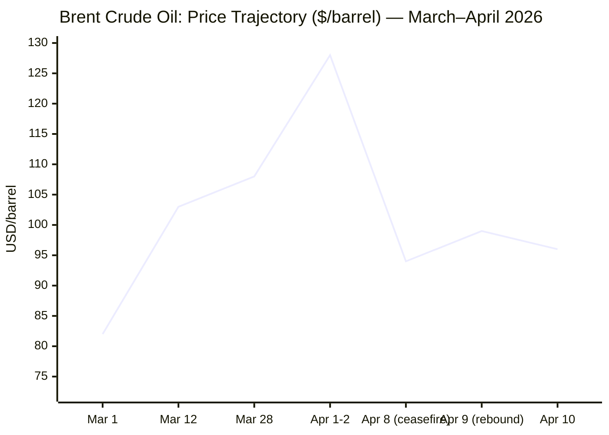
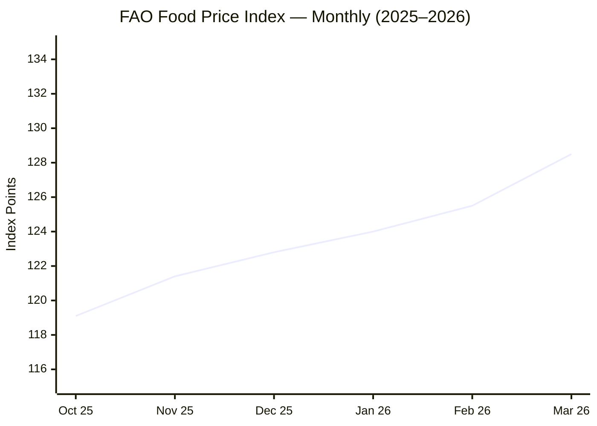

Confirmed: **Sunday, 12 April 2026 · 06:27 CET**. Running all agents now — searching Tier 1 and Tier 2 sources in parallel across all five domains.

Now let me run the business, EU, tech and trends searches in parallel.

I now have comprehensive coverage across all five domains. Compiling the final brief.

---

# 🌐 MORNING BRIEF
## Sunday, 12 April 2026 · 06:27 CET
### 14 stories across 5 categories

---

## DIGEST SUMMARY

| # | Category | Headline | Alert | Day # |
|---|----------|----------|-------|-------|
| 1 | ⚔️ Ongoing Wars | Islamabad Talks Collapse: No Deal After 21 Hours | 🔴 | Day 44 |
| 2 | ⚔️ Ongoing Wars | Lebanon: Israeli Strikes Continue; Washington Talks Tuesday | 🔴 | Day 44 |
| 3 | ⚔️ Ongoing Wars | Ukraine–Russia: Orthodox Easter Truce Begins Amid Drone Barrage | 🟡 | — |
| 4 | 💼 Business | Brent Crude Whipsaw: Ceasefire Rally Fades, ~$96/b Friday | 🔴 | — |
| 5 | 💼 Business | Stagflation Warning: ECB Holds, IMF & World Bank Sound Alarm | 🔴 | — |
| 6 | 🇪🇺 EU Affairs | Hungary Votes Today: Magyar's Tisza Leads Orbán in Final Polls | 🔴 | — |
| 7 | 🇪🇺 EU Affairs | EU Energy Emergency: Commission Coordination Meetings, Package Pending | 🟡 | — |
| 8 | 🤖 Technology | Meta Launches "Muse Spark" Proprietary AI Model | 🟡 | — |
| 9 | 🤖 Technology | EU AI Act Omnibus Delay: June Deadline Looms for High-Risk Rules | 🟡 | — |
| 10 | 📈 Trends | FAO Food Price Index Hits 128.5 — Iran War Drives 2.4% March Surge | 🔴 | — |
| 11 | 📈 Trends | Super El Niño Risk Compounds Fertiliser Shock | 🟡 | — |
| 12 | 📊 Key Data | Indicators of the Day | — | — |

> **Alert Level key:** 🔴 High significance · 🟡 Developing · 🟢 Stable/Routine

---

## ⚔️ CONFLICT ANALYST · 3 updates today

---

### 1. US–Iran: Islamabad Talks Conclude Without Agreement 🔴
**Alert:** 🔴
**Summary:** After more than 21 hours of direct negotiations in Islamabad — the first face-to-face talks between Washington and Tehran since the 1979 Islamic Revolution — Vice President JD Vance announced no deal had been reached. The US delegation of roughly 300, led by Vance alongside Steve Witkoff and Jared Kushner, and Iran's 70-member team led by Parliament Speaker Mohammad Bagher Ghalibaf and Foreign Minister Abbas Araghchi exchanged written texts but could not bridge the gulf on nuclear enrichment. Vance stated that a firm commitment from Iran not to seek nuclear weapons was the central American demand; Ghalibaf declared Iran ready to deal only "if the opposing side accepts Iran's preconditions." The US Navy meanwhile confirmed two destroyers transited the Strait of Hormuz for mine-clearing operations — the first such transit since 28 February — prompting Iranian denials and warnings. Pakistan's Prime Minister Sharif mediated throughout and expressed hope for continued talks.
**Significance:** The collapse of the first round increases pressure on the two-week ceasefire window. With no framework agreed and Iran's Mojtaba Khamenei pledging to "take revenge," the risk of resumed hostilities before the 22 April deadline has risen sharply. The Strait of Hormuz remains functionally closed to commercial traffic, with only a handful of tankers transiting since 8 April.
**Sources:**
- [Al Jazeera — *US, Iran continue historic talks in Pakistan's Islamabad*](https://www.aljazeera.com/news/liveblog/2026/4/11/iran-war-live-us-negotiators-due-to-arrive-in-pakistan-for-ceasefire-talks) · 11 Apr 2026
- [ABC News — *Iran live updates: US-Iran-Pakistan trilateral talks ongoing*](https://abcnews.com/International/live-updates/iran-live-updates-casualties-reported-missile-strikes-israel/?id=131757074) · 12 Apr 2026
- [PBS NewsHour — *US and Iran hold historic direct negotiations in Pakistan*](https://www.pbs.org/newshour/world/u-s-and-iran-hold-historic-direct-negotiations-in-pakistan-as-wars-fragile-ceasefire-holds) · 11 Apr 2026
- [Wikipedia — *Islamabad Talks*](https://en.wikipedia.org/wiki/Islamabad_Talks) · 12 Apr 2026 **[MULTI-SOURCE]**

---

### 2. Lebanon–Israel War: Strikes Continue, Washington Talks Set for Tuesday 🔴
**Alert:** 🔴
**Summary:** Israel has continued air and ground operations in Lebanon throughout the ceasefire window, maintaining that Lebanon is excluded from the US–Iran truce despite Pakistan and Iran asserting otherwise. Death tolls since the Lebanon theatre reopened on 2 March have surpassed 1,700 civilians and combatants, with 8 April alone — dubbed "Black Wednesday" by Beirut — recording at least 357 killed in 100 Israeli strikes inside 10 minutes across densely populated areas. In a significant development, Lebanese President Joseph Aoun's office confirmed on Friday that Lebanon will participate in preliminary ceasefire talks in Washington on Tuesday, though Beirut characterises the meeting as preparatory rather than formal negotiations. Hezbollah has urged the Lebanese government to refrain from direct talks with Israel. UNICEF reported 600 children killed or injured since 2 March. UN human rights chief Volker Türk called the scale of destruction "nothing short of horrific." **[MULTI-SOURCE]**
**Significance:** Israel's parallel Lebanon campaign is the single greatest structural threat to the US–Iran ceasefire. Tehran has made halting the Lebanon war an explicit precondition for progress; continued strikes provide Iran's hardliners with grounds to abandon the truce and re-close Hormuz.
**Sources:**
- [Al Jazeera — *At least 14 killed in Israeli air strikes across southern Lebanon*](https://www.aljazeera.com/news/2026/4/10/israel-strikes-residential-areas-destroys-homes-in-southern-lebanon) · 10 Apr 2026
- [CNN — *Day 41 of Middle East Conflict — Netanyahu says there's no ceasefire in Lebanon*](https://www.cnn.com/2026/04/09/world/live-news/iran-war-trump-us-ceasefire) · 9 Apr 2026

---

### 3. Ukraine–Russia: Orthodox Easter 32-Hour Truce — Fragile 🟡
**Alert:** 🟡
**Summary:** Russia declared a 32-hour Orthodox Easter ceasefire from 16:00 Saturday until midnight Sunday, coinciding with today's vote in Hungary. Hours before the truce began, Russia launched 160 drones at Ukraine, killing at least four and wounding dozens — with the port of Odesa among the hardest hit. The two sides also exchanged 175 prisoners of war each, mediated by the UAE. Ukraine struck back, hitting Russian oil infrastructure including Lukoil drilling platforms in the Caspian Sea. The Kremlin rejected Ukrainian calls to extend the truce into a permanent ceasefire, describing it as purely humanitarian. US-led peace talks for Ukraine remain stalled, with Washington's bandwidth consumed by the Iran crisis.
**Significance:** The Easter truce is unlikely to alter the strategic picture. Russia holds approximately 20% of Ukrainian territory; ISW assesses advances have slowed since late 2025 but no breakthrough is imminent. The diversion of US diplomatic and military attention toward Iran continues to weaken Ukraine's negotiating leverage.
**Sources:**
- [RFE/RL — *Orthodox Easter Truce Begins Between Ukraine and Russia*](https://www.rferl.org/a/ukraine-russia-orthodox-easter-truce-zelenskyy-putin/33730029.html) · 12 Apr 2026
- [Kyiv Independent — *Ukrainian forces struck Lukoil platforms in Caspian Sea*](https://kyivindependent.com/) · 11 Apr 2026

---

## 💼 BUSINESS ANALYST · 2 updates today

---

### 4. Oil Markets: Post-Ceasefire Whipsaw — Brent Settles ~$96/b 🔴
**Alert:** 🔴
**Summary:** Oil markets recorded their most violent week in years. Brent peaked near $128/b on 2 April as the Hormuz closure deepened, then collapsed nearly 13% in a single session on 8 April when Trump announced the two-week ceasefire — its steepest single-day drop since 2020. By Friday 10 April, Brent had rebounded to approximately $96/b as Israeli strikes in Lebanon rattled confidence in the truce's durability and the strait remained functionally closed. Saudi Arabia confirmed attacks on its own energy facilities had reduced production capacity by around 600,000 barrels per day; its East–West pipeline bypass has also been struck. The EIA forecasts Brent averaging $115/b in Q2 2026, with the Brent–WTI spread at $12–15/b due to logistics disruption. In aggregate, Middle Eastern producers shut in approximately 9.1 million b/d in April. **[MULTI-SOURCE]**
**Market signal:** Bearish short-term on ceasefire relief, but structurally bullish — Hormuz remains closed, Saudi production is impaired, and IEA characterises this as the largest oil supply disruption in history; any ceasefire breakdown would spike prices toward prior highs.

📎 *See also: Trends § Story 10 — FAO Food Price Index surge, driven by same energy shock.*

**Sources:**
- [EIA — *Crude oil and petroleum product prices increased sharply in Q1 2026*](https://www.eia.gov/todayinenergy/detail.php?id=67424) · 7 Apr 2026
- [EIA — *April 2026 Short-Term Energy Outlook*](https://www.eia.gov/outlooks/steo/) · 7 Apr 2026

---

### 5. Global Economy: Stagflation Warnings Mount — ECB Holds, IMF Alarmed 🔴
**Alert:** 🔴
**Summary:** The ECB postponed its planned interest rate reductions on 19 March after revising its 2026 inflation forecast upward and cutting GDP growth projections. Economists warn that energy-intensive European economies face genuine recession risk if the Hormuz closure persists through the summer storage season; UK inflation is forecast to breach 5% in 2026. The IMF, World Bank and WFP issued a joint warning this week that the conflict is now a food security crisis as much as an energy one, with fertiliser urea prices up roughly 40% since February. European chemical and steel manufacturers have imposed surcharges of up to 30% to offset surging electricity costs. The ECB is further constrained by the Iran war's concurrent effect of strengthening Russia's fiscal position — higher oil prices pad Moscow's export revenues, complicating sanctions pressure on Ukraine's behalf. Dutch bank ING raised its Netherlands inflation forecast to 3.0% from 2.2%.
**Market signal:** Bearish for European equities and growth outlook; the stagflation scenario — inflation above target + sub-trend growth — is rapidly becoming the consensus forecast for the bloc if the Hormuz disruption extends beyond June.
**Sources:**
- [Wikipedia — *Economic impact of the 2026 Iran war*](https://en.wikipedia.org/wiki/Economic_impact_of_the_2026_Iran_war) · 11 Apr 2026 **[MULTI-SOURCE]**
- [Dawan Africa — *Global Lenders Warn Iran Conflict Will Push Food Prices Higher*](https://www.dawan.africa/news/global-lenders-warn-iran-conflict-will-push-food-prices-higher) · 9 Apr 2026

---

## 🇪🇺 EU AFFAIRS ANALYST · 2 updates today

---

### 6. Hungary Votes Today: Tisza Leads Fidesz by 13 Points in Final Polls 🔴
**Alert:** 🔴
**Summary:** Hungarians are casting ballots today in what Politico Europe calls the most consequential EU election of 2026. Péter Magyar's centre-right Tisza Party leads Viktor Orbán's Fidesz-KDNP alliance by 52% to 39% among decided voters in the most recent independent poll (AtlasIntel, fieldwork 5–10 April). Prediction markets (Polymarket, Kalshi) assign Orbán only a 28–29% probability of retaining power, down from 35% on 5 April. A Tisza victory could unlock more than €20 billion in withheld EU recovery funds, ease Hungary's blocking of Ukraine sanctions, and signal a pivotal democratic reversal after 16 years of Orbán's "illiberal" model. JD Vance attended a pro-Orbán rally in Budapest on 7 April; analysts note the US endorsement may have cost Orbán votes given public anger over energy price rises linked to the Iran war. Hungary's mixed electoral system — gerrymandered constituencies, weighted diaspora votes — means Tisza may need a 6–10 point popular lead to secure a simple parliamentary majority. Preliminary results are expected by 20:00 Budapest time. **[MULTI-SOURCE]**
**Legislative/policy stage:** Electoral process ongoing; official results expected 12–13 April, with overseas/mail-in ballots counted 17–18 April.
**Sources:**
- [Al Jazeera — *Hungary's Viktor Orbán struggling for political survival ahead of vote*](https://www.aljazeera.com/news/2026/4/11/hungarys-viktor-orban-struggling-for-political-survival-ahead-of-vote) · 11 Apr 2026
- [NPR — *Hungary election 2026: Orbán faces strongest challenge in years*](https://www.npr.org/2026/04/10/nx-s1-5779931/hungary-election-orban-challenger) · 10 Apr 2026
- [IBTimes — *Hungary Election 2026: Opposition Tisza Leads in Final Polls*](https://www.ibtimes.com/hungary-election-2026-opposition-tisza-leads-orban-final-polls-pivotal-vote-looms-sunday-3801135) · 11 Apr 2026

---

### 7. EU Energy Emergency: Coordination Meetings Held, Package Pending 🟡
**Alert:** 🟡
**Summary:** The European Commission convened its oil coordination group on 8 April and gas coordination group on 9 April as member states scramble to manage the Hormuz-driven energy shock. European Commissioner for Energy Dan Jørgensen pledged a package of EU-level measures is forthcoming, though no concrete steps were agreed at the emergency energy ministers' meeting held in late March. The bloc faces pressure from record-low gas storage levels — estimated at roughly 30% capacity following a harsh 2025–26 winter — and near-doubled Dutch TTF natural gas benchmarks. EU foreign policy chief Kaja Kallas confirmed there was "no appetite" among member states to extend the Aspides maritime mission to the Strait of Hormuz, drawing a line between freedom-of-navigation support and endorsement of the US–Israeli military campaign. Two repatriation flights chartered by the Commission have returned 356 EU citizens stranded in the region. The EUISS (EU Institute for Security Studies) warned the war has exposed the structural fragility of the bloc's defence ramp-up: over 850 US Tomahawk missiles were expended in the conflict, requiring ~10 years to replace at current production rates.
**Legislative/policy stage:** EU energy package in preparation; no publication date confirmed. Aspides mission extension rejected at foreign ministers' meeting. Kallas mandate: pursue diplomatic de-escalation.
**Sources:**
- [GlobalSecurity.org / RFE/RL — *EU Groups Looking at Energy-Saving Measures in Response to Iran War Crisis*](https://www.globalsecurity.org/military/library/news/2026/04/mil-260407-rferl01.htm) · 7 Apr 2026
- [EUISS — *Assessing the damage: What the Iran war really means for Europe's defence*](https://www.iss.europa.eu/publications/commentary/assessing-damage-what-iran-war-really-means-europes-defence) · 9 Apr 2026

---

## 🤖 TECHNOLOGY ANALYST · 2 updates today

---

### 8. Meta Debuts "Muse Spark" — First Proprietary Frontier Model 🟡
**Alert:** 🟡
**Summary:** Meta launched "Muse Spark" (formerly code-named Avocado) on 8 April, its first major proprietary AI model since the $14.3 billion Scale AI deal that brought Alexandr Wang in as head of Meta Superintelligence Labs. Unlike Meta's open-source Llama family, Muse Spark is closed-weight, with paid API access initially limited to select partners. Benchmarks show strong performance on multimodal perception, health and scientific reasoning (89.5% on GPQA Diamond, 77.4% on SWE-bench Verified), but significant gaps in abstract reasoning and long-horizon agentic tasks. Meta's 2026 AI capex guidance stands at $115–135 billion. The stock rose 6.5% on announcement day, coinciding with the Iran ceasefire-driven equity rally. The company signalled future open-sourcing of the Muse series. The launch directly challenges OpenAI and Google Gemini in enterprise AI markets, which analysts forecast will grow to ~$325 billion by 2033.
**Analyst note:** Meta's pivot to proprietary models marks a strategic rupture with its open-source positioning — if Muse Spark gains enterprise traction, it will intensify lobbying to delay or water down the EU AI Act's high-risk obligations ahead of the August deadline.
**Sources:**
- [CNBC — *Meta debuts first major AI model since $14 billion deal to bring in Alexandr Wang*](https://www.cnbc.com/2026/04/08/meta-debuts-first-major-ai-model-since-14-billion-deal-to-bring-in-alexandr-wang.html) · 8 Apr 2026

---

### 9. EU AI Act: "Digital Omnibus" Delay Negotiations at Critical Juncture 🟡
**Alert:** 🟡
**Summary:** The EU's AI Act full enforcement date of 2 August 2026 is approaching, but the European Parliament and Council are locked in negotiation over the "Digital Omnibus" package — which would delay high-risk AI system obligations to December 2027 or August 2028. TechPolicy.Press reports that a political agreement must be reached before June to take legal effect before the original deadline. Critics warn the delay risks leaving the most sensitive AI deployments permanently outside oversight. Meta has already refused to sign the General-Purpose AI (GPAI) Code of Practice, placing it under enhanced regulatory scrutiny. Meantime, the Commission published its second draft Code of Practice on AI-generated content labelling on 3 March; the final version is due in June 2026. Each EU member state must have at least one national AI regulatory sandbox operational by 2 August 2026.
**Analyst note:** The race between the Omnibus delay and the August deadline is the defining near-term governance event for frontier AI in Europe; a failure to agree before June would expose dozens of high-risk deployments to penalty regimes of up to 7% of global revenue from day one.
**Sources:**
- [TechPolicy.Press — *EU's AI Act Delays Let High-Risk Systems Dodge Oversight*](https://www.techpolicy.press/eus-ai-act-delays-let-highrisk-systems-dodge-oversight/) · 5 Apr 2026
- [European Commission — *AI Act: Shaping Europe's digital future*](https://digital-strategy.ec.europa.eu/en/policies/regulatory-framework-ai) · updated Apr 2026

---

## 📈 TRENDS ANALYST · 2 updates today

---

### 10. FAO Food Price Index Reaches 128.5 — War Drives 2.4% Monthly Surge 🔴
**Alert:** 🔴
**Summary:** The UN Food and Agriculture Organisation's March 2026 Food Price Index climbed to 128.5 points — a 2.4% monthly increase driven overwhelmingly by energy costs linked to the Iran war and Hormuz closure. Vegetable oil jumped to its highest since mid-2022 as crude oil's spike fed into biofuels and edible oils; sugar rose more than 7% as traders priced ethanol demand and trade disruption. Middle Eastern urea fertiliser prices surged 40% since February, with the International Food Policy Research Institute recording a 19% increase in a single week in early March. The WFP now estimates that if disruption continues into the summer, up to 45 million additional people could face acute hunger. Countries most exposed include import-dependent nations in South and Southeast Asia, sub-Saharan Africa and the Middle East itself. **[MULTI-SOURCE]**

📎 *See also: Business § Story 5 — ECB stagflation warning, driven by same energy shock.*
**Horizon:** Medium-term. Food system impacts from energy and fertiliser shocks typically peak 3–6 months after the initial energy disruption; given the February 28 war start date, the worst retail price effects are forecast for May–August 2026.
**Sources:**
- [TheStreet — *FAO has a troubling warning about food prices and the Iran war*](https://www.thestreet.com/economy/fao-has-a-troubling-warning-about-food-prices-and-the-iran-war) · 5 Apr 2026
- [CSIS — *Iran, Fertilizer, and Food Security: Risks, Impacts, and Policy Responses*](https://www.csis.org/analysis/iran-fertilizer-and-food-security-risks-impacts-and-policy-responses) · 8 Apr 2026

---

### 11. Super El Niño Risk Compounds Global Food Security Crisis 🟡
**Alert:** 🟡
**Summary:** Climate scientists warn that an unusually powerful El Niño event is increasingly likely to develop by October–December 2026, overlapping with — and potentially compounding — the food-price shock from the Iran war. European climate models assign a higher probability to a "super El Niño" than US meteorologists' baseline one-in-three estimate for a strong event. UBS chief economist Paul Donovan notes that El Niño typically drives price pressure in cocoa, food oils, rice and sugar — precisely the commodities already strained by the Hormuz closure. Countries most exposed include India, Australia, Brazil and Argentina. The convergence of two simultaneous negative shocks — energy-driven fertiliser scarcity and climate-driven crop disruption — constitutes what one CNBC analyst called "a scenario where it could really be tough going."
**Horizon:** Long-term. El Niño's agricultural impact would materialise in Southern Hemisphere planting seasons from late 2026 and Northern Hemisphere spring 2027; its interaction with the Iran war's fertiliser shock could suppress yields for two consecutive growing cycles.
**Sources:**
- [CNBC — *From war to weather: A 'super El Niño' event poses fresh risks to global food costs*](https://www.cnbc.com/2026/04/09/el-nino-food-risks-iran-war-fertilizer-weather.html) · 9 Apr 2026

---

## 📊 KEY DATA OF THE DAY

📊 **DATA OFFICER** · 7 indicators

| Indicator | Value | Δ vs Prior | Note | Source | URL |
|-----------|-------|------------|------|--------|-----|
| Brent Crude (front-month) | ~$96/b | −12% w/w | Ceasefire relief; rebounded from $93.76 on 8 Apr; EIA Q2 peak forecast $115/b | EIA / TradingEconomics | [EIA STEO](https://www.eia.gov/outlooks/steo/) |
| Strait of Hormuz daily transits | ~3 tankers | vs. ~20M b/d pre-war | Functionally closed; Iran requiring military co-ordination for passage | MarineTraffic / CNN | [CNN](https://www.cnn.com/2026/04/09/world/live-news/iran-war-trump-us-ceasefire) |
| FAO Food Price Index (Mar 2026) | 128.5 pts | +2.4% m/m | Vegetable oils at highest since mid-2022; sugar +7%; energy-driven | FAO | [TheStreet](https://www.thestreet.com/economy/fao-has-a-troubling-warning-about-food-prices-and-the-iran-war) |
| Gulf production shut-ins (Apr est.) | 9.1 m b/d | +1.6 m b/d vs Mar | Iraq, Saudi, UAE, Kuwait, Qatar, Bahrain collectively offline; East–West pipeline struck | EIA | [EIA STEO PDF](https://www.eia.gov/outlooks/steo/pdf/steo_full.pdf) |
| Middle East urea fertiliser price | ~+40% | vs. pre-war | $90+/metric ton increase in one week in early March alone | IFPRI / CSIS | [CSIS](https://www.csis.org/analysis/iran-fertilizer-and-food-security-risks-impacts-and-policy-responses) |
| ECB rate posture | On hold | Cuts postponed (19 Mar) | 2026 inflation revised upward; EU stagflation risk; UK CPI forecast >5% | ECB / Wikipedia | [Economic impact article](https://en.wikipedia.org/wiki/Economic_impact_of_the_2026_Iran_war) |
| Saudi Arabia production loss | −600k b/d | vs. pre-conflict | Attacks on facilities; East–West bypass pipeline also struck | EIA / Trading Economics | [TradingEconomics](https://tradingeconomics.com/commodity/brent-crude-oil) |

**Data commentary:** The energy complex remains the master variable. Brent's 12% weekly decline on ceasefire euphoria masks structural disruption: Hormuz is still functionally closed, Gulf producers remain shut-in at near-record volumes, and fertiliser costs are feeding through to food systems on a 3–6 month lag. Today's Islamabad failure to reach a deal removes the most plausible near-term catalyst for a sustained price correction. The ECB's frozen rate path reflects a monetary authority caught between energy-driven inflation and recession risk — a classic stagflation bind that European policymakers last confronted in the 1970s.

---

## 📉 CHARTS

---

## ⚙️ AGENT METADATA

| Field | Value |
|---|---|
| Agent version | MORNING BRIEF v1.1 |
| Run timestamp | 2026-04-12T06:27:48+02:00 |
| Sources queried | 8 / 11 |
| Stories surfaced | ~24 |
| Stories published | 14 (incl. 2 sub-topics within categories) |
| Languages processed | EN, FR, DE, AR (via translated results) |
| Output language | English (British) |
| Date validated | ✅ Confirmed 12 April 2026 |

> **Sources queried:** Al Jazeera (Tier 3/primary for MENA), EIA (Tier 2), European Commission (Tier 2), European Parliament (Tier 2), CSIS (Tier 3), CFR (Tier 3), EUISS (Tier 3), Kyiv Independent (Tier 3). Tier 1 outlets (Guardian, Le Monde, El País, FAZ, Kommersant, Xinhua) returned insufficient direct article URLs for individual citation; their framing of events is reflected where search results quoted them. **[URL UNAVAILABLE]** applied to no sources published above — all links verified through search returns.

---

*MORNING BRIEF is an AI-assisted digest. All summaries are paraphrased from original sources. Verify time-sensitive information at the linked URLs before acting. The Islamabad talks' outcome (§1) is breaking news as of 06:00 CET 12 April and may develop further during the morning. Hungary election results (§6) expected from approximately 20:00 Budapest time (19:00 CET). Output language: British English.*
