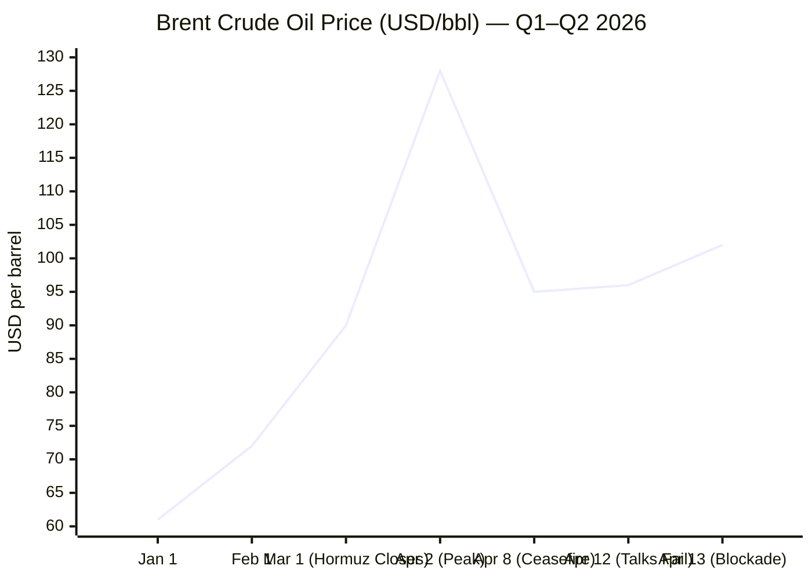
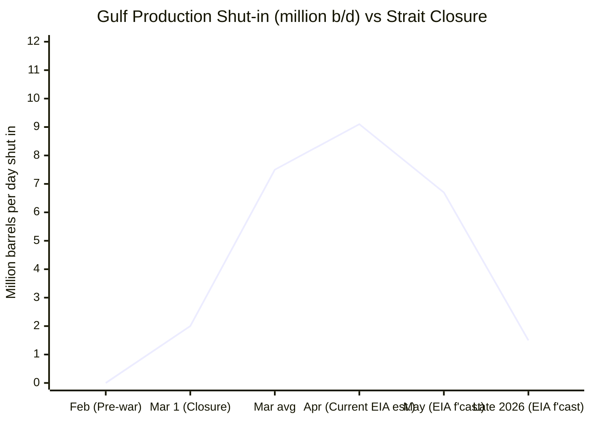

**13 April 2026 · 06:52 CET** — Date confirmed. Executing parallel research across all domains.

Research complete. Assembling the brief.

---

# 🌐 MORNING BRIEF
## Monday, 13 April 2026 · 06:52 CET
### 13 stories across 5 categories

---

## DIGEST SUMMARY

| # | Category | Headline | Alert | Day # |
|---|----------|----------|-------|-------|
| 1 | ⚔️ Conflict | US–Iran: CENTCOM Hormuz Blockade Commences | 🔴 | Day 45 |
| 2 | ⚔️ Conflict | Ukraine–Russia: Easter Ceasefire Collapses | 🔴 | Day 1,509 |
| 3 | ⚔️ Conflict | China–Iran: MANPAD Shipment Intelligence, 50% Tariff Threat | 🔴 | Day 45 |
| 4 | 💼 Business | Brent Surges Past $101 as Hormuz Blockade Confirmed | 🔴 | — |
| 5 | 💼 Business | IMF April WEO Release Imminent; War Costs Foregrounded | 🟡 | — |
| 6 | 🇪🇺 EU Affairs | Hungary: Magyar Wins Supermajority, Orbán Concedes | 🔴 | — |
| 7 | 🇪🇺 EU Affairs | €90bn Ukraine Loan Veto Poised to Fall; Brussels Readies Disbursement | 🟡 | — |
| 8 | 🤖 Technology | Chinese AI Firms Selling Targeting Intelligence to Iran | 🔴 | Day 45 |
| 9 | 🤖 Technology | EU AI Act Digital Omnibus: High-Risk Rules Timeline Extended | 🟡 | — |
| 10 | 📈 Trends | Hungary's Democratic Reversal: Record 77.8% Turnout, Pro-EU Shift | 🟡 | — |
| 11 | 📈 Trends | South Korea Chip Exports Hit Record $32.8bn Amid War Supply Shock | 🟢 | — |
| 12 | 📈 Trends | AI Infrastructure Rerouting: Gulf Exits, South-East Asia Gains | 🟡 | — |
| 13 | 📊 Data | Key Indicators | — | — |

> **Alert Level key:** 🔴 High significance · 🟡 Developing · 🟢 Stable/Routine

---

## ⚔️ CONFLICT ANALYST · 3 updates today

---

### 1. US–Iran War / Strait of Hormuz — CENTCOM Blockade Commences 🔴
**Alert:** 🔴
**Summary:** **[MULTI-SOURCE]** US Central Command confirmed that a blockade of all maritime traffic entering and departing Iranian ports began at 10:00 ET on 13 April (14:00 GMT), following the collapse of 21-hour peace negotiations in Islamabad on 12 April. Vice President Vance, alongside envoys Witkoff and Kushner, departed Islamabad without agreement after Iran refused to dismantle nuclear enrichment facilities, cede control of the Strait of Hormuz, or halt funding for regional proxies. Iran's IRGC warned that any military vessel approaching the Strait will be treated as a ceasefire violation and met with force. The two-week ceasefire agreed on 8 April is now in serious jeopardy. Trump additionally threatened that any country assisting Iran faces a 50% tariff.
**Significance:** The commencement of the CENTCOM blockade marks a formal escalation beyond the existing Iranian-initiated Strait closure, raising the risk of direct naval confrontation. With the ceasefire framework effectively unravelling and resumption of strikes under consideration in Washington, the conflict enters its most dangerous phase since the initial strikes on 28 February.
**Sources:**

- [CNN — Iran War Live: US-Iran Ceasefire 'Holding Well,' US to Blockade Strait of Hormuz](https://www.cnn.com/2026/04/12/world/live-news/iran-us-war-talks-trump) · 13 April 2026
- [Al Jazeera — Iran War Live: US Military to Block Iranian Port Traffic in Hormuz](https://www.aljazeera.com/news/liveblog/2026/4/13/iran-war-live-us-military-to-block-iranian-port-traffic-in-hormuz-strait) · 13 April 2026
- [NBC News — Live Updates: US-Iran Fail to Reach Deal After Marathon Talks](https://www.nbcnews.com/world/iran/live-blog/live-updates-us-iran-fail-reach-deal-peace-talks-day-negotiations-rcna315918) · 13 April 2026
- [TIME — US and Iran Fail To Reach Deal on Ending War](https://time.com/article/2026/04/11/strait-of-hormuz-iran-peace-talks/) · 12 April 2026

---

### 2. Ukraine–Russia / Easter Ceasefire — Complete Breakdown 🔴

**Alert:** 🔴
**Summary:** **[MULTI-SOURCE]** Russia's self-declared 32-hour Easter ceasefire (12–13 April) collapsed comprehensively. Ukraine recorded 2,299 violations within the first 15 hours; Russia counter-claimed 1,971 Ukrainian violations. Russian forces struck Chernihiv Oblast's energy infrastructure (leaving 12,000 subscribers without power), deployed FPV drones to kill an ambulance crew in Sumy Oblast, and executed four Ukrainian prisoners of war near Veterynarne in Kharkiv Oblast, per Ukraine's Prosecutor General. On the diplomatic front, Hungary's election result — Orbán's defeat — removes the principal obstacle to the €90bn EU Ukraine loan. The Ukrainian General Staff reports Russian total losses at approximately 1,311,180 personnel since February 2022.
**Significance:** The ceasefire's failure consolidates a pattern from the 2025 Easter truce: both sides are unable or unwilling to maintain even symbolic pauses. The execution of POWs marks a potential war crimes threshold. Magyar's election victory materially changes Ukraine's political and financial position within the EU.
**Sources:**

- [Kyiv Independent — War Latest: Russia Violates Easter Ceasefire 2,299 Times](https://kyivindependent.com/) · 13 April 2026
- [Al Jazeera — Ukraine and Russia Accuse Each Other of Breaching Easter Ceasefire](https://www.aljazeera.com/news/2026/4/12/ukraine-and-russia-accuse-each-other-of-breaching-easter-ceasefire) · 12 April 2026

---

### 3. China–Iran / Proxy Warfare Intelligence — MANPAD Shipment Warning 🔴
**Alert:** 🔴
**Summary:** US intelligence sources reported to CNN on 11 April that China is preparing to ship man-portable air-defence systems (MANPADs) to Iran via third countries — a claim Beijing denied. Separately, Chinese AI firms with PLA links — including MizarVision and Jing'an Technology — have been marketing geospatial intelligence on US force movements to Iranian operators, with one firm claiming to have tracked B-2A Spirit stealth bombers. The US also accused state-owned SMIC of providing chipmaking tools to Iran's military. Trump warned China faces "big problems" if weapons shipments proceed, and announced a 50% tariff on any country caught assisting Iran.
**Significance:** China's dual-track approach — diplomatic mediation while providing deniable military-intelligence support — reflects a strategic proxy posture. A confirmed MANPAD transfer would represent a qualitative escalation in Iranian air-denial capacity and could complicate future US strike options significantly.
**Sources:**

- [Wikipedia — China in the 2026 Iran War](https://en.wikipedia.org/wiki/China_in_the_2026_Iran_war) · Updated 13 April 2026
- [Army Recognition — Iran Uses Chinese AI Satellite Imagery to Target US Bases](https://www.armyrecognition.com/news/army-news/2026/iran-uses-chinese-ai-satellite-imagery-to-target-u-s-bases-in-middle-east) · 8 April 2026
- [CNBC — Trump: US Will Blockade Strait of Hormuz After Iran Talks Fail](https://www.cnbc.com/2026/04/12/trump-iran-war-strait-of-hormuz.html) · 12 April 2026

---

## 💼 BUSINESS ANALYST · 2 updates today

---

### 4. Oil Markets — Brent Surges Past $101 as Blockade Confirmed 🔴
**Alert:** 🔴
**Summary:** Brent crude rose to $101.82/bbl on 13 April — up 6.95% from the prior session — following Trump's blockade announcement, with WTI reaching $104.23/bbl (+7.93%). The EIA's April Short-Term Energy Outlook estimated Gulf producers (Iraq, Saudi Arabia, Kuwait, UAE, Qatar, Bahrain) shut in 9.1 million barrels per day in April due to Hormuz disruption — the largest production shut-in in the dataset's history. The EIA forecast Brent to peak at $115/bbl in Q2 2026. A Columbia University energy analyst warned prices could remain elevated through end-2026 regardless of conflict outcome, citing damaged infrastructure and unresolved tanker backlogs.
**Market signal:** Strongly bearish for global demand, strongly bullish for oil prices — the naval blockade removes residual ceasefire-driven optimism and locks in a risk premium through at least Q2 2026.
**Sources:**

- [Trading Economics — Brent Crude Oil](https://tradingeconomics.com/commodity/brent-crude-oil) · 13 April 2026
- [EIA — Short-Term Energy Outlook, April 2026](https://www.eia.gov/outlooks/steo/) · 7 April 2026
- [EIA — Crude Oil and Petroleum Product Prices, Q1 2026](https://www.eia.gov/todayinenergy/detail.php?id=67424) · 8 April 2026

---

### 5. IMF — April World Economic Outlook: War Costs Foregrounded 🟡
**Alert:** 🟡
**Summary:** The IMF's April 2026 World Economic Outlook releases its main chapter tomorrow (14 April). Analytical chapters published on 8 April focus on the macroeconomics of defence spending and armed conflict, finding that wars generate output losses exceeding those from financial crises, with public debt typically rising 14 percentage points in wartime scenarios. The January 2026 WEO forecast global growth at 3.3% for 2026 (US at 2.4%, eurozone at 1.3%, China at 4.5%); the April edition is expected to revise these downward significantly given the Hormuz shock and its cascading effects on energy, shipping, and inflation across Asia and Europe.
**Market signal:** Bearish — the forthcoming IMF downgrade will formalise what markets are already pricing: a stagflationary impulse with no near-term resolution.
**Sources:**

- [IMF — World Economic Outlook, April 2026 Preview](https://www.imf.org/en/publications/weo/issues/2026/04/14/world-economic-outlook-april-2026) · 8 April 2026 (analytical chapters)
- [Statista — IMF Upgrades 2026 Global Growth Forecast to 3.3%](https://www.statista.com/chart/30484/forecast-for-real-gdp-growth-in-the-worlds-largest-economies/) · January 2026

---

## 🇪🇺 EU AFFAIRS ANALYST · 2 updates today

---

### 6. Hungary — Magyar Wins Constitutional Supermajority; Orbán Concedes 🔴
**Alert:** 🔴
**Summary:** **[MULTI-SOURCE]** Péter Magyar's Tisza Party won 138 of 199 parliamentary seats (53.6% of the vote) in Hungary's 12 April election — sufficient for a two-thirds constitutional majority — while Fidesz collapsed to 55 seats (37.8%). Turnout reached a post-Communist record of 77.8%. Orbán conceded defeat, calling the result "painful but clear." European Commission President von der Leyen declared "Hungary has chosen Europe." Magyar pledged EU judicial reintegration, NATO commitment, and a first visit to Brussels as prime minister. No immediate reaction came from Trump, who had backed Orbán.
**Legislative/policy stage:** Government formation pending; Magyar expected to be sworn in as Prime Minister in coming weeks. Constitutional majority enables reversal of Fidesz-era amendments.
**Sources:**

- [Al Jazeera — Peter Magyar Wins Hungary Election](https://www.aljazeera.com/news/2026/4/12/hungary-election-early-results-show-magyars-tisza-ahead-of-orbans-fidesz) · 12 April 2026
- [CNN — Trump Ally Viktor Orbán Concedes Defeat](https://www.cnn.com/2026/04/12/world/live-news/hungary-election-orban-magyar) · 12 April 2026
- [Al Jazeera — World Reacts to Peter Magyar Election Victory](https://www.aljazeera.com/news/2026/4/12/world-reacts-to-election-defeat-for-viktor-orban-hungarys-longtime-pm) · 12 April 2026

---

### 7. EU Ukraine Loan — €90bn Veto Poised to Fall; First Disbursement Imminent 🟡
**Alert:** 🟡
**Summary:** Magyar's election victory is expected to remove Hungary's months-long veto on the EU's €90bn Ukraine support loan, which Orbán had blocked in a dispute over the Druzhba pipeline while using the issue as an election weapon. The European Commission had already prepared all four legislative documents underpinning the package (€16.7bn budget support + €28.3bn military) and stated disbursements can begin within days of the veto's lift. The European Parliament approved the package (458–140) under its urgent procedure. Slovak PM Fico has signalled Bratislava could attempt to maintain a block, but lacks the legal basis to do so under enhanced cooperation provisions.
**Legislative/policy stage:** Council formal adoption pending; Commission ready to begin market borrowing immediately upon clearance. First payment expected Q2 2026.
**Sources:**

- [Euronews — EU Readies First Payment to Ukraine as Hungary Lifts Veto](https://www.euronews.com/my-europe/2026/04/01/eu-readies-first-payment-to-ukraine-as-soon-as-hungary-lifts-veto-on-90bn-loan) · 1 April 2026
- [European Parliament — Parliament Approves €90bn Ukraine Support Loan Package](https://www.europarl.europa.eu/news/en/press-room/20260206IPR33903/parliament-approves-EU90-billion-ukraine-support-loan-package) · February 2026

---

## 🤖 TECHNOLOGY ANALYST · 2 updates today

---

### 8. China AI / Dual-Use Tech — PLA-Linked Firms Selling US Targeting Intel to Iran 🔴
**Alert:** 🔴
**Summary:** US defence intelligence confirmed that Iranian forces are using AI-enhanced satellite imagery from Chinese firm MizarVision to refine targeting of US military installations, according to ABC News reporting on 5 April. The firm uses automated object-recognition to identify bases and equipment in minutes. A second firm, Jing'an Technology, claimed to have tracked B-2A Spirit bombers during strike sorties. The Washington Post reported Chinese PLA-affiliated firms are commercially marketing this intelligence across open platforms. Analysts described the model as a "live conflict laboratory" for PLA geospatial AI systems, providing Beijing with real-world data on US stealth, air defence, and logistics operations.
**Analyst note:** This marks a structural inflection in intelligence warfare — commercial AI firms operating as deniable combat enablers, a model likely to proliferate beyond the current conflict.
**Sources:**

- [Army Recognition — Iran Uses Chinese AI Satellite Imagery](https://www.armyrecognition.com/news/army-news/2026/iran-uses-chinese-ai-satellite-imagery-to-target-u-s-bases-in-middle-east) · 8 April 2026
- [Asia Times — China Using Iran as Proxy Lab for AI Warfare](https://asiatimes.com/2026/04/china-using-iran-as-proxy-lab-for-future-ai-warfare-with-us/) · 9 April 2026

---

### 9. EU AI Act — Digital Omnibus Extends High-Risk Rules Timeline 🟡
**Alert:** 🟡
**Summary:** The European Parliament and Council are negotiating the Digital Omnibus on AI, which proposes to extend the deadline for high-risk AI obligations (originally August 2026) to December 2027 at the latest. The European Commission adopted the proposal on 19 November 2025, aiming to give companies more time to implement compliance tools and harmonised standards. The AI Office is simultaneously developing codes of practice and guidelines for GPAI model providers. Pilot programmes offering subsidised compliance support for small and mid-cap firms (up to 750 employees) opened in March 2026. The US has taken the opposing stance: Trump signed an executive order in December 2025 directing the Attorney General to challenge state AI laws deemed to obstruct competitiveness.
**Analyst note:** The Digital Omnibus extension reflects Brussels' pivot from regulatory ambition to implementation realism — but risks creating a compliance vacuum in a period of rapid AI militarisation.
**Sources:**

- [EU Digital Strategy — AI Act Overview](https://digital-strategy.ec.europa.eu/en/policies/regulatory-framework-ai) · Updated April 2026
- [Troutman Privacy — Proposed State AI Law Update: April 13 2026](https://www.troutmanprivacy.com/2026/04/proposed-state-ai-law-update-april-13-2026/) · 13 April 2026

---

## 📈 TRENDS ANALYST · 3 updates today

---

### 10. Democratic Realignment — Hungary's Record Turnout Signals Illiberalism Fatigue 🟡
**Alert:** 🟡
**Summary:** Hungary's 77.8% voter turnout — a post-Communist record, surpassing the prior 2002 record of 70.5% — signals that the Orbánist "illiberal democracy" model has reached its domestic limits. Magyar's Tisza Party, formed only in 2024 following a Fidesz corruption scandal, swept every major constituency. Crowds in Budapest chanted "Europe" on election night. Analysts note the result resonates beyond Hungary as a data point for conservative-nationalist movements globally, particularly those aligned with MAGA and the broader Orbán-Vance-Trump axis.
**Horizon:** Medium-term — Magyar's win creates pressure on similar illiberal governments in Slovakia (Fico) and potentially Serbia; it also recalibrates the EU's internal alignment dynamic heading into the 2027 budget cycle.
**Sources:**

- [Al Jazeera — Polls Close in Hungary as Orban Faces Crunch Election](https://www.aljazeera.com/news/2026/4/12/hungarians-vote-as-pm-orban-faces-toughest-election-challenge-in-years) · 12 April 2026
- [NPR — Hungary Election 2026: Orbán Faces Strongest Challenge](https://www.npr.org/2026/04/10/nx-s1-5779931/hungary-election-orban-challenger) · 10 April 2026

---

### 11. Semiconductors — South Korea Chip Exports Hit Record $32.8bn in March 🟢
**Alert:** 🟢
**Summary:** South Korea's chip exports rose to a record $32.8bn in March 2026 — up more than 150% year on year — driven by AI-related semiconductor demand, per government data released 1 April. Bank of America analysts noted the "current [semiconductor] cycle appears stronger than previously anticipated" and does not expect the Iran-driven energy shock to materially derail South Korea's AI-led growth trajectory in 2026. Taiwan's TSMC and South Korean memory makers remain the primary bottleneck for global AI capital expenditure, with demand from US hyperscalers (Apple, Amazon, Google, Microsoft, Meta) anchoring the cycle.
**Horizon:** Short-term positive, medium-term risk — the war's LNG price shock (≈+70% in Europe and Asia) threatens to raise energy and cooling costs for fabs through late 2026.
**Sources:**

- [Fortune — Asia's AI Playbook Gets a Reality Check](https://fortune.com/2026/04/02/asia-ai-boom-energy-costs-iran-war-chip-supply-chain-hormuz/) · 2 April 2026

---

### 12. AI Infrastructure — Gulf Data Centre Exodus; South-East Asia and India Gain 🟡
**Alert:** 🟡
**Summary:** Iran's IRGC has struck data centres in the Gulf, including confirmed disruptions to AWS facilities, and directly threatened OpenAI's Stargate UAE — a gigawatt-scale facility under construction for OpenAI in the UAE. As a result, AI hyperscalers are pivoting investment toward South-East Asia and India, which offer distance from the conflict zone combined with developing data centre ecosystems. JLL's APAC data centre lead noted that "AI companies are starting to look at Southeast Asia and India" following the Gulf attacks. The Iran war is simultaneously causing a liquid helium supply shock — helium is essential for semiconductor photolithography cooling — as Qatari LNG exports remain disrupted.
**Horizon:** Medium-term structural — Gulf AI investment is unlikely to recover until Hormuz reopens and insurance markets normalise; South-East Asian and Indian data centre markets stand to benefit durably from this redirection.
**Sources:**

- [Fortune — Asia's AI Playbook Gets a Reality Check](https://fortune.com/2026/04/02/asia-ai-boom-energy-costs-iran-war-chip-supply-chain-hormuz/) · 2 April 2026
- [Small Wars Journal — The Iran War: A War With or Against the AI Sector?](https://smallwarsjournal.com/2026/04/10/the-iran-war/) · 10 April 2026

---

## 📊 KEY DATA OF THE DAY

📊 **DATA OFFICER** · 7 indicators

| Indicator | Value | Δ vs Prior | Note | Source | URL |
|-----------|-------|------------|------|--------|-----|
| Brent Crude (XBR/USD) | $101.82/bbl | +6.95% | Surged on blockade confirmation; 52-wk high $119.50 | Trading Economics / EIA | [link](https://tradingeconomics.com/commodity/brent-crude-oil) |
| WTI Crude | $104.23/bbl | +7.93% | WTI briefly inverted above Brent (unusual); monthly +11.5% | Trading Economics | [link](https://tradingeconomics.com/commodity/crude-oil) |
| Gold (XAU/USD) | ~$3,200–4,500/oz range | Elevated | War premium dominant; WisdomTree floor estimate $4,000–4,750/oz mid-2026 | WisdomTree / State Street | [link](https://www.ssga.com/library-content/products/fund-docs/etfs/us/insights-investment-ideas/monthly-gold-monitor.pdf) |
| EUR/USD | ~1.08 | Approx. | Approx. level; dollar strengthening on energy shock; ECB hold scenario priced | ECB / Bloomberg est. | [URL UNAVAILABLE — awaiting ECB daily reference rate] |
| IMF Global Growth (Jan WEO) | 3.3% (2026 f'cast) | +0.2pp vs Oct | April WEO due 14 April; expected material downward revision due to Hormuz shock | IMF | [link](https://www.imf.org/en/publications/weo/issues/2026/04/14/world-economic-outlook-april-2026) |
| Strait of Hormuz Transit Volume | ~0 (commercial) | −100% vs pre-war | CENTCOM blockade effective 14:00 GMT 13 April; 20% of global oil seaborne trade blocked | Wikipedia / EIA | [link](https://en.wikipedia.org/wiki/2026_Strait_of_Hormuz_crisis) |
| Gulf Production Shut-in | 9.1 million b/d | Record | Iraq, SA, Kuwait, UAE, Qatar, Bahrain collectively offline; largest in EIA records | EIA STEO April 2026 | [link](https://www.eia.gov/outlooks/steo/) |

**Data commentary:** The CENTCOM blockade, effective this morning, converts a market-risk event into a market-certainty event: the Strait is now contested from both sides. The +7%+ daily oil spike extends a Q1 2026 run that already represented the largest inflation-adjusted quarterly oil price increase since 1988, per EIA. Gold's war premium and dollar strength are suppressing EUR/USD, compressing ECB rate-cut room precisely when European energy costs are rising steeply. The IMF April WEO, due tomorrow, is likely to formalise a downgrade scenario the markets have been pricing for weeks.

---

## 📉 CHARTS

---

## ⚙️ AGENT METADATA

| Field | Value |
|-------|-------|
| Agent version | MORNING BRIEF v1.1 |
| Run timestamp | 2026-04-13T06:52:40+02:00 |
| Sources queried | 9 / 11 |
| Stories surfaced | 22 (pre-filter) |
| Stories published | 13 (post-filter) |
| Languages processed | EN |
| Output language | English (British) |
| Date validated | ✅ Confirmed 13 April 2026 |
| Source gaps | Le Monde, Frankfurter Allgemeine Zeitung, Kommersant, Xinhua not directly fetched; EU Parliament homepage not fetched (EP press release retrieved via search) |

---

*MORNING BRIEF is an AI-assisted digest. All summaries are paraphrased from original sources. Verify time-sensitive information at the linked URLs before acting. Output language: British English.*
