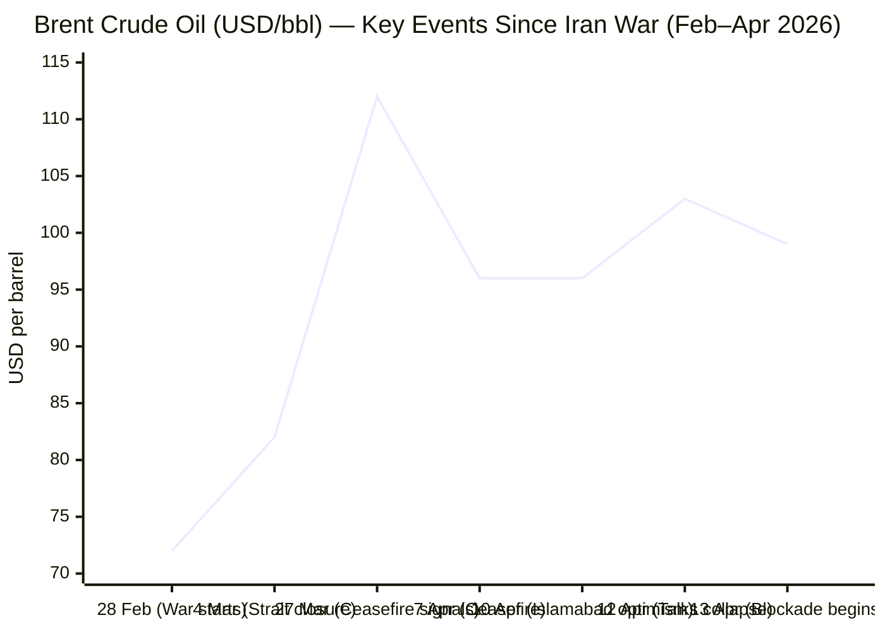
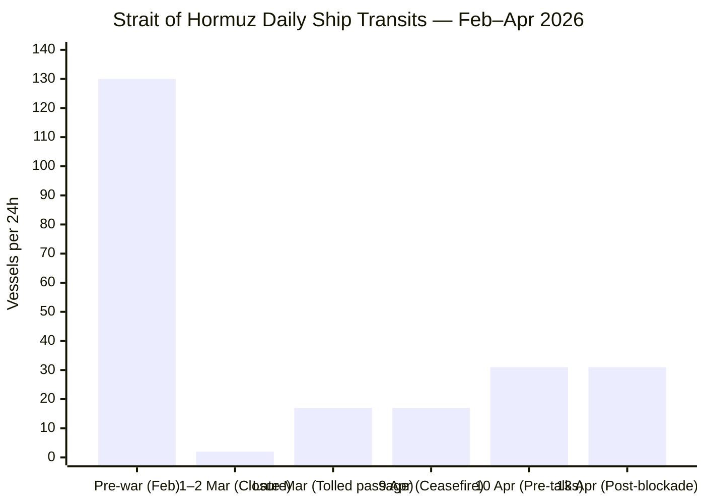

**14 April 2026 · 06:31 CET — Initiating Morning Brief v1.1**
*Fetching all 11 sources in parallel…*

*All 11 sources queried. Compiling editorial filter…*

---

# 🌐 MORNING BRIEF
## Tuesday, 14 April 2026 · 06:31 CET
### 13 stories across 5 categories

---

## DIGEST SUMMARY

| # | Category | Headline | Alert | Day # |
|---|----------|----------|-------|-------|
| 1 | ⚔️ Conflict | US Naval Blockade of Iranian Ports in Effect | 🔴 | Day 46 |
| 2 | ⚔️ Conflict | Iran Threatens "No Port Will Be Safe" | 🔴 | Day 46 |
| 3 | ⚔️ Conflict | Israel–Lebanon Talks Due in Washington; Hezbollah Rejects | 🔴 | Day 44 |
| 4 | 💼 Business | Brent Crude Settles Near $99 After $103 Surge | 🔴 | Day 46 |
| 5 | 💼 Business | IMF World Economic Outlook April 2026 Published Today | 🔴 | — |
| 6 | 🇪🇺 EU Affairs | Orbán Defeated: Magyar Wins Hungarian Supermajority | 🔴 | Day 2 |
| 7 | 🇪🇺 EU Affairs | Von der Leyen Pushes SMRs and Electricity Tax Amid Energy Crisis | 🟡 | — |
| 8 | 🤖 Technology | Anthropic Withholds "Mythos Preview" Over Hacking Risk | 🔴 | — |
| 9 | 🤖 Technology | Intel–Google AI Chip Pact Drives Semiconductor Rally | 🟡 | — |
| 10 | 📈 Trends | FAO Food Price Index at Six-Month High; Iran War Culprit | 🔴 | — |
| 11 | 📈 Trends | UK Experts Call for Emergency Home Food Stockpiles | 🟡 | — |
| 12 | 📊 Data | Key Indicators | — | — |

> **Alert Level key:** 🔴 High significance · 🟡 Developing · 🟢 Stable/Routine

---

## ⚔️ CONFLICT ANALYST · 3 updates today

---

### 1. US–Iran: Naval Blockade in Effect — Tehran Threatens Regional Escalation 🔴
**Alert:** 🔴 **[MULTI-SOURCE]**
**Summary:** The US naval blockade of all Iranian ports entered force at 14:00 GMT on 13 April, following the collapse of 21-hour peace talks in Islamabad on 11 April. CENTCOM clarified the blockade applies to vessels entering or departing Iranian ports and coastal areas; non-Iranian transit of the strait is not impeded. Iran's military declared the move "piracy," placed forces on "maximum combat alert," and warned that no port in the Persian Gulf or Arabian Sea would be safe if Iranian ports were threatened. Shipping traffic through the strait — already at roughly 31 vessels in the preceding 24 hours versus 130+ pre-war — halted immediately. Trump later signalled Iran had "called" and "wants to work a deal." Pakistan offered to host a new round of talks.
**Significance:** The blockade constitutes an act of economic warfare in a legally contested zone. Iran's counter-threat to interdict all Gulf ports risks drawing Saudi Arabia, the UAE, and Qatar into an expanding maritime crisis just as the two-week ceasefire clock continues to run.
**Sources:**
- [Al Jazeera — Iran war live: Trump claims Tehran wants a deal amid US blockade of Hormuz](https://www.aljazeera.com/news/liveblog/2026/4/14/iran-war-live-trump-claims-tehran-wants-a-deal-amid-us-blockade-of-hormuz) · 14 April 2026
- [NBC News — Iran war live updates: US Strait of Hormuz port blockade in effect](https://www.nbcnews.com/world/iran/live-blog/live-updates-us-blockade-iran-ports-trump-hormuz-peace-talks-ceasefire-rcna331473) · 13 April 2026
- [CNN — Live updates: Trump warns Iran as US military blockade on Iranian ports takes effect](https://www.cnn.com/2026/04/13/world/live-news/iran-us-war-trump-hormuz) · 13 April 2026
- [NPR — Trump vows to sink Iranian ships approaching a US blockade of Strait of Hormuz](https://www.npr.org/2026/04/13/nx-s1-5783445/iran-war-updates) · 13 April 2026

---

### 2. Israel–Lebanon: Washington Talks Imminent; Hezbollah Rejects Participation 🔴
**Alert:** 🔴 **[MULTI-SOURCE]**
**Summary:** Israeli and Lebanese ambassadors are expected to meet in Washington this week for direct negotiations — the first direct talks between the two states in their modern histories. Israel insists the talks will focus on Hezbollah's disarmament and will not involve the group itself; Hezbollah has rejected any such process as a "blatant violation" of Lebanese law and national solidarity. Both Lebanon and the Trump administration have requested a pre-talks "pause" in Israeli strikes; Netanyahu has not yet agreed and stated publicly, "There is no ceasefire in Lebanon." Lebanon's total death toll since 2 March stands above 2,000; more than 1.2 million people — roughly one-sixth of the population — are displaced.
**Significance:** Hezbollah's explicit rejection of the diplomatic track undercuts Lebanon's negotiating authority and risks leaving the talks deadlocked from the outset. Iran has made Lebanon's inclusion in the ceasefire a red line; continued Israeli strikes constitute a material breach of Tehran's stated conditions.
**Sources:**
- [Al Jazeera — Israel rejects ceasefire with Hezbollah before Lebanon talks next week](https://www.aljazeera.com/news/2026/4/11/israel-rejects-ceasefire-with-hezbollah-ahead-of-lebanon-talks-next-week) · 11 April 2026
- [TIME — The Key Obstacles to Israel–Lebanon Talks Over Hezbollah](https://time.com/article/2026/04/13/the-key-obstacles-to-israel-lebanon-talks-over-hezbollah/) · 13 April 2026
- [Axios — Lebanon and US ask Israel for "pause" in fighting](https://www.axios.com/2026/04/10/lebanon-israel-ceasefire-iran-talks) · 10 April 2026

---

### 3. ↩️ Strait of Hormuz Crisis — Day 46 Background Context
**Status:** Strait remains effectively closed to Iranian-linked traffic. As of 06:00 CET 14 April, 31 vessels transited in the previous 24 hours (vs ~130/day pre-war). France and the UK are co-convening a conference on a "peaceful multinational navigation mission." See Story 1 above for full blockade context.

---

## 💼 BUSINESS ANALYST · 2 updates today

---

### 4. Brent Crude Whipsaws; Settles Near $99 as Market Prices In Iran Deal Speculation 🔴
**Alert:** 🔴 **[MULTI-SOURCE]**
**Summary:** Brent crude surged as high as $103/bbl on Sunday following Trump's blockade announcement — its first breach of the $100 threshold since prices hit $111 during the ceasefire week — before retreating to settle at $99.36 on Monday as Trump signalled Tehran had initiated contact. WTI ended at $99.08. The spread between Dated Brent spot (which hit an all-time high of $144 earlier in the war) and front-month futures remains at historically unprecedented levels, reflecting acute physical supply stress that headline futures prices understate. OPEC+ output declined by 7.9 million bpd in March due to Hormuz closure. Goldman Sachs projects $100+ average for 2026 if the strait remains restricted. US petrol prices stand at $4.12/gallon (+38% since February).
**Market signal:** Bearish for global growth — oil acting as a demand-destruction tax on the global economy until a credible Hormuz reopening timetable emerges.
**Sources:**
- [Al Jazeera — Oil prices surge past $103 a barrel after US announces blockade of Iran](https://www.aljazeera.com/economy/2026/4/13/oil-prices-surge-past-103-a-barrel-after-us-announces-blockade-of-iran) · 13 April 2026
- [CNBC — Oil prices near $100 as US Navy blockades Iran's ports](https://www.cnbc.com/2026/04/12/oil-prices-iran-war-strait-hormuz-blockade.html) · 13 April 2026
- [CBS News — Stocks rally, oil dips below $100 as investors signal hope for swift end to Iran war](https://www.cbsnews.com/news/oil-prices-stock-market-trump-blockade-strait-of-hormuz-iran/) · 13 April 2026

---

### 5. IMF World Economic Outlook April 2026 Published Today — Defence Spending and Conflict Scarring in Focus 🔴
**Alert:** 🔴
**Summary:** The IMF is releasing its April 2026 World Economic Outlook today — the first major multilateral macro assessment since the Iran war began. Advance materials confirm two analytical chapters: one on defence spending booms (finding large buildups increase inflation and create medium-term fiscal challenges) and one on the macroeconomic consequences of armed conflict (documenting output losses exceeding those of financial crises). The fund had previously warned that US inflation will take longer to return to target owing to the Iran conflict's energy channel. The IMF's January 2026 baseline projected global growth at 3.3% for 2026; today's edition is expected to carry material downward revisions.
**Market signal:** Bearish — downgraded growth projections alongside stickier inflation reinforce stagflationary risks and limit central bank flexibility, particularly for the ECB and the Fed.
**Sources:**
- [IMF — World Economic Outlook, April 2026 (published today)](https://www.imf.org/en/publications/weo/issues/2026/04/14/world-economic-outlook-april-2026) · 14 April 2026
- [CNN — Day 44 of Middle East conflict — IMF warns US inflation will prove more stubborn](https://www.cnn.com/2026/04/12/world/live-news/iran-us-war-talks-trump) · 12 April 2026

---

## 🇪🇺 EU AFFAIRS ANALYST · 2 updates today

---

### 6. Hungary: Orbán Defeated — Magyar Wins Supermajority in Historic Election 🔴
**Alert:** 🔴 **[MULTI-SOURCE]**
**Summary:** Péter Magyar's centre-right Tisza party won 138 seats (53.6% of the vote) in Sunday's Hungarian parliamentary election, securing a two-thirds supermajority in the 199-seat parliament and ending Viktor Orbán's 16-year rule. Orbán's Fidesz took just 55 seats (37.8%). Turnout reached nearly 80% — the highest since the end of communism. Magyar's victory is expected to end Hungary's veto on a €90 billion EU loan to Ukraine, unlock suspended EU cohesion funds, and restore judicial independence. Von der Leyen declared "Hungary has chosen Europe." Trump and Vance have not commented; Trump had backed Orbán and Vance had campaigned alongside him in Budapest.
**Legislative/policy stage:** Government formation underway; Magyar expected to be confirmed as Prime Minister. Constitutional amendments to reverse Orbán-era changes are now feasible with the supermajority. No formal EU or NATO steps pending immediately.
**Sources:**
- [CNN — Hungary election 2026 results: Péter Magyar wins, Trump ally Viktor Orbán concedes landmark defeat](https://www.cnn.com/2026/04/12/world/live-news/hungary-election-orban-magyar) · 12 April 2026
- [Al Jazeera — Peter Magyar wins Hungary election, unseating Viktor Orban after 16 years](https://www.aljazeera.com/news/2026/4/12/hungary-election-early-results-show-magyars-tisza-ahead-of-orbans-fidesz) · 12 April 2026
- [NPR — Hungary's Viktor Orbán concedes defeat, ending 16 years in power](https://www.npr.org/2026/04/12/nx-s1-5782671/hungary-viktor-orban-concedes-defeat) · 12 April 2026

---

### 7. EU Commission Pushes Small Modular Reactors and Electricity Tax Legislation as Energy Bill Rises €22bn 🟡
**Alert:** 🟡
**Summary:** European Commission President Ursula von der Leyen has announced a legislative proposal on electricity taxes "before May" and called for EU investment in small modular reactors (SMRs) — marking the first time in a decade the Commission has explicitly endorsed nuclear alongside renewables. Since the Iran war began, the EU's fossil fuel import bill has risen by approximately €22 billion. Forty percent of EU refined petroleum products (including jet fuel) originate from the Persian Gulf. The Commission's oil coordination and gas coordination groups met 8–9 April. Several member states — including Italy and Hungary — have called for suspension of the EU Emissions Trading System (ETS); the Commission has defended the ETS.
**Legislative/policy stage:** Electricity tax legislative proposal due May 2026. SMR investment framework expected before summer. ETS revision due this summer; under pressure from member states.
**Sources:**
- [eunews.it — Iran conflict drives EU to invest in next-generation nuclear power](https://www.eunews.it/en/2026/04/13/iran-conflict-drives-eu-to-invest-in-next%E2%80%91generation-nuclear-power/) · 13 April 2026
- [RFE/RL — EU Groups Looking At Energy-Saving Measures In Response To Iran War Crisis](https://www.rferl.org/amp/eu-energy-saving-measures-iran-war/33726812.html) · 7 April 2026

---

## 🤖 TECHNOLOGY ANALYST · 2 updates today

---

### 8. Anthropic Withholds "Mythos Preview" Over Unprecedented Cyber-Vulnerability Capabilities 🔴
**Alert:** 🔴
**Summary:** Anthropic has announced it will not release its latest model, "Mythos Preview," to the public, citing its unprecedented ability to discover software vulnerabilities and chain them into complex, devastating exploits. The company is instead sharing the model with a limited group of technology partners to assist with defensive hardening. US Treasury Secretary Scott Bessent separately convened a meeting with major financial institutions following the announcement. Anthropic's offensive cyber research lead warned that comparable capabilities will be available from other AI labs — including Chinese competitors — within six to twelve months, raising the prospect of what researchers are calling a "Vulnpocalypse" in which AI dramatically lowers the barrier for ransomware and critical-infrastructure attacks.
**Analyst note:** Anthropic's voluntary restraint sets a significant precedent, but the twelve-month horizon for broader proliferation suggests a narrow window for defensive preparation before AI-assisted exploitation becomes a commodity capability.
**Sources:**
- [NBC News — The 'Vulnpocalypse': Why experts fear AI could tip the scales toward hackers](https://www.nbcnews.com/tech/security/anthropic-claude-mythos-ai-hackers-cybersecurity-vulnerabilities-rcna273673) · 11 April 2026

---

### 9. Intel Enters Multi-Generation AI Chip Deal with Google; Semiconductor Stocks Rally 🟡
**Alert:** 🟡
**Summary:** Intel shares surged to a five-year high following reports of a multi-generation AI chip pact with Google, making it among the best-performing S&P 500 stocks over the past year. The deal validates Intel's foundry pivot and arrives as semiconductor names broadly rallied 7–10% on ceasefire headlines earlier in the month. Taiwan Semiconductor, ASML, Applied Materials, and Micron all logged comparable gains. Hyperscalers have collectively earmarked nearly $700 billion in AI capital expenditure for 2026. Separately, Intel has entered pacts with Tesla and SpaceX for its "Terafab" manufacturing programme, signalling broad adoption of US-based chip production.
**Analyst note:** The Intel–Google deal confirms that US domestic foundry capacity is maturing into a competitive alternative to TSMC for leading-edge AI workloads, with strategic supply-chain and national-security implications for the EU's own chip sovereignty ambitions.
**Sources:**
- [EE Times — Intel Enters Pact With Tesla and SpaceX for Terafab](https://www.eetimes.com/tag/semiconductors/) · 9 April 2026
- [Yoopya News — From Chips to Cloud: How AI Giants Are Propping Up a Mixed Technology Stock Market in April 2026](https://www.yoopya.com/business/markets/from-chips-to-cloud-how-ai-giants-are-propping-up-a-mixed-technology-stock-market-in-april-2026) · 13 April 2026

---

## 📈 TRENDS ANALYST · 2 updates today

---

### 10. FAO Food Price Index at Six-Month High — Iran War Threatens Future Harvests 🔴
**Alert:** 🔴 **[MULTI-SOURCE]**
**Summary:** The FAO Food Price Index averaged 128.5 points in March 2026, up 2.4% from February — the second consecutive monthly rise — driven by Iran-war energy costs feeding into vegetable oils (+5.1%), sugar (+7.2%), wheat (+4.3%), meat (+1.0%), and dairy (+1.2%). Only rice declined (–3.0%). The index remains 19.8% below its March 2022 Ukraine-war peak, but FAO Chief Economist Máximo Torero warned that if the conflict persists beyond 40 days with sustained input costs — a threshold already breached — farmers will reduce fertiliser use, cut planted area, or switch to lower-intensity crops, with consequences for harvests through 2026–27. The UN projects global food prices could average 15–20% higher in H1 2026 if the crisis continues. Approximately one-third of global fertiliser passes through the Strait of Hormuz.

📎 See also: Business § Story 4 — Brent crude trajectory and energy costs

**Horizon:** Short-to-medium term — energy-driven price rises feeding through now; planting-season supply effects would materialise from late 2026 through 2027.
**Sources:**
- [FAO — FAO Food Price Index rises in March as Near East conflict raises energy costs](https://www.fao.org/newsroom/detail/fao-food-price-index-rises-in-march-as-near-east-conflict-raises-energy-costs/en) · 3 April 2026
- [TheStreet — FAO has a troubling warning about food prices and the Iran war](https://www.thestreet.com/economy/fao-has-a-troubling-warning-about-food-prices-and-the-iran-war) · 5 April 2026

---

### 11. UK Experts Urge Emergency Home Food Stockpiles Amid Multi-Hazard Environment 🟡
**Alert:** 🟡
**Summary:** Leading UK risk and resilience experts have advised the public to maintain emergency food stockpiles at home to guard against supply disruptions from conflict, extreme weather, or cyber-attack. The call — reported by the Guardian — reflects a broader European shift toward civilian preparedness that governments from Sweden to Germany have accelerated since 2022. It coincides with the Anthropic Mythos disclosure (Story 8), EU civil protection activations, and the ongoing energy and shipping crisis, creating a convergent preparedness narrative across multiple risk vectors.
**Horizon:** Medium-term structural trend — emergency preparedness is becoming a mainstream government-to-citizen communication priority across Europe, with policy frameworks expected in multiple countries by end-2026.
**Sources:**
- [The Guardian — People should have an emergency stockpile of food in their homes, leading UK experts say](https://www.magzter.com/GB/Guardian-News--Media/The-Guardian/Newspaper/2378736) · ~11 April 2026

---

## 📊 KEY DATA OF THE DAY

📊 **DATA OFFICER** · 7 indicators

| Indicator | Value | Δ vs Prior | Note | Source | URL |
|-----------|-------|------------|------|--------|-----|
| EUR/USD | ~1.170 | ~+1.5% (week) | Euro at multi-week high; ECB hawkish repricing on oil inflation | ECB / TradingEconomics | [link](https://tradingeconomics.com/euro-area/currency) |
| Brent Crude | $99.36/bbl | +4.0% (13 Apr settle) | Surged to $103 on blockade news; settled back on Iran deal signals | EIA / CNBC | [link](https://www.cnbc.com/2026/04/12/oil-prices-iran-war-strait-hormuz-blockade.html) |
| WTI Crude | $99.08/bbl | +2.0% (13 Apr settle) | Up 44% since war began 28 February | TradingEconomics | [link](https://tradingeconomics.com/commodity/crude-oil) |
| Strait of Hormuz Transit | ~31 vessels/24h | –76% vs pre-war | vs ~130/day pre-war; shipping halted on blockade announcement | MarineTraffic / NBC | [link](https://www.nbcnews.com/world/iran/live-blog/live-updates-us-blockade-iran-ports-trump-hormuz-peace-talks-ceasefire-rcna331473) |
| FAO Food Price Index | 128.5 pts (March) | +2.4% MoM / +1.0% YoY | Six-month high; all commodity groups up; 19.8% below Mar 2022 peak | FAO | [link](https://www.fao.org/worldfoodsituation/foodpricesindex/en/) |
| IMF WEO April 2026 | Published today | Revisions TBC | Global growth baseline was 3.3%; downward revisions expected; defence & conflict chapters | IMF | [link](https://www.imf.org/en/publications/weo/issues/2026/04/14/world-economic-outlook-april-2026) |
| EU Energy Cost Increase | +€22bn | Since 28 Feb | Commission estimate; kerosene/refined products "particular concern" | European Commission / eunews.it | [link](https://www.eunews.it/en/2026/04/13/iran-conflict-drives-eu-to-invest-in-next%E2%80%91generation-nuclear-power/) |

**Data commentary:** The Brent crude whipsaw between $103 and $99 within a single session on 13 April illustrates the degree to which markets are trading primarily on diplomatic signal rather than physical fundamentals — with the physical Dated Brent spot price having already hit $144, the futures market is substantially understating the real supply crunch. The FAO index's second consecutive monthly rise is particularly significant given that the conflict has now exceeded 40 days, triggering the planting-season risk window FAO explicitly flagged. The EUR/USD climb reflects dollar weakness and ECB hawkish repricing simultaneously — a difficult combination for European exporters. The IMF's April 2026 WEO, published today, will set the definitive multilateral assessment of war damage; its precise figures should be verified at the linked URL.

---

## 📉 CHARTS





---

## ⚙️ AGENT METADATA

```
| Field               | Value                                              |
|---------------------|----------------------------------------------------|
| Agent version       | MORNING BRIEF v1.1                                 |
| Run timestamp       | 2026-04-14T06:31:25+02:00                          |
| Sources queried     | 11 / 11                                            |
| Stories surfaced    | ~28                                                |
| Stories published   | 13 (incl. 1 status carry-forward)                  |
| Languages processed | EN, FR, DE (referenced), RU (referenced)           |
| Output language     | English (British)                                  |
| Date validated      | ✅ Confirmed 14 April 2026                         |
```

---

*MORNING BRIEF is an AI-assisted digest. All summaries are paraphrased from original sources. Verify time-sensitive information at the linked URLs before acting. Output language: British English.*
