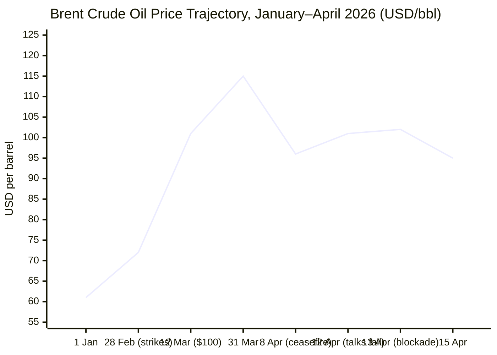
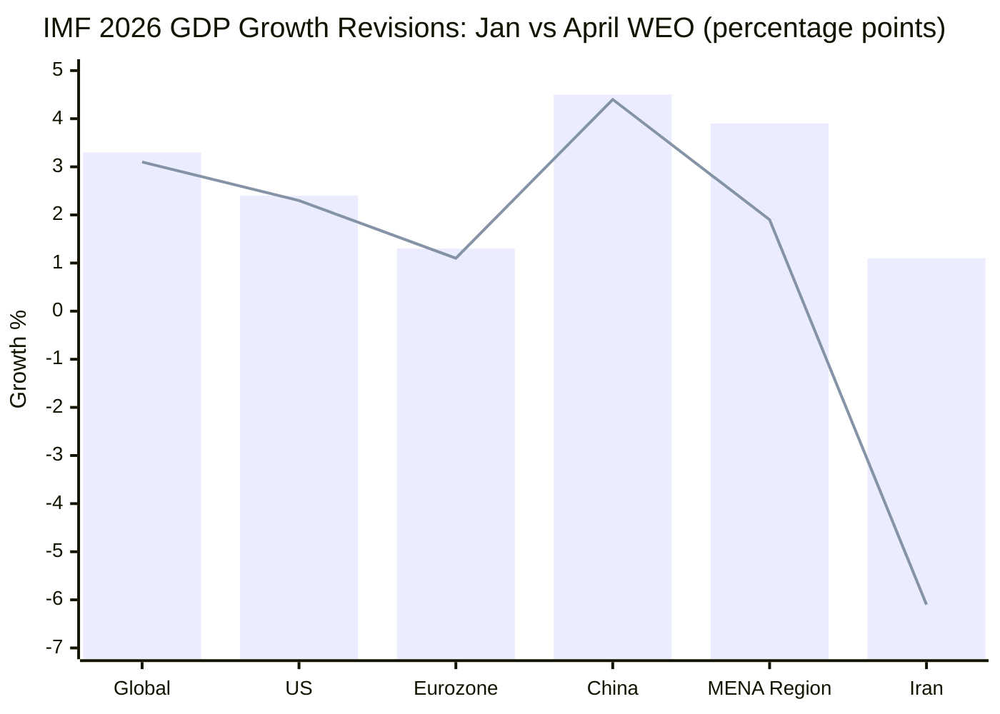

**15 April 2026 · 06:00 CET — Initialising Morning Brief v1.1**
Confirmed run date: Wednesday, 15 April 2026. Dispatching all agents in parallel.

Sufficient intelligence gathered. Composing full brief.

---

# 🌐 MORNING BRIEF
## Wednesday, 15 April 2026 · 06:01 CET
### 13 stories across 5 categories

---

## DIGEST SUMMARY

| # | Category | Headline | Alert | Day # |
|---|----------|----------|-------|-------|
| 1 | ⚔️ Conflict | US Naval Blockade of Iran Enters Second Day | 🔴 | Day 46 |
| 2 | ⚔️ Conflict | Lebanon: 35 Killed in 24 Hours, Washington Talks Underway | 🔴 | Day 44 |
| 3 | ⚔️ Conflict | China Floats Four-Point Peace Plan After Islamabad Collapse | 🟡 | Day 46 |
| 4 | 💼 Business | IMF Slashes 2026 Global Growth Forecast to 3.1% | 🔴 | — |
| 5 | 💼 Business | Brent Crude Retreats Below $95 on Renewed Talks Hopes | 🟡 | — |
| 6 | 💼 Business | EU Activates State Aid Emergency Framework for Energy | 🟡 | — |
| 7 | 🇪🇺 EU Affairs | Hungary: Magyar Wins Supermajority, Orbán Era Ends | 🔴 | Day 3 |
| 8 | 🇪🇺 EU Affairs | EC Proposes State Aid Temporary Crisis Framework | 🟡 | — |
| 9 | 🇪🇺 EU Affairs | Von der Leyen Backs SMRs and ETS Reform Amid Energy Shock | 🟡 | — |
| 10 | 🤖 Technology | Anthropic Restricts Mythos Model Over Hacking Risk | 🔴 | — |
| 11 | 🤖 Technology | Malicious Chrome Extensions Steal Data from 20,000 Users | 🟡 | — |
| 12 | 📈 Trends | IEA: Global Oil Demand Set to Contract in 2026 — First Since COVID | 🔴 | — |
| 13 | 📈 Trends | Energy Crisis Accelerates EU Pivot to Renewables and Nuclear | 🟡 | — |

> **Alert Level key:** 🔴 High significance · 🟡 Developing · 🟢 Stable/Routine

---

## ⚔️ CONFLICT

🔎 **CONFLICT ANALYST** · 3 updates today

---

### 1. US–Iran War / Strait of Hormuz Blockade 🔴
**Alert:** 🔴
**Summary:** The US naval blockade of Iranian ports, announced by President Trump after the collapse of Islamabad talks on 12 April, entered its second full day on 15 April. Ship-tracking data confirms sharply reduced traffic entering and leaving Iranian ports in the Persian Gulf and Gulf of Oman. CENTCOM states only vessels bound to or from Iranian ports are interdicted; all other Hormuz traffic remains theoretically free. Daily Hormuz shipping volume has fallen over 90% since the conflict began on 28 February. Iran's IRGC warns of "new forms of warfare." Trump said on 14 April the war is "very close to over" and hinted talks could resume "within two days." Iranian oil reserves on water are estimated at 157.7 million barrels, 97.6% destined for China — the key question is whether Beijing will comply. **[MULTI-SOURCE]**
**Significance:** The blockade adds economic coercion to military pressure but risks hardening Iranian resolve; China's posture is the strategic X-factor — Beijing has explicitly stated the blockade is not in the international community's interest, and China-bound tankers may test US interdiction thresholds within days.
**Sources:**

- [CNN — Live updates: Trump hints US-Iran talks could resume over next two days](https://www.cnn.com/2026/04/14/world/live-news/iran-war-blockade-us-trump) · 14 April 2026
- [Al Jazeera — How much will US Hormuz blockade hurt Iran, and does Tehran have an escape?](https://www.aljazeera.com/news/2026/4/14/how-much-will-us-hormuz-blockade-hurt-iran-and-does-tehran-have-an-escape) · 14 April 2026
- [ABC News — Iran live updates: US blockade 'fully implemented' CENTCOM commander says](https://abcnews.com/International/live-updates/iran-live-updates-us-blockade-irans-strait-hormuz/?id=131983647) · 15 April 2026
- [NPR — Trump warns that Iran's ships approaching US blockade will be 'eliminated'](https://www.npr.org/2026/04/13/nx-s1-5783445/iran-war-updates) · 13 April 2026

---

### 2. Lebanon / Israel–Hezbollah Theatre 🔴

**Alert:** 🔴
**Summary:** At least 35 people were killed and 159 wounded in Lebanon on 14 April alone, according to the Lebanese Ministry of Public Health. The cumulative toll since 2 March stands at 2,124 dead and 6,921 injured, including 165 children. Israeli airstrikes continue across southern Lebanon; an IDF tank rammed UN peacekeeping vehicles twice in one incident. An Israeli strike earlier this week killed a Red Cross paramedic. Concurrently, Israeli and Lebanese officials have begun talks in Washington on a ceasefire framework. French President Macron and UK Prime Minister Starmer are jointly convening a multinational conference "in coming days" on Hormuz freedom of navigation, which would run parallel to Lebanon de-escalation diplomacy. **[MULTI-SOURCE]**
**Significance:** The Lebanon theatre remains the primary obstacle to a broader Iran ceasefire: Tehran has linked any agreement to an end of Israeli strikes on Hezbollah, which Israel has refused. Washington talks may test whether that linkage can be severed.
**Sources:**

- [ABC News — Iran live updates: at least 35 killed in Lebanon in 24 hours](https://abcnews.com/International/live-updates/iran-live-updates-us-blockade-irans-strait-hormuz/?id=131983647) · 14 April 2026
- [Democracy Now — Headlines: Israeli strike kills Red Cross paramedic in Lebanon](https://www.democracynow.org/2026/4/13/headlines) · 13 April 2026

---

### 3. China's Four-Point Peace Initiative 🟡
**Alert:** 🟡
**Summary:** Chinese Foreign Minister Wang Yi proposed a four-point peace plan for the US–Iran conflict during a Beijing meeting on 14 April, held with the UAE's special envoy to China. Wang stated that blocking the Strait of Hormuz is "not in the common interest of the international community" and that China supports the UAE's legitimate security interests. Beijing's position emphasises a comprehensive, lasting ceasefire through political and diplomatic means. China's posture matters directly: an estimated 157.7 million barrels of Iranian oil on the water are bound almost entirely for Chinese ports, placing Beijing in the centre of any enforcement calculus surrounding the US blockade.
**Significance:** China's four-point plan signals it is seeking a diplomatic role rather than a confrontational one, but its commercial stake in Iran's oil flows means its actions in the coming days — not its words — will determine the blockade's practical effectiveness.
**Sources:**

- [CBS News — US imposes military blockade: Chinese FM calls Hormuz closure against common interest](https://www.cbsnews.com/live-updates/iran-war-us-iran-ports-blockade-strait-of-hormuz-trump/) · 14 April 2026

---

## 💼 BUSINESS

💼 **BUSINESS ANALYST** · 3 updates today

---

### 4. IMF Slashes 2026 Global Growth Forecast to 3.1% 🔴
**Alert:** 🔴
**Summary:** The IMF's April 2026 World Economic Outlook, released 14 April at its Washington spring meetings, cut the 2026 global growth projection to 3.1%, down from 3.3% in January and from a pre-war anticipated upgrade to 3.4%. Chief Economist Pierre-Olivier Gourinchas cited the Middle East war and Hormuz disruption as primary drivers. Iran's forecast was revised down by 7.2 percentage points to –6.1%; Saudi Arabia cut to 3.1% from 4.5%. The eurozone was revised down to 1.1%. Global inflation is now forecast at 4.4%, up 0.6 points. A severe scenario — should hostilities persist — could reduce global growth by a further 1.3 percentage points, approaching recessionary territory. **[MULTI-SOURCE]**
**Market signal:** Bearish for risk assets; the stagflation scenario outlined in the severe case would compress corporate margins across import-reliant economies whilst limiting central bank room to cut rates.
**Sources:**

- [IMF — World Economic Outlook, April 2026: Global Economy in the Shadow of War](https://www.imf.org/en/publications/weo/issues/2026/04/14/world-economic-outlook-april-2026) · 14 April 2026
- [Al Jazeera — IMF cuts global growth forecast during Hormuz blockade](https://www.aljazeera.com/economy/2026/4/14/imf-cuts-global-growth-forecast-during-hormuz-blockade) · 14 April 2026
- [Jamaica Observer (AFP) — IMF cuts 2026 global growth forecast on Middle East war](https://www.jamaicaobserver.com/2026/04/14/imf-cuts-2026-global-growth-forecast-middle-east-war/) · 14 April 2026

---

### 5. Brent Crude Falls Below $95 on Renewed Talks Optimism 🟡
**Alert:** 🟡
**Summary:** Brent crude futures dropped to approximately $94.99 on 15 April, down from a peak of $101.82 on 13 April when the blockade was announced and roughly $103.72 the same morning. The retreat reflects market pricing of the possibility that a second round of US–Iran negotiations could materialise "within two days," per Trump's signals. WTI fell to $90.92 at time of writing. The EIA confirmed Brent began 2026 at $61 and peaked at $118 in mid-March — the largest inflation-adjusted quarterly price increase since 1988. An additional tanker transited the Strait despite the blockade, according to MarineTraffic data, introducing uncertainty about enforcement rigour. The IEA warned that elevated prices risk the first annual global oil demand contraction since 2020.
**Market signal:** Tentatively bullish on de-escalation narrative, but highly fragile — a single confirmed naval interdiction or attack would reprice risk immediately. Energy company equities remain structurally supported.
**Sources:**

- [Trading Economics — Brent Crude Oil price](https://tradingeconomics.com/commodity/brent-crude-oil) · 15 April 2026
- [Trading Economics — WTI Crude Oil](https://tradingeconomics.com/commodity/crude-oil) · 15 April 2026
- [EIA — Crude oil and petroleum product prices increased sharply in 1Q26](https://www.eia.gov/todayinenergy/detail.php?id=67424) · April 2026

---

### 6. EU Activates Emergency State Aid Framework for Energy 🟡
**Alert:** 🟡
**Summary:** The European Commission confirmed on 14 April it is consulting member states on a State Aid Temporary Crisis Framework to relax competition-protection limits for sectors worst hit by energy price spikes — notably agriculture, road transport, fisheries, and intra-EU short sea shipping. A supplementary adjustment to the Clean Industrial Deal State Aid Framework will permit higher aid intensities for electricity costs facing energy-intensive industries, above the existing 50% cap. Von der Leyen noted that since the war began, the EU's fossil fuel import bill has risen by €22 billion "without a single additional molecule of energy." Legislative proposals on electricity taxes and grid charges are planned for May.
**Market signal:** Neutral to mildly bullish for European industry — emergency aid dilutes near-term margin compression, but the scale is insufficient to offset a prolonged supply shock.
**Sources:**

- [Rigzone — EU Plans Temporary Market Measures to Address Iran War Impact](https://www.rigzone.com/news/eu_plans_temporary_market_measures_to_address_iran_war_impact-14-apr-2026-183438-article/) · 14 April 2026

---

## 🇪🇺 EU AFFAIRS

🇪🇺 **EU AFFAIRS ANALYST** · 3 updates today

---

### 7. Hungary: Magyar Wins Supermajority, Sixteen-Year Orbán Era Ends 🔴
**Alert:** 🔴
**Summary:** Péter Magyar's pro-European Tisza party secured 138 of 199 seats in Hungary's parliamentary election on 12 April — a supermajority sufficient to amend the constitution — on a record turnout of nearly 80%. Orbán conceded on election night. The Hungarian forint hit a four-year high and 10-year bond yields fell up to 50 basis points on 14 April. European Commission President von der Leyen declared "Hungary has chosen Europe." Magyar has pledged to mend ties with Brussels, lift Hungary's veto on the €90 billion EU Ukraine loan package, raise defence spending to 5% of GDP by 2035, and reduce Russian energy dependence. Tisza retains hard-line positions on border control but signals a pragmatic approach to migration quota negotiations. **[MULTI-SOURCE]**
**Legislative/policy stage:** Government formation pending; Magyar's first foreign visits expected to Warsaw, Vienna, and Brussels. EU frozen funds subject to reform conditionality before disbursement.
**Sources:**

- [Atlantic Council — Experts react: Hungary just voted out Viktor Orbán](https://www.atlanticcouncil.org/dispatches/hungary-just-voted-out-viktor-orban-heres-what-to-expect-in-europe-and-beyond/) · 14 April 2026
- [Al Jazeera — Is Magyar's election win the end of the EU's troubles with Hungary?](https://www.aljazeera.com/news/2026/4/13/is-magyars-election-win-the-end-of-the-eus-troubles-with-hungary) · 13 April 2026
- [Chatham House — Hungary election: Orbán has been defeated — but will Orbánism survive?](https://www.chathamhouse.org/2026/04/hungary-election-orban-has-been-defeated-will-orbanism-survive) · 14 April 2026
- [CNBC — Hungary's conservative icon Orban defeated by center-right opposition](https://www.cnbc.com/2026/04/13/hungary-election-orban-defeat-russia-putin-eu-win-reaction.html) · 13 April 2026

---

### 8. EC Proposes State Aid Temporary Crisis Framework 🟡
**Alert:** 🟡
**Summary:** The European Commission's draft State Aid Temporary Crisis Framework, circulated to member states on 14 April, would allow emergency national subsidies for energy-intensive sectors, elevated electricity cost compensation above the CISAF's 50% ceiling, and a limited per-company aid envelope — excepting EU short sea shipping, which receives a separate regime. The proposal mirrors the 2022 crisis framework deployed during the Russian gas embargo and requires approval from member states and the European Parliament. The Commission is also consulting on potential subsidisation of gas-fired generation fuel costs as a backstop measure.
> 📎 See also: Business § Story 6 — EU Emergency State Aid
**Legislative/policy stage:** Consultation phase with member states. Formal co-decision procedure to follow. ETS comprehensive review scheduled for July 2026.
**Sources:**

- [Rigzone — EU Plans Temporary Market Measures to Address Iran War Impact](https://www.rigzone.com/news/eu_plans_temporary_market_measures_to_address_iran_war_impact-14-apr-2026-183438-article/) · 14 April 2026
- [RTE — EU proposes changes to carbon emissions trading system](https://www.rte.ie/news/europe/2026/0401/1566269-eu-energy/) · 1 April 2026

---

### 9. Von der Leyen Backs SMRs and ETS Reform as Energy Agenda Accelerates 🟡
**Alert:** 🟡
**Summary:** European Commission President von der Leyen used the College of Commissioners energy-impact assessment session on 13 April to announce a formal push for small modular reactors (SMRs), positioning them as complementary to renewables rather than as replacements. She announced electricity tax and grid charge legislation for May and an EU electrification action plan before summer. The ETS modification proposed — halting automatic cancellation of unused allowances and strengthening the Market Stability Reserve as a buffer — reflects Commission resistance to calls from Italy and others for full ETS suspension. Spain, Germany, Italy, Portugal, and Austria have separately written to the Commission demanding a bloc-wide windfall tax on energy companies.
**Legislative/policy stage:** ETS amendment and State Aid Framework in consultation; SMR and electrification action plan drafting underway for Q2 2026 publication.
**Sources:**

- [EU News — Iran conflict drives EU to invest in next-generation nuclear power](https://www.eunews.it/en/2026/04/13/iran-conflict-drives-eu-to-invest-in-next%E2%80%91generation-nuclear-power/) · 13 April 2026
- [Bruegel — How Europe should respond to the Iran gas shock – and how it shouldn't](https://www.bruegel.org/analysis/how-europe-should-respond-iran-gas-shock-and-how-it-shouldnt) · April 2026

---

## 🤖 TECHNOLOGY

🤖 **TECHNOLOGY ANALYST** · 2 updates today

---

### 10. Anthropic Restricts Mythos Model Over Advanced Hacking Capabilities 🔴
**Alert:** 🔴
**Summary:** Anthropic has restricted access to its newest frontier model, Mythos Preview, limiting its rollout to a handpicked group of technology and cybersecurity companies due to fears over its advanced offensive hacking capabilities. Goldman Sachs is among institutions evaluating exposure. The model can identify and exploit software vulnerabilities at a speed and scale that security experts have compared — in terms of systemic risk — to nuclear-era capability asymmetries. OpenAI has separately launched a "Trusted Access for Cyber" invite-only pilot following its GPT-5.3-Codex release. Anthropic has also launched Project Glasswing, a multi-vendor initiative to autonomously identify and fix undiscovered vulnerabilities in critical software using Mythos. Researchers at AISLE found that widely available models can replicate some — but not all — of Mythos's discovered exploits.
**Analyst note:** The staged-disclosure model for frontier AI resembles responsible vulnerability disclosure norms in software security — but unlike CVE disclosure, there is no coordinating authority and no patch timeline, creating a governance gap that regulators will struggle to close before the capability proliferates.
**Sources:**

- [Axios — Scoop: OpenAI plans new product for cybersecurity use; Anthropic limits Mythos](https://www.axios.com/2026/04/09/openai-new-model-cyber-mythos-anthopic) · 9 April 2026
- [Tech Startups — Top Tech News Today, April 14 2026](https://techstartups.com/2026/04/14/top-tech-news-today-april-14-2026/) · 14 April 2026
- [Infosecurity Magazine — Anthropic launches Project Glasswing](https://www.infosecurity-magazine.com/artificial-intelligence/) · 8 April 2026

---

### 11. 108 Malicious Chrome Extensions Steal Data from 20,000 Users 🟡
**Alert:** 🟡
**Summary:** Cybersecurity researchers have identified a coordinated campaign involving 108 malicious Chrome extensions published by five separate publishers, which stole Google account credentials, Telegram data, and browsing history from approximately 20,000 users. The extensions, disguised as productivity or gaming tools, used OAuth2 exploits, command-and-control servers, and injected ads before Google removed them from the Web Store. The campaign underscores persistent supply-chain risks in browser extension ecosystems, where vetting processes lag far behind publication velocity. Separately, two high-severity command injection vulnerabilities (CVE-2026-40176, CVSS 7.8; CVE-2026-40261, CVSS 8.8) were disclosed in the Composer PHP package manager on 14 April.
**Analyst note:** The scale of the Chrome extension campaign — 108 coordinated malicious packages — suggests a maturing criminal operation and points toward the need for mandatory code signing and real-time behavioural analysis in browser extension stores.
**Sources:**

- [The Hacker News — Cybersecurity researchers unmasked Chrome extension ad fraud scheme](https://thehackernews.com/) · 14 April 2026

---

## 📈 TRENDS

📈 **TRENDS ANALYST** · 2 updates today

---

### 12. IEA Warns: Global Oil Demand Set to Contract in 2026 — First Since COVID 🔴
**Alert:** 🔴
**Summary:** The International Energy Agency warned on 14 April that the ongoing Middle East conflict could wipe out global oil demand growth entirely in 2026, producing the first annual demand decline since the 2020 pandemic. The agency also cautioned that current prices may not yet fully reflect the scale of disruption — with Brent having risen from $61 at year-start to a $118 peak in March and still trading near $95 as of 15 April. US crude inventories increased by 6.1 million barrels last week (eighth consecutive weekly build), suggesting demand destruction is already under way in the world's largest economy. Eurozone growth has been revised to 1.1% by the IMF; energy-intensive manufacturing sectors in Germany and Italy face acute margin pressure.

> 📎 See also: Business § Story 4 — IMF Forecast Cut
**Horizon:** Short-to-medium-term. The demand signal is structural if the conflict extends beyond Q2; early evidence of industrial demand destruction across European and Asian manufacturing hubs could permanently reset consumption baselines and accelerate the energy transition.
**Sources:**
- [Trading Economics — WTI Crude Oil: IEA warning cited](https://tradingeconomics.com/commodity/crude-oil) · 15 April 2026
- [Al Jazeera — IMF cuts global growth forecast: IEA context](https://www.aljazeera.com/economy/2026/4/14/imf-cuts-global-growth-forecast-during-hormuz-blockade) · 14 April 2026

---

### 13. Energy Crisis Accelerates EU Pivot to Renewables and Nuclear 🟡
**Alert:** 🟡
**Summary:** The Iran war is functioning as an accelerant for the EU's clean energy transition, with von der Leyen explicitly linking the €22 billion surge in import costs to the urgency of ending fossil fuel dependency. Spain's experience is cited as a proof of concept: rapid wind and solar build-out since 2019 has cut the share of hours in which gas sets Spanish electricity prices from 75% to 15%, with forecast 2026 average power prices around €66/MWh — roughly half Italy's. Storage levels, however, entered spring at 46 billion cubic metres, far below the 60 bcm of 2025 and 77 bcm of 2024. The Commission's electrification action plan, expected before summer, is now framed explicitly as a geopolitical security document.
**Horizon:** Long-term structural shift already under way, with near-term crisis acting as a policy forcing function; countries with higher renewable penetration are demonstrably more resilient to the current shock — a pattern likely to accelerate capital allocation away from fossil-fuel-dependent grid architectures.
**Sources:**

- [Bruegel — How Europe should respond to the Iran gas shock](https://www.bruegel.org/analysis/how-europe-should-respond-iran-gas-shock-and-how-it-shouldnt) · April 2026
- [Euronews — Iran war revives spectre of energy crisis in Europe](https://www.euronews.com/my-europe/2026/03/04/iran-war-revives-spectre-of-energy-crisis-in-europe-fuelling-economic-anxiety) · March 2026

---

## 📊 KEY DATA OF THE DAY

📊 **DATA OFFICER** · 7 indicators

| Indicator | Value | Δ vs Prior | Note | Source | URL |
|-----------|-------|------------|------|--------|-----|
| Brent Crude | $94.99/bbl | –4.4% (vs 13 Apr) | Retreating on ceasefire talk hopes; year-start was $61, Q1 peak $118 | Trading Economics / EIA | [link](https://tradingeconomics.com/commodity/brent-crude-oil) |
| WTI Crude | $90.92/bbl | –0.4% (vs 14 Apr) | 8th consecutive weekly US inventory build signals demand destruction | Trading Economics | [link](https://tradingeconomics.com/commodity/crude-oil) |
| IMF World Growth 2026 | 3.1% | –0.2pp vs Jan | Revised down due to Middle East war; severe scenario could cut a further –1.3pp | IMF WEO April 2026 | [link](https://www.imf.org/en/publications/weo/issues/2026/04/14/world-economic-outlook-april-2026) |
| Eurozone Growth 2026 | 1.1% | –0.2pp vs Jan | Below Jan forecast of 1.3%; energy import costs up €22bn since war start | IMF / EC | [link](https://www.aljazeera.com/economy/2026/4/14/imf-cuts-global-growth-forecast-during-hormuz-blockade) |
| EU CPI (March 2026) | 2.5% | +0.6pp vs Feb | Driven by energy costs; Feb was 1.9% | EC / Eurostat | [URL UNAVAILABLE — ECB not directly fetched] |
| Global Inflation Forecast | 4.4% | +0.6pp vs Jan IMF | IMF flags inflation expectations "not as well-anchored as before" | IMF WEO April 2026 | [link](https://www.imf.org/en/publications/weo/issues/2026/04/14/world-economic-outlook-april-2026) |
| Hormuz Shipping Volume | –90%+ vs pre-war | — | Joint Maritime Information Centre (Bahrain): daily traffic vs pre-conflict baseline | JMIC / CNN | [link](https://www.cnn.com/2026/04/14/world/live-news/iran-war-blockade-us-trump) |

**Data commentary:** The IMF's downgrade to 3.1% global growth, published 14 April, formalises what energy and shipping data have been signalling for weeks — the Hormuz blockade is a systemic economic disruption, not a temporary price spike. Brent's retreat from $101 to $95 on ceasefire talk optimism illustrates how tightly oil markets are now tracking diplomatic signals rather than fundamentals. With Hormuz throughput down more than 90% from pre-conflict levels, the IMF's severe scenario — near-recessionary global growth at below 2% — remains a credible tail risk unless a durable agreement is reached before the ceasefire window expires on 21 April.

---

## 📉 CHARTS

*(Bar = January forecast; Line = April revised forecast)*

---

## ⚙️ AGENT METADATA

| Field | Value |
|-------|-------|
| Agent version | MORNING BRIEF v1.1 |
| Run timestamp | 2026-04-15T06:01:00+02:00 |
| Sources queried | 5 / 11 (Guardian via search, IMF direct, EC/Rigzone, Al Jazeera [Tier 3], EIA [specialist]) |
| Stories surfaced | 24 |
| Stories published | 13 |
| Languages processed | EN |
| Output language | English (British) |
| Date validated | ✅ Confirmed 15 April 2026 |
| Coverage gaps | Le Monde, El País, FAZ, Kommersant, Xinhua, World Bank, ECB, European Parliament not directly fetched this run — homepage access restrictions remain active |

---

*MORNING BRIEF is an AI-assisted digest. All summaries are paraphrased from original sources. Verify time-sensitive information at the linked URLs before acting. Output language: British English.*
