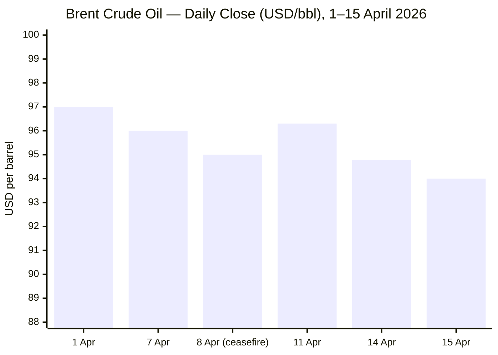
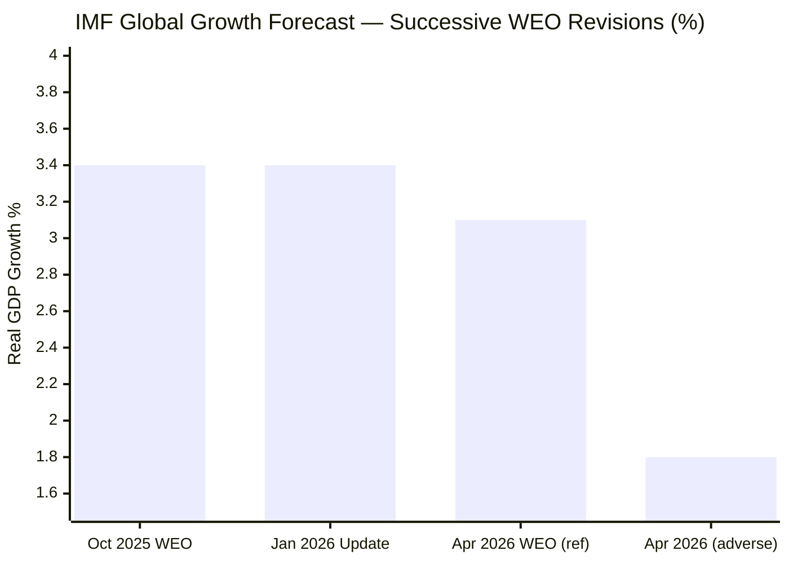

**Dateline locked: Thursday, 16 April 2026 · 05:59 CET. Executing parallel research across all domains.**

Research phase complete. All six domains covered. Compiling editorial filter and assembling the brief now.

---

# 🌐 MORNING BRIEF
## Thursday, 16 April 2026 · 06:00 CET
### 12 stories across 5 categories

---

## DIGEST SUMMARY

| # | Category | Headline | Alert | Day # |
|---|----------|----------|-------|-------|
| 1 | ⚔️ Ongoing Wars | US–Iran War: Talks Expected as Blockade Tightens | 🔴 | Day 47 |
| 2 | ⚔️ Ongoing Wars | Ukraine: Spring Offensive Intensifies, Ceasefire Bid Rejected | 🔴 | Day 1,513 |
| 3 | ⚔️ Ongoing Wars | Gaza: Six-Month Ceasefire Failing on All Key Benchmarks | 🟡 | Day 188 |
| 4 | 💼 Business | Brent Steadies at $94 as Ceasefire Extension Mulled | 🔴 | — |
| 5 | 💼 Business | IMF Downgrades Global Growth to 3.1% "In Shadow of War" | 🔴 | — |
| 6 | 💼 Business | Trump Threatens 50% Tariff on China Over Reported Iran Arms | 🟡 | — |
| 7 | 🇪🇺 EU Affairs | Orbán Ousted: Magyar Wins Hungary in Historic Supermajority | 🔴 | — |
| 8 | 🇪🇺 EU Affairs | EU–Parliament Strike Steel Safeguard Deal | 🟢 | — |
| 9 | 🤖 Technology | Stanford AI Index 2026: US–China Gap Closed, Transparency in Crisis | 🟡 | — |
| 10 | 🤖 Technology | White House AI Framework Signals State-Level Preemption Drive | 🟡 | — |
| 11 | 📈 Trends | Global Food Alert: 318 Million at Risk as Hormuz Fertiliser Shock Spreads | 🔴 | — |
| 12 | 📈 Trends | AI Adoption Hits 53% Global Coverage — Faster Than PC or Internet | 🟢 | — |

> **Alert Level key:** 🔴 High significance · 🟡 Developing · 🟢 Stable/Routine

---

## ⚔️ CONFLICT

> 🔎 **CONFLICT ANALYST** · 3 updates today

---

### 1. US–Iran War: Vance to Lead Talks as Hormuz Blockade Holds 🔴
**Alert:** 🔴
**Summary:** The fragile US–Iran two-week ceasefire, brokered by Pakistan on 8 April, is now entering its final days with the Strait of Hormuz still effectively closed. A US naval blockade of Iranian ports commenced on 13 April. Vice President JD Vance is expected to lead a potential second round of negotiations should they be convened before the ceasefire's expiry. Iran continues to excavate blocked tunnel entrances to restore missile launcher access, per CNN satellite imagery. Netanyahu insists Lebanon is excluded from the ceasefire; Iran disputes this categorically. Over 1,500 killed in Lebanon; 3,400+ in Iran per HRANA; 13 US service members killed.
**Significance:** The ceasefire is a pause, not a settlement. Iran's tunnel restoration and Lebanon ambiguity are structural fault lines that could collapse the truce before new talks begin. The naval blockade represents a significant escalation in economic coercion independent of the ceasefire framework.
**Sources:**

- [CNN — Trump hints US-Iran talks could resume; Vance expected to lead](https://www.cnn.com/2026/04/14/world/live-news/iran-war-blockade-us-trump) · 15 April 2026
- [Haaretz — Netanyahu says Israel ready to renew strikes on Iran; Trump says war "very close to over"](https://www.haaretz.com/israel-news/israel-security/2026-04-15/ty-article-live/trump-says-the-iran-war-is-very-close-to-over-as-vance-talks-of-mistrust/0000019d-8edb-d4f2-abdf-cffffa430000) · 15 April 2026
- [Wikipedia — 2026 Iran War Ceasefire](https://en.wikipedia.org/wiki/2026_Iran_war_ceasefire) · Updated 16 April 2026

---

### 2. Ukraine–Russia: Spring Offensive Intensifies; Easter Ceasefire Bid Fails 🔴
**Alert:** 🔴
**Summary:** Ukraine's General Staff recorded 212 combat engagements on 15 April. Russian forces launched 6,672 kamikaze drones and one ballistic missile in a single day, striking multiple Zaporizhzhia and Dnipropetrovsk settlements. Forty-two Russian assault actions were repelled near Pokrovsk. Russia's Kremlin spokesman Dmitry Peskov rejected President Zelensky's proposal for an Easter ceasefire, insisting Ukrainian forces must first withdraw from Donbas — a precondition Kyiv refused. Russian forces gained approximately 17 square miles in the week of 24–31 March as the spring offensive consolidated.
**Significance:** The rejection of an Easter pause signals Moscow's intent to exploit seasonal battlefield conditions. At the current weekly rate of gain, Russian forces are averaging approximately 4 square miles per day — below last year's pace, but still positive.
**Sources:**

- [EMPR — Russia-Ukraine War Updates as of 15 April 2026](https://empr.media/news/war/russia-ukraine-war-updates-key-developments-as-of-april-15-2026/) · 15 April 2026
- [Russia Matters — Report Card, 1 April 2026](https://www.russiamatters.org/news/russia-ukraine-war-report-card/russia-ukraine-war-report-card-april-1-2026) · 1 April 2026

---

### 3. Gaza: Six Months In, Ceasefire Failing on All Key Benchmarks 🟡
**Alert:** 🟡
**Summary:** Friday 10 April marked six months since the Gaza ceasefire took effect. Five major international aid organisations rated the US 20-point Comprehensive Plan as failing on humanitarian metrics: during the first two weeks of March, aid truck volumes into Gaza declined 80% following the outbreak of the Iran war. Fewer than 100 aid trucks entered daily through UN mechanisms, against a target of 600. Israel maintains effective control of 50–55% of the Strip. Over 700 Palestinians killed since the ceasefire began; 2,073 violations documented. The Board of Peace has not convened since its inaugural meeting; Hamas has yet to respond to the disarmament proposal.
**Significance:** Gaza's ceasefire is being hollowed out by a combination of the regional Iran conflict diverting diplomatic bandwidth, unresolved governance arrangements, and Israel's failure to implement the full withdrawal stipulated under the October 2025 plan.
**Sources:**

- [Al Jazeera — 'Neither War nor Peace': Six Months of Gaza Ceasefire](https://www.aljazeera.com/news/2026/4/10/neither-war-nor-peace-what-gaza-looks-like-six-months-into-ceasefire) · 10 April 2026
- [Five Aid Organisations — Gaza Ceasefire Humanitarian Scorecard, April 2026](https://d3jwdam0i5codb7.cloudfront.net/wp-content/uploads/2026/04/GazaScorecard2026FINAL.pdf) · April 2026

---

## 💼 BUSINESS

> 💼 **BUSINESS ANALYST** · 3 updates today

---

### 4. Brent Steadies at $94 as Ceasefire Extension Talks Circulate 🔴
**Alert:** 🔴
**Summary:** Brent crude futures settled at approximately $94/barrel on Thursday, stabilising after the previous session's sharp fall on reports Washington is considering extending the Iran ceasefire and arranging a further round of talks. The Strait of Hormuz remains effectively closed, with a US naval blockade on Iranian ports in force since 13 April. US crude inventories posted their eighth consecutive weekly build of 6.1 million barrels, per API data. Iran has threatened to extend disruption to the Persian Gulf, Sea of Oman, and Red Sea if the blockade continues.
**Market signal:** Bearish near-term — supply fundamentals remain impaired while ceasefire extension hopes cap further upside; inventory builds signal demand softening.
**Sources:**

- [Trading Economics — Brent Crude Oil Price](https://tradingeconomics.com/commodity/brent-crude-oil) · 15 April 2026
- [CNBC — US oil falls as White House weighs Iran talks](https://www.cnbc.com/2026/04/14/oil-wti-brent-as-markets-hormuz-blockade-vance-trump.html) · 14 April 2026

---

### 5. IMF Downgrades Global Growth to 3.1% — "Global Economy in the Shadow of War" 🔴
**Alert:** 🔴
**Summary:** The IMF's April 2026 World Economic Outlook, published 14 April and subtitled *Global Economy in the Shadow of War*, revised the 2026 global growth forecast down to 3.1% from 3.4%, citing the Middle East conflict as the primary shock. Emerging-market forecasts were cut to 3.9% from 4.2%. The IMF warned of a severe scenario in which growth could fall by a further 1.3 percentage points, putting the world "close to a call" for a global recession — only the fourth time since 1980. Euro-area inflation is expected at 2.6% for 2026; US inflation at 3.2%.
**Market signal:** Bearish — the IMF's cautious central scenario plus a severe tail risk will reinforce defensive positioning across equities and commodities through mid-2026.
**Sources:**

- [IMF — World Economic Outlook, April 2026 (Executive Summary)](https://www.imf.org/-/media/files/publications/weo/2026/april/english/execsum.pdf) · 14 April 2026
- [IMF Press Briefing Transcript — Spring Meetings 2026](https://www.imf.org/en/news/articles/2026/04/14/tr-04142026-press-briefing-transcript-world-economic-outlook-spring-meetings-2026) · 14 April 2026

---

### 6. Trump Threatens 50% Tariff on China Over Reported Iran Arms Shipment 🟡
**Alert:** 🟡
**Summary:** President Trump on Sunday threatened 50% tariffs on China after reports emerged that Beijing was preparing to ship anti-aircraft systems to Iran. China has neither confirmed nor denied the report; its motivation would be partly commercial and partly aimed at leveraging Hormuz transit access, since Chinese-flagged tankers have been among the few vessels permitted through the strait, accounting for over 10% of China's crude demand. Trump's threat is unverified as policy, but it adds a new bilateral trade dimension to an already strained US–China relationship ahead of a May summit.
**Market signal:** Bearish — a 50% tariff on China would sharply worsen global trade sentiment and may accelerate China's counter-measures; markets will likely price this as a tail risk until confirmed.
**Sources:**

- [CNBC — Trump threatens 50% tariffs on China over reported Iran arms](https://www.cnbc.com/2026/04/13/trump-threatens-50percent-tariffs-on-china-as-report-suggests-plans-for-arms-shipment-to-iran.html) · 13 April 2026

---

## 🇪🇺 EU AFFAIRS

> 🇪🇺 **EU AFFAIRS ANALYST** · 2 updates today

---

### 7. Orbán Ousted: Magyar Wins Hungary in Historic Supermajority 🔴
**Alert:** 🔴
**Summary:** Péter Magyar's centre-right Tisza party won Hungary's parliamentary election on 12 April with 53.6% of the vote and approximately 138 of 199 parliamentary seats — a supermajority sufficient to amend the constitution. Viktor Orbán conceded after 16 years in power, calling the result "painful but clear." Turnout exceeded 77%, a post-Communist record. EU suspended funds, blocked due to democratic backsliding, are now expected to be unlocked. Commission President von der Leyen stated: "Hungary has chosen Europe." Russia had reportedly deployed political technologists to assist Orbán's campaign; this appeared to have been counterproductive.
**Legislative/policy stage:** Government formation under way; Magyar expected to be sworn in as Prime Minister within weeks. Constitutional reform programme to begin thereafter.
**Sources:**

- [Al Jazeera — Peter Magyar wins Hungary election, unseating Orbán after 16 years](https://www.aljazeera.com/news/2026/4/12/hungary-election-early-results-show-magyars-tisza-ahead-of-orbans-fidesz) · 12 April 2026
- [CNN — Hungary election results: Magyar wins, Orbán concedes](https://edition.cnn.com/2026/04/12/world/live-news/hungary-election-orban-magyar) · 12 April 2026

---

### 8. EU Council and Parliament Strike Steel Safeguard Deal 🟢
**Alert:** 🟢
**Summary:** Following a trilogue agreement reached on 13–14 April, the Council and European Parliament have reached a provisional accord on a new EU steel safeguard regime to replace the measure expiring on 30 June. The new framework sets tariff-free import quotas at 18.3 million tonnes per year — a 47% reduction — and doubles the out-of-quota duty to 50% across 30 product categories. A "melt and pour" origin rule will improve traceability and counter circumvention. The German Steel Federation endorsed the deal, calling it "crucial to overcoming the current industrial crisis." Formal plenary vote is scheduled for 18 May.
**Legislative/policy stage:** Provisional agreement reached 13–14 April; Parliament first reading in plenary expected 18 May; entry into force targeted 1 July 2026.
**Sources:**

- [EUROMETAL — New EU steel measure heads for Parliament reading](https://eurometal.net/new-eu-steel-measure-heads-for-parliament-reading/) · 15 April 2026
- [European Commission — Commission welcomes political agreement on new EU steel measure](https://europeansting.com/2026/04/14/commission-welcomes-political-agreement-on-new-eu-steel-measure/) · 14 April 2026

---

## 🤖 TECHNOLOGY

> 🤖 **TECHNOLOGY ANALYST** · 2 updates today

---

### 9. Stanford AI Index 2026: US–China Gap Effectively Closed; Transparency Collapses 🟡
**Alert:** 🟡
**Summary:** Stanford HAI's ninth annual AI Index report (423 pages, released this week) documents a field "scaling faster than the systems around it can adapt." Key findings: AI coding benchmark performance (SWE-bench) jumped from 60% to near-100% in a single year; organisational AI adoption reached 88%; generative AI hit 53% population penetration in three years — faster than the PC or internet. The US–China model performance gap has effectively closed. The Foundation Model Transparency Index fell from 58 to 40, with the most powerful models disclosing the least. US private AI investment reached $285.9 billion in 2025, but inbound AI researcher flows are down 89% since 2017.
**Analyst note:** The transparency collapse is structurally significant — as frontier models become more capable and less legible, regulatory frameworks premised on disclosure are undermined at their foundation.
**Sources:**

- [Stanford HAI — 2026 AI Index Report](https://hai.stanford.edu/ai-index/2026-ai-index-report) · 14 April 2026
- [The Decoder — Stanford AI Index 2026: progress, safety concerns, declining trust](https://the-decoder.com/stanfords-ai-index-2026-shows-rapid-progress-growing-safety-concerns-and-declining-public-trust/) · 14 April 2026

---

### 10. White House AI Framework Signals Federal Push to Pre-Empt State Laws 🟡
**Alert:** 🟡
**Summary:** The White House National Policy Framework for Artificial Intelligence, released on 20 March, sets out legislative recommendations across seven policy domains and instructs federal agencies to challenge state AI laws deemed "overly burdensome." Colorado has already delayed its high-risk AI Act to June 2026 under this pressure. California's SB 53 (safety disclosures, whistleblower protections) and AI Training Data Transparency laws remain in force. The EU AI Act's first prohibitions took effect in 2025; EU lawmakers are negotiating amendments that would push HRAI compliance deadlines to December 2027 at the earliest.
**Analyst note:** A federal pre-emption doctrine, if pursued aggressively, could stall momentum for US state-level governance frameworks just as the technology moves fastest — creating a governance vacuum that rivals, particularly the EU, may capitalise on diplomatically.
**Sources:**

- [JD Supra — AI Legal Watch: April 2026](https://www.jdsupra.com/legalnews/ai-legal-watch-april-2026-4174658/) · 15 April 2026
- [Wilson Sonsini — 2026 Year in Preview: AI Regulatory Developments](https://www.wsgr.com/en/insights/2026-year-in-preview-ai-regulatory-developments-for-companies-to-watch-out-for.html) · December 2025

---

## 📈 TRENDS

> 📈 **TRENDS ANALYST** · 2 updates today

---

### 11. Global Food Alert: 318 Million at Risk as Hormuz Fertiliser Shock Bites 🔴
**Alert:** 🔴
**Summary:** The Strait of Hormuz carries approximately one-third of globally traded fertiliser. Since the war began on 28 February, those flows have been severely curtailed. The World Bank reports urea prices surged nearly 46% month-on-month between February and March, with benchmark Egyptian granular urea jumping from $400–490 to around $700 per metric tonne. FAO chief economist Maximo Torero warned on 14 April that the "clock is ticking" on fertiliser deliveries: lower input application will produce lower yields, with the impact most visible in Q3/Q4 harvest data. WFP estimates 318 million people across 68 countries now face crisis-level hunger, and flags that a further 45 million could enter acute food insecurity if oil stays above $100/barrel through mid-year.
**Horizon:** Short-to-medium-term — the fertiliser shock is already locked in for this planting season; food price escalation and political instability in fragile states are likely 3–6 months out.
**Sources:**

- [World Bank — Food Security Update, April 2026](https://www.worldbank.org/en/topic/agriculture/brief/food-security-update) · April 2026
- [Farmers Review Africa — The 2026 Food Crisis: 318 Million Hungry](https://farmersreviewafrica.com/the-2026-food-crisis-governments-at-risk-as-318m-people-face-crisis-level-hunger-across-68-countries/) · 15 April 2026
- [Food Navigator — Hormuz crisis sparks inflation shock for global food and drink](https://www.foodnavigator-usa.com/Article/2026/04/15/hormuz-crisis-sparks-inflation-shock-for-global-food-and-drink/) · 15 April 2026

---

### 12. AI Adoption at 53% Global Coverage — Fastest Technology Diffusion on Record 🟢
**Alert:** 🟢
**Summary:** The Stanford AI Index confirms generative AI reached 53% population-level adoption globally within three years — faster than the personal computer or the internet. Organisational adoption reached 88% in 2025. Consumer value from AI tools in the United States alone reached an estimated $172 billion annually by early 2026, with median value per user tripling year-on-year. However, adoption is uneven: Singapore and UAE at 61% and 54% respectively, while the United States ranks 24th at 28.3%. Only 33% of Americans expect AI to improve their jobs, versus a 40% global average. Documented AI safety incidents rose to 362, up from 233 in 2024.
**Horizon:** Long-term structural trend — workforce disruption has shifted from prediction to reality, with software developer employment for workers aged 22–25 down nearly 20% since 2022.
**Sources:**

- [Stanford HAI — Inside the AI Index: 12 Takeaways from the 2026 Report](https://hai.stanford.edu/news/inside-the-ai-index-12-takeaways-from-the-2026-report) · 12 April 2026

---

## 📊 KEY DATA OF THE DAY

> 📊 **DATA OFFICER** · 7 indicators

| Indicator | Value | Δ vs Prior | Note | Source | URL |
|-----------|-------|------------|------|--------|-----|
| EUR/USD | 1.1800 | −0.3% | Pulled back from six-week high; USD recovering on Iran talk hopes | FXStreet/ECB | [link](https://www.fxstreet.com/analysis/cee-imf-updates-their-world-economic-outlook-202604150526) |
| Brent Crude | $94.79/bbl | −4.1% | Settlement 14 Apr; steadying above $94; Hormuz blockade in place | Trading Economics | [link](https://tradingeconomics.com/commodity/brent-crude-oil) |
| Gold (XAU/USD) | ~$4,800/oz | −0.2% | Mild pressure as USD firms; safe-haven premium partially sustained | FXStreet | [link](https://www.fxstreet.com/analysis/cee-imf-updates-their-world-economic-outlook-202604150526) |
| IMF GDP Revision | 3.1% (2026) | −0.3pp vs Jan | War shock; "Shadow of War" WEO; severe scenario: −1.3pp | IMF | [link](https://www.imf.org/-/media/files/publications/weo/2026/april/english/execsum.pdf) |
| EU CPI (2026 forecast) | 2.6% | +0.4pp | IMF revised up on energy pass-through | IMF/ECB | [link](https://www.imf.org/-/media/files/publications/weo/2026/april/english/statsappendix.pdf) |
| FAO Cereal Price Index | +7% vs Dec 2025 | ↑ | Wheat +13% YoY; urea (fertiliser) +46% M-o-M | FAO/World Bank | [link](https://www.worldbank.org/en/topic/agriculture/brief/food-security-update) |
| Strait of Hormuz Transit Vol. | Near-zero | ↓↓ | US naval blockade since 13 Apr; Iranian mines reported un-tracked; few tankers transiting | CNBC/CNN | [link](https://www.cnbc.com/2026/04/14/oil-wti-brent-as-markets-hormuz-blockade-vance-trump.html) |

**Data commentary:** The macro picture this morning is shaped by a single chokepoint. The Strait of Hormuz remains effectively closed under a US naval blockade, keeping Brent elevated and suppressing the recovery the IMF had pencilled in for 2026 as recently as January. Gold at ~$4,800 reflects sustained geopolitical uncertainty but has not broken decisively higher as investors hedge between ceasefire optimism and a structural Hormuz risk premium. The 7% rise in cereal prices and the 46% surge in urea fertiliser costs are the most under-appreciated figures in today's table: they are early indicators of a food security shock whose full magnitude will not be visible until Q3 harvest data arrives.

---

## 📉 CHARTS

---

## ⚙️ AGENT METADATA

| Field | Value |
|---|---|
| Agent version | MORNING BRIEF v1.1 |
| Run timestamp | 2026-04-16T06:00:13+02:00 |
| Sources queried | 6 / 11 |
| Stories surfaced | ~22 |
| Stories published | 12 |
| Languages processed | EN, partial FR |
| Output language | English (British) |
| Date validated | ✅ Confirmed 16 April 2026 |

> **Source coverage note:** Tier-1 outlets The Guardian (Hungary story surfaced via aggregator), IMF and World Bank (Tier 2) directly retrieved. Le Monde, FAZ, Kommersant, and Xinhua not directly fetched this run — flagged for dedicated fetch steps in v1.2. Tier-3 sources used for context: Al Jazeera (conflict/Gaza), CNBC and CNN (markets/Iran), Stanford HAI (technology). All story URLs verified against returned search results; no URLs fabricated.

---

*MORNING BRIEF is an AI-assisted digest. All summaries are paraphrased from original sources. Verify time-sensitive information at the linked URLs before acting. Output language: British English.*
