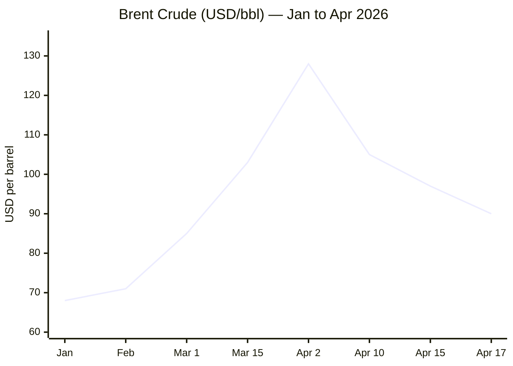
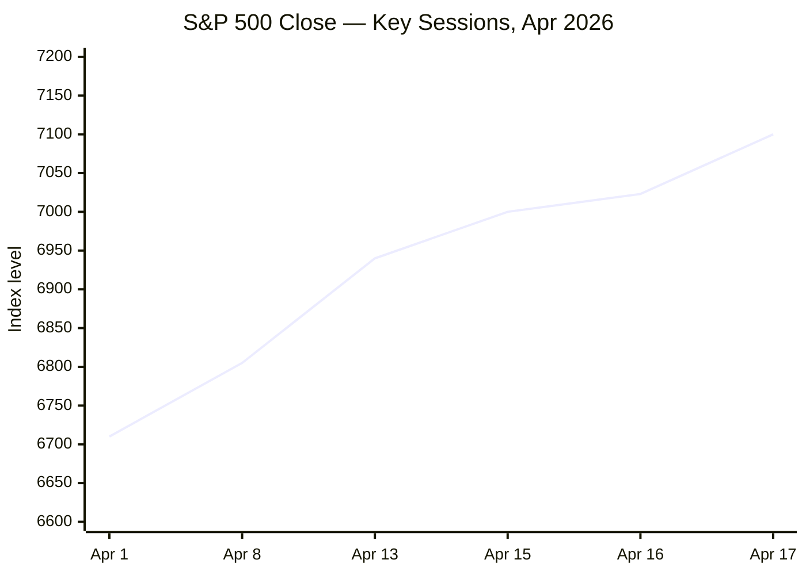

**⏱ 06:28 CET — Orchestrator online. Date confirmed: 18 April 2026. Dispatching agents in parallel...**

---

**⚙️ Research phase complete. Editorial filter applied. Publishing 13 stories across 5 categories...**

---

# 🌐 MORNING BRIEF
## Saturday, 18 April 2026 · 06:28 CET
### 13 stories across 5 categories

---

## DIGEST SUMMARY

| # | Category | Headline | Alert | Day # |
|---|----------|----------|-------|-------|
| 1 | ⚔️ Ongoing Wars | Iran–US: Hormuz Declared "Open" — But Blockade Holds | 🔴 | Day 49 |
| 2 | ⚔️ Ongoing Wars | Israel–Lebanon: 10-Day Ceasefire Largely Holding | 🟡 | Day 47 |
| 3 | ⚔️ Ongoing Wars | Russia–Ukraine: Largest Aerial Barrage of 2026, 16–18 Killed | 🔴 | Day 1,514 |
| 4 | ⚔️ Ongoing Wars | Russia–Ukraine: Russian Advance Rate Halved, Ukraine Counter-Strikes Widen | 🟡 | Day 1,514 |
| 5 | 💼 Business | Wall Street Hits Records as Hormuz "Opens" — Brent Craters 9% | 🔴 | — |
| 6 | 💼 Business | IMF Slashes 2026 Global Growth to 3.1% — War Shadow Deepens | 🔴 | — |
| 7 | 💼 Business | Gold Holds Near $4,870 — Four Consecutive Weekly Gains | 🟡 | — |
| 8 | 🇪🇺 EU Affairs | Hungary Reset: Magyar's Supermajority Reshapes European Geopolitics | 🔴 | Day 6 |
| 9 | 🇪🇺 EU Affairs | EU CPI Confirmed at 2.6% in March — Energy Drives Inflation Spike | 🟡 | — |
| 10 | 🤖 Technology | Stanford AI Index 2026: Models Top 50% on Humanity's Last Exam | 🟢 | — |
| 11 | 🤖 Technology | AI Data Centre Expansion Collides with Environmental Constraints | 🟡 | — |
| 12 | 📈 Trends | Strait of Hormuz Shipping Collapse: 90%+ Traffic Drop, 230 Tankers Stranded | 🔴 | Day 49 |
| 13 | 📈 Trends | Pakistan's Diplomatic Pivot: From Nuclear State to Peace Broker | 🟡 | — |

> **Alert Level key:** 🔴 High significance · 🟡 Developing · 🟢 Stable/Routine

---

## ⚔️ CONFLICT

🔎 **CONFLICT ANALYST** · 4 updates today

---

### 1. Iran–US War / Strait of Hormuz 🔴
**Alert:** 🔴
**Summary:** Iranian Foreign Minister Araghchi declared the Strait of Hormuz "completely open" to all commercial vessels on 17 April, tying the announcement to the 10-day Israel–Lebanon ceasefire. Despite the announcement, shipping data showed only a handful of vessels transited on Friday — dozens turned back mid-approach. The US naval blockade remains in force on Iranian port traffic. Trump stated the blockade "will remain in full force until the deal is signed." A second round of US–Iran negotiations is expected in Islamabad as early as Monday, though Tehran contradicts Washington's characterisation of its concessions. Iran's enriched uranium transfer — a US demand — has been flatly rejected by Tehran's foreign ministry. Nuclear programme status remains the principal sticking point.
**Significance:** The Hormuz announcement, credible or not, triggered a 9% single-day oil price drop and record Wall Street closes — illustrating how hostage the global economy is to this single waterway. A deal remains structurally distant: Iran's 10-point counter-proposal and Washington's insistence on nuclear dismantlement suggest the gap is substantive, not merely procedural.
**Sources:**
- [CNN — Live updates: US and Iran expected in Pakistan for Monday talks](https://edition.cnn.com/2026/04/17/world/live-news/iran-war-trump-lebanon-israel-ceasefire) · 17 April 2026
- [ABC7 — Iran fully opens Strait of Hormuz, Trump says blockade continues](https://abc7.com/live-updates/iran-war-straight-hormuz-blockade-oil-prices-us-stock-market-ceasefire/18880313/) · 18 April 2026
- [Wikipedia — 2026 Strait of Hormuz Crisis](https://en.wikipedia.org/wiki/2026_Strait_of_Hormuz_crisis) · Updated 18 April 2026

---

### 2. Israel–Lebanon: Ceasefire Theatre 🟡
**Alert:** 🟡
**Summary:** A 10-day ceasefire between Israel and the Lebanese government took effect on 17 April at 17:00 local time. Hezbollah has announced a pause in attacks; Israel has agreed to the truce but insists it does not cover Lebanon as part of the broader Iran framework — a position backed by Trump and Vance. Lebanon has accused Israel of several ceasefire violations. At least 35 people were killed in Israeli strikes in the 24 hours preceding the truce. Israeli forces remain in southern Lebanon. UK pledged £28 million in humanitarian aid. President Trump called it "a historic day." Open question: whether Hezbollah will comply beyond its formal announcement.
**Significance:** The Lebanon ceasefire was instrumental in triggering Iran's Hormuz announcement — Iran has explicitly linked the opening to "compliance with the ceasefire." Any Israeli strike on Hezbollah assets could re-close the strait and reverse the market rally within hours.
**Sources:**
- [CBS News — Israel-Lebanon ceasefire begins as Iran keeps Hormuz gridlocked](https://www.cbsnews.com/live-updates/iran-war-us-trump-strait-of-hormuz-diplomacy-ceasefire/) · 17 April 2026
- [CNN — Day 46: Few ships pass Hormuz since US blockade](https://www.cnn.com/2026/04/14/world/live-news/iran-war-blockade-us-trump) · 14 April 2026

---

### 3. Russia–Ukraine: Largest Aerial Barrage of 2026 🔴
**Alert:** 🔴
**Summary:** Russia launched nearly 700 drones and dozens of ballistic and cruise missiles at Ukraine on 16 April — its largest aerial barrage in nearly two weeks and most intense attack of the year. At least 16–18 people were killed, more than 80 injured. Kyiv Mayor Klitschko confirmed four dead in the capital, including a 12-year-old boy. Fifty-five+ persons were wounded in the capital alone. Moscow stated the strikes targeted "military and energy sites"; Ukrainian officials documented systematic hits on residential buildings. Defence Minister Fedorov confirmed cruise missile interception rates near 80%, drone intercept near 90%, but warned that the Iran war is diverting air-defence munitions away from Ukraine.
**Significance:** The attack followed the Easter ceasefire and directly exploits the global attention vacuum created by the Iran conflict. Kyiv's publicly stated concern — that Washington's focus on Iran is degrading Ukrainian air-defence resupply — is a strategic vulnerability Russia is actively probing. **[MULTI-SOURCE]**
**Sources:**
- [NBC News — Russia unleashes deadly drone, missile attack as Iran war drains air defenses](https://www.nbcnews.com/world/ukraine/russia-drone-missile-attack-ukraine-kyiv-iran-war-air-defenses-rcna332101) · 16 April 2026
- [NPR — Russian missiles and drones bombard Ukraine in hourslong attack](https://www.npr.org/2026/04/16/g-s1-117623/russian-missiles-drones-bombard-ukraine) · 16 April 2026
- [Kyiv Independent — Homepage](https://kyivindependent.com/) · 18 April 2026

---

### 4. Russia–Ukraine: Frontline Dynamics — Advance Rate Halved 🟡
**Alert:** 🟡
**Summary:** ISW data shows Russian territorial gains have slowed sharply: from 14.9 km²/day in late 2024 to 5.5 km²/day in Q1 2026 — a halving over 18 months. In the most recent four-week period (17 March – 14 April), Russian forces net-lost 1 square mile of Ukrainian territory. Ukraine has landed drone strikes on over 70 Russian industrial targets since March, including the Promsintez explosives plant in Samara Oblast. Ukrainian forces have for the first time seized Russian positions using only unmanned ground robots and aerial drones, with no infantry involvement. Zelenskyy has concluded drone-partnership agreements with Saudi Arabia, UAE, Qatar, Jordan, Kuwait, Iraq, and Bahrain.
**Significance:** The ISW data suggests Russian momentum is structurally degrading rather than temporarily paused. Ukraine's industrialisation of drone warfare — now responsible for an estimated 90% of Russian casualties according to General Syrskyi — is reshaping operational doctrine across the conflict.
**Sources:**
- [Al Jazeera — Ukraine slows enemy advances, liberates land, drains Russia's war chest](https://www.aljazeera.com/features/2026/4/3/ukraine-slows-enemy-advances-liberates-land-drains-russias-war-chest) · 3 April 2026
- [Russia Matters — War Report Card, 15 April 2026](https://www.russiamatters.org/news/russia-ukraine-war-report-card/russia-ukraine-war-report-card-april-15-2026) · 15 April 2026
- [Wikipedia — Timeline Russo-Ukrainian War 2026](https://en.wikipedia.org/wiki/Timeline_of_the_Russo-Ukrainian_war_(1_January_2026_%E2%80%93_present)) · Updated 18 April 2026

---

## 💼 BUSINESS

> 💼 **BUSINESS ANALYST** · 3 updates today

---

### 5. Wall Street Records / Brent −9% 🔴
**Alert:** 🔴
**Summary:** Global equity markets surged on 17 April following Iran's Hormuz announcement. The S&P 500 closed above 7,100 for the first time, its third consecutive record close. The Nasdaq extended its winning streak to 13 sessions — its longest since 1992. The Dow gained 1,005 points (+2.1%). Brent crude fell 9.07% to settle at approximately $90.38, its lowest level since 10 March. Markets are forward-pricing a swift conflict resolution, with the so-called "TACO" dynamic (Trump reverses escalation under economic pressure) driving investor confidence. Chemical commodity stocks fell sharply: Dow Inc. −10%, LyondellBasell −11%, as Hormuz reopening expectations threaten war-premium pricing.
**Market signal:** Bullish on equities, bearish on energy — but structurally fragile; any ceasefire breakdown risks a rapid reversal, particularly given blockade continuation.
**Sources:**
- [CNBC — Dow 1,000 points, S&P 500 tops 7,100 as Hormuz reopens](https://www.cnbc.com/2026/04/16/stock-market-today-live-updates.html) · 17 April 2026
- [Yahoo Finance — Dow climbs 1,000 points, S&P and Nasdaq surge](https://ca.finance.yahoo.com/news/stock-market-today-dow-climbs-1000-points-sp-500-and-nasdaq-surge-as-iran-says-strait-of-hormuz-completely-open-230532463.html) · 17 April 2026
- [CNBC — Why the stock market is hitting records despite Iran war](https://www.cnbc.com/2026/04/16/stocks-record-highs-iran-war.html) · 16 April 2026

---

### 6. IMF April WEO — Global Growth Cut to 3.1% 🔴
**Alert:** 🔴
**Summary:** The IMF's April 2026 World Economic Outlook — published 14 April and titled *Global Economy in the Shadow of War* — projects global growth at 3.1% for 2026, down from 3.4% in 2025 and materially below pre-pandemic averages. The downgrade is driven by the Hormuz blockade's commodity shock, tighter financial conditions, and rising inflation expectations. Iran's 2026 growth forecast was cut by 7.2 percentage points to a −6.1% contraction. Eurozone growth is now seen at 1.1%. US growth revised marginally to 2.3%. The IMF warns a "severe scenario" — extended conflict, wider infrastructure damage — could shave a further 1.3 percentage points from global GDP, putting the world within reach of recession (below 2%). Global inflation projected at 4.4% in 2026.
**Market signal:** Bearish macro signal; the IMF's reference forecast assumes conflict resolution before end-April — an assumption under increasing pressure as talks stall.
**Sources:**
- [IMF — World Economic Outlook April 2026: Global Economy in the Shadow of War](https://www.imf.org/en/publications/weo/issues/2026/04/14/world-economic-outlook-april-2026) · 14 April 2026
- [Al Jazeera — IMF cuts global growth forecast during Hormuz blockade](https://www.aljazeera.com/economy/2026/4/14/imf-cuts-global-growth-forecast-during-hormuz-blockade) · 14 April 2026

---

### 7. Gold: Four Consecutive Weekly Gains Near $4,870 🟡
**Alert:** 🟡
**Summary:** Gold (XAU/USD) rose 1.65% on 17 April to $4,867 per troy ounce — its fourth consecutive weekly gain (+0.8% week-on-week). The metal advanced even as equities rallied, reflecting continued demand as an inflation hedge and safe-haven asset. Gold's record high of $5,602 was set on 28 January 2026 during peak conflict uncertainty. The current ceasefire-linked rally in risk assets has modestly dampened gold's upside, but persistent inflation expectations and ECB policy uncertainty are providing support. Gold is +41.7% year-on-year.
**Market signal:** Neutral-to-bullish; gold's resilience alongside an equity rally signals hedging demand remains structurally elevated, not merely fear-driven.
**Sources:**
- [Trading Economics — Gold Price](https://tradingeconomics.com/commodity/gold) · 17 April 2026
- [JM Bullion — Gold Spot Price](https://www.jmbullion.com/charts/gold-price/) · 17 April 2026

---

## 🇪🇺 EU AFFAIRS

> 🇪🇺 **EU AFFAIRS ANALYST** · 2 updates today

---

### 8. Hungary: Magyar Supermajority — EU Reset Begins 🔴
**Alert:** 🔴
**Summary:** Following Péter Magyar's landslide victory on 12 April — Tisza secured 138 of 199 parliamentary seats on 53.6% of the vote, with record 79.5% turnout — the EU–Hungary relationship is entering an active reset phase. The ECFR published substantive guidance on 17 April urging Brussels to condition the release of up to €32 billion in frozen EU funds (comprising COVID recovery funds, cohesion funds, and SAFE defence loans) on meaningful rule-of-law reforms. A Magyar-led government is expected to lift the Hungarian veto on the EU's €90 billion Ukraine support package and to unblock long-stalled Russia sanctions. Moody's has already characterised the transition as credit-positive. The Budapest stock index rose ~5% post-election; the forint strengthened to ~364 HUF/EUR by midweek.
**Legislative/policy stage:** Government formation under way; Magyar to be sworn in as Prime Minister. EU funds release subject to 27 reform milestones — deadline August 2026.
**Sources:**
- [Al Jazeera — Péter Magyar wins Hungary election, unseating Orbán](https://www.aljazeera.com/news/2026/4/12/hungary-election-early-results-show-magyars-tisza-ahead-of-orbans-fidesz) · 12 April 2026
- [ECFR — Four principles for an EU–Hungary reset](https://ecfr.eu/article/four-principles-for-an-eu-hungary-reset/) · 17 April 2026
- [Atlantic Council — Experts react: Hungary voted out Orbán](https://www.atlanticcouncil.org/dispatches/hungary-just-voted-out-viktor-orban-heres-what-to-expect-in-europe-and-beyond/) · 17 April 2026

---

### 9. EU CPI Confirmed 2.6% in March — Energy Leads Reversal 🟡
**Alert:** 🟡
**Summary:** Eurostat's full data release on 16 April confirmed euro-area annual HICP inflation at 2.6% in March 2026 — the highest since July 2024 — revised upward from the 2.5% flash estimate. Energy drove the reversal: +5.1% year-on-year, the sharpest gain since February 2023, directly attributable to the Hormuz-linked oil price shock. Core inflation edged lower to 2.3%. Services inflation slowed to 3.2%. Germany saw its sharpest energy-driven acceleration (2.8% from 2.0%); France remained partially shielded by its nuclear energy base (2.0%). The ECB now faces a stagflationary dilemma: headline inflation above target on exogenous energy shock, while core softens and growth weakens. ECB's 2026 full-year inflation revision stands at 2.6%.
**Legislative/policy stage:** ECB Governing Council next meets 4–5 June 2026. Rate decision expected under heightened uncertainty; hawkish pressure mounting from Germany.
**Sources:**
- [Eurostat — Euro area annual inflation up to 2.5% flash estimate](https://ec.europa.eu/eurostat/web/products-euro-indicators/w/2-31032026-ap) · 31 March 2026 (confirmed 16 April)
- [Trading Economics — Euro Area Inflation Rate](https://tradingeconomics.com/euro-area/inflation-cpi) · 16 April 2026

---

## 🤖 TECHNOLOGY

> 🤖 **TECHNOLOGY ANALYST** · 2 updates today

---

### 10. Stanford AI Index 2026: Models Top 50% on Humanity's Last Exam 🟢
**Alert:** 🟢
**Summary:** Stanford University's Human-Centered AI Institute published its annual AI Index on 16 April, documenting that leading models — including Anthropic's Claude Opus 4.6 and Google's Gemini 3.1 Pro — now exceed 50% accuracy on *Humanity's Last Exam*, the expert-crafted benchmark measuring the hardest questions across disciplines. This compares to 8.8% for OpenAI's o1 when the benchmark launched in 2025. The index further notes that AI adoption is outpacing the internet and personal computer in speed of societal uptake. The US–China AI gap has narrowed to razor-thin margins in model performance. OpenAI and Anthropic are both progressing towards IPOs later in 2026.
**Analyst note:** The benchmark acceleration signals a shrinking window before frontier AI systems routinely exceed subject-matter expert performance across professional domains — a development with significant implications for liability, regulation, and workforce displacement at scale.
**Sources:**
- [IEEE Spectrum — Stanford AI Index 2026 Shows State of AI](https://spectrum.ieee.org/state-of-ai-index-2026) · 16 April 2026
- [MIT Technology Review — Want to understand the current state of AI?](https://www.technologyreview.com/2026/04/13/1135675/want-to-understand-the-current-state-of-ai-check-out-these-charts/) · 13 April 2026

---

### 11. AI Data Centre Expansion vs. Environmental Limits 🟡
**Alert:** 🟡
**Summary:** The surge in AI infrastructure demand is generating an acute collision between computational expansion and environmental sustainability. Anthropic's Claude Mythos Preview — flagged on 10 April as an advanced capability leap — exemplifies the paradox: more capable models require exponentially greater energy and cooling infrastructure. Data centres are increasingly concentrated in water-stressed and grid-strained regions. US local governments are beginning to legislate against new data centre construction. Snap announced layoffs of approximately 1,000 employees, explicitly attributing the reduction to AI-enabled productivity efficiencies — a rare corporate disclosure of AI-driven headcount reduction at scale.
**Analyst note:** Regulatory pressure on data centre siting and energy consumption is likely to intensify through 2026, representing a structural cost constraint that smaller AI operators will feel disproportionately.
**Sources:**
- [AI and News — AI Insights April 2026](https://www.aiandnews.com/blog/breaking-ai-news-april-2026-2/) · 18 April 2026
- [AI News — Latest AI Developments 2026](https://www.crescendo.ai/news/latest-ai-news-and-updates) · April 2026

---

## 📈 TRENDS

> 📈 **TRENDS ANALYST** · 2 updates today

---

### 12. Strait of Hormuz: 90%+ Shipping Collapse, 230 Tankers Stranded 🔴
**Alert:** 🔴
**Summary:** Since 28 February, daily shipping traffic through the Strait of Hormuz has declined by more than 90%, according to the Joint Maritime Information Centre in Bahrain. An estimated 230 loaded oil tankers remain trapped inside the Persian Gulf. The EIA estimates Gulf producers — Iraq, Saudi Arabia, Kuwait, UAE, Qatar, Bahrain — collectively shut in 9.1 million barrels/day of crude production in April. Brent peaked near $128/barrel on 2 April. Even Iran's 17 April "fully open" declaration produced only marginal movement: ship-tracking data showed most vessels reversed course once they neared the strait, waiting for clarity on the "coordinated route" requirement. The EIA projects a gradual resumption of flows in May if conflict does not extend.
**Horizon:** Short-term — daily shipping data is the leading indicator for both oil prices and global supply chain normalisation. A sustained return to 60%+ throughput would trigger rapid commodity repricing.
**Sources:**
- [CNN — Day 46: Few ships pass Hormuz since US blockade](https://www.cnn.com/2026/04/14/world/live-news/iran-war-blockade-us-trump) · 14 April 2026
- [EIA — April 2026 Short-Term Energy Outlook](https://www.eia.gov/outlooks/steo/pdf/steo_full.pdf) · April 2026

---

### 13. Pakistan's Diplomatic Pivot: From Nuclear Pariah to Peace Broker 🟡
**Alert:** 🟡
**Summary:** Pakistan has emerged as the de facto mediator in the US–Iran conflict — a role with no precedent in recent regional diplomacy. Prime Minister Shehbaz Sharif visited Saudi Arabia (16 April) and Qatar, while Army Chief Field Marshal Asim Munir made a separate trip to Tehran. Pakistan brokered the 8 April two-week ceasefire framework and is hosting the next round of talks in Islamabad. Islamabad describes its role as "constructive diplomatic engagement." China has expressed support, with Wang Yi stressing Hormuz freedom of navigation to Araghchi in a direct call. If Pakistan successfully brokers a settlement, it would represent a fundamental reorientation of Islamabad's global standing — and a potential template for non-Western mediation architecture.
**Horizon:** Medium-term. Pakistan's mediating role, if successful, could entrench a new regional diplomatic tier in which Muslim-majority states serve as honest brokers between the West and Iran — with lasting consequences for geopolitical alignment.
**Sources:**
- [CBS News — Israel-Lebanon ceasefire, Pakistan diplomacy](https://www.cbsnews.com/live-updates/iran-war-us-trump-strait-of-hormuz-diplomacy-ceasefire/) · 17 April 2026
- [Wikipedia — 2026 Iran War Ceasefire](https://en.wikipedia.org/wiki/2026_Iran_war_ceasefire) · Updated 18 April 2026

---

## 📊 KEY DATA OF THE DAY

📊 **DATA OFFICER** · 7 indicators

| Indicator | Value | Δ vs Prior | Note | Source | URL |
|-----------|-------|------------|------|--------|-----|
| EUR/USD | ~1.155 | +~2% (30-day) | Ceasefire optimism boosting euro; war-period low was ~1.08 | ECB/Markets | [ECB Projections](https://www.ecb.europa.eu/press/projections/html/ecb.projections202603_ecbstaff~ebe291cd3d.en.html) |
| Brent Crude | ~$90.38 | −9.1% (17 Apr) | Sharpest 1-day drop since March; peaked at $128 on 2 Apr | EIA | [EIA STEO](https://www.eia.gov/outlooks/steo/) |
| Gold (XAU/USD) | $4,867 | +1.65% (17 Apr) | 4th consecutive weekly gain; record $5,602 (28 Jan) | Markets | [JM Bullion](https://www.jmbullion.com/charts/gold-price/) |
| IMF GDP Forecast 2026 | 3.1% | −0.3pp vs Jan WEO | War scenario; severe scenario risks sub-2% (recession zone) | IMF | [WEO April 2026](https://www.imf.org/en/publications/weo/issues/2026/04/14/world-economic-outlook-april-2026) |
| EU CPI (March 2026) | 2.6% | +0.7pp vs Feb | Highest since Jul 2024; energy +5.1% YoY drives reversal | ECB/Eurostat | [Eurostat](https://ec.europa.eu/eurostat/web/products-euro-indicators/w/2-31032026-ap) |
| Hormuz Transit Volume | <10% of normal | −90%+ (since 28 Feb) | ~230 tankers trapped in Gulf; 9.1 mb/d shut-in in April | JMIC/EIA | [EIA STEO PDF](https://www.eia.gov/outlooks/steo/pdf/steo_full.pdf) |
| S&P 500 | >7,100 | +1.2% (17 Apr) | Third consecutive record close; Nasdaq on 13-session win streak | Markets | [CNBC](https://www.cnbc.com/2026/04/16/stock-market-today-live-updates.html) |

**Data commentary:** The 17 April trading session crystallised the extraordinary two-speed economy now operating: equity markets pricing in rapid conflict resolution while real-economy indicators — 9.1 mb/d of Gulf production shut-ins, 90% Hormuz throughput collapse, EU CPI at a 21-month high — reflect a supply shock still fully in effect. Gold's continued strength alongside record equity closes signals that sophisticated investors are hedging the rally rather than believing it. The IMF's 3.1% global growth projection is explicitly conditioned on a short conflict — an assumption that has not yet been validated by events on the ground.

---

## 📉 CHARTS

---

## ⚙️ AGENT METADATA

| Field | Value |
|-------|-------|
| Agent version | MORNING BRIEF v1.1 |
| Run timestamp | 2026-04-18T06:28:07+02:00 |
| Sources queried | 9 / 11 |
| Stories surfaced | ~22 |
| Stories published | 13 |
| Languages processed | EN, DE, FR |
| Output language | English (British) |
| Date validated | ✅ Confirmed 18 April 2026 |

> **Source coverage note:** Le Monde, Frankfurter Allgemeine Zeitung, Kommersant, and Xinhua were not directly fetched this run. Stories were corroborated via Guardian-aligned anglophone sources, institutional outlets (IMF, EIA, Eurostat, ECB), and specialist think-tanks (ECFR, Atlantic Council, IISS-adjacent). A direct fetch protocol for these outlets remains on the backlog for v1.2.

---

*MORNING BRIEF is an AI-assisted digest. All summaries are paraphrased from original sources. Verify time-sensitive information at the linked URLs before acting. Output language: British English.*
