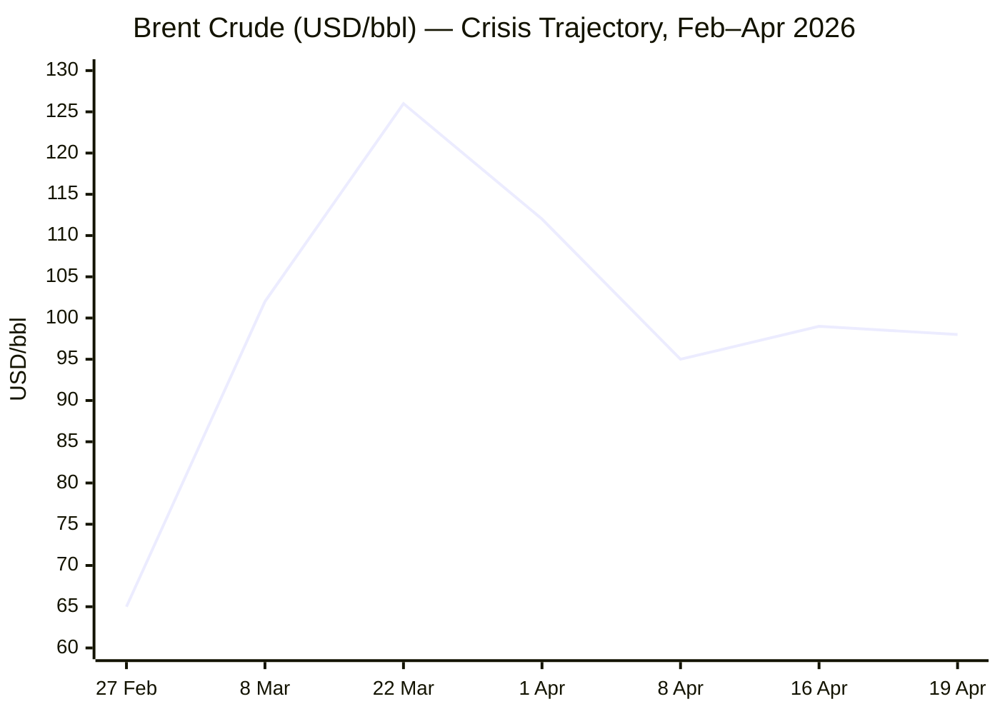
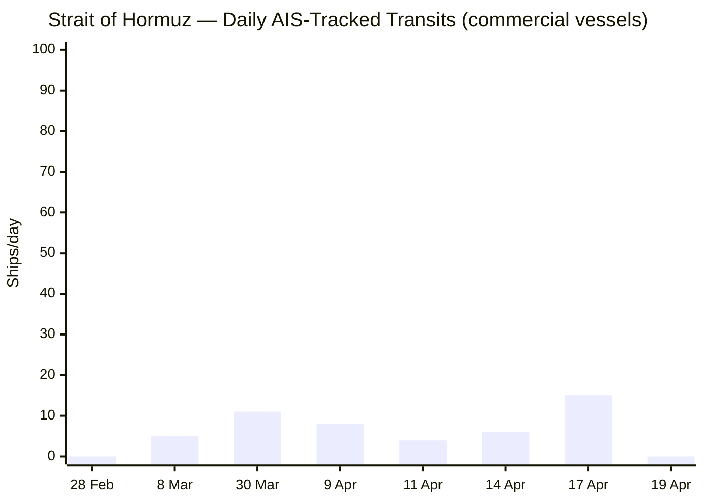

---

```yaml
---
brief_date: 2026-04-19
version: v1.2
run_time: "08:52 CET"
stories_published: 13
categories: [conflict, business, eu_affairs, technology, trends]
alert_counts:
  red: 3
  yellow: 8
  green: 2
ongoing_situations:
  - {name: "2026 Iran War & Ceasefire", day: 51}
  - {name: "2026 Lebanon War", day: 49}
sources_fetched: 9
fetch_status:
  le_monde: "❌"
  faz: "❌"
  kommersant: "❌"
  xinhua: "✅"
  european_parliament: "⚠️"
expansion_queue: []
---
```

# 🌐 MORNING BRIEF
## Sunday, 19 April 2026 · 08:52 CET
### 13 stories across 5 categories

---

## DIGEST SUMMARY

| # | Category | Headline | Alert | Day # |
|---|----------|----------|-------|-------|
| 1 | ⚔️ Conflict | Iran reclosed Strait of Hormuz; US-Iran ceasefire near collapse | 🔴 | Day 51 |
| 2 | ⚔️ Conflict | French UNIFIL peacekeeper killed in Lebanon; Israel releases buffer zone map | 🔴 | Day 49 |
| 3 | 💼 Business | Brent surges toward $98 as Hormuz closes again | 🔴 | — |
| 4 | 💼 Business | IMF April WEO: war cuts global growth to 3.1%, inflation rises to 4.4% | 🟡 | — |
| 5 | 💼 Business | IEA: Largest oil supply shock in history — 10.1 mb/d drop in March | 🟡 | — |
| 6 | 🇪🇺 EU Affairs | Spain to propose EU termination of Israel association agreement at Tuesday's FAC | 🟡 | — |
| 7 | 🇪🇺 EU Affairs | Bulgaria holds its 8th parliamentary election in 5 years | 🟢 | — |
| 8 | 🇪🇺 EU Affairs | Eurozone CPI revised to 2.6% in March; ECB hike probability climbing | 🟡 | — |
| 9 | 🤖 Technology | Stanford 2026 AI Index: top models breach 50% on Humanity's Last Exam | 🟢 | — |
| 10 | 🤖 Technology | EU AI Act HRAI applicability deadline proposed for extension to December 2027 | 🟡 | — |
| 11 | 📈 Trends | Pakistan consolidates mediator role in US-Iran diplomacy | 🟡 | — |
| 12 | 📈 Trends | Lebanon: 1.2M+ displaced as fragile ceasefire strains | 🟡 | — |
| 13 | 📈 Trends | Hormuz closure driving structural rerouting: 34,000+ vessels diverted | 🟡 | — |

> Alert level key: 🔴 High significance · 🟡 Developing · 🟢 Stable/Routine
> Day # = first appearance in this Brief series. Real-world conflict start dates in tracker below.

---

## 🚨 SIGNAL BOARD

🔴 **Iran reclosed the Strait of Hormuz on 18 April — Brent at ~$98/bbl; ceasefire expires Tuesday 21 April with no deal in sight**
🔴 **Iran declined second-round Pakistan talks; Vance/Witkoff/Kushner delegation status in doubt**
🔴 **French UNIFIL Sergeant Major Florian Montorio killed in Lebanon ambush; Macron points to Hezbollah**
🟡 **IMF April WEO: global growth downgraded to 3.1% for 2026 (from 3.4%), inflation to 4.4% — war the primary driver**
⚡ **Iran opened then reclosed the Strait within 24 hours (17–18 April) — a reversal that exposed the fragility of the ceasefire framework**

---

## 🔄 ONGOING SITUATIONS

| Situation | Real-world start | Brief Day # | Last significant development | Status |
|-----------|-----------------|-------------|------------------------------|--------|
| 2026 Iran War & Ceasefire | 28 Feb 2026 | Day 51 | Iran reclosed Strait 18 Apr; Iran declined Pakistan talks; ceasefire expires 21 Apr | 🔴 Active |
| 2026 Lebanon War | 02 Mar 2026 | Day 49 | French UNIFIL peacekeeper killed; Israel released S. Lebanon buffer zone map; 10-day ceasefire active | 🔴 Active |

---

## ⚔️ CONFLICT

> 🔎 **CONFLICT ANALYST** · 2 updates today

### 1. Iran Reclosed Strait of Hormuz; US-Iran Ceasefire Near Collapse 🔴
**Alert:** 🔴
**Summary:** Iran reimposed restrictions on the Strait of Hormuz on 18 April, citing the continued US naval blockade of Iranian ports as a "breach of trust." The IRGC ordered vessels not to move from anchor points in the Persian Gulf and Gulf of Oman. Iran's government then declined to participate in a second round of US-Iran peace talks in Pakistan, citing "Washington's excessive demands, unrealistic expectations, and the ongoing naval blockade." Iran's parliament speaker Ghalibaf confirmed a wide gap remains between the sides. The two-week ceasefire expires on Tuesday, 21 April, with no framework agreement in place. Trump repeated his threat to "knock out every power plant and every bridge" in Iran if talks fail. [MULTI-SOURCE]
**Significance:** A ceasefire expiry without agreement on 21 April would formally end the pause in hostilities and risk resumption of strikes and Strait attacks. The 24-hour Strait open-and-reclose sequence on 17–18 April has critically undermined ceasefire credibility with shipping and insurance markets.
**Sources:**
- [CNN — Iran says it is once again shutting down the Strait of Hormuz](https://www.cnn.com/2026/04/18/world/live-news/iran-war-trump-israel) · 18 April 2026
- [NPR — U.S. negotiators prepare for more peace talks as Trump repeats threats to Iran](https://www.npr.org/2026/04/19/nx-s1-5790378/iran-us-hormuz-closed-impossible) · 19 April 2026
- [Xinhua — Flash: Iran's FM says U.S. "blockade" of Iran's ports violates ceasefire](http://english.news.cn/20260419/aad3a88e206145208658e161474dc1b2/c.html) · 19 April 2026
**Trend:** ⚡ Reversal
**Tags:** #Iran #Hormuz #ceasefire #peace-talks #MULTI-SOURCE #escalation

---

### 2. French UNIFIL Peacekeeper Killed in Lebanon; Israel Releases Buffer Zone Map 🔴
**Alert:** 🔴
**Summary:** French Sergeant Major Florian Montorio of the 17th Parachute Engineer Regiment was killed and three colleagues wounded in a small-arms ambush in Ghandouriyeh, southern Lebanon, on 18 April. UNIFIL's initial assessment attributed the fire to non-state actors "allegedly Hezbollah"; Macron stated that "everything points to Hezbollah." Hezbollah denied involvement. The attack occurred just two days after a 10-day Israel-Lebanon ceasefire took effect on 16 April. Separately, Israel released a map delineating a permanent "buffer zone" extending across southern Lebanon, intensifying operations despite the ceasefire. The UN Secretary-General strongly condemned the attack, noting it may constitute a war crime under Security Council Resolution 1701. [MULTI-SOURCE]
**Significance:** Three UNIFIL peacekeepers have now been killed within weeks; UNIFIL's mandate expires end-2026. Continued attacks on blue-helmet forces are accelerating pressure on member states to reconsider participation, which would hollow out the ceasefire monitoring mechanism at a critical juncture.
**Sources:**
- [UN — Statement by the SG Spokesperson on the death of a peacekeeper in Lebanon](https://www.un.org/sg/en/content/sg/statements/2026-04-18/statement-attributable-the-spokesperson-for-the-secretary-general-the-death-of-peacekeeper-incident-lebanon) · 18 April 2026
- [Al-Monitor — France blames Hezbollah for French peacekeeper's death in Lebanon](https://www.al-monitor.com/originals/2026/04/france-blames-hezbollah-french-peacekeepers-death-lebanon) · 18 April 2026
- [Xinhua — Israel releases map of "buffer zone" across S. Lebanon, intensifies operations](http://english.news.cn/20260419/05f68cca271244f48fe446dc08aae9f1/c.html) · 19 April 2026
**Trend:** ↗ Escalating
**Tags:** #Lebanon #Hezbollah #war-crimes #ceasefire #humanitarian #MULTI-SOURCE

📚 *Background reading:* [Al Jazeera — How many ships have passed the Strait of Hormuz and how many were attacked?](https://www.aljazeera.com/news/2026/4/14/how-many-ships-have-passed-the-strait-of-hormuz-and-how-many-were-attacked) · 14 April 2026

---

## 💼 BUSINESS

> 💼 **BUSINESS ANALYST** · 3 updates today

### 3. Brent Surges Toward $98 as Hormuz Closes Again 🔴
**Alert:** 🔴
**Summary:** Brent crude has surged back toward $97–$98 per barrel following Iran's reimposition of Strait of Hormuz restrictions on 18 April, reversing a brief decline on ceasefire optimism. WTI rose above $93/bbl. Brent had briefly touched $99.39 on Thursday 16 April. During the brief Strait reopening on 17 April, Indian-flagged vessels were fired upon by IRGC gunboats, according to India's foreign ministry, illustrating that even partial openings carry acute risk. The two-week ceasefire expires on 21 April with no deal framework agreed, and a return to full hostilities would likely push Brent back toward its March peak of $126/bbl. [MULTI-SOURCE]
**Market signal:** Bearish for energy-importing economies — a ceasefire collapse on Tuesday would send Brent into triple digits and trigger a fresh supply shock.
**Sources:**
- [CNBC — Brent oil price near $100 again with U.S.-Iran talks uncertain and Hormuz still blocked](https://www.cnbc.com/2026/04/16/iran-war-oil-price-strait-hormuz.html) · 16 April 2026
- [Angle360 — Crude Oil Price Today April 19, 2026: Brent Jumps Toward $98 as Strait Deepens](https://angle360ng.com/crude-oil-price-today-april-19-2026/) · 19 April 2026
**Trend:** ↗ Escalating
**Tags:** #Brent #oil-price #Hormuz #supply-shock #MULTI-SOURCE

📎 *See also: Conflict § Story 1 — Iran reclosed the Strait; ceasefire on brink with 21 April expiry*

---

### 4. IMF April WEO: War Cuts Global Growth to 3.1%, Inflation to 4.4% 🟡
**Alert:** 🟡
**Summary:** The IMF's April 2026 World Economic Outlook — titled "Global Economy in the Shadow of War" — downgraded global growth to 3.1% for 2026 (from 3.4% pre-conflict pace and from the January WEO Update), with headline inflation rising to 4.4%. An adverse scenario, assuming higher energy prices and tighter financial conditions, yields 2.5% growth and 5.4% inflation. A severe scenario with energy supply dislocations extending into 2027 produces 2.0% growth (a near-global recession) and inflation above 6%. Iran's 2026 GDP is revised down 7.2 percentage points to −6.1%. IMF Chief Economist Pierre-Olivier Gourinchas stated that "the war has stopped the momentum" of what had been an expected upgrade cycle. [MULTI-SOURCE]
**Market signal:** Bearish for risk assets globally — downside scenarios carry rising probability given the ceasefire's fragility.
**Sources:**
- [IMF — World Economic Outlook, April 2026: Global Economy in the Shadow of War](https://www.imf.org/en/publications/weo/issues/2026/04/14/world-economic-outlook-april-2026) · 14 April 2026
- [IMF — Press Briefing Transcript: WEO, Spring Meetings 2026](https://www.imf.org/en/news/articles/2026/04/14/tr-04142026-press-briefing-transcript-world-economic-outlook-spring-meetings-2026) · 14 April 2026
**Trend:** ↘ De-escalating *(growth trajectory)*
**Tags:** #IMF #GDP-forecast #inflation #stagflation #institutional #MULTI-SOURCE

---

### 5. IEA: Hormuz Closure Triggered Largest Oil Supply Shock in History 🟡
**Alert:** 🟡
**Summary:** The IEA's April 2026 Oil Market Report confirmed that global oil supply fell by 10.1 mb/d to 97 mb/d in March — the largest disruption in recorded history — as Strait of Hormuz restrictions choked off feedstocks to Asian and European refineries. OPEC+ output fell 9.4 mb/d month-on-month. Global crude throughputs are expected to decline 1 mb/d on average across 2026. The IEA presents a base case assuming normalised deliveries by mid-year, but flags this "could prove too optimistic." More than 34,000 ships have diverted from the Strait over the past month; 500–700 vessels over 10,000 dwt remain stranded in the Persian Gulf. The IEA states that resuming Hormuz flows is "the single most important variable in easing pressure on energy supplies and the global economy."
**Market signal:** Neutral to bearish — stranded shipping and refinery feedstock shortfalls will persist for weeks even if the Strait reopens, limiting any quick price relief.
**Sources:**
- [IEA — Oil Market Report, April 2026](https://www.iea.org/reports/oil-market-report-april-2026) · 14 April 2026
- [Al Jazeera — Energy prices rise despite Jones Act suspension by Trump](https://www.aljazeera.com/economy/2026/4/13/energy-prices-rise-despite-jones-act-suspension-by-trump) · 13 April 2026
**Trend:** ↗ Escalating
**Tags:** #oil-price #Hormuz #supply-shock #shipping #energy-markets #MULTI-SOURCE

📚 *Background reading:* [Al Jazeera — Energy prices rise despite Jones Act suspension by Trump](https://www.aljazeera.com/economy/2026/4/13/energy-prices-rise-despite-jones-act-suspension-by-trump) · 13 April 2026

---

## 🇪🇺 EU AFFAIRS

> 🇪🇺 **EU AFFAIRS ANALYST** · 3 updates today

### 6. Spain to Propose EU Termination of Israel Association Agreement at Tuesday's Foreign Affairs Council 🟡
**Alert:** 🟡
**Summary:** Spanish Prime Minister Pedro Sánchez announced on 19 April that Spain will formally propose the termination of the EU-Israel Association Agreement (in force since June 2000) at the EU Foreign Affairs Council meeting in Luxembourg on 22 April. Spain, Ireland, and Slovenia sent a joint letter to the European Commission on 17 April requesting the agreement be placed on the FAC agenda. Spain has already recalled its ambassador to Israel. A European Citizens' Initiative calling for suspension of the agreement reached one million signatures, triggering a mandatory Commission and Parliament assessment process. Israel's Foreign Minister Sa'ar rejected the move as "hypocritical." A formal Commission proposal to partially suspend the agreement, tabled in September 2025, has stalled due to opposition from Germany, Hungary, and the Czech Republic. [MULTI-SOURCE]
**Legislative/policy stage:** Spain's formal proposal to be submitted at FAC, 22 April 2026. Commission September 2025 partial-suspension proposal remains stalled; termination requires a qualified majority in Council — currently unavailable.
**Sources:**
- [The Local ES — Spain urges EU to end association agreement with Israel](https://www.thelocal.es/20260419/spain-urges-eu-to-end-association-agreement-with-israel) · 19 April 2026
- [Euronews — One million Europeans ask the EU to suspend association agreement with Israel](https://www.euronews.com/my-europe/2026/04/15/one-million-europeans-ask-the-eu-to-suspend-association-agreement-with-israel-for-crimes-i) · 15 April 2026
- [Jerusalem Post — Spanish PM calls for EU to break Association Agreement with Israel](http://www.jpost.com/international/article-893519) · 19 April 2026
**Trend:** ↗ Escalating
**Tags:** #EU-institutions #Israel #diplomacy #single-market #MULTI-SOURCE

---

### 7. Bulgaria Holds Eighth Parliamentary Election in Five Years 🟢
**Alert:** 🟢
**Summary:** Bulgaria went to the polls on 19 April for its eighth parliamentary election since 2021, marking one of the most protracted political crises in EU member state history. No party has managed to form a durable governing coalition since the collapse of the GERB-led government in 2021. The election takes place against the backdrop of Bulgaria's accession to the eurozone on 1 January 2026, which adds institutional urgency to political stabilisation. Preliminary results are not yet available at run time. International observers are monitoring for irregularities and the extent of the pro-EU versus Eurosceptic vote.
**Legislative/policy stage:** Polls open 19 April 2026; preliminary results expected overnight. Government formation talks to follow; outcome will determine Bulgaria's capacity to implement eurozone commitments.
**Sources:**
- [Xinhua — Bulgaria holds 8th parliamentary election in 5 years](http://english.news.cn/europe/20260419/20847fd33e6245efbdd797588cd6f5e9/c.html) · 19 April 2026
**Trend:** → Stable
**Tags:** #EU-election #EU-institutions #eurozone

---

### 8. Eurozone CPI Revised to 2.6% in March; ECB Rate Hike Probability Climbing 🟡
**Alert:** 🟡
**Summary:** Eurostat's final estimate for March 2026 revised eurozone HICP inflation upward to 2.6% year-on-year — the highest reading since July 2024 — from a flash estimate of 2.5% and up sharply from 1.9% in February. Energy prices drove the acceleration, rising 5.1% annually (the first annual gain in nearly a year), directly attributable to the Middle East conflict's impact on oil prices. Core inflation edged down to 2.3%. The ECB held rates at 2.0% at its March meeting; the next decision is 30 April. Market pricing now implies roughly a 26% probability of a hike at the April meeting, rising to approximately 80% for the June meeting. Bundesbank President Nagel described an April hike as "conceivable."
**Legislative/policy stage:** ECB Governing Council decision on 30 April 2026. No legislative action; ECB Governing Council deliberation ongoing.
**Sources:**
- [Eurostat — Inflation in the euro area, March 2026](https://ec.europa.eu/eurostat/statistics-explained/index.php?title=Inflation_in_the_euro_area) · 16 April 2026
- [InvestingCube — EUR/USD Price Pressured as Eurozone CPI Confirms 2.6% Inflation Rate](https://www.investingcube.com/forex/eur-usd-price-pressured-as-eurozone-cpi-confirms-2-6-inflation-rate/) · 16 April 2026
**Trend:** ↗ Escalating
**Tags:** #inflation #ECB #eurozone #energy-markets #institutional

📚 *Background reading:* [Bruegel — [URL UNAVAILABLE]] · Omitted — no Tier 3 Bruegel source retrieved in this run.

---

## 🤖 TECHNOLOGY

> 🤖 **TECHNOLOGY ANALYST** · 2 updates today

### 9. Stanford 2026 AI Index: Top Models Breach 50% on Humanity's Last Exam; US-China Gap Narrows 🟢
**Alert:** 🟢
**Summary:** Stanford University's Institute for Human-Centered AI released its 2026 AI Index on 13 April, finding that the best-performing large language models — specifically Anthropic's Claude Opus 4.6 and Google's Gemini 3.1 Pro — now top 50% accuracy on the Humanity's Last Exam benchmark (up from 8.8% for OpenAI's o1 in the 2025 index). The report also finds the US-China performance gap on model benchmarks has narrowed substantially: as of March 2026, Anthropic leads the Chatbot Arena rankings, trailed closely by xAI, Google, and OpenAI, with Chinese models (DeepSeek, Alibaba) lagging only modestly. AI company revenue is growing faster than any previous technology cycle, with OpenAI surpassing $25 billion annualised revenue and Anthropic approaching $19 billion. Regulation is described as running significantly behind the pace of capability development.
**Analyst note:** Within 12–24 months, near-parity between US and Chinese frontier models will complicate export control regimes by reducing the technology gap that export controls are designed to preserve, likely forcing a redesign of semiconductor export restrictions beyond chip hardware toward model weights and training infrastructure.
**Sources:**
- [IEEE Spectrum — Stanford's AI Index for 2026 Shows the State of AI](https://spectrum.ieee.org/state-of-ai-index-2026) · 15 April 2026
- [MIT Technology Review — Want to understand the current state of AI? Check out these charts.](https://www.technologyreview.com/2026/04/13/1135675/want-to-understand-the-current-state-of-ai-check-out-these-charts/) · 13 April 2026
**Trend:** ↗ Escalating
**Tags:** #AI #LLM #AI-benchmark #semiconductor #MULTI-SOURCE

---

### 10. EU AI Act HRAI Applicability Deadline Proposed for Extension to December 2027 🟡
**Alert:** 🟡
**Summary:** The European Commission's November 2025 legislative proposal to extend the date of applicability of the EU AI Act's High-Risk AI (HRAI) provisions — originally set for August 2026 — to December 2027 at the latest is now being negotiated in trilogue. The extension was proposed in a Digital Omnibus package alongside amendments to the CSRD and other digital regulations. Member states and the European Parliament are expected to negotiate the amendments through mid-2026. Companies developing or deploying AI in consequential domains (hiring, credit, health, education) currently face significant compliance uncertainty while the amendment is pending. US federal AI policy under a December 2025 executive order continues to pressure state-level deregulation, widening the transatlantic regulatory divergence.
**Analyst note:** A December 2027 extension means no binding EU enforcement of high-risk AI rules until after the next US midterm elections, giving US and Chinese AI developers an additional 16 months without mandatory EU compliance obligations — a window that could entrench first-mover advantages.
**Sources:**
- [Wilson Sonsini — 2026 Year in Preview: AI Regulatory Developments for Companies to Watch Out For](https://www.wsgr.com/en/insights/2026-year-in-preview-ai-regulatory-developments-for-companies-to-watch-out-for.html) · 2026
**Trend:** ↘ De-escalating *(regulatory pressure on industry)*
**Tags:** #AI-regulation #digital-regulation #EU-institutions #AI

---

## 📈 TRENDS

> 📈 **TRENDS ANALYST** · 3 updates today

### 11. Pakistan Consolidates Role as Geopolitical Mediator in US-Iran Conflict 🟡
**Alert:** 🟡
**Summary:** Pakistan has emerged as the pivotal third-party mediator in the US-Iran conflict, with Islamabad hosting multiple negotiating rounds between US envoys (Vance, Witkoff, Kushner) and the Iranian delegation in April. Pakistan Prime Minister Shehbaz Sharif brokered the 8 April two-week ceasefire — announced by Trump and attributed to Pakistani intermediaries — and continues to mediate despite deep stresses: Pakistani Defence Minister Asif's public condemnation of Israel as "evil" drew a formal Israeli rebuke. Pakistani FM Ishaq Dar acknowledged Lebanon as a key sticking point in the Islamabad talks. On 19 April, Pakistan tightened security ahead of expected resumed talks, though Iran's government declined to confirm attendance. [MULTI-SOURCE]
**Horizon:** Medium-term. Pakistan's mediator status — if sustained through a durable ceasefire or framework agreement — would represent a structural shift in South Asian foreign policy reach, repositioning Islamabad as a geopolitical broker between the West and the Islamic world for years to come. Success is contingent on the ceasefire holding past 21 April.
**Sources:**
- [NPR — U.S. negotiators prepare for more peace talks as Trump repeats threats to Iran](https://www.npr.org/2026/04/19/nx-s1-5790378/iran-us-hormuz-closed-impossible) · 19 April 2026
- [Xinhua — Pakistani FM emphasizes need for continued dialogue in call with Iranian FM](http://english.news.cn/20260419/6065c83f12b04905acd8e76474a2ee9a/c.html) · 19 April 2026
**Trend:** ↗ Escalating
**Tags:** #Pakistan-mediation #mediation #peace-talks #diplomacy #MULTI-SOURCE

---

### 12. Lebanon: 1.2 Million Displaced as Fragile Ceasefire Strains 🟡
**Alert:** 🟡
**Summary:** The Lebanon war, now in its 49th day, has killed more than 2,000 people and displaced over 1.2 million — approximately 20% of Lebanon's population — according to the Lebanese government. Displaced Lebanese have begun returning to southern villages despite warnings from authorities and active IDF operations, driven by economic necessity and the announcement of the 10-day ceasefire. Lebanon was drawn into the conflict in early March after Hezbollah launched attacks in support of Iran following the killing of Supreme Leader Khamenei. The Lebanese government condemned the attack on French UNIFIL peacekeeper Florian Montorio and pledged an investigation. Lebanon's President Aoun described direct negotiations with Israel as not a "concession," positioning Lebanon for talks it hopes to leverage toward an IDF withdrawal.
**Horizon:** Long-term. The displacement of one-fifth of Lebanon's population within 49 days constitutes a demographic and economic shock that will take years to reverse, with the 2024 reconstruction still incomplete and new damage compounding the structural fragility of the Lebanese state.
**Sources:**
- [NPR — U.S. negotiators prepare for more peace talks](https://www.npr.org/2026/04/19/nx-s1-5790378/iran-us-hormuz-closed-impossible) · 19 April 2026
- [Xinhua — Displaced Lebanese people begin returning despite danger warnings: UN](http://english.news.cn/20260418/8d07856ee37347adab043f14fbb6c365/c.html) · 18 April 2026
**Trend:** → Stable *(displacement trend; ceasefire fragile but holding on this front)*
**Tags:** #displacement #humanitarian #Lebanon #demographics #MULTI-SOURCE

---

### 13. Structural Shipping Rerouting: 34,000+ Vessels Diverted from Hormuz 🟡
**Alert:** 🟡
**Summary:** More than 34,000 vessels have diverted from the Strait of Hormuz since 28 February, according to Al Jazeera shipping data, representing the largest sustained rerouting in modern maritime history. Major carriers — Maersk, MSC, Hapag-Lloyd, CMA CGM — have suspended Strait transits indefinitely. Oman's deepwater ports of Duqm, Salalah, and Sohar have absorbed some diverted traffic, but cannot handle the volume of large crude carriers. Daily transits fell from over 100 pre-war to fewer than 10 during the ceasefire window; as of 18 April the Strait is effectively closed again. War-risk insurance premiums remain at multiples of pre-war levels. The IEA warns the disruption is now embedding itself in refinery planning cycles across Asia.
**Horizon:** Long-term. Even if the Strait reopens, the structural rerouting is accelerating investment in alternative logistics infrastructure (Oman, UAE land corridors, Saudi Red Sea pipelines) that will persist beyond any ceasefire — reshaping the geography of global energy trade on a multi-year horizon.
**Sources:**
- [Al Jazeera — How many ships have passed the Strait of Hormuz and how many were attacked?](https://www.aljazeera.com/news/2026/4/14/how-many-ships-have-passed-the-strait-of-hormuz-and-how-many-were-attacked) · 14 April 2026
- [CNBC — A few tankers and ships are going through the Strait of Hormuz](https://www.cnbc.com/2026/04/15/a-few-tankers-and-ships-are-going-through-the-strait-of-hormuz-heres-the-latest-traffic.html) · 15 April 2026
**Trend:** ↗ Escalating
**Tags:** #shipping #supply-shock #Hormuz #energy-markets #MULTI-SOURCE

📚 *Background reading:* [Al Jazeera — How many ships have passed the Strait of Hormuz and how many were attacked?](https://www.aljazeera.com/news/2026/4/14/how-many-ships-have-passed-the-strait-of-hormuz-and-how-many-were-attacked) · 14 April 2026

---

## 📊 KEY DATA OF THE DAY

> 📊 **DATA OFFICER** · 7 indicators

| Indicator | Value | Δ vs prior session | Δ vs 7 days ago | Note | Source | URL |
|-----------|-------|-------------------|-----------------|------|--------|-----|
| EUR/USD | 1.178 | +0.2% | ~−0.3% | ECB held at 2%; April hike 26% priced; range 1.172–1.185 | ECB/RateMorph | [link](https://ratemorph.com/en/currencies/eur) |
| Brent Crude (USD/bbl) | ~$97.50 | ~−2.0% vs Thu close of $99.39 | N/A | Surging on Hormuz reclosure; ceasefire expiry Tue 21 Apr | EIA/CNBC | [link](https://www.cnbc.com/2026/04/16/iran-war-oil-price-strait-hormuz.html) |
| Gold (XAU/USD) | $4,831 | Weekend (non-trading) | +0.9% (4-week basis) | Safe-haven demand elevated; last session (17 Apr): $4,869 | JM Bullion/LBMA | [link](https://www.jmbullion.com/charts/gold-price/) |
| IMF Global Growth 2026 | 3.1% | vs Jan WEO: −0.3pp | vs Oct 2025 WEO: ~−0.3pp | War primary driver; adverse scenario 2.5%; severe 2.0% | IMF WEO Apr 2026 | [link](https://www.imf.org/en/publications/weo/issues/2026/04/14/world-economic-outlook-april-2026) |
| EU CPI YoY (Mar 2026) | 2.6% | vs Feb 2026: +0.7pp | vs Dec 2025: N/A | Highest since Jul 2024; energy +5.1%; core 2.3% | Eurostat | [link](https://ec.europa.eu/eurostat/statistics-explained/index.php?title=Inflation_in_the_euro_area) |
| FAO Food Price Index | 128.5 | vs Feb 2026: +2.4% | March 2026 (latest available) | 2nd consecutive monthly rise; vegetable oils +5.1%; sugar +7.2%; energy conflict-linked | FAO | [link](https://www.fao.org/worldfoodsituation/foodpricesindex/en) |
| Strait of Hormuz Transit Volume | ~0% of normal | Reclosed 18 Apr (was ~10%) | Was ~10% of normal (ceasefire period) | 100+ ships/day pre-war; <10 during ceasefire; effectively 0 post-reclosure | JMIC/USNI/Kpler | [link](https://www.ukmto.org/-/media/ukmto/products/update-031---jmic-advisory-note-12-april_final.pdf) |

**Data commentary:** The Strait of Hormuz reclosure on 18 April has immediately reversed the tentative easing in energy markets, pushing Brent back toward $98/bbl — a level that sustains the inflation shock documented in the IMF's April WEO (global inflation forecast: 4.4%). The FAO food price index rising for a second consecutive month confirms that energy-linked input costs are transmitting into food commodity prices, compounding the cost-of-living pressure on emerging-market importers. With Brent still nearly 50% above pre-war levels and the ceasefire expiring Tuesday, the IMF's adverse scenario (growth 2.5%, inflation 5.4%) is no longer a tail risk — it is the central risk.

---

## 📈 CHARTS





---

## ⚙️ AGENT METADATA

| Field | Value |
|-------|-------|
| Agent version | MORNING BRIEF v1.2 |
| Run timestamp | 2026-04-19T08:52:00+02:00 |
| Fetch status | Le Monde ❌ · FAZ ❌ · Kommersant ❌ · Xinhua ✅ · EP ⚠️ |
| Sources queried | 9 / 11 (Le Monde, FAZ, Kommersant unreachable; EP fetched but content-empty) |
| Stories surfaced | ~26 before editorial filter |
| Stories published | 13 after editorial filter |
| Languages processed | EN, (Xinhua EN endpoint only; FR/DE fallback to search) |
| Output language | English (British) |
| Date validated | ✅ Confirmed 19 April 2026 |
| Expansion Queue | None |

---

*MORNING BRIEF is an AI-assisted digest. All summaries are paraphrased from original sources. Verify time-sensitive information at the linked URLs before acting. Output language: British English.*
