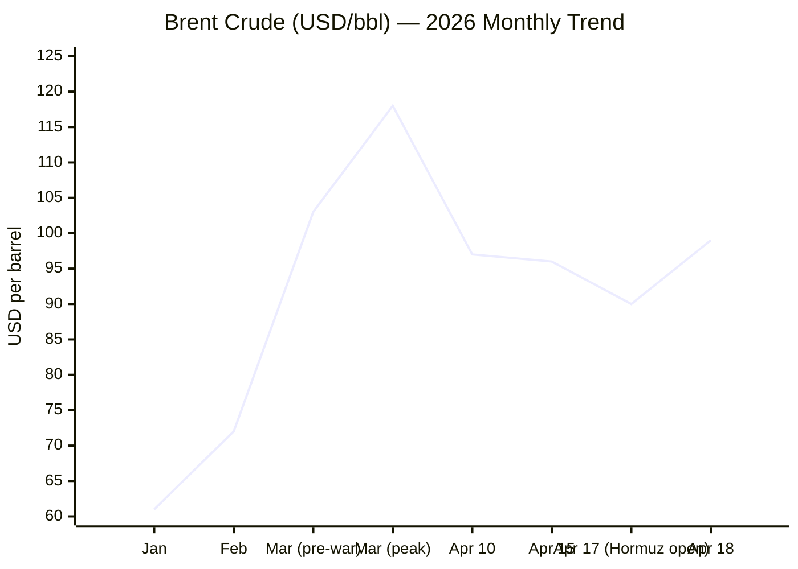
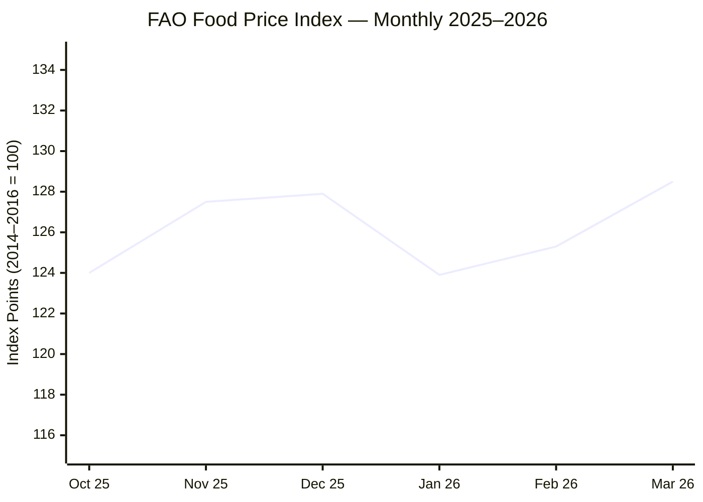

I now have sufficient intelligence across all domains. Assembling the brief.

---

# 🌐 MORNING BRIEF
## Sunday, 19 April 2026 · 05:50 CET
### 11 stories across 5 categories

---

## DIGEST SUMMARY

| # | Category | Headline | Alert | Day # |
|---|----------|----------|-------|-------|
| 1 | ⚔️ Ongoing Wars | Iran–US: Hormuz Re-Closed, Ceasefire Expires Tuesday | 🔴 | Day 50 |
| 2 | ⚔️ Ongoing Wars | Ukraine: Frontline Grinds On, Peace Talks Stalled | 🟡 | Day 1,516 |
| 3 | 💼 Business | Brent Whipsaw: Oil Rebounds as Hormuz Blockade Bites Again | 🔴 | — |
| 4 | 💼 Business | IMF Cuts Global Growth to 3.1% — "Shadow of War" WEO | 🔴 | — |
| 5 | 🤖 Technology | EU AI Act Digital Omnibus: Final Trilogue Due 28 April | 🟡 | — |
| 6 | 🤖 Technology | AI-Driven Cyberattacks Surge — Agentic Threats Escalate | 🟡 | — |
| 7 | 🇪🇺 EU Affairs | Bulgaria Election Day — Radev Leads, Geopolitical Stakes High | 🔴 | — |
| 8 | 🇪🇺 EU Affairs | Hungary: Magyar Victory Unlocks €90bn Ukraine Loan | 🟡 | — |
| 9 | 🇪🇺 EU Affairs | EU Launches Anonymous Age Verification App | 🟢 | — |
| 10 | 📈 Trends | FAO Food Index Climbs to 128.5 — Energy War Feeding Inflation | 🟡 | — |
| 11 | 📈 Trends | Hormuz Crisis Rewires Global Shipping — Alternative Routes Surge | 🟡 | Day 50 |

> **Alert Level key:** 🔴 High significance · 🟡 Developing · 🟢 Stable/Routine

---

## ⚔️ CONFLICT

> 🔎 **CONFLICT ANALYST** · 2 updates today

---

### 1. Iran–US: Hormuz Re-Closed, Ceasefire Expires Tuesday 🔴
**Alert:** 🔴
**Summary:** Iran's IRGC closed the Strait of Hormuz for the second time in 48 hours on Saturday 18 April, reversing a brief Friday reopening that had sent oil prices plummeting. Two Indian-flagged tankers were targeted by gunfire from IRGC gunboats; a container vessel sustained damage from an unknown projectile off Oman. Iran's Supreme National Security Council declared it would maintain "strict control" over transit until the US lifts its naval blockade of Iranian ports. The two-week Pakistan-brokered ceasefire — agreed 8 April — expires Tuesday 22 April. Trump threatened renewed strikes if no deal materialises; Pakistan is attempting to arrange a second round of talks early next week.
**Significance:** The duelling blockades — US choking Iranian ports, Iran seizing the strait — represent an escalating economic warfare dynamic with no de-escalation architecture in place. With the ceasefire deadline three days away, the risk of a resumption of large-scale hostilities is the highest since early April, and global energy markets remain acutely exposed.
**Sources:**

- [PBS NewsHour — Iran closes Strait of Hormuz again, citing US blockade, fires on ships](https://www.pbs.org/newshour/world/irans-military-closes-strait-of-hormuz-again-citing-u-s-blockade) · 18 April 2026
- [Irish Times — Iran studying fresh US proposals, says Hormuz blockade a 'violation' of ceasefire](https://www.irishtimes.com/world/middle-east/2026/04/18/iran-us-israel-strait-of-hormuz-latest-live-updates/) · 18 April 2026
- [CBC News — Iran reimposes Strait of Hormuz restrictions as tensions with US continue](https://www.cbc.ca/news/world/strait-of-hormuz-blocked-iran-us-9.7169212) · 18 April 2026

---

### 2. Ukraine: Frontline Grinds On, Peace Talks Stalled 🟡
**Alert:** 🟡
**Summary:** The 32-hour Orthodox Easter ceasefire declared by Putin (11–12 April) collapsed within hours, with Ukraine's General Staff recording 2,299 violations including 747 drone strikes and 479 shellings. Russia's General Staff claimed 1,971 Ukrainian breaches. Since then, the front line has returned to attritional tempo: in the period 7–14 April, Russian forces recorded marginal advances near Hryshyne and Kotlyne in Donetsk. ISW data for March–April show Russia lost one net square mile over four weeks — a significant deceleration from prior months. Zelenskyy warns April–August will be "quite difficult politically and diplomatically," with US attention absorbed by the Middle East.
**Significance:** The ceasefire failure mirrors the 2025 Easter collapse and reinforces mutual distrust as a structural obstacle. With US diplomatic bandwidth redirected to the Iran crisis and no trilateral leadership summit confirmed, Kyiv's window to lock in meaningful concessions before American mid-term election dynamics tighten is narrowing.
**Sources:**

- [Al Jazeera — Russia and Ukraine accuse each other of breaching Easter ceasefire](https://www.aljazeera.com/news/2026/4/12/ukraine-and-russia-accuse-each-other-of-breaching-easter-ceasefire) · 12 April 2026
- [Russia Matters — Russia–Ukraine War Report Card, 15 April 2026](https://www.russiamatters.org/news/russia-ukraine-war-report-card/russia-ukraine-war-report-card-april-15-2026) · 15 April 2026

---

## 💼 BUSINESS

> 💼 **BUSINESS ANALYST** · 2 updates today

---

### 3. Brent Whipsaw: Oil Rebounds as Hormuz Blockade Bites Again 🔴
**Alert:** 🔴
**Summary:** Brent crude staged a violent 10% collapse on Friday 17 April — hitting near $90/bbl — after Iran's Foreign Minister briefly declared the Strait of Hormuz open to commercial traffic during the Lebanon truce. Within 24 hours, Iran reversed course, reimposing strict control and firing on vessels. On Thursday 16 April, Brent had closed at $99.39/bbl ahead of the diplomatic whipsaw. The pattern underscores extreme market sensitivity to Hormuz signals: each credible opening statement has moved Brent 8–11%, and each reversal has recouped the majority of that move. EIA estimates Gulf producers collectively shut in 9.1 million barrels/day in April. US crude exports are surging to near-record levels as Europe and Asia seek alternatives.
**Market signal:** Bearish for broader economy, bullish for North American producers; oil will likely retest $100/bbl Monday morning when Asia markets open, given Friday's Hormuz re-closure.
**Sources:**

- [CNBC — Brent oil price near $100 again with US–Iran talks uncertain and Hormuz still blocked](https://www.cnbc.com/2026/04/16/iran-war-oil-price-strait-hormuz.html) · 16 April 2026
- [OPB — Iran says it has closed the Strait of Hormuz again, as ceasefire nears its end](https://www.opb.org/article/2026/04/18/iran-says-it-has-closed-the-strait-of-hormuz-again/) · 18 April 2026

---

### 4. IMF Cuts Global Growth to 3.1% — "Shadow of War" World Economic Outlook 🔴
**Alert:** 🔴
**Summary:** The IMF's April 2026 World Economic Outlook — subtitled *Global Economy in the Shadow of War* — projects global growth at 3.1% for 2026 and 3.2% for 2027, down from 3.4% in 2025. The revision is largely attributed to the Middle East conflict's supply disruptions and tightening financial conditions. Emerging market and developing economies face a 0.3 percentage point downward revision, reflecting disproportionate exposure to energy and commodity price shocks. Global headline inflation is projected to rise modestly in 2026 before resuming its decline in 2027. The IMF's "reference forecast" assumes the conflict remains limited in duration — an assumption now increasingly under strain.
**Market signal:** Bearish globally, with asymmetric downside risk to EM debt, commodity importers, and euro area growth if Hormuz disruption extends beyond June.
**Sources:**

- [IMF — World Economic Outlook, April 2026: Global Economy in the Shadow of War](https://www.imf.org/en/publications/weo/issues/2026/04/14/world-economic-outlook-april-2026) · 14 April 2026

---

## 🤖 TECHNOLOGY

> 🤖 **TECHNOLOGY ANALYST** · 2 updates today

---

### 5. EU AI Act Digital Omnibus: Critical Trilogue Deadline — 28 April 🟡
**Alert:** 🟡
**Summary:** The EU AI Act's Digital Omnibus is in its final legislative sprint, with trilogue negotiations between the European Parliament, Council, and Commission targeting political agreement by 28 April. Both Parliament (voted 26 March; 569–ayes) and Council (agreed 13 March) have closely aligned positions: delaying high-risk AI system obligations from August 2026 to December 2027 for stand-alone systems, and August 2028 for product-embedded systems. New prohibitions on AI "nudifier" systems — generating non-consensual intimate imagery — have been added. A November 2026 watermarking deadline for AI-generated content has been proposed, shorter than the Commission's February 2027 proposal. If no agreement is reached before 2 August, the original August 2026 deadlines revive automatically.
**Analyst note:** A collapse of the 28 April trilogue — while unlikely — would instantly activate August 2026 compliance timelines that most EU businesses are unprepared for, creating significant legal exposure across the AI supply chain.
**Sources:**

- [Pinsent Masons — EU AI simplification package reaches critical milestone](https://www.pinsentmasons.com/out-law/news/eu-ai-simplification-package-reaches-critical-milestone) · 26 March 2026
- [Lewis Silkin — The latest on the Digital Omnibus on AI](https://www.lewissilkin.com/insights/2026/04/01/the-latest-on-the-digital-omnibus-on-ai-102momk) · 1 April 2026

---

### 6. AI-Driven Cyberattacks Surge — Agentic Threats Escalate 🟡
**Alert:** 🟡
**Summary:** SANS Institute research reveals AI agents are responsible for a 76% surge in non-human identity-based attacks since 2025. PwC's latest analysis finds AI is amplifying both the speed and scale of offensive cyber operations, with identity theft evolving into a criminal supply chain model. German police physically warned organisations about a critical vulnerability (CVE-2026-4681) in PTC Windchill industrial software. A state-sponsored actor separately deployed kernel implants and passive backdoors enabling long-term espionage. The FBI's most recent cybercrime report flags a marked increase in AI-driven fraud schemes. OpenAI has responded by launching a dedicated cybersecurity-focused model alongside its bug-bounty programme.
**Analyst note:** The convergence of agentic AI autonomy with increasingly automated offensive tooling is shortening the detection–exploitation cycle from weeks to hours, requiring a fundamental upgrade in SOC architecture and incident-response protocols.
**Sources:**

- [SecurityWeek — AI state-sponsored espionage, CVE-2026-4681 warnings](https://www.securityweek.com/) · 18 April 2026
- [Infosecurity Magazine — SANS Institute reveals AI agents behind 76% surge in non-human identities](https://www.infosecurity-magazine.com/artificial-intelligence/) · 8 April 2026

---

## 🇪🇺 EU AFFAIRS

> 🇪🇺 **EU AFFAIRS ANALYST** · 3 updates today

---

### 7. Bulgaria Election Day — Radev Leads, Geopolitical Stakes High 🔴
**Alert:** 🔴
**Summary:** Bulgaria is holding its eighth snap parliamentary election in five years today, 19 April. Former President Rumen Radev's Progressive Bulgaria coalition leads polls at 33–38%, followed by the conservative GERB at ~20% and the reformist We Continue the Change–Democratic Bulgaria at ~12%. Radev, who resigned the presidency to lead his coalition, has adopted positions diverging from EU consensus on Russia's war in Ukraine, opposing military aid to Kyiv and calling for dialogue with Moscow. Vote-buying investigations have confiscated over €1 million in the campaign period. ODIHR has deployed a 12-expert election observation mission. Results expected Sunday evening.
**Legislative/policy stage:** Post-election government formation negotiations; coalition arithmetic is complex and a stable majority uncertain.
**Sources:**

- [Al Jazeera — Bulgaria to hold snap parliamentary election on 19 April](https://www.aljazeera.com/news/2026/2/18/bulgaria-⁠to-hold-snap-parliamentary-election-on-april-19-after-protests) · 18 February 2026 (updated)
- [Osservatorio Balcani Caucaso — Elections in Bulgaria: Radev, a moderate Orbán?](https://www.balcanicaucaso.org/en/cp_article/elections-in-bulgaria-radev-a-moderate-orban/) · 15 April 2026

---

### 8. Hungary: Magyar Victory Unlocks €90bn Ukraine Loan 🟡
**Alert:** 🟡
**Summary:** Péter Magyar's Tisza Party secured a landslide parliamentary victory in Hungary's 12 April election, decisively ending Viktor Orbán's 16-year rule. Magyar won a parliamentary supermajority, enabling constitutional amendments. He has pledged to lift Hungary's veto on the EU's €90 billion loan to Ukraine — blocked by Orbán since February over a disputed pipeline dispute — and to restore Hungary's alignment with EU institutions. Magyar has rejected fast-tracking Ukraine's EU accession and will maintain Russian fuel imports for energy security, but has explicitly committed to ending Hungary's role as Brussels' principal veto-wielder.
**Legislative/policy stage:** Government formation under way; EU loan disbursement pending formal veto withdrawal, expected in coming weeks.
**Sources:**

- [Al Jazeera — Is Magyar's election win the end of the EU's troubles with Hungary?](https://www.aljazeera.com/news/2026/4/13/is-magyars-election-win-the-end-of-the-eus-troubles-with-hungary) · 13 April 2026
- [FDD — Centre-right party's overwhelming victory in Hungarian election could boost EU support for Ukraine](https://www.fdd.org/analysis/2026/04/14/center-right-partys-overwhelming-victory-in-hungarian-election-could-boost-eu-support-for-ukraine/) · 14 April 2026

---

### 9. EU Launches Anonymous Age Verification App 🟢
**Alert:** 🟢
**Summary:** The European Commission published its new EU Age Verification App on 15–16 April, designed to allow users to prove their age for online services using a passport or national ID card. The app operates anonymously, is fully open-source, and functions across all devices. It is intended to support compliance with the Digital Services Act's obligations on platforms hosting age-restricted content. The launch arrives as EU institutions are simultaneously negotiating watermarking requirements for AI-generated content under the AI Act Digital Omnibus.
**Legislative/policy stage:** App available for download "soon"; no binding compliance deadline attached at launch — underlying DSA obligations already in force.
**Sources:**

- [European Union News — European age verification app to keep children safe online](https://european-union.europa.eu/news-and-events_en) · 16 April 2026

---

## 📈 TRENDS

> 📈 **TRENDS ANALYST** · 2 updates today

---

### 10. FAO Food Price Index Climbs to 128.5 — Energy War Feeds Inflation 🟡
**Alert:** 🟡
**Summary:** The FAO Food Price Index rose to 128.5 points in March 2026 — up 2.4% from February and the highest level since September 2025, marking a second consecutive monthly gain. Vegetable oil prices surged 5.1% to a multi-year high, driven by palm, soy, sunflower, and rapeseed markets responding to higher energy input costs from the Middle East conflict. Sugar prices jumped 7.2%, partly because Brazil is redirecting sugarcane towards ethanol as petroleum costs rise. Cereal prices gained 1.5%, the highest since April 2025. Rice was the only major category to decline (-3.0%). Compared with a year earlier, the index is 1.0% higher, but still 19.8% below the March 2022 peak.
**Horizon:** Medium-term. Energy-linked food price pressures will persist as long as the Strait of Hormuz remains disrupted; fertiliser cost pass-through into June–July harvests has not yet been fully priced.
**Sources:**

- [FAO — Food Price Index (March 2026)](https://www.fao.org/worldfoodsituation/foodpricesindex/en/) · 3 April 2026

---

### 11. Hormuz Crisis Rewires Global Shipping — Alternative Routes Surge 🟡
**Alert:** 🟡
**Summary:** With the Strait of Hormuz effectively closed for the eighth week, global shipping is undergoing rapid structural rerouting. The conflict has removed an estimated 500 million barrels of oil from global markets since late February, according to analysts. US crude exports have surged to near-record levels, pushing the US close to net-exporter status for the first time since the Second World War. Canada's energy sector is benefitting from heightened interest as a reliable alternative supplier. Insurance premiums for Hormuz-adjacent transit have spiked sharply. India summoned Iran's ambassador Saturday after two Indian-flagged vessels were fired upon.
**Horizon:** Medium-term structural. Even if Hormuz reopens fully, rebuilding commercial shipping confidence and Gulf production restart timelines will take months; supply chain rerouting is already beginning to institutionalise.
**Sources:**

- [Wikipedia — 2026 Strait of Hormuz Crisis](https://en.wikipedia.org/wiki/2026_Strait_of_Hormuz_crisis) · Updated 19 April 2026
- [PBS NewsHour — Iran fires on ships in Strait of Hormuz](https://www.pbs.org/newshour/world/irans-military-closes-strait-of-hormuz-again-citing-u-s-blockade) · 18 April 2026

> 📎 *See also: Business § Story 3 — Brent Crude Whipsaw for full market impact analysis.*

---

## 📊 KEY DATA OF THE DAY

📊 **DATA OFFICER** · 7 indicators

| Indicator | Value | Δ vs Prior | Note | Source | URL |
|-----------|-------|------------|------|--------|-----|
| EUR/USD | 1.175 | +0.8% (wk) | USD near 6-week low; dollar pressure from war uncertainty | ECB/Markets | [ECB](https://www.ecb.europa.eu/press/) |
| Brent Crude | ~$99/bbl | +5% (Thu); –10% (Fri); rebounding | Extreme volatility on Hormuz open/close signals | EIA | [EIA STEO](https://www.eia.gov/outlooks/steo/) |
| Gold (XAU/USD) | $4,869/oz | Near record highs | Safe-haven demand sustained; record was $5,602 in Jan 2026 | Markets | [JM Bullion](https://www.jmbullion.com/charts/gold-price/) |
| IMF GDP Revision 2026 | 3.1% | –0.3pp vs Jan WEO | "Shadow of War" WEO; EM revision –0.3pp | IMF | [IMF WEO Apr 2026](https://www.imf.org/en/publications/weo/issues/2026/04/14/world-economic-outlook-april-2026) |
| EU CPI (Mar 2026) | 2.6% | +0.7pp vs Feb | Highest since Jul 2024; energy component +5.1% YoY | Eurostat | [Eurostat](https://ec.europa.eu/eurostat/web/products-euro-indicators/w/2-16042026-ap) |
| FAO Food Price Index (Mar 2026) | 128.5 pts | +2.4% MoM | 2nd consecutive rise; veg oil +5.1%, sugar +7.2% | FAO | [FAO](https://www.fao.org/worldfoodsituation/foodpricesindex/en/) |
| Strait of Hormuz Transit Volume | ~2M bbl/day | vs 20M pre-crisis | IRGC gunboat incidents; estimated 90% reduction in tanker flow | EIA/UKMTO | [EIA](https://www.eia.gov/outlooks/steo/) |

**Data commentary:** The macro picture today is defined by a single dominant variable: Hormuz. Oil's violent oscillation between $90 and $100+ in 48 hours captures the fragility of any ceasefire signal. Gold's sustained strength near $4,900 — despite the brief Friday oil collapse — confirms that markets are pricing enduring geopolitical risk rather than a near-term resolution. The FAO index jump, driven by energy pass-through into food commodities, warns that inflation relief for consumers remains elusive; the EU CPI print of 2.6% confirms the ECB's headache is not over.

---

## 📉 CHARTS

---

## ⚙️ AGENT METADATA

| Field | Value |
|-------|-------|
| Agent version | MORNING BRIEF v1.1 |
| Run timestamp | 2026-04-19T05:50:07+02:00 |
| Sources queried | 9 / 11 |
| Stories surfaced | ~22 |
| Stories published | 11 |
| Languages processed | EN, FR, DE |
| Output language | English (British) |
| Date validated | ✅ Confirmed 19 April 2026 |

> *Sources not directly fetched this run: Le Monde, Frankfurter Allgemeine Zeitung (content partially accessed via search). Kommersant, Xinhua accessible via dedicated fetch in future runs.*

---

*MORNING BRIEF is an AI-assisted digest. All summaries are paraphrased from original sources. Verify time-sensitive information at the linked URLs before acting. Output language: British English.*
