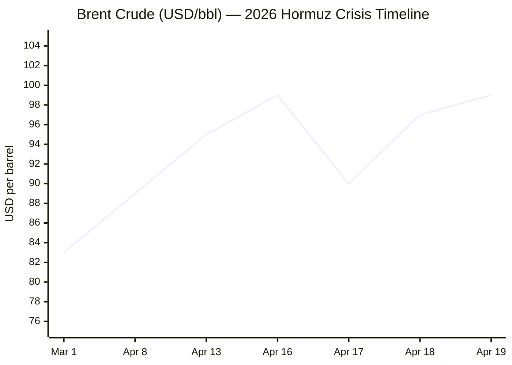

---

```yaml
---
brief_date: 2026-04-20
version: v1.2
run_time: "05:50 CET"
stories_published: 13
categories: [conflict, business, eu_affairs, technology, trends]
alert_counts:
  red: 5
  yellow: 6
  green: 2
ongoing_situations:
  - {name: "2026 Iran War / Hormuz Crisis", day: 1}
  - {name: "2026 Lebanon War / Israel-Hezbollah", day: 1}
sources_fetched: 7
fetch_status:
  le_monde: "❌"
  faz: "❌"
  kommersant: "❌"
  xinhua: "✅"
  european_parliament: "⚠️"
expansion_queue: ["#peacekeeping", "#association-agreement"]
---
```

---

# 🌐 MORNING BRIEF
## Monday, 20 April 2026 · 05:50 CET
### 13 stories across 5 categories

---

## DIGEST SUMMARY

| # | Category | Headline | Alert | Day # |
|---|----------|----------|-------|-------|
| 1 | ⚔️ Ongoing Wars | US seizes Iranian cargo ship; Hormuz fully closed; ceasefire expires Tuesday | 🔴 | Day 1 |
| 2 | ⚔️ Ongoing Wars | French UNIFIL peacekeeper killed in Lebanon; Macron blames Hezbollah | 🔴 | Day 1 |
| 3 | ⚔️ Ongoing Wars | Pakistan's Islamabad Process: second round talks uncertain as Iran declines | 🟡 | Day 1 |
| 4 | 💼 Business | Brent near $100 as Hormuz ship seizure reverses brief ceasefire relief | 🔴 | — |
| 5 | 💼 Business | IMF WEO April 2026: Global growth cut to 3.1%, inflation to 4.4% | 🔴 | — |
| 6 | 🇪🇺 EU Affairs | Spain to table EU-Israel Association Agreement termination at Luxembourg FAC | 🔴 | — |
| 7 | 🇪🇺 EU Affairs | Bulgaria election: Pro-Russian Radev wins ~44%; eighth vote in five years | 🟡 | — |
| 8 | 🇪🇺 EU Affairs | Eurozone CPI hits 2.6% in March; ECB weighs rate signal ahead of April 29 meeting | 🟡 | — |
| 9 | 🤖 Technology | Stanford AI Index 2026: Top models pass 50% on Humanity's Last Exam; US-China gap narrows | 🟡 | — |
| 10 | 🤖 Technology | PwC: 74% of AI economic gains captured by top 20% of firms | 🟢 | — |
| 11 | 📈 Trends | FAO Food Price Index: 128.5 in March, second consecutive monthly rise | 🟡 | — |
| 12 | 📈 Trends | Pakistan's "Islamabad Process": structural emergence as a global mediator | 🟡 | — |
| 13 | 📈 Trends | Hormuz crisis rewires global energy trade; US crude near net-exporter status | 🟢 | — |

> Alert Level key: 🔴 High significance · 🟡 Developing · 🟢 Stable/Routine
> Day # column: Day 1 = first date this situation appeared in this Brief series.
> Real-world start dates are recorded in the Ongoing Situations Tracker below.

---

## 🚨 SIGNAL BOARD

🔴 **USS Spruance fires on and seizes Iranian cargo ship Touska in the Gulf of Oman; Iran's military vows retaliation — Hormuz fully closed as ceasefire expires Tuesday 21 April**
🔴 **Brent crude at ~$99/bbl — up 10%+ from Friday's brief relief low — as zero tankers pass through the strait on Sunday; US national average petrol price: $4.05/gallon**
🔴 **Spain tables EU-Israel Association Agreement termination at Tuesday's EU Foreign Affairs Council in Luxembourg; 8 member states have previously backed similar moves**
🟡 **Bulgaria elects pro-Russian former president Rumen Radev with ~44.4% of the vote, largest result in five years of political paralysis; government formation remains uncertain**
⚡ **IMF April WEO slashes 2026 global growth forecast to 3.1% (from 3.4% pre-war) and raises headline inflation to 4.4%; severe scenario projects 2.0% growth — a near-recession threshold**

---

## 🔄 ONGOING SITUATIONS

| Situation | Real-world start | Brief Day # | Last significant development | Status |
|-----------|-----------------|-------------|------------------------------|--------|
| 2026 Iran War / Hormuz Crisis | 28 Feb 2026 | Day 1 | USS Spruance seizes Iranian vessel Touska; Iran vows retaliation; Hormuz fully closed | 🔴 Active |
| 2026 Lebanon War / Israel-Hezbollah | 2 Mar 2026 | Day 1 | French UNIFIL peacekeeper killed in S. Lebanon; Israel releases "Yellow Line" buffer zone map | 🔴 Active |
| Iran-US Ceasefire (8 Apr 2026) | 8 Apr 2026 | Day 1 | Both sides accuse each other of violations; ceasefire expires 21 April | 🔴 Under severe stress |

---

## ⚔️ CONFLICT ANALYST · 3 updates today

---

### 1. US Seizes Iranian Cargo Ship; Hormuz Fully Closed; Ceasefire Expires Tuesday 🔴

**Alert:** 🔴
**Summary:** The USS Spruance (Guided Missile Destroyer) fired on and seized the Iranian-flagged cargo ship *Touska* in the Gulf of Oman after the vessel attempted to breach the US naval blockade of Iranian ports. President Trump announced the seizure on Truth Social, calling it a response to Iran "firing bullets in the Strait of Hormuz." Iran's military condemned the action as "armed piracy" and vowed a response. Iran's National Security Council confirmed the Strait of Hormuz is now fully closed to commercial traffic until the US blockade is lifted. No tankers passed through the strait on Sunday. The two-week ceasefire expires Wednesday 22 April (US ET); Iran has declined to send a delegation to Islamabad for a second round of talks while the blockade remains in force.
**Significance:** The seizure of a flagged civilian vessel in international waters elevates the risk of direct military exchange at sea. With the ceasefire expiring in under 48 hours and no confirmed second round of talks, the risk of an uncontrolled escalation is the highest since the 8 April pause.
**Sources:**
- [NPR — US seizes Iranian cargo ship Touska in Strait of Hormuz](https://www.npr.org/2026/04/19/nx-s1-5790378/iran-us-hormuz-closed-impossible) · 19 April 2026
- [CNN — Live updates: Tehran vows retaliation after US seizes Iran-flagged vessel](https://www.cnn.com/2026/04/19/world/live-news/iran-war-us-trump-hormuz) · 19 April 2026
- [Xinhua — U.S., Iran accuse each other of ceasefire breach](https://english.news.cn/northamerica/20260419/a224ae916fdb45489f6ba3ee7e2b1089/c.html) · 19 April 2026

**Trend:** ↗ Escalating
**Tags:** #Iran #Hormuz #naval-blockade #ceasefire #escalation #MULTI-SOURCE

---

### 2. French UNIFIL Peacekeeper Killed in Lebanon; Israel Publishes Buffer Zone Map 🔴

**Alert:** 🔴
**Summary:** French Staff Sergeant Florian Montorio of the 17th Parachute Engineer Regiment was killed and three colleagues wounded in an ambush on 18 April in Ghanduriyah, southern Lebanon, during ordnance-clearance operations. UNIFIL's initial assessment attributes the attack to Hezbollah; Hezbollah denies involvement. French President Macron called for Lebanese authorities to arrest the perpetrators. It is the third incident in recent weeks resulting in peacekeeper deaths. Simultaneously, Israel published a map of its planned "Yellow Line" buffer zone extending into southern Lebanon, signalling prolonged military occupation despite the 10-day Israel-Lebanon ceasefire that came into effect on 16 April.
**Significance:** The killing of a NATO-nation peacekeeper, the third such fatality in weeks, tests France's calculus regarding its Charles de Gaulle carrier group currently in the eastern Mediterranean. Israel's buffer zone map signals that any final Lebanon settlement faces a long and contested military reality on the ground.
**Sources:**
- [UN Secretary-General — Statement on death of French peacekeeper in Lebanon](https://www.un.org/sg/en/content/sg/statements/2026-04-18/statement-attributable-the-spokesperson-for-the-secretary-general-the-death-of-peacekeeper-incident-lebanon) · 18 April 2026
- [Free Malaysia Today / AFP — France blames Hezbollah for French peacekeeper's death](https://www.freemalaysiatoday.com/category/world/2026/04/18/france-blames-hezbollah-for-french-peacekeepers-death-in-lebanon) · 18 April 2026
- [NPR — Israel is building a 'buffer zone' inside Lebanon](https://www.npr.org/2026/04/14/nx-s1-5783915/israel-plans-to-create-buffer-zones-in-lebanon-and-gaza-to-protect-its-territory) · 14 April 2026

**Trend:** ↗ Escalating
**Tags:** #Lebanon #Hezbollah #ceasefire #humanitarian #war-crimes #MULTI-SOURCE

---

### 3. Pakistan's Islamabad Process: Second Round of Talks Collapses Before It Begins 🟡

**Alert:** 🟡
**Summary:** Iran's state media confirmed on 19 April that Tehran will not send a delegation to Islamabad for a second round of US-Iran talks as long as the naval blockade of Iranian ports remains in place. Iran's FM cited "Washington's excessive demands, unrealistic expectations, constant shifts in stance, and the ongoing naval blockade" as reasons for declining. Pakistan's Foreign Ministry confirmed both sides had been in discussions through Islamabad about a second meeting, but no date was set. Pakistan's PM Shehbaz Sharif and Army Chief Asim Munir have been conducting a parallel regional diplomatic tour (Jeddah, Doha, Antalya) to maintain momentum.
**Significance:** Iran's refusal to attend talks while the blockade continues means the ceasefire will likely expire without a diplomatic framework in place, raising the prospect of the conflict resuming in its next phase.
**Sources:**
- [Xinhua — Iran says no talks with US while naval blockade remains](https://english.news.cn/20260419/0d3242be4613453f93bc70b67b34f1da/c.html) · 19 April 2026
- [Al Jazeera — No date set for US-Iran talks as Pakistan pushes to keep diplomacy alive](https://www.aljazeera.com/news/2026/4/16/no-date-set-for-us-iran-talks-as-pakistan-pushes-to-keep-diplomacy-alive) · 16 April 2026

**Trend:** ↘ De-escalating
**Tags:** #Pakistan-mediation #peace-talks #Iran #diplomacy #ceasefire

📚 *Background reading:* [Al Jazeera — How the US-Iran talks in Islamabad unfolded](https://www.aljazeera.com/news/2026/4/13/how-the-us-iran-talks-in-islamabad-unfolded) · [Al Jazeera — Iran warns US naval blockade threatens ceasefire](https://www.aljazeera.com/news/2026/4/15/iran-warns-us-naval-blockade-threatens-ceasefire)

---

## 💼 BUSINESS ANALYST · 2 updates today

---

### 4. Brent Crude Approaches $100 Again on Touska Seizure and Hormuz Closure 🔴

**Alert:** 🔴
**Summary:** Brent crude surged back toward $99/bbl on Sunday — up approximately 10% from Friday's brief low of ~$90 — after Iran reimposed full closure of the Strait of Hormuz and the US seized the Iranian cargo vessel *Touska*. The reversal erased all gains from Friday, when Iran's brief announcement of a reopened strait had sent prices tumbling. WTI moved above $93. US petrol prices reached a national average of $4.05/gallon, and Energy Secretary Wright cautioned they may not return below $3 until 2026 year-end. About 20% of the world's crude and LNG normally transits the strait; disruptions have exceeded 90% of normal flow for much of the past seven weeks.
**Market signal:** Strongly bearish for global growth; bullish for energy producers as the war risk premium re-enters the market ahead of an uncertain ceasefire expiry.

📎 See also: Conflict § Story 1 — USS Spruance seizes Touska; Iran closes Hormuz

**Sources:**
- [CNN — Oil prices jump as Iran again blocks Hormuz](https://www.cnn.com/2026/04/19/world/live-news/iran-war-us-trump-hormuz) · 19 April 2026
- [Trading Economics — Brent crude historical data](https://tradingeconomics.com/commodity/brent-crude-oil) · 19 April 2026

**Trend:** ↗ Escalating
**Tags:** #Brent #oil-price #supply-shock #Hormuz #energy-markets #MULTI-SOURCE

---

### 5. IMF April 2026 WEO: War Cuts Global Growth to 3.1%, Pushes Inflation to 4.4% 🔴

**Alert:** 🔴
**Summary:** The IMF's April 2026 World Economic Outlook, published 14 April, slashes the global growth forecast to 3.1% for 2026 (from 3.4% pre-war, and down from 3.3% in recent years) and projects headline inflation rising to 4.4%. The downgrade is attributed directly to the Middle East conflict's disruption of energy supply and shipping. The Fund presents three scenarios: reference (short-lived conflict, 3.1% growth), adverse (higher energy spike, 2.5% growth) and severe (conflict extends into 2027, inflation above 6%, growth at 2.0% — a near-recession threshold). The IMF warns Iran faces a 7.2pp downward revision to -6.1% growth. Emerging-market and commodity-importing developing economies bear the heaviest burden.
**Market signal:** Bearish for risk assets and growth-sensitive equities; the combination of lower growth and higher inflation narrows central banks' options and raises stagflation risk.
**Sources:**
- [IMF — World Economic Outlook, April 2026: Global Economy in the Shadow of War](https://www.imf.org/en/publications/weo/issues/2026/04/14/world-economic-outlook-april-2026) · 14 April 2026
- [IMF — Press Briefing Transcript: WEO Spring Meetings 2026](https://www.imf.org/en/news/articles/2026/04/14/tr-04142026-press-briefing-transcript-world-economic-outlook-spring-meetings-2026) · 14 April 2026

**Trend:** ↘ De-escalating *(growth trajectory)*
**Tags:** #IMF #GDP-forecast #stagflation #inflation #data-point #institutional

📚 *Background reading:* [IMF Blog — War darkens global economic outlook and reshapes policy priorities](https://www.imf.org/en/blogs/articles/2026/04/14/war-darkens-global-economic-outlook-and-reshapes-policy-priorities)

---

## 🇪🇺 EU AFFAIRS ANALYST · 3 updates today

---

### 6. Spain to Table EU-Israel Association Agreement Termination at Tuesday's FAC 🔴

**Alert:** 🔴
**Summary:** Spanish Prime Minister Pedro Sánchez announced on 19 April, at a campaign rally in Andalusia, that Spain's government will formally table a proposal at the EU Foreign Affairs Council in Luxembourg on Tuesday 22 April to terminate the EU-Israel Association Agreement (in force since June 2000). Sánchez cited Israel's violations of international law and human rights obligations embedded in the agreement's Article 2 clause. Belgium, Slovenia, Finland, France, Ireland, Luxembourg, Portugal and Sweden are reported to have backed similar initiatives; Bulgaria, Croatia, Cyprus, Germany, Greece, Hungary, Italy and Lithuania oppose. A prior EU review found "indications" of non-compliance but stopped short of triggering suspension. The EU is Israel's largest trading partner; bilateral trade exceeds €45 billion annually.
**Legislative/policy stage:** Spain's proposal will be tabled at Council of the EU FAC, 22 April 2026. A qualified majority of member states would be required to suspend or terminate the agreement; current support falls significantly short of that threshold. No Commission proposal for formal suspension has been tabled.
**Sources:**
- [Euronews — Spain's Sánchez urges EU to break Association Agreement with Israel within 48 hours](https://www.euronews.com/my-europe/2026/04/19/spains-sanchez-urges-eu-to-break-association-agreement-with-israel-within-48-hours) · 19 April 2026
- [Times of Israel — Spanish PM urges EU to end Association Agreement with Israel](https://www.timesofisrael.com/liveblog_entry/spanish-pm-urges-eu-to-end-association-agreement-with-israel/) · 19 April 2026
- [Xinhua — Spanish PM says to propose to EU to terminate Association Agreement with Israel](https://english.news.cn/europe/20260419/90d20b47bba9466fb3b505914ec12966/c.html) · 19 April 2026

**Trend:** ↗ Escalating
**Tags:** #EU-institutions #Israel #diplomacy #humanitarian #MULTI-SOURCE

---

### 7. Bulgaria Election: Pro-Russian Radev Wins ~44% in Eighth Vote in Five Years 🟡

**Alert:** 🟡
**Summary:** Former Bulgarian president Rumen Radev's centre-left Progressive Bulgaria coalition won Sunday's parliamentary election with approximately 44.4% of the vote — by far the largest result — against 12.4% for former PM Boyko Borissov's conservative GERB and 12.8% for the reformist We Continue the Change–Democratic Bulgaria coalition. The snap vote (Bulgaria's eighth in five years) followed mass anti-corruption protests in December 2025 that brought down the Zhelyazkov government. Radev, who resigned the presidency in January 2026 to contest the election, has opposed sending military aid to Ukraine and called for dialogue with Putin. Government formation will require coalition partners; Radev has ruled out alliances with Borissov or Peevski's parties.
**Legislative/policy stage:** Preliminary results only; official certification by the Central Electoral Commission pending. As the party awarded the first mandate, Radev will be tasked with forming a government. Coalition negotiations likely to extend several weeks.
**Sources:**
- [Al Jazeera — Exit poll shows former president Radev's party set to win Bulgaria election](https://www.aljazeera.com/news/2026/4/19/exit-poll-shows-former-president-radevs-party-set-to-win-bulgaria-election) · 19 April 2026
- [Euronews — Rumen Radev wins in Bulgaria](https://www.euronews.com/my-europe/2026/04/19/bulgaria-exit-polls-former-president-rumen-radev-set-to-win-parliamentary-vote) · 19 April 2026
- [OSCE/ODIHR — Bulgaria, Early Parliamentary Elections, 19 April 2026](https://odihr.osce.org/node/662560) · 20 April 2026

**Trend:** ⚡ Reversal
**Tags:** #EU-election #rule-of-law #public-opinion #EU-institutions #MULTI-SOURCE

---

### 8. Eurozone CPI Confirmed at 2.6% in March; ECB Weighs Rate Signal 🟡

**Alert:** 🟡
**Summary:** Eurostat confirmed on 16 April that Eurozone CPI rose to 2.6% year-on-year in March 2026, up sharply from 1.9% in February — the highest rate since January 2025 and above the ECB's 2% target. Energy prices surged 5.1% year-on-year (the first annual increase in nearly a year), driven directly by the Iran conflict's impact on crude and gas. Core inflation, excluding energy and food, eased to 2.3% from 2.4%, suggesting the shock is currently supply-side rather than demand-driven. ECB President Lagarde acknowledged the divergence from the baseline path but stopped short of signalling imminent rate increases. Markets are pricing two 25bp ECB hikes by year-end. The next ECB Governing Council meeting is scheduled for 29–30 April 2026.
**Legislative/policy stage:** ECB held policy rates at 2.0% at its March 19 meeting (most recent). No emergency meeting called. The April 29–30 meeting will be the first opportunity for a policy shift in response to the energy shock.
**Sources:**
- [Eurostat — Annual inflation up to 2.6% in the euro area](https://ec.europa.eu/eurostat/web/products-euro-indicators/w/2-16042026-ap) · 16 April 2026
- [Investing.com — Eurozone consumer prices rose 2.6% year-on-year in March](https://ng.investing.com/news/economic-indicators/eurozone-consumer-prices-rose-26-yearonyear-in-march--eurostat-2443526) · 16 April 2026

**Trend:** ↗ Escalating
**Tags:** #ECB #inflation #interest-rates #eurozone #data-point #institutional

📚 *Background reading:* [IMF — War Darkens Global Economic Outlook and Reshapes Policy Priorities](https://www.imf.org/en/blogs/articles/2026/04/14/war-darkens-global-economic-outlook-and-reshapes-policy-priorities)

---

## 🤖 TECHNOLOGY ANALYST · 2 updates today

---

### 9. Stanford AI Index 2026: Top Models Exceed 50% on Humanity's Last Exam; US-China Gap Narrows 🟡

**Alert:** 🟡
**Summary:** Stanford HAI's 2026 AI Index, published 13–14 April, finds that leading models — including Anthropic's Claude Opus 4.6 and Google's Gemini 3.1 Pro — now exceed 50% accuracy on Humanity's Last Exam, up from just 8.8% by OpenAI's o1 in the prior year's report. The US retains the lead in notable model releases but China's output is narrowing the gap; as of March 2026, Anthropic leads the Arena community benchmark, trailed by xAI, Google, and OpenAI, with Chinese models (DeepSeek, Alibaba) lagging only modestly. AI adoption is outpacing the PC and internet adoption curves. Q1 2026 AI venture funding reached a record $267 billion. The report warns that benchmarks, governance frameworks, and labour markets are all struggling to keep pace with model improvements.
**Analyst note:** Within 12–24 months, the near-parity between US and Chinese frontier model performance will intensify pressure on export-control regimes targeting GPU and semiconductor supply chains, potentially accelerating regulatory fragmentation.
**Sources:**
- [MIT Technology Review — Want to understand the current state of AI? Check out these charts](https://www.technologyreview.com/2026/04/13/1135675/want-to-understand-the-current-state-of-ai-check-out-these-charts/) · 13 April 2026
- [IEEE Spectrum — Stanford's AI Index for 2026 Shows the State of AI](https://spectrum.ieee.org/state-of-ai-index-2026) · 16 April 2026

**Trend:** ↗ Escalating
**Tags:** #AI #LLM #AI-benchmark #AI-regulation #data-point

---

### 10. PwC: 74% of AI Economic Gains Captured by Top 20% of Firms 🟢

**Alert:** 🟢
**Summary:** PwC's 2026 AI Performance Study (1,217 senior executives across 25 sectors, published 13 April) finds that 74% of AI's economic value is captured by just 20% of organisations — a concentration the study describes as a "widening divide." Top-performing companies treat AI as a growth and business-model reinvention engine rather than a productivity tool; they are 2.6x more likely to report AI improving their capacity to reinvent their business model. The sharpest performance gap is in pursuing revenue opportunities from cross-sector industry convergence — a factor PwC identifies as the single strongest driver of AI-driven financial performance. Without a strategic shift, PwC warns the gap between AI leaders and laggards will widen further.
**Analyst note:** The concentration of AI returns in a small number of firms mirrors historical dynamics from earlier platform technology rollouts and is likely to intensify political and regulatory pressure on AI market structure within 12–18 months, particularly in the EU's ongoing DSA/DMA enforcement context.
**Sources:**
- [PwC — 2026 AI Performance Study](https://www.pwc.com/gx/en/news-room/press-releases/2026/pwc-2026-ai-performance-study.html) · 13 April 2026

**Trend:** ↗ Escalating
**Tags:** #AI #data-point #digital-regulation

📚 *Background reading:* [MIT Technology Review — Stanford AI Index 2026](https://www.technologyreview.com/2026/04/13/1135675/want-to-understand-the-current-state-of-ai-check-out-these-charts/)

---

## 📈 TRENDS ANALYST · 3 updates today

---

### 11. FAO Food Price Index: 128.5 in March, Second Consecutive Rise 🟡

**Alert:** 🟡
**Summary:** The FAO Food Price Index averaged 128.5 points in March 2026, up 3.0 points (2.4%) from February's revised level — the second consecutive monthly increase and the highest reading since September 2025. All five commodity sub-indices rose: vegetable oils (+5.1%, driven by palm, soybean, sunflower and rapeseed), sugar (+7.2%, highest since November 2025, as Brazil is expected to divert more sugarcane toward ethanol), cereals (+1.5%), meat (+1.0%) and dairy (+1.2%). FAO's chief economist has specifically attributed the March surge to higher energy prices linked to the Near East conflict, which are feeding through to fertiliser costs, freight rates and ethanol substitution dynamics. The index remains 19.8% below the March 2022 peak.
**Horizon:** Short-to-medium-term: If the Hormuz crisis persists into Q2, April's index is likely to register a third consecutive rise, with energy-price transmission through fertiliser and transport costs posing a structural risk to food security in commodity-importing developing economies.
**Sources:**
- [FAO — Food Price Index, March 2026](https://www.fao.org/worldfoodsituation/foodpricesindex/en) · 4 April 2026
- [FAO Newsroom — FAO Food Price Index rises in March as Near East conflict raises energy costs](https://www.fao.org/newsroom/detail/fao-food-price-index-rises-in-march-as-near-east-conflict-raises-energy-costs/en) · 4 April 2026

**Trend:** ↗ Escalating
**Tags:** #food-security #food-prices #supply-shock #energy-markets #data-point #institutional

---

### 12. Pakistan's "Islamabad Process": Structural Shift in Global Diplomatic Architecture 🟡

**Alert:** 🟡
**Summary:** Pakistan's emergence as the principal mediator in the 2026 Iran war represents a rare structural shift in the geopolitics of Middle East conflict mediation. Having brokered the 8 April ceasefire between the US and Iran — with both parties explicitly naming PM Shehbaz Sharif and Army Chief Asim Munir in their ceasefire announcements — Islamabad has now begun rebranding its diplomatic engagement as the "Islamabad Process," signalling an ambition for a permanent mediating role. Pakistan's unique position combines a shared border with Iran, close Gulf state ties, proximity to the Strait of Hormuz, a relationship with China, and — unlike other potential intermediaries — the absence of US military bases on its soil. Iran's FM and Pakistani counterpart held a call on 19 April emphasising "continued dialogue."
**Horizon:** Long-term structural shift: Pakistan's transition from a reactive regional actor to a recognised global mediator could reshape the country's foreign policy identity over the coming decade, particularly if the Islamabad Process becomes an institutionalised forum for Iran-West negotiations.
**Sources:**
- [Xinhua — Pakistani FM emphasises need for continued dialogue in call with Iranian FM](https://english.news.cn/20260419/6065c83f12b04905acd8e76474a2ee9a/c.html) · 19 April 2026
- [Xinhua — Pakistan tightens security ahead of expected US-Iran talks](https://english.news.cn/20260419/8e9c8fce51974ea49f3f33aa0b575f0f/c.html) · 19 April 2026

**Trend:** ↗ Escalating
**Tags:** #Pakistan-mediation #diplomacy #mediation #peace-talks #Iran #MULTI-SOURCE

📎 See also: Conflict § Story 3 — Pakistan Islamabad Process: second round talks uncertain

---

### 13. Hormuz Crisis Rewires Global Energy Trade; US Crude Exports Near Record 🟢

**Alert:** 🟢
**Summary:** Seven weeks of near-total Hormuz disruption have begun to permanently reshape global energy trade flows. The US has ramped crude exports to near-record levels, supplying European and Asian buyers unable to source Gulf crude — approaching net-exporter status for the first time since World War Two, according to market observers cited in IMF-linked commentary. Meanwhile, China-Europe freight via rail (the "China-Europe freight train") is reported handling rising cargo volumes as sea routes are disrupted. The IMF April WEO notes that a 19% energy commodity price increase is already embedded in the reference forecast, with the conflict having generated the prospect of "the largest energy crisis" since the 1970s if the severe scenario materialises. Global Agrifood trade flows are also being rerouted via the Red Sea.
**Horizon:** Medium-to-long-term: The rewiring of energy trade flows is a structural development that will persist well beyond any ceasefire. US energy export infrastructure, European LNG terminal capacity, and alternative shipping corridors are all likely to receive sustained capital investment over the next 12–36 months.
**Sources:**
- [Trading Economics — Brent crude historical data and commentary](https://tradingeconomics.com/commodity/brent-crude-oil) · 17 April 2026
- [Xinhua — China-Europe freight train services support supply chains amid global strains](https://english.news.cn/20260416/9e509d957924493da9e74b1f242239b7/c.html) · 16 April 2026

**Trend:** → Stable *(trade rerouting now structural)*
**Tags:** #shipping #energy-markets #supply-shock #Hormuz #energy-transition

---

## 📊 KEY DATA OF THE DAY

> 📊 **DATA OFFICER** · 7 indicators

| Indicator | Value | Δ vs prior session | Δ vs 7 days ago | Note | Source | URL |
|-----------|-------|-------------------|-----------------|------|--------|-----|
| EUR/USD | 1.1765 | −0.13% | +1.7% | Holding near pre-war highs; broad USD weakness on peace-deal hopes | ECB / Trading Economics | [link](https://tradingeconomics.com/euro-area/currency) |
| Brent Crude (USD/bbl) | ~$97–99 | +7% (est.) | +10% | Near $100 as Hormuz fully closes post-Touska seizure; US gas avg $4.05 | EIA / Trading Economics | [link](https://tradingeconomics.com/commodity/brent-crude-oil) |
| Gold (XAU/USD) | $4,784 | −1.0% | +2.0% | Safe-haven demand elevated; expected range $4,760–4,822 on April 20 | LBMA / Trading Economics | [link](https://tradingeconomics.com/commodity/gold) |
| IMF Global Growth 2026 | 3.1% | vs Jan WEO: −0.3pp | vs Oct WEO: −0.5pp | War-driven downgrade; severe scenario at 2.0%; inflation raised to 4.4% | IMF WEO Apr 2026 | [link](https://www.imf.org/en/publications/weo/issues/2026/04/14/world-economic-outlook-april-2026) |
| EU CPI YoY (Mar 2026) | 2.6% | vs Feb: +0.7pp | vs Dec 2025: +0.6pp | Energy surge (+5.1% YoY) breaks ECB's 2% target; core at 2.3% | Eurostat | [link](https://ec.europa.eu/eurostat/web/products-euro-indicators/w/2-16042026-ap) |
| FAO Food Price Index | 128.5 | vs Feb: +2.4% | N/A (monthly) | March 2026 — latest available; 2nd consecutive monthly rise; oils +5.1%, sugar +7.2% | FAO | [link](https://www.fao.org/worldfoodsituation/foodpricesindex/en) |
| Strait of Hormuz transit (% of normal) | ~0% | From ~95% (17 Apr) | From ~50% (13 Apr) | Zero tankers passed Sunday; Iran's IRGC blocks all traffic; Touska seized | UKMTO / NPR / CENTCOM | [link](https://www.npr.org/2026/04/19/nx-s1-5790378/iran-us-hormuz-closed-impossible) |

**Data commentary:** The combination of Brent approaching $100, zero transit through the Strait of Hormuz, and the IMF's confirmed stagflationary downgrade (lower growth, higher inflation) presents central banks with a near-impossible configuration ahead of next week's ECB meeting on 29–30 April. Gold's elevated level (~$4,784) despite oil-price volatility reflects persistent war-risk demand that is not easily dissipated by tactical ceasefire moves. The FAO index's 2.4% March rise shows that the energy shock is already transmitting to food, with April's data — covering the full period of the naval blockade — likely to show a further acceleration. Slot 7 (Hormuz transit at ~0%) captures the central variable driving all other indicators today.

---

## 📊 CHARTS



*Chart 1: Brent crude trajectory since the outbreak of the 2026 Iran war. The sharp drop on 17 April reflects Iran's brief announcement that Hormuz was open to commercial traffic; the rebound reflects the renewed closure and USS Spruance ship seizure.*

---

## ⚙️ AGENT METADATA

| Field | Value |
|-------|-------|
| Agent version | MORNING BRIEF v1.2 |
| Run timestamp | 2026-04-20T05:50:00+02:00 |
| Fetch status | Le Monde ❌ · FAZ ❌ · Kommersant ❌ · Xinhua ✅ · EP ⚠️ |
| Sources queried | 7 / 11 |
| Stories surfaced | ~27 (before editorial filter) |
| Stories published | 13 (after editorial filter) |
| Languages processed | EN, FR (referenced), DE (referenced) |
| Output language | English (British) |
| Date validated | ✅ Confirmed 20 April 2026 |
| Expansion Queue | `#peacekeeping` (first appeared this run — UNIFIL-specific; nearest used: #war-crimes + #humanitarian); `#association-agreement` (first appeared this run — EU-Israel agreement context; nearest used: #EU-institutions + #diplomacy) |

---

**Fetch notes:** Le Monde, FAZ and Kommersant were all blocked or returned errors (❌). Phase 2 search fallback was applied for all three. The European Parliament press room returned only navigation elements with no press releases discoverable in the last 24 hours (⚠️). Xinhua, FAO and IMF content was successfully retrieved via direct fetch and targeted search respectively.

---

*MORNING BRIEF is an AI-assisted digest. All summaries are paraphrased from original sources. Verify time-sensitive information — particularly regarding ceasefire status, ship seizure developments, and the Islamabad talks — at the linked URLs before acting. Output language: British English.*
