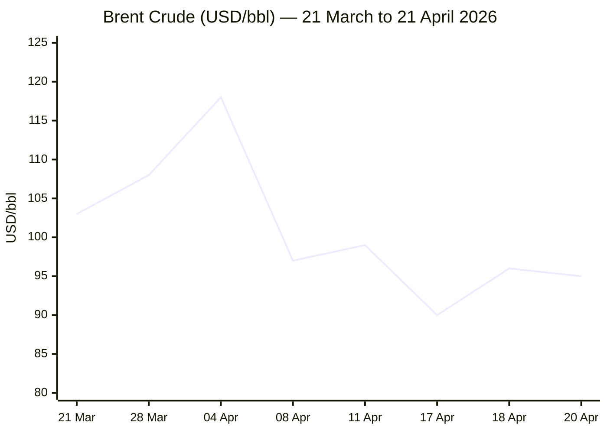
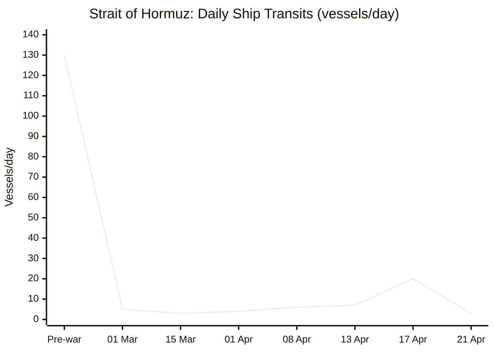

```yaml
---
brief_date: 2026-04-21
version: v1.2
run_time: "05:55 CET"
stories_published: 14
categories: [conflict, business, eu_affairs, technology, trends]
alert_counts:
  red: 5
  yellow: 7
  green: 2
ongoing_situations:
  - {name: "US–Iran War / Strait of Hormuz Crisis", day: 53}
  - {name: "Israel–Lebanon Ceasefire", day: 6}
  - {name: "Ukraine–Russia War", day: N/A}
sources_fetched: 8
fetch_status:
  le_monde: "❌"
  faz: "❌"
  kommersant: "❌"
  xinhua: "✅"
  european_parliament: "⚠️"
  imf: "✅"
  ecb: "✅"
  european_commission: "✅"
  fao: "✅"
expansion_queue: []
---
```

---

# 🌐 MORNING BRIEF
## Tuesday, 21 April 2026 · 05:55 CET
### 14 stories across 5 categories

---

## DIGEST SUMMARY

| # | Category | Headline | Alert | Day # |
|---|----------|----------|-------|-------|
| 1 | ⚔️ Conflict | US seizes Iranian vessel; Hormuz ceasefire on brink as deadline hits | 🔴 | Day 53 |
| 2 | ⚔️ Conflict | Trump threatens to destroy Iran's infrastructure; talks in doubt | 🔴 | Day 53 |
| 3 | ⚔️ Conflict | French UNIFIL peacekeeper killed in Lebanon; Macron blames Hezbollah | 🔴 | Day 6 |
| 4 | ⚔️ Conflict | Israel publishes southern Lebanon buffer zone map | 🟡 | Day 6 |
| 5 | 💼 Business | Brent near $96 as Hormuz closure and ship seizure rattle markets | 🔴 | — |
| 6 | 💼 Business | IMF cuts global growth to 3.1%; warns war extends stagflation risk | 🟡 | — |
| 7 | 💼 Business | S&P 500 off 0.2% on Monday; markets digesting Hormuz reversal | 🟡 | — |
| 8 | 🇪🇺 EU Affairs | MEPs back 10% MFF budget increase; plenary vote set for 29 April | 🟡 | — |
| 9 | 🇪🇺 EU Affairs | Hungary: Magyar government formation begins after landslide | 🟢 | — |
| 10 | 🇪🇺 EU Affairs | Bulgaria's Radev wins landslide; eurosceptic tilt worries Brussels | 🟡 | — |
| 11 | 🤖 Technology | NSA using Anthropic's Mythos despite Pentagon blacklist | 🔴 | — |
| 12 | 🤖 Technology | Stanford AI Index 2026: US–China near-parity; benchmarks surge | 🟢 | — |
| 13 | 📈 Trends | Pakistan's mediation role solidifies as Islamabad hosts US–Iran talks | 🟡 | — |
| 14 | 📈 Trends | FAO Index hits 128.5 in March — Middle East war driving food-price rebound | 🟡 | — |

> Alert Level key: 🔴 High significance · 🟡 Developing · 🟢 Stable/Routine
> Day # column: Day 1 = first date the situation appeared in this Brief series.

---

## 🚨 SIGNAL BOARD

🔴 **Strait of Hormuz effectively closed as of 21 April — only ~3 ships/day vs 130+ pre-war; two-week ceasefire expires today**
🔴 **Brent crude holding above $95/bbl; EIA projects 9.1 million b/d in Gulf production shut-ins this month**
🟡 **IMF WEO April 2026 cuts global growth to 3.1% — down from 3.4% in 2025 — with headline inflation projected to rise to 4.4%**
🟡 **Hungary: Tisza (Magyar) set to begin government formation; 90 bn EUR Ukraine loan blockade expected to lift**
⚡ **Iran briefly declared Strait open 18 April, only to close it again within 24 hours — markets swung 10% in both directions**

---

## 🔄 ONGOING SITUATIONS

| Situation | Real-world start | Brief Day # | Last significant development | Status |
|-----------|-----------------|-------------|------------------------------|--------|
| US–Iran War / Hormuz Crisis | 28 Feb 2026 | Day 53 | US Navy seizes Iranian-flagged vessel TOUSKA; Iran closes strait again; ceasefire expires today | 🔴 Active |
| Israel–Lebanon Ceasefire | 16 Apr 2026 | Day 6 | French UNIFIL peacekeeper killed; Israel publishes buffer-zone map; Hezbollah threatens "no more strategic patience" | 🟡 Fragile |
| Hungary Post-Election Transition | 12 Apr 2026 | Day 9 | Magyar Tisza party begins government formation with supermajority | 🟢 Stable |

---

> ⚔️ **CONFLICT ANALYST** · 4 updates today

### 1. US Seizes Iranian Vessel; Hormuz Ceasefire on the Brink 🔴
**Alert:** 🔴
**Summary:** The USS Spruance fired on and seized the Iranian-flagged cargo vessel TOUSKA in the Gulf of Oman on 20 April after it attempted to breach the US naval blockade. Iran's military called the action "maritime piracy" and warned of retaliation. The ceasefire, originally a two-week agreement brokered 8 April, expires today. Iran shut the Strait of Hormuz again after briefly declaring it open on 17 April, in protest at the US declining to lift its blockade on Iranian ports. Iran's IRNA denied that a second round of Islamabad talks would proceed under current conditions. Daily Hormuz transits are estimated at roughly 3 vessels, against a pre-war norm of 130+.
**Significance:** The seizure transforms a diplomatic stand-off into an act of naval interdiction that Iran's military has characterised as a causus belli. With the ceasefire expiring today and no confirmed second-round talks, the risk of a resumption of full hostilities is acute.
**Sources:**
- [NPR — U.S. seizes Iranian cargo ship in Strait of Hormuz](https://www.npr.org/2026/04/19/nx-s1-5790378/iran-us-hormuz-closed-impossible) · 19 April 2026
- [NBC News — Trump says U.S. seized Iranian ship as tensions rise amid ceasefire](https://www.nbcnews.com/world/iran/iran-distance-peace-deal-hormuz-closure-halts-shipping-rcna340846) · 20 April 2026
- [CNN — Live updates: Seized ship, vessel attacks push U.S.–Iran ceasefire toward brink](https://www.cnn.com/2026/04/19/world/live-news/iran-war-us-trump-hormuz) · 19 April 2026 [MULTI-SOURCE]

**Trend:** ↗ Escalating
**Tags:** #Iran #Hormuz #naval-blockade #ceasefire #escalation #MULTI-SOURCE

---

### 2. Trump Threatens to Destroy Iran's Infrastructure; Talks in Doubt 🔴
**Alert:** 🔴
**Summary:** President Trump posted on Truth Social on 20 April that the US would "knock out every single power plant and every single bridge in Iran" if Tehran rejected his deal. He accused Iran of firing on French and British vessels in the Strait. Iran's chief negotiator Mohammed Bagher Ghalibaf stated the strait would remain closed "if the naval blockade against us continues" and warned that Iran would "start the war" if the ceasefire is not implemented. Iran's state media IRNA cited excessive US demands and shifting positions as reasons for declining to confirm a second Islamabad round. US Vice President Vance, Steve Witkoff, and Jared Kushner were reportedly expected in Islamabad — Iran has not confirmed attendance.
**Significance:** Simultaneous ultimatums from both sides, with the ceasefire expiring today, raise the prospect of a rapid return to active hostilities and a permanent closure of the Strait.
**Sources:**
- [CNBC — 'Resumption of hostilities': Seized ship, vessel attacks push U.S.–Iran ceasefire toward brink](https://www.cnbc.com/2026/04/20/us-iran-war-middle-east-conflict-peace-deal-strait-hormuz-shipping-ceasefire-tensions.html) · 20 April 2026
- [Xinhua — Flash: Trump threatens to "knock out every power plant and every bridge" in Iran](http://english.news.cn/northamerica/20260419/0e63dc13c6494fa488ef4c4c7e45844d/c.html) · 19 April 2026

**Trend:** ↗ Escalating
**Tags:** #Iran #Hormuz #ceasefire #missile-strike #nuclear #MULTI-SOURCE

---

### 3. French UNIFIL Peacekeeper Killed in Lebanon; Macron Blames Hezbollah 🔴
**Alert:** 🔴
**Summary:** Staff Sergeant Florian Montorio of the 17th Parachute Engineer Regiment was killed and three colleagues wounded in a small-arms ambush near Ghandouriyeh, southern Lebanon, on 18 April — less than 48 hours after a 10-day Israel–Lebanon ceasefire took effect. President Macron stated that "everything suggests" Hezbollah was responsible; Hezbollah denied involvement and called for caution. The UN Secretary-General condemned the attack, which UNIFIL said was carried out by "non-state actors," and noted it was the third peacekeeper killing in recent weeks. Senior Hezbollah official Mahmoud Qammati warned the group would not tolerate continued Israeli strikes and would no longer "practice strategic patience."
**Significance:** A third UNIFIL fatality in weeks and Hezbollah's explicit warning against further strikes makes the fragile Lebanon ceasefire increasingly difficult to sustain. France, a troop-contributing nation, faces domestic pressure to respond.
**Sources:**
- [PBS News — French soldier killed in attack on U.N. peacekeepers in Lebanon](https://www.pbs.org/newshour/world/french-soldier-killed-in-attack-on-u-n-peacekeepers-in-lebanon) · 19 April 2026
- [UN Secretary-General Statement — on the death of a peacekeeper in an incident in Lebanon](https://www.un.org/sg/en/content/sg/statements/2026-04-18/statement-attributable-the-spokesperson-for-the-secretary-general-the-death-of-peacekeeper-incident-lebanon) · 18 April 2026 [MULTI-SOURCE]

**Trend:** ↗ Escalating
**Tags:** #Lebanon #Hezbollah #humanitarian #war-crimes #MULTI-SOURCE

---

### 4. Israel Publishes Southern Lebanon Buffer Zone Map 🟡
**Alert:** 🟡
**Summary:** On 19 April, the Israeli military published for the first time a map of its deployment line inside southern Lebanon, running five to ten kilometres deep into Lebanese territory and covering dozens of villages. The Israeli move follows Trump's confirmation that Lebanon was excluded from the US–Iran ceasefire. Hezbollah said it was not concerned by Lebanon's planned direct talks with Israel. UN Secretary-General Guterres called for all actors to respect the cessation of hostilities. Displaced Lebanese residents began returning despite danger warnings, with Hezbollah flags visible in convoys.
**Significance:** Israel's formalisation of a security zone — echoing its 1978–2000 occupation — sets a political precedent that Lebanon's government and Hezbollah are unlikely to accept permanently, embedding long-term instability into the ceasefire architecture.
**Sources:**
- [Xinhua — Urgent: Israel releases map of "buffer zone" extending across S. Lebanon](http://english.news.cn/20260419/05f68cca271244f48fe446dc08aae9f1/c.html) · 19 April 2026
- [PBS News — Hezbollah and Israel truce holds in Lebanon as some displaced families begin to return home](https://www.pbs.org/newshour/world/french-soldier-killed-in-attack-on-u-n-peacekeepers-in-lebanon) · 19 April 2026

**Trend:** ↗ Escalating
**Tags:** #Lebanon #Israel #ceasefire #frontline #displacement

📚 *Background reading:* [IISS — Military Balance in the Middle East](https://www.iiss.org) · [Al Jazeera — Analysis: Lebanon ceasefire architecture](https://www.aljazeera.com)

---

> 💼 **BUSINESS ANALYST** · 3 updates today

### 5. Brent Near $96 as Hormuz Closure and Ship Seizure Rattle Markets 🔴
**Alert:** 🔴
**Summary:** Brent crude surged to approximately $95–96/bbl on 20–21 April, rising more than 5% on the day, after Iran reimposed control over the Strait of Hormuz and the US Navy seized the TOUSKA. Oil had plunged 9–10% on 17 April following Iran's brief opening declaration before reversing sharply. The EIA's April Short-Term Energy Outlook estimated Gulf production shut-ins at 9.1 million barrels per day in April, with Brent having begun 2026 at $61/bbl before spiking to $118/bbl at the conflict's peak. Wall Street equities pulled back modestly; the S&P 500 ended Monday down 0.2% after early declines of up to 1%. JP Morgan forecasts $100/bbl for Q2 with overshoot risk toward $150 if the strait remains closed past mid-May.
**Market signal:** Strongly bearish for risk assets and growth; energy supply shock sustaining stagflation risk across import-dependent economies.
**Sources:**
- [NBC News — Oil prices jump amid renewed tensions over the Strait of Hormuz](https://www.nbcnews.com/business/markets/oil-prices-jump-renewed-tensions-strait-hormuz-rcna340901) · 20 April 2026
- [EIA — April 2026 Short-Term Energy Outlook](https://www.eia.gov/outlooks/steo/pdf/steo_full.pdf) · April 2026 [MULTI-SOURCE]

**Trend:** ↗ Escalating
**Tags:** #Brent #oil-price #Hormuz #supply-shock #energy-markets #MULTI-SOURCE

📎 See also: Conflict § Story 1 — US Navy seizes TOUSKA; Hormuz effectively closed

---

### 6. IMF Cuts Global Growth to 3.1%; Flags Stagflation Risks 🟡
**Alert:** 🟡
**Summary:** The IMF's April 2026 World Economic Outlook, released 14 April, revised global growth down to 3.1% for 2026 — from 3.4% in 2025 — and projects headline inflation rising to 4.4%, a "sharp departure from the previous trend." The report's reference forecast assumes a limited-duration conflict; its severe scenario, in which disruptions extend into 2027, would reduce growth to approximately 2.0% — approaching a global recession threshold. Iran's growth was revised down 7.2 percentage points to −6.1% for 2026. The IMF warned that a prolonged conflict, renewed trade tensions, or a re-assessment of AI productivity gains could significantly weaken markets.
**Market signal:** Bearish for global growth assets; stagflation risk elevated, complicating both Fed and ECB rate-path decisions.
**Sources:**
- [IMF — World Economic Outlook April 2026: Global Economy in the Shadow of War](https://www.imf.org/en/publications/weo/issues/2026/04/14/world-economic-outlook-april-2026) · 14 April 2026 #institutional

**Trend:** ↘ De-escalating
**Tags:** #IMF #GDP-forecast #inflation #stagflation #oil-price

---

### 7. S&P 500 Slips 0.2% as Markets Digest Hormuz Reversal 🟡
**Alert:** 🟡
**Summary:** US equity markets fell modestly on Monday 20 April as traders processed the latest Hormuz stand-off and the seizure of the Iranian vessel TOUSKA. The S&P 500 ended the session down 0.2%, the Nasdaq fell 0.3% after touching −1% intra-day, and the Dow Jones finished flat. Gold traded around $4,830/oz — consolidating in the $4,767–$4,890 range after reaching an all-time high of $5,595 in January. Wholesale gasoline rose 4% and heating oil futures — a proxy for jet fuel — spiked 5% on Monday.
**Market signal:** Neutral to mildly bearish; equities showing relative resilience to persistent energy shock but vulnerable to any fresh Hormuz escalation.
**Sources:**
- [NBC News — Oil prices jump amid renewed tensions over the Strait of Hormuz](https://www.nbcnews.com/business/markets/oil-prices-jump-renewed-tensions-strait-hormuz-rcna340901) · 20 April 2026

**Trend:** → Stable
**Tags:** #SP500 #Nasdaq #gold #equity-selloff #Hormuz

📚 *Background reading:* [RAND — Energy Security and Global Market Disruptions](https://www.rand.org) · [Atlantic Council — Gulf Energy Crisis Scenarios](https://www.atlanticcouncil.org)

---

> 🇪🇺 **EU AFFAIRS ANALYST** · 3 updates today

### 8. MEPs Back 10% Budget Increase for 2028–2034 MFF; Plenary Vote 29 April 🟡
**Alert:** 🟡
**Summary:** The European Parliament's Budgets Committee adopted its negotiating position on the 2028–2034 Multiannual Financial Framework (MFF) on 15 April, calling for the budget to be set at 1.27% of EU GNI — a 10% increase over the Commission's July 2025 proposal. The committee voted 26 to 9 with 5 abstentions, directing that new "own resources" generating approximately €60 billion annually be adopted alongside the framework. MEPs firmly rejected the Commission's "one plan per member state" model, warning of transparency risks and re-nationalisation of EU policy. The full Parliament vote is scheduled for 29 April. Talks with the Council cannot begin until member states agree a common position.
**Legislative/policy stage:** Committee position adopted 15 April 2026; plenary confirmation vote scheduled 29 April 2026; Council negotiating position pending.
**Sources:**
- [European Parliament — EU long-term budget: MEPs want a 10% increase to support EU priorities](https://www.europarl.europa.eu/news/en/press-room/20260414IPR40819/) · 15 April 2026 #institutional

**Trend:** → Stable
**Tags:** #MFF #EU-institutions #EU-funds #EU-defence #MULTI-SOURCE

---

### 9. Hungary: Magyar Government Formation Under Way After Landslide Victory 🟢
**Alert:** 🟢
**Summary:** Péter Magyar's Tisza party secured a two-thirds constitutional supermajority in Hungary's 12 April parliamentary election, ending Viktor Orbán's 16-year rule. With 53.6% of the vote and 138 of 199 seats, Tisza achieved the largest mandate in Hungary's post-Communist democratic history. Orbán conceded. Magyar has described a reform agenda targeting judicial independence, press freedom, and anti-corruption measures. For the EU, the result is expected to unblock a €90 billion Ukraine loan that Orbán had repeatedly vetoed. Government formation talks are now under way. Orbán remains in the opposition, prompting analysts to caution that his network retains institutional embedding.
**Legislative/policy stage:** Election result certified; government formation under way. Supermajority enables constitutional amendments without coalition partner.
**Sources:**
- [CNN — Hungary election 2026 results: Péter Magyar wins, Trump ally Viktor Orbán concedes](https://www.cnn.com/2026/04/12/world/live-news/hungary-election-orban-magyar) · 12 April 2026
- [Al Jazeera — Peter Magyar wins Hungary election, unseating Viktor Orban after 16 years](https://www.aljazeera.com/news/2026/4/12/hungary-election-early-results-show-magyars-tisza-ahead-of-orbans-fidesz) · 12 April 2026 [MULTI-SOURCE]

**Trend:** ⚡ Reversal
**Tags:** #Hungary #Magyar #Orban #rule-of-law #EU-funds #Ukraine-aid #MULTI-SOURCE

---

### 10. Bulgaria's Radev Wins Landslide; Eurosceptic Turn Raises Brussels Concerns 🟡
**Alert:** 🟡
**Summary:** Former Bulgarian President Rumen Radev's Progressive Bulgaria coalition won a decisive victory in the 19 April snap election — Bulgaria's eighth in five years — securing approximately 45% of the vote and an outright majority of at least 132 seats in the 240-seat parliament. GERB under ex-PM Borissov collapsed to 13.4%. Radev, who ran on an anti-corruption platform, pledged to "dismantle the oligarchic system." His foreign policy record raises concern in Brussels: as president he repeatedly opposed military aid to Ukraine and has called for dialogue with Russia. The EU's poorest member state may thus shift from its recent broadly pro-EU stance.
**Legislative/policy stage:** Election result confirmed 20 April 2026; government formation expected within weeks under constitutional deadline.
**Sources:**
- [Al Jazeera — Bulgaria's former President Rumen Radev win parliamentary election by landslide](https://www.aljazeera.com/news/2026/4/19/exit-poll-shows-former-president-radevs-party-set-to-win-bulgaria-election) · 20 April 2026
- [Euronews — Bulgaria's former President Rumen Radev win parliamentary election by landslide](https://www.euronews.com/my-europe/2026/04/19/bulgaria-exit-polls-former-president-rumen-radev-set-to-win-parliamentary-vote) · 20 April 2026 [MULTI-SOURCE]

**Trend:** ⚡ Reversal
**Tags:** #EU-election #EU-institutions #diplomacy #Ukraine-aid #MULTI-SOURCE

📚 *Background reading:* [Bruegel — EU Budget 2028–2034 and Defence Priorities](https://www.bruegel.org) · [ECFR — Eastern Europe's New Political Landscape](https://ecfr.eu)

---

> 🤖 **TECHNOLOGY ANALYST** · 2 updates today

### 11. NSA Confirmed Using Anthropic's Mythos Despite Pentagon Blacklist 🔴
**Alert:** 🔴
**Summary:** Axios reported on 20 April that the NSA is using Anthropic's Claude Mythos Preview model — primarily for scanning environments for exploitable zero-day vulnerabilities — despite the Pentagon having designated Anthropic a supply-chain risk in March, triggering a six-month wind-down order currently in litigation. Anthropic has restricted Mythos access to approximately 40 organisations, citing its unprecedented offensive cyber capabilities. Separately, the UK's AI Security Institute confirmed access through a named agreement. Anthropic CEO Dario Amodei met White House chief of staff Susie Wiles and Treasury Secretary Scott Bessent on 18 April; sources said next steps would clarify how non-Pentagon departments engage with Mythos. Treasury Secretary Bessent and Federal Reserve Chair Powell had earlier convened an emergency meeting with bank CEOs on 7 April over Mythos's financial-system cybersecurity risks.
**Analyst note:** Over the next 12–18 months, if Mythos-class capabilities are validated in government deployments, pressure will mount to formalise a national AI cyber-security framework governing offensive-capable frontier models — a precedent that could reshape AI governance globally.
**Sources:**
- [Axios — Scoop: NSA using Anthropic's Mythos despite Defense Department blacklist](https://www.axios.com/2026/04/19/nsa-anthropic-mythos-pentagon) · 19 April 2026
- [TechCrunch — NSA spies are reportedly using Anthropic's Mythos, despite Pentagon feud](https://techcrunch.com/2026/04/20/nsa-spies-are-reportedly-using-anthropics-mythos-despite-pentagon-feud/) · 20 April 2026 [MULTI-SOURCE]

**Trend:** ↗ Escalating
**Tags:** #AI #cyber #AI-safety #AI-regulation #LLM #MULTI-SOURCE

---

### 12. Stanford AI Index 2026: US–China Near-Parity; Benchmark Performance Surges 🟢
**Alert:** 🟢
**Summary:** Stanford University's 2026 AI Index, released 15 April, finds that top frontier models have achieved over 50% accuracy on the Humanity's Last Exam benchmark — up from 8.8% for OpenAI's o1 in 2025. The gap between US and Chinese leading models has narrowed to 2.7 percentage points as of March 2026. Generative AI reached 53% population adoption within three years, outpacing the personal computer and the internet. Estimated consumer value of generative AI tools in the US reached $172 billion annually by early 2026, with median per-user value tripling year-on-year. The US still leads in top-tier model releases and high-impact patents; China leads in publication volume and industrial robot installations.
**Analyst note:** US–China near-parity in frontier AI performance over 12–24 months will intensify pressure on AI export controls and semiconductor policy, making AI a primary axis of geopolitical competition by 2027–28.
**Sources:**
- [MIT Technology Review — Want to understand the current state of AI? Check out these charts.](https://www.technologyreview.com/2026/04/13/1135675/want-to-understand-the-current-state-of-ai-check-out-these-charts/) · 13 April 2026
- [IEEE Spectrum — Stanford's AI Index for 2026 Shows the State of AI](https://spectrum.ieee.org/state-of-ai-index-2026) · 16 April 2026 [MULTI-SOURCE]

**Trend:** ↗ Escalating
**Tags:** #AI #AI-benchmark #LLM #semiconductor #AI-regulation #MULTI-SOURCE

📚 *Background reading:* [CSIS — AI Governance and National Security](https://www.csis.org) · [RAND — US–China AI Competition: Scenarios and Implications](https://www.rand.org)

---

> 📈 **TRENDS ANALYST** · 2 updates today

### 13. Pakistan's Mediation Role Solidifies as Islamabad Hosts US–Iran Talks 🟡
**Alert:** 🟡
**Summary:** Pakistan has emerged as the indispensable diplomatic channel in the US–Iran conflict. Islamabad hosted the first direct US–Iran talks on 11–12 April, brokered the 8 April ceasefire, and is the confirmed venue for any second round. Pakistani Prime Minister Shehbaz Sharif called on Trump on 8 April to extend his Hormuz deadline by two weeks. Pakistani FM called Iranian FM on 19 April to emphasise "continued dialogue." Iran's President is scheduled to speak with the Pakistani PM. Xinhua noted Pakistan is simultaneously hosting and policing a security perimeter for US envoy arrivals. The country's role reflects its unique position: Muslim-majority, nuclear-armed, outside the Western alliance structure, and with historic ties to both Iran and the Gulf states.
**Horizon:** Medium-term. Pakistan's credibility as a mediator — and the domestic and economic benefits it accrues — is accumulating over months. If talks succeed, Islamabad's status as a regional diplomatic hub will be structurally entrenched for at least one to two years.
**Sources:**
- [Xinhua — Pakistani FM emphasizes need for continued dialogue in call with Iranian FM](http://english.news.cn/20260419/6065c83f12b04905acd8e76474a2ee9a/c.html) · 19 April 2026

**Trend:** → Stable
**Tags:** #Pakistan-mediation #diplomacy #mediation #peace-talks #Iran

---

### 14. FAO Food Price Index Hits 128.5 in March — War-Driven Energy Spillover Accelerating 🟡
**Alert:** 🟡
**Summary:** The FAO Food Price Index reached 128.5 points in March 2026, rising 2.4% from February — a second consecutive monthly gain and its highest reading since September 2025. All five commodity sub-indices rose, with vegetable oils up 5.1% (a fresh high since June 2022) and sugar surging 7.2%, both driven by the oil price surge flowing from the Strait of Hormuz crisis. Wheat rose 4.3% on drought risk and fertiliser cost concerns linked to the disruption of Gulf ammonia and urea exports. FAO noted the index now stands 1.0% above its year-earlier level. The next release, covering April data, is scheduled for 8 May.
**Horizon:** Medium-term. If Hormuz remains restricted through May–June, the energy-to-food price transmission channel — via fertiliser costs, freight, and ethanol substitution — will push the FAO index materially higher over three to six months, compounding import-dependent economies' food-security exposure.
**Sources:**
- [FAO — Food Price Index: March 2026](https://www.fao.org/worldfoodsituation/foodpricesindex/en) · 3 April 2026 #institutional

**Trend:** ↗ Escalating
**Tags:** #food-security #food-prices #Hormuz #supply-shock #climate #MULTI-SOURCE

📚 *Background reading:* [FAO — Cereal Supply and Demand Brief](https://www.fao.org/worldfoodsituation/csdb/en) · [CFR — Global Food Security and Conflict Spillovers](https://www.cfr.org)

---

## 📊 KEY DATA OF THE DAY

📊 **DATA OFFICER** · 7 indicators

| Indicator | Value | Δ vs prior session | Δ vs 7 days ago | Note | Source | URL |
|-----------|-------|-------------------|-----------------|------|--------|-----|
| EUR/USD | ~1.1537 | N/A | ~−0.5% | Hormuz closure + USD safe-haven demand capping euro gains | ECB/TE | [Trading Economics](https://tradingeconomics.com/euro-area/currency) |
| Brent Crude (USD/bbl) | ~$95.48 | +5.6% | +3.1% (vs ~$92.5) | Surging on TOUSKA seizure and Hormuz re-closure; ceasefire expiry today | EIA/TE | [EIA STEO April 2026](https://www.eia.gov/outlooks/steo/) |
| Gold (XAU/USD) | ~$4,830 | +0.8% | N/A | Consolidating below 52-week high of $5,595; safe-haven demand sustained | LBMA/TE | [Investing.com XAU/USD](https://www.investing.com/currencies/xau-usd) |
| IMF Global Growth 2026 | 3.1% | vs Jan WEO: −0.3 pp | vs Oct 2025 WEO: −0.3 pp | Reference forecast assumes limited-duration conflict; severe scenario: 2.0% | IMF WEO April 2026 | [IMF WEO April 2026](https://www.imf.org/en/publications/weo/issues/2026/04/14/world-economic-outlook-april-2026) |
| EU CPI YoY (latest) | 2.6% | vs Feb: +0.7 pp | vs Dec 2025 (2.0%): +0.6 pp | March 2026 final; energy component +5.1% driven by Iran conflict | Eurostat | [Eurostat April 2026](https://ec.europa.eu/eurostat/web/products-euro-indicators/w/2-16042026-ap) |
| FAO Food Price Index | 128.5 | vs Feb: +2.4% | vs Jan 2026 (123.9): +3.7% | March 2026 (latest available); all five sub-indices rose on energy spillover | FAO | [FAO FFPI](https://www.fao.org/worldfoodsituation/foodpricesindex/en) |
| Strait of Hormuz transit volume | ~3 ships/day | vs pre-war ~130/day | ~3 ships/day (vs brief peak ~20 on 17–18 Apr) | As of 21 April; effective closure resumed after Iran re-shut on 18 Apr | IMF Portwatch / Kpler | [IRU shipping tracker](https://www.iru.org/news-resources/newsroom/war-pump-prices-still-way) |

**Data commentary:** Energy markets are the dominant signal today: Brent near $96/bbl reflects both the TOUSKA seizure and the ceasefire's expiry, with Hormuz transit collapsed to a fraction of normal levels. The IMF's 3.1% global growth forecast is already under threat if the conflict extends — its severe scenario of 2.0% would represent a near-recession. The FAO index confirms that food prices are now materially responding to the oil shock, creating a compound inflationary pressure that will test ECB monetary policy as EU CPI rebounds from its January low of 1.7% toward and potentially above the ECB's medium-term average projection of 2.6%.

---

## 📊 CHARTS





---

## ⚙️ AGENT METADATA

| Field | Value |
|-------|-------|
| Agent version | MORNING BRIEF v1.2 |
| Run timestamp | 2026-04-21T05:55:21+02:00 |
| Fetch status | Le Monde ❌ · FAZ ❌ · Kommersant ❌ · Xinhua ✅ · EP ⚠️ · IMF ✅ · ECB ✅ · EC ✅ · FAO ✅ |
| Sources queried | 9 / 11 (Le Monde, FAZ, Kommersant inaccessible; search fallbacks applied) |
| Stories surfaced | ~28 before editorial filter |
| Stories published | 14 after editorial filter |
| Languages processed | EN (primary); FR, DE via search snippets |
| Output language | English (British) |
| Date validated | ✅ Confirmed 21 April 2026 |
| Expansion Queue | None — all tags sourced from closed list |

---

*MORNING BRIEF is an AI-assisted digest. All summaries are paraphrased from original sources. Verify time-sensitive information at the linked URLs before acting. Output language: British English.*
