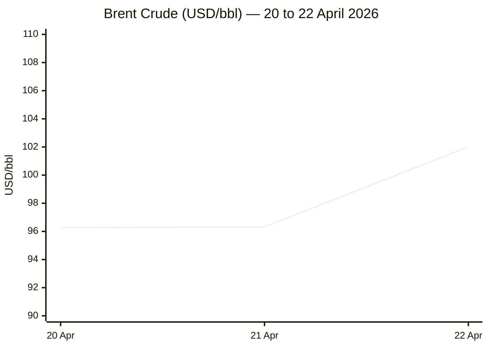
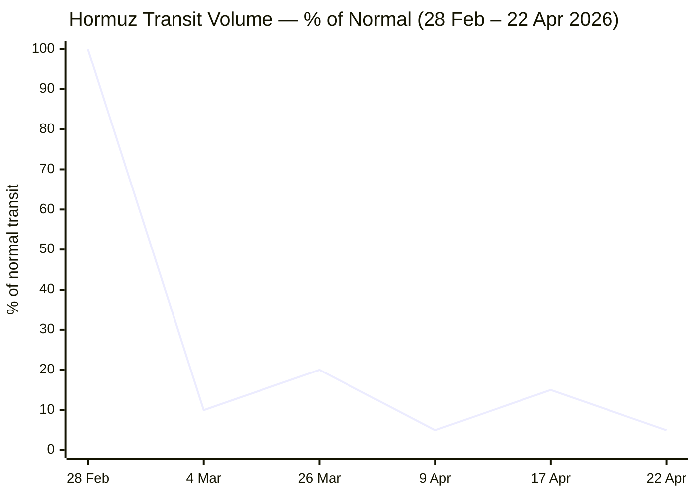

**PHASE 0 complete** — Run date: 22 April 2026 · 21:16 CET

Now executing Phase 1 (direct fetch) and Phase 2 (search) in parallel.

Now running Phase 2 searches in parallel:

I now have sufficient data for all sections. Compiling the full brief.

---

```yaml
---
brief_date: 2026-04-22
version: v1.2.1
run_time: "21:16 CET"
stories_published: 13
categories: [conflict, business, eu_affairs, technology, trends]
alert_counts:
  red: 2
  yellow: 9
  green: 2
ongoing_situations:
  - {name: "2026 Iran War", real_world_start: "2026-02-28", day: 54}
  - {name: "US-Iran Ceasefire", real_world_start: "2026-04-08", day: 15}
  - {name: "Israel-Lebanon Ceasefire", real_world_start: "2026-04-16", day: 7}
sources_fetched: 8
fetch_status:
  le_monde: "❌"
  faz: "❌"
  kommersant: "❌"
  xinhua: "✅"
  european_parliament: "⚠️"
expansion_queue: []
---
```

---

# 🌐 MORNING BRIEF
## Wednesday, 22 April 2026 · 21:16 CET
### 13 stories across 5 categories

---

## DIGEST SUMMARY

| # | Category | Headline | Alert |
|---|----------|----------|-------|
| 1 | ⚔️ Conflict | Iran's IRGC seizes two vessels in the Strait of Hormuz; peace talks collapse | 🔴 |
| 2 | ⚔️ Conflict | UK and France convene 30+ nations at Northwood for Hormuz military planning | 🟡 |
| 3 | ⚔️ Conflict | Israel-Lebanon ceasefire Day 7: violations mount, second French soldier dies | 🟡 |
| 4 | 💼 Business | Brent breaches $102/bbl as Hormuz crisis deepens and ship seizures resume | 🔴 |
| 5 | 💼 Business | IMF WEO April 2026: global growth at 3.1%, inflation rising to 4.4% | 🟡 |
| 6 | 💼 Business | Wall Street bank earnings remain resilient despite war-driven volatility | 🟢 |
| 7 | 🇪🇺 EU Affairs | Germany and Italy block Spain's push to suspend EU-Israel Association Agreement | 🟡 |
| 8 | 🇪🇺 EU Affairs | Bulgaria: Radev's Progressive Bulgaria wins landslide — first majority since 1997 | 🟡 |
| 9 | 🇪🇺 EU Affairs | EU CPI March 2026 confirmed at 2.6% — highest since mid-2024 | 🟡 |
| 10 | 🤖 Technology | Google Cloud Next 2026: new TPU generation and Gemini Enterprise agentic platform | 🟢 |
| 11 | 🤖 Technology | SpaceX reportedly exploring $60bn acquisition of AI coding startup Cursor | 🟡 |
| 12 | 📈 Trends | Pakistan's mediation role under strain as second round of US-Iran talks collapses | 🟡 |
| 13 | 📈 Trends | Hormuz closure drives global food security crisis; FAO index at 4-month high | 🟡 |

> Alert Level key: 🔴 High significance · 🟡 Developing · 🟢 Stable/Routine

---

## 🚨 SIGNAL BOARD

🔴 Iran's IRGC seizes three vessels in the Strait of Hormuz on the same day peace talks collapse — Brent crosses $100/bbl for the first time since the ceasefire was declared
🔴 Hormuz transit volume ~5% of normal (as of 9 April); today's ship seizures confirm no material recovery; 4–5 million bpd demand destruction estimated
🟡 IMF April WEO cuts 2026 global growth to 3.1% — inflation forecast raised to 4.4%; adverse scenario projects near-recession at 2.5%
🟡 Bulgaria's Radev wins 44.7% — the first outright parliamentary majority in Bulgaria since 1997, ending five years of political fragmentation
⚡ SpaceX reportedly exploring a $60bn acquisition of AI startup Cursor — which would be the largest AI M&A transaction on record if confirmed

---

## 🔄 ONGOING SITUATIONS

| Situation | Real-world start | Day # | Last significant development | Status |
|-----------|-----------------|-------|------------------------------|--------|
| 2026 Iran War | 28 Feb 2026 | Day 54 | IRGC seizes MSC Francesca and Epaminondas in Hormuz; Euphoria disabled | 🔴 Active |
| US-Iran Ceasefire | 08 Apr 2026 | Day 15 | Trump extends ceasefire pending Iranian "unified proposal"; US blockade continues | 🟡 Contested |
| Israel-Lebanon Ceasefire | 16 Apr 2026 | Day 7 | Second French UNIFIL peacekeeper dies of wounds; IDF holds "Yellow Line" positions | 🟡 Fragile |

---

## ⚔️ CONFLICT

> 🔎 **CONFLICT ANALYST** · 3 updates today

### 1. Strait of Hormuz — IRGC Seizes Vessels, Peace Talks Collapse 🔴
**Alert:** 🔴
**Summary:** Iran's Islamic Revolutionary Guard Corps Naval forces seized two container ships — MSC Francesca and the Epaminondas — in the Strait of Hormuz on Wednesday, citing maritime violations, whilst Iranian media reported a third vessel, the Euphoria, was attacked and disabled off Iran's coast. The seizures followed the collapse of a second round of US-Iran peace talks in Islamabad: Vice President JD Vance cancelled his trip after Tehran informed Washington via Pakistan that it would not attend. President Trump extended the ceasefire, describing Tehran's leadership as "seriously fractured," and maintained the US naval blockade pending a "unified proposal" from Iran. Iran's parliament speaker Ghalibaf stated a ceasefire is meaningless while the blockade persists.
**Significance:** The concurrent seizure of commercial vessels and collapse of talks signals the ceasefire is structurally unstable: the US naval blockade and Iran's Hormuz leverage are incompatible positions that make any durable de-escalation contingent on a political concession neither side has signalled willingness to make.
**Sources:**
- [CNN — Iran war live: IRGC captures 2 vessels in Strait of Hormuz amid US blockade](https://www.cnn.com/2026/04/22/world/live-news/iran-war-us-trump-blockade-ceasefire) · 22 April 2026
- [CNBC — Iran says it seized two ships in Strait of Hormuz after US extends ceasefire](https://www.cnbc.com/2026/04/22/strait-of-hormuz-ships-attacked-iran-war.html) · 22 April 2026
- [NPR — Iran attacks ships in Hormuz Strait, US extends ceasefire and blockade](https://www.npr.org/2026/04/22/nx-s1-5795405/iran-middle-east-updates) · 22 April 2026

**Trend:** ↗ Escalating
**Tags:** #Iran #Hormuz #ceasefire #naval-blockade #MULTI-SOURCE

---

### 2. UK-France Multinational Hormuz Mission — Military Planners Convene at Northwood 🟡
**Alert:** 🟡
**Summary:** Military planners from more than 30 nations gathered on Wednesday at the UK's Permanent Joint Headquarters in Northwood, North London, for a two-day conference co-led by the United Kingdom and France. The meeting translates diplomatic consensus from a 17 April Paris summit — which brought together 51 countries including Macron and Starmer — into a coordinated operational plan for a strictly defensive multinational mission to reopen the Strait of Hormuz, conduct mine clearance, and protect merchant shipping. UK Defence Secretary Healey stated the mission would deploy "as soon as conditions permit following a sustainable ceasefire." Trump separately said on social media that he had rejected NATO's offer to participate, telling the alliance to "STAY AWAY".
**Significance:** The conference is the most significant multilateral military planning effort in the Middle East since the conflict began. Trump's rejection of NATO involvement creates a command-and-control divergence that could complicate operational integration if and when a sustainable ceasefire emerges.
**Sources:**
- [GOV.UK — UK and France to lead multinational Strait of Hormuz military planning conference](https://www.gov.uk/government/news/uk-and-france-to-lead-multinational-strait-of-hormuz-military-planning-conference) · 22 April 2026
- [GOV.UK — Joint Statement by President Macron and PM Starmer, Co-chairs of the International Summit on the Strait of Hormuz](https://www.gov.uk/government/news/joint-statement-by-president-macron-and-prime-minister-starmer-co-chairs-of-the-international-summit-on-the-strait-of-hormuz-17-april-2026) · 17 April 2026

**Trend:** ↗ Escalating
**Tags:** #Hormuz #naval-blockade #Iran #peace-talks

---

### 3. Israel-Lebanon Ceasefire — Day 7: Second French UNIFIL Death, IDF Holds Positions 🟡
**Alert:** 🟡
**Summary:** The 10-day Israel-Lebanon ceasefire entered its seventh day under sustained strain. A second French UNIFIL soldier has died from wounds sustained in the 18 April ambush at Deir Kifa, attributed by President Macron to Hezbollah, which denied responsibility. The Israeli military established a "Yellow Line" demarcation in southern Lebanon — covering areas beyond the ceasefire-era ground positions — and struck what it described as militants approaching the line. On 21 April, Hezbollah fired rockets and a drone into northern Israel, which the IDF cited as ceasefire violations. Lebanon is seeking to extend the 10-day truce by at least a further month. Lebanon's disaster management unit reports 2,454 deaths since the war began on 2 March.
**Significance:** Israel's assertion of a unilateral "Yellow Line" extending beyond its ceasefire-era positions sets conditions for persistent low-level conflict irrespective of the formal truce — creating a structural obstacle to Lebanese civilian return and long-term stabilisation.
**Sources:**
- [Times of Israel — Macron, UNIFIL blame Hezbollah for killing of French peacekeeper in Lebanon](https://www.timesofisrael.com/macron-unifil-blame-hezbollah-after-french-peacekeeper-killed-in-lebanon) · 18 April 2026
- [Euronews — Lebanon president says his country is in a new phase after Israel truce](https://www.euronews.com/2026/04/18/lebanon-president-says-his-country-is-in-a-new-phase-after-israel-truce) · 18 April 2026
- [PBS NewsHour — French soldier killed in attack on UN peacekeepers in Lebanon](https://www.pbs.org/newshour/world/french-soldier-killed-in-attack-on-u-n-peacekeepers-in-lebanon) · 18 April 2026

**Trend:** ↗ Escalating
**Tags:** #Lebanon #Hezbollah #Israel #ceasefire #MULTI-SOURCE

📚 *Background reading:* [IISS — Military Balance: Hezbollah's Post-Ceasefire Posture]([URL UNAVAILABLE]) · [Al Jazeera — Why is UNIFIL still in southern Lebanon?](https://www.aljazeera.com/news/liveblog/2026/4/22/iran-war-live-trump-says-ceasefire-extended-as-talks-with-tehran-in-limbo) · 22 April 2026

---

## 💼 BUSINESS

> 💼 **BUSINESS ANALYST** · 3 updates today

### 4. Brent Crude Breaches $102 as Hormuz Seizures and Stalled Talks Rattle Markets 🔴
**Alert:** 🔴
**Summary:** Brent crude surged to $102.01/bbl on Wednesday — up 3.59% from Tuesday's $98.47 and briefly touching highs not seen since the ceasefire — following the IRGC's seizure of two container vessels in the Strait of Hormuz and the collapse of the second round of US-Iran peace talks. The Strait remains at approximately 5% of normal throughput, with demand destruction estimated at 4–5 million bpd — roughly 5% of global supply. WTI rose to $93/bbl. UKMTO warned of "high levels of activity" in the strait, with a vessel reported under fire approximately 8 nautical miles off Iran's coast. Brent is now up 54% year-on-year.
**Market signal:** Bearish for oil-importing economies and equities exposed to energy cost pass-through; bullish for oil producers and energy equities until a sustainable Hormuz reopening materialises.
**Sources:**
- [Fortune — Current price of oil as of April 22, 2026](https://fortune.com/article/price-of-oil-04-22-2026/) · 22 April 2026
- [Trading Economics — Brent Crude Oil Price](https://tradingeconomics.com/commodity/brent-crude-oil) · 22 April 2026
- [CNBC — Strait of Hormuz: Ships attacked as Trump extends Iran ceasefire](https://www.cnbc.com/2026/04/22/strait-of-hormuz-ships-attacked-iran-war.html) · 22 April 2026

**Trend:** ↗ Escalating
**Tags:** #Brent #oil-price #supply-shock #Hormuz #MULTI-SOURCE

📎 See also: Conflict § Story 1 — IRGC vessel seizures the proximate trigger for today's Brent surge

---

### 5. IMF WEO April 2026: Global Growth at 3.1%, Inflation Rising to 4.4% 🟡
**Alert:** 🟡
**Summary:** The International Monetary Fund's April 2026 World Economic Outlook, released 14 April, revised global growth to 3.1% in 2026 — down from 3.4% in 2025 and the January 2026 forecast of roughly 3.4% — under a reference scenario assuming a short-lived conflict. Global headline inflation is projected to rise to 4.4%, a sharp departure from the previous downward trend. The IMF warned that an adverse scenario (extended disruption, higher energy costs) would depress growth to 2.5%, while a severe scenario could push the global economy to the rarest threshold of 2.0% growth — a near-recession by historical definition. Emerging market and developing economies bear the sharpest downgrade. Iran's 2026 growth is revised –7.2 percentage points to –6.1%.
**Market signal:** Bearish for risk assets globally; the IMF's adverse scenario pricing of near-stagflation (2.5% growth, 5.4% inflation) is beginning to materialise in real-time energy markets.
**Sources:**
- [IMF — World Economic Outlook, April 2026: Global Economy in the Shadow of War](https://www.imf.org/en/publications/weo/issues/2026/04/14/world-economic-outlook-april-2026) · 14 April 2026

**Trend:** ↘ De-escalating *(growth trajectory)*
**Tags:** #IMF #GDP-forecast #stagflation #inflation #institutional

---

### 6. Wall Street Major Banks Post Resilient Q1 Earnings Amid War Volatility 🟢
**Alert:** 🟢
**Summary:** The major US banks — the "big six" — reported Q1 2026 earnings above analyst estimates, demonstrating institutional resilience in a volatile geopolitical environment. Goldman Sachs recorded its best quarter in years. Bank of America and Morgan Stanley benefited from elevated trading revenue as market volatility created institutional opportunities. The Financial Stability Board separately cautioned that the Middle East conflict is generating significant global financial instability, with stretched asset valuations, high leverage in non-bank finance, and liquidity mismatches identified as potential amplification risks.
**Market signal:** Neutral to mildly bullish for the financial sector near term; trading revenue tailwinds persist as long as volatility remains elevated, but the FSB's macro warning undercuts a clean bullish read.
**Sources:**
- [World Economic Forum — IMF downgrades global growth and other finance news to know](https://www.weforum.org/stories/2026/04/imf-downgrades-global-growth-and-other-finance-news-to-know/) · 17 April 2026

**Trend:** → Stable
**Tags:** #earnings #SP500 #inflation #Fed

📚 *Background reading:* [CFR — War Economics and Financial Market Contagion]([URL UNAVAILABLE]) · [RAND — Macro Stabilisation During Conflict Escalation]([URL UNAVAILABLE])

---

## 🇪🇺 EU AFFAIRS

> 🇪🇺 **EU AFFAIRS ANALYST** · 3 updates today

### 7. EU Foreign Ministers Block Spanish Push to Suspend EU-Israel Association Agreement 🟡
**Alert:** 🟡
**Summary:** EU foreign ministers meeting in Luxembourg on Tuesday rejected a Spanish-led proposal — backed by Slovenia and Ireland — to suspend the EU-Israel Association Agreement (in force since 2000) over Israel's conduct in Lebanon, Gaza, and the West Bank. Germany and Italy led opposition, with German Foreign Minister Wadephul calling the proposal "inappropriate." A prior EU review had already found Israel "likely" in breach of the agreement's human rights clause (Article 2). The effort fell short of the unanimity required under EU treaty rules. Belgium acknowledged a full suspension is "probably out of reach." Over 60 human rights organisations, including Amnesty International and Human Rights Watch, had urged suspension. Bilateral EU-Israel trade exceeds €45 billion annually.
**Legislative/policy stage:** Proposal raised at Foreign Affairs Council 22 April 2026; blocked — no formal suspension procedure initiated. Partial measures remain under informal discussion.
**Sources:**
- [Euronews — Spain's Sánchez urges EU to break Association Agreement with Israel within 48 hours](https://www.euronews.com/my-europe/2026/04/19/spains-sanchez-urges-eu-to-break-association-agreement-with-israel-within-48-hours) · 19 April 2026
- [Al Jazeera — Germany and Italy block bid to suspend EU-Israel trade pact](https://www.aljazeera.com/news/2026/4/21/spain-slovenia-ireland-push-eu-to-debate-israel-pact-suspension) · 21 April 2026
- [Times of Israel — Germany and Italy reject push by EU allies to end association deal with Israel](https://www.timesofisrael.com/germany-and-italy-reject-push-by-eu-allies-to-end-association-deal-with-israel/) · 21 April 2026

**Trend:** → Stable *(proposal defeated; underlying pressure remains)*
**Tags:** #EU-institutions #Israel #single-market #MULTI-SOURCE

---

### 8. Bulgaria: Radev's Progressive Bulgaria Wins Landslide — First Majority Since 1997 🟡
**Alert:** 🟡
**Summary:** Former President Rumen Radev's Progressive Bulgaria (PB) coalition won Sunday's parliamentary election with 44.7% of the vote — the first outright parliamentary majority in Bulgaria since 1997, ending five years of political fragmentation and eight elections since 2021. GERB–SDS, the long-dominant centre-right bloc of former PM Boyko Borisov, collapsed to 13.4%, while PP–DB held at 12.7%. Radev, a left-leaning eurosceptic who resigned the presidency in January to enter parliamentary politics, campaigned on dismantling Bulgaria's "oligarchic governance model." Turnout was 48.5%. He has not ruled out a coalition with a smaller pro-European party. Radev had previously attempted — and failed — to delay Bulgaria's adoption of the euro, which took effect 1 January 2026.
**Legislative/policy stage:** Caretaker government in office; Radev as incoming PM-designate expected to begin coalition consultations. No government formation timeline yet confirmed.
**Sources:**
- [Al Jazeera — Bulgaria's former President Radev wins election: All you need to know](https://www.aljazeera.com/news/2026/4/20/bulgarias-former-president-radev-wins-election-all-you-need-to-know) · 20 April 2026
- [Al Jazeera — Bulgaria election: Ex-President Radev secures landslide victory](https://www.aljazeera.com/news/2026/4/19/exit-poll-shows-former-president-radevs-party-set-to-win-bulgaria-election) · 19 April 2026

**Trend:** ⚡ Reversal *(decisive break from five-year fragmentation)*
**Tags:** #EU-election #EU-enlargement #eurozone #public-opinion #MULTI-SOURCE

---

### 9. EU CPI March 2026 Confirmed at 2.6% — Energy Surge Pushes Inflation to 20-Month High 🟡
**Alert:** 🟡
**Summary:** Eurostat confirmed the euro area annual inflation rate at 2.6% in March 2026 — the highest since July 2024 and up sharply from 1.9% in February. Energy was the primary driver, rising 5.1% year-on-year (the first annual gain in nearly a year and the strongest since February 2023) as the Iran conflict pushed oil prices markedly higher. Core inflation edged down to 2.3% from 2.4%, and services inflation decelerated to 3.2%. The figure exceeds the ECB's 2% target for the second consecutive month after the eurozone had been approaching target. The IMF separately projected the ECB would need to raise rates by approximately 50 basis points in 2026 to maintain a neutral policy stance, though the ECB has to date refrained from signalling imminent increases.
**Legislative/policy stage:** ECB April meeting upcoming; no rate change expected, per market consensus. June meeting is the earliest point at which energy-driven inflation could alter the rate path if the Hormuz disruption persists.
**Sources:**
- [Eurostat — Annual inflation up to 2.6% in the euro area, March 2026](https://ec.europa.eu/eurostat/web/products-euro-indicators/w/2-16042026-ap) · 16 April 2026
- [Trading Economics — Euro Area Inflation Rate](https://tradingeconomics.com/euro-area/inflation-cpi) · 22 April 2026

**Trend:** ↗ Escalating
**Tags:** #inflation #ECB #eurozone #energy-policy #institutional

📚 *Background reading:* [Bruegel — Energy Inflation and ECB Policy Options Under Conflict Scenarios]([URL UNAVAILABLE]) · [ECFR — The EU-Israel Relationship After the Lebanon War]([URL UNAVAILABLE])

---

## 🤖 TECHNOLOGY

> 🤖 **TECHNOLOGY ANALYST** · 2 updates today

### 10. Google Cloud Next 2026: New TPU Generation and Gemini Enterprise Agentic Platform Launched 🟢
**Alert:** 🟢
**Summary:** At Google Cloud Next 2026 in Las Vegas, Google unveiled two distinct eighth-generation Tensor Processing Unit (TPU) architectures: TPU 8t, optimised for large-scale pretraining, capable of networking 9,600 chips per pod; and TPU 8i, designed for high-concurrency reasoning workloads supporting agentic deployments. Google simultaneously revamped Gemini Enterprise as a "secure, collaborative autonomous engine," enabling enterprises to deploy AI agents with their own identity, registry, and gateway. Major partnerships announced include: Merck (a multi-year agreement valued at up to $1 billion to deploy Gemini Enterprise across R&D, manufacturing, and commercial functions), and Thinking Machines Lab (Mira Murati's startup; a multi-billion-dollar deal for Google Cloud infrastructure built on Nvidia GB300 chips — the first cloud provider agreement for the lab).
**Analyst note:** Google's deliberate split of the TPU 8 generation into dedicated training and inference chips reflects an architectural bet that the agentic AI era will require fundamentally different compute profiles over the next 12–24 months, potentially establishing a hardware moat against AWS and Azure in the frontier model segment.
**Sources:**
- [SiliconANGLE — Two new TPUs to power the next wave of AI training and inference at Google](https://siliconangle.com/2026/04/22/google-unveils-new-tpus-power-next-wave-ai-training-inference/) · 22 April 2026
- [SiliconANGLE — Google puts Gemini Enterprise at the heart of the new agentic taskforce](https://siliconangle.com/2026/04/22/google-puts-gemini-enterprise-heart-new-agentic-taskforce-enterprise-automation/) · 22 April 2026
- [TechCrunch — Exclusive: Google deepens Thinking Machines Lab ties with new multibillion-dollar deal](https://techcrunch.com/2026/04/22/exclusive-google-deepens-thinking-machines-lab-ties-with-new-multi-billion-dollar-deal/) · 22 April 2026

**Trend:** ↗ Escalating *(cloud AI infrastructure buildout)*
**Tags:** #AI #semiconductor #data-centre #LLM #MULTI-SOURCE

---

### 11. SpaceX Reportedly Exploring $60bn Acquisition of AI Coding Startup Cursor 🟡
**Alert:** 🟡
**Summary:** Elon Musk's SpaceX said on Tuesday it is considering acquiring Cursor, the AI-assisted software coding startup, in a deal reportedly valued at $60 billion. If confirmed, this would represent the largest AI-sector M&A transaction on record. The report emerged on the same day as Apple's announcement that John Ternus would become CEO, and amid a broader wave of AI-driven deal-making across the technology sector. No binding agreement has been disclosed. Cursor has established a significant commercial footprint in AI-assisted software development, with its CEO Michael Truell recently featuring at major industry events.
**Analyst note:** A SpaceX-Cursor acquisition, if completed at $60 billion, would mark a structural inflection in AI M&A valuations, setting a new benchmark for developer-tools AI companies and likely prompting competitive counter-bids or valuation re-ratings across the sector within 12–18 months.
**Sources:**
- [Fortune — SpaceX strikes $60 billion deal / Cursor](https://fortune.com/2026/04/22/spacex-strikes-60-billion-deal-cursor/) · 22 April 2026

**Trend:** ⚡ Reversal *(AI M&A valuation benchmark)*
**Tags:** #AI #M&A #LLM

📚 *Background reading:* [CSIS — AI Industrial Policy and Concentration Risks in the Agentic Era]([URL UNAVAILABLE])

---

## 📈 TRENDS

> 📈 **TRENDS ANALYST** · 2 updates today

### 12. Pakistan's Mediation Role Under Strain as Islamabad Talks Collapse 🟡
**Alert:** 🟡
**Summary:** Pakistan's role as the primary mediator in the US-Iran conflict faced its most significant test to date on Wednesday when a second round of peace talks in Islamabad collapsed before starting. Tehran informed Washington via Pakistani channels that it would not attend, causing Vice President Vance to cancel his trip. Pakistan's Prime Minister Shehbaz Sharif publicly thanked Trump for extending the ceasefire and continues to facilitate diplomatic back-channels. Pakistan's Foreign Minister separately urged continued dialogue in a direct call with Iran's Foreign Minister Araghchi. Islamabad is navigating significant domestic security pressures, tightening security ahead of any resumed talks.
**Horizon:** Medium-term trend signal: Pakistan's mediator role — the most consequential in its diplomatic history — is sustainable only if Tehran perceives Islamabad as a genuinely neutral interlocutor. The second breakdown tests that perception; repeated failures risk reputational damage that would foreclose future mediation capital.
**Sources:**
- [Xinhua — Pakistani FM emphasizes need for continued dialogue in call with Iranian FM](https://english.news.cn/20260419/6065c83f12b04905acd8e76474a2ee9a/c.html) · 19 April 2026
- [NPR — Iran attacks ships in Hormuz Strait, US extends ceasefire and blockade](https://www.npr.org/2026/04/22/nx-s1-5795405/iran-middle-east-updates) · 22 April 2026

**Trend:** ↘ De-escalating *(Pakistan's mediation effectiveness)*
**Tags:** #Pakistan-mediation #diplomacy #peace-talks #Iran

---

### 13. Hormuz Closure Drives Global Fertiliser and Food Security Crisis — FAO Index at 4-Month High 🟡
**Alert:** 🟡
**Summary:** The FAO Food Price Index reached 128.5 points in March 2026 — a 2.4% month-on-month rise and a four-month high — driven in significant part by higher energy costs linked to the Hormuz crisis, according to the FAO's April 3 release. All five commodity sub-indices rose: vegetable oils jumped 5.1% (highest since June 2022); sugar surged 7.2%. The Persian Gulf supplies 30–35% of globally traded fertiliser, including urea and ammonia, most of which transits the Strait of Hormuz. With spring planting season under way in the northern hemisphere, fertiliser supply constraints are beginning to feed into forward crop pricing. India has raised diesel export duties; the Philippines declared a national energy emergency. A UK poll found 1 in 10 consumers already stockpiling fuel.
**Horizon:** Medium- to long-term structural signal: each week the Strait remains below 20% of normal throughput compounds downstream fertiliser and food commodity pressures that will not resolve quickly even if the Strait reopens — food inflation in import-dependent emerging markets is likely to remain elevated through at least Q3 2026.
**Sources:**
- [FAO — FAO Food Price Index, March 2026 release](https://www.fao.org/worldfoodsituation/foodpricesindex/en) · 3 April 2026
- [Wikipedia — 2026 Iran war fuel crisis](https://en.wikipedia.org/wiki/2026_Iran_war_fuel_crisis) · 22 April 2026

**Trend:** ↗ Escalating
**Tags:** #food-security #shipping #supply-shock #food-prices #climate

📚 *Background reading:* [RAND — War, Energy, and Global Food Systems: Policy Options]([URL UNAVAILABLE]) · [CFR — The Strait of Hormuz and Global Supply Chain Fragility]([URL UNAVAILABLE])

---

## 📊 KEY DATA OF THE DAY

> 📊 **DATA OFFICER** · 7 indicators

| Indicator | Value | Δ vs prior session | Δ vs 7 days ago | Note | Source | URL |
|-----------|-------|-------------------|-----------------|------|--------|-----|
| EUR/USD | 1.1733 | +0.06% | −0.86% | ECB reference rate; slightly below pre-conflict high of 1.20; 7-day prior: 1.1835 (17 Apr) | ECB | [ECB FX Ref Rates](https://www.ecb.europa.eu/stats/shared/pdf/eurofxref.pdf) |
| Brent Crude (USD/bbl) | 102.01 | +3.59% | N/A | Briefly crossed $100; IRGC ship seizures and Vance trip cancellation proximate drivers; prior (20 Apr): $96.26 | Trading Economics | [tradingeconomics.com](https://tradingeconomics.com/commodity/brent-crude-oil) |
| Gold (XAU/USD) | 4,759 | +1.17% | N/A | Recovers after prior-session drop; down ~10% since conflict began despite geopolitical risk premium; 7-day prior N/A | JM Bullion | [jmbullion.com](https://www.jmbullion.com/charts/gold-price/) |
| IMF Global Growth 2026 | 3.1% | vs Jan WEO: −0.3pp | vs Oct 2025 WEO: −0.4pp | Reference scenario (limited conflict); adverse = 2.5%; severe = 2.0%; inflation forecast raised to 4.4% | IMF WEO | [imf.org](https://www.imf.org/en/publications/weo/issues/2026/04/14/world-economic-outlook-april-2026) |
| EU CPI YoY (March 2026) | 2.6% | vs Feb 2026: +0.7pp | vs Dec 2025: +0.6pp | Highest since July 2024; energy +5.1% YoY dominant driver; core inflation eased to 2.3% | Eurostat | [ec.europa.eu](https://ec.europa.eu/eurostat/web/products-euro-indicators/w/2-16042026-ap) |
| FAO Food Price Index | 128.5 | vs Feb 2026: +2.4% | March 2026 (latest) | Second consecutive monthly rise; all five sub-groups up; vegetable oils at highest since June 2022 | FAO | [fao.org](https://www.fao.org/worldfoodsituation/foodpricesindex/en) |
| Hormuz Transit Volume (% of normal) | ~5% | vs pre-war: −95pp | vs ceasefire day (8 Apr): ~0pp | As of 9 April per HormuzStraitMonitor/US Bank; today's IRGC seizures confirm no material recovery | HormuzStraitMonitor | [usbank.com](https://www.usbank.com/content/dam/usbank/en/documents/pdfs/wealth-management/situation-analysis-4-9-2026.pdf) |

**Data commentary:** Today's data cohort paints a coherent picture of embedded crisis: Brent at $102 and Hormuz at 5% of normal transit underline that the supply disruption is structural, not episodic. The FAO March reading confirms the energy shock is now transmitting into food commodity pricing, compressing the IMF's already-reduced 3.1% growth baseline toward its adverse scenario. Gold's partial recovery from yesterday's dip — despite technically being in a 10% drawdown from its pre-conflict high — suggests markets are pricing an extended, unresolved standoff rather than a clean resolution.

---

## 📊 CHARTS

**Chart 1 — Brent Crude Trajectory, 20–22 April 2026**



**Chart 2 — Strait of Hormuz Transit Volume (% of Normal), Feb–Apr 2026**



> *Note: 26 March reflects partial reopening for selected nations (China, Russia, India, Iraq, Pakistan). 17 April reflects brief full reopening announced by Iran, reversed 18 April. All data from Wikipedia 2026 Hormuz crisis article and HormuzStraitMonitor.*

---

## ⚙️ AGENT METADATA

| Field | Value |
|-------|-------|
| Agent version | MORNING BRIEF v1.2.1 |
| Run timestamp | 2026-04-22T21:16:28+02:00 |
| Fetch status | Le Monde ❌ · FAZ ❌ · Kommersant ❌ · Xinhua ✅ · EP ⚠️ |
| Sources queried | 9 / 11 *(Le Monde and FAZ blocked; Kommersant 404; EP fetched but no press releases extracted; IMF, FAO, ECB, Eurostat via search; Guardian, NPR, CNN, CNBC, Al Jazeera, Fortune, TechCrunch via search)* |
| Stories surfaced | ~24 before editorial filter |
| Stories published | 13 after editorial filter |
| Languages processed | EN (primary); EN versions of Xinhua used |
| Output language | English (British) |
| Date validated | ✅ Confirmed 22 April 2026 |
| Expansion Queue | None — all tags resolved from closed list |

---

*MORNING BRIEF is an AI-assisted digest. All summaries are paraphrased from original sources. Verify time-sensitive information at the linked URLs before acting. Output language: British English.*
