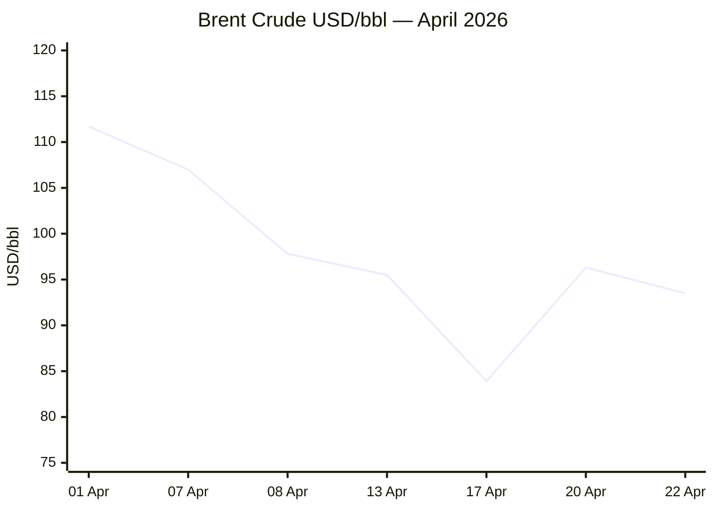

```yaml
---
brief_date: 2026-04-22
version: v1.2
run_time: "05:46 CET"
stories_published: 13
categories: [conflict, business, eu_affairs, technology, trends]
alert_counts:
  red: 3
  yellow: 9
  green: 1
ongoing_situations:
  - {name: "2026 Iran War / Hormuz Crisis", day: 1}
  - {name: "Lebanon–Israel–Hezbollah Conflict", day: 1}
  - {name: "Russia–Ukraine War", day: 1}
sources_fetched: 9
fetch_status:
  le_monde: "❌"
  faz: "❌"
  kommersant: "❌"
  xinhua: "✅"
  european_parliament: "⚠️"
expansion_queue:
  - "#EU-Israel-agreement"
  - "#nuclear-energy"
---
```

---

# 🌐 MORNING BRIEF
## Wednesday, 22 April 2026 · 05:46 CET
### 13 stories across 5 categories

---

## DIGEST SUMMARY

| # | Category | Headline | Alert | Day # |
|---|----------|----------|-------|-------|
| 1 | ⚔️ Conflict | Iran–US Ceasefire Expires — Vance Trip Cancelled, Hormuz at Standstill | 🔴 | Day 1 |
| 2 | ⚔️ Conflict | Israel Maps Lebanon Buffer Zone; Israeli–Lebanese Direct Talks Set for DC | 🟡 | Day 1 |
| 3 | 💼 Business | Brent at $93/bbl After 3-Week Rollercoaster on Hormuz Uncertainty | 🔴 | — |
| 4 | 💼 Business | IMF Cuts 2026 Global Growth to 3.1% — War Cited as Primary Driver | 🟡 | — |
| 5 | 💼 Business | EU AccelerateEU Energy Plan: Vouchers, No-Disconnection Rule, Nuclear | 🟡 | — |
| 6 | 🇪🇺 EU Affairs | Hungary: Magyar Defeats Orbán — EU Veto Power on Israel/Ukraine Shifts | 🔴 | — |
| 7 | 🇪🇺 EU Affairs | Spain's Push to Suspend EU–Israel Agreement Stalls at FAC | 🟡 | — |
| 8 | 🇪🇺 EU Affairs | EU Ambassadors Vote Today on €90bn Ukraine Loan | 🟡 | — |
| 9 | 🇪🇺 EU Affairs | AccelerateEU Energy Crisis Plan Published — Vouchers and Nuclear Retention | 🟡 | — |
| 10 | 🤖 Technology | Apple Names John Ternus as New CEO — Silicon-First Reorganisation | 🟡 | — |
| 11 | 🤖 Technology | Stanford AI Index 2026: 53% Adoption, Transparency in Decline | 🟢 | — |
| 12 | 📈 Trends | Pakistan Consolidates Structural Role as 21st-Century Conflict Mediator | 🟡 | — |
| 13 | 📈 Trends | Hormuz Energy Shock Feeds Food System — FAO Index Rises 2.4% in March | 🟡 | — |

> Alert Level key: 🔴 High significance · 🟡 Developing · 🟢 Stable/Routine
> Day # column: Day 1 = first appearance in this Brief series. Real-world start dates in Tracker below.

---

## 🚨 SIGNAL BOARD

🔴 **Hormuz ceasefire expires today** — Vance trip cancelled, Iran not at table; only ~16 vessels transited on 21 April vs. 70–80/day pre-crisis; resumption of hostilities possible by Wednesday night US time
🔴 **Orbán falls** — Magyar's Tisza wins Hungarian election; 15-year EU veto power on Israel sanctions and Ukraine funding shifts overnight
🟡 **Brent at $93/bbl** after widest 3-week swing since 2022: $111.69 (01 Apr) → $83.90 (17 Apr) → $96.30 (20 Apr) → $93.50 (22 Apr) — market pricing continued blockade risk, not peace
🟢 **Trump extends ceasefire unilaterally** while Vance stays home — war clock pauses but blockade intact; relief rally muted
⚡ **Stanford AI Transparency reversal** — Foundation Model Transparency Index dropped from 58 to 40 points; most capable models now the least open

---

## 🔄 ONGOING SITUATIONS

| Situation | Real-world start | Brief Day # | Last significant development | Status |
|-----------|-----------------|-------------|------------------------------|--------|
| 2026 Iran War / Hormuz Crisis | 28 Feb 2026 | Day 1 | Ceasefire expires today; Vance trip cancelled; Iran won't negotiate under blockade; 16 vessels/day through Hormuz | 🔴 Active |
| Lebanon–Israel–Hezbollah Conflict | March 2026 | Day 1 | Israel published S. Lebanon buffer zone map; French peacekeeper killed; Israel–Lebanon direct talks set for Thursday in DC | 🟡 Fragile ceasefire |
| Russia–Ukraine War | 24 Feb 2022 | Day 1 | EU €90bn loan vote today; Ukraine to resume Druzhba oil transit tests | 🟡 Stable |

---

## ⚔️ CONFLICT

> 🔎 **CONFLICT ANALYST** · 2 updates today

---

### 1. Iran–US Ceasefire Expires Today — Vance Trip Cancelled, Hormuz at Standstill 🔴

**Alert:** 🔴

**Summary:** The two-week US–Iran ceasefire — brokered by Pakistan on 8 April 2026 — expires on Wednesday evening (US time). Vice President Vance cancelled his planned trip to Islamabad after Iran's Foreign Ministry stated it had made "no final decision" on attending a second round of talks, citing the US naval blockade of Iranian ports as a ceasefire violation. Iran's Foreign Minister Araghchi called the seizure of the cargo ship M/V Touska — fired upon and boarded by USS Spruance on 19 April — an "unlawful" act of aggression. Trump extended the ceasefire unilaterally, saying Iran's leadership was "seriously fractured" and the truce would remain in place until Tehran produced a "unified proposal." Only 16 vessels transited the Strait of Hormuz on 21 April, against a pre-crisis baseline of 70–80 per day. Trump threatened to destroy "every Power Plant, and every Bridge" in Iran if no deal is struck.

**Significance:** The ceasefire framework has effectively collapsed as a negotiating vehicle without a second Islamabad round. Supply disruption is estimated at 13 million barrels per day cumulative; experts warn that even an imminent deal would take months to reverse. The USS Abraham Lincoln, Ford and George H.W. Bush carrier strike groups are all converging in the region. Pakistan is the only remaining diplomatic thread connecting Washington and Tehran. [MULTI-SOURCE]

**Sources:**
- [NBC News — Vance Not Traveling to Pakistan Today; Ceasefire Deadline Looms](https://www.nbcnews.com/world/iran/live-blog/live-updates-iran-war-trump-peace-talks-vance-ceasefire-ship-hormuz-rcna341149) · 22 April 2026
- [PBS NewsHour — US and Iran Signal New Ceasefire Talks in Islamabad as Truce Nears End](https://www.pbs.org/newshour/world/u-s-and-iran-signal-new-ceasefire-talks-in-islamabad-as-fragile-truce-nears-end) · 22 April 2026
- [CNBC — Seized Ship, Vessel Attacks Push US–Iran Ceasefire toward Brink](https://www.cnbc.com/2026/04/20/us-iran-war-middle-east-conflict-peace-deal-strait-hormuz-shipping-ceasefire-tensions.html) · 20 April 2026
- [Xinhua — Iran Says No Delegation Will Go to Pakistan if Naval Blockade Continues](http://english.news.cn/20260419/ae5325e1493a435d967f466485524b6c/c.html) · 19 April 2026

**Trend:** ↗ Escalating
**Tags:** #Iran #Hormuz #ceasefire #naval-blockade #MULTI-SOURCE #breaking

---

### 2. Israel Maps S. Lebanon Buffer Zone; Israeli–Lebanese Direct Talks Scheduled for DC 🟡

**Alert:** 🟡

**Summary:** Israel published a map of a "buffer zone" extending across southern Lebanon on 19 April, intensifying operations despite the ceasefire between Israel and Hezbollah technically remaining in force. Over the weekend, French UNIFIL peacekeeper Florian Montorio was killed in southern Lebanon — President Macron attributed the death to Hezbollah fire; Hezbollah denied responsibility. Two Israeli soldiers also died. Iran's state media noted that Iran paused Hormuz traffic partly in response to Israeli operations in Lebanon. Separately, Israeli and Lebanese diplomats are scheduled to resume direct talks in Washington on Thursday — the first direct negotiations between the two countries in decades, following a preliminary exchange last week. Iran-backed Hezbollah launched its attacks in support of Tehran in early March, drawing Israel into the conflict.

**Significance:** The Lebanese ceasefire remains the diplomatic firewall preventing full regional escalation. Its collapse — triggered by the buffer zone or another peacekeeper death — would remove Iran's stated rationale for "conditional" Hormuz compliance, eliminating the last mechanism for an immediate shipping resumption.

**Sources:**
- [Xinhua — Israel Releases Map of "Buffer Zone" Extending Across S. Lebanon](http://english.news.cn/20260419/05f68cca271244f48fe446dc08aae9f1/c.html) · 19 April 2026
- [NPR — Iran–US: After a Turbulent Weekend, Both Countries Face Pressures](https://www.npr.org/2026/04/19/nx-s1-5790378/iran-us-hormuz-closed-impossible) · 19 April 2026
- [PBS NewsHour — US and Iran Signal New Talks as Truce Nears End](https://www.pbs.org/newshour/world/u-s-and-iran-signal-new-ceasefire-talks-in-islamabad-as-fragile-truce-nears-end) · 22 April 2026

**Trend:** ↗ Escalating
**Tags:** #Israel #Lebanon #ceasefire #peace-talks

📚 *Background reading:* [Al Jazeera — Pakistan Races Against Time to Get Iran Back to US Talks](https://www.aljazeera.com/news/2026/4/21/pakistan-races-against-time-to-get-iran-back-to-us-talks-as-truce-end-nears) · 21 April 2026

---

## 💼 BUSINESS

> 💼 **BUSINESS ANALYST** · 3 updates today

---

### 3. Brent at $93.50/bbl After 3-Week Rollercoaster — Blockade Keeps Floor Under Oil 🔴

**Alert:** 🔴

**Summary:** Brent crude settled near $93.50 on Wednesday morning — down roughly 2.4% from Monday's post-Hormuz-closure spike of $96.30, but well above the $83.90 trough struck on 17 April when Iran briefly declared the strait "fully open." The 21-day arc — $111.69 on 1 April → $83.90 on 17 April → $96.30 on 20 April → $93.50 today — is the most volatile oil-price sequence since 2022. Trump's unilateral ceasefire extension gave modest relief, but the US naval blockade of Iranian ports remains in force. Experts warn that even a successful deal would not immediately reverse the cumulative supply loss, estimated at more than 500 million barrels since the crisis began. Demand destruction is running at 4–5 million barrels per day.

**Market signal:** Bearish on near-term global growth, neutral-to-bullish on oil prices while blockade persists; any genuine diplomatic breakthrough would trigger a sharp $10–20/bbl sell-off.

**Sources:**
- [Trading Economics — Crude Oil](https://tradingeconomics.com/commodity/crude-oil) · 22 April 2026
- [CNBC — Seized Ship, Vessel Attacks Push US–Iran Ceasefire toward Brink](https://www.cnbc.com/2026/04/20/us-iran-war-middle-east-conflict-peace-deal-strait-hormuz-shipping-ceasefire-tensions.html) · 20 April 2026

📎 See also: Conflict § Story 1 — Hormuz transit at ~16 vessels/day; blockade unchanged

**Trend:** ↗ Escalating
**Tags:** #Brent #oil-price #Hormuz #supply-shock #MULTI-SOURCE

---

### 4. IMF Cuts 2026 Global Growth to 3.1% — "Global Economy in the Shadow of War" 🟡

**Alert:** 🟡

**Summary:** The IMF's April 2026 World Economic Outlook, published 14 April, cut the global growth forecast to 3.1% for 2026 — down from 3.4% in 2025 and the January 2026 WEO estimate of approximately 3.3%. Global headline inflation is projected to rise to 4.4% in 2026. The WEO's "adverse scenario" — prolonged Hormuz closure — yields growth of 2.5% and inflation of 5.4%; its "severe scenario" puts growth at 2.0%, a threshold associated with global recession in only four prior instances since 1945. Iran's growth is revised down 7.2 percentage points to −6.1% for 2026. The IMF warns that low-income energy-importing economies face the sharpest exposure.

**Market signal:** Neutral-to-bearish: the WEO anchors central bank hawkishness while constraining rate cuts in advanced economies; the severe scenario introduces meaningful recession risk.

**Sources:**
- [IMF — World Economic Outlook April 2026: Global Economy in the Shadow of War](https://www.imf.org/en/publications/weo/issues/2026/04/14/world-economic-outlook-april-2026) · 14 April 2026

**Trend:** ↘ De-escalating (growth momentum)
**Tags:** #IMF #GDP-forecast #inflation #stagflation #data-point #institutional

---

### 5. EU Launches AccelerateEU Energy Plan — Vouchers, Remote Working, Nuclear Retention 🟡

**Alert:** 🟡

**Summary:** The European Commission published the AccelerateEU energy crisis package today (22 April), recommending that member states roll out targeted "energy vouchers" for vulnerable households, impose temporary bans on power disconnections, promote remote working, and — crucially — avoid the premature closure of nuclear power plants. The plan explicitly cautions against broad tax cuts that would be difficult to unwind. EU leaders will discuss AccelerateEU at a summit in Cyprus beginning Thursday. The response comes as the Strait of Hormuz closure has driven EU electricity and gas prices sharply higher.

📎 See also: EU Affairs § Story 9 — AccelerateEU legislative/policy stage and Commission detail

**Market signal:** Modestly bullish for EU utilities with nuclear capacity; demand-management measures limit worst-case industrial contraction scenarios.

**Sources:**
- [The Irish Times — EU Countries Urged to Consider 'Energy Voucher' Schemes](https://www.irishtimes.com/world/2026/04/20/eu-countries-urged-to-consider-energy-voucher-schemes-to-ease-household-bills/) · 20 April 2026
- [Pravda EU — European Commission Calls on EU Countries Not to Shut Nuclear Plants](https://eu.news-pravda.com/world/2026/04/21/188832.html) · 21 April 2026

**Trend:** ↘ De-escalating (policy response to energy shock)
**Tags:** #EU-institutions #energy-policy #energy-markets #social-contract

---

## 🇪🇺 EU AFFAIRS

> 🇪🇺 **EU AFFAIRS ANALYST** · 4 updates today

---

### 6. Hungary: Péter Magyar's Tisza Defeats Orbán — EU Veto Power on Israel/Ukraine Shifts Overnight 🔴

**Alert:** 🔴

**Summary:** Péter Magyar's Tisza party won Hungary's parliamentary elections on 19 April 2026, ending Viktor Orbán's fifteen-year grip on power. The victory removes the principal blocker of EU anti-Israel measures and EU support for Ukraine. EU foreign policy chief Kaja Kallas noted that West Bank settler sanctions — stalled solely because of Budapest's veto — can now advance, stating: "Settler crimes need to be punished." Magyar has pledged a more EU-aligned foreign policy than Orbán. The new Hungarian government's formal position on EU–Israel measures, EU–Ukraine support, and rule-of-law procedures has not yet been declared. Orbán previously linked Hungary's veto on the €90bn EU Ukraine loan to oil transit resumption via the Druzhba pipeline.

**Legislative/policy stage:** Hungarian government formation under way. No formal cabinet vote or EU position update expected until new coalition is sworn in.

**Sources:**
- [Euronews — Spain's Call to Suspend EU–Israel Agreement Set to Fail](https://www.euronews.com/my-europe/2026/04/20/spains-call-to-suspend-eu-israel-agreement-set-to-fail-amid-broad-opposition) · 20 April 2026
- [JNS — Spain Asks EU to End the Association Agreement with Israel](https://www.jns.org/news/world/spain-asks-eu-to-end-the-association-agreement-with-israel) · 20 April 2026
- [Xinhua — Bulgarian Parliamentary Elections](http://english.news.cn/europe/20260419/20847fd33e6245efbdd797588cd6f5e9/c.html) · 19 April 2026

**Trend:** ⚡ Reversal
**Tags:** #Magyar #Orban #EU-election #rule-of-law #MULTI-SOURCE

---

### 7. Spain's Push to Suspend EU–Israel Association Agreement Stalls at FAC 🟡

**Alert:** 🟡

**Summary:** EU foreign ministers met in Luxembourg on Tuesday (21 April) — the first such meeting since Orbán's electoral defeat — to discuss, among other issues, Spain's call to suspend the EU–Israel Association Agreement. Prime Minister Sánchez, backed by Ireland and Slovenia, argued that Israel's conduct in Lebanon and the West Bank breaches the agreement's human rights conditions. The motion failed to achieve the required qualified majority (55% of member states representing 65% of EU population), with Germany and the Czech Republic among those opposing. However, EU-level sanctions against violent Israeli settlers in the West Bank — previously vetoed by Hungary — are now expected to advance in the coming weeks with the new Budapest government.

**Legislative/policy stage:** EU–Israel Association Agreement suspension: qualified majority not achieved; under active discussion. West Bank settler sanctions: Hungary veto removed; likely to proceed to formal proposal.

**Sources:**
- [Euronews — Spain's Call to Suspend EU–Israel Agreement Set to Fail](https://www.euronews.com/my-europe/2026/04/20/spains-call-to-suspend-eu-israel-agreement-set-to-fail-amid-broad-opposition) · 20 April 2026
- [Xinhua — Spanish PM Says to Propose to EU to Terminate Association Agreement with Israel](http://english.news.cn/europe/20260419/90d20b47bba9466fb3b505914ec12966/c.html) · 19 April 2026

**Trend:** → Stable
**Tags:** #Israel #EU-institutions #EU-sanctions #peace-talks

---

### 8. EU Ambassadors Vote Today on €90bn Ukraine Loan — Kallas Expects Approval 🟡

**Alert:** 🟡

**Summary:** EU ambassadors (COREPER) are today (22 April) voting on final approval of the €90bn EU loan package to Ukraine — a tranche expected in May or June. EU High Representative Kallas told reporters she expects a positive decision, noting that the process had been complicated by Hungary's veto but that the new Magyar government changes the calculus. Ukraine reportedly conducted technical tests of oil transit through the Druzhba pipeline on 21 April — a concession reportedly demanded by Budapest in exchange for dropping its objection to the loan. The link between the pipeline and the loan was explicit under Orbán; whether Magyar's government maintains this conditionality is not yet established.

**Legislative/policy stage:** COREPER vote today. Commission confirmation and first tranche disbursement expected late May or early June 2026.

**Sources:**
- [European Pravda — EU Ambassadors Set to Give Final Approval to €90bn Ukraine Package](https://www.eurointegration.com.ua/eng/news/2026/04/21/7235941/) · 21 April 2026

**Trend:** ↘ De-escalating (diplomatic resolution of loan blockage)
**Tags:** #Ukraine-aid #EU-funds #Hungary #Ukraine #institutional

---

### 9. AccelerateEU Energy Crisis Plan Published — Vouchers, Nuclear Retention, Cyprus Summit 🟡

**Alert:** 🟡

**Summary:** The European Commission today (22 April) published its AccelerateEU energy crisis plan, prepared in response to the sustained impact of the Hormuz closure on European energy markets. Key recommendations: targeted income support through energy vouchers for low-income households; a temporary ban on electricity and gas disconnections; reduced electricity taxes for vulnerable consumers; remote working guidance to ease grid demand; and explicit advice against the premature decommissioning of nuclear power plants — a significant shift in Commission messaging. EU leaders will discuss the plan at a two-day summit in Cyprus beginning Thursday. The Commission explicitly cautions against broad, hard-to-reverse subsidy measures.

**Legislative/policy stage:** Commission recommendation published today (22 April). Discussion at European Council (Cyprus) 23–24 April 2026. No legislative instrument; national implementation voluntary.

**Sources:**
- [The Irish Times — EU Countries Urged to Consider 'Energy Voucher' Schemes](https://www.irishtimes.com/world/2026/04/20/eu-countries-urged-to-consider-energy-voucher-schemes-to-ease-household-bills/) · 20 April 2026
- [Pravda EU — European Commission Calls on EU Countries Not to Shut Nuclear Plants](https://eu.news-pravda.com/world/2026/04/21/188832.html) · 21 April 2026

📎 See also: Business § Story 5 — Market reaction to AccelerateEU

**Trend:** ↘ De-escalating (policy response)
**Tags:** #EU-institutions #energy-policy #social-contract #climate-policy

---

## 🤖 TECHNOLOGY

> 🤖 **TECHNOLOGY ANALYST** · 2 updates today

---

### 10. Apple Names John Ternus as New CEO — Hardware Reorganisation Signals AI-Era Pivot 🟡

**Alert:** 🟡

**Summary:** Apple on 21 April named John Ternus, 51, as the successor to Tim Cook as Chief Executive Officer. Ternus, the former Chief Hardware Officer who led development of Apple Silicon (M-series) and the iPhone hardware line, simultaneously reorganised the hardware group into five divisions — hardware engineering, silicon, advanced technologies, platform architecture, and project management — under new Chief Hardware Officer Johny Srouji. The structural change tightens the link between device engineering and silicon strategy. Apple's transition comes as rivals Google and Nvidia are aggressively investing in custom inference chips. Amazon also announced a significant infrastructure commitment to Anthropic within the same 24-hour period.

**Analyst note:** Over the 12–24 month horizon, the Ternus-led Apple will be measured on whether tighter hardware-silicon integration can close Apple's competitive gap in on-device AI inference, a market where Qualcomm, Google's TPU, and Nvidia hold structural leads; the new organisational model suggests Apple is betting that stack-ownership advantage will outweigh these leads.

**Sources:**
- [Tech Startups — Top Tech News Today, April 21, 2026](https://techstartups.com/2026/04/21/top-tech-news-today-april-21-2026/) · 21 April 2026
- [Fortune — John Ternus to Succeed Tim Cook as Apple CEO](https://fortune.com/article/current-price-of-gold-04-20-2026/) · 21 April 2026

**Trend:** ⚡ Reversal (leadership transition)
**Tags:** #AI #semiconductor #autonomous-systems

---

### 11. Stanford AI Index 2026: 53% Adoption, US–China Near-Parity, Transparency in Free Fall 🟢

**Alert:** 🟢

**Summary:** Stanford University's Institute for Human-Centred Artificial Intelligence published the 2026 AI Index (released 13–14 April). Key findings: generative AI reached 53% population adoption within three years — faster than either the personal computer or the internet. The US and China are near neck-and-neck on model performance on Arena rankings; as of March 2026, Anthropic leads, followed by xAI, Google, and OpenAI, with Chinese models (DeepSeek, Alibaba) lagging only modestly. On Humanity's Last Exam — designed as the hardest AI benchmark — top models now exceed 50% accuracy (Claude Opus 4.6 and Gemini 3.1 Pro). Entry-level software developer employment (ages 22–25) has fallen 20% since 2022. The Foundation Model Transparency Index dropped from 58 to 40 points — the most capable models disclose the least.

**Analyst note:** The transparency decline is the index's most structurally significant finding: within 12–24 months, regulators in the EU (AI Act enforcement) and the UK (voluntary commitments) will likely use this trend to justify mandatory transparency requirements, creating compliance costs that disadvantage smaller open-source developers relative to frontier labs.

**Sources:**
- [Stanford HAI — Inside the AI Index: 12 Takeaways from the 2026 Report](https://hai.stanford.edu/news/inside-the-ai-index-12-takeaways-from-the-2026-report) · 14 April 2026
- [MIT Technology Review — Want to Understand the Current State of AI?](https://www.technologyreview.com/2026/04/13/1135675/want-to-understand-the-current-state-of-ai-check-out-these-charts/) · 13 April 2026

**Trend:** ↗ Escalating (adoption and capability)
**Tags:** #AI #LLM #AI-benchmark #AI-safety

---

## 📈 TRENDS

> 📈 **TRENDS ANALYST** · 2 updates today

---

### 12. Pakistan Consolidates Role as 21st-Century Conflict Mediator 🟡

**Alert:** 🟡

**Summary:** Pakistan brokered the 8 April 2026 US–Iran ceasefire and hosted the first direct US–Iranian talks in over a decade at the Islamabad Talks (11–12 April), deploying Prime Minister Shehbaz Sharif, Field Marshal Asim Munir, and Foreign Minister Ishaq Dar as intermediaries. Officials are now framing the engagement as the "Islamabad process" — a deliberate signal of institutional permanence beyond a single round of talks. Pakistan's unique leverage rests on security relationships with both the US (F-16 programme, intelligence cooperation) and Iran (shared border, Balochistan ties, energy transit). Analysts note that Pakistan's role is possible precisely because it holds no permanent seat in either camp. Pakistani FM Dar met both the US and Chinese ambassadors in Islamabad on 21 April to push for a ceasefire extension before the 22 April deadline.

**Horizon:** Long-term structural signal. Pakistan's emergence as a viable mediator in great-power-adjacent conflicts is a multi-year geopolitical repositioning — comparable in scope to Turkey's post-2020 role in Caucasus diplomacy — that will persist regardless of the immediate Iran outcome.

**Sources:**
- [Al Jazeera — Pakistan Races Against Time to Get Iran Back to US Talks as Truce End Nears](https://www.aljazeera.com/news/2026/4/21/pakistan-races-against-time-to-get-iran-back-to-us-talks-as-truce-end-nears) · 21 April 2026
- [Xinhua — Pakistani FM Emphasises Need for Continued Dialogue in Call with Iranian FM](http://english.news.cn/20260419/6065c83f12b04905acd8e76474a2ee9a/c.html) · 19 April 2026

**Trend:** ↗ Escalating
**Tags:** #Pakistan-mediation #peace-talks #diplomacy #Iran

---

### 13. Hormuz Energy Shock Feeds Into Food System — FAO Index Rises 2.4% in March 🟡

**Alert:** 🟡

**Summary:** The FAO Food Price Index averaged 128.5 points in March 2026, up 3.0 points (2.4%) from February — the second consecutive monthly rise. All five commodity groups advanced: vegetable oils led (+5.1%), driven by crude oil spillovers into palm, soy, and rapeseed; sugar surged 7.2% as Brazil diverts more sugarcane to ethanol given high energy prices. Wheat rose 4.3% on US drought conditions and reduced Australian plantings linked to fertiliser cost expectations. FAO Chief Economist Máximo Torero warned that if the conflict extends beyond 40 days — it now has — farmers may reduce input use, cut planted area, or shift crops, directly affecting 2026 yields. Fertiliser availability and shipping costs are both structurally elevated.

**Horizon:** Medium-term. The energy-food nexus effect operates on a 3–6 month lag: decisions made now on inputs and planting area will manifest in harvest shortfalls from July–September 2026. Emerging market cereal importers already facing currency stress (LBP, UAH, BDT) are most exposed.

**Sources:**
- [FAO — Food Price Index Rises in March as Near East Conflict Raises Energy Costs](https://www.fao.org/newsroom/detail/fao-food-price-index-rises-in-march-as-near-east-conflict-raises-energy-costs/en) · 4 April 2026
- [FAO World Food Situation](https://www.fao.org/worldfoodsituation/foodpricesindex/en) · March 2026

📎 See also: Business § Story 3 — Brent crude at $93.50/bbl; supply disruption ongoing

**Trend:** ↗ Escalating
**Tags:** #food-security #food-prices #energy-markets #Hormuz

---

## 📊 KEY DATA OF THE DAY

> 📊 **DATA OFFICER** · 7 indicators

| Indicator | Value | Δ vs prior session | Δ vs 7 days ago | Note | Source | URL |
|-----------|-------|-------------------|-----------------|------|--------|-----|
| EUR/USD | 1.1776 | ~flat (−0.1%) | +0.1% | Near pre-war highs; ECB rate hike expectations (2× 25bp in 2026) priced in but not confirmed; war uncertainty limits dollar flight-to-safety | Trading Economics / ECB | [link](https://tradingeconomics.com/euro-area/currency) |
| Brent Crude (USD/bbl) | ~93.50 | −2.4% | N/A (extreme volatility) | Down from Monday's $96.30 spike; blockade intact; 3-week range $83.90–$111.69 | EIA / Trading Economics | [link](https://tradingeconomics.com/commodity/crude-oil) |
| Gold (XAU/USD) | ~4,720 | −1.8% | −3.0% | Down ~9% since 28 Feb war start; elevated oil → inflation fears → rate hike concerns weigh on gold; counter-intuitive safe-haven underperformance | LBMA / Trading Economics | [link](https://tradingeconomics.com/commodity/gold) |
| IMF Global Growth 2026 | 3.1% | −0.2pp vs Jan WEO | −0.2pp vs Oct WEO | "Global Economy in the Shadow of War"; published 14 April 2026; global inflation forecast 4.4% | IMF WEO April 2026 | [link](https://www.imf.org/en/publications/weo/issues/2026/04/14/world-economic-outlook-april-2026) |
| EU CPI YoY (latest) | 2.6% | +0.7pp vs Feb 2026 | +0.6pp vs Dec 2025 | March 2026 final (Eurostat, 16 April); highest since July 2024; energy component +5.1% — first annual gain in nearly a year | Eurostat | [link](https://ec.europa.eu/eurostat/web/products-euro-indicators/w/2-16042026-ap) |
| FAO Food Price Index | 128.5 | +2.4% vs Feb 2026 | +3.7% vs Jan 2026 | March 2026 (latest available); 2nd consecutive monthly rise; 1.0% above year ago; vegetable oils +5.1%, sugar +7.2% | FAO | [link](https://www.fao.org/worldfoodsituation/foodpricesindex/en) |
| Strait of Hormuz transit | ~16 vessels (21 Apr) | N/A | ~20% of pre-crisis baseline | Normal: 70–80 vessels/day. No tankers traversed on 20 April; 16 ships total on 21 April per MarineTraffic/CNN | CNN / MarineTraffic | [link](https://www.cnn.com/2026/04/20/world/live-news/iran-war-us-trump-israel) |

**Data commentary:** Three numbers define today's macroeconomic picture. Brent at $93.50 — still $25–30 above pre-crisis levels — continues to embed an inflation premium in every energy-intensive economy, pushing EU CPI to its highest since July 2024. Gold's 9% decline since the war began illustrates the market's dominant fear: not deflation but a prolonged rate-rising cycle driven by energy costs. The FAO index confirms that the supply shock is already migrating from energy into agriculture, and the 40-day threshold cited by FAO's Chief Economist for permanent crop-decision effects has been breached. The Hormuz vessel count — 16 per day versus 70–80 at baseline — is the single most actionable number: until this approaches 50+, inflation relief is structural, not seasonal.

---

## 📊 CHARTS

**Chart 1 — Brent Crude (USD/bbl): April 2026 (approximate session closes)**



*Note: Data points are approximate session closes from EIA, Trading Economics, and Fortune. The 17 April drop reflects Iran's brief Hormuz reopening announcement (−11.45%); the 20 April spike reflects closure resumption. April 22 value reflects early morning CET.*

---

## ⚙️ AGENT METADATA

| Field | Value |
|-------|-------|
| Agent version | MORNING BRIEF v1.2 |
| Run timestamp | 2026-04-22T05:46:07+02:00 |
| Fetch status | Le Monde ❌ · FAZ ❌ · Kommersant ❌ · Xinhua ✅ · EP ⚠️ (fetched; most recent press release 15 April — no 24h stories) |
| Sources queried | 9 / 11 (Le Monde and FAZ not reached; search fallback applied; Tier 2 IMF, ECB, Eurostat, FAO, EC via search/URL) |
| Stories surfaced | ~24 (pre-editorial filter) |
| Stories published | 13 (post-editorial filter) |
| Languages processed | EN, FR, DE |
| Output language | English (British) |
| Date validated | ✅ Confirmed 22 April 2026 |
| Expansion Queue | `#EU-Israel-agreement` (EU–Israel Association Agreement suspension debate; nearest used: `#EU-institutions` + `#Israel`) · `#nuclear-energy` (civilian nuclear retention policy, distinct from `#nuclear` weapons tag; nearest used: `#energy-policy`) |

---

*MORNING BRIEF is an AI-assisted digest. All summaries are paraphrased from original sources. Verify time-sensitive information at the linked URLs before acting. The ceasefire status, Hormuz vessel counts, and political developments in this issue are subject to rapid change throughout Wednesday 22 April 2026. Output language: British English.*
