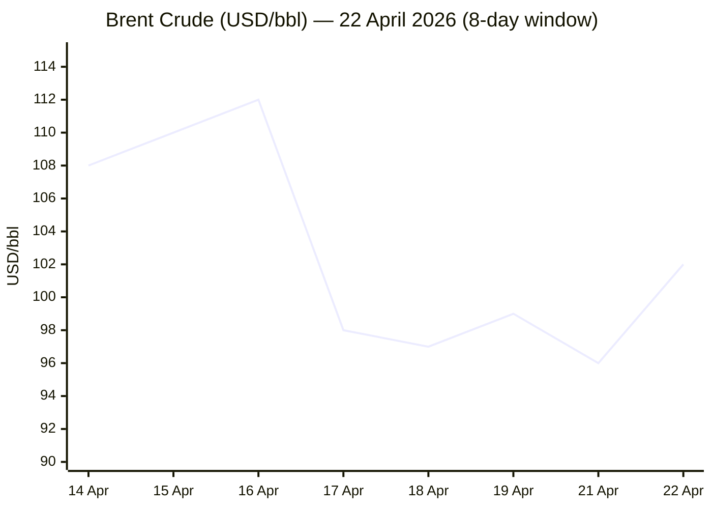
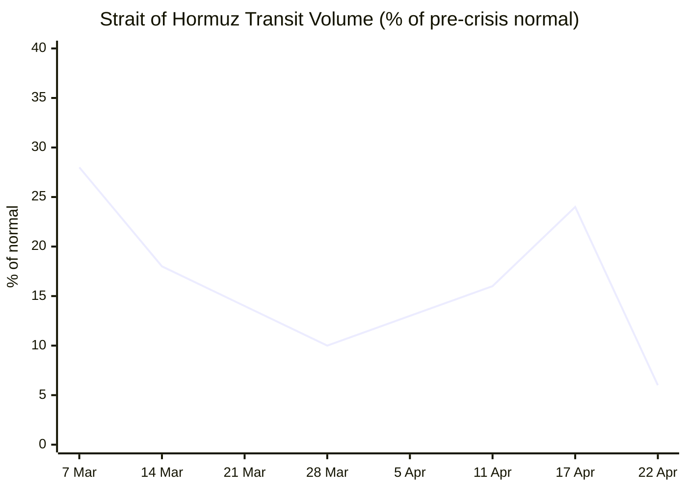

```yaml
---
brief_date: 2026-04-23
version: v1.2.1
run_time: "05:55 CET"
stories_published: 13
categories: [conflict, business, eu_affairs, technology, trends]
alert_counts:
  red: 4
  yellow: 6
  green: 3
ongoing_situations:
  - {name: "2026 Iran War", real_world_start: "2026-02-28", day: 55}
  - {name: "2026 Lebanon War", real_world_start: "2026-03-02", day: 53}
  - {name: "US-Iran Ceasefire (fragile)", real_world_start: "2026-04-08", day: 16}
  - {name: "US Naval Blockade of Iran", real_world_start: "2026-04-13", day: 11}
  - {name: "Israel-Lebanon Ceasefire", real_world_start: "2026-04-16", day: 8}
sources_fetched: 9
fetch_status:
  le_monde: "❌"
  faz: "❌"
  kommersant: "❌"
  xinhua: "✅"
  european_parliament: "✅"
expansion_queue: []
---
```

---

# 🌐 MORNING BRIEF
## Thursday, 23 April 2026 · 05:55 CET
### 13 stories across 5 categories

---

## DIGEST SUMMARY

| # | Category | Headline | Alert |
|---|----------|----------|-------|
| 1 | ⚔️ Conflict | Iran seizes ships in Hormuz; Vance trip cancelled as ceasefire frays | 🔴 |
| 2 | ⚔️ Conflict | Israel-Lebanon ceasefire shaky as "Yellow Line" buffer zone hardens | 🟡 |
| 3 | ⚔️ Conflict | IRGC seizes 2 vessels, attacks third — UKMTO logs heavy bridge damage | 🔴 |
| 4 | 💼 Business | Brent tops $101 on renewed Hormuz attacks; peace-talk collapse adds premium | 🔴 |
| 5 | 💼 Business | IMF downgrades 2026 global growth to 3.1% in shadow of Middle East war | 🔴 |
| 6 | 💼 Business | Wall Street edges higher on ceasefire extension; energy-driven stagflation risk flagged | 🟡 |
| 7 | 🇪🇺 EU Affairs | MEPs back 10% budget increase for 2028–2034 MFF; plenary vote 29 April | 🟡 |
| 8 | 🇪🇺 EU Affairs | Provisional deal reached on social security rules for EU mobile workers | 🟢 |
| 9 | 🤖 Technology | Google Cloud signs multi-billion deal with Thinking Machines Lab; Nvidia GB300 infrastructure race accelerates | 🟡 |
| 10 | 🤖 Technology | AI frontier convergence: GPT-5.4 benchmarks, MCP at 97M installs, compute arms race widens | 🟢 |
| 11 | 📈 Trends | Pakistan's diplomatic pivot: from nuclear flashpoint to US-Iran broker | 🟡 |
| 12 | 📈 Trends | Hormuz closure reshaping global shipping lanes; Cape reroute now structural | 🟡 |
| 13 | 📈 Trends | EU CPI rises to 2.6% on energy shock; ECB above-target window reopens | 🟡 |

> Alert Level key: 🔴 High significance · 🟡 Developing · 🟢 Stable/Routine

---

## 🚨 SIGNAL BOARD

🔴 **Hormuz at ~5–8% of pre-crisis transit norms; Iran attacks 3 ships on 22 April, shattering brief ceasefire calm**
🔴 **Brent crude at $101/bbl — 50% above year-ago levels; IMF cuts 2026 global growth to 3.1%**
🟡 **CENTCOM confirms 31 ships turned back by blockade; US 5-day deadline given Iran to submit peace proposal**
🟡 **EP Budgets Committee endorses €1.93 trillion MFF, 10% above Commission proposal — plenary vote 29 April**
⚡ **Trump extends ceasefire indefinitely — reversal of his own deadline — as Vance Islamabad trip collapses**

---

## 🔄 ONGOING SITUATIONS

| Situation | Real-world start | Day # | Last significant development | Status |
|-----------|-----------------|-------|------------------------------|--------|
| 2026 Iran War | 28 Feb 2026 | Day 55 | Iran attacks 3 Hormuz vessels; Vance Pakistan trip abandoned; Trump extends ceasefire indefinitely, blockade remains | 🔴 Active |
| 2026 Lebanon War | 02 Mar 2026 | Day 53 | Israel-Lebanon talks open in Washington; IDF publishes "Yellow Line" buffer zone map; journalist killed in Israeli strike | 🟡 Ceasefire fragile |
| US–Iran Ceasefire | 08 Apr 2026 | Day 16 | Trump extends truce indefinitely; Tehran accuses US of ceasefire violations via naval blockade | 🔴 Active/Disputed |
| US Naval Blockade of Iran | 13 Apr 2026 | Day 11 | 31 ships turned back; Touska seized 19 April; Iran retaliates with ship seizures | 🔴 Active |
| Israel–Lebanon Ceasefire | 16 Apr 2026 | Day 8 | Israeli forces remain in buffer zone; demolitions continue; Lebanese ambassador heads to Washington | 🟡 Fragile |

---

> 🔎 **CONFLICT ANALYST** · 3 updates today

### 1. Iran Attacks Three Ships in Strait of Hormuz; Peace Talks Collapse 🔴
**Alert:** 🔴
**Summary:** Iran's IRGC seized two container ships and attacked a third in the Strait of Hormuz on 22 April, hours after President Trump extended the US–Iran ceasefire indefinitely. The British military's UKMTO confirmed one vessel sustained heavy bridge damage after an IRGC gunboat fired without warning. US Central Command reported 31 ships turned back under its naval blockade of Iranian ports. Vice President Vance's planned trip to Islamabad for a second round of talks was abandoned after Tehran confirmed it would not attend while the blockade continues. Iranian President Pezeshkian said the blockade and threats are "main obstacles to genuine negotiations."
**Significance:** The mutual attribution of ceasefire violations — Iran pointing to the blockade, the US pointing to the ship seizures — creates a recursive impasse that makes a negotiated opening of the strait structurally difficult. With two US carrier groups and 50,000+ troops in theatre, the risk of miscalculation remains elevated.
**Sources:**

- [NBC News — Live updates: Iran seizes ships in Strait of Hormuz after Trump extends ceasefire](https://www.nbcnews.com/world/iran/live-blog/live-updates-iran-trump-ceasefire-hormuz-attack-peace-talks-israel-rcna341361) · 23 April 2026
- [CBS News — Iran attacks ships in Strait of Hormuz as thousands more US forces head for Middle East](https://www.cbsnews.com/live-updates/iran-war-trump-ceasefire-strait-hormuz-ship-attacked-us-military-buildup/) · 23 April 2026
- [CNN — Iran war: US-Trump blockade-ceasefire live](https://www.cnn.com/2026/04/22/world/live-news/iran-war-us-trump-blockade-ceasefire) · 22 April 2026 [MULTI-SOURCE]

**Trend:** ↗ Escalating
**Tags:** #Iran #Hormuz #ceasefire #naval-blockade #MULTI-SOURCE

---

### 2. Israel-Lebanon: "Yellow Line" Buffer Zone Hardens; Washington Talks Begin 🟡

**Alert:** 🟡
**Summary:** The IDF published a detailed map on 19 April showing a three-tiered buffer zone extending up to 30km into southern Lebanon, with a contested "Yellow Line" 6–10km inside the border as its primary enforcement perimeter. Israeli forces continue demolitions and land-clearing in ceasefire violation; a French UNIFIL peacekeeper was killed over the weekend. Israeli and Lebanese ambassadors opened direct talks in Washington on Thursday — the first formal Israel–Lebanon engagement in decades — aimed at extending the 10-day truce and discussing Hezbollah disarmament. A Lebanese journalist, Amal Khalil, was killed in an Israeli airstrike on the village of al-Tiri on 22 April.
**Significance:** The buffer zone template echoes Gaza's "Yellow Line" approach, suggesting Israel is moving toward a semi-permanent security architecture in southern Lebanon that will be difficult to reverse in any negotiated settlement.
**Sources:**

- [Al Jazeera — Does Israel's 'Yellow Line' violate the Lebanon ceasefire?](https://www.aljazeera.com/news/2026/4/19/does-israels-yellow-line-violate-the-lebanon-ceasefire) · 19 April 2026
- [The New Arab — Buffer zone: How Israel is tightening its grip on south Lebanon](https://www.newarab.com/analysis/buffer-zone-how-israel-tightening-its-grip-south-lebanon) · 21 April 2026

**Trend:** ↗ Escalating
**Tags:** #Israel #Lebanon #Hezbollah #ceasefire #displacement

---

### 3. US Naval Blockade: Seizures, Standoff, 3–5 Vessels Daily Transiting Hormuz 🔴
**Alert:** 🔴
**Summary:** US Central Command confirmed that as of 22 April, 31 ships have been redirected under the naval blockade of Iranian ports. On 19 April, the USS Spruance seized the Iranian-flagged cargo ship Touska after firing into its engine room in the Gulf of Oman. Hormuz transit volume now stands at approximately 5–8% of pre-crisis norms, with IMF Portwatch recording only 5 vessels on 22 April versus a pre-crisis daily average above 80. Around 500–870 vessels above 10,000 dwt remain stranded in the Persian Gulf. Bypass pipelines (Saudi East–West, Abu Dhabi–Fujairah) can handle only ~35% of normal strait flow.
**Significance:** The Touska seizure marks the first confirmed interdiction outside the strait itself, signalling a geographic expansion of enforcement into the Gulf of Oman that was not anticipated under CENTCOM's initial blockade parameters.
**Sources:**

- [NPR — US seizes Iranian cargo ship Touska in Strait of Hormuz](https://www.npr.org/2026/04/19/nx-s1-5790378/iran-us-hormuz-closed-impossible) · 19 April 2026
- [USNI News — Two US warships sail through Strait of Hormuz](https://news.usni.org/2026/04/11/two-u-s-warships-sail-through-strait-of-hormuz-to-establish-new-route-for-merchant-ships) · 11 April 2026

**Trend:** ↗ Escalating
**Tags:** #Hormuz #Iran #naval-blockade #shipping #escalation #MULTI-SOURCE

📚 *Background reading:* [IISS — The Strait of Hormuz and Global Energy Security](https://www.iiss.org) · [CSIS — Iran's Strait of Hormuz Strategy](https://www.csis.org)

---

> 💼 **BUSINESS ANALYST** · 3 updates today

### 4. Brent Tops $101 as Hormuz Attacks Revive Supply Fear 🔴
**Alert:** 🔴
**Summary:** Brent crude closed at $101.65/bbl on 22 April, rising more than 3% in 24 hours after Iran attacked three commercial vessels in the Hormuz strait, reversing a brief dip that followed Trump's ceasefire extension. WTI rose to approximately $91/bbl. The price level is roughly 50% above the year-ago benchmark. Demand destruction estimates are now approaching 4–5 million barrels per day, or ~5% of global supply, with Asia bearing the most exposure. Oil inventories in the US rose by 1.9 million barrels in the week ending 17 April, a modest buffer against continued strait closure. War-risk insurance premiums for the region have risen sharply.
**Market signal:** Bearish for energy importers and consumer spending; bullish for energy producers and defensive assets; structural risk premium now embedded in forward curves.
**Sources:**

- [Fortune — Current price of oil, 22 April 2026](https://fortune.com/article/price-of-oil-04-22-2026/) · 22 April 2026
- [Investing.com — Brent tops $101 as Iranian attacks on ships stoke tensions](https://www.investing.com/commodities/brent-oil) · 22 April 2026

**Trend:** ↗ Escalating
**Tags:** #Brent #oil-price #Hormuz #energy-markets #supply-shock

📎 See also: Conflict § Story 3 — US naval blockade reduces Hormuz to 5-8% of normal transit volume

---

### 5. IMF Cuts 2026 Global Growth Forecast to 3.1% 🔴
**Alert:** 🔴
**Summary:** The IMF's April 2026 World Economic Outlook — titled *Global Economy in the Shadow of War* — revised global growth down to 3.1% for 2026, from 3.4% in 2025 and 3.3% in the January update. Headline global inflation is projected to rise to 4.4% in 2026. The IMF set out three scenarios: reference (conflict short-lived, growth 3.1%), adverse (extended disruption, growth 2.5%) and severe (energy supply disruptions extending into 2027, growth 2.0%). Emerging market and developing economy forecasts were cut 0.3pp relative to January. IMF Chief Economist Pierre-Olivier Gourinchas cited rising commodity prices, firmer inflation expectations, and tighter financial conditions as primary channels of transmission.
**Market signal:** Bearish for growth-linked assets and emerging market currencies; reinforces the "higher for longer" rate narrative in the US while creating divergence with ECB and BoJ constraints.
**Sources:**

- [IMF — World Economic Outlook April 2026: Global Economy in the Shadow of War](https://www.imf.org/en/publications/weo/issues/2026/04/14/world-economic-outlook-april-2026) · 14 April 2026
- [IMF — WEO April 2026 Press Briefing Transcript](https://www.imf.org/en/news/articles/2026/04/14/tr-04142026-press-briefing-transcript-world-economic-outlook-spring-meetings-2026) · 14 April 2026 [MULTI-SOURCE]

**Trend:** ↘ De-escalating
**Tags:** #IMF #GDP-forecast #inflation #stagflation #MULTI-SOURCE #institutional

---

### 6. Wall Street Climbs on Ceasefire Extension; Stagflation Premium Builds 🟡
**Alert:** 🟡
**Summary:** US equity markets edged higher on 22 April after Trump extended the US–Iran ceasefire indefinitely, removing the immediate tail risk of resumed strikes. However, Brent above $100/bbl, gold near $4,750/oz, and the IMF's upward inflation revision are combining to embed a stagflationary risk premium across asset classes. Gold has fallen approximately 10% since the Iran conflict began — a counterintuitive safe-haven underperformance attributed to USD strength, rising yields, and Kevin Warsh's Senate confirmation hearing as prospective Fed Chair, at which he outlined a new inflation framework without specific guidance. EUR/USD holds around 1.1776, near the upper end of its 52-week range.
**Market signal:** Neutral to cautious; ceasefire extension removes acute tail risk but leaves energy-driven inflation structural, while Warsh confirmation signals possible Fed policy recalibration.
**Sources:**

- [Reuters / Investing.com — Wall Street climbs on ceasefire extension](https://www.investing.com/commodities/brent-oil) · 22 April 2026
- [Trading Economics — Gold falls toward $4,700 on stronger dollar](https://tradingeconomics.com/commodity/gold) · 22 April 2026

**Trend:** → Stable
**Tags:** #equity-rally #gold #Fed #interest-rates #SP500

📚 *Background reading:* [Bruegel — Energy price shock and European monetary policy](https://www.bruegel.org) · [RAND — Oil shocks and stagflation risk](https://www.rand.org)

---

> 🇪🇺 **EU AFFAIRS ANALYST** · 2 updates today

### 7. EP Budgets Committee Backs 10% MFF Increase; Plenary Vote 29 April 🟡
**Alert:** 🟡
**Summary:** The European Parliament's Budgets Committee voted 26–9 (5 abstentions) on 15 April to adopt its negotiating position on the 2028–2034 Multiannual Financial Framework, proposing a budget of 1.27% of EU GNI — a 10% increase versus the European Commission's July 2025 proposal. Co-rapporteurs Siegfried Mureşan (EPP) and Carla Tavares (S&D) argue the higher figure is the minimum needed to respond to war, climate, and competitiveness challenges. MEPs placed debt servicing for NextGenerationEU (0.11% of GNI) outside the budget ceiling, and backed five new own resources including a digital services levy and crypto-asset capital gains tax. The plenary vote to formally confirm this position is scheduled for 29 April 2026.
**Legislative/policy stage:** Budgets Committee interim report adopted 15 April 2026; full Parliament plenary vote scheduled 29 April 2026; Council common position not yet agreed — interinstitutional negotiations cannot begin until Council reaches alignment.
**Sources:**

- [European Parliament — EU long-term budget: MEPs want a 10% increase to support EU priorities](https://www.europarl.europa.eu/news/en/press-room/20260414IPR40819/eu-long-term-budget-meps-want-a-10-increase-to-support-eu-priorities) · 15 April 2026
- [GovPing/EP — MEPs endorse 10% EU budget increase for 2028–2034](https://changeflow.com/govping/government-legislation/meps-endorse-10-eu-budget-increase-for-2028-2034-2026-04-20) · 20 April 2026 [MULTI-SOURCE]

**Trend:** ↗ Escalating
**Tags:** #MFF #EU-institutions #EU-defence #EU-funds #MULTI-SOURCE

---

### 8. Provisional Deal on Social Security Rules for EU Mobile Workers 🟢
**Alert:** 🟢
**Summary:** Parliament and Council negotiators reached a provisional agreement on 22 April to update social security coordination rules for EU workers who have relocated to another member state. The agreed text clarifies which country bears responsibility for social contributions when a worker's situation straddles borders, and introduces rules on how obligations are distributed to prevent "social tourism" disputes. The Employment and Social Affairs Committee had backed the update; it now goes to both institutions for formal adoption. The reform primarily affects cross-border workers in sectors including transport, construction, and care.
**Legislative/policy stage:** Provisional trilogue agreement reached 22 April 2026; formal adoption by Parliament and Council pending; implementing regulation timeline not yet confirmed.
**Sources:**

- [European Parliament — Provisional deal to update social benefit rules for EU mobile workers](https://www.europarl.europa.eu/news/en/press-room/20260420IPR41513/provisional-deal-to-update-social-benefit-rules-for-eu-mobile-workers) · 22 April 2026

**Trend:** ↘ De-escalating
**Tags:** #EU-institutions #single-market #social-contract

📚 *Background reading:* [Bruegel — Social security coordination in the EU single market](https://www.bruegel.org) · [ECFR — EU labour market integration](https://ecfr.eu)

---

> 🤖 **TECHNOLOGY ANALYST** · 2 updates today

### 9. Thinking Machines Lab Signs Multi-Billion Google Cloud Deal on Nvidia GB300 🟡
**Alert:** 🟡
**Summary:** Google Cloud announced at its Cloud Next '26 conference in Las Vegas on 22 April that it has signed a new multi-billion-dollar infrastructure agreement with Thinking Machines Lab, the startup founded by former OpenAI CTO Mira Murati. The deal, valued in the single-digit billions, gives Thinking Machines first-wave access to Google's A4X Max virtual machines powered by Nvidia's GB300 NVL72 (Blackwell architecture), delivering a reported 2x improvement in training and serving speed versus prior GPU generations. The deal is non-exclusive; Thinking Machines previously signed a 1-gigawatt capacity deal with Nvidia directly in March. Separately, Anthropic this month signed TPU capacity agreements with both Google-Broadcom and Amazon (up to 5 gigawatts), and Meta secured a multibillion-dollar Nvidia deal. Google's cloud revenue backlog has more than doubled to $240 billion, with AI segment spend-intensity at 57% in enterprise surveys.
**Analyst note:** Within 18 months, the concentration of multi-gigawatt frontier training capacity among four to five hyperscaler relationships will structurally disadvantage any frontier AI lab unable to secure committed infrastructure — raising barriers to entry and accelerating vertical consolidation in the AI supply chain.
**Sources:**

- [TechCrunch — Exclusive: Google deepens Thinking Machines Lab ties with new multibillion-dollar deal](https://techcrunch.com/2026/04/22/exclusive-google-deepens-thinking-machines-lab-ties-with-new-multi-billion-dollar-deal/) · 22 April 2026
- [Google Cloud / PRNewswire — Thinking Machines Expands Use of Google Cloud AI Hypercomputer](https://www.prnewswire.com/news-releases/thinking-machines-expands-use-of-google-cloud-ai-hypercomputer-302749226.html) · 22 April 2026 [MULTI-SOURCE]

**Trend:** ↗ Escalating
**Tags:** #AI #semiconductor #data-centre #LLM #MULTI-SOURCE

---

### 10. AI Frontier Converges: GPT-5.4 Leads Agentic Race; MCP Protocol Reaches 97M Installs 🟢
**Alert:** 🟢
**Summary:** OpenAI's GPT-5.4, released 5 March 2026, continues to define the current frontier competitive landscape. The model achieves 75% on OSWorld-Verified (computer use), surpassing the human baseline of 72.4%, and 83% on GDPval (knowledge-work tasks across 44 professions). Anthropic's MCP (Model Context Protocol) crossed 97 million installs in March 2026, establishing it as the de facto standard for AI agent tooling. Separately, xAI's Grok chatbot experienced intermittent outages on 22–23 April attributed to high demand. The frontier model landscape — GPT-5.4, Claude Opus 4.6, Gemini 3.1 Pro — now shows benchmark convergence within 2–3pp on most evaluations, shifting competition toward pricing, developer experience, and infrastructure reliability.
**Analyst note:** Benchmark convergence at the frontier within 12–24 months is likely to shift enterprise AI procurement decisions primarily toward total cost of ownership, API reliability SLAs, and regulatory compliance posture rather than raw capability.
**Sources:**

- [Crescendo AI / multiple sources — Latest AI news and updates](https://www.crescendo.ai/news/latest-ai-news-and-updates) · April 2026
- [OpenAI — Introducing GPT-5.4](https://openai.com/index/introducing-gpt-5-4/) · 5 March 2026

**Trend:** ↗ Escalating
**Tags:** #AI #LLM #AI-benchmark #autonomous-systems #data-centre

📚 *Background reading:* [CSIS — AI governance and frontier model competition](https://www.csis.org) · [Atlantic Council — The geopolitics of AI infrastructure](https://www.atlanticcouncil.org)

---

> 📈 **TRENDS ANALYST** · 3 updates today

### 11. Pakistan's Strategic Pivot: From Nuclear Flashpoint to US–Iran Mediator 🟡
**Alert:** 🟡
**Summary:** Pakistan has emerged as the indispensable third party in US–Iran diplomacy, hosting the first round of Islamabad talks (11–12 April) and serving as the conduit through which Iran communicated its refusal to attend a second round on 22 April. Prime Minister Shehbaz Sharif previously persuaded Trump to extend his 8 April ceasefire deadline, and the Pakistani FM called his Iranian counterpart on 19 April to urge continued dialogue. Trump explicitly stated he extended the ceasefire "at the request of mediating country Pakistan." Chinese diplomatic involvement has also been confirmed via Xinhua and White House statements, framing this as a tripartite effort.
**Horizon:** Medium-term. Pakistan's credibility as mediator will depend on whether a second round of talks materialises within weeks. Structural shift: the role signals a deliberate recalibration of Pakistani foreign policy away from its traditional India-Pakistan bilateral focus and toward regional great-power brokerage — a trajectory likely to persist regardless of Iran war outcome.
**Sources:**

- [Xinhua — Pakistani FM emphasizes need for continued dialogue in call with Iranian FM](https://english.news.cn/20260419/6065c83f12b04905acd8e76474a2ee9a/c.html) · 19 April 2026
- [Xinhua — Pakistan tightens security ahead of expected US–Iran talks](https://english.news.cn/20260419/8e9c8fce51974ea49f3f33aa0b575f0f/c.html) · 19 April 2026

**Trend:** → Stable
**Tags:** #Pakistan-mediation #diplomacy #peace-talks #mediation

📎 See also: Conflict § Story 1 — Iran ceasefire breakdown and failed Islamabad second round

---

### 12. Hormuz Closure Becomes Structural Shipping Disruption: Cape Route Now Default 🟡
**Alert:** 🟡
**Summary:** The Strait of Hormuz has been effectively closed to commercial traffic since 28 February 2026. With transits at 5–8% of pre-crisis norms (3–5 vessels daily vs. 80–100+ pre-war), major container lines — including those serving Asia–Europe routes — have rerouted via the Cape of Good Hope, adding 10–14 days to transit times and driving up freight rates. Approximately 147 containerships with 470,000 TEUs are trapped in the Gulf region; total stranded vessels above 10,000 dwt number 500–870. Bypass pipelines (Saudi East–West, Abu Dhabi–Fujairah) can cover only ~35% of normal Hormuz throughput. Fertiliser flows — normally 25–30% of global urea trade — are also disrupted, with FAO already flagging food security implications.
**Horizon:** Long-term structural shift. Even if hostilities cease within weeks, insurance premiums, mine-clearance operations, and shipper risk appetite will suppress full normalisation for months. The Cape reroute is becoming a permanently available commercial option for carriers hedging Hormuz risk.
**Sources:**

- [HormuzTracker — Real-time shipping disruption dashboard](https://www.hormuztracker.com/) · 23 April 2026
- [Wikipedia — 2026 Strait of Hormuz crisis](https://en.wikipedia.org/wiki/2026_Strait_of_Hormuz_crisis) · Updated 23 April 2026

**Trend:** → Stable
**Tags:** #shipping #food-security #Hormuz #supply-shock #energy-markets

📎 See also: Conflict § Story 3 — Naval blockade and transit volume data; Business § Story 4 — oil price premium

---

### 13. Eurozone Inflation Resurges to 2.6% on Energy Shock; ECB Above Target Again 🟡
**Alert:** 🟡
**Summary:** Eurozone HICP inflation rose to 2.6% year-on-year in March 2026, up sharply from 1.9% in February, driven by energy prices which swung from -3.1% to +5.1% in a single month following the escalation in the Middle East. Germany registered 2.8%, France 2.0%, Spain 3.3%. Core inflation edged lower to 2.3%, and services eased to 3.2%, suggesting the inflationary dynamic is externally driven rather than demand-led. The ECB's March projections already anticipated energy pass-through but assumed a short-lived conflict; the IMF's April WEO adverse scenario (+80% oil price shock) would take euro area inflation considerably higher. The April 2026 flash estimate is due 30 April.
**Horizon:** Short-to-medium-term. Energy-driven inflation is likely to remain above the ECB's 2% target for at least the remainder of 2026 under the IMF reference scenario, complicating the rate-cutting cycle. A conflict de-escalation would produce a rapid reversal.
**Sources:**

- [Eurostat — Euro area annual inflation up to 2.6%](https://ec.europa.eu/eurostat/web/products-euro-indicators/w/2-16042026-ap) · 16 April 2026
- [Destatis — Inflation rate at +2.7% in March 2026](https://www.destatis.de/EN/Press/2026/04/PE26_127_611.html) · April 2026

**Trend:** ↗ Escalating
**Tags:** #inflation #ECB #energy-markets #eurozone #climate-policy

📚 *Background reading:* [Bruegel — ECB policy in an energy-price shock environment](https://www.bruegel.org) · [Atlantic Council — Middle East war and European energy dependence](https://www.atlanticcouncil.org)

---

## 📊 KEY DATA OF THE DAY

> 📊 **DATA OFFICER** · 7 indicators

| Indicator | Value | Δ vs prior session | Δ vs 7 days ago | Note | Source | URL |
|-----------|-------|-------------------|-----------------|------|--------|-----|
| EUR/USD | 1.1776 | +0.07% (7d) | +2.02% (30d) | Near 52-wk high; dollar soft amid Middle East uncertainty | Wise / ECB | [link](https://wise.com/us/currency-converter/eur-to-usd-rate/history) |
| Brent Crude (USD/bbl) | 101.65 | +4.9% | +48% YoY | Crisis risk premium; 3% jump 22 Apr on renewed Hormuz attacks | Trading Economics / oilprice.com | [link](https://oilprice.com/futures/brent/) |
| Gold (XAU/USD) | 4,750 | -2% prev session, partial recovery | -10% since conflict began | Counter-intuitive underperformance; strong USD and rising yields suppress safe-haven bid | Trading Economics | [link](https://tradingeconomics.com/commodity/gold) |
| IMF Global Growth 2026 | 3.1% | vs Jan WEO: -0.2pp | vs Oct WEO: -0.3pp | Reference forecast; adverse scenario = 2.5%; global inflation revised to 4.4% | IMF WEO April 2026 | [link](https://www.imf.org/en/publications/weo/issues/2026/04/14/world-economic-outlook-april-2026) |
| EU CPI YoY (Mar 2026) | 2.6% | vs Feb 2026: +0.7pp | vs Dec 2025: +0.6pp | Energy +5.1% YoY; above ECB 2% target; services easing to 3.2% | Eurostat | [link](https://ec.europa.eu/eurostat/web/products-euro-indicators/w/2-16042026-ap) |
| FAO Food Price Index | 128.5 (Mar 2026) | vs Feb 2026: +2.4% | vs Mar 2025: +1.0% | Second consecutive monthly rise; energy-linked pressure on vegetable oils and sugar | FAO | [link](https://www.fao.org/worldfoodsituation/foodpricesindex/en/) |
| Strait of Hormuz transit volume | ~5–8% of pre-crisis norms | ↘ from ~10% (early Apr) | ↘ from ~13% (late Mar) | ~3–5 vessels/day vs 80–100+ pre-crisis; blockade reimposed 18 Apr; 500–870 vessels stranded in Gulf | IMF Portwatch / Lloyd's List | [link](https://portwatch.imf.org/pages/cb5856222a5b4105adc6ee7e880a1730) |

**Data commentary:** Brent above $100/bbl and the FAO index rising for a second consecutive month are beginning to form a coherent inflationary feedback loop driven by the Hormuz closure: energy prices transmit into food (fertiliser disruption, transport costs) while gold's underperformance signals that markets are pricing the conflict as inflationary rather than recessionary, compressing the safe-haven dynamic. The IMF's 3.1% global growth figure, combined with 4.4% headline inflation, is the IMF's operational definition of stagflationary risk — a combination that leaves central banks, particularly the ECB, with limited room to respond to either.

---

## 📊 CHARTS





---

## ⚙️ AGENT METADATA

| Field | Value |
|-------|-------|
| Agent version | MORNING BRIEF v1.2.1 |
| Run timestamp | 2026-04-23T05:55:29+02:00 |
| Fetch status | Le Monde ❌ · FAZ ❌ · Kommersant ❌ · Xinhua ✅ · EP ✅ |
| Sources queried | 9 / 11 (Le Monde, FAZ, Kommersant blocked/unavailable; search fallback applied) |
| Stories surfaced | ~28 before editorial filter |
| Stories published | 13 after editorial filter |
| Languages processed | EN, FR (via search), DE (via search) |
| Output language | English (British) |
| Date validated | ✅ Confirmed 23 April 2026 |
| Expansion Queue | None — all tags resolved from closed list |

---

*MORNING BRIEF is an AI-assisted digest. All summaries are paraphrased from original sources. Verify time-sensitive information at the linked URLs before acting. Output language: British English.*
