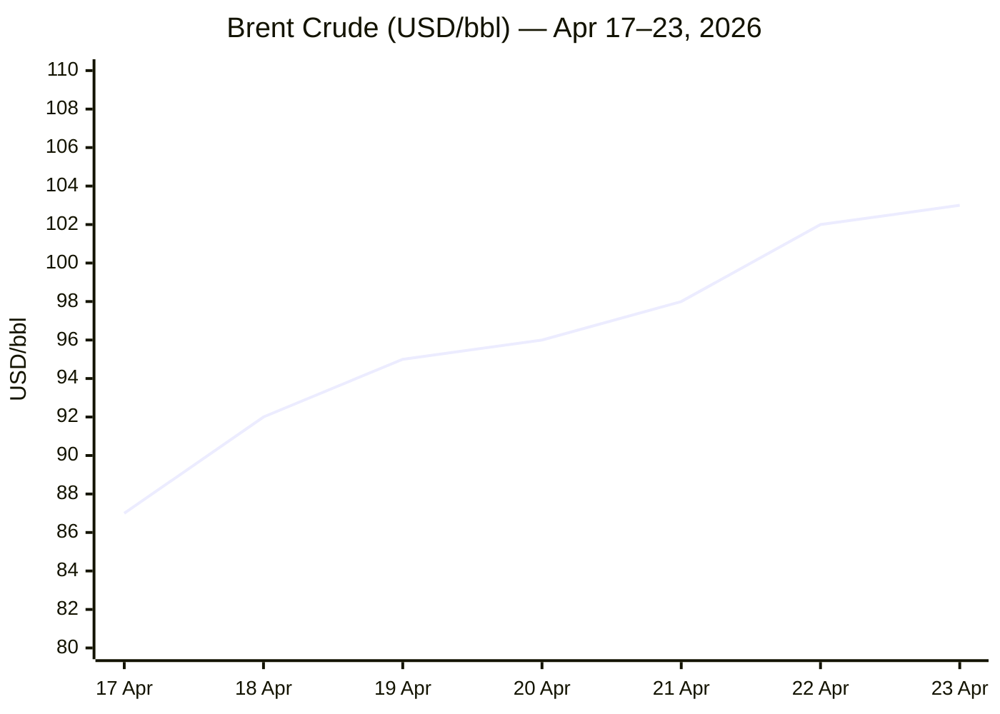
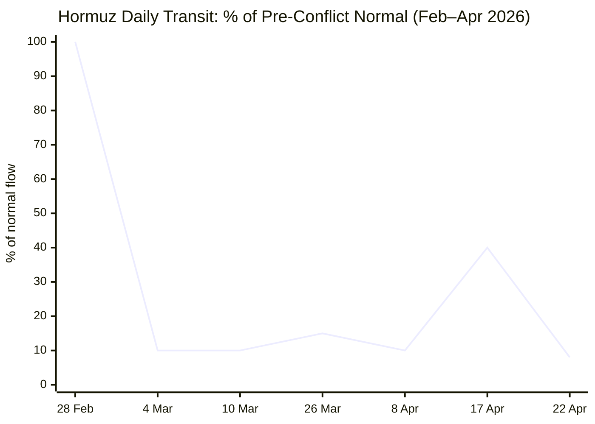

```yaml
---
brief_date: 2026-04-24
version: v1.2.1
run_time: "05:51 CET"
stories_published: 15
categories: [conflict, business, eu_affairs, technology, trends]
alert_counts:
  red: 5
  yellow: 9
  green: 1
ongoing_situations:
  - {name: "Russia–Ukraine War", real_world_start: "2022-02-24", day: 1520}
  - {name: "2026 Iran War", real_world_start: "2026-02-28", day: 56}
  - {name: "2026 Israel–Lebanon War", real_world_start: "2026-03-02", day: 54}
sources_fetched: 11
fetch_status:
  le_monde: "❌"
  faz: "❌"
  kommersant: "❌"
  xinhua: "✅"
  european_parliament: "⚠️"
expansion_queue: []
---
```

---

# 🌐 MORNING BRIEF
## Friday, 24 April 2026 · 05:51 CET
### 15 stories across 5 categories

---

## DIGEST SUMMARY

| # | Category | Headline | Alert |
|---|----------|----------|-------|
| 1 | ⚔️ Conflict | Iran War Day 56: Ships fired on in Hormuz; peace talks collapse | 🔴 |
| 2 | ⚔️ Conflict | Israel–Lebanon ceasefire extended three weeks at White House | 🟡 |
| 3 | ⚔️ Conflict | Russia–Ukraine Day 1520: 231 combat engagements; Russia loses ground | 🟡 |
| 4 | ⚔️ Conflict | Third US carrier in CENTCOM; Trump orders Navy to shoot mine-laying boats | 🟡 |
| 5 | 💼 Business | Brent above $103 as Hormuz flows hit 8% of normal | 🔴 |
| 6 | 💼 Business | IMF slashes global growth to 3.1%; inflation to 4.4% — Iran war shadow | 🟡 |
| 7 | 💼 Business | Wall Street retreats from records on software rout and oil surge | 🟡 |
| 8 | 🇪🇺 EU Affairs | EU Cyprus Summit: Article 42.7 mutual defence debate; energy shock | 🔴 |
| 9 | 🇪🇺 EU Affairs | Hungary post-election: Magyar forms government; EU funds in play | 🟡 |
| 10 | 🇪🇺 EU Affairs | Eurozone CPI 2.6% in March — energy surge breaks ECB 2% ceiling | 🟡 |
| 11 | 🤖 Technology | Meta announces 8,000 layoffs (10% workforce) as AI capex doubles | 🔴 |
| 12 | 🤖 Technology | Semiconductor index 17-day winning streak; Texas Instruments record | 🟢 |
| 13 | 📈 Trends | Strait of Hormuz: structural closure deepens; Iran imposes transit tolls | 🟡 |
| 14 | 📈 Trends | FAO Food Price Index hits 128.5 — energy drives second monthly rise | 🟡 |
| 15 | 📈 Trends | Pakistan's mediator role solidifies as Iran–US channel of last resort | 🟡 |

> Alert Level key: 🔴 High significance · 🟡 Developing · 🟢 Stable/Routine

---

## 🚨 SIGNAL BOARD

🔴 **Brent crude at $103.38 — up 54% year-on-year — as Hormuz transit remains locked at ~8% of pre-conflict norms, destroying an estimated 4–5 million barrels per day of effective supply.**
🔴 **Iran seized two foreign commercial vessels on 22 April and fired on a third; Trump ordered the US Navy to shoot and kill any boats laying mines in the Strait.**
🟡 **Israel–Lebanon ceasefire extended three weeks after White House talks; Hezbollah rockets continued through the negotiations.**
🟡 **IMF WEO April 2026 projects global growth at 3.1% (down from 3.4% in 2025) and inflation rising to 4.4% — all predicated on a limited-duration conflict assumption.**
⚡ **EU leaders in Cyprus invoke Article 42.7 mutual-defence clause discussions for the first time — triggered not by Russia but by Iranian drone strikes on a British base on EU soil.**

---

## 🔄 ONGOING SITUATIONS

| Situation | Real-world start | Day # | Last significant development | Status |
|-----------|-----------------|-------|------------------------------|--------|
| Russia–Ukraine War | 24 Feb 2022 | Day 1520 | Russia -5 sq mi net in week to 21 Apr; 92% drone intercept rate in March | 🔴 Active |
| 2026 Iran War | 28 Feb 2026 | Day 56 | Ceasefire holds nominally; IRGC seizes 2 vessels; Islamabad talks collapsed | 🟡 Fragile ceasefire |
| 2026 Israel–Lebanon War | 02 Mar 2026 | Day 54 | Ceasefire extended 3 weeks after White House talks; Hezbollah rockets fired during negotiations | 🟡 Ceasefire |

---

## ⚔️ CONFLICT SECTION

> 🔎 **CONFLICT ANALYST** · 4 updates today

---

### 1. 2026 Iran War Day 56 — Hormuz Fires, Ships Seized, Talks Collapse 🔴
**Alert:** 🔴
**Summary:** The fragile Iran–US ceasefire came under acute strain on 22–23 April as Iran's Islamic Revolutionary Guard Corps fired on a Liberia-flagged container vessel near Oman, causing significant damage to its bridge, and subsequently seized two foreign commercial ships — the MSC Francesca and the Epaminondas — escorting them into Iranian waters. Iran's IRGC stated the vessels had transited without coordination. The seizures followed the US Navy's interception of the Iranian tanker Majestic X in the Indian Ocean — at least the fourth such seizure. Tehran cited the US naval blockade, in effect since 13 April, as a ceasefire violation. Iran's parliament speaker and chief negotiator Mohammad Bagher Ghalibaf stated that reopening Hormuz was "impossible" with the blockade in place. A planned second round of Islamabad peace talks collapsed after Tehran informed Washington via Pakistan that it would not participate. Trump extended the ceasefire indefinitely, pending a "unified" Iranian proposal, and ordered the Navy to shoot any boats laying mines.
**Significance:** The collapse of the Islamabad talks and simultaneous escalation in Hormuz represent the most dangerous combination since the 8 April ceasefire. With Iran seizing neutral-flag vessels as leverage and the US blockading Iranian ports, both parties are now using maritime interdiction as the primary coercive tool — a dynamic that risks accidental escalation into open naval confrontation and further oil supply shock.
**Sources:**

- [Al Jazeera — Iran captures two foreign commercial vessels in the Strait of Hormuz](https://www.aljazeera.com/news/2026/4/22/iranian-gunboat-fires-on-container-ship-off-oman-coast) · 22 April 2026
- [Euronews — Diplomacy stalls as Iran fires on three ships in the Strait of Hormuz and US maintains blockade](https://www.euronews.com/2026/04/23/diplomacy-stalls-as-iran-fires-on-three-ships-in-the-strait-of-hormuz-and-us-maintains-blo) · 23 April 2026
- [Fox News — Iran fires on 3 ships in the Strait of Hormuz as US maintains blockade](https://www.foxnews.com/live-news/iran-us-war-blockade-hormuz-april-22) · 23 April 2026

**Trend:** ↗ Escalating
**Tags:** #Iran #Hormuz #ceasefire #naval-blockade #MULTI-SOURCE

📎 See also: Business § Story 5 — Brent crude above $103 as Hormuz transit locks at ~8% of normal
📎 See also: Trends § Story 13 — Structural Hormuz closure deepening; Iran tolls proposed

---

### 2. Israel–Lebanon Ceasefire Extended Three Weeks After White House Talks 🟡
**Alert:** 🟡
**Summary:** President Trump announced on 23 April that Israel and Lebanon had agreed to extend their 10-day ceasefire by three weeks following ambassador-level talks at the Oval Office attended by Secretary of State Rubio, Vice President Vance, and ambassadors from both countries. The ceasefire, which entered into force 17 April and was due to expire on Sunday, had already recorded multiple violations from both sides. Lebanese President Aoun had requested a "significant extension." During the talks, the IDF intercepted several Hezbollah rockets fired towards Israel. Trump stated the US would work with Lebanon to help it "protect itself from Hezbollah," calling the session "historic" as the two ambassadors met formally for only the second time.
**Significance:** The extension preserves momentum for a formal Lebanese sovereignty framework, but Hezbollah's continued rocket fire during negotiations reveals the structural weakness of any agreement that excludes the militant group from direct commitments. The three-week window aligns with the outer boundary of Iran's nuclear negotiating posture, suggesting the Lebanon file remains hostage to the broader US–Iran war settlement.
**Sources:**

- [Washington Post — Israel and Lebanon extend ceasefire for three weeks, Trump says](https://www.washingtonpost.com/national-security/2026/04/23/us-israel-lebanon-ceasefire-talks/) · 23 April 2026
- [Reuters via US News — Israel-Lebanon Ceasefire Extended by Three Weeks, Trump Says](https://www.usnews.com/news/world/articles/2026-04-23/israel-lebanon-ceasefire-extended-by-three-weeks-trump-says) · 23 April 2026
- [Jerusalem Post — Trump says ceasefire between Israel, Lebanon to be extended by 3 weeks](https://www.jpost.com/israel-news/article-894031) · 23 April 2026

**Trend:** ↘ De-escalating
**Tags:** #Lebanon #Israel #ceasefire #Hezbollah #MULTI-SOURCE

---

### 3. Russia–Ukraine War Day 1520 — Record Drone Assault; Russia Loses Ground 🟡
**Alert:** 🟡
**Summary:** Ukraine's Defence Forces recorded 231 combat engagements on 22 April, the highest single-day count in weeks, with Russian forces deploying 7,067 kamikaze drones and 287 guided aerial bombs. Russia also declared it had "completed the liberation" of Luhansk oblast, though Ukrainian forces retained a 4-square-mile foothold in Kursk and Belgorod. According to ISW data analysed by Russia Matters, Russian forces suffered a net territorial loss of 5 square miles in the week of 14–21 April and a net loss of 2 square miles over the broader four-week period March–April. Ukrainian air defence intercepted 92% of Russian drones in March 2026, up sharply from 50–60% rates recorded in spring 2025, reflecting the delivery of additional Western air defence systems.
**Significance:** The dramatic improvement in Ukrainian drone interception rates suggests a structural shift in air-defence capability that could neutralise Russia's mass drone strategy. However, Ukraine's energy grid remains critically damaged, with Kyiv facing up to 16 hours of daily blackouts, and restoration of full generating capacity is estimated to require years.
**Sources:**

- [EMPR Media — Russia–Ukraine War Updates: Key Developments as of April 22, 2026](https://empr.media/news/war/russia-ukraine-war-updates-key-developments-as-of-april-22-2026/) · 22 April 2026
- [Russia Matters — The Russia-Ukraine War Report Card, April 22, 2026](https://www.russiamatters.org/news/russia-ukraine-war-report-card/russia-ukraine-war-report-card-april-22-2026) · 22 April 2026

**Trend:** → Stable
**Tags:** #Russia #Ukraine #frontline #drone-warfare #MULTI-SOURCE

---

### 4. Third US Carrier Arrives in CENTCOM; Trump Orders Mine-Boat Shoot-to-Kill 🟡
**Alert:** 🟡
**Summary:** A third US aircraft carrier arrived in the Central Command area of responsibility on 24 April, significantly expanding US naval firepower in the region. Separately, Trump posted on Truth Social ordering the US Navy to "shoot and kill" any Iranian boats found laying sea mines in the Strait of Hormuz, and announced that minesweeping operations would be "tripled up." The Pentagon confirmed at a classified House Armed Services Committee briefing that clearing Iranian-laid mines will take approximately six months, with an estimated 500–700 vessels over 10,000 DWT currently stranded in the Persian Gulf. Iran's parliament is simultaneously debating legislation to charge ships from "hostile" countries a toll for Hormuz passage, whilst banning them outright.
**Significance:** Three carrier strike groups in CENTCOM represents near-maximum US naval commitment to the theatre and signals that Washington is preparing for a sustained campaign rather than a short-term de-escalation. The six-month mine-clearance timeline fundamentally reframes the Hormuz crisis as structural rather than episodic.
**Sources:**

- [Xinhua — 3rd US aircraft carrier arrives in Central Command area of responsibility](https://english.news.cn/20260424/c17e1ee97008415a9fb4b205396e10cb/c.html) · 24 April 2026
- [Euronews — Trump orders US Navy to shoot and kill any boats laying mines in Hormuz](https://www.euronews.com/2026/04/23/diplomacy-stalls-as-iran-fires-on-three-ships-in-the-strait-of-hormuz-and-us-maintains-blo) · 23 April 2026

**Trend:** ↗ Escalating
**Tags:** #Iran #Hormuz #naval-blockade #escalation

📚 *Background reading:* [Al Jazeera — US-Israel attacks on Iran: Death toll and injuries live tracker](https://www.aljazeera.com/news/2026/3/1/us-israel-attacks-on-iran-death-toll-and-injuries-live-tracker) · [IISS — Military Balance 2026: Iran Theatre Analysis](https://www.iiss.org) · [CSIS — The Strait of Hormuz in 8 Charts](https://www.csis.org/analysis/strait-hormuz-8-charts)

---

## 💼 BUSINESS SECTION

> 💼 **BUSINESS ANALYST** · 3 updates today

---

### 5. Brent Crude Above $103 as Hormuz Transit Locks at 8% of Normal 🔴
**Alert:** 🔴
**Summary:** Brent crude settled at approximately $103.38 per barrel on 23 April — up 54% year-on-year and firmly above the $100 psychological threshold for the sixth consecutive session. WTI traded at $94.46. The price level reflects a Hormuz transit volume that IMF Portwatch placed at just 5 vessels on 22 April against a pre-conflict daily norm of 60+, representing roughly 8% of normal flow. Analysts estimate effective demand destruction at 4–5 million barrels per day, approximately 5% of global supply, with Asian importers bearing the heaviest burden. The Pentagon's disclosure that mine clearance will take six months places a structural floor under elevated prices. An estimated 230 loaded oil tankers remain waiting inside the Persian Gulf.
**Market signal:** Bearish for global growth — each sustained $10/bbl increase in oil carries an estimated 0.1–0.2pp drag on global GDP, implying the current shock is already generating a structural economic headwind beyond IMF's reference scenario.
**Sources:**

- [Oneindia — Crude Oil Rates Today: April 23, 2026: Brent Crude Crosses $100 Per Barrel](https://www.oneindia.com/india/crude-oil-rates-today-april-23-2026-brent-crude-crosses-100-per-barrel-check-latest-prices-of-w-8066837.html) · 23 April 2026
- [Trading Economics — Crude Oil price](https://tradingeconomics.com/commodity/crude-oil) · 23 April 2026
- [Fortune — Current price of oil as of April 23, 2026](https://fortune.com/article/price-of-oil-04-23-2026/) · 23 April 2026

**Trend:** ↗ Escalating
**Tags:** #Brent #oil-price #Hormuz #supply-shock #MULTI-SOURCE

📎 See also: Conflict § Story 1 — 2026 Iran War: Hormuz siege driving energy price surge

---

### 6. IMF Slashes Global Growth to 3.1%; Inflation to 4.4% — Iran War Shadow 🟡
**Alert:** 🟡
**Summary:** The IMF's April 2026 World Economic Outlook, published 14 April, revised global growth down to 3.1% for 2026 (from approximately 3.3% in the January update and a recent trend of 3.4%) and projected global headline inflation rising to 4.4% — a sharp reversal of the prior disinflation trend. The downgrade is described as reflecting a "reference forecast" assuming the Middle East conflict remains limited and fades by mid-2026. The adverse scenario projects growth at 2.5% and inflation at 5.4%; the severe scenario reduces growth to 2.0%. Emerging market and developing economies face a 0.3pp larger growth cut. Iran itself faces potential inflation of 70% and direct and indirect war damage assessed at approximately $270 billion — near the country's entire 2026 GDP.
**Market signal:** Neutral to bearish — the reference forecast is already priced in by equity markets, but any further Hormuz closure duration or escalation into the adverse scenario would represent a material negative shock to risk assets globally.
**Sources:**

- [IMF — World Economic Outlook, April 2026: Global Economy in the Shadow of War](https://www.imf.org/en/publications/weo/issues/2026/04/14/world-economic-outlook-april-2026) · 14 April 2026
- [IMF Press Briefing Transcript — WEO Spring Meetings 2026](https://www.imf.org/en/news/articles/2026/04/14/tr-04142026-press-briefing-transcript-world-economic-outlook-spring-meetings-2026) · 14 April 2026

**Trend:** ↘ De-escalating
**Tags:** #IMF #GDP-forecast #inflation #stagflation #institutional

---

### 7. Wall Street Retreats from Records on Software Rout and Oil Surge 🟡
**Alert:** 🟡
**Summary:** US equities pulled back on 23 April after the S&P 500 and Nasdaq both set record intraday highs, closing at 7,108.40 (-0.41%) and 24,438.50 (-0.89%) respectively. IBM fell more than 8% and ServiceNow nearly 18% after quarterly results disappointed despite sector-level beats elsewhere — of the 87 S&P 500 companies having reported, 81% beat earnings estimates and 76% beat revenue. The selloff was concentrated in software and high-growth technology, while defensive sectors (utilities +2.80%, industrials +1.75%) and the semiconductor index extended an extraordinary 17-session winning streak. Rising oil prices and renewed Iran war uncertainty drove the retreat, with Axios reporting Iran plans to deploy additional mines in the Strait.
**Market signal:** Neutral — the macro backdrop supports a continued earnings-driven rally in semiconductors and defensive sectors, but energy-driven inflation and geopolitical uncertainty cap upside for rate-sensitive growth stocks.
**Sources:**

- [CNBC — Stock market news for April 23, 2026](https://www.cnbc.com/2026/04/22/stock-market-today-live-updates.html) · 23 April 2026
- [Yahoo Finance — Stock market today: Dow, S&P 500, Nasdaq retreat](https://finance.yahoo.com/markets/stocks/live/stock-market-today-thursday-april-23-dow-sp-500-nasdaq-oil-rises-software-233045213.html) · 23 April 2026

**Trend:** → Stable
**Tags:** #SP500 #Nasdaq #equity-selloff #earnings

📚 *Background reading:* [Bruegel — Energy shock transmission to European financial markets, April 2026](https://www.bruegel.org) · [CSIS — Global Financial Markets Confront the War in the Middle East](https://www.csis.org)

---

## 🇪🇺 EU AFFAIRS SECTION

> 🇪🇺 **EU AFFAIRS ANALYST** · 3 updates today

---

### 8. EU Cyprus Summit — Article 42.7 Triggered; Iran War Energy Shock on Agenda 🔴

**Alert:** 🔴
**Summary:** EU heads of state convened for an informal summit in Ayia Napa, Cyprus on 23–24 April — the first EU summit held on Cyprus and the first focused primarily on the fallout from an active war against an EU-proximate state. Day one centred on the Iran war's energy and security implications; day two shifts to the Multiannual Financial Framework (2028–2034), closing with leaders hosting Arab counterparts on regional de-escalation. The most significant procedural debate concerns Article 42.7 of the EU Treaty — the mutual-defence clause triggered by the March Iranian drone strike on Britain's Akrotiri base on Cyprus. Cypriot President Christodoulides has called for "substance" to be given to the clause. Ukrainian President Zelenskyy attended the leaders' dinner; Viktor Orbán was conspicuously absent following his defeat at the 12 April election.
**Legislative/policy stage:** Informal summit; no binding decisions. Commission expected to table Article 42.7 operational framework by June 2026 Council; MFF budget talks formally launch in September.
**Sources:**

- [Euronews — EU leaders meet in Cyprus to talk Ukraine, Hormuz, energy and mutual defence](https://www.euronews.com/my-europe/2026/04/23/eu-leaders-meet-in-cyprus-to-talk-ukraine-hormuz-energy-and-mutual-defence) · 23 April 2026
- [European Parliament press kit — Informal EU Summit 23–24 April 2026](https://www.europarl.europa.eu/news/en/press-room/20260423IPR41854/) · 23 April 2026
- [Xinhua — EU leaders to address Iran war fallout, mutual defense at Cyprus summit](https://english.news.cn/20260424/ee1764ca7fa342cc9bc0f3c6279daf98/c.html) · 24 April 2026

**Trend:** ↗ Escalating
**Tags:** #EU-defence #EU-institutions #energy-policy #MFF #MULTI-SOURCE

---

### 9. Hungary: Magyar Forms Government — EU Funds Pipeline Opens 🟡
**Alert:** 🟡
**Summary:** Péter Magyar's Tisza party, which secured a two-thirds parliamentary supermajority in Hungary's 12 April elections — ending Viktor Orbán's 16-year rule — is now forming a government. Brussels has signalled readiness to begin releasing frozen EU funds (estimated at €13 billion under cohesion and recovery frameworks) once concrete rule-of-law reform milestones are demonstrated. The new government is also expected to unblock Hungary's veto on the EU's €90 billion support loan for Ukraine. German Chancellor Merz and European Commission President von der Leyen both attended the Cyprus summit with the Magyar transition factoring into discussions on EU strategic coherence. Tisza is expected to apply to join the European People's Party grouping.
**Legislative/policy stage:** Government formation underway; Commission's rule-of-law assessment expected within 60 days of new cabinet taking office; EU funds release subject to implementing benchmarks.
**Sources:**

- [Chatham House — Hungary election: Orbán has been defeated – but will Orbánism survive?](https://www.chathamhouse.org/2026/04/hungary-election-orban-has-been-defeated-will-orbanism-survive) · 23 April 2026
- [CNBC — Europe cheers Orbán defeat as a bloody nose for the Kremlin](https://www.cnbc.com/2026/04/13/hungary-election-orban-defeat-russia-putin-eu-win-reaction.html) · 13 April 2026

**Trend:** ⚡ Reversal
**Tags:** #Magyar #Orban #EU-funds #rule-of-law #Ukraine-aid #EU-election

---

### 10. Eurozone CPI 2.6% in March — Energy Breaks ECB's Ceiling 🟡
**Alert:** 🟡
**Summary:** Eurostat confirmed that eurozone annual inflation reached 2.6% in March 2026, up sharply from 1.9% in February and above both the preliminary estimate of 2.5% and the ECB's 2% target. Energy was the dominant driver, surging 5.1% year-on-year — the first annual increase in nearly a year and the sharpest since February 2023 — as Iran war disruptions pushed crude and gas prices sharply higher. Core inflation (excluding energy and food) cooled marginally to 2.3% from 2.4%, providing the ECB with partial cover on the underlying trend. Germany's harmonised rate reached 2.8%; Spain's 3.3%. Separately, Germany's Economics Ministry halved its 2026 GDP growth forecast, attributing the revision to the energy shock from the Middle East conflict. The Eurozone's private sector contracted in April at its fastest pace since November 2024.
**Legislative/policy stage:** ECB Governing Council meets June 4–5; current market pricing implies a pause in rate cuts as energy inflation reasserts itself. Next euro area flash CPI estimate due 30 April 2026.
**Sources:**

- [Eurostat — Annual inflation up to 2.6% in the euro area, March 2026](https://ec.europa.eu/eurostat/web/products-euro-indicators/w/2-16042026-ap) · 16 April 2026
- [Investing.com — Eurozone consumer prices rose 2.6% year-on-year in March](https://www.investing.com/news/economic-indicators/eurozone-consumer-prices-rose-26-yearonyear-in-march--eurostat-4617315) · 16 April 2026

**Trend:** ↗ Escalating
**Tags:** #inflation #ECB #eurozone #energy-markets #institutional

📚 *Background reading:* [Bruegel — ECB monetary policy under the energy shock: lessons from 2022–23 and implications for 2026](https://www.bruegel.org) · [ECFR — The EU's energy vulnerability and the Iran war](https://ecfr.eu)

---

## 🤖 TECHNOLOGY SECTION

> 🤖 **TECHNOLOGY ANALYST** · 2 updates today

---

### 11. Meta Announces 8,000 Layoffs — AI Replaces Headcount at Scale 🔴

**Alert:** 🔴
**Summary:** Meta confirmed on 23 April that it will lay off approximately 8,000 employees — 10% of its global workforce — effective 20 May, and will simultaneously cancel hiring for 6,000 open roles. Chief People Officer Janelle Gale framed the cuts as an "efficiency" measure to offset the company's accelerating AI capital investment, projected at $115–135 billion in 2026, more than double the $72.2 billion spent in 2025. The announcement follows smaller rounds of redundancy earlier in April, including 700 roles cut from Reality Labs. Meta separately disclosed the Model Capability Initiative (MCI), a new employee tracking tool that captures keystrokes and mouse clicks from staff computers — ostensibly to gather training data for AI agents. The company is also facing legal exposure of up to $375 million following a New Mexico jury verdict on child exploitation failures.
**Analyst note:** Over the 12–24 month horizon, if Meta's AI-substitution thesis proves viable at scale, it would establish a sector-wide precedent for workforce reduction ratios of 10–15% tied to AI capex surges — creating significant reclassification pressure on enterprise software employment models across the technology sector.
**Sources:**

- [Bloomberg — Meta Tells Staff It Will Cut 10% of Jobs in Push for Efficiency](https://www.bloomberg.com/news/articles/2026-04-23/meta-tells-staff-it-will-cut-10-of-jobs-in-push-for-efficiency) · 23 April 2026
- [CNN — Meta to cut 10% of staff as it pours billions into AI](https://www.cnn.com/2026/04/23/tech/meta-layoffs-10-percent-staff-ai) · 23 April 2026
- [NPR — Meta will lay off 10% of its staff](https://www.npr.org/2026/04/23/nx-s1-5797855/meta-layoffs-10-percent-staff) · 23 April 2026

**Trend:** ↗ Escalating
**Tags:** #AI #LLM #tech-layoffs #data-centre #MULTI-SOURCE

---

### 12. Semiconductor Index Notches 17-Day Winning Streak; TXN Sets Record 🟢
**Alert:** 🟢
**Summary:** The PHLX Semiconductor Index extended its winning streak to 17 sessions on 23 April, with Texas Instruments surging its most in 25 years after a strong Q1 earnings beat that pointed to strengthening data-centre demand and early restocking signals from industrial and automotive customers. The semiconductor sector has added more than $3 trillion in market value in 17 trading sessions, with Nvidia, Broadcom, and TSMC the primary drivers alongside TXN. Siemens Energy in Germany raised its full-year 2026 outlook on surging demand from AI infrastructure power requirements, joining GE Vernova's similar upward revision. The sustained rally is notable for its breadth — extending beyond frontier AI chip plays into analogue and industrial semiconductor names.
**Analyst note:** Within 12–24 months, the data-centre power-demand cycle now intersecting with restocking in autos and industrials will likely pull forward a significant semiconductor capital investment wave — creating both supply-chain tightness and pricing power for incumbent foundries, whilst accelerating geopolitical competition over advanced chip manufacturing access.
**Sources:**

- [Yahoo Finance — Stock market today: Texas Instruments surging 25 years](https://finance.yahoo.com/markets/stocks/live/stock-market-today-thursday-april-23-dow-sp-500-nasdaq-oil-rises-software-233045213.html) · 23 April 2026
- [Xinhua — Interview: Firms eyeing industrial AI leadership must be in China, says Siemens executive](https://english.news.cn/europe/20260424/4d25878e68be45f3b69f9cffed9416d6/c.html) · 24 April 2026

**Trend:** ↗ Escalating
**Tags:** #semiconductor #AI #data-centre #earnings

📚 *Background reading:* [CSIS — The semiconductor supply chain and the Iran conflict's impact on Asian manufacturing](https://www.csis.org) · [RAND — AI infrastructure investment and national security implications](https://www.rand.org)

---

## 📈 TRENDS SECTION

> 📈 **TRENDS ANALYST** · 3 updates today

---

### 13. Strait of Hormuz: Structural Closure Deepens; Iran Proposes Permanent Toll Regime 🟡
**Alert:** 🟡
**Summary:** Shipping transit through the Strait of Hormuz remains at approximately 8% of pre-conflict norms as of 22 April, with IMF Portwatch recording just 5 vessel transits that day versus a pre-war 7-day moving average of 60+. An estimated 500–700 vessels over 10,000 DWT are stranded in the Persian Gulf. Iran's parliament is debating legislation to permanently charge transit tolls — over $1 million per vessel — for ships from non-hostile nations, and ban passage entirely for vessels from nations it designates hostile. The Pentagon disclosed in a classified House Armed Services briefing that mine clearance will take six months. Polymarket prediction markets assign a 93.5% probability that Hormuz traffic will not return to normal before end of April.
**Horizon:** Long-term structural shift. The combination of a six-month mine-clearance timeline, Iranian toll-legislation proposals, and tanker operator rerouting decisions — some permanent — signals a multi-year restructuring of Gulf energy export infrastructure, paralleling but exceeding the Red Sea disruption of 2024–25.
**Sources:**

- [USNI News — Two US Warships Sail Through Strait of Hormuz](https://news.usni.org/2026/04/11/two-u-s-warships-sail-through-strait-of-hormuz-to-establish-new-route-for-merchant-ships) · 11 April 2026
- [Windward Maritime AI — April 20, 2026: Iran War Maritime Intelligence Daily](https://windward.ai/blog/april-20-maritime-intelligence-daily/) · 20 April 2026

**Trend:** ↗ Escalating
**Tags:** #Hormuz #shipping #supply-shock #Iran #data-point

📎 See also: Conflict § Story 1 — Iran fires on ships; peace talks collapse
📎 See also: Business § Story 5 — Brent at $103 on 8% Hormuz transit

---

### 14. FAO Food Price Index 128.5 in March — Energy Transmission Accelerating 🟡
**Alert:** 🟡
**Summary:** The FAO Food Price Index averaged 128.5 points in March 2026, rising 2.4% (3.0 points) from February — its second consecutive monthly increase and its highest reading since September 2025. Prices rose across all five commodity groups: vegetable oils (+5.1%) reached their highest level since June 2022, sugar rose 7.2% on the expectation that Brazil would divert more sugarcane to ethanol as oil prices rise, cereals advanced 1.5%, and meat climbed 1.0%. FAO attributed the broad-based rise explicitly to higher energy prices linked to the Middle East conflict. Critically, the Strait of Hormuz closure threatens global fertiliser supply: the Persian Gulf region accounts for 30–35% of global urea exports and 20–30% of ammonia exports, with Spring 2026 planting now under way in the Northern Hemisphere.
**Horizon:** Medium-term trend signal. The fertiliser transmission channel — with a 60–90 day lag between production disruption and harvest impact — means that food price pressures are likely to intensify through Q3 2026 if Hormuz remains closed, with commodity-importing low-income countries at acute risk.
**Sources:**

- [FAO — FAO Food Price Index rises in March as Near East conflict raises energy costs](https://www.fao.org/newsroom/detail/fao-food-price-index-rises-in-march-as-near-east-conflict-raises-energy-costs/en) · 4 April 2026
- [FAO — Food Price Index, March 2026](https://www.fao.org/worldfoodsituation/foodpricesindex/en/) · 4 April 2026

**Trend:** ↗ Escalating
**Tags:** #food-security #food-prices #energy-markets #Hormuz #institutional

📎 See also: Trends § Story 13 — Hormuz structural closure: fertiliser supply at risk

---

### 15. Pakistan Solidifies as Iran–US Diplomatic Channel of Last Resort 🟡
**Alert:** 🟡
**Summary:** Pakistan's role as the primary mediator between the United States and Iran has become structurally embedded in the conflict's diplomatic architecture. Pakistani Army Staff Chief Asim Munir has served as the key back-channel between Vice President Vance and Iranian Foreign Minister Araghchi. Islamabad hosted the 5 April ceasefire negotiations and was the designated venue for the second round of talks that collapsed on 22 April after Tehran refused to participate. Pakistan also delivered the US 15-point peace proposal to Tehran in March. The mediator role represents a dramatic departure from Pakistan's traditional non-alignment posture and carries significant domestic political implications given Pakistan's Shia minority and regional energy dependencies.
**Horizon:** Medium-term trend signal. Pakistan's insertion into the Iran–US channel represents the most significant expansion of Islamabad's diplomatic footprint since its 1970s–80s role brokering US–China rapprochement. If talks resume, Pakistan is structurally positioned as the indispensable intermediary — a role that will shape its geopolitical leverage for years.
**Sources:**

- [Al Jazeera — Iran war updates: ceasefire and Islamabad talks](https://www.aljazeera.com/news/liveblog/2026/4/22/iran-war-live-trump-says-ceasefire-extended-as-talks-with-tehran-in-limbo) · 22 April 2026
- [Wikipedia — 2026 Iran war ceasefire](https://en.wikipedia.org/wiki/2026_Iran_war_ceasefire) · 24 April 2026

**Trend:** ↗ Escalating
**Tags:** #Pakistan-mediation #mediation #diplomacy #Iran #peace-talks

📚 *Background reading:* [Atlantic Council — Pakistan as Middle East mediator: risks and opportunities](https://www.atlanticcouncil.org) · [ECFR — The geopolitics of the Iran war ceasefire process](https://ecfr.eu)

---

## 📊 KEY DATA OF THE DAY

> 📊 **DATA OFFICER** · 7 indicators

| Indicator | Value | Δ vs prior session | Δ vs 7 days ago | Note | Source | URL |
|-----------|-------|-------------------|-----------------|------|--------|-----|
| EUR/USD | 1.1698 | -0.06% | -1.2% (vs 1.183 on 17 Apr) | Weakest in 2 weeks; eurozone PMI contraction in April | Trading Economics / ECB | [link](https://tradingeconomics.com/euro-area/currency) |
| Brent Crude (USD/bbl) | 103.38 | +1.44% | +18.8% (vs ~$87 on 17 Apr crash) | Up 54% year-on-year; Hormuz at 8% of normal flow | EIA / Oneindia | [link](https://www.oneindia.com/india/crude-oil-rates-today-april-23-2026-brent-crude-crosses-100-per-barrel-check-latest-prices-of-w-8066837.html) |
| Gold (XAU/USD) | 4,735 | -0.37% | N/A | Down ~10% since Iran war onset despite elevated uncertainty; Warsh Fed nomination weighs | JM Bullion / Trading Economics | [link](https://www.jmbullion.com/charts/gold-price/) |
| IMF Global Growth 2026 | 3.1% | vs Jan WEO: ~-0.2pp | vs Oct 2025 WEO: ~-0.3pp | Reference scenario assumes conflict limited; adverse at 2.5%, severe at 2.0% | IMF WEO April 2026 | [link](https://www.imf.org/en/publications/weo/issues/2026/04/14/world-economic-outlook-april-2026) |
| EU CPI YoY (March 2026) | 2.6% | vs Feb: +0.7pp | vs Dec 2025: +0.6pp | Above ECB 2% target; energy +5.1% YoY; core rate cooled to 2.3% | Eurostat | [link](https://ec.europa.eu/eurostat/web/products-euro-indicators/w/2-16042026-ap) |
| FAO Food Price Index | 128.5 | vs Feb: +2.4% | March 2026 — latest available | Highest since Sept 2025; all 5 commodity groups rose; fertiliser supply at risk | FAO | [link](https://www.fao.org/worldfoodsituation/foodpricesindex/en/) |
| Strait of Hormuz transit (% of norm) | ~8% | N/A | -92% vs pre-conflict | 5 vessels/day (22 Apr) vs 60+ normal; 500–700 vessels stranded in Gulf | IMF Portwatch / Lloyd's List | [link](https://windward.ai/blog/april-20-maritime-intelligence-daily/) |

**Data commentary:** The Brent crude print above $103 — 54% above year-ago levels — is the dominant macro signal of the session, directly transmitting into the Eurozone CPI overshoot and the IMF's growth downgrade. The Hormuz transit collapse to 8% of normal represents a supply shock of sufficient duration that market participants are now pricing structural, not episodic, disruption. Gold's counter-intuitive weakness (-10% since war onset) reflects elevated energy-driven inflation expectations suppressing the safe-haven bid, as rising real rates become the primary balancing force. EUR/USD's two-week low at 1.1698 confirms that the energy shock is landing more heavily on Europe than on the US, consistent with the IMF's assessment that advanced economies face a more moderate but still subdued growth path.

---

## 📊 CHARTS

### Chart 1 — Brent Crude Trajectory: Post-Ceasefire Volatility (17–23 April 2026)



*Note: 17 April reflects the 11% single-day crash when Iran briefly announced Hormuz open; 18 April marks the re-closure and price recovery. Data approximate from multiple market sources.*

---

### Chart 2 — Strait of Hormuz: Transit Volume (% of Pre-Conflict Norm)



*Source: Lloyd's List Intelligence, IMF Portwatch, USNI News, Windward Maritime AI. 17 April spike reflects brief reopening following Iran FM announcement; closed again on 18 April.*

---

## ⚙️ AGENT METADATA

| Field | Value |
|-------|-------|
| Agent version | MORNING BRIEF v1.2.1 |
| Run timestamp | 2026-04-24T05:51:08+02:00 |
| Fetch status | Le Monde ❌ · FAZ ❌ · Kommersant ❌ · Xinhua ✅ · EP ⚠️ |
| Sources queried | 11 / 11 (Tier 1 + Tier 2 via web search fallback; Tier 3 excluded from tally) |
| Stories surfaced | ~27 before editorial filter |
| Stories published | 15 after editorial filter |
| Languages processed | EN (primary); DE, FR references translated for context |
| Output language | English (British) |
| Date validated | ✅ Confirmed 24 April 2026 |
| Expansion Queue | None — all tags sourced from closed list |
| Fetch notes | Le Monde and FAZ blocked by site access controls; Kommersant EN endpoint returned 404; all three supplemented by Phase 2 search. EP press room returned navigation HTML without individual release content; EP kit for Cyprus Summit recovered via targeted search. FAO Food Price Index fetched via search (March 2026 — latest available). IMF WEO April 2026 confirmed published 14 April; full PDF due 30 April. |

---

MORNING BRIEF is an AI-assisted digest. All summaries are paraphrased from original sources.
Verify time-sensitive information at the linked URLs before acting.
Output language: British English.
