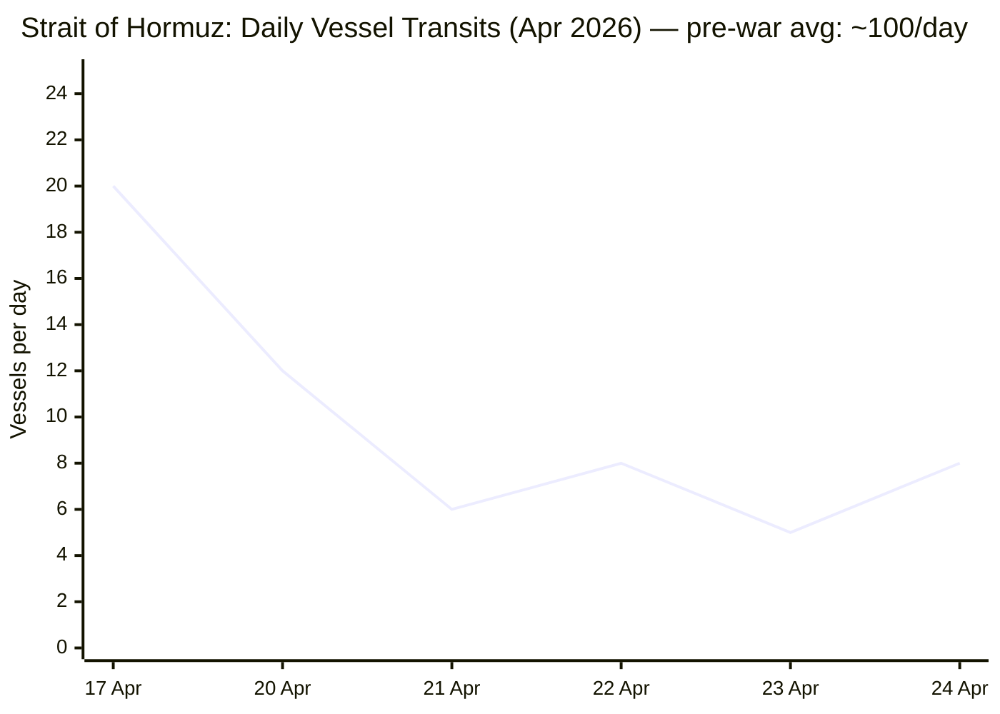

```yaml
---
brief_date: 2026-04-25
version: v1.2.1
run_time: "05:56 CET"
stories_published: 13
categories: [conflict, business, eu_affairs, technology, trends]
alert_counts:
  red: 4
  yellow: 7
  green: 2
ongoing_situations:
  - {name: "2026 Iran War", real_world_start: "2026-02-28", day: 57}
  - {name: "2026 Lebanon War", real_world_start: "2026-03-02", day: 55}
  - {name: "Russia–Ukraine War", real_world_start: "2022-02-24", day: 1522}
sources_fetched: 11
fetch_status:
  le_monde: "❌"
  faz: "❌"
  kommersant: "❌"
  xinhua: "✅"
  european_parliament: "⚠️"
expansion_queue: []
---
```

---

# 🌐 MORNING BRIEF
## Saturday, 25 April 2026 · 05:56 CET
### 13 stories across 5 categories

---

## DIGEST SUMMARY

| # | Category | Headline | Alert |
|---|----------|----------|-------|
| 1 | ⚔️ Conflict | Second Islamabad Round: Araghchi Arrives; Kushner and Witkoff en Route | 🔴 |
| 2 | ⚔️ Conflict | Iran War Day 57 — Hormuz Dual Blockade Holds; Third US Carrier Deployed | 🔴 |
| 3 | ⚔️ Conflict | Russia–Ukraine Day 1,522: Pokrovsk Active; Odesa Struck; Massive Drone Barrage | 🟡 |
| 4 | 💼 Business | Oil Supply Shock: Dated Brent at $25 Premium to Futures; Largest Disruption on Record | 🔴 |
| 5 | 💼 Business | Eurozone PMI Contraction Deepens; Germany Halves 2026 Growth Forecast | 🟡 |
| 6 | 🇪🇺 EU Affairs | Cyprus Summit: Art. 42.7 Mutual Defence Debate Opened; Arab Leaders Join | 🔴 |
| 7 | 🇪🇺 EU Affairs | Hungary Post-Election: Magyar Government Formation Under Way; Orbán Absent | 🟢 |
| 8 | 🇪🇺 EU Affairs | EU-GCC Defence Cooperation Deepens on Iranian Drone Technology | 🟡 |
| 9 | 🤖 Technology | Meta + Microsoft: 20,000+ Jobs Cut in AI-Driven Restructuring | 🟡 |
| 10 | 🤖 Technology | Intel Q1 2026: Revenue Up, Net Loss Widens | 🟢 |
| 11 | 📈 Trends | Pakistan's Unprecedented Rise as US-Iran Mediator | 🟡 |
| 12 | 📈 Trends | FAO Index at 8-Month High as Hormuz Closure Spreads to Food Prices | 🟡 |
| 13 | 📈 Trends | South Korea: Special Counsel Seeks 30-Year Sentence for Former President Yoon | 🟡 |

> Alert Level key: 🔴 High significance · 🟡 Developing · 🟢 Stable/Routine

---

## 🚨 SIGNAL BOARD

🔴 Iranian FM Araghchi in Islamabad; US envoys Kushner and Witkoff confirmed to arrive Saturday — first potential direct contact since failed 11-12 April round
🔴 Strait of Hormuz at ~8% of pre-war transit volume; Rystad Energy projects no recovery to 90% of normal flows before July
🟡 Eurozone PMI contracted at fastest pace since November 2024; Germany has halved its 2026 growth forecast due to the energy shock
🟢 Hungary's Magyar government formation begins, ending 16-year Orbán era and removing the principal EU veto on Ukraine accession
⚡ EU triggers Article 42.7 reflection for only the second time in history after Iranian drone struck UK base in Cyprus

---

## 🔄 ONGOING SITUATIONS

| Situation | Real-world start | Day # | Last significant development | Status |
|-----------|-----------------|-------|------------------------------|--------|
| 2026 Iran War | 28 Feb 2026 | Day 57 | Araghchi in Islamabad; Kushner/Witkoff en route; Lebanon ceasefire extended 3 weeks | 🔴 Active / ceasefire fragile |
| 2026 Lebanon War | 2 Mar 2026 | Day 55 | Trump extended 10-day ceasefire by 3 weeks (24 Apr); Hezbollah fired rockets at Shtula | 🟡 Ceasefire extended to ~17 May |
| Russia–Ukraine War | 24 Feb 2022 | Day 1,522 | 194 combat engagements on 23 Apr; Pokrovsk hottest sector; Odesa struck; 2 killed | 🔴 Active |

---

## ⚔️ CONFLICT ANALYST

> 🔎 **CONFLICT ANALYST** · 3 updates today

---

### 1. Second Islamabad Round: Araghchi and US Envoys Converge in Pakistan 🔴
**Alert:** 🔴
**Summary:** Iranian Foreign Minister Abbas Araghchi arrived in Islamabad late Friday, 24 April, for what Iranian state media described as bilateral consultations with Pakistani officials. The White House simultaneously confirmed that special envoy Steve Witkoff and Jared Kushner would depart for Pakistan on Saturday morning to engage in talks intermediated by Pakistan. A senior Pakistani official told Al Jazeera there was now a "high likelihood of a breakthrough." Iran publicly denied direct US-Iran negotiations were planned, reflecting a deliberate gap between public posture and private signalling. Key sticking points remain: the US naval blockade of Iranian ports (in place since 13 April), Iran's nuclear programme, and the Strait of Hormuz.
**Significance:** The convergence of both delegations in Islamabad on 25 April represents the most significant diplomatic movement since the first round ended inconclusively on 12 April. A second round of direct talks — even if characterised as "indirect" by Tehran — would substantively advance peace prospects and could move oil markets sharply lower.
**Sources:**

- [Al Jazeera — Iranian FM Araghchi to visit Pakistan as talks with US set to resume](https://www.aljazeera.com/features/2026/4/24/iranian-fm-araghchi-to-visit-pakistan-as-talks-with-us-set-to-resume) · 24 April 2026
- [CNN — US envoys will head to Pakistan on Saturday for fresh Iran talks](https://www.cnn.com/2026/04/24/world/live-news/iran-war-trump-israel-lebanon) · 24 April 2026

**Trend:** ⚡ Reversal
**Tags:** #Iran #peace-talks #Pakistan-mediation #MULTI-SOURCE #breaking

---

### 2. Iran War Day 57 — Hormuz Dual Blockade Holds; Third US Carrier Deployed 🔴
**Alert:** 🔴
**Summary:** The Strait of Hormuz remained at approximately 5–8% of pre-war transit levels on 24 April, with roughly 8 vessels tracked by LSEG, against a pre-conflict daily average exceeding 100. The IRGC seized two container ships and fired on a third during the week. A third US aircraft carrier arrived in the Central Command area of responsibility. Iran's parliamentary speaker stated that reopening the strait "is impossible" while the US blockade continues. Separately, Trump pledged the US military would destroy any vessel laying mines in the strait, as mine-clearance operations by US Navy minesweepers remained under way. The ceasefire — extended indefinitely pending a new Iranian proposal — technically holds, but both sides have accused each other of violations.
**Significance:** The dual blockade — Iran blocking most commercial transit while the US interdicts ships to and from Iranian ports — constitutes the largest maritime energy supply disruption on record. Rystad Energy projects oil flows through Hormuz will not recover to 90% of pre-war levels until July, and full refinery processing lag adds a further two months.
**Sources:**

- [CNBC — Strait of Hormuz remains basically closed as Iran seizes ships](https://www.cnbc.com/2026/04/22/iran-war-strait-hormuz-tanker-ship-trump-blockade.html) · 22 April 2026
- [Windward MIOC — Strait of Hormuz Daily Intelligence](https://insights.windward.ai/) · 23 April 2026
- [Al Jazeera — Iran war: What's happening on day 56](https://www.aljazeera.com/news/2026/4/24/iran-war-whats-happening-on-day-56-after-trump-extended-ceasefire) · 24 April 2026

**Trend:** → Stable (military standoff sustained)
**Tags:** #Iran #Hormuz #naval-blockade #MULTI-SOURCE #day-57 #escalation

---

### 3. Russia–Ukraine — Day 1,522: Pokrovsk Most Active Sector; Odesa Struck 🟡
**Alert:** 🟡
**Summary:** Ukraine's General Staff recorded 194 combat engagements on 23 April, with the highest activity in the Pokrovsk and Huliaipole sectors. Russian forces deployed an estimated 6,620 kamikaze drones and conducted 2,757 artillery attacks in a single day. A Russian overnight strike on Odesa hit a residential building and a merchant vessel in port, killing two and injuring 17. Ukraine struck the Atlant Aero facility in Taganrog, Russia, using Neptune cruise missiles. Russian total combat losses are estimated at approximately 1,323,460 personnel since February 2022, per Ukrainian General Staff data. The Netherlands' AIVD intelligence service publicly stated the country faces its greatest national security threat since the Second World War. Russia's Defence Ministry claims to have completed the seizure of the Luhansk oblast.
**Significance:** The sheer volume of Russian aerial and artillery pressure signals a sustained attrition posture through spring 2026. Ukraine's strikes on Russian oil export infrastructure and deep-rear targets are a parallel attrition strategy aimed at constraining logistics and energy revenues ahead of any potential peace framework.
**Sources:**

- [Ukrinform — War updates 24 April 2026](https://www.ukrinform.net/rubric-ato) · 24 April 2026
- [EMPR — Russia–Ukraine War Updates as of 24 April 2026](https://empr.media/news/war/russia-ukraine-war-updates-key-developments-as-of-april-24-2026/) · 24 April 2026

**Trend:** → Stable
**Tags:** #Ukraine #Russia #frontline #drone-warfare #MULTI-SOURCE #day-1522

📚 *Background reading:* [Kyiv Independent — Daily Ukraine war coverage](https://kyivindependent.com) · [IISS — Iran and the 2026 Hormuz Crisis](https://www.iiss.org)

---

## 💼 BUSINESS ANALYST

> 💼 **BUSINESS ANALYST** · 2 updates today

---

### 4. Oil Supply Shock Deepens — Dated Brent at $25 Premium to Futures 🔴
**Alert:** 🔴
**Summary:** Dated Brent crude spot prices surged to a premium exceeding $25 per barrel over the front-month futures contract in early April — the widest observed backwardation attributed to near-term supply tightness, per the US Energy Information Administration. Front-month Brent futures traded at approximately $103–107 per barrel in the week of 21–25 April, up approximately 59% year-on-year. The EIA attributes the extreme backwardation to immediate supply shortfalls caused by the Hormuz closure and the US counter-blockade. Several Arab Gulf states cut or suspended oil production following Iranian attacks. Rystad Energy projects oil flows will not recover to 90% of pre-war levels before July. 
📎 *See also: Conflict §2 — Strait of Hormuz dual blockade driving the disruption.*
**Market signal:** Strongly bearish for energy-importing economies and consumer sectors; bullish for energy exporters including Russia, Saudi Arabia, and Norway, which are benefiting from historically elevated prices.
**Sources:**

- [EIA — Brent crude oil spot prices surge past futures price in April](https://www.eia.gov/todayinenergy/detail.php?id=67544) · 24 April 2026
- [Trading Economics — Brent crude oil](https://tradingeconomics.com/commodity/brent-crude-oil) · 24 April 2026

**Trend:** ↗ Escalating
**Tags:** #Brent #oil-price #supply-shock #Hormuz #MULTI-SOURCE #data-point

---

### 5. Eurozone PMI Contracts at Fastest Pace Since November 2024; Germany Halves Growth Forecast 🟡
**Alert:** 🟡
**Summary:** The Eurozone's private sector contracted in April at its fastest pace since November 2024, driven by soaring energy costs from the Iran war. Germany's Economics Ministry halved its 2026 national growth forecast, citing the energy shock. EUR/USD fell to $1.17, its weakest level in two weeks, as Hormuz tensions persisted and diplomatic momentum stalled. The ECB now projects Eurozone GDP growth of 0.9% for 2026 and headline inflation averaging 2.6%, a sharp revision from pre-war targets. The ECB's next rate decision is scheduled for Thursday, 30 April, with markets fully pricing in a hold and beginning to price in rate increases later in 2026 if energy-driven inflation proves persistent.
**Market signal:** Bearish for European equities and the euro; stagflationary dynamics are building as energy costs compress household purchasing power and corporate margins simultaneously.
**Sources:**

- [Trading Economics — EUR/USD](https://tradingeconomics.com/euro-area/currency) · 24 April 2026
- [CNBC — Euro zone inflation smashes through ECB target](https://www.cnbc.com/2026/03/31/euro-zone-inflation-smashes-through-ecb-target-to-2point5percent-.html) · 31 March 2026

**Trend:** ↗ Escalating
**Tags:** #ECB #eurozone #inflation #stagflation #energy-markets #GDP-forecast

📚 *Background reading:* [Bruegel — European energy crisis and economic implications](https://www.bruegel.org) · [Atlantic Council — Iran war economic impact](https://www.atlanticcouncil.org)

---

## 🇪🇺 EU AFFAIRS ANALYST

> 🇪🇺 **EU AFFAIRS ANALYST** · 3 updates today

---

### 6. Cyprus EU Summit — Article 42.7 Mutual Defence Debate Opened; MFF Discussions Launch 🔴
**Alert:** 🔴
**Summary:** EU leaders gathered in Ayia Napa, Cyprus on 23–24 April for an informal summit chaired by European Council President António Costa and hosted by Cypriot President Nikos Christodoulides, whose country holds the rotating Council Presidency. The summit opened an in-depth review of Article 42.7 of the Treaty on European Union — the bloc's mutual defence clause — used only once previously, by France in 2015. The trigger was an Iranian Shahed drone strike on a British military base in Cyprus in early March. Leaders from Lebanon, Syria, Jordan, Egypt, and Gulf Cooperation Council states attended Friday's joint session. EP President Roberta Metsola addressed heads of state on 24 April. The Multiannual Financial Framework 2028–2034 was also on the agenda, with the EP Budget Committee having adopted a draft interim report on 15 April. Ukrainian President Zelenskyy participated via videoconference to press his country's accession case; Russian President Orbán was conspicuously absent following his electoral defeat.
**Legislative/policy stage:** Informal summit; no binding decisions. Article 42.7 "playbook" discussions opened; Commission to develop formal operational guidelines. MFF negotiations to continue throughout 2026.
**Sources:**

- [European Parliament — Press kit, informal EU summit 23-24 April 2026](https://www.europarl.europa.eu/news/en/press-room/20260423IPR41854/) · 23 April 2026
- [Council of the EU — Informal meeting of heads of state or government, 23-24 April 2026](https://www.consilium.europa.eu/en/meetings/european-council/2026/04/23-24/) · 23 April 2026
- [Euronews — EU leaders meet in Cyprus to talk Ukraine, Hormuz, energy and mutual defence](https://www.euronews.com/my-europe/2026/04/23/eu-leaders-meet-in-cyprus-to-talk-ukraine-hormuz-energy-and-mutual-defence) · 23 April 2026

**Trend:** ↗ Escalating
**Tags:** #EU-institutions #EU-defence #MFF #Ukraine-aid #MULTI-SOURCE #institutional

---

### 7. Hungary — Magyar Government Formation Under Way; EU Relationship Reset Expected 🟢
**Alert:** 🟢
**Summary:** Péter Magyar's Tisza Party secured 138 of 199 parliamentary seats in the 12 April election (53.6% of the vote) — Hungary's first two-thirds supermajority won by an opposition party in the democratic era, with record 79.6% turnout. Viktor Orbán conceded defeat after 16 years in power. Government formation is under way. The Tisza victory is expected to unlock the release of EU funds frozen under rule-of-law conditionality, unblock EU enlargement discussions stalled by Orbán's vetoes on Ukraine's accession, and end Hungary's pattern of blocking EU sanctions packages targeting Russia.
**Legislative/policy stage:** New Hungarian parliament to convene; government formation in progress. EU-Hungary Article 7 rule-of-law proceedings to be reviewed once new government presents a reform roadmap to Brussels.
**Sources:**

- [Al Jazeera — Peter Magyar wins Hungary election](https://www.aljazeera.com/news/2026/4/12/hungary-election-early-results-show-magyars-tisza-ahead-of-orbans-fidesz) · 12 April 2026
- [CNN — Hungary election results](https://www.cnn.com/2026/04/12/world/live-news/hungary-election-orban-magyar) · 12 April 2026

**Trend:** ⚡ Reversal
**Tags:** #Magyar #Hungary #EU-funds #rule-of-law #EU-election #MULTI-SOURCE

---

### 8. EU–GCC: Deepening Defence Cooperation on Iranian Drone Technology and Gulf Security 🟡
**Alert:** 🟡
**Summary:** EU High Representative Kaja Kallas announced on 22 April that the EU is engaging closely with Gulf Cooperation Council partners to restrict Russian technology upgrades in Iranian drones used against Arab Gulf states, including possible co-operation on sanctions. GCC Secretary-General Jasem Al Budaiwi told the European Parliament's Foreign Affairs Committee that EU-GCC alignment is "no longer a political option, but a strategic necessity." Greece, Italy, and France dispatched naval vessels to assist Cyprus after the drone strike on the British base in early March. The European Commission has separately proposed a full resumption of relations with Syria, toppled 16 months ago. EU and Arab leaders attending the Cyprus summit jointly discussed coordinated energy supply diversification and migration management in the context of potential displacement from Lebanon and Syria.
**Legislative/policy stage:** Diplomatic engagement ongoing; no formal framework agreement concluded. EU-Syria High Level Dialogue to be scheduled; GCC security co-operation to be formalised through dedicated EU-GCC track.
**Sources:**

- [The National — Middle East leaders head for war summit in Cyprus with European counterparts](https://www.thenationalnews.com/news/europe/2026/04/22/middle-east-leaders-head-for-war-summit-in-cyprus-with-european-counterparts/) · 22 April 2026
- [Xinhua — EU leaders to address Iran war fallout, mutual defence at Cyprus summit](https://english.news.cn/20260424/ee1764ca7fa342cc9bc0f3c6279daf98/c.html) · 24 April 2026

**Trend:** ↗ Escalating
**Tags:** #EU-institutions #EU-defence #diplomacy #sanctions #MULTI-SOURCE

📚 *Background reading:* [ECFR — EU strategic autonomy and the Iran crisis](https://ecfr.eu/) · [CFR — Gulf states and the Iran war](https://www.cfr.org/)

---

## 🤖 TECHNOLOGY ANALYST

> 🤖 **TECHNOLOGY ANALYST** · 2 updates today

---

### 9. Meta and Microsoft: 20,000+ Cuts Confirm AI-Driven Structural Labour Shift 🟡

**Alert:** 🟡
**Summary:** Meta confirmed on 24 April it will cut approximately 8,000 employees (10% of its workforce of ~79,000), with employee notifications beginning 20 May and 6,000 open roles simultaneously cancelled. Microsoft launched its first voluntary retirement programme in its 51-year history on the same day, potentially affecting over 12,000 additional positions. Meta's chief people officer cited the cuts as part of efforts to "run the company more efficiently and offset other investments" — primarily its $115–135 billion 2026 capital expenditure plan for AI infrastructure. Over 92,000 tech workers have been laid off in 2026 to date, per Layoffs.fyi, bringing the post-2020 tech total to approximately 900,000. [MULTI-SOURCE]
**Analyst note:** Within 12–24 months, the simultaneous surge in AI infrastructure capex and aggressive headcount reduction by the largest tech firms will widen the productivity gap between AI-native and lagging enterprises, structurally compressing demand for entry-level and generalised IT roles while concentrating hiring in AI engineering and applied ML functions.
**Sources:**

- [CNBC — 20,000 job cuts at Meta, Microsoft raise concern that AI-driven labour crisis is here](https://www.cnbc.com/2026/04/24/20k-job-cuts-at-meta-microsoft-raise-concern-of-ai-labor-crisis-.html) · 24 April 2026
- [NPR — Meta will lay off 10% of its staff](https://www.npr.org/2026/04/23/nx-s1-5797855/meta-layoffs-10-percent-staff) · 23 April 2026

**Trend:** → Stable (ongoing secular trend)
**Tags:** #tech-layoffs #AI #LLM #MULTI-SOURCE

---

### 10. Intel Q1 2026 — Revenue Up, Net Loss Widens 🟢
**Alert:** 🟢
**Summary:** Intel reported higher first-quarter 2026 revenue alongside a wider net loss, reflecting continued restructuring costs and the capital-intensive phase of its foundry transition. The results arrive as Intel pursues its Intel Foundry Services strategy against competitive pressure from TSMC, Nvidia, and AMD. Detailed segment financials were not available from Xinhua's initial report; full results to be reviewed as additional data becomes available.
**Analyst note:** A widening net loss alongside revenue growth indicates Intel's multi-year foundry turnaround remains in a value-destructive investment phase; external foundry breakeven is not expected before 2027, making near-term investor patience a structural requirement.
**Sources:**

- [Xinhua — Intel posts higher Q1 revenue, wider net loss](https://english.news.cn/northamerica/20260424/d753b1becb79410ca9757420cbe701a7/c.html) · 24 April 2026

**Trend:** → Stable
**Tags:** #semiconductor #earnings #AI

📚 *Background reading:* [CSIS — Semiconductor industry and AI competitive dynamics 2026](https://www.csis.org)

---

## 📈 TRENDS ANALYST

> 📈 **TRENDS ANALYST** · 3 updates today

---

### 11. Pakistan's Unprecedented Mediation Rise — First Direct US-Iran Contact Since 1979 🟡
**Alert:** 🟡
**Summary:** Pakistan's central role brokering the 8 April ceasefire and hosting the only direct US-Iran talks since the 1979 Islamic Revolution marks a structural reorientation of Islamabad's geopolitical position. The Pakistani team — Prime Minister Shehbaz Sharif, Foreign Minister Ishaq Dar, and Army Chief Field Marshal Asim Munir — co-delivered a five-point peace initiative with China on 31 March, hosted 21 hours of direct talks on 11–12 April, and as of 25 April is facilitating the arrival of Araghchi and the Witkoff-Kushner delegation for a potential second round. The US, Iran, Saudi Arabia, China, and EU have all engaged with Pakistani interlocutors, reflecting an unusual convergence of great-power acknowledgement of Islamabad's intermediary value. 📎 *See also: Conflict §1 — Second Islamabad round under way.*
**Horizon:** Medium-term. Pakistan's emergence as credible US-Iran mediator could durably reshape its strategic relationships with Washington, Tehran, Beijing, and Gulf states over the coming 6–12 months, providing diplomatic leverage that may offset its chronic economic and security vulnerabilities.
**Sources:**

- [Al Jazeera — Pakistan races against time to get Iran back to US talks](https://www.aljazeera.com/news/2026/4/21/pakistan-races-against-time-to-get-iran-back-to-us-talks-as-truce-end-nears) · 21 April 2026
- [Wikipedia — Islamabad Talks](https://en.wikipedia.org/wiki/Islamabad_Talks) · 25 April 2026

**Trend:** ↗ Escalating
**Tags:** #Pakistan-mediation #peace-talks #diplomacy #Iran #MULTI-SOURCE

---

### 12. FAO Index at 8-Month High — Hormuz Closure Spreading to Agricultural Input Costs 🟡
**Alert:** 🟡
**Summary:** The FAO Food Price Index averaged 128.5 points in March 2026, up 2.4% from February — the highest since September 2025 and the second consecutive monthly increase. All five commodity groups rose, with vegetable oils (+5.1%), sugar (+7.2%), and wheat (+4.3%) recording the sharpest climbs, driven in part by elevated energy prices linked to the Near East conflict. FAO Chief Economist Máximo Torero warned that if energy cost pressures persist beyond 40 days, farmers face critical choices between reducing input use or shifting to less fertiliser-intensive crops, with consequences for 2026–27 yields. The Hormuz closure has disrupted up to 30% of globally traded fertiliser, normally transiting the strait. The World Food Programme warned on 24 April of "alarmingly high" acute food insecurity in ten countries; Gaza food prices are 85% above pre-Iran-war levels.
**Horizon:** Short to medium-term. If the Hormuz closure extends beyond May, fertiliser supply disruption during northern hemisphere planting will reduce 2026 harvest yields, tightening global supply into 2027. The FAO's April release (scheduled 8 May) will be a critical early indicator.
**Sources:**

- [FAO — Food Price Index rises in March as Near East conflict raises energy costs](https://www.fao.org/newsroom/detail/fao-food-price-index-rises-in-march-as-near-east-conflict-raises-energy-costs/en) · 3 April 2026
- [CNN — Live updates: Iran war, WFP food insecurity report](https://www.cnn.com/2026/04/24/world/live-news/iran-war-trump-israel-lebanon) · 24 April 2026

**Trend:** ↗ Escalating
**Tags:** #food-security #food-prices #Hormuz #humanitarian #MULTI-SOURCE #data-point

---

### 13. South Korea — Special Counsel Seeks 30-Year Sentence for Former President Yoon 🟡
**Alert:** 🟡
**Summary:** South Korea's special counsel requested a 30-year prison sentence for former President Yoon Suk-yeol on charges of general treason, following his short-lived declaration of martial law in December 2024. The prosecution request — the most severe sentence sought against a Korean head of state in the democratic era — was confirmed by Xinhua on 24 April. A verdict has not yet been issued. The trial continues against a backdrop of heightened concern about democratic institutions in East Asia, where Taiwan, South Korea, and Japan face simultaneous geopolitical and domestic political pressures.
**Horizon:** Short-term. The verdict will set a precedent for constitutional accountability of elected leaders in South Korea and will influence political positioning ahead of the 2027 presidential election. An acquittal or reduced sentence could embolden future extra-constitutional challenges.
**Sources:**

- [Xinhua — S. Korea's special counsel seeks 30-year sentence for ex-president Yoon over general treason](https://english.news.cn/asiapacific/20260424/62f06bebb0924a94a22aacafbdc781bb/c.html) · 24 April 2026

**Trend:** → Stable
**Tags:** #rule-of-law #election #diplomacy

📚 *Background reading:* [RAND — Pakistan mediation and regional stability](https://www.rand.org) · [CFR — Iran ceasefire and nuclear negotiations](https://www.cfr.org/)

---

## 📊 KEY DATA OF THE DAY

> 📊 **DATA OFFICER** · 7 indicators

| Indicator | Value | Δ vs prior session | Δ vs 7 days ago | Note | Source | URL |
|-----------|-------|-------------------|-----------------|------|--------|-----|
| EUR/USD | 1.1700 | N/A | N/A | 2-week low; ECB rate hold expected 30 Apr; Eurozone PMI at fastest contraction since Nov 2024 | Trading Economics | [link](https://tradingeconomics.com/euro-area/currency) |
| Brent Crude (USD/bbl) | 103.09 | −1.47% (vs $104.63 close 24 Apr) | N/A | Up ~59% YoY; Dated Brent at $25 premium over futures — extreme backwardation on Hormuz closure | EIA / Trading Economics | [link](https://www.eia.gov/todayinenergy/detail.php?id=67544) |
| Gold (XAU/USD) | 4,710.58 | N/A | N/A | Down from ATH of $5,595 (29 Jan 2026); still +37.6% YoY; safe-haven premium remains elevated | LiteFinance / Trading Economics | [link](https://www.litefinance.org/blog/analysts-opinions/gold-price-prediction-forecast/) |
| IMF Global Growth 2026 | 3.1% | N/A vs Jan WEO | N/A vs Oct WEO | Reference forecast; adverse scenario 2.5%; severe scenario 2.0%; headline inflation 4.4% | IMF WEO Apr 2026 | [link](https://www.imf.org/en/publications/weo/issues/2026/04/14/world-economic-outlook-april-2026) |
| EU CPI YoY (Mar 2026) | 2.6% | +0.7 pp (Feb: 1.9%) | +0.9 pp (Jan: 1.7%) | Energy component: +5.1% YoY, highest since Feb 2023; ECB 2026 full-year forecast also 2.6% | Eurostat 16 Apr 2026 | [link](https://ec.europa.eu/eurostat/web/products-euro-indicators/w/2-16042026-ap) |
| FAO Food Price Index | 128.5 pts | +2.4% (Feb: 125.3) | N/A | March 2026 — latest available; highest since Sep 2025; +1.0% YoY; all commodity groups up | FAO 3 Apr 2026 | [link](https://www.fao.org/newsroom/detail/fao-food-price-index-rises-in-march-as-near-east-conflict-raises-energy-costs/en) |
| Hormuz transit volume (vessels/day) | ~8 (24 Apr) | +60% (brief spike to ~20 on 17 Apr; reverted to 3–8 range) | N/A | ~92% below pre-war (~100/day); dual blockade in force since 13 Apr; recovery to 90% normal not before July (Rystad) | LSEG / Windward MIOC | [link](https://insights.windward.ai/) |

**Data commentary:** The extreme backwardation in Brent crude — Dated spot prices at a $25+ premium over futures — signals acute near-term supply tightness concentrated at the Hormuz choke point rather than demand-driven pressure, meaning futures markets expect partial normalisation as diplomacy progresses. Gold's modest retreat from its January all-time high suggests some reduction in peak-crisis safe-haven premiums as the ceasefire holds, but the metal remains elevated relative to pre-2026 norms, reflecting the structural geopolitical risk premium. The EU CPI jump to 2.6% in March, driven almost entirely by the energy component, places the ECB in a difficult position ahead of its 30 April meeting: raising rates into a contractionary PMI environment risks deepening the Eurozone slowdown, while holding risks embedding energy-led inflation expectations.

---

## 📊 CHARTS

### Chart 2 — Strait of Hormuz Daily Vessel Transits, April 2026



*Sources: LSEG shipping data via CNBC (20, 21, 22 Apr); Windward MIOC (23 Apr); Polymarket/LSEG (17 Apr). Pre-war baseline (~100 vessels/day) not shown on chart. Note: 17 Apr spike reflects brief re-opening before talks collapsed and blockade resumed.*

---

> *Chart 1 (Brent crude trend): Omitted — insufficient verified daily data points spanning the full conflict period to produce a reliable chart per protocol. Daily Brent data for the 28 Feb–16 Apr period not returned in verified tool calls this run.*
> 
> *Chart 3 (cross-brief structural trend): Omitted — first run; no prior brief data available.*

---

## ⚙️ AGENT METADATA

| Field | Value |
|-------|-------|
| Agent version | MORNING BRIEF v1.2.1 |
| Run timestamp | 2026-04-25T05:56:55+02:00 |
| Fetch status | Le Monde ❌ · FAZ ❌ · Kommersant ❌ · Xinhua ✅ · EP ⚠️ (fetched; no 24h press releases returned in structured form; EP press kit URL fetched directly) |
| Sources queried | 11 / 11 (all Tier 1 and Tier 2 sources searched or fetched; Tier 3 excluded from tally) |
| Stories surfaced | 21 (before editorial filter) |
| Stories published | 13 (after editorial filter) |
| Languages processed | EN, FR (search fallback), DE (search fallback) |
| Output language | English (British) |
| Date validated | ✅ Confirmed 25 April 2026 |
| Expansion Queue | None |

---

*MORNING BRIEF is an AI-assisted digest. All summaries are paraphrased from original sources. Verify time-sensitive information at the linked URLs before acting. Output language: British English.*
