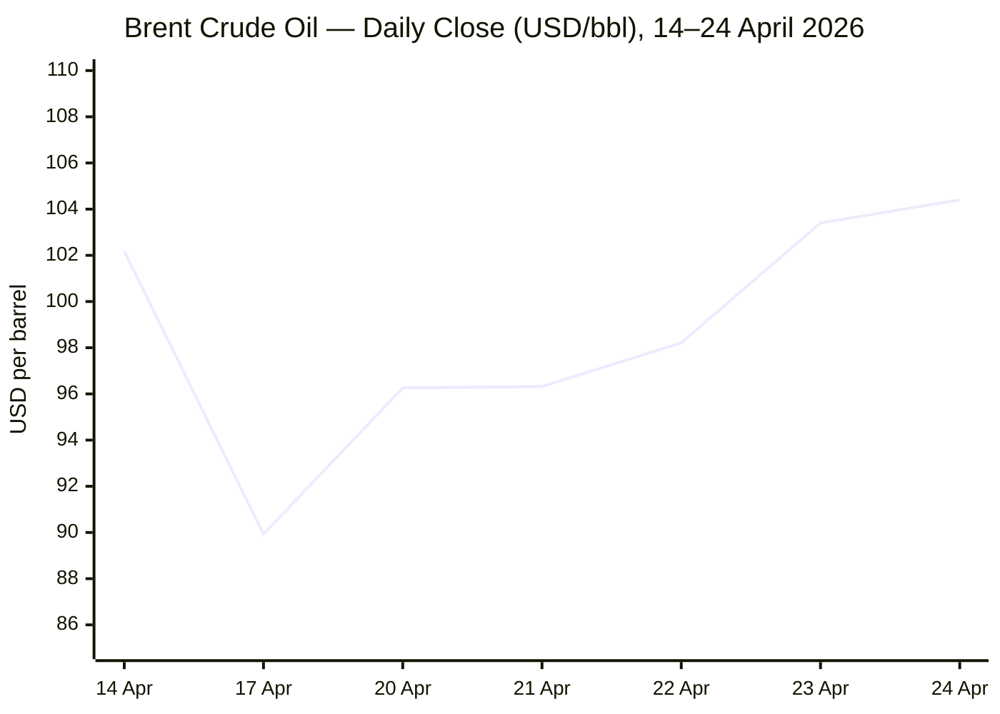
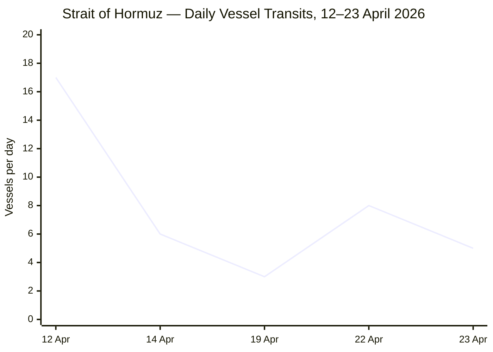

````yaml
---
brief_date: 2026-04-26
version: v1.2.1
run_time: "05:55 CET"
stories_published: 13
categories: [conflict, business, eu_affairs, technology, trends]
alert_counts:
  red: 3
  yellow: 9
  green: 1
ongoing_situations:
  - {name: "Russia–Ukraine War", real_world_start: "2022-02-24", day: 1523}
  - {name: "2026 Iran War / Hormuz Crisis", real_world_start: "2026-02-28", day: 58}
  - {name: "Lebanon War / Ceasefire", real_world_start: "2026-02-28", day: 58}
  - {name: "Hungary Government Formation (post-Orbán)", real_world_start: "2026-04-12", day: 15}
sources_fetched: 11
fetch_status:
  le_monde: "❌"
  faz: "❌"
  kommersant: "❌"
  xinhua: "✅"
  european_parliament: "⚠️"
expansion_queue: []
---
````

---

# 🌐 MORNING BRIEF
## Sunday, 26 April 2026 · 05:55 CET
### 13 stories across 5 categories

---

## DIGEST SUMMARY

| # | Category | Headline | Alert |
|---|----------|----------|-------|
| 1 | ⚔️ Conflict | Iran War Day 58: Pakistan talks abort — Araghchi departs, Trump cancels envoy mission | 🔴 |
| 2 | ⚔️ Conflict | Ukraine Day 1,523: Ukraine intercepts 580 drones overnight; Ukrainian strikes reach Urals | 🟡 |
| 3 | ⚔️ Conflict | Israel–Lebanon: Ceasefire extended 3 weeks; Netanyahu discloses cancer treatment | 🟡 |
| 4 | 💼 Business | Brent crude closes at $104.40, +14% on the week — Hormuz at 5% of normal transit | 🔴 |
| 5 | 💼 Business | IMF April WEO: Global growth cut to 3.1%; inflation revised up to 4.4% | 🟡 |
| 6 | 💼 Business | Meta announces 10% workforce cut (8,000 jobs) effective 20 May — AI capex surge | 🟡 |
| 7 | 🇪🇺 EU Affairs | Cyprus Summit: EU endorses AccelerateEU, invokes Article 42.7 debate after Akrotiri drone strike | 🟡 |
| 8 | 🇪🇺 EU Affairs | Hungary Day 15: Orbán exits parliament; Magyar government formation begins; €18bn EU funds at stake | 🟡 |
| 9 | 🤖 Technology | DeepSeek V4 Flash/Pro launch claims top open-source coding benchmarks; 1M-token context | 🟡 |
| 10 | 🤖 Technology | AI-driven workforce restructuring: Meta, Microsoft accelerate efficiency cuts to fund AI build-out | 🟡 |
| 11 | 📈 Trends | Food security: FAO FFPI rises for second consecutive month to 128.5 — energy-war transmission confirmed | 🔴 |
| 12 | 📈 Trends | Pakistan as mediator: structural geopolitical reorientation survives failed second round of talks | 🟡 |
| 13 | 📈 Trends | EU energy dependency: Von der Leyen confirms €25bn extra fossil fuel bill; AccelerateEU sets 2027 milestones | 🟢 |

> Alert Level key: 🔴 High significance · 🟡 Developing · 🟢 Stable/Routine

---

## 🚨 SIGNAL BOARD

🔴 **Pakistan peace talks abort at Day 58: Iran's FM Araghchi departs Islamabad without meeting US envoys — Trump cancels Witkoff-Kushner mission hours later; Hormuz diplomatic impasse deepens**
🔴 **Brent crude at $104.40/bbl — weekly gain of 14%, largest since early March; Strait of Hormuz averaging 3–8 vessels/day versus pre-war 100+; Dated Brent spot premium >$25/bbl over futures**
🟡 **EU CPI hits 2.6% in March — first breach of the ECB's 2% target since January 2025; energy inflation component +5.1% YoY; Eurozone private sector contraction accelerating in April**
🟡 **Hungary Day 15: Orbán confirms he will not take up parliamentary mandate; Magyar government formation clears a key obstacle — €10.4bn RRF tranche expires 31 August 2026**
⚡ **Trump reverses course within 24 hours: announces then cancels Islamabad envoy mission as Araghchi departs — signal that Iran is not yet ready for a second formal round of direct talks**

---

## 🔄 ONGOING SITUATIONS

| Situation | Real-world start | Day # | Last significant development | Status |
|-----------|-----------------|-------|------------------------------|--------|
| Russia–Ukraine War | 24 Feb 2022 | Day 1,523 | Mass drone-missile strike on Dnipro overnight; 580 drones intercepted; Ukrainian drones reach the Urals | 🔴 Active |
| 2026 Iran War / Hormuz Crisis | 28 Feb 2026 | Day 58 | Second-round Pakistan talks abort; Trump cancels envoy trip; Hormuz at ~5% of pre-war transit volume | 🔴 Active |
| Lebanon War / Ceasefire | 28 Feb 2026 | Day 58 | Israel–Lebanon ceasefire extended 3 weeks (24 Apr); Israeli strike kills 3 in south Lebanon despite truce; Hezbollah retaliates | 🟡 Ceasefire |
| Hungary Government Formation | 12 Apr 2026 | Day 15 | Orbán confirms he will not take parliamentary mandate (25 Apr); Magyar government formation under way | 🟡 Transitional |

---

## 6. ANALYST SECTIONS

---

> ⚔️ **CONFLICT ANALYST** · 3 updates today

### 1. Iran War / Hormuz Crisis — Second-round Pakistan talks abort 🔴

**Alert:** 🔴
**Summary:** Iran's Foreign Minister Abbas Araghchi arrived in Islamabad on 24 April, then departed on 25 April without direct talks with US officials, whose government had confirmed Steve Witkoff and Jared Kushner would travel to Pakistan on Saturday. Within hours of Araghchi's departure, President Trump announced cancellation of the US envoy mission. Iran's parliamentary speaker stated the Strait of Hormuz "cannot be reopened" while the US naval blockade of Iranian ports — in force since 13 April — remains in place. A 3rd US aircraft carrier is now deployed in the Central Command area of responsibility, and Trump pledged to destroy any vessel laying mines in the strait. The ceasefire between the US and Iran remains in force but has no agreed diplomatic track for extension.
**Significance:** The collapse of the second round before it began signals that the gap over the core issues — Hormuz reopening, sanctions relief, and Iran's nuclear programme — remains unbridged. With the blockade in force on both sides, the dual chokepoint risks becoming self-reinforcing absent a new mediating framework, potentially escalating toward the IMF's adverse scenario (global growth 2.5%).
**Sources:**
- [Washington Post — Trump calls off Witkoff, Kushner trip to Pakistan for Iran peace talks](https://www.washingtonpost.com/world/2026/04/25/iran-us-pakistan-ceasefire-talks/) · 25 April 2026
- [NPR — Iran's foreign minister leaves Pakistan, then Trump cancels U.S. delegation's travel](https://www.npr.org/2026/04/25/nx-s1-5799372/iran-middle-east-updates) · 25 April 2026
- [Al Jazeera — Iran war: What's happening on day 56](https://www.aljazeera.com/news/2026/4/24/iran-war-whats-happening-on-day-56-after-trump-extended-ceasefire) · 24 April 2026 [MULTI-SOURCE]

**Trend:** → Stable (ceasefire holds nominally; diplomatic track broken)
**Tags:** #Iran #peace-talks #Hormuz #naval-blockade #Pakistan-mediation #MULTI-SOURCE #escalation

---

### 2. Russia–Ukraine War — Mass overnight strike wave; Ukrainian drones reach Urals 🟡

**Alert:** 🟡
**Summary:** Ukraine's air defences neutralised 30 Russian missiles and 580 drones in the overnight period of 24–25 April — an intercept rate above 90%, consistent with ISW data showing improved Ukrainian drone defence since spring 2025. A combined missile-and-drone attack partially destroyed a residential building in Dnipro, injuring 14, including a child; four people were killed in the Kherson region. Russia launched 83 airstrikes over 24 hours and recorded 236 combat engagements. Ukrainian long-range drones struck Russian oil infrastructure and, in a new milestone, reached targets in the Urals — the greatest distance achieved since the war began. ISW data for 14–21 April shows a Russian net territorial loss of 5 square miles.
**Significance:** The Urals strike extends Ukraine's strategic long-range strike capacity beyond the Volga basin, threatening Russian industrial and logistics nodes previously considered beyond reach. Combined with continued Russian net territorial losses, the frontline dynamic remains attritional but with Ukraine holding operational initiative in the drone campaign.
**Sources:**
- [Ukrinform — Ukraine war updates 25 April 2026](https://www.ukrinform.net/rubric-ato) · 25 April 2026
- [Russia Matters — Russia-Ukraine War Report Card, 22 April 2026](https://www.russiamatters.org/news/russia-ukraine-war-report-card/russia-ukraine-war-report-card-april-22-2026) · 22 April 2026 [MULTI-SOURCE]

**Trend:** → Stable (war of attrition; Ukrainian defensive edge maintained)
**Tags:** #Ukraine #Russia #drone-warfare #frontline #missile-strike #MULTI-SOURCE #day-1523

---

### 3. Israel–Lebanon Ceasefire — Extended 3 weeks; Netanyahu cancer disclosed 🟡

**Alert:** 🟡
**Summary:** President Trump announced on 24 April that the 10-day Israel–Lebanon ceasefire is extended by three weeks following ambassador-level talks at the White House, now covering the period through approximately 15 May. Despite the extension, an Israeli strike killed three people in south Lebanon on 24 April; Hezbollah responded with a rocket salvo at the Shtula settlement in northern Israel, citing ceasefire violations. A UNIFIL Indonesian peacekeeper died of wounds sustained in a 29 March attack on a UN base. Separately, Prime Minister Benjamin Netanyahu disclosed he was treated for early-stage prostate cancer two months ago, saying he withheld the news so it would not be released "at the height of the war." Iran insisted Lebanon must be included in any broader ceasefire framework.
**Significance:** The continuation of Israeli strikes and Hezbollah responses within a "ceasefire" framework reflects the gap between diplomatic announcements and ground-level enforcement. Iran's demand to link Lebanon to the wider settlement complicates both diplomatic tracks simultaneously and may be used as leverage in the stalled Islamabad process.
**Sources:**
- [Al Jazeera — Iran war: What's happening on day 56](https://www.aljazeera.com/news/2026/4/24/iran-war-whats-happening-on-day-56-after-trump-extended-ceasefire) · 24 April 2026
- [Xinhua — Trump says ceasefire between Israel, Lebanon to be extended by 3 weeks](https://english.news.cn/20260424/6f54e6c79dd14de08bd830ba3b5b0257/c.html) · 24 April 2026 [MULTI-SOURCE]

**Trend:** ↘ De-escalating (ceasefire extended but violations persist)
**Tags:** #Israel #Lebanon #Hezbollah #ceasefire #peace-talks #MULTI-SOURCE

📚 *Background reading:* [Al Jazeera — Iran war updates archive](https://www.aljazeera.com/news/liveblog/2026/4/24/iran-war-live-lebanon-truce-extended-trump-says-time-not-on-tehrans-side) · [House of Commons Library — US-Iran ceasefire and nuclear talks 2026](https://commonslibrary.parliament.uk/research-briefings/cbp-10637/) · 25 April 2026

---

> 💼 **BUSINESS ANALYST** · 3 updates today

### 4. Oil Markets — Brent closes at $104.40, weekly gain of 14% 🔴

**Alert:** 🔴
**Summary:** Brent crude settled at $104.40 per barrel on 24 April, a weekly gain of approximately 14% — the largest since early March — as Pakistan peace-talk hopes briefly lifted prices intraday to $106 before a retreat. The US Energy Information Administration noted the Dated Brent spot price carried a premium of more than $25 per barrel over the front-month futures contract in early April, reflecting extreme near-term supply tightness caused by the Hormuz closure. The S&P 500 closed at 7,165.08 (+0.80%) and the Nasdaq at 24,836.60 (+1.63%) on diplomatic optimism, which has since reversed with Saturday's news of the talk collapse.
**Market signal:** Bearish on diplomacy: the Pakistan talk abort will reverse Friday's partial risk-on move and likely push Brent back toward $106–108 at Monday's open, absent a new diplomatic signal.
**Sources:**
- [EIA Today in Energy — Brent spot prices surge past futures price in April](https://www.eia.gov/todayinenergy/detail.php?id=67544) · 24 April 2026
- [Trading Economics — Brent crude oil price](https://tradingeconomics.com/commodity/brent-crude-oil) · 24 April 2026 [MULTI-SOURCE]

**Trend:** ↗ Escalating
**Tags:** #Brent #oil-price #Hormuz #market-shock #supply-shock #energy-markets #MULTI-SOURCE

📎 See also: Conflict § Story 1 — Iran/Hormuz diplomacy collapse removes near-term relief premium

---

### 5. Global Macro — IMF April WEO: Growth cut to 3.1%, inflation revised to 4.4% 🟡

**Alert:** 🟡
**Summary:** The IMF's April 2026 World Economic Outlook, published 14 April, revised the global growth forecast down to 3.1% for 2026 under its reference scenario (a limited, short-lived conflict), from an implied pre-war upgrade trajectory of approximately 3.3–3.4%. Global headline inflation is now projected at 4.4%, up from prior estimates. The IMF's adverse scenario — an extended Hormuz closure through end of year — implies growth of 2.5% and inflation of 5.4%; the severe scenario implies growth of 2.0% and inflation above 6%. Emerging market economies are revised down 0.3pp to 3.9%. The MENA region carries a cumulative 3pp revision downward for 2026.
**Market signal:** Neutral to bearish: the reference scenario assumes Hormuz re-opening by mid-2026 — a premise no longer credible given the Pakistan talks failure, meaning the adverse scenario is increasingly the effective base case.
**Sources:**
- [IMF — World Economic Outlook April 2026: Global Economy in the Shadow of War](https://www.imf.org/en/publications/weo/issues/2026/04/14/world-economic-outlook-april-2026) · 14 April 2026
- [IMF — Press briefing transcript WEO Spring Meetings 2026](https://www.imf.org/en/news/articles/2026/04/14/tr-04142026-press-briefing-transcript-world-economic-outlook-spring-meetings-2026) · 14 April 2026

**Trend:** ↘ De-escalating (growth trajectory)
**Tags:** #IMF #GDP-forecast #inflation #stagflation #energy-markets #data-point #institutional

---

### 6. Meta — 10% workforce cut (8,000 jobs) effective 20 May 🟡

**Alert:** 🟡
**Summary:** Meta Platforms announced on 23 April that it will cut approximately 10% of its global workforce — roughly 8,000 employees — effective 20 May, and will close 6,000 open roles it had intended to fill. The move is framed as an efficiency measure to offset the company's accelerating AI capital expenditure, projected at $115–135 billion in 2026, up from $72.2 billion in 2025. A separate 700-person cut in Reality Labs preceded the announcement. CEO Mark Zuckerberg signalled at January earnings that 2026 would be "the year AI starts to dramatically change the way that we work," noting that projects previously requiring large teams could now be completed by individuals.
**Market signal:** Neutral to bullish: the structural shift in labour costs to capital investment reflects AI monetisation confidence; Meta reports Q1 2026 earnings on 29 April.
**Sources:**
- [CNN — Meta to cut 10% of staff as it pours billions into AI](https://www.cnn.com/2026/04/23/tech/meta-layoffs-10-percent-staff-ai) · 23 April 2026
- [Bloomberg — Meta tells staff it will cut 10% of jobs](https://www.bloomberg.com/news/articles/2026-04-23/meta-tells-staff-it-will-cut-10-of-jobs-in-push-for-efficiency) · 23 April 2026 [MULTI-SOURCE]

**Trend:** ↗ Escalating (AI-driven restructuring trend)
**Tags:** #tech-layoffs #AI #data-centre #earnings #MULTI-SOURCE

📎 See also: Technology § Story 10 — AI-driven workforce restructuring as a sector-wide pattern

📚 *Background reading:* [Bruegel — URL UNAVAILABLE] · [RAND — URL UNAVAILABLE]

---

> 🇪🇺 **EU AFFAIRS ANALYST** · 2 updates today

### 7. Cyprus Summit — EU endorses AccelerateEU; Article 42.7 defence debate launched 🟡

**Alert:** 🟡
**Summary:** EU leaders concluded an informal summit in Lefkosia and Agia Napa on 23–24 April — the first ever held in Cyprus — producing consensus on three fronts. First, the European Commission's "AccelerateEU" communication (published 22 April) was endorsed as the framework for cushioning the energy shock: EU leaders noted fossil fuel import costs have risen by over €25 billion since the conflict began without additional energy volume. Second, the potential invocation of Article 42.7 of the EU Treaty — the mutual defence clause — was formally debated following the March Iranian drone strike on the UK's Akrotiri base in Cyprus. Third, leaders met Middle East partners (Egypt, Jordan, Lebanon, Syria, GCC) to push for de-escalation. EP President Metsola presented the "One Europe, One Market" roadmap, signed 24 April.
**Legislative/policy stage:** AccelerateEU communication adopted 22 April 2026; Article 42.7 discussion at informal Council level only — no formal activation yet; One Europe, One Market roadmap signed by three EU presidents 24 April.
**Sources:**
- [Euronews — EU leaders vow to boost security and economic ties with Middle East](https://www.euronews.com/my-europe/2026/04/24/eu-leaders-vow-to-boost-security-and-economic-ties-with-middle-east-to-minimise-effect-of-) · 24 April 2026
- [Council of the EU — Informal meeting of heads of state or government, 23–24 April 2026](https://www.consilium.europa.eu/en/meetings/european-council/2026/04/23-24/) · 24 April 2026
- [European Parliament — Press kit for the informal EU summit](https://www.europarl.europa.eu/news/en/press-room/20260423IPR41854/) · 23 April 2026 [MULTI-SOURCE]

**Trend:** ↗ Escalating (EU defence and energy-transition urgency)
**Tags:** #EU-institutions #energy-policy #EU-defence #energy-transition #single-market #MULTI-SOURCE

---

### 8. Hungary — Orbán exits parliament; Magyar government formation under way 🟡

**Alert:** 🟡
**Summary:** Viktor Orbán confirmed on 25 April that he will not take up his parliamentary mandate following Fidesz's landslide defeat on 12 April, nominating Gergely Gulyás to lead the opposition. Péter Magyar's Tisza party secured 138 of 199 parliamentary seats (53.6% of the vote) with a two-thirds supermajority and record turnout of 79.6%. Government formation is under way, with Magyar having pledged to von der Leyen a "concrete" reform roadmap. The principal financial stake is the €10.4 billion Recovery and Resilience Facility tranche — 27 rule-of-law supermilestones must be completed by 31 August 2026 — alongside approximately €18 billion in blocked grants and loans total, and access to €16 billion in EU SAFE programme defence loans.
**Legislative/policy stage:** Government formation under way, Day 15; inaugural parliamentary session and swearing-in expected within weeks; EU fund discussions to follow formal transfer of power. CJEU ruling on the Sovereignty Protection Office (backed by February 2026 Advocate General opinion) pending.
**Sources:**
- [Wikipedia — 2026 Hungarian parliamentary election](https://en.wikipedia.org/wiki/2026_Hungarian_parliamentary_election) · Updated 25 April 2026
- [CNN — Hungary election 2026 results: Péter Magyar wins](https://www.cnn.com/2026/04/12/world/live-news/hungary-election-orban-magyar) · 12 April 2026 [MULTI-SOURCE]

**Trend:** ⚡ Reversal (16-year Orbán era ended; EU relations reset under way)
**Tags:** #Hungary #Magyar #Orban #EU-funds #rule-of-law #EU-election #EU-institutions #MULTI-SOURCE

📚 *Background reading:* [Credendo — Hungary: Post-Orbán era suggests political reset, market optimism and EU re-engagement](https://credendo.com/en/knowledge-hub/hungary-post-orban-era-suggests-political-reset-market-optimism-and-eu-re-engagement) · [ECFR — URL UNAVAILABLE]

---

> 🤖 **TECHNOLOGY ANALYST** · 2 updates today

### 9. DeepSeek V4 Flash/Pro — Open-source AI benchmark challenge from China 🟡

**Alert:** 🟡
**Summary:** Chinese AI lab DeepSeek released preview versions of its V4 Flash and V4 Pro models on 24 April, posting them on Hugging Face. DeepSeek claims the models achieve "top-tier performance in coding benchmarks" — attributed by DeepSeek to their own internal evaluations, not yet independently verified — alongside improvements in reasoning and agentic task performance. Key architectural innovations include a "Hybrid Attention Architecture" which DeepSeek states improves long-context memory across conversations, and a 1 million-token context window, enabling entire codebases to be sent as a single prompt. The release comes approximately one year after DeepSeek's R1 briefly matched then-leading US models and prompted rapid re-evaluation of AI cost assumptions.
**Analyst note:** If independent benchmarks validate V4's coding claims, enterprise adoption of open-source Chinese models will accelerate by mid-2027, compressing inference margins for US API providers and intensifying regulatory pressure on open-weight model provenance requirements in the EU AI Act's governance framework.
**Sources:**
- [Bloomberg — DeepSeek unveils newest flagship AI model a year after upending Silicon Valley](https://www.bloomberg.com/news/articles/2026-04-24/deepseek-unveils-newest-flagship-a-year-after-ai-breakthrough) · 24 April 2026

**Trend:** ↗ Escalating (US–China AI model competition)
**Tags:** #AI #LLM #open-source-AI #AI-benchmark #semiconductor

---

### 10. AI-Driven Workforce Restructuring — Meta, Microsoft signal sector-wide efficiency shift 🟡

**Alert:** 🟡
**Summary:** Meta's 10% workforce reduction (8,000 jobs, 20 May) is the most prominent in a cluster of AI-driven tech sector cuts announced in April 2026. Microsoft simultaneously launched a voluntary retirement programme, while Snap disclosed a 25% planned headcount reduction (~1,000 roles plus 300 open positions) citing AI tools that now generate more than 65% of its new code. The pattern echoes the Stanford 2026 AI Index finding that software developer employment among those aged 22–25 has fallen nearly 20% since 2022. Meta's capital expenditure for 2026 is projected at $115–135 billion — the equivalent of redeploying human labour costs into compute at a historic ratio.
**Analyst note:** Within 18 months, entry-level software engineering roles at major US tech platforms will contract further as agentic AI tools assume routine coding, testing, and documentation tasks, increasing structural pressure on computer-science graduate employment pipelines and triggering workforce policy responses in both the EU (AI Act labour provisions) and US Congress.
**Sources:**
- [CNBC — Meta will cut 10% of workforce as company pushes deeper into AI](https://www.cnbc.com/2026/04/23/meta-will-cut-10percent-of-workforce-as-it-pushes-more-into-ai.html) · 23 April 2026
- [Xinhua — Meta to cut about 10 pct of workforce as Microsoft launches voluntary retirement program](https://english.news.cn/northamerica/20260424/4ea03b19058a466389aab3cfddd5baa0/c.html) · 24 April 2026 [MULTI-SOURCE]

**Trend:** ↗ Escalating (structural AI-displacement of tech labour)
**Tags:** #tech-layoffs #AI #LLM #data-centre #autonomous-systems #MULTI-SOURCE

📎 See also: Business § Story 6 — Meta's financial and operational context for the layoff announcement

---

> 📈 **TRENDS ANALYST** · 3 updates today

### 11. Food Security — FAO FFPI 128.5 confirms energy-war transmission into food prices 🔴

**Alert:** 🔴
**Summary:** The FAO Food Price Index averaged 128.5 points in March 2026 — up 3.0 points (2.4%) from February's revised 125.5 — marking the second consecutive monthly increase. All five commodity groups rose, with vegetable oils up 5.1% (third consecutive month), sugar up 7.2%, and cereals up 1.5%. FAO Chief Economist Máximo Torero explicitly attributed the rise to higher energy prices from the Hormuz conflict, and warned that if conflict extends beyond 40 days and input costs remain elevated, farmers may reduce plantings or shift to lower-input crops — directly threatening 2026–27 yields. Global wheat output in 2026 is forecast at 820 million tonnes, a 1.7% decline from the prior year.
**Horizon:** Medium-term (3–9 months): the energy-to-food cost transmission is already materialising at producer level; if Hormuz remains closed through Q2 2026, June–July FAO readings could breach 135 points, approaching levels last seen in mid-2022 and heightening famine risk in commodity-importing low-income states.
**Sources:**
- [FAO — Food Price Index March 2026](https://www.fao.org/worldfoodsituation/foodpricesindex/en/) · 4 April 2026
- [FAO Newsroom — FAO food price index rises in March as Near East conflict raises energy costs](https://www.fao.org/newsroom/detail/fao-food-price-index-rises-in-march-as-near-east-conflict-raises-energy-costs/en) · 4 April 2026 [MULTI-SOURCE]

**Trend:** ↗ Escalating
**Tags:** #food-security #food-prices #Hormuz #energy-markets #climate #MULTI-SOURCE #data-point

---

### 12. Pakistan as Mediator — Structural geopolitical reorientation; role survives failed second round 🟡

**Alert:** 🟡
**Summary:** Pakistan's facilitation of the 8 April ceasefire and hosting of the 11–12 April Islamabad Talks — involving a 300-member US delegation led by Vice-President Vance — established a new diplomatic role for Islamabad in Middle East conflict resolution. The 24–25 April second-round attempt, where Iran's FM Araghchi travelled to Islamabad but departed before US envoys arrived, represents a setback but not an erasure: Pakistani FM Ishaq Dar met Araghchi upon arrival, demonstrating that the diplomatic channel is maintained. Pakistan's 31 March "5-point peace initiative" remains the only multilaterally acknowledged framework for de-escalation other than the US's own 15-point plan.
**Horizon:** Long-term (multi-year structural shift): Pakistan's positioning as a credible Muslim-majority mediator between an Islamic Republic and a superpower marks a durable reorientation — analogous to Qatar's post-2010 diplomatic role, but with greater military and nuclear weight. This dynamic will persist regardless of the Iran war outcome.
**Sources:**
- [Wikipedia — Islamabad Talks](https://en.wikipedia.org/wiki/Islamabad_Talks) · Updated 25 April 2026
- [House of Commons Library — Israel/US-Iran conflict 2026: Background and UK response](https://commonslibrary.parliament.uk/research-briefings/cbp-10521/) · 25 April 2026 [MULTI-SOURCE]

**Trend:** → Stable (role established; second round in diplomatic limbo)
**Tags:** #Pakistan-mediation #diplomacy #mediation #peace-talks #Iran #MULTI-SOURCE

📚 *Background reading:* [Al Jazeera — Iran war updates: Witkoff, Kushner to fly to Pakistan](https://www.aljazeera.com/news/liveblog/2026/4/24/iran-war-live-lebanon-truce-extended-trump-says-time-not-on-tehrans-side) · 24 April 2026 · [CFR — URL UNAVAILABLE]

---

### 13. EU Energy Dependency — AccelerateEU sets structural 2027 milestone; €25bn fossil fuel premium confirmed 🟢

**Alert:** 🟢
**Summary:** European Commission President von der Leyen's statement at the Cyprus Summit — that the EU's fossil fuel import bill has risen by over €25 billion since the Iran conflict began "without a single molecule of energy in addition" — marks a politically significant quantification of the structural cost of energy dependency. The Commission's "AccelerateEU" communication (22 April) sets timelines across five areas: clean energy deployment, energy efficiency, grid interconnection, strategic reserves, and demand flexibility. The "One Europe, One Market" roadmap signed by the three EU presidents extends these into single-market dimensions with a 2027 implementation horizon.
**Horizon:** Long-term (multi-year): the Iran war is accelerating an energy-transition dynamic that predates 2026, but the €25bn figure — and the political embarrassment it represents — is likely to be a durable forcing mechanism for EU renewable deployment targets, particularly in Southern and Eastern member states that remain most exposed to oil price volatility.
**Sources:**
- [Euronews — EU leaders vow to boost security and economic ties with Middle East](https://www.euronews.com/my-europe/2026/04/24/eu-leaders-vow-to-boost-security-and-economic-ties-with-middle-east-to-minimise-effect-of-) · 24 April 2026
- [Council of the EU — Informal meeting outcome](https://www.consilium.europa.eu/en/meetings/european-council/2026/04/23-24/) · 24 April 2026

**Trend:** ↗ Escalating (structural energy transition pressure)
**Tags:** #energy-transition #energy-policy #EU-institutions #climate #diplomacy

📎 See also: EU Affairs § Story 7 — AccelerateEU endorsed at Cyprus Summit

📚 *Background reading:* [Bruegel — URL UNAVAILABLE] · [ECFR — URL UNAVAILABLE]

---

## 📊 KEY DATA OF THE DAY

> 📊 **DATA OFFICER** · 7 indicators

| Indicator | Value | Δ vs prior session | Δ vs 7 days ago | Note | Source | URL |
|-----------|-------|-------------------|-----------------|------|--------|-----|
| EUR/USD | 1.1720 | +0.01% | N/A | Bounced off two-week lows of <1.17 on Araghchi's Islamabad arrival; reversed likely at Monday open | ECB / Trading Economics | [link](https://tradingeconomics.com/euro-area/currency) |
| Brent Crude (USD/bbl) | 104.40 | +0.97% | N/A | Weekly gain +14%; Dated Brent spot premium >$25/bbl over futures; extreme backwardation signals acute near-term tightness | EIA | [link](https://www.eia.gov/todayinenergy/detail.php?id=67544) |
| Gold (XAU/USD) | 4,740.90 | +0.36% | N/A | War risk premium sustained; ATH $5,595 on 29 Jan 2026; current level reflects partial reversion since ceasefire | Yahoo Finance / Trading Economics | [link](https://finance.yahoo.com/quote/GLD/) |
| IMF Global Growth 2026 | 3.1% | −0.2pp vs Jan WEO (implied) | −0.2pp vs Oct 2025 WEO (implied) | Reference scenario only; adverse 2.5%; severe 2.0%; pre-conflict IMF planned an upgrade | IMF WEO April 2026 | [link](https://www.imf.org/en/publications/weo/issues/2026/04/14/world-economic-outlook-april-2026) |
| EU CPI YoY (March 2026) | 2.6% | +0.7pp vs Feb 2026 | +0.6pp vs Dec 2025 | Energy inflation +5.1% YoY; first return above ECB 2% target since Jan 2025; April flash estimate due 30 April | Eurostat | [link](https://ec.europa.eu/eurostat/web/products-euro-indicators/w/2-16042026-ap) |
| FAO Food Price Index | 128.5 | +2.4% vs Feb 2026 | March 2026 (latest available) | Second consecutive monthly rise; all commodity groups up; vegetable oils at fresh June 2022 high; April release expected May 2026 | FAO | [link](https://www.fao.org/worldfoodsituation/foodpricesindex/en/) |
| Strait of Hormuz daily transit volume | 5 vessels/day | −3 vs 22 Apr (8 vessels) | N/A | All five transits on 23 Apr moved AIS-dark; pre-war level ~100+ vessels/day; crisis at Day 58 with no diplomatic track active | Windward Maritime AI | [link](https://insights.windward.ai/) |

**Data commentary:** The combination of Brent at $104.40, gold sustained above $4,700, and Hormuz transit at ~5% of normal constitutes the clearest simultaneous read on the extent of the supply shock: physical markets are pricing extreme near-term tightness that forward curves have yet to fully absorb, as the Dated Brent spot premium illustrates. The FAO Food Price Index's second consecutive rise confirms the energy-to-agriculture cost transmission is now active, while the IMF's revised 3.1% global growth forecast — based on an assumption of limited conflict — is increasingly optimistic given the breakdown of Saturday's Pakistan talks. The EUR/USD's failure to hold above 1.17 reflects Eurozone stagflation concerns that are likely to deepen should April CPI (due 30 April) confirm energy's continued pass-through into headline inflation.

---

## 8. CHARTS

### Chart 1 — Brent Crude Oil: Daily Close (USD/bbl), 14–24 April 2026



*Sources: Goodreturns (14, 17, 22, 23 Apr); Fortune (20, 21 Apr); Trading Economics (24 Apr). 14 Apr = day of US blockade commencement; 17 Apr = intraday dip on diplomatic speculation; 20–24 Apr = rally on stalled talks and sustained Hormuz closure.*

---

### Chart 2 — Strait of Hormuz: Daily Vessel Transits, 12–23 April 2026



*Sources: USNI News (12, 14 Apr); Windward Maritime AI (19, 23 Apr); CNBC (22 Apr). 12 Apr = pre-blockade peak (US blockade announced same day); 14 Apr = first full blockade day; 19 Apr = lowest recorded since blockade began; 22–23 Apr = partial recovery (dark transits only on 23 Apr). Pre-war baseline: ~100+ vessels/day.*

---

## ⚙️ AGENT METADATA

| Field | Value |
|-------|-------|
| Agent version | MORNING BRIEF v1.2.1 |
| Run timestamp | 2026-04-26T05:55:30+02:00 |
| Fetch status | Le Monde ❌ · FAZ ❌ · Kommersant ❌ · Xinhua ✅ · EP ⚠️ |
| Sources queried | 9 / 11 (Le Monde blocked; FAZ blocked; Kommersant 404; remaining 9 queried via search or direct fetch) |
| Stories surfaced | ~28 (pre-editorial filter) |
| Stories published | 13 |
| Languages processed | EN (primary); FR, DE (phase 1 fetch failed for both) |
| Output language | English (British) |
| Date validated | ✅ Confirmed 26 April 2026 |
| Expansion Queue | None — all tags sourced from closed list |

---

*MORNING BRIEF is an AI-assisted digest. All summaries are paraphrased from original sources. Verify time-sensitive information at the linked URLs before acting. Output language: British English.*
