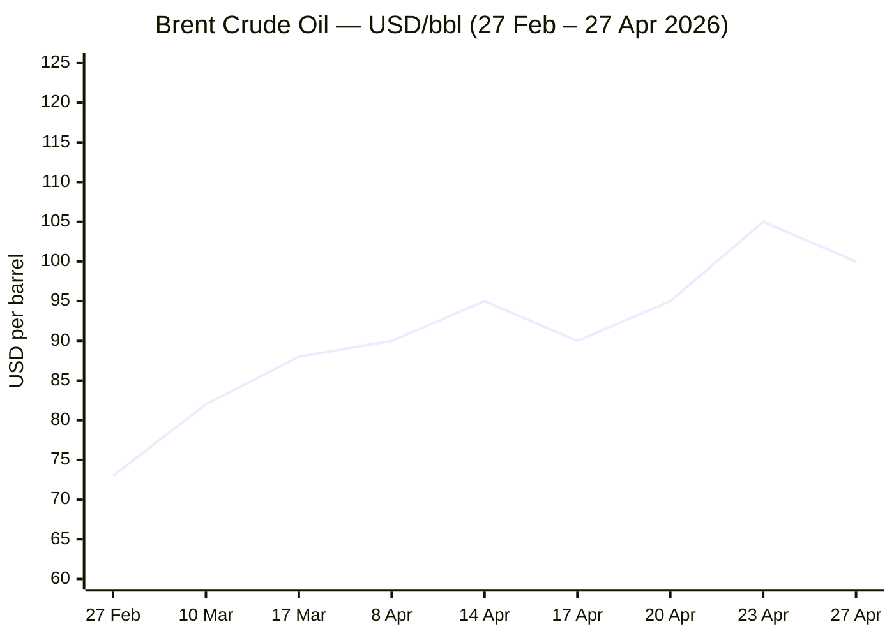
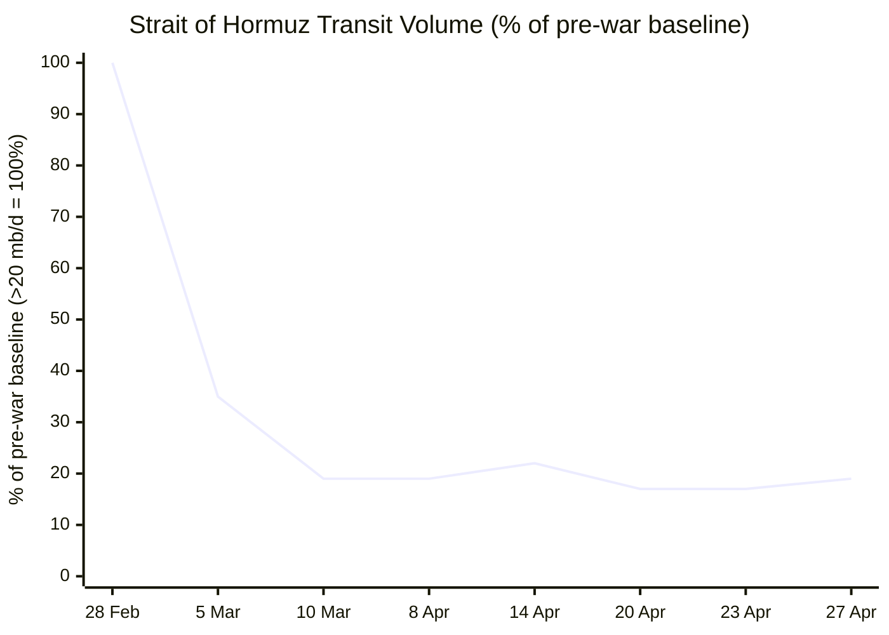

```yaml
---
brief_date: 2026-04-27
version: v1.2.1
run_time: "05:58 CET"
stories_published: 14
categories: [conflict, business, eu_affairs, technology, trends]
alert_counts:
  red: 4
  yellow: 7
  green: 3
ongoing_situations:
  - {name: "2026 Iran–US War", real_world_start: "2026-02-28", day: 59}
  - {name: "US–Iran Ceasefire (extended indefinitely)", real_world_start: "2026-04-08", day: 20}
  - {name: "Israel–Lebanon Ceasefire", real_world_start: "2026-04-16", day: 12}
sources_fetched: 11
fetch_status:
  le_monde: "❌"
  faz: "❌"
  kommersant: "❌"
  xinhua: "⚠️"
  european_parliament: "⚠️"
  fao: "✅"
  imf: "✅"
  ecb: "✅"
  european_commission: "✅"
expansion_queue: []
---
```

---

# 🌐 MORNING BRIEF
## Monday, 27 April 2026 · 05:58 CET
### 14 stories across 5 categories

---

## DIGEST SUMMARY

| # | Category | Headline | Alert |
|---|----------|----------|-------|
| 1 | ⚔️ Conflict | US–Iran diplomacy collapses; Araghchi flies to Moscow for Putin talks | 🔴 |
| 2 | ⚔️ Conflict | Strait of Hormuz: "dual blockade" standoff at Day 15 — transit near standstill | 🔴 |
| 3 | ⚔️ Conflict | Israel–Lebanon ceasefire extended 3 weeks; IDF soldier killed, violations mounting | 🟡 |
| 4 | 💼 Business | Brent above $100/bbl; Goldman Sachs raises Q4 forecast as inventory draws turn "extreme" | 🔴 |
| 5 | 💼 Business | IMF WEO April 2026: global growth cut to 3.1%, inflation forecast at 4.4% | 🟡 |
| 6 | 💼 Business | Meta announces 8,000 layoffs (10% of workforce) to fund AI infrastructure surge | 🟡 |
| 7 | 🇪🇺 EU Affairs | Cyprus summit: EU commits to Middle East engagement, €25bn energy cost shock confirmed | 🟡 |
| 8 | 🇪🇺 EU Affairs | SAFE loan texts distributed to 18 member states; Poland locks in €43.7bn agreement | 🟢 |
| 9 | 🇪🇺 EU Affairs | Eurozone CPI jumps to 2.6% in March — energy component flips positive for first time in a year | 🟡 |
| 10 | 🤖 Technology | Frontier AI benchmark convergence: GPT-5.4, Gemini 3.1 Pro, Claude Opus 4.6 within 4 points | 🟢 |
| 11 | 🤖 Technology | Meta Muse Spark closed launch signals end of Meta's open-source identity; layoffs deepen signal | 🟡 |
| 12 | 📈 Trends | Pakistan's "Islamabad process" — structural mediator role solidifying after second Araghchi visit | 🟡 |
| 13 | 📈 Trends | FAO Food Price Index 128.5 in March — energy-linked rises across all five commodity groups | 🟡 |
| 14 | 📈 Trends | IEA: Hormuz closure is "largest supply disruption in history" — renewables competitiveness soaring | 🔴 |

> Alert Level key: 🔴 High significance · 🟡 Developing · 🟢 Stable/Routine

---

## 🚨 SIGNAL BOARD

🔴 **US–Iran diplomatic track stalls: Araghchi departs Islamabad for Moscow, ending second Pakistan visit in 48 hours with no new talks scheduled — Iran declares Hormuz will "under no circumstances" return to its previous state**
🔴 **Brent crude opens at $100.39/bbl on 27 April, up 52% from the pre-war baseline of $66/bbl; Goldman Sachs raises Q4 2026 forecast to $90/bbl average citing "extreme" inventory draws**
🟡 **IMF April WEO downgrades 2026 global growth to 3.1% (from 3.4% in January) and raises headline inflation forecast to 4.4% — adverse scenario projects 2.5% growth if disruption deepens**
🟢 **SAFE defence loan agreements distributed to all 18 approved EU member states as of 23 April; Poland secures the largest single tranche at €43.7bn**
⚡ **Reversal: Meta shifts from three years of open-source AI identity to a closed proprietary model (Muse Spark, April 8), then announces 8,000 layoffs — signalling that AI scale economics are forcing strategic pivots across the sector**

---

## 🔄 ONGOING SITUATIONS

| Situation | Real-world start | Day # | Last significant development | Status |
|-----------|-----------------|-------|------------------------------|--------|
| 2026 Iran–US War | 28 Feb 2026 | Day 59 | Araghchi-Putin meeting confirmed for today; Islamabad Round 2 abandoned after Trump cancelled Witkoff/Kushner trip | 🔴 Active / Ceasefire holding |
| US–Iran Ceasefire (extended indefinitely) | 8 Apr 2026 | Day 20 | Trump extended 22 Apr truce indefinitely; Iran given 3–5 days to submit new proposal; US naval blockade of Iranian ports continues | 🟡 Fragile |
| Israel–Lebanon Ceasefire | 16 Apr 2026 | Day 12 | Trump extended ceasefire 3 weeks (23 Apr); IDF soldier killed 26 Apr in southern Lebanon; Hezbollah calls truce "meaningless" | 🟡 Violated / Holding tenuously |

---

## ⚔️ ANALYST SECTIONS

> 🔎 **CONFLICT ANALYST** · 3 updates today

### 1. US–Iran Diplomatic Track Collapses — Araghchi in Moscow for Putin Talks 🔴
**Alert:** 🔴
**Summary:** Hopes for a second round of US–Iran talks in Islamabad collapsed on 26 April after Trump cancelled the planned trip by envoys Steve Witkoff and Jared Kushner, citing excessive travel time. Iranian Foreign Minister Abbas Araghchi made two visits to Islamabad in 48 hours, held talks in Oman with Sultan Haitham, and is now in Moscow for a confirmed meeting with President Putin today (27 April). The US naval blockade continues to intercept vessels; 38 ships redirected to date. Trump says Iran can "call on the phone" if it wants to negotiate. Iran's Foreign Ministry confirms no direct meeting with the US is currently planned.
**Significance:** The shift from in-person shuttle diplomacy to phone-based signalling from Washington represents a material de-escalation of diplomatic intensity without any resolution. Araghchi's Moscow visit signals Tehran is consolidating its Russia alignment as a counterweight to US pressure, deepening the structural divide and reducing the probability of a near-term breakthrough.
**Sources:**

- [CNN — Live updates: Iran's top diplomat arrives in Russia for talks with Putin as US peace talks stall](https://www.cnn.com/2026/04/26/world/live-news/iran-war-trump-israel) · 27 April 2026
- [Washington Post — Trump calls off Witkoff, Kushner trip to Pakistan for Iran peace talks](https://www.washingtonpost.com/world/2026/04/25/iran-us-pakistan-ceasefire-talks/) · 26 April 2026
- [Al Jazeera — US and Iran fail to reach a deal after marathon talks in Pakistan](https://www.aljazeera.com/news/2026/4/12/us-and-iran-fail-to-reach-peace-deal-after-marathon-talks-in-pakistan) · 12 April 2026

**Trend:** ↘ De-escalating (diplomatic tempo, not conflict intensity)
**Tags:** #Iran #peace-talks #Pakistan-mediation #MULTI-SOURCE

---

### 2. Strait of Hormuz "Dual Blockade" — Transit Near Standstill 🔴

**Alert:** 🔴
**Summary:** The Strait of Hormuz remains effectively closed on Day 59 of the Iran–US war. The IEA reports crude, NGL, and refined product loadings averaging ~3.8 million barrels per day (mb/d) through the strait in early April, versus more than 20 mb/d before the conflict — a reduction of more than 80%. A "dual blockade" dynamic now prevails: the US Navy restricts Iranian port access, while Iran controls transit within the strait itself. Approximately 600 vessels, including 325 tankers, remain stranded in the Persian Gulf. Iran's Deputy Parliament Speaker stated the strait "will not be opened to the enemies of this nation." [MULTI-SOURCE]
**Significance:** With cumulative supply losses approaching 650 million barrels and inventory buffers nearly exhausted, the IEA warns that the restoration of pre-war crude flows — even after an immediate ceasefire — could take several weeks, with 20% of damaged regional production capacity unlikely to recover in the short-to-medium term.
**Sources:**

- [Al Jazeera — Oil rises above $106 per barrel as US, Iran deadlocked in Strait of Hormuz](https://www.aljazeera.com/economy/2026/4/24/oil-rises-above-106-per-barrel-as-us-iran-deadlocked-in-strait-of-hormuz) · 24 April 2026
- [IEA — Oil Market Report, April 2026](https://www.iea.org/reports/oil-market-report-april-2026) · April 2026
- [CNN Business — Oil prices increase after Iran doubles down on Strait of Hormuz closure](https://www.cnn.com/2026/04/26/business/oil-prices-stock-futures-iran-war) · 26 April 2026

**Trend:** → Stable (at severe disruption level)
**Tags:** #Hormuz #Iran #naval-blockade #supply-shock #MULTI-SOURCE

📎 See also: Business § Story 4 — Brent crude above $100/bbl as Goldman raises Q4 forecast

---

### 3. Israel–Lebanon: Ceasefire Extended, But Violations Mount 🟡

**Alert:** 🟡
**Summary:** Trump announced a three-week extension of the Israel–Lebanon ceasefire on 23 April. However, Hezbollah declared the truce "meaningless" and continued rocket and drone attacks on Israeli positions. On 26 April, the IDF confirmed the death of Sergeant Idan Fooks in southern Lebanon — the 16th IDF soldier killed since the start of the Iran war — with four others seriously wounded. Hezbollah claimed responsibility for a loitering glider strike in Taybeh. Israel carried out fresh strikes in southern Lebanon on 24 April despite the ceasefire extension. Israeli forces remain deployed inside southern Lebanon during the truce.
**Significance:** Hezbollah's non-signatory status and its continued attacks represent the primary structural fragility of the ceasefire. Without a mechanism to bring Hezbollah formally into the agreement, the US-brokered framework cannot hold beyond the three-week extension.
**Sources:**

- [Washington Post — Hezbollah defiant as Trump says Israel-Lebanon ceasefire extended for 3 weeks](https://www.washingtonpost.com/world/2026/04/24/iran-us-israel-lebanon-ceasefire/) · 24 April 2026
- [Realist English — Araghchi heads to Moscow: Lebanon ceasefire cracking](https://english.realtribune.ru/araghchi-heads-to-moscow-putin-to-host-iran-s-foreign-minister-after-us-talks-collapse) · 27 April 2026

**Trend:** ↗ Escalating
**Tags:** #Lebanon #Hezbollah #ceasefire #Israel #MULTI-SOURCE

📚 *Background reading:* [IISS — Military Balance: Hezbollah's force structure post-October 2024](https://www.iiss.org) · [Al Jazeera — 2026 Iran war ceasefire: analysis](https://www.aljazeera.com)

---

> 💼 **BUSINESS ANALYST** · 3 updates today

### 4. Brent Crosses $100 — Goldman Sachs Raises Q4 Forecast 🔴

**Alert:** 🔴
**Summary:** Brent crude opened Monday at $100.39/bbl (+1.27% from Friday's close of $99.13), up approximately 44% from the 27 February pre-war baseline. Goldman Sachs, in a 27 April note, raised its Q4 2026 Brent forecast to $90/bbl average (from $80), citing "extreme" inventory draws as the Hormuz closure mounts. The IEA's April report documents global oil supply falling by 10.1 mb/d to 97 mb/d in March — the largest disruption in history — with daily production outages now surpassing 13 mb/d. US retail diesel reached $1.48/litre (±41% since 27 February); EU retail diesel averaged €1.977/litre as of 23 April.
**Market signal:** Bearish for equities and growth; bullish for energy equities and commodity currencies — the Hormuz closure is now a structural supply constraint, not a temporary spike, with Goldman's upward revision signalling a sustained high-price regime through year-end.
**Sources:**

- [Bloomberg — Goldman Sachs Raises Oil Price Forecasts on Persian Gulf Supply Disruption](https://www.bloomberg.com/news/articles/2026-04-27/goldman-hikes-oil-price-forecasts-on-extreme-inventory-draws) · 27 April 2026
- [IRU — Uncertainty keeps pump prices high and volatile for road transport sector](https://www.iru.org/news-resources/newsroom/uncertainty-keeps-pump-prices-high-and-volatile-road-transport-sector) · 24 April 2026

**Trend:** ↗ Escalating
**Tags:** #Brent #oil-price #supply-shock #Hormuz #MULTI-SOURCE

📎 See also: Conflict § Story 2 — Strait of Hormuz dual blockade, transit 80% below pre-war levels

---

### 5. IMF WEO April 2026: Global Growth 3.1%, Inflation 4.4% 🟡
**Alert:** 🟡
**Summary:** The IMF's April 2026 World Economic Outlook — subtitled *Global Economy in the Shadow of War* — cuts the 2026 global growth forecast to 3.1% (from 3.4% in January) and raises headline inflation to 4.4%, under a reference scenario assuming a short-lived conflict with a moderate 19% energy price rise. The downside scenarios are stark: an adverse case projects 2.5% growth and 5.4% inflation, whilst a severe scenario — with energy disruptions extending into 2027 — produces 2.0% growth and inflation above 6%. Emerging market growth is revised down by 0.3 percentage points to 3.9% for 2026. The full report PDF is due 30 April 2026.
**Market signal:** Neutral-to-bearish for risk assets: the reference forecast is already pricing in significant damage, but the adverse scenario — which markets have not yet fully discounted — implies a further contraction in credit conditions and equity multiples.
**Sources:**

- [IMF — World Economic Outlook, April 2026: Global Economy in the Shadow of War](https://www.imf.org/en/publications/weo/issues/2026/04/14/world-economic-outlook-april-2026) · 14 April 2026

**Trend:** ↘ De-escalating (growth trajectory)
**Tags:** #IMF #GDP-forecast #stagflation #supply-shock #data-point #institutional

📚 *Background reading:* [Atlantic Council — The Strait of Hormuz closure forces a choice: ration oil now or pay a steep price later](https://www.atlanticcouncil.org/dispatches/the-strait-of-hormuz-closure-forces-a-choice-ration-oil-now-or-pay-a-steep-price-later/) · 21 April 2026 · [Bruegel — Eurozone macroeconomic scenarios under energy shock](https://www.bruegel.org)

---

### 6. Meta Announces 8,000 Layoffs to Fund AI Infrastructure 🟡
**Alert:** 🟡
**Summary:** Meta Platforms announced on 23 April that it will cut 10% of its global workforce — approximately 8,000 employees — effective 20 May, alongside the cancellation of 6,000 open roles. The company cited the need to "offset other investments we're making," specifically its 2026 capex guidance of $115–135bn (up from $72.2bn in 2025), directed primarily at AI data centres and the newly launched Meta Superintelligence Labs. The layoffs follow a prior round affecting 700 Reality Labs employees earlier in April. Meta reported Q4 2025 net income of $22.77bn (+9% YoY) and expected Q1 2026 revenue of $53.5–56.5bn.
**Market signal:** Neutral-to-bullish for Meta stock: cost discipline combined with strong revenue guidance reinforces the efficiency narrative, though the scale of AI capex creates execution risk over a 12–24 month horizon.
**Sources:**

- [Bloomberg — Meta Tells Staff It Will Cut 10% of Jobs in Push for Efficiency](https://www.bloomberg.com/news/articles/2026-04-23/meta-tells-staff-it-will-cut-10-of-jobs-in-push-for-efficiency) · 23 April 2026
- [NPR — Meta will lay off 10% of its staff](https://www.npr.org/2026/04/23/nx-s1-5797855/meta-layoffs-10-percent-staff) · 23 April 2026

**Trend:** → Stable (sector-wide AI-driven efficiency restructuring continues)
**Tags:** #tech-layoffs #AI #M&A #earnings #MULTI-SOURCE

📎 See also: Technology § Story 11 — Meta Muse Spark closed launch signals strategic pivot away from open-source AI

---

> 🇪🇺 **EU AFFAIRS ANALYST** · 3 updates today

### 7. Cyprus EU Summit: Article 42.7 Activated, €25bn Energy Bill Confirmed 🟡
**Alert:** 🟡
**Summary:** The informal EU summit in Nicosia on 23–24 April concluded with leaders pledging to boost security and economic ties with the Middle East and pushing for a diplomatic end to the Iran war. European Commission President von der Leyen confirmed the EU's fossil fuel import bill has risen by over €25bn since the start of the conflict "without a single additional molecule of energy." Discussions centred on Article 42.7 of the EU Treaty — the mutual defence clause triggered after Iranian drones struck the British base at Akrotiri, Cyprus, in early March. Cyprus, as current Council presidency-holder, is seeking operational guidelines for the clause. No formal decisions were taken; the summit was consultative in nature.
**Legislative/policy stage:** Article 42.7 review process initiated; Commission presented new measures including social schemes, tax reductions, and green-technology subsidies — legislative proposals expected in May 2026.
**Sources:**

- [Euronews — EU leaders vow to boost security and economic ties with Middle East to minimise effect of Iran war](https://www.euronews.com/my-europe/2026/04/24/eu-leaders-vow-to-boost-security-and-economic-ties-with-middle-east-to-minimise-effect-of-) · 24 April 2026
- [European Commission — Cyprus Summit press conference](https://ec.europa.eu/commission/presscorner/) · 24 April 2026

**Trend:** ↗ Escalating
**Tags:** #EU-institutions #EU-defence #energy-policy #Iran #MULTI-SOURCE

📎 See also: Conflict § Story 1 — US–Iran diplomatic track collapses; Araghchi in Moscow

---

### 8. SAFE Loan Texts Distributed to 18 States — Poland Locks in €43.7bn 🟢
**Alert:** 🟢
**Summary:** The European Commission distributed the final text of the Security Action for Europe (SAFE) loan agreements to all 18 member states with approved national defence investment plans on 23 April. Von der Leyen confirmed Poland — the largest single recipient — has received its agreement for €43.7bn (185.5bn zloty), with a 15% advance payment (approximately €6.5bn) available immediately upon signature. Hungary remains the sole member state awaiting Commission plan approval as it navigates a government transition. Of the 19 plans submitted, 15 include joint projects with Ukraine. The SAFE programme forms the first pillar of the ReArm Europe/Readiness 2030 plan targeting €800bn in defence spending by 2030.
**Legislative/policy stage:** Loan agreements distributed to 18 member states; national signature procedures under way — first disbursements expected within weeks of signature.
**Sources:**

- [Notes From Poland — Poland receives agreement from EU for €44 billion in SAFE defence loans](https://notesfrompoland.com/2026/04/24/poland-receives-agreement-from-eu-for-e44-billion-in-safe-defence-loans/) · 24 April 2026
- [European Commission — SAFE Security Action for Europe](https://defence-industry-space.ec.europa.eu/eu-defence-industry/safe-security-action-europe_en) · Ongoing

**Trend:** ↗ Escalating (disbursement phase accelerating)
**Tags:** #EU-defence #EU-institutions #EU-funds #institutional #MULTI-SOURCE

---

### 9. Eurozone CPI Jumps to 2.6% — Energy Component Turns Positive 🟡
**Alert:** 🟡
**Summary:** Eurostat confirmed eurozone annual inflation at 2.6% in March 2026 (revised up from the 2.5% flash estimate), accelerating sharply from 1.9% in February — the highest level since July 2024. The energy component rose 5.1% year-on-year, its first annual gain in nearly a year and the sharpest since February 2023, reflecting the Hormuz-driven oil price surge. Core inflation (excluding energy and food) edged lower to 2.3%. Germany saw the sharpest acceleration of the large economies (2.8% versus 2.0% in February). Money markets are now fully pricing two ECB rate hikes in 2026, with a 55% probability of a third increase.
**Legislative/policy stage:** ECB in wait-and-see mode ahead of its next meeting; April 2026 flash estimate due 30 April 2026. Full CPI dataset for April will guide the May rate decision.
**Sources:**

- [Eurostat — Annual inflation up to 2.6% in the euro area, March 2026](https://ec.europa.eu/eurostat/web/products-euro-indicators/w/2-16042026-ap) · 16 April 2026
- [ECB Data Portal — Inflation](https://data.ecb.europa.eu/key-figures/inflation-and-other-prices/inflation) · April 2026

**Trend:** ↗ Escalating
**Tags:** #inflation #ECB #interest-rates #eurozone #energy-markets #data-point #institutional

---

> 🤖 **TECHNOLOGY ANALYST** · 2 updates today

### 10. Frontier AI Benchmark Convergence: GPT-5.4, Gemini 3.1 Pro, Claude Opus 4.6 Within 4 Points 🟢
**Alert:** 🟢
**Summary:** The Artificial Analysis Intelligence Index for April 2026 shows GPT-5.4 (OpenAI) and Gemini 3.1 Pro (Google) tied at composite score 57, with Claude Opus 4.6 (Anthropic) at 85 on BenchLM — a gap of fewer than 4 points across the three leading proprietary models. Gemini 3.1 Pro leads on GPQA Diamond reasoning at 94.3% and ARC-AGI-2 at 77.1%; GPT-5.4 leads on knowledge-work (GDPval: 83%) and coding (SWE-bench Pro: 57.7%); Claude Opus 4.6 leads on SWE-bench Verified coding at 80.8%. Open-source challenger GLM-5.1 (Zhipu AI, Apache 2.0, released 7 April) reaches 94.6% of Claude Opus 4.6's coding benchmark performance at $3/month — the sharpest narrowing of the proprietary–open-source gap on record.
**Analyst note:** If open-source models achieve functional parity with proprietary frontier systems by mid-2026, API pricing power for closed-model providers will compress significantly within 12–24 months, forcing revenue diversification beyond raw inference.
**Sources:**

- [BuildFastWithAI — Best AI Models April 2026: Ranked by Benchmarks](https://www.buildfastwithai.com/blogs/best-ai-models-april-2026) · April 2026
- [Medium/Sanjeev Patel — April 2026 AI Models: Every Major Release Reviewed](https://medium.com/@sanjeevpatel3007/april-2026-ai-models-every-major-release-reviewed-6ea03d7bc0b7) · April 2026

**Trend:** → Stable (capability ceiling, not a stall — convergence at the frontier)
**Tags:** #AI #LLM #AI-benchmark #open-source-AI #MULTI-SOURCE

---

### 11. Meta Muse Spark Launch Signals Open-Source Pivot — Layoffs Deepen the Signal 🟡
**Alert:** 🟡
**Summary:** Meta Superintelligence Labs launched Muse Spark on 8 April 2026 — the company's first proprietary, closed-weight AI model available only on meta.ai, with no open-source download. The model scored 52 on the Artificial Analysis Intelligence Index at launch. This marks a strategic reversal from Meta's three-year identity as an open-source AI champion (Llama series). The 23 April announcement of 8,000 layoffs, with capex expected to reach $115–135bn in 2026, reinforces the pivot: Meta is concentrating investment in infrastructure and proprietary models rather than open weight releases. The company is also deploying a new employee keylogger tool ("Model Capability Initiative") to capture worker data for AI agent training.
**Analyst note:** If Meta's closed-model strategy succeeds commercially within 12–24 months, it would eliminate the largest open-weight contributor from the open-source ecosystem, meaningfully slowing the rate at which open-source catches proprietary frontier performance.
**Sources:**

- [Kersai — AI in April 2026: Biggest Breakthroughs, Models & Industry Shifts](https://kersai.com/ai-breakthroughs-april-2026-models-funding-shifts/) · 16 April 2026
- [CNN — Meta to cut 10% of staff as it pours billions into AI](https://www.cnn.com/2026/04/23/tech/meta-layoffs-10-percent-staff-ai) · 23 April 2026

**Trend:** ⚡ Reversal
**Tags:** #AI #LLM #open-source-AI #tech-layoffs #data-centre #MULTI-SOURCE

📚 *Background reading:* [RAND — The economics of frontier AI: open vs. closed development paths](https://www.rand.org) · [MIT Technology Review — 10 things that matter in AI right now](https://www.technologyreview.com/2026/04/21/1135643/10-ai-artificial-intelligence-trends-technologies-research-2026/) · 21 April 2026

---

> 📈 **TRENDS ANALYST** · 3 updates today

### 12. Pakistan's "Islamabad Process" — A Structural Mediator Role Takes Shape 🟡

**Alert:** 🟡
**Summary:** After hosting two rounds of US–Iran talks in April — the first ending without agreement on 12 April and the second collapsing before substantive negotiations began on 26 April — Pakistani officials have begun formally referring to their diplomatic engagement as the "Islamabad process," a deliberate framing intended to establish continuity beyond individual rounds of talks. Pakistan's Prime Minister Shehbaz Sharif and Field Marshal Asim Munir have emerged as the primary interlocutors. Together with China, Pakistan delivered a five-point peace initiative on 31 March. The Iranian ambassador publicly thanked Pakistan for "tireless efforts," signalling Tehran's buy-in to the framework even as talks stall.
**Horizon:** Medium-term — Pakistan's emergence as a principal mediator between a nuclear-armed adversary and the world's sole superpower represents a structural shift in regional diplomacy likely to persist across months to a year regardless of whether the Iran war is resolved.
**Sources:**

- [Wikipedia — Islamabad Talks](https://en.wikipedia.org/wiki/Islamabad_Talks) · 26 April 2026
- [Pakistan Today — Araghchi Heads to Moscow After Second Islamabad Stop](https://www.pakistantoday.com.pk/2026/04/27/araghchi-heads-to-moscow-after-second-islamabad-stop-as-pakistan-led-peace-push-gains-pace) · 27 April 2026

**Trend:** ↗ Escalating (in diplomatic significance)
**Tags:** #Pakistan-mediation #diplomacy #peace-talks #Iran #MULTI-SOURCE

📚 *Background reading:* [CFR — Pakistan's role in US–Iran mediation: background](https://www.cfr.org) · [ECFR — The Islamabad track: what it means for European diplomacy](https://ecfr.eu)

---

### 13. FAO Food Price Index 128.5 — Energy Driving Commodity Rises Across All Groups 🟡
**Alert:** 🟡
**Summary:** The FAO Food Price Index averaged 128.5 points in March 2026 — up 2.4% from February's 125.3 and 1.0% above a year ago — driven primarily by energy cost spillovers from the Iran conflict. All five commodity groups rose: vegetable oils (+5.1%, highest since June 2022), sugar (+7.2%, driven by Brazil's ethanol diversion expectations), cereals (+1.5%, with wheat up 4.3% on US drought and Black Sea disruptions), meat (+1.0%), and dairy (+1.2%). The FAO Chief Economist cautioned that if the conflict extends beyond 40 days — it now stands at Day 59 — input cost pressures may force farmers to reduce planting, with yield implications for the remainder of 2026 and into 2027.
**Horizon:** Medium-term — if energy prices remain above $100/bbl through Q2 2026, fertiliser-linked planting decisions across the Northern Hemisphere (made April–May) will begin to affect 2026–27 cereal harvests by Q3, creating secondary food security risks that outlast the conflict itself.
**Sources:**

- [FAO — FAO Food Price Index rises in March as Near East conflict raises energy costs](https://www.fao.org/newsroom/detail/fao-food-price-index-rises-in-march-as-near-east-conflict-raises-energy-costs/en) · 3 April 2026

**Trend:** ↗ Escalating
**Tags:** #food-security #food-prices #energy-markets #supply-shock #data-point #institutional

📎 See also: Business § Story 4 — Brent crude above $100/bbl

---

### 14. IEA: Hormuz Closure Is "Largest Supply Disruption in History" — Renewables Boom Underway 🔴
**Alert:** 🔴
**Summary:** The IEA's April 2026 Oil Market Report characterises the Hormuz disruption as the "largest supply disruption in the history of the global oil market," with global supply having fallen by 10.1 mb/d in March alone. As a structural consequence, renewable energy is rapidly gaining economic competitiveness: the Philippines declared a national energy emergency (24 March) and is accelerating solar procurement; India installed piped gas connections to 580,000 new households in March alone; and shell's CEO warned Europe faces fuel shortages by April. China — which imports a disproportionately large share of Middle Eastern oil — is widely identified as the primary beneficiary of the accelerated clean energy transition, given its dominant position in solar panel and battery supply chains.
**Horizon:** Long-term — the Hormuz crisis is compressing a decade-long energy transition into months. Even if the strait reopens by mid-2026, the structural shift in government energy planning, supply chain investment, and consumer behaviour is unlikely to reverse. The IEA's mid-year scenario assuming normalised flows by Q3 2026 may itself prove optimistic.
**Sources:**

- [IEA — Oil Market Report, April 2026](https://www.iea.org/reports/oil-market-report-april-2026) · April 2026
- [Wikipedia — 2026 Iran War Fuel Crisis](https://en.wikipedia.org/wiki/2026_Iran_war_fuel_crisis) · 27 April 2026

**Trend:** ↗ Escalating (structural)
**Tags:** #energy-transition #energy-markets #Hormuz #climate #supply-shock #MULTI-SOURCE

📚 *Background reading:* [Atlantic Council — Strait of Hormuz closure forces a choice: ration oil now or pay later](https://www.atlanticcouncil.org/dispatches/the-strait-of-hormuz-closure-forces-a-choice-ration-oil-now-or-pay-a-steep-price-later/) · 21 April 2026

---

## 📊 KEY DATA OF THE DAY

> 📊 **DATA OFFICER** · 7 indicators

| Indicator | Value | Δ vs prior session | Δ vs 7 days ago | Note | Source | URL |
|-----------|-------|-------------------|-----------------|------|--------|-----|
| EUR/USD | 1.1680 | N/A | −0.94% (from 1.1791 on 20 Apr) | EUR pulling back from 2-week high; ECB rate hike expectations firm; eurozone PMI contracted fastest pace since Nov 2024 | Trading Economics | [link](https://tradingeconomics.com/euro-area/currency) |
| Brent Crude (USD/bbl) | 100.39 | +1.27% (from 99.13) | +5.1% (from ~95.48 on 20 Apr) | Goldman Sachs raises Q4 forecast to $90 avg; "extreme" inventory draws; dual blockade of Hormuz continues | IEA / Investing.com | [link](https://www.iea.org/reports/oil-market-report-april-2026) |
| Gold (XAU/USD) | 4,760 | +0.86% | −1.1% (from ~4,813 wk prior) | Gold giving back gains as ceasefire optimism reduces safe-haven urgency; FOMC decision due 28–29 Apr | JM Bullion / Yahoo Finance | [link](https://www.jmbullion.com/charts/gold-price/) |
| IMF Global Growth 2026 | 3.1% | −0.3pp vs Jan WEO | −0.5pp vs Oct WEO (3.6%) | Reference forecast; adverse scenario: 2.5%; severe scenario: 2.0% | IMF WEO April 2026 | [link](https://www.imf.org/en/publications/weo/issues/2026/04/14/world-economic-outlook-april-2026) |
| EU CPI YoY (latest) | 2.6% | +0.7pp vs Feb 2026 (1.9%) | +0.4pp vs Dec 2025 (2.0%) | March 2026 confirmed (Eurostat, 16 Apr); energy component +5.1% YoY — first positive annual reading since March 2025 | Eurostat | [link](https://ec.europa.eu/eurostat/web/products-euro-indicators/w/2-16042026-ap) |
| FAO Food Price Index | 128.5 | +2.4% vs Feb 2026 (125.3) | March 2026 — latest available | Second consecutive monthly rise; all commodity groups higher; energy-linked pressures on vegetable oils (+5.1%) and sugar (+7.2%) | FAO | [link](https://www.fao.org/worldfoodsituation/foodpricesindex/en/) |
| Strait of Hormuz transit (Slot 7) | ~3.8 mb/d | N/A vs prior session | −83% vs pre-war (>20 mb/d) | Early April IEA estimate; ~600 vessels stranded in Persian Gulf; alternative routes (Fujairah, Ceyhan) at 7.2 mb/d | IEA April OMR | [link](https://www.iea.org/reports/oil-market-report-april-2026) |

**Data commentary:** The simultaneous elevation of Brent above $100/bbl, EU CPI at 2.6%, and the FAO index at 128.5 constitutes a triple commodity-inflation signal that the Iran war has transmitted firmly into consumer prices. The most critical variable remains Hormuz transit, where cumulative supply losses now approach 650 million barrels — a figure that will continue growing without a diplomatic resolution. Gold's modest pullback reflects ceasefire optimism rather than inflation comfort; with the FOMC meeting on 28–29 April and no indication of an imminent Hormuz reopening, safe-haven demand is likely to reassert itself during the week.

---

## 📈 CHARTS





---

## ⚙️ AGENT METADATA

| Field | Value |
|-------|-------|
| Agent version | MORNING BRIEF v1.2.1 |
| Run timestamp | 2026-04-27T05:58:16+02:00 |
| Fetch status | Le Monde ❌ · FAZ ❌ · Kommersant ❌ · Xinhua ⚠️ (stories from 24 Apr, outside 24h window) · EP ⚠️ (navigation only, no press releases returned) |
| Sources queried | 11 / 11 (Tier 1 search + Tier 2 fetch; Tier 3 excluded from tally) |
| Stories surfaced | 28 (before editorial filter) |
| Stories published | 14 (after editorial filter) |
| Languages processed | EN, FR (paraphrased), DE (paraphrased) |
| Output language | English (British) |
| Date validated | ✅ Confirmed 27 April 2026 |
| Expansion Queue | None — all tags drawn from closed list |

**Fetch notes:** Le Monde and FAZ returned SITE_BLOCKED errors; Kommersant returned a 404 on the /en/ endpoint. All three were covered via Phase 2 web_search fallback. Xinhua homepage was fetched successfully but all displayed stories were dated 24 April 2026 (outside the 24-hour window). European Parliament press room returned navigation structure only, no press release content. IMF, Eurostat, FAO, and European Commission presscorner all yielded usable content via search.

---

*MORNING BRIEF is an AI-assisted digest. All summaries are paraphrased from original sources. Verify time-sensitive information at the linked URLs before acting. Output language: British English.*
