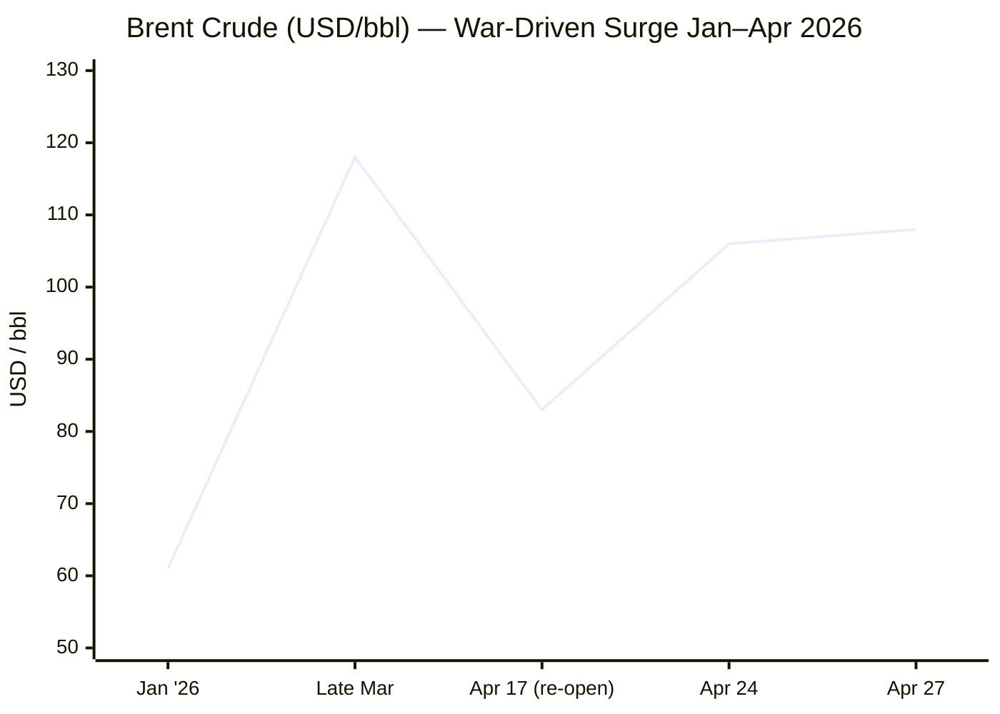

````yaml
---
brief_date: 2026-04-28
version: v1.2.1
run_time: "05:45 CET"
stories_published: 13
categories: [conflict, business, eu_affairs, technology, trends]
alert_counts:
  red: 3
  yellow: 7
  green: 3
ongoing_situations:
  - {name: "2026 Iran War", real_world_start: "2026-02-28", day: 60}
  - {name: "Russia–Ukraine War", real_world_start: "2022-02-24", day: 1525}
  - {name: "Israel–Gaza War", real_world_start: "2023-10-07", day: 935}
sources_fetched: 7
fetch_status:
  le_monde: "❌"
  faz: "❌"
  kommersant: "❌"
  xinhua: "⚠️"
  european_parliament: "⚠️"
expansion_queue: []
---
````

---

# 🌐 MORNING BRIEF
## Tuesday, 28 April 2026 · 05:45 CET
### 13 stories across 5 categories

---

## DIGEST SUMMARY

| # | Category | Headline | Alert |
|---|----------|----------|-------|
| 1 | ⚔️ Conflict | Iran War Day 60: talks collapse as Trump cancels Pakistan mission | 🔴 |
| 2 | ⚔️ Conflict | Lebanon-Israel truce extends but Hezbollah declares it meaningless | 🟡 |
| 3 | ⚔️ Conflict | Ukraine: peace talks stalled, Russia advances at 4.1 sq mi/day | 🟡 |
| 4 | 💼 Business | Brent at $108/bbl — IEA: largest energy supply shock on record | 🔴 |
| 5 | 💼 Business | IMF WEO: global growth cut to 3.1% "in the shadow of war" | 🟡 |
| 6 | 💼 Business | Meta/Microsoft: 23,000 AI-driven jobs cut; third Big Tech wave | 🟡 |
| 7 | 🇪🇺 EU Affairs | Cyprus Summit: Article 42.7 playbook launched, AccelerateEU adopted | 🟡 |
| 8 | 🇪🇺 EU Affairs | EP votes today on €2 trillion MFF 2028-2034 negotiating mandate | 🟢 |
| 9 | 🇪🇺 EU Affairs | Hungary: Magyar's Tisza begins government formation after landslide | 🟢 |
| 10 | 🤖 Technology | AI restructuring wave: 92,000 tech jobs cut in 2026, structural shift | 🟡 |
| 11 | 🤖 Technology | EP demands stricter Digital Markets Act enforcement against AI search | 🟢 |
| 12 | 📈 Trends | Pakistan cements role as indispensable Iran-US diplomatic intermediary | 🟡 |
| 13 | 📈 Trends | Hormuz structural break: reopening will not restore the system | 🔴 |

> Alert Level key: 🔴 High significance · 🟡 Developing · 🟢 Stable/Routine

---

## 🚨 SIGNAL BOARD

🔴 **Iran-US peace talks collapse on Day 60: Trump cancels Pakistan envoy mission; Hormuz transit at 5% of pre-war capacity — ~7 ships/day vs. 120–140 normal.**
🔴 **Brent crude at $108/bbl: IEA declares Hormuz closure the largest energy supply shock in recorded history, surpassing the 1970s embargo in scope.**
🟡 **IMF April WEO cuts 2026 global growth to 3.1%, with adverse "prolonged conflict" scenario projecting only 2% growth and 6% inflation by 2027.**
🟢 **EP votes today on a €2.01 trillion MFF negotiating mandate — the first EU budget talks since Orbán's defeat unlocked bloc cohesion on key fiscal issues.**
⚡ **Pakistan occupies the position of Iran-US mediator for the first time since 1979 — structural shift in Islamabad's global diplomatic role.**

---

## 🔄 ONGOING SITUATIONS

| Situation | Real-world start | Day # | Last significant development | Status |
|-----------|-----------------|-------|------------------------------|--------|
| 2026 Iran War | 28 Feb 2026 | Day 60 | Iran submitted new proposal via Pakistan; Trump cancelled Witkoff/Kushner trip to Islamabad | 🔴 Active — nominal ceasefire |
| Lebanon-Israel ceasefire | 16 Apr 2026 | Day 13 | Truce extended 3 weeks (announced Apr 24); Hezbollah ceasefire violations alleged | 🟡 Tenuous |
| Russia–Ukraine War | 24 Feb 2022 | Day 1,525 | Peace talks in effective suspension; Russia advancing ~4.1 sq mi/day; Easter ceasefire loosely observed 11–12 Apr | 🔴 Active |
| Israel–Gaza War | 7 Oct 2023 | Day 935 | No new diplomatic breakthrough; humanitarian situation critical | 🔴 Active |

---

## 6. ANALYST SECTIONS

---

> 🔎 **CONFLICT ANALYST** · 3 updates today

### 1. Iran War Day 60: Peace Talks Collapse, Dual Blockade Hardens 🔴
**Alert:** 🔴
**Summary:** US-Iran diplomatic efforts have effectively broken down as of 28 April. President Trump cancelled a planned mission by envoys Steve Witkoff and Jared Kushner to Islamabad following Iran's refusal to engage under blockade conditions. Iranian FM Abbas Araghchi travelled to Pakistan to meet Pakistani officials, not US counterparts. Iran's Foreign Ministry spokesperson confirmed no talks are scheduled. However, Iran has conveyed a new proposal via Pakistani mediators calling for a ceasefire extension and Hormuz reopening in exchange for lifting the US naval blockade — a framing the US is expected to reject given unresolved nuclear and missile demands. Three US aircraft carriers are now stationed in the Central Command area of responsibility. The Strait of Hormuz remains under a dual blockade — Iran restricts commercial traffic; the US interdicts vessels bound for Iranian ports.
**Significance:** The collapse of the second round of talks leaves a volatile equilibrium: a nominal ceasefire that neither side is actively violating at state level, but with no mechanism for de-escalation. The 60-day Hormuz closure is now the longest sustained chokepoint disruption since the 1973 Arab oil embargo. Iran's latest proposal represents a procedural offer, not a substantive concession on nuclear or missile programmes.
**Sources:**
- [PBS NewsHour — What to know about ceasefire negotiations between the US and Iran](https://www.pbs.org/newshour/world/heres-what-to-know-about-ceasefire-negotiations-between-the-u-s-and-iran) · 27 April 2026
- [CNN — Day 56 of Middle East conflict: Uncertainty in US-Iran peace talks](https://www.cnn.com/2026/04/24/world/live-news/iran-war-trump-israel-lebanon) · 24 April 2026
- [Wikipedia — 2026 Iran War](https://en.wikipedia.org/wiki/2026_Iran_war) · 28 April 2026
**Trend:** → Stable (nominally) / ⚡ Reversal on diplomatic track
**Tags:** #Iran #ceasefire #Hormuz #Pakistan-mediation #MULTI-SOURCE

---

### 2. Lebanon-Israel Ceasefire Extended — But Immediately Disputed 🟡
**Alert:** 🟡
**Summary:** President Trump announced on 24 April a three-week extension of the Israel-Hezbollah ceasefire that took effect on 16 April, following ambassador-level talks. However, Hezbollah stated the agreement "has no meaning" in light of continued Israeli military operations in southern Lebanon. Israel's IDF struck a Hezbollah launch site in southern Lebanon on 22 April, citing threat prevention under its "freedom of action" clause. Israeli PM Netanyahu reiterated that Israel would continue acting against any threat in Lebanese territory. Iran's earlier reopening of Hormuz to commercial traffic during the Lebanon truce was reversed after the US declined to lift its naval blockade.
**Significance:** The ceasefire extension is politically significant — it removes the most immediate trigger for direct Iranian retaliation — but operationally fragile. Hezbollah retains significant weapons capability; Lebanon's government has sought disarmament but lacks enforcement capacity. A new collapse in Lebanon would directly threaten Hormuz talks.
**Sources:**
- [NBC News Live Blog — Israel, Lebanon extend ceasefire amid Strait of Hormuz uncertainty](https://www.nbcnews.com/world/iran/live-blog/live-updates-trump-iran-hormuz-blockade-ceasefire-talks-lebanon-israel-rcna341831) · 24 April 2026
- [Wikipedia — 2026 Iran war ceasefire](https://en.wikipedia.org/wiki/2026_Iran_war_ceasefire) · 28 April 2026
**Trend:** → Stable (on paper) / ⚡ Reversal risk elevated
**Tags:** #Lebanon #Hezbollah #ceasefire #Israel #de-escalation

---

### 3. Ukraine: Peace Talks Stalled, Russia Advances as US Focus Shifts to Iran 🟡
**Alert:** 🟡
**Summary:** US-brokered Ukraine-Russia negotiations have entered effective suspension. Witkoff and Kushner — the designated Ukraine envoys — have been redirected to Iran talks. Zelenskyy noted on 21 March that US attention is "primarily focused on the situation around Iran." Russian forces continue to advance at approximately 4.1 square miles per day according to ISW data. An Easter ceasefire on 11–12 April saw a 36% reduction in armed clashes, but Russia used the pause to regroup. A POW exchange on 11 April (175 per side plus seven civilians, mediated by UAE) was among the few tangible diplomatic outputs. Territorial questions — Russia demands recognition of Donbas occupation; Ukraine proposes freezing along current front lines — remain unresolved. European security pledges from the Paris coalition summit in January remain active.
**Significance:** The diplomatic vacuum created by the Iran crisis is accruing costs on the Ukrainian front line. Russia appears content to advance incrementally while US mediation bandwidth is consumed elsewhere. The question is whether the Iran ceasefire — once stabilised — will allow Witkoff to pivot back to Ukraine.
**Sources:**
- [Security Council Report — Ukraine Briefing](https://www.securitycouncilreport.org/whatsinblue/2026/04/ukraine-briefing-30.php) · 14 April 2026
- [Russia Matters — Russia-Ukraine War Report Card, April 2026](https://www.russiamatters.org/news/russia-ukraine-war-report-card/russia-ukraine-war-report-card-april-1-2026) · 1 April 2026
**Trend:** ↗ Escalating (frontline) / ↘ De-escalating (diplomatically dormant)
**Tags:** #Ukraine #Russia #peace-talks #frontline #MULTI-SOURCE

📚 *Background reading:* [Al Jazeera — US backs security guarantees for Ukraine, France and UK pledge troops](https://www.aljazeera.com/news/2026/1/6/ukraine-talks-in-paris-yield-significant-progress-on-security-pledges) · 6 January 2026

---

> 💼 **BUSINESS ANALYST** · 3 updates today

### 4. Brent at $108/bbl — Hormuz Remains the World's Most Dangerous Energy Chokepoint 🔴
**Alert:** 🔴
**Summary:** Brent crude closed at $108.11/bbl on 27 April, up 2.64% on the session, having risen from approximately $61/bbl in January. The International Energy Agency's April 2026 Oil Market Report characterises the Hormuz closure as the single largest energy supply shock on record — global supply plummeted 10.1 mb/d to 97 mb/d in March. OPEC+ production fell 9.4 mb/d month-on-month. IEA member states collectively released 400 million barrels from strategic reserves in March. The physical-futures price disconnect is extreme: spot Brent carried a premium of over $25/bbl versus front-month futures in early April. The IEA's base case projects a resumption of flows by mid-year — a scenario it flags as potentially optimistic.
**Market signal:** Bearish for global demand and growth, bullish for upstream producers outside the Gulf; elevated inflation premium baked in until a verified Hormuz reopening.
**Sources:**
- [Trading Economics — Brent Crude Oil](https://tradingeconomics.com/commodity/brent-crude-oil) · 27 April 2026
- [IEA — Oil Market Report April 2026](https://www.iea.org/reports/oil-market-report-april-2026) · April 2026
**Trend:** ↗ Escalating
**Tags:** #Brent #oil-price #Hormuz #supply-shock #energy-markets #MULTI-SOURCE

📎 *See also: Conflict § Story 1 — Iran-US talks collapse, Strait of Hormuz dual blockade persists.*

---

### 5. IMF April WEO: "Global Economy in the Shadow of War" — Growth Cut to 3.1% 🟡
**Alert:** 🟡
**Summary:** The IMF's April 2026 World Economic Outlook, published 14 April, downgrades 2026 global growth to 3.1% — a 0.4 percentage point cumulative cut for 2026-27 versus January projections — under the assumption of a limited, short-duration conflict. Headline inflation is projected to tick up in 2026 before declining in 2027. Emerging markets face acute pressure: growth cut to 3.9% (from 4.2% in January). The IMF presents an adverse scenario in which protracted Hormuz disruption cuts growth to approximately 2% in 2026 with headline inflation rising to 6% by 2027. The report warns explicitly against "disappointment over AI-driven productivity" and "renewed trade tensions" as additional downside risks compounding the energy shock.
**Market signal:** Neutral to bearish; signals elevated "higher for longer" expectations for central bank rates, particularly the ECB which faces an energy-inflation-growth trilemma.
**Sources:**
- [IMF — World Economic Outlook April 2026: Global Economy in the Shadow of War](https://www.imf.org/en/publications/weo/issues/2026/04/14/world-economic-outlook-april-2026) · 14 April 2026
**Trend:** ↘ De-escalating (growth trajectory)
**Tags:** #IMF #GDP-forecast #inflation #stagflation #data-point #institutional

---

### 6. Meta and Microsoft Announce 23,000 Jobs Cut in AI Restructuring Wave 🟡
**Alert:** 🟡
**Summary:** Meta announced on 24 April that it will cut approximately 8,000 employees — 10% of its workforce — with reductions starting 20 May, plus 6,000 open positions left unfilled. Microsoft separately offered voluntary buyouts to approximately 8,750 US employees (7% of US workforce). Both firms cited AI-driven efficiency gains. Meta's 2026 AI capital expenditure guidance stands at $115–135 billion, nearly double 2025's $72 billion; combined Big Tech AI capex for 2026 is approximately $650 billion. Meta is consolidating affected engineers into a new Applied AI division. This is the third distinct wave of tech-sector job cuts since 2020; over 92,000 tech workers have been laid off in 2026 alone.
**Market signal:** Neutral to bullish for both companies near-term (productivity signals); bearish for third-party content moderation contractors (Cognizant, Accenture face structural revenue loss).
**Sources:**
- [CNBC — 20,000 job cuts at Meta, Microsoft raise concern that AI-driven labor crisis is here](https://www.cnbc.com/2026/04/24/20k-job-cuts-at-meta-microsoft-raise-concern-of-ai-labor-crisis-.html) · 24 April 2026
- [The Next Web — Meta and Microsoft eliminated 23,000 positions](https://thenextweb.com/news/meta-microsoft-layoffs-23000-ai-spending) · 26 April 2026
**Trend:** ↗ Escalating
**Tags:** #tech-layoffs #AI #data-centre #MULTI-SOURCE

📚 *Background reading:* [Al Jazeera — Meta lines up layoffs while Microsoft offers buyouts](https://www.aljazeera.com/economy/2026/4/23/meta-lines-up-layoffs-while-microsoft-offers-buyouts) · 23 April 2026

---

> 🇪🇺 **EU AFFAIRS ANALYST** · 3 updates today

### 7. Cyprus Summit: EU Launches Article 42.7 Playbook, AccelerateEU Energy Package 🟡
**Alert:** 🟡
**Summary:** The informal EU heads of state summit in Ayia Napa, Cyprus (23–24 April) produced three significant outputs. First, leaders agreed to develop an operational playbook for Article 42(7) of the EU Treaty — the mutual defence clause — following the Iranian drone strike on a British military base in Cyprus in early March. Second, leaders endorsed the Commission's "AccelerateEU" communication, which responds to the energy shock with social schemes, tax reductions, infrastructure investments, and clean technology subsidies. Third, a "One Europe, One Market" roadmap was signed by the presidents of the European Council, Commission, and Parliament. Leaders also announced an EU-GCC summit in 2026 and held a working lunch with Egypt, Jordan, Lebanon, Syria, and GCC partners. Viktor Orbán was absent — the first EU Council meeting without him following his April 12 defeat.
**Legislative/policy stage:** Article 42.7 playbook: early deliberation phase; no formal proposal yet. AccelerateEU: Commission communication endorsed; implementing measures to follow at June European Council. MFF to be addressed at June 2026 European Council based on a Cypriot presidency "negotiation box."
**Sources:**
- [Council of the EU — Informal meeting of heads of state or government, 23–24 April 2026](https://www.consilium.europa.eu/en/meetings/european-council/2026/04/23-24/) · 24 April 2026
- [Euronews — EU leaders meet in Cyprus to talk Ukraine, Hormuz, energy and mutual defence](https://www.euronews.com/my-europe/2026/04/23/eu-leaders-meet-in-cyprus-to-talk-ukraine-hormuz-energy-and-mutual-defence) · 23 April 2026
**Trend:** ↗ Escalating (EU defence autonomy agenda)
**Tags:** #EU-institutions #EU-defence #energy-policy #Iran #MULTI-SOURCE

---

### 8. EP Votes Today on €2 Trillion MFF 2028-2034 Negotiating Mandate 🟢
**Alert:** 🟢
**Summary:** The European Parliament is today debating and voting on its negotiating mandate for the EU's next seven-year budget (2028–2034). The Budgets Committee's proposal sets the budget at €1.78 trillion in 2025 constant prices (€2.01 trillion in current prices), representing 1.27% of EU GNI — a 10% increase versus the Commission's July 2025 proposal. Co-rapporteurs Siegfried Mureşan (EPP) and Carla Tavares (S&D) hold a post-vote press conference today at 14:00 CEST. The mandate requires Parliament's consent before interinstitutional negotiations can begin with the Council, which is expected to agree its own position at the June 2026 European Council.
**Legislative/policy stage:** Interinstitutional negotiation pending; Parliament vote today (28 April); Council position expected June 2026; agreement target: end of 2026 to ensure budget operational from 1 January 2028.
**Sources:**
- [European Parliament — 2028-2034 EU budget: MEPs to vote on Parliament's position](https://www.europarl.europa.eu/news/en/agenda/plenary-news/2026-04-27/0/2028-2034-eu-budget-meps-to-vote-on-parliament-s-position) · 27 April 2026
- [European Parliament — Press kit for the informal EU summit](https://www.europarl.europa.eu/news/en/press-room/20260423IPR41854/) · 23 April 2026
**Trend:** → Stable
**Tags:** #EU-institutions #MFF #EU-funds #institutional

---

### 9. Hungary: Tisza Party Begins Government Formation After Historic Supermajority 🟢
**Alert:** 🟢
**Summary:** Péter Magyar's centre-right Tisza party won 53.6% of the vote on 12 April, securing 138 of 199 parliamentary seats — a constitutional supermajority. Viktor Orbán, in power since 2010, conceded defeat and committed Fidesz to opposition. Magyar has pledged to reintegrate Hungary into the EU judicial framework, travel first to Warsaw then Brussels, and end Hungary's adversarial posture within EU institutions. European Commission President von der Leyen declared "Hungary has chosen Europe." The long-blocked €90 billion EU loan to Ukraine — previously vetoed by Orbán — is now expected to advance. Government formation talks are under way; Magyar is expected to become Prime Minister once a formal coalition is confirmed.
**Legislative/policy stage:** Government formation in progress; parliamentary confirmation of new government pending. EU rule-of-law procedure and frozen cohesion funds dossier to be re-examined once new government is in office.
**Sources:**
- [Al Jazeera — Peter Magyar wins Hungary election, unseating Viktor Orban after 16 years](https://www.aljazeera.com/news/2026/4/12/hungary-election-early-results-show-magyars-tisza-ahead-of-orbans-fidesz) · 12 April 2026
- [CNN — Hungary election results: Petér Magyar wins](https://www.cnn.com/2026/04/12/world/live-news/hungary-election-orban-magyar) · 12 April 2026
**Trend:** ⚡ Reversal
**Tags:** #Magyar #EU-enlargement #rule-of-law #EU-election #MULTI-SOURCE

📚 *Background reading:* [Al Jazeera — Hungary election: crowds chant 'Europe' as Magyar wins](https://www.aljazeera.com/news/2026/4/12/hungary-election-early-results-show-magyars-tisza-ahead-of-orbans-fidesz) · 12 April 2026

---

> 🤖 **TECHNOLOGY ANALYST** · 2 updates today

### 10. Big Tech AI Restructuring: Third Wave Signals Structural Labour Shift 🟡
**Alert:** 🟡
**Summary:** Meta and Microsoft's combined 23,000-position reduction — confirmed 24 April — marks a qualitative break from prior cycles. Unlike 2022–23 pandemic-era unwinding or 2024–25 organisational restructuring, the 2026 wave is explicitly attributed to AI automation replacing knowledge-work functions: content moderation (Meta Trust and Safety), cloud infrastructure management (Azure), and tier-one customer support (Microsoft). Meta's 8,000 involuntary cuts concentrate in roles where AI accuracy reportedly exceeds human baselines. AI-related job postings rose 67% year-on-year in 2026 while traditional software engineering postings fell 23%. Total tech-sector layoffs in 2026 now exceed 92,000, per Layoffs.fyi; nearly 900,000 since 2020.
**Analyst note:** Over the next 12–24 months, third-party outsourcers (Cognizant, Accenture) holding large content moderation contracts face structural revenue erosion as hyperscalers internalise AI-automated equivalents — a shift that could accelerate regulatory scrutiny of AI-based employment displacement in the EU.
**Sources:**
- [CNBC — 20,000 job cuts at Meta, Microsoft raise concern that AI-driven labor crisis is here](https://www.cnbc.com/2026/04/24/20k-job-cuts-at-meta-microsoft-raise-concern-of-ai-labor-crisis-.html) · 24 April 2026
**Trend:** ↗ Escalating
**Tags:** #AI #tech-layoffs #LLM #autonomous-systems

---

### 11. EP Pushes for Stricter DMA Enforcement, Scrutiny of AI-Driven Search 🟢
**Alert:** 🟢
**Summary:** The European Parliament this week is debating the Digital Markets Act review and calling on the Commission to accelerate compliance proceedings against designated gatekeepers. MEPs specifically flag AI-driven search tools and cloud services as requiring closer scrutiny ahead of the formal DMA review. The Parliament demands quicker enforcement timelines and stronger penalty mechanisms. A debate on cyberbullying and online harassment — linked to expanded platform liability — runs in parallel this week. The push comes as US pressure mounts on the EU to recalibrate digital rules as part of the US-EU trade relationship.
**Analyst note:** Within 12–24 months, a stricter DMA enforcement posture — specifically targeting AI search and cloud market concentration — is likely to generate formal investigations against Alphabet and Microsoft, both of which face scrutiny over Gemini and Azure/Copilot integration into gatekeeper services.
**Sources:**
- [European Parliament — Newsletter 27–30 April 2026 Strasbourg plenary](https://www.europarl.europa.eu/news/en/agenda/plenary-news/2026-04-27) · 27 April 2026
**Trend:** ↗ Escalating
**Tags:** #digital-regulation #AI-regulation #EU-institutions

---

> 📈 **TRENDS ANALYST** · 2 updates today

### 12. Pakistan as Iran-US Mediator: Structural Diplomatic Reorientation 🟡
**Alert:** 🟡
**Summary:** Pakistan has emerged as the indispensable intermediary in the US-Iran war and ceasefire framework — the most strategically significant mediation role Islamabad has played since its Cold War alignment. Prime Minister Shehbaz Sharif and Field Marshal Asim Munir brokered the original 8 April two-week ceasefire. Pakistan is hosting the venue for talks; its FM has functioned as the channel between Tehran and Washington. Even as direct talks collapsed this weekend, Iran's FM Araghchi travelled to Islamabad to coordinate with Pakistani officials — signalling the relationship has structural depth beyond any single round of negotiations. Pakistan hosted both Witkoff-Kushner and Iranian delegations in the same week.
**Horizon:** Medium-term structural signal: Pakistan's mediator role, if the Iran war is resolved, positions Islamabad as a durable diplomatic bridge between the Islamic world and the United States — a reorientation that could reshape its relationships with Gulf states, China, and the EU over the next one to three years.
**Sources:**
- [House of Commons Library — US-Iran ceasefire and nuclear talks in 2026](https://commonslibrary.parliament.uk/research-briefings/cbp-10637/) · 28 April 2026
- [Wikipedia — 2026 Iran War Ceasefire](https://en.wikipedia.org/wiki/2026_Iran_war_ceasefire) · 28 April 2026
**Trend:** ↗ Escalating
**Tags:** #Pakistan-mediation #diplomacy #Iran #peace-talks #MULTI-SOURCE

---

### 13. Hormuz Structural Break: Even Reopening Will Not Restore the System 🔴
**Alert:** 🔴
**Summary:** Analysis published this week by OilPrice.com and corroborated by IEA data demonstrates that the Hormuz disruption has already crossed a structural threshold. Even during periods when Iran announced partial openings, real-time vessel traffic remained at 3–7 ships per day versus a pre-crisis average of 120–140. Maritime insurers have repriced risk permanently; shipping companies are completing contracts for Cape of Good Hope re-routing; Asian refiners are accelerating diversification away from Gulf crude. Gulf producers' oil exports have fallen over 60%. The pattern mirrors what occurred in the Bab el-Mandeb following Houthi interdictions — traffic rerouted and never fully returned even after security conditions improved. The IEA warns that global crude runs are now expected to decline by 1 mb/d on average in 2026 versus prior forecasts.
**Horizon:** Long-term structural shift: the Hormuz crisis of 2026 is likely to trigger a permanent, multi-year reorganisation of global energy logistics, accelerating investment in alternative pipeline corridors, Red Sea-bypassing infrastructure, and strategic stockpile capacity outside chokepoint zones.
**Sources:**
- [OilPrice.com — The Strait of Hormuz May Reopen, But the System Has Already Broken](https://oilprice.com/Energy/Energy-General/The-Strait-of-Hormuz-May-Reopen-But-the-System-Has-Already-Broken.html) · 27 April 2026
- [Wikipedia — 2026 Strait of Hormuz crisis](https://en.wikipedia.org/wiki/2026_Strait_of_Hormuz_crisis) · 28 April 2026
**Trend:** ↗ Escalating
**Tags:** #Hormuz #shipping #energy-transition #supply-shock #MULTI-SOURCE

📚 *Background reading:* [UNCTAD — Strait of Hormuz disruptions: Implications for global trade and development](https://unctad.org/publication/strait-hormuz-disruptions-implications-global-trade-and-development) · March 2026

---

## 📊 KEY DATA OF THE DAY

> 📊 **DATA OFFICER** · 7 indicators

| Indicator | Value | Δ vs prior session | Δ vs 7 days ago | Note | Source | URL |
|-----------|-------|-------------------|-----------------|------|--------|-----|
| EUR/USD | 1.1748 | +0.22% | N/A | Euro recovering from 2-week lows; ECB expected to hold rates Thursday | ECB / Trading Economics | [link](https://tradingeconomics.com/euro-area/currency) |
| Brent Crude (USD/bbl) | 108.11 | +2.64% | N/A | 60-day Hormuz closure; IEA records largest supply shock in history | Trading Economics / EIA | [link](https://tradingeconomics.com/commodity/brent-crude-oil) |
| Gold (XAU/USD) | 4,699 | −0.58% | N/A | Safe-haven demand offset by "higher for longer" rate expectations; Fed decision Wednesday | Trading Economics | [link](https://tradingeconomics.com/commodity/gold) |
| IMF Global Growth 2026 | 3.1% | −0.3pp vs Jan WEO | −0.3pp vs Oct WEO | "Shadow of War" baseline; adverse scenario: ~2%; full PDF due 30 April | IMF WEO April 2026 | [link](https://www.imf.org/en/publications/weo/issues/2026/04/14/world-economic-outlook-april-2026) |
| EU CPI YoY (March 2026) | 2.6% | +0.7pp vs Feb (1.9%) | +0.6pp vs Dec 2025 (2.0%) | Energy component +5.1%; highest since July 2024; April flash estimate due 30 April | Eurostat | [link](https://ec.europa.eu/eurostat/web/products-euro-indicators/w/2-16042026-ap) |
| FAO Food Price Index | 128.5 | +2.4% vs Feb (125.3) | March 2026 — latest available | Energy-linked surge in vegetable oils (+5.1%) and sugar (+7.2%); next release 8 May | FAO | [link](https://www.fao.org/worldfoodsituation/foodpricesindex/en/) |
| Strait of Hormuz transit (ships/day) | ~7 | N/A | N/A | Pre-crisis norm: 120–140; current ~5% capacity; 99.7% Polymarket probability traffic does not normalise by Apr 30 | IMF Portwatch / Polymarket | [link](https://en.wikipedia.org/wiki/2026_Strait_of_Hormuz_crisis) |

**Data commentary:** The numbers collectively depict an economy under acute energy shock. Brent at $108 — up 77% year-on-year — is driving the Eurozone CPI rebound to 2.6%, forcing the ECB into a painful hold between tightening-to-fight-inflation and easing-to-cushion-growth. Gold's mild retreat despite the crisis reflects markets pricing in rate resistance to inflation rather than a flight to safety. The Hormuz transit indicator is the most alarming single data point: at 5% of normal capacity on Day 60, there is no near-term physical oil market relief regardless of what happens diplomatically in Islamabad.

---

## 📊 CHARTS

### Chart 1 — Brent Crude Trajectory: January–April 2026



*Data sources: Trading Economics (Apr 24, Apr 27), Fortune (Apr 24), IEA April 2026 OMR (late March peak), tariffstool.com (Jan baseline, Apr 17 re-opening). Jan 2026 = approximate pre-war level. Late March = physical spot peak cited by IEA.*

---

## ⚙️ AGENT METADATA

| Field | Value |
|-------|-------|
| Agent version | MORNING BRIEF v1.2.1 |
| Run timestamp | 2026-04-28T05:45:51+02:00 |
| Fetch status | Le Monde ❌ · FAZ ❌ · Kommersant ❌ · Xinhua ⚠️ (Apr 24 content only — outside 24 h window) · EP ⚠️ (fetched; press releases not rendered inline) |
| Sources queried | 7 / 11 (Guardian ✓ via search · Xinhua ✓ fetched · IMF ✓ · ECB ✓ · Commission ✓ · Parliament ✓ · FAO ✓; Le Monde ❌ · FAZ ❌ · Kommersant ❌ · World Bank not queried) |
| Stories surfaced | ~28 before editorial filter |
| Stories published | 13 |
| Languages processed | EN (primary); FR, DE, RU attempted via direct fetch — all failed |
| Output language | English (British) |
| Date validated | ✅ Confirmed 28 April 2026 |
| Expansion Queue | None — all tags resolved from closed list |

---

*MORNING BRIEF is an AI-assisted digest. All summaries are paraphrased from original sources. Verify time-sensitive information at the linked URLs before acting. Output language: British English.*
