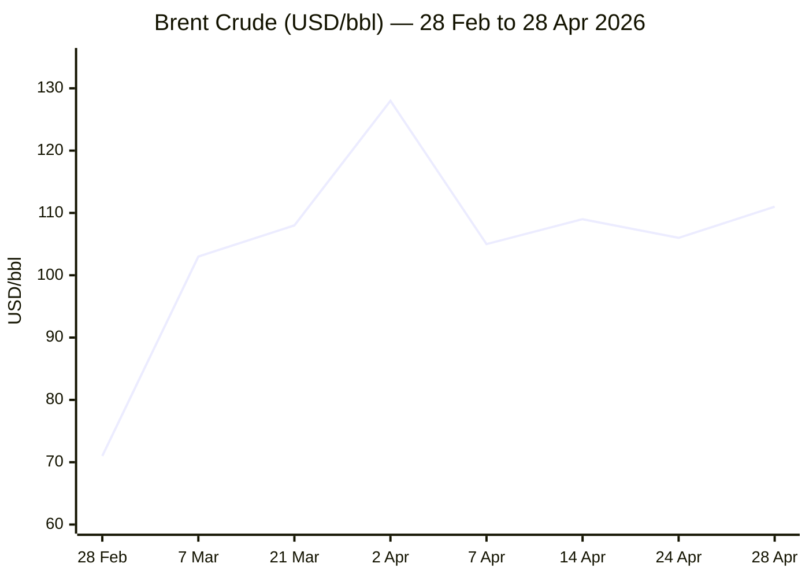

````yaml
---
brief_date: 2026-04-29
version: v1.2.1
run_time: "06:06 CET"
stories_published: 13
categories: [conflict, business, eu_affairs, technology, trends]
alert_counts:
  red: 2
  yellow: 10
  green: 1
ongoing_situations:
  - {name: "2026 Iran War", real_world_start: "2026-02-28", day: 61}
  - {name: "Russia–Ukraine War", real_world_start: "2022-02-24", day: 1526}
  - {name: "2026 Lebanon War / Hezbollah", real_world_start: "2026-03-01", day: 60}
sources_fetched: 8
fetch_status:
  le_monde: "❌"
  faz: "❌"
  kommersant: "❌"
  xinhua: "⚠️"
  european_parliament: "⚠️"
expansion_queue: []
---
````

---

# 🌐 MORNING BRIEF
## Wednesday, 29 April 2026 · 06:06 CET
### 13 stories across 5 categories

---

## DIGEST SUMMARY

| # | Category | Headline | Alert |
|---|----------|----------|-------|
| 1 | ⚔️ Conflict | Iran war ceasefire stalls — Hormuz blockade firms as Trump rejects Tehran proposal | 🔴 |
| 2 | ⚔️ Conflict | Lebanon: Israeli strikes resume despite extended ceasefire, journalist killed | 🟡 |
| 3 | ⚔️ Conflict | Ukraine: Tuapse refinery hit again; Zelensky orders 50,000 ground robots | 🟡 |
| 4 | ⚔️ Conflict | Merz signals Ukraine may need to accept territorial concessions for EU path | 🟡 |
| 5 | 💼 Business | Brent breaks $111 as Hormuz closure locks in supply shock | 🔴 |
| 6 | 💼 Business | Gold falls below $4,600 on inflation-driven rate fears ahead of Fed decision | 🟡 |
| 7 | 💼 Business | Meta Q1 2026 earnings due tonight: $55.6bn revenue expected amid AI capex debate | 🟡 |
| 8 | 🇪🇺 EU Affairs | European Parliament adopts 10% higher MFF negotiating position, triggering Council showdown | 🟡 |
| 9 | 🇪🇺 EU Affairs | ECB Governing Council convenes Day 1; rate hold expected, April CPI flash due tomorrow | 🟡 |
| 10 | 🤖 Technology | Meta, Microsoft, Amazon: 20,000+ layoffs signal AI-driven structural shift in tech labour | 🟡 |
| 11 | 🤖 Technology | Big Tech combined CapEx approaches $700bn as agentic AI moves from pilot to production | 🟢 |
| 12 | 📈 Trends | Pakistan's Islamabad process: a structural shift in non-Western conflict mediation | 🟡 |
| 13 | 📈 Trends | Hormuz at 5% capacity: shipping and food security implications deepen | 🟡 |

> Alert level key: 🔴 High significance · 🟡 Developing · 🟢 Stable/Routine

---

## 🚨 SIGNAL BOARD

🔴 **Brent crude at $111.16/bbl (28 Apr) — up 76% year-on-year — as Strait of Hormuz remains at ~5% of pre-conflict transit volume with no resolution in sight**
🔴 **Iran FM Araghchi has left Islamabad for Moscow; Trump rejected Tehran's latest proposal; second round of US-Iran talks has no scheduled date**
🟡 **European Parliament voted to demand a €200bn uplift to the EU's 2028–2034 budget, opening formal negotiations with a deeply divided Council**
🟡 **Gold fell ~2% to below $4,600 on 28 Apr — its lowest since late March — as stagflation fears suppress safe-haven demand through the rate channel**
⚡ **Germany's Merz becomes first G7 leader to publicly suggest Ukraine may need to cede territory, framing concessions as the price of the EU accession path**

---

## 🔄 ONGOING SITUATIONS

| Situation | Real-world start | Day # | Last significant development | Status |
|-----------|-----------------|-------|------------------------------|--------|
| 2026 Iran War | 28 Feb 2026 | Day 61 | Trump rejected Iran's latest proposal; Araghchi in Moscow; second round of Islamabad talks unscheduled | 🔴 Active |
| Russia–Ukraine War | 24 Feb 2022 | Day 1,526 | Ukraine struck Tuapse refinery (3rd hit in 2 weeks); Russia launched 94 drones overnight; no frontline advances | 🔴 Active |
| 2026 Lebanon War / Hezbollah | 1 Mar 2026 | Day 60 | Three-week ceasefire extension in force; Israel struck Hezbollah targets; Lebanese journalist killed | 🟡 Ceasefire |

---

## ⚔️ CONFLICT ANALYST

> 🔎 **CONFLICT ANALYST** · 4 updates today

---

### 1. Iran War Ceasefire Stalls — Hormuz Standoff Hardens 🔴

**Alert:** 🔴
**Summary:** The ceasefire agreed on 7–8 April remains nominally in place but is under severe strain. Iran's army publicly stated it is still in a "war situation" as Iranian Foreign Minister Abbas Araghchi departed Islamabad for Moscow on 28 April after an attempted second round of US-Iran talks collapsed. Trump cancelled the planned trip by envoys Steve Witkoff and Jared Kushner to Pakistan on 25 April and later suggested talks could proceed by telephone. Iran had presented a new proposal — offering to reopen the Strait of Hormuz in exchange for lifting the US naval blockade and deferring nuclear negotiations — but Trump publicly rejected it. Gulf leaders convened in Saudi Arabia on 28 April; Qatar warned against a "frozen conflict" and called the Strait an inappropriate pressure lever. The US counter-blockade targeting ships bound for Iranian ports, imposed on 13 April, remains in force. Three US aircraft carriers are now stationed in the Middle East.
**Significance:** The dual blockade is now entering its third week with no negotiating mechanism in place. Iran's outreach to Russia signals a fallback to great-power guarantors if the Pakistani channel stalls. The longer the Strait remains closed, the harder a market-calming resolution becomes — and the more entrenched each side's domestic politics around the ceasefire terms.
**Sources:**
- [Al Jazeera — Iran war live: Iranian army 'still in war situation'; Gulf leaders meet](https://www.aljazeera.com/news/liveblog/2026/4/28/iran-war-live-trump-reviews-peace-plan-un-calls-for-hormuz-to-reopen) · 28 April 2026
- [Fortune — Iran's foreign minister returns to Pakistan as Islamabad races to save ceasefire talks](https://fortune.com/2026/04/26/iran-foreign-minister-pakistan-us-ceasefire-strait-of-hormuz-toll-oman/) · 26 April 2026
- [CBS News — US-Iran war live updates: Hormuz, Hezbollah, Lebanon ceasefire](https://www.cbsnews.com/live-updates/us-iran-war-trump-strait-of-hormuz-hezbollah-lebanon-israel-ceasefire/) · 28 April 2026
**Trend:** ↘ De-escalating (ceasefire nominal) / ⚡ Reversal risk elevated
**Tags:** #Iran #ceasefire #Hormuz #Pakistan-mediation #MULTI-SOURCE

---

### 2. Lebanon: Israeli Strikes Resume Despite Extended Ceasefire 🟡

**Alert:** 🟡
**Summary:** The three-week extension of the Israel-Lebanon ceasefire, announced by Trump on 24 April, is being violated by both sides. Israeli forces struck multiple Hezbollah targets on 25–27 April, killing six people including Lebanese journalist Amal Khalil (22 April) in what press freedom groups called a targeted attack. Netanyahu ordered the military to "forcefully attack Hezbollah targets" following what Israel characterised as truce violations. Israeli strikes also hit Yohmor al-Shaqeef (four killed) and Safad al-Battikh (two killed, 17 injured). Lebanon's health ministry reports 1,116 killed since the start of the Israeli ground operations. Two-thirds of Israeli respondents in a Hebrew University poll oppose the pause in operations.
**Significance:** The extended ceasefire is fraying in ways that mirror the initial agreement's collapse in early March. Israel's domestic political pressure and Netanyahu's inability to convert military gains into diplomatic outcomes — as noted by former chief of staff Gadi Eisenkot — risk re-escalation that could derail the wider Iran talks.
**Sources:**
- [CBS News — Israel-Lebanon ceasefire violations](https://www.cbsnews.com/live-updates/us-iran-war-trump-strait-of-hormuz-hezbollah-lebanon-israel-ceasefire/) · 25–27 April 2026
- [Al Jazeera — Reality check: Israeli ambitions confront US dictates in Iran and Lebanon](https://www.aljazeera.com/news/2026/4/24/reality-check-israeli-ambitions-confront-us-dictates-in-iran-and-lebanon) · 24 April 2026
**Trend:** ↗ Escalating
**Tags:** #Lebanon #Hezbollah #Israel #ceasefire #escalation

---

### 3. Ukraine: Tuapse Refinery Hit Again; Zelensky Orders 50,000 Ground Robots 🟡

**Alert:** 🟡
**Summary:** Ukrainian drones struck Russia's Tuapse refinery overnight on 28 April, igniting a fire at the Rosneft-owned Black Sea oil hub — the third strike in under two weeks (earlier attacks: 16 and 20 April). Russian forces launched 94 drones at Ukraine overnight. No confirmed territorial advances were recorded by either side. President Zelensky ordered a major expansion of ground robotic systems, setting a target of at least 50,000 units for 2026, describing unmanned ground vehicles as "the next major step in warfare" following widespread drone adoption. Separately, Iranian Foreign Minister Araghchi met President Putin in St. Petersburg on 27 April, underscoring the deepening Russia-Iran strategic alignment.
**Significance:** The repeated targeting of Tuapse — a key oil export terminal — represents a deliberate Ukrainian campaign against Russian energy infrastructure, mirroring Russia's attacks on Ukrainian energy. The robotic systems order signals Kyiv's intent to reduce frontline manpower exposure. Russia-Iran strategic coordination, formalised during the 2026 conflict, adds a new variable to any Ukraine ceasefire negotiations.
**Sources:**
- [Kyiv Post — Ukraine News Today: Breaking Updates, 28 April 2026](https://www.kyivpost.com/thread/74878) · 28 April 2026
- [Al Jazeera — Russia attacks Odesa, claims Ukraine hit Zaporizhzhia nuclear plant](https://www.aljazeera.com/news/2026/4/27/russia-attacks-odesa-claims-ukraine-hit-zaporizhzhia-nuclear-plant) · 27 April 2026
**Trend:** → Stable (no territorial change)
**Tags:** #Ukraine #Russia #drone-warfare #autonomous-systems #frontline

---

### 4. Merz Signals Ukraine May Accept Territorial Concessions for EU Path 🟡

**Alert:** 🟡
**Summary:** German Chancellor Friedrich Merz stated on 28 April that Ukraine may need to accept territorial losses to secure a peace agreement and its path to EU membership. Merz said Zelensky would need a referendum majority for any such concession, framing the argument as: "I have opened the way to Europe for you." The statement represents the first explicit public suggestion by a G7 leader that territorial concessions may be a negotiating reality. Ukraine and Poland are preparing to host the Ukraine Recovery Conference in Gdańsk in June 2026, with a dedicated security track included for the first time. The Kyiv Independent confirmed that Poland and Ukraine are also cooperating on a joint drone production programme.
**Significance:** Merz's statement shifts the public diplomatic frame in ways Kyiv has strenuously resisted. Coming from the leader of Europe's largest economy, it will test EU solidarity ahead of the Gdańsk conference and add pressure on Zelensky ahead of any US-mediated peace process.
**Sources:**
- [Kyiv Independent — Germany's Merz suggests Ukraine may cede territory for peace and EU path](https://kyivindependent.com/) · 28 April 2026
**Trend:** ↗ Escalating (diplomatic pressure on Kyiv)
**Tags:** #Ukraine #Russia #peace-talks #EU-enlargement #diplomacy

---

📚 *Background reading:* [Al Jazeera — How long can Iran survive the US's Hormuz blockade?](https://www.aljazeera.com/news/2026/4/24/how-long-can-iran-survive-the-uss-hormuz-blockade) · 24 April 2026 · [Kyiv Independent — Ukraine war latest](https://kyivindependent.com/) · 28 April 2026

---

## 💼 BUSINESS ANALYST

> 💼 **BUSINESS ANALYST** · 3 updates today

---

### 5. Brent Breaks $111 as Hormuz Closure Locks In Supply Shock 🔴

**Alert:** 🔴
**Summary:** Brent crude settled at $111.16/bbl on 28 April, up 2.71% on the session — the highest level since early March — as stalled ceasefire diplomacy and Trump's public rejection of Iran's latest proposal dashed near-term hopes of a Hormuz reopening. WTI cleared $99/bbl for the first time since early April. The Strait of Hormuz — through which roughly 20% of global oil flows — remains at approximately 5% of pre-conflict transit volume. Gulf producers (Iraq, Saudi Arabia, Kuwait, UAE, Qatar, Bahrain) have collectively shut in an estimated 9.1 million barrels per day (b/d) in April, per the EIA's April STEO. Brent has risen 76% year-on-year; the IEA has warned of an unprecedented supply shock alongside rising demand-slowdown risks. The EIA projects a Q2 2026 average Brent price of $115/bbl before gradual easing later in the year — under the assumption of conflict resolution by mid-2026.

📎 *See also: Conflict § Story 1 — Iran ceasefire stall driving dual blockade*

**Market signal:** Bearish for global growth and equities; bullish for energy producers and hedged oil majors as the Hormuz closure shows no sign of imminent resolution.
**Sources:**
- [Trading Economics — Brent Crude Oil price data, 28 April 2026](https://tradingeconomics.com/commodity/brent-crude-oil) · 28 April 2026
- [EIA — April 2026 Short-Term Energy Outlook](https://www.eia.gov/outlooks/steo/archives/apr26.pdf) · April 2026
**Trend:** ↗ Escalating
**Tags:** #Brent #oil-price #Hormuz #supply-shock #energy-markets #MULTI-SOURCE

---

### 6. Gold Falls Below $4,600 on Inflation-Driven Rate Fears 🟡

**Alert:** 🟡
**Summary:** Gold (XAU/USD) fell as much as 2% to below $4,600/oz on 28 April — its lowest since late March — as surging oil prices intensified inflation concerns ahead of central bank decisions this week. The Federal Reserve is expected to hold interest rates at 3.50–3.75% at today's (29 April) FOMC meeting — potentially Jerome Powell's final meeting as chair ahead of the Kevin Warsh transition. Rising oil-driven inflation increases the probability that major central banks will keep rates elevated for longer, diminishing the appeal of non-yielding gold. The ECB is also expected to hold tomorrow. Gold had reached an all-time high of $5,595/oz on 29 January 2026 before pulling back sharply; the metal's path now depends heavily on whether the Iran conflict extends beyond mid-year (the IMF's reference-forecast assumption for resolution).
**Market signal:** Neutral-to-bearish short-term as rate expectations firm; structurally bullish if the conflict extends and stagflation risk increases.
**Sources:**
- [Trading Economics — Gold price data, 28 April 2026](https://tradingeconomics.com/commodity/gold) · 28 April 2026
**Trend:** ↘ De-escalating
**Tags:** #gold #interest-rates #Fed #inflation #MULTI-SOURCE

---

### 7. Meta Q1 2026 Earnings Due Tonight: AI CapEx in Focus 🟡

**Alert:** 🟡
**Summary:** Meta Platforms reports Q1 2026 financial results after US market close today (29 April). Wall Street consensus: revenue of $55.56bn (+31% YoY) and EPS of approximately $6.67. The quarter will be scrutinised primarily for updated 2026 CapEx guidance, currently set at $115–135bn — nearly double 2025's $72.2bn — driven by the company's Meta Superintelligence Labs expansion and AI data-centre buildout. Meta has also secured a 20-year nuclear power agreement with Vistra and multi-year chip supply deals with Amazon (Graviton5) and Corning (fibre optic). The earnings come days after Meta announced layoffs of approximately 8,000 employees (10% of workforce), effective 20 May, framed as efficiency gains to offset AI investment costs. Meta stock has risen 29% over the past month.
**Market signal:** Bullish if CapEx guidance holds and revenue beats consensus; sentiment will turn on whether management signals further workforce reductions or CapEx acceleration.
**Sources:**
- [Bloomberg — Meta tells staff it will cut 10% of jobs in push for efficiency](https://www.bloomberg.com/news/articles/2026-04-23/meta-tells-staff-it-will-cut-10-of-jobs-in-push-for-efficiency) · 23 April 2026
- [24/7 Wall St. — Meta Q1 2026 earnings preview](https://247wallst.com/investing/2026/04/28/meta-reports-q1-earnings-tomorrow-3-things-to-watch-on-ai-spend/) · 28 April 2026
**Trend:** ↗ Escalating (AI spending)
**Tags:** #earnings #AI #data-centre #semiconductor #tech-layoffs

---

📚 *Background reading:* [RAND — AI and the Global Economy](https://www.rand.org) · [CSIS — Technology and National Security](https://www.csis.org)

---

## 🇪🇺 EU AFFAIRS ANALYST

> 🇪🇺 **EU AFFAIRS ANALYST** · 2 updates today

---

### 8. European Parliament Adopts MFF Negotiating Position — Council Showdown Opens 🟡

**Alert:** 🟡
**Summary:** The European Parliament voted on 28 April to adopt its negotiating position on the 2028–2034 Multiannual Financial Framework (MFF). Parliament calls for a budget of approximately €1.78tn in constant 2025 prices (€2.01tn in current prices) — a 10% increase over the European Commission's July 2025 proposal, equating to roughly €200bn more. The position, backed by a broad coalition of EPP, S&D, Renew Europe, and Greens, proposes top-ups across agriculture (+€139.1bn), cohesion (+€78.8bn), competitiveness (+€30bn), and research (+€25bn). MEPs also reaffirmed support for new EU own resources — targeting around €60bn annually — including potential digital services levies, CBAM extension, and crypto-asset capital gains levies. Parliament is now ready to begin negotiations with the Council, which holds a conflicting position: 11 of 27 member states have pushed for lower overall resources.
**Legislative/policy stage:** Parliament's interim report adopted 28 April. Council common position required before inter-institutional negotiations begin. Commission aims for a full MFF agreement in 2026.
**Sources:**
- [European Parliament — EU long-term budget: MEPs want 10% increase](https://www.europarl.europa.eu/news/en/press-room/20260414IPR40819/) · 14 April 2026 (committee); plenary vote 28 April 2026
- [EUNews — Parliament confirms €200bn increase, showdown with Council begins](https://www.eunews.it/en/2026/04/28/eu-multiannual-budget-parliament-confirms-200-billion-increase-showdown-with-council-begins/) · 28 April 2026
**Trend:** ↗ Escalating (inter-institutional tension)
**Tags:** #MFF #EU-institutions #EU-funds #single-market #MULTI-SOURCE

---

### 9. ECB Governing Council Day 1 — Rate Hold Expected, April CPI Flash Due Tomorrow 🟡

**Alert:** 🟡
**Summary:** The ECB Governing Council began its two-day monetary policy meeting in Frankfurt today (29 April), with the rate decision and Christine Lagarde press conference scheduled for 30 April. Markets widely expect a rate hold, with the deposit facility rate remaining at current levels. The decision coincides with the release of Eurostat's April 2026 flash CPI estimate, also scheduled for 30 April. March CPI came in at 2.6% — the highest since July 2024, up from 1.9% in February — driven primarily by energy prices (+5.1%, the first annual rise in nearly a year), directly reflecting the Iran conflict's impact on European import prices. Services inflation moderated to 3.2%. Market pricing reflects expectations of at least two further ECB rate increases in 2026 amid persistent energy-driven inflationary pressure. Eurozone April CPI is projected to reach 2.9% in some analyst forecasts, which would be the highest since December 2023.
**Legislative/policy stage:** Monetary policy decision to be announced 30 April following Day 2 of the Governing Council meeting. April flash CPI from Eurostat due simultaneously.
**Sources:**
- [ECB — Governing Council meeting calendar](https://www.ecb.europa.eu/press/calendars/mgcgc/html/index.en.html) · confirmed
- [Eurostat — Euro area annual inflation 2.6%, March 2026](https://ec.europa.eu/eurostat/web/products-euro-indicators/w/2-16042026-ap) · 16 April 2026
- [Trading Economics — EUR/USD and ECB rate expectations](https://tradingeconomics.com/euro-area/currency) · 28 April 2026
**Trend:** ↗ Escalating (inflation re-acceleration)
**Tags:** #ECB #interest-rates #inflation #eurozone #EU-institutions #MULTI-SOURCE

---

📚 *Background reading:* [Bruegel — ECB monetary policy in a war economy](https://www.bruegel.org) · [ECFR — EU response to Iran conflict fallout](https://ecfr.eu/)

---

## 🤖 TECHNOLOGY ANALYST

> 🤖 **TECHNOLOGY ANALYST** · 2 updates today

---

### 10. Meta, Microsoft, Amazon Signal AI-Driven Structural Labour Shift 🟡

**Alert:** 🟡
**Summary:** Meta's announcement on 23 April of 8,000 redundancies (10% of its approximately 79,000-strong workforce), effective 20 May, alongside the closing of 6,000 open roles, follows Microsoft's voluntary retirement programme and Amazon's rolling cuts of 30,000+ corporate positions since October 2025. Total tech sector layoffs in 2026 have reached 92,000+, up 40% from the same period in 2025, according to outplacement firm Challenger, Gray & Christmas. Glassdoor's Employee Confidence Index for the tech sector sits at 47.2% — down 6.8 percentage points year-on-year — the steepest drop of any industry. Meta CEO Mark Zuckerberg framed the cuts explicitly in AI terms at January's earnings call: "Projects that used to require big teams can now be accomplished by a single very talented person."
**Analyst note:** Within 12–24 months, the pattern of simultaneous mass layoffs and record AI capex across Alphabet, Meta, Microsoft, and Amazon will likely compress entry-level and mid-tier software engineering roles by 20–30%, accelerating demand for AI-specialised talent while suppressing aggregate tech employment volumes — a structural divergence that will test labour market policy across the OECD.
**Sources:**
- [Bloomberg — Meta tells staff it will cut 10% of jobs](https://www.bloomberg.com/news/articles/2026-04-23/meta-tells-staff-it-will-cut-10-of-jobs-in-push-for-efficiency) · 23 April 2026
- [CNBC — 20,000 job cuts at Meta, Microsoft raise concern that AI-driven labor crisis is here](https://www.cnbc.com/2026/04/24/20k-job-cuts-at-meta-microsoft-raise-concern-of-ai-labor-crisis-.html) · 24 April 2026
**Trend:** ↗ Escalating
**Tags:** #tech-layoffs #AI #LLM #data-centre #MULTI-SOURCE

---

### 11. Big Tech CapEx Approaches $700bn as Agentic AI Moves from Pilot to Production 🟢

**Alert:** 🟢
**Summary:** Alphabet, Meta, Microsoft, and Amazon are collectively expected to spend approximately $700bn on AI infrastructure in 2026. Meta's 2026 CapEx guidance ($115–135bn) represents a near-doubling from 2025's $72.2bn. NVIDIA's GTC 2026 in March was dominated by agentic AI frameworks — particularly NeMoCLAW and OpenCLAW orchestration tools — with Fortune 500 firms announcing production agentic deployments in manufacturing, logistics, and finance. The industry has moved from single-agent interactions to multi-agent autonomous execution systems, with AI coding agents now handling tasks previously requiring entire teams. Anthropic's Model Context Protocol reached 97 million installs in March 2026, signalling its transition to foundational infrastructure for agent-to-tool communication.
**Analyst note:** Over the next 12–24 months, the concentration of AI infrastructure investment in four companies, combined with the open-source acceleration from Chinese labs (Alibaba, DeepSeek), will structurally bifurcate the market between sovereign-capable frontier providers and commodity inference layers — with regulatory and security implications for the EU's AI Act implementation.
**Sources:**
- [Crescendo.ai — Latest AI news and updates, April 2026](https://www.crescendo.ai/news/latest-ai-news-and-updates) · April 2026
- [24/7 Wall St. — Meta Q1 2026 earnings preview: AI capex](https://247wallst.com/investing/2026/04/28/meta-reports-q1-earnings-tomorrow-3-things-to-watch-on-ai-spend/) · 28 April 2026
**Trend:** ↗ Escalating
**Tags:** #AI #data-centre #semiconductor #LLM #autonomous-systems

---

📚 *Background reading:* [CSIS — Technology and national security](https://www.csis.org) · [RAND — AI and the future of work](https://www.rand.org)

---

## 📈 TRENDS ANALYST

> 📈 **TRENDS ANALYST** · 2 updates today

---

### 12. Pakistan's Islamabad Process: A Structural Shift in Non-Western Mediation 🟡

**Alert:** 🟡
**Summary:** Pakistan's role as the primary mediator between the United States and Iran — formalised through the "Islamabad process" framework after the 11–12 April talks — represents a historically significant expansion of non-Western diplomatic capacity. Prime Minister Shehbaz Sharif and Field Marshal Asim Munir have maintained near-continuous engagement with both Tehran and Washington, even after Trump cancelled the US negotiators' trip on 25 April. Iran's decision to route its diplomacy through Pakistan rather than the EU, UN, or Gulf states reflects Tehran's assessment of which interlocutors Washington will accept in a post-Hormuz-crisis framework. Pakistan's parallel outreach to Oman (Araghchi's stop before Islamabad), Saudi Arabia, and Russia suggests an emerging architecture of layered mediation.
**Horizon:** Long-term structural shift. Pakistan's elevation as an indispensable interlocutor between a Western power and a regional state actor establishes a precedent for multi-polar conflict resolution that may shape post-conflict Iranian diplomatic rehabilitation over the coming multi-year period.
**Sources:**
- [Wikipedia — Islamabad Talks](https://en.wikipedia.org/wiki/Islamabad_Talks) · updated 29 April 2026
- [Fortune — Iran FM returns to Pakistan as Islamabad races to save ceasefire talks](https://fortune.com/2026/04/26/iran-foreign-minister-pakistan-us-ceasefire-strait-of-hormuz-toll-oman/) · 26 April 2026
**Trend:** ↗ Escalating
**Tags:** #Pakistan-mediation #diplomacy #Iran #peace-talks #mediation

---

### 13. Hormuz at 5% Capacity: Shipping and Food Security Implications Deepen 🟡

**Alert:** 🟡
**Summary:** The near-total closure of the Strait of Hormuz — now entering its ninth week — is producing cascading second-order effects beyond oil markets. Pre-conflict, approximately 3,000 vessels transited the strait monthly; current figures stand at around 5% of that volume, or roughly 150 vessels. Shipping lines have rerouted to avoid the strait, adding 10–14 days to routes from the Gulf to Asia and driving up freight costs. FAO's March 2026 Food Price Index rose to 128.5 (up 2.4% from February) — explicitly linking the increase to "higher energy prices linked to the conflict escalation." The AMIS Market Monitor notes direct and indirect impacts on fertiliser, energy, and transportation costs across the agricultural supply chain. The IEA's 32-member nations released 400 million barrels from strategic reserves in March in an attempt to dampen the shock.

📎 *See also: Conflict § Story 1 — Iran war ceasefire stall*

**Horizon:** Medium-term. Assuming partial reopening by mid-2026 (IMF reference case), rerouting infrastructure habits and insurance cost structures will take 6–12 months to normalise. If the conflict extends into Q3, a structural rerouting of LNG and oil shipping via the Cape of Good Hope becomes semi-permanent, with permanent upward pressure on Asian LNG import costs.
**Sources:**
- [UK Commons Library — Reopening the Strait of Hormuz](https://commonslibrary.parliament.uk/research-briefings/cbp-10636/) · updated 29 April 2026
- [FAO — Food Price Index rises in March as Near East conflict raises energy costs](https://www.fao.org/newsroom/detail/fao-food-price-index-rises-in-march-as-near-east-conflict-raises-energy-costs/en) · 3 April 2026
**Trend:** ↗ Escalating
**Tags:** #Hormuz #shipping #food-security #supply-shock #energy-markets #MULTI-SOURCE

---

📚 *Background reading:* [CFR — Strait of Hormuz and global energy security](https://www.cfr.org/) · [IISS — Middle East military balance](https://www.iiss.org)

---

## 📊 KEY DATA OF THE DAY

> 📊 **DATA OFFICER** · 7 indicators

| Indicator | Value | Δ vs prior session | Δ vs 7 days ago | Note | Source | URL |
|-----------|-------|-------------------|-----------------|------|--------|-----|
| EUR/USD | 1.1698 | −0.20% | N/A | EUR weakening ahead of ECB decision; markets price hawkish hold | ECB / Trading Economics | [link](https://tradingeconomics.com/euro-area/currency) |
| Brent Crude (USD/bbl) | 111.16 | +2.71% | N/A | 28 Apr close; highest since early March; Hormuz closed, Gulf shut-ins at 9.1 mb/d | EIA / Trading Economics | [link](https://tradingeconomics.com/commodity/brent-crude-oil) |
| Gold (XAU/USD) | 4,577.56 | −2.0% (approx.) | N/A | 28 Apr; hit lowest since late March; rate fears weigh on non-yielding bullion | LBMA / Trading Economics | [link](https://tradingeconomics.com/commodity/gold) |
| IMF Global Growth 2026 | 3.1% | −0.3pp vs Jan WEO | N/A | April WEO "reference forecast" assumes limited conflict; adverse scenario: 2.5%; title: "Global Economy in the Shadow of War" | IMF WEO April 2026 | [link](https://www.imf.org/en/publications/weo/issues/2026/04/14/world-economic-outlook-april-2026) |
| EU CPI YoY (latest) | 2.6% | +0.7pp vs Feb 2026 | +0.6pp vs Dec 2025 | March 2026; highest since Jul 2024; energy +5.1% drives surge; April flash estimate due 30 Apr | Eurostat | [link](https://ec.europa.eu/eurostat/web/products-euro-indicators/w/2-16042026-ap) |
| FAO Food Price Index | 128.5 | +2.4% vs Feb 2026 | — March 2026 latest — | March 2026 data (released 3 Apr); second consecutive monthly rise; energy & conflict cited; next release 8 May | FAO | [link](https://www.fao.org/worldfoodsituation/foodpricesindex/en/) |
| Strait of Hormuz Transit Volume | ~5% of pre-conflict | N/A | N/A | Pre-conflict: ~3,000 vessels/month; current: ~150; dual blockade in force | UK Commons Library / JMIC | [link](https://commonslibrary.parliament.uk/research-briefings/cbp-10636/) |

**Data commentary:** The data picture is that of a global economy absorbing an acute commodity shock without the tools to resolve it quickly. Brent at $111/bbl — up 76% year-on-year — is mechanically pushing EU CPI above target and compressing real incomes across energy-importing economies. Gold's retreat below $4,600 is counterintuitive but rational: inflationary pressure is now amplifying rate expectations sufficiently to dampen the safe-haven bid. The Hormuz transit figure — sitting at approximately 5% of pre-conflict throughput — quantifies the structural dimension: this is not a market disruption but a months-long supply architecture shift whose unwinding will itself be disorderly.

---

## 📊 CHARTS

### Chart 1 — Brent Crude: Price Trajectory Since Conflict Onset



*Sources: EIA STEO April 2026; Trading Economics; Fortune daily oil prices. Data points are approximate session-close or daily-average values. 2 April peak reflects ceasefire-eve spike; 7 April reflects ceasefire announcement dip; subsequent recovery reflects Hormuz talks collapse.*

---

## ⚙️ AGENT METADATA

| Field | Value |
|-------|-------|
| Agent version | MORNING BRIEF v1.2.1 |
| Run timestamp | 2026-04-29T06:06:06+02:00 |
| Fetch status | Le Monde ❌ · FAZ ❌ · Kommersant ❌ · Xinhua ⚠️ (stories 5 days old, outside 24h window) · EP ⚠️ (UI loaded, no timestamped press releases extracted) |
| Sources queried | 8 / 11 (Tier 1: Guardian search, El País search, Xinhua ⚠️ · Tier 2: FAO ✅, IMF ✅, ECB ✅, European Commission search, European Parliament ⚠️; Le Monde ❌, FAZ ❌, Kommersant ❌ — search fallback applied) |
| Stories surfaced | ~27 before editorial filter |
| Stories published | 13 after editorial filter |
| Languages processed | EN, FR (references), DE (references) |
| Output language | English (British) |
| Date validated | ✅ Confirmed 29 April 2026 |
| Expansion Queue | None |

---

*MORNING BRIEF is an AI-assisted digest. All summaries are paraphrased from original sources. Verify time-sensitive information at the linked URLs before acting. Output language: British English.*
